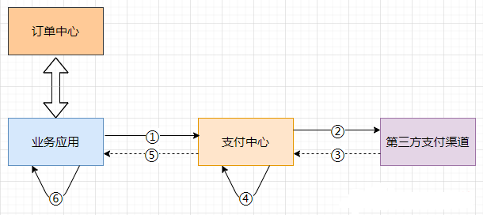
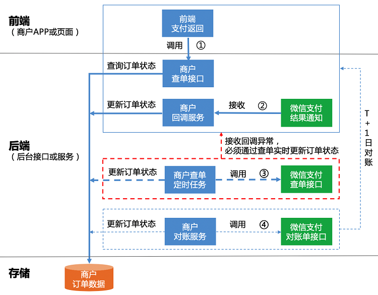
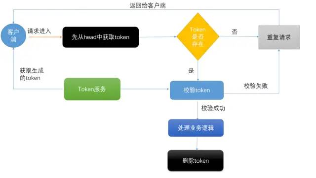

# Business


# 订单支付





* 上图一个简化的下单流程,首先是提交订单,然后是支付
* 支付一般是走支付网关(支付中心),然后支付中心与第三方支付渠道(微信、支付宝、银联)交互
* 支付成功以后,异步通知支付中心,支付中心更新自身支付订单状态,再通知业务应用,各业务再更新各自订单状态
* 这个过程中经常可能遇到的问题是掉单,无论是超时未收到回调通知也好,还是程序自身报错也好
* 总之由于各种各样的原因,没有如期收到通知并正确的处理后续逻辑等等,都会造成用户支付成功了,但是服务端这边订单状态没更新
* 这个时候有可能产生投诉,或者用户重复支付
* 由于③⑤造成的掉单称之为外部掉单,由④⑥造成的掉单我们称之为内部掉单


## 支付掉单


* 支付订单增加一个中间状态支付中,当同一个订单去支付的时候,先检查有没有状态为支付中的支付流水,当然支付的时候要加个锁,支付完成以后更新支付流水状态的时候再讲其改成支付成功状态
* 支付中心这边要自己定义一个超时时间,在此时间范围内如果没有收到支付成功回调,则应调用接口主动查询支付结果,比如10s、20s、30s查一次,如果在最大查询次数内没有查到结果,应做异常处理
* 支付中心收到支付结果以后,将结果同步给业务系统,可以发MQ,也可以直接调用,直接调用的话要加重试
* 无论是支付中心,还是业务应用,在接收支付结果通知时都要考虑接口幂等性,消息只处理一次,其余的忽略
* 业务应用也应做超时主动查询支付结果
* 超时主动查询可以在发起支付的时候将这些支付订单放到一张表中,用定时任务去扫或者使用MQ


## 订单重复提交


* 创建订单时,用订单信息计算一个哈希值,判断redis中是否有key,有则不允许重复提交,没有则生成一个新key,放到redis中设置过期时间,然后创建订单


## 库存增减


### 下单减库存


* 即用户下单成功时减少库存数量
* 优势: 用户体验友好,系统逻辑简洁
* 缺点: 会导致恶意下单或下单后却不买,使得真正有需求的用户无法购买,影响真实销量
* 解决办法: 
  * 设置订单有效时间,若订单创建成功N分钟不付款,则订单取消,库存回滚
  * 限购,用各种条件来限制买家的购买件数,比如一个账号、一个ip,只能买一件
  * 风控,从技术角度进行判断,屏蔽恶意账号,禁止恶意账号购买


### 付款减库存


* 即用户支付完成并反馈给平台后再减少库存数量
* 优势: 减少无效订单带来的资源损耗
* 缺点: 因第三方支付返回结果存在时差,同一时间多个用户同时付款成功,会导致下单数目超过库存,商家库存不足容易引发断货和投诉,成本增加
* 解决办法: 
  * 付款前再次校验库存,如确认订单要付款时再验证一次,并友好提示用户库存不足
  * 增加提示信息: 在商品详情页,订单步骤页面提示不及时付款,不能保证有库存等


### 使用场景


* 两种方式各有优缺点,需结合实际场景进行考虑.如: 秒杀、抢购、促销活动等,可使用下单减库存的方式.而对于产品库存量大,并发流量不高的产品使用付款减库存的方式


## 微信支付简易流程





# 幂等性


* 数据库建立唯一性索引,可以保证最终插入数据库的只有一条数据
* token机制,每次接口请求前先获取一个token,然后再下次请求的时候在请求的header体中加上这个token,后台进行验证,如果验证通过删除token,下次请求再次判断token
* 悲观锁或者乐观锁,悲观锁可以保证每次for update的时候其他sql无法update数据(在数据库引擎是innodb的时候,select的条件必须是唯一索引,防止锁全表)
* 先查询后判断,首先通过查询数据库是否存在数据,如果存在证明已经请求过了,直接拒绝该请求,如果没有存在,就证明是第一次进来,直接放行


## Redis实现幂等





# 白名单


* Nginx实现白名单,配置完需要重启
  * allow: 允许访问,即白名单.allow必须放在deny前面,否则会无效
  * deny: 禁止访问,即黑名单

```nginx
http{
    # http模块
    allow 192.168.1.11;
    allow 192.168.1.12;
    deny all;

    server {
        # server模块
        allow 192.168.1.11
        allow 192.168.1.12;
        deny all;

        location /api {
            # location模块
            allow 192.168.1.13;
            deny all;
        }

        location /manage {
            allow 192.168.183.89;
            deny all;
        }
    }
}
```


# MySQL与ES同步


## Canel


* 原理是伪装成 MySQL 的从节点,从而订阅 master 节点的 Binlog 日志,主要流程为
* Canal 服务端向 MySQL 的 master 节点传输 dump 协议
* MySQL 的 master 节点接收到 dump 请求后推送 Binlog 日志给 Canal 服务端,解析 Binlog 对象(原始为 byte 流)转成 Json 格式
* Canal 客户端通过 TCP 协议或 MQ 形式监听 Canal 服务端,同步数据到 ES


