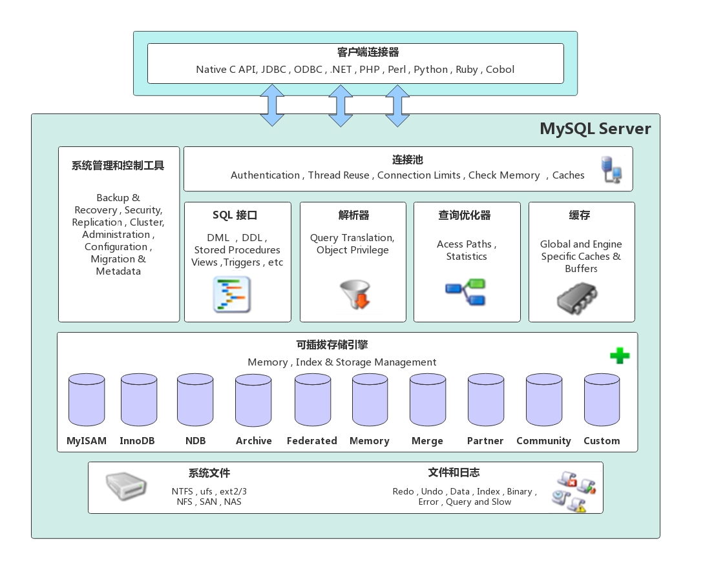
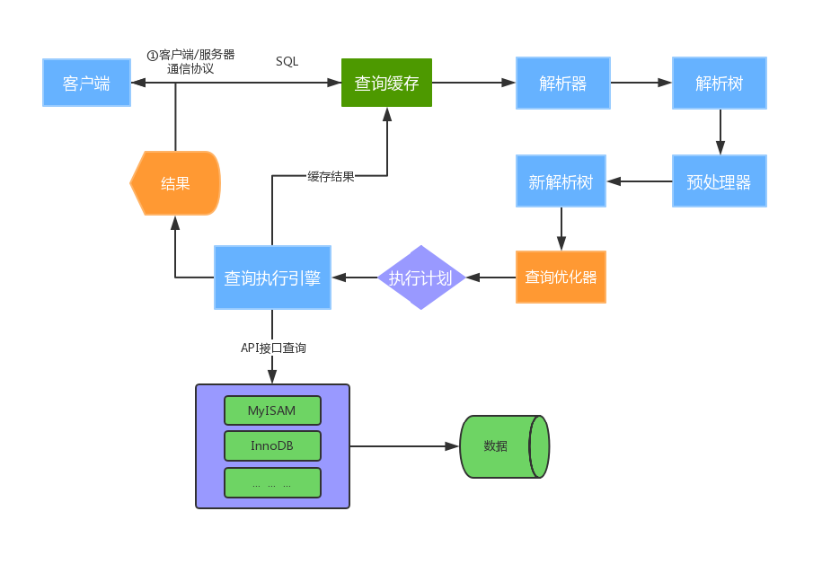
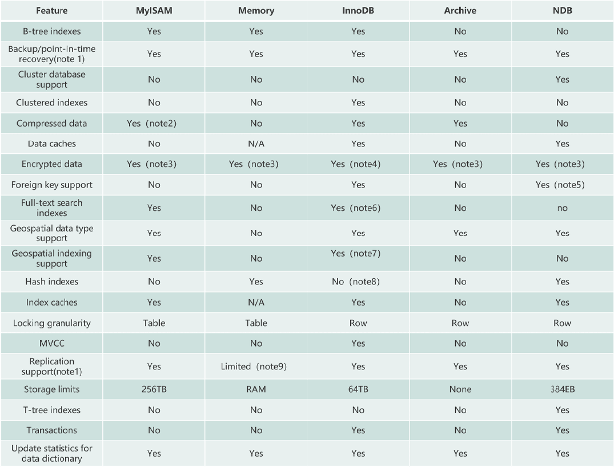
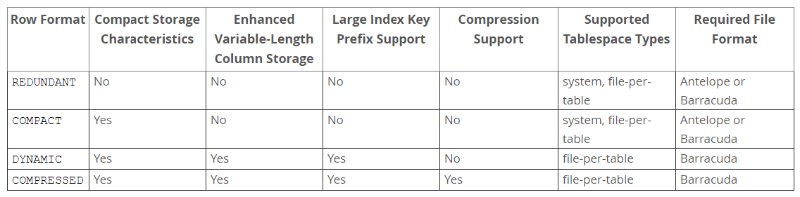
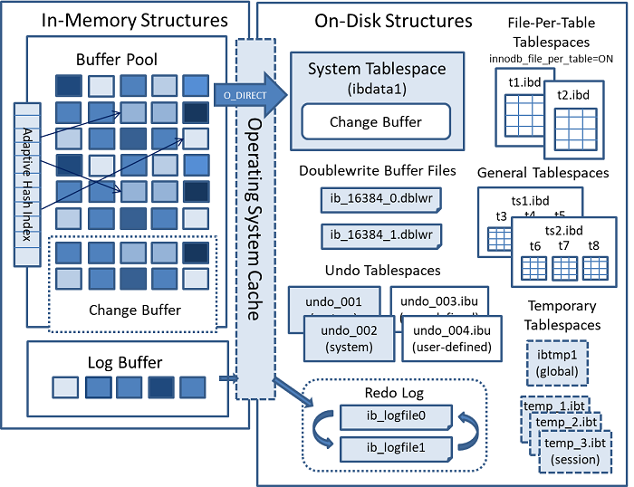
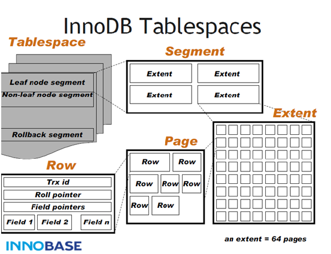
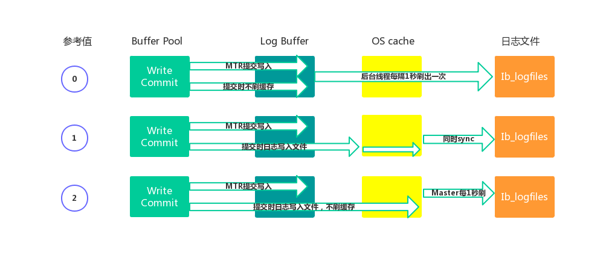
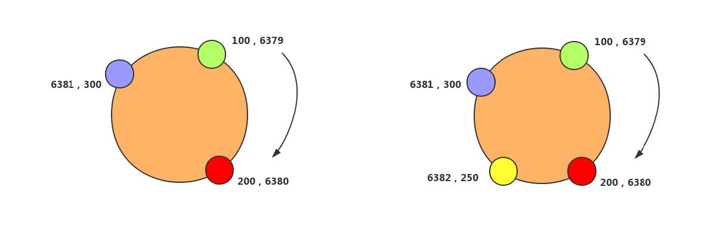

# MySQL


# 页-记录存储


## 页头

* 记录页面的控制信息,共占56个字节,包括页的左右兄弟页面指针,页面空间使用情况等


## 虚记录

* 最大虚记录:比页内最大主键还大,主要是比较主键大小
* 最小虚记录:比页内最小主键还小


## 记录堆

* 行记录存储区,分为有效记录和已删除记录两种


## 自由空间链表

* 已删除记录组成的链表


## 未分配空间

* 页面未使用的存储空间


## Slot

* 每个Slot会指向某个链表的头部,以便于二分查找


## 页尾

* 页面最后部分,占8个字节,主要存储页面的校验信息


# 页内维护记录


## 顺序保证


* 物理有序:类似数组,连续的空间存储数据,有利于读
* 逻辑有序:类似链表,有利于写数据.数据库底层使用逻辑有序


## 插入策略


* 自由空间链表:已删除记录是逻辑删除,物理地址仍然存在,当何时的值进行存储时会填入该处.如果逻辑删除的空间不使用,则数据占用空间越来越大,且很多地方无法使用,浪费空间
* 未使用空间:存储新数据


## 页内查询


* 遍历
* 二分查找


## Physical Redo


### MLOG_SINGLE_REC


* 当前日志,记录的是一个Page的一个Redo日志
* 对应操作:简单的I/U/D,Undo的Redo等
* 例如:一个Insert操作会产生3个MLOG_SINGLE_REC,分别对应:聚簇索引页;二级索引页;Undo页
* MLOG_SINGLE_REC日志,一定是有效的


### MLOG_MULTI_REC


* 当前日志,是一组日志中的一个,这一组日志,包含了多个Page的多条Redo日志
* 对应操作:I/U/D导致的索引分裂,合并;Varchar/LOB导致的链接行等
* 例如:Insert使得聚簇索引分裂,分裂操作需要涉及至少3个Page,这三个Pages上的所有修改日志,均为MLOG_MULTI_REC中的一部分
* MLOG_MULTI_REC日志组,只有当最后一条MLOG_MULTI_REC_END写出之后,才起作用;否则全部丢弃


## Logical Redo


* 逻辑Redo,不是记录页面的实际修改,而是记录修改页面的一类固定操作
* 如何写页面初始化日志:
  * 写MLOG_COMP_PAGE_CREATE日志
  * 重做此日志, 只需再次调用page0page.c::page_create方法初始化对应的Page即可
* MLOG_COMP_PAGE_CREATE;MLOG_UNDO_HDR_CREATE;MLOG_IBUF_BITMAP_INIT
* 这类动作是固定的,减少Redo的一个优化


## Mini-Transaction


* MTR,不属于事务,InnoDB内部使用,对于InnoDB内所有page的访问(I/U/D/S),都需要mini-transaction支持
* 访问page,对page加latch(只读访问:S latch;写访问:X latch)
* 修改page,写redo日志 (mtr本地缓存)
* page操作结束,提交mini-transaction (非事务提交)
  * 将redo日志写入log buffer
  * 将脏页加入Flush List链表
  * 释放页面上的 S/X latch
* 保证单page操作的原子性(读/写单一page),保证多pages操作的原子性(索引SMO/记录链出,多pages访问的原子性)


## LogBuffer


# 数据库设计规范


## 三范式


* 表中所有字段都是不可再分的,即数据库表中的字段都只有单一属性
* 单一属性的列都是由基本数据类型构成
* 设计的表都是简单的二维表
* 一个表中只有一个业务主键,即不要存在复合组件,并且非主键都依赖于业务主键
* 非主属性即不部分依赖于主键也不传递依赖主键,即非主属性列之间不能相互依赖


## 其他规范


* 每个表都要建立主键
* 禁止存储图片和二进制文件
* 不使用字符串存储日期类型,尽量使用DATETIME
* 将IP转换为INT类型存储
* VARCHAR类型定义时指定的长度是字符串长度,不是字节长度
* 避免使用TEXT,BLOB数据类型,如果一定要使用,可以建立另外的单独存储
* 避免使用枚举类型,因为有些数据库不支持,且枚举类型排序比较差
* 尽可能将所有列都设置默认值,因为null需要占用索引的额外空间
* 存储比较精准的数字类型,需要使用DECIMAL
* 禁止使用SELECT *进行查询


# MySQL体系架构





* MySQL Server架构自顶向下大致可以分网络连接层,服务层,存储引擎层和系统文件层


## 网络连接层


* 客户端连接器: Client Connectors,提供与MySQL服务器建立的支持,目前几乎支持所有主流的服务端编程技术


## 服务层


* 服务层是MySQL Server的核心,主要包含系统管理和控制工具,连接池,SQL接口,解析器,查询优化器和缓存六个部分
* 连接池: Connection Pool,负责存储和管理客户端与数据库的连接,一个线程负责管理一个连接
* 系统管理和控制工具: Management Services & Utilities,例如备份恢复,安全管理,集群管理等
* SQL接口: SQL Interface,用于接受客户端发送的各种SQL命令,并且返回用户需要查询的结果.比如DML,DDL,存储过程,视图,触发器等
* 解析器: Parser,负责将请求的SQL解析生成一个解析树,然后根据一些MySQL规则进一步检查解析树是否合法
* 查询优化器: Optimizer,当解析树通过解析器语法检查后,将交由优化器将其转化成执行计划,然后与存储引擎交互
  * 例如: `select uid,name from user where gender=1;`
  * 选取--》投影--》联接 策略
  * 1.select先根据where语句进行选取,并不是查询出全部数据再过滤
  * 2.select查询根据uid和name进行属性投影,并不是取出所有字段
  * 3.将前面选取和投影联接起来最终生成查询结果
* 缓存: Cache&Buffer,缓存机制是由一系列小缓存组成的.比如表缓存,记录缓存,权限缓存,引擎缓存等.如果查询缓存有命中的查询结果,查询语句就可以直接去查询缓存中取数据


## 存储引擎层


* Pluggable Storage Engines,负责MySQL中数据的存储与提取,与底层系统文件进行交互.
* MySQL存储引擎是插件式的,服务器中的查询执行引擎通过接口与存储引擎进行通信,接口屏蔽了不同存储引擎之间的差异


## 系统文件层


* File System,该层负责将数据库的数据和日志存储在文件系统之上,并完成与存储引擎的交互,是文件的物理存储层,主要包含日志文件,数据文件,配置文件,pid 文件,socket 文件等
* 日志文件
  * 错误日志: Error log,默认开启,可通过 `show variables like '%log_error%';`查看
  * 通用查询日志: General query log,记录一般查询语句,通过` show variables like '%general%';`查看
  * 二进制日志: binary log,记录了对MySQL数据库执行的更改操作,并且记录了语句的发生时间,执行时长.但是它不记录select,show等不修改数据库的SQL,主要用于数据库恢复和主从复制
    * `show variables like '%log_bin%';`: 检查是否binlog
    * `show variables like '%binlog%';`: 参数查看
    * `show binary logs;`: 查看日志文件
  * 慢查询日志: Slow query log,记录所有执行时间超时的查询SQL,默认是10秒
    * `show variables like '%slow_query%';`: 是否开启
    * `show variables like '%long_query_time%';`: 慢查询超时时长
* 配置文件:用于存放MySQL所有的配置信息文件,比如my.cnf(linux),my.ini(windows)等
* 数据文件
  * db.opt: 记录这个库的默认使用的字符集和校验规则
  * frm: 存储与表相关的元数据信息,包括表结构的定义信息等,每一张表都会有一个frm 文件
  * MYD: MyISAM专用,存放 MyISAM 表的数据,每一张表都会有一个.MYD 文件
  * MYI: MyISAM专用,存放 MyISAM 表的索引相关信息,每一张 MyISAM 表对应一个 .MYI 文件
  * ibd和 IBDATA: 存放 InnoDB 的数据文件,包括索引.InnoDB 存储引擎有两种表空间方式:
    * 独享表空间: 使用 .ibd 文件来存放数据,且每一张InnoDB 表对应一个 .ibd 文件
    * 共享表空间: 使用 .ibdata 文件,所有表共同使用一个(或多个,自行配置).ibdata 文件
  * ibdata1: 系统表空间数据文件,存储表元数据,Undo日志等 
  * ib_logfile0,ib_logfile1 文件: Redo log 日志文件
  * pid: 该文件是 mysqld 应用程序在 Unix/Linux 环境下的一个进程文件,它存放着自己的进程 id
  * socket: 该文件在 Unix/Linux 环境下才有,用户在 Unix/Linux 环境下客户端连接可以不通过TCP/IP 网络而直接使用 Unix Socket 来连接 MySQL


# 运行机制





## 建立连接


* Connectors&Connection Pool,通过客户端/服务器通信协议与MySQL建立连接
* MySQL 客户端与服务端的通信方式是半双工,对于每一个 MySQL 的连接,时刻都有一个线程状态来标识这个连接正在做什么
  * 全双工: 能同时发送和接收数据,例如平时打电话
  * 半双工: 指的某一时刻,要么发送数据,要么接收数据,不能同时.例如早期对讲机
  * 单工: 只能发送数据或只能接收数据.例如单行道
* 链接信息可以通过 `show processlist` 查看,具体见MySQLOpt的ProcessList


## 查询缓存


* Cache&Buffer,这是一个可优化查询的地方,如果开启了查询缓存且在查询缓存过程中查询到完全相同的SQL,则将查询结果直接返回给客户端;反之则会由解析器进行语法语义解析,并生成解析树
* 缓存过程如下:
  * 缓存Select查询的结果和SQL语句
  * 执行Select查询时,先查询缓存,判断是否存在可用的记录集,要求是否完全相同,包括参数值,这样才会匹配缓存数据命中
  * 即使开启查询缓存,以下SQL也不能缓存
    * 查询语句使用SQL_NO_CACHE
    * 查询的结果大于query_cache_limit设置
    * 查询中有一些不确定的参数,比如now()
* `show variables like '%query_cache%';`: 查看查询缓存是否启用,空间大小,限制等
* `show status like 'Qcache%';`: 查看更详细的缓存参数,可用缓存空间,缓存块,缓存多少等


## 解析器


* Parser,将客户端发送的SQL进行语法语义解析,生成解析树


## 预处理器


* 根据MySQL规则进一步检查解析树是否合法,例如检查数据表和数据列是否存在,解析名字和别名,看看是否有歧义,最后生成新的解析树


## 查询优化器


* Optimizer,根据解析树生成最优的执行计划
* MySQL使用很多优化策略生成最优的执行计划,可以分为两类: 静态优化(编译时优化),动态优化(运行时优化)
* 等价变换策略
  * 5=5 and a>5 改成 a > 5
  * a < b and a=5 改成b>5 and a=5
  * 基于联合索引,调整条件位置等
* 优化count,min,max等函数
  * InnoDB引擎min函数只需要找索引最左边
  * InnoDB引擎max函数只需要找索引最右边
  * MyISAM引擎count(*),不需要计算,直接返回
* 提前终止查询.使用了limit查询,获取limit所需的数据,就不在继续遍历后面数据
* in的优化:MySQL对in查询,会先进行排序,再采用二分法查找数据.比如where id in (2,1,3),变成 in (1,2,3)


## 查询执行引擎


* 负责执行 SQL 语句,此时查询执行引擎会根据 SQL 语句中表的存储引擎类型,以及对应的API接口与底层存储引擎缓存或者物理文件的交互,得到查询结果并返回给客户端
* 若开启查询缓存,这时会将SQL 语句和结果完整地保存到查询缓存中,以后若有相同的 SQL 语句执行则直接返回结果
* 如果返回结果过多,采用增量模式返回


# 数据库引擎


> 主要介绍MyISAM和InnoDB,还有其他类型,用的不多.mysql5.5之前默认是MyISAM,之后是InnoDB

* show engines:查看所有引擎类型
* show variables like '%storage_engine%':查看所有表所用引擎类型


## MyISAM


### 概述


* 不支持外键,不支持事务
* 只能表锁,即使操作一条数据时也会锁住整个表,不适合高并发
* 读写互相阻塞:写入的时候肯定是都阻塞的,读的时候也阻塞写,但不阻塞另外的读
* 只缓存索引,不缓存真实数据
* 读取速度较快,占用资源较少
* 不支持外键约束,但支持全文索引
* 表空间小


### 适用场景


* 适用于不需要事务的生产场景,一般是读数据比较多的应用
* 并发相对较低的业务
* 数据一致性要求不是很高的业务
* 数据修改相对较少,以读为主


### 优化


* 设置合适的索引
* 调整速写优先级,根据实际需求确保重要操作更优先执行
* 启用延迟插入改善大批量写入性能,降低写入频率,尽可能多条数据一次性写入
* 尽量顺序操作让insert数据都写入到末尾,减少阻塞
* 分解大的时间长的操作,降低单个操作的阻塞时间
* 降低并发数,减少对Mysql的访问,某些高并发场景通过应用进行排队机制
* 对于相对静态(更改不频繁)的数据库数据,充分利用query cache或redis缓存服务提高访问效率
* MyISAM的count只有在全表扫描到时候效率比较高,带有其他条件的的count都需要进行实际的数据访问


## InnoDB


###  概述


* 支持外键,支持事务,支持多版本读
* 行锁,操作时只锁某一行,不对其他行有影响,适合高并发,通过索引实现.但是全表扫描时仍然会升级成表锁,同时需要注意间隙锁的影响
* 读写阻塞与事务的隔离级别相关
* 不仅缓存索引还缓存真实数据,对内存要求较高,而且内存大小对性能有决定性的影响
* 支持分区和表空间
* 整个表和主键以cluster方式存储,组成一颗平衡树
* 所有secondary index都会保存主键信息


### 适用场景


* 需要事务支持的业务,具有较好的事务特性
* 行级锁定对高并发有很好的适应能力,但需要确保查询是通过索引完成
* 数据读写以及更新比较频繁的场景
* 数据一致性高的业务
* 硬件设备内存较大,可以利用InnoDB较好的缓存能力来提高内存利用率,减少磁盘IO


### 优化

* 主键尽可能小,避免给secondary index带来过大的空间负担
* 避免全表扫描,会使用表锁
* 尽可能缓存所有的索引和数据,提高响应速度,减少磁盘IO消耗
* 在大批量小插入的时候,尽量自己控制事务而不要使用自动提交
* 合理设置innodb_flush_log_at_trx_commit(日志刷到磁盘上)参数,不要过度追求安全性
* 避免主键更新,因为这会带来大量的数据移动


## 对比


* 事务和外键
  * InnoDB支持事务和外键,具有安全性和完整性,适合大量insert或update操作
  * MyISAM不支持事务和外键,它提供高速存储和检索,适合大量的select查询操作
* 锁机制
  * InnoDB支持行级锁,锁定指定记录,基于索引来加锁实现
  * MyISAM支持表级锁,锁定整张表
* 索引结构
  * InnoDB使用聚集索引(聚簇索引),索引和记录在一起存储,既缓存索引,也缓存记录
  * MyISAM使用非聚集索引(非聚簇索引),索引和记录分开
* 并发处理能力
  * InnoDB读写阻塞可以与隔离级别有关,可以采用多版本并发控制(MVCC)来支持高并发
  * MyISAM使用表锁,会导致写操作并发率低,读之间并不阻塞,读写阻塞
* 存储文件
  * InnoDB表对应两个文件,一个.frm表结构文件,一个.ibd数据文件,表最大支持64TB
  * MyISAM表对应三个文件,一个.frm表结构文件,一个MYD表数据文件,一个.MYI索引文件,表最大支持256TB


## 引擎对比





# InnoDB存储结构


* 从MySQL 5.5版本开始默认使用InnoDB作为引擎,它擅长处理事务,具有自动崩溃恢复的特性,主要分为内存结构和磁盘结构两大部分


## 内存结构


* 内存结构主要包括Buffer Pool,Change Buffer,Adaptive Hash Index和Log Buffer四大组件


### Buffer Pool


* 缓冲池(BP),BP以Page页为单位,默认大小16K,BP的底层采用链表数据结构管理Page
* 在InnoDB访问表记录和索引时会在Page页中缓存,以后使用可以减少磁盘IO操作,提升效率


#### Page管理机制


* Page根据状态可以分为三种类型:
  * free page: 空闲page,未被使用
  * clean page: 被使用page,数据没有被修改过
  * dirty page: 脏页,被使用page,数据被修改过,页中数据和磁盘的数据产生了不一致
* 针对上述三种page类型,InnoDB通过三种链表结构来维护和管理
  * free list: 表示空闲缓冲区,管理free page
  * flush list: 表示需要刷新到磁盘的缓冲区,管理dirty page,内部page按修改时间排序.脏页即存在于flush链表,也在LRU链表中,但是两种互不影响,LRU链表负责管理page的可用性和释放,而flush链表负责管理脏页的刷盘操作
  * lru list: 表示正在使用的缓冲区,管理clean page和dirty page,缓冲区以midpoint为基点,前面链表称为new列表区,存放经常访问的数据,占63%;后面的链表称为old列表区,存放使用较少数据,占37%


#### 改进型LRU算法


* 普通LRU: 末尾淘汰法,新数据从链表头部加入,释放空间时从末尾淘汰
* 改性LRU: 链表分为new和old两个部分,加入元素时并不是从表头插入,而是从中间midpoint位置插入,如果数据很快被访问,那么page就会向new列表头部移动,如果数据没有被访问,会逐步向old尾部移动,等待淘汰
* 每当有新的page数据读取到buffer pool时,InnoDb引擎会判断是否有空闲页,是否足够,如果有就将free page从free list列表删除,放入到LRU列表中;没有空闲页,就会根据LRU算法淘汰LRU链表默认的页,将内存空间释放分配给新的页


#### 配置参数


* `show variables like '%innodb_page_size%';`: 查看page页大小
* `show variables like '%innodb_old%';`: 查看lru list中old列表参数
* `show variables like '%innodb_buffer%';`: 查看buffer pool参数
* 建议将innodb_buffer_pool_size设置为总内存大小的60%-80%,innodb_buffer_pool_instances可以设置为多个,这样可以避免缓存争夺


### Change Buffer


* 写缓冲区,简称CB,在进行DML操作时,如果BP没有其相应的Page数据,并不会立刻将磁盘页加载到缓冲池,而是在CB记录缓冲变更,等未来数据被读取时,再将数据合并恢复到BP中
* ChangeBuffer占用BufferPool空间,默认占25%,最大允许占50%,可以根据读写业务量来调整(innodb_change_buffer_max_size)
* 当更新一条记录时,该记录在BufferPool存在,直接在BufferPool修改,一次内存操作
* 如果该记录在BufferPool不存在(没有命中),会直接在ChangeBuffer进行一次内存操作,不用再去磁盘查询数据,避免一次磁盘IO
* 当下次查询记录时,会先进性磁盘读取,然后再从ChangeBuffer中读取信息合并,最终载入BufferPool中
* 写缓冲区,仅适用于非唯一普通索引页,为什么?
  * 如果在索引设置唯一性,在进行修改时,InnoDB必须要做唯一性校验,因此必须查询磁盘,做一次IO操作
  * 会直接将记录查询到BufferPool中,然后在缓冲池修改,不会在ChangeBuffer操作


### Adaptive Hash Index


* 自适应哈希索引,用于优化对BP数据的查询
* InnoDB存储引擎会监控对表索引的查找,如果观察到建立哈希索引可以带来速度的提升,则建立哈希索引,所以称之为自适应
* InnoDB存储引擎会自动根据访问的频率和模式来为某些页建立哈希索引


### Log Buffer


* 日志缓冲区,用来保存要写入磁盘上log文件(Redo/Undo)的数据,日志缓冲区的内容定期刷新到磁盘log文件中
* 日志缓冲区满时会自动将其刷新到磁盘,当遇到BLOB或多行更新的大事务操作时,增加日志缓冲区可以节省磁盘I/O
* LogBuffer主要是用于记录InnoDB引擎日志,在DML操作时会产生Redo和Undo日志
* LogBuffer空间满了,会自动写入磁盘,可以通过将innodb_log_buffer_size参数调大,减少磁盘IO频率
* innodb_flush_log_at_trx_commit参数控制日志刷新行为,默认为1
  * 0: 每隔1秒写日志文件和刷盘操作(写日志文件LogBuffer-->OS cache,刷盘OScache-->磁盘文件),最多丢失1秒数据
  * 1: 事务提交,立刻写日志文件和刷盘,数据不丢失,但是会频繁IO操作
  * 2: 事务提交,立刻写日志文件,每隔1秒钟进行刷盘操作


## 磁盘结构


* InnoDB磁盘主要包含Tablespaces,InnoDB Data Dictionary,Doublewrite Buffer,Redo Log和Undo Logs


### 表空间


* Tablespaces,用于存储表结构和数据.
* 表空间又分为系统表空间,独立表空间,通用表空间,临时表空间,Undo表空间等多种类型


#### 系统表空间


* The System Tablespace,包含InnoDB数据字典,Doublewrite Buffer,Change Buffer,Undo Logs的存储区域
* 系统表空间也默认包含任何用户在系统表空间创建的表数据和索引数据
* 系统表空间是一个共享的表空间因为它是被多个表共享的
* 该空间的数据文件通过参数innodb_data_file_path控制,默认值是ibdata1:12M:autoextend(文件名为ibdata1,12MB,自动扩展)


#### 独立表空间


* File-Per-Table Tablespaces,默认开启,独立表空间是一个单表表空间,该表创建于自己的数据文件中,而非创建于系统表空间中
* 当innodb_file_per_table选项开启时,表将被创建于表空间中,否则,innodb将被创建于系统表空间中
* 每个表文件表空间由一个.ibd数据文件代表,该文件默认被创建于数据库目录中
* 表空间的表文件支持动态(dynamic)和压缩(commpressed)行格式


#### 通用表空间


* General Tablespaces,通用表空间为通过create tablespace语法创建的共享表空间

* 通用表空间可以创建于mysql数据目录外的其他表空间,其可以容纳多张表,且其支持所有的行格式

  ```mysql
  --  创建表空间ts1
  CREATE TABLESPACE ts1 ADD DATAFILE ts1.ibd Engine=InnoDB;
  --  将表添加到ts1表空间
  CREATE TABLE t1 (c1 INT PRIMARY KEY) TABLESPACE ts1;
  ```


#### 撤销表空间


* Undo Tablespaces,撤销表空间由一个或多个包含Undo日志文件组成
* 在MySQL 5.7版本之前Undo占用的是System Tablespace共享区,从5.7开始将Undo从System Tablespace分离了出来
* InnoDB使用的undo表空间由innodb_undo_tablespaces配置选项控制,默认为0:
  * 0: 表示使用系统表空间ibdata1
  * 大于0: 表示使用undo表空间undo_001,undo_002等


#### 临时表空间


* Temporary Tablespaces,分为session temporary tablespaces 和global temporary tablespace:
  * session temporary tablespaces: 存储的是用户创建的临时表和磁盘内部的临时表
  * global temporary tablespace: 储存用户临时表的回滚段(rollback segments )
* mysql服务器正常关闭或异常终止时,临时表空间将被移除,每次启动时会被重新创建


### 数据字典


* InnoDB Data Dictionary,InnoDB数据字典由内部系统表组成,这些表包含用于查找表,索引和表字段等对象的元数据
* 元数据物理上位于InnoDB系统表空间中,由于历史原因,数据字典元数据在一定程度上与InnoDB表元数据文件(.frm文件)中存储的信息重叠


### 双写缓冲区


* Doublewrite Buffer,位于系统表空间,是一个存储区域
* 在BufferPage的page页刷新到磁盘真正的位置前,会先将数据存在Doublewrite 缓冲区
* 如果在page页写入过程中出现操作系统,存储子系统或mysqld进程崩溃,InnoDB可以在崩溃恢复期间从Doublewrite 缓冲区中找到页面的一个好备份
* 在大多数情况下,默认情况下启用双写缓冲区,要禁用Doublewrite 缓冲区,可以将innodb_doublewrite设置为0
* 使用Doublewrite 缓冲区时建议将innodb_flush_method设置为O_DIRECT
* MySQL的innodb_flush_method参数控制着innodb数据文件及redo log的打开,刷写模式,有三个值:
  * fdatasync(默认):表示先写入操作系统缓存,然后再调用fsync()函数去异步刷数据文件与redo log的缓存信息
  * O_DSYNC
  * O_DIRECT: 表示数据文件写入操作会通知操作系统不要缓存数据,也不要用预读,直接从InnodbBuffer写到磁盘文件


### 重做日志


* Redo Log,重做日志是一种基于磁盘的数据结构,用于在崩溃恢复期间更正不完整事务写入的数据
* MySQL以循环方式写入重做日志文件,记录InnoDB中所有对Buffer Pool修改的日志
* 当出现实例故障(像断电),导致数据未能更新到数据文件,则数据库重启时须redo,重新把数据更新到数据文件
* 读写事务在执行的过程中,都会不断的产生redo log
* 默认情况下,重做日志在磁盘上由两个名为ib_logfile0和ib_logfile1的文件物理表示


### 撤销日志


* Undo Logs,撤消日志是在事务开始之前保存的被修改数据的备份,用于例外情况时回滚事务
* 撤消日志属于逻辑日志,根据每行记录进行记录
* 撤消日志存在于系统表空间,撤消表空间和临时表空间中


## 新版本结构演变


### MySQL 5.7


* 将 Undo日志表空间从共享表空间 ibdata 文件中分离出来,可以在安装 MySQL 时由用户自行指定文件大小和数量
* 增加了 temporary 临时表空间,里面存储着临时表或临时查询结果集的数据
* Buffer Pool 大小可以动态修改,无需重启数据库实例


### MySQL 8.0


* 将InnoDB表的数据字典和Undo都从共享表空间ibdata中彻底分离出来了,以前需要ibdata中数据字典与独立表空间ibd文件中数据字典一致才行,8.0版本就不需要了
* temporary 临时表空间也可以配置多个物理文件,而且均为 InnoDB 存储引擎并能创建索引,这样加快了处理的速度
* 用户可以像 Oracle 数据库那样设置一些表空间,每个表空间对应多个物理文件,每个表空间可以给多个表使用,但一个表只能存储在一个表空间中
* 将Doublewrite Buffer从共享表空间ibdata中也分离出来了


# InnoDB线程模型


## IO Thread


* 在InnoDB中使用了大量的AIO(Async IO)来做读写处理,这样可以极大提高数据库的性能
* 在InnoDB1.0版本之前共有4个IO Thread,分别是write,read,insert buffer和log thread,后来版本将read thread和write thread分别增大到了4个,一共有10个了
  * read thread: 负责读取操作,将数据从磁盘加载到缓存page页.4个
  * write thread: 负责写操作,将缓存脏页刷新到磁盘.4个
  * log thread: 负责将日志缓冲区内容刷新到磁盘.1个
  * insert buffer thread: 负责将写缓冲内容刷新到磁盘.1个


## Purge Thread


* 事务提交之后,其使用的undo日志将不再需要,因此需要Purge Thread回收已经分配的undo页
* `show variables like '%innodb_purge_threads%';`: 查看配置


## Page Cleaner Thread


* 作用是将脏数据刷新到磁盘,脏数据刷盘后相应的redo log也就可以覆盖,即可以同步数据,又能达到redo log循环使用的目的,会调用write thread线程处理
* `show variables like '%innodb_page_cleaners%';`: 查看配置


## Master Thread


* Master thread是InnoDB的主线程,负责调度其他各线程,优先级最高
* 作用是将缓冲池中的数据异步刷新到磁盘 ,保证数据的一致性,包含: 脏页的刷新(page cleaner thread),undo页回收(purge thread),redo日志刷新(log thread),合并写缓冲等
* 该线程内部有两个主处理,分别是每隔1秒和10秒处理:
  * 每1秒的操作: 
    * 刷新日志缓冲区,刷到磁盘
    * 合并写缓冲区数据,根据IO读写压力来决定是否操作
    * 刷新脏页数据到磁盘,根据脏页比例达到75%才操作(innodb_max_dirty_pages_pct,innodb_io_capacity)
  * 每10秒的操作: 
    * 刷新脏页数据到磁盘
    * 合并写缓冲区数据
    * 刷新日志缓冲区
    * 删除无用的undo页


# InnoDB数据文件


## 文件存储结构


### 数据文件存储结构


* 分为一个ibd数据文件-->Segment(段)-->Extent(区)-->Page(页)-->Row(行)


#### Tablesapce


* 表空间,用于存储多个ibd数据文件,用于存储表的记录和索引。一个文件包含多个段


#### Segment


* 段,用于管理多个Extent,分为数据段(Leaf node segment),索引段(Non-leaf nodesegment),回滚段(Rollback segment)
* 一个表至少会有两个segment,一个管理数据,一个管理索引。每多创建一个索引,会多两个segment


#### Extent


* 区,一个区固定包含64个连续的页,大小为1M.当表空间不足,需要分配新的页资源,不会一页一页分,直接分配一个区


#### Page


* 页,用于存储多个Row行记录,大小为16K.包含很多种页类型,比如数据页,undo页,系统页,事务数据页,大的BLOB对象页

Row
行,包含了记录的字段值,事务ID(Trx id),滚动指针(Roll pointer),字段指针(Field
pointers)等信息。
Page是文件最基本的单位,无论何种类型的page,都是由page header,page trailer和page
body组成。如下图所示,


## 文件存储格式


通过 SHOW TABLE STATUS 命令


一般情况下,如果row_format为REDUNDANT,COMPACT,文件格式为Antelope；如果
row_format为DYNAMIC和COMPRESSED,文件格式为Barracuda。
通过 information_schema 查看指定表的文件格式
select * from information_schema.innodb_sys_tables;


## File文件格式(File-Format)

在早期的InnoDB版本中,文件格式只有一种,随着InnoDB引擎的发展,出现了新文件格式,用于
支持新的功能。目前InnoDB只支持两种文件格式: Antelope 和 Barracuda。
Antelope: 先前未命名的,最原始的InnoDB文件格式,它支持两种行格式: COMPACT和
REDUNDANT,MySQL 5.6及其以前版本默认格式为Antelope。
Barracuda: 新的文件格式。它支持InnoDB的所有行格式,包括新的行格式: COMPRESSED
和 DYNAMIC。
通过innodb_file_format 配置参数可以设置InnoDB文件格式,之前默认值为Antelope,5.7版本
开始改为Barracuda。

## Row行格式(Row_format)

表的行格式决定了它的行是如何物理存储的,这反过来又会影响查询和DML操作的性能。如果在
单个page页中容纳更多行,查询和索引查找可以更快地工作,缓冲池中所需的内存更少,写入更
新时所需的I/O更少。
InnoDB存储引擎支持四种行格式: REDUNDANT,COMPACT,DYNAMIC和COMPRESSED。





DYNAMIC和COMPRESSED新格式引入的功能有: 数据压缩,增强型长列数据的页外存储和大索引

前缀。
每个表的数据分成若干页来存储,每个页中采用B树结构存储；
如果某些字段信息过长,无法存储在B树节点中,这时候会被单独分配空间,此时被称为溢出页,
该字段被称为页外列。
REDUNDANT 行格式
使用REDUNDANT行格式,表会将变长列值的前768字节存储在B树节点的索引记录中,其余
的存储在溢出页上。对于大于等于786字节的固定长度字段InnoDB会转换为变长字段,以便
能够在页外存储。
COMPACT 行格式
与REDUNDANT行格式相比,COMPACT行格式减少了约20%的行存储空间,但代价是增加了
某些操作的CPU使用量。如果系统负载是受缓存命中率和磁盘速度限制,那么COMPACT格式
可能更快。如果系统负载受到CPU速度的限制,那么COMPACT格式可能会慢一些。
DYNAMIC 行格式
使用DYNAMIC行格式,InnoDB会将表中长可变长度的列值完全存储在页外,而索引记录只
包含指向溢出页的20字节指针。大于或等于768字节的固定长度字段编码为可变长度字段。
DYNAMIC行格式支持大索引前缀,最多可以为3072字节,可通过innodb_large_prefix参数
控制。
COMPRESSED 行格式
COMPRESSED行格式提供与DYNAMIC行格式相同的存储特性和功能,但增加了对表和索引
数据压缩的支持。
在创建表和索引时,文件格式都被用于每个InnoDB表数据文件(其名称与*.ibd匹配)。修改文件
格式的方法是重新创建表及其索引,最简单方法是对要修改的每个表使用以下命令: 
ALTER TABLE 表名 ROW_FORMAT=格式类型;


Undo Log
3.5.1 Undo Log介绍
Undo: 意为撤销或取消,以撤销操作为目的,返回指定某个状态的操作。
Undo Log: 数据库事务开始之前,会将要修改的记录存放到 Undo 日志里,当事务回滚时或者数
据库崩溃时,可以利用 Undo 日志,撤销未提交事务对数据库产生的影响。
Undo Log产生和销毁: Undo Log在事务开始前产生；事务在提交时,并不会立刻删除undo
log,innodb会将该事务对应的undo log放入到删除列表中,后面会通过后台线程purge thread进
行回收处理。Undo Log属于逻辑日志,记录一个变化过程。例如执行一个delete,undolog会记
录一个insert；执行一个update,undolog会记录一个相反的update。
Undo Log存储: undo log采用段的方式管理和记录。在innodb数据文件中包含一种rollback
segment回滚段,内部包含1024个undo log segment。可以通过下面一组参数来控制Undo log存
储。
3.5.2 Undo Log作用
实现事务的原子性
Undo Log 是为了实现事务的原子性而出现的产物。事务处理过程中,如果出现了错误或者用户执
行了 ROLLBACK 语句,MySQL 可以利用 Undo Log 中的备份将数据恢复到事务开始之前的状态。
实现多版本并发控制(MVCC)

Undo Log 在 MySQL InnoDB 存储引擎中用来实现多版本并发控制。事务未提交之前,Undo Log
保存了未提交之前的版本数据,Undo Log 中的数据可作为数据旧版本快照供其他并发事务进行快
照读。




事务A手动开启事务,执行更新操作,首先会把更新命中的数据备份到 Undo Buffer 中。
事务B手动开启事务,执行查询操作,会读取 Undo 日志数据返回,进行快照读


3.6 Redo Log和Binlog
Redo Log和Binlog是MySQL日志系统中非常重要的两种机制,也有很多相似之处,下面介绍下两者细
节和区别。
3.6.1 Redo Log日志
Redo Log介绍

Redo: 顾名思义就是重做。以恢复操作为目的,在数据库发生意外时重现操作。
Redo Log: 指事务中修改的任何数据,将最新的数据备份存储的位置(Redo Log),被称为重做
日志。
Redo Log 的生成和释放: 随着事务操作的执行,就会生成Redo Log,在事务提交时会将产生
Redo Log写入Log Buffer,并不是随着事务的提交就立刻写入磁盘文件。等事务操作的脏页写入
到磁盘之后,Redo Log 的使命也就完成了,Redo Log占用的空间就可以重用(被覆盖写入)。
Redo Log工作原理
Redo Log 是为了实现事务的持久性而出现的产物。防止在发生故障的时间点,尚有脏页未写入表
的 IBD 文件中,在重启 MySQL 服务的时候,根据 Redo Log 进行重做,从而达到事务的未入磁盘
数据进行持久化这一特性。


Redo Log写入机制
Redo Log 文件内容是以顺序循环的方式写入文件,写满时则回溯到第一个文件,进行覆盖写





如图所示: 
write pos 是当前记录的位置,一边写一边后移,写到最后一个文件末尾后就回到 0 号文件开
头；

checkpoint 是当前要擦除的位置,也是往后推移并且循环的,擦除记录前要把记录更新到数
据文件；
write pos 和 checkpoint 之间还空着的部分,可以用来记录新的操作。如果 write pos 追上
checkpoint,表示写满,这时候不能再执行新的更新,得停下来先擦掉一些记录,把 checkpoint
推进一下。
Redo Log相关配置参数
每个InnoDB存储引擎至少有1个重做日志文件组(group),每个文件组至少有2个重做日志文
件,默认为ib_logfile0和ib_logfile1。可以通过下面一组参数控制Redo Log存储: 
Redo Buffer 持久化到 Redo Log 的策略,可通过 Innodb_flush_log_at_trx_commit 设置: 
0: 每秒提交 Redo buffer ->OS cache -> flush cache to disk,可能丢失一秒内的事务数
据。由后台Master线程每隔 1秒执行一次操作。
1(默认值): 每次事务提交执行 Redo Buffer -> OS cache -> flush cache to disk,最安
全,性能最差的方式。
2: 每次事务提交执行 Redo Buffer -> OS cache,然后由后台Master线程再每隔1秒执行OS
cache -> flush cache to disk 的操作。
一般建议选择取值2,因为 MySQL 挂了数据没有损失,整个服务器挂了才会损失1秒的事务提交数
据。





3.6.2 Binlog日志
Binlog记录模式
Redo Log 是属于InnoDB引擎所特有的日志,而MySQL Server也有自己的日志,即 Binary
log(二进制日志),简称Binlog。Binlog是记录所有数据库表结构变更以及表数据修改的二进制
日志,不会记录SELECT和SHOW这类操作。Binlog日志是以事件形式记录,还包含语句所执行的
消耗时间。开启Binlog日志有以下两个最重要的使用场景。
主从复制: 在主库中开启Binlog功能,这样主库就可以把Binlog传递给从库,从库拿到
Binlog后实现数据恢复达到主从数据一致性。
数据恢复: 通过mysqlbinlog工具来恢复数据。
Binlog文件名默认为“主机名_binlog-序列号”格式,例如oak_binlog-000001,也可以在配置文件
中指定名称。文件记录模式有STATEMENT,ROW和MIXED三种,具体含义如下。
ROW(row-based replication, RBR): 日志中会记录每一行数据被修改的情况,然后在
slave端对相同的数据进行修改。
优点: 能清楚记录每一个行数据的修改细节,能完全实现主从数据同步和数据的恢复。
缺点: 批量操作,会产生大量的日志,尤其是alter table会让日志暴涨


STATMENT(statement-based replication, SBR): 每一条被修改数据的SQL都会记录到
master的Binlog中,slave在复制的时候SQL进程会解析成和原来master端执行过的相同的
SQL再次执行。简称SQL语句复制。
优点: 日志量小,减少磁盘IO,提升存储和恢复速度
缺点: 在某些情况下会导致主从数据不一致,比如last_insert_id(),now()等函数。
MIXED(mixed-based replication, MBR): 以上两种模式的混合使用,一般会使用
STATEMENT模式保存binlog,对于STATEMENT模式无法复制的操作使用ROW模式保存
binlog,MySQL会根据执行的SQL语句选择写入模式。
Binlog文件结构
MySQL的binlog文件中记录的是对数据库的各种修改操作,用来表示修改操作的数据结构是Log
event。不同的修改操作对应的不同的log event。比较常用的log event有: Query event,Row
event,Xid event等。binlog文件的内容就是各种Log event的集合。
Binlog文件中Log event结构如下图所示: 


Binlog写入机制
根据记录模式和操作触发event事件生成log event(事件触发执行机制)
将事务执行过程中产生log event写入缓冲区,每个事务线程都有一个缓冲区
Log Event保存在一个binlog_cache_mngr数据结构中,在该结构中有两个缓冲区,一个是
stmt_cache,用于存放不支持事务的信息；另一个是trx_cache,用于存放支持事务的信息。
事务在提交阶段会将产生的log event写入到外部binlog文件中。
不同事务以串行方式将log event写入binlog文件中,所以一个事务包含的log event信息在
binlog文件中是连续的,中间不会插入其他事务的log event。
Binlog文件操作
Binlog状态查看

show variables like 'log_bin';


开启Binlog功能

mysql> set global log_bin=mysqllogbin;
ERROR 1238 (HY000): Variable 'log_bin' is a read only variable


需要修改my.cnf或my.ini配置文件,在[mysqld]下面增加log_bin=mysql_bin_log,重启
MySQL服务。


#log-bin=ON
#log-bin-basename=mysqlbinlog
binlog-format=ROW
log-bin=mysqlbinlog


使用show binlog events命令

show binary logs; //等价于show master logs;
show master status;
show binlog events;
show binlog events in 'mysqlbinlog.000001';


使用mysqlbinlog 命令

mysqlbinlog "文件名"
mysqlbinlog "文件名" > "test.sql"


使用 binlog 恢复数据

//按指定时间恢复
mysqlbinlog --start-datetime="2020-04-25 18:00:00" --stopdatetime="
2020-04-26 00:00:00" mysqlbinlog.000002 | mysql -uroot -p1234
//按事件位置号恢复
mysqlbinlog --start-position=154 --stop-position=957 mysqlbinlog.000002
| mysql -uroot -p1234


mysqldump: 定期全部备份数据库数据。mysqlbinlog可以做增量备份和恢复操作。
删除Binlog文件

purge binary logs to 'mysqlbinlog.000001'; //删除指定文件
purge binary logs before '2020-04-28 00:00:00'; //删除指定时间之前的文件
reset master; //清除所有文件


可以通过设置expire_logs_days参数来启动自动清理功能。默认值为0表示没启用。设置为1表示超
出1天binlog文件会自动删除掉。
Redo Log和Binlog区别
Redo Log是属于InnoDB引擎功能,Binlog是属于MySQL Server自带功能,并且是以二进制
文件记录。
Redo Log属于物理日志,记录该数据页更新状态内容,Binlog是逻辑日志,记录更新过程。
Redo Log日志是循环写,日志空间大小是固定,Binlog是追加写入,写完一个写下一个,不
会覆盖使用。


Redo Log作为服务器异常宕机后事务数据自动恢复使用,Binlog可以作为主从复制和数据恢
复使用。Binlog没有自动crash-safe能力。


# InnoDB内存管理


* 页面装载:预分配内存空间,使用内存加载部分数据,存储引擎从内存中查找数据
  * 内存池

* 数据以页为单位加载
  * 页面动态映射
  * 页面数据管理
    * 空闲页:没有数据的页
    * 数据页:写入了数据的页,和磁盘上的数据一致,也称为干净页
    * 脏页:页上的数据和磁盘上的数据不一致

* 数据淘汰
  * 内存页都被使用
  * 需要加载新数据
* 数据内外存交换:磁盘和内存中数据的交互


## 组成


* Disk File:磁盘
* Page Hash表:维护内存Page和磁盘文件Page的映射关系
* Buffer Pool:预分配的内存池
* Page:Buffer Pool的最小单位
* Free List:空闲Page组成的链表,即还没有使用的空间
* Flush List:脏页组成的链表
* LRU:内存淘汰算法


## 页面装载


* 主要是将磁盘数据加载到内存中
* 先从空闲链表中取出空闲页,将数据写入到空闲页中,使该空闲页变为数据页
* 如果空闲页链表中没有空闲页,则使用LRU算法淘汰数据页
* 从LRU_OLD尾部往前查找.如果尾部正在使用,不能淘汰,则往前找到脏页进行淘汰
  * Free List中取页->LRU中淘汰冷表尾部数据->LRU Flush
* 将当前数据页从空闲页链表中剔除,插入到冷链表中
* 将映射磁盘内存映射关系写入Page Hash


## 页面淘汰


* 如上图所示,在热点链表中,每次访问的新数据都会被移动到链表头部,新页也会被加载到头部


### LRU


* LRU:最久没有使用的页被淘汰,同时将最近访问的数据放到表头
* LRU_NEW:热点数据链表
* LRU_OLD:冷数据链表
* MidPoint:区分冷表,热表数据,是一个指针.默认冷热占比为3:5,而MidPoint只指向5/8处
* LRU尾部淘汰:默认从冷表尾部进行淘汰
* Flush LRU淘汰:LRU冷表中尾部数据无法释放,则将第一个脏页刷盘并释放.先将页数据写到磁盘上,再释放页,将页放到Free List中.写完新数据后再将数据页放到冷表头部

* 全表扫描:会将表中数据全部加载到内存中,造成内存污染,将原来的热点数据淘汰
* 如何避免热数据被淘汰
  * 访问时间+频率
  * 建立2个LRU表:一个热数据表,一个冷数据表.当数据频率发生变化时,可以将2个表的数据交互


### 冷链表到热链表

* innodb_old_blocks_time:old区存活时间,大于该值,则数据页**有机会**进入热链表,默认1S


### 热链表到冷链表

* MidPoint默认是指向5/8处,当数据页从冷表到热表时,直接移动MidPoint到5/8即可


### 热链表内移动

* 将最近发访问的数据移动到表头,这会加重系统开销.同时,在高并发下,还会有加锁的问题
* 处理方法是减少移动次数,有以下几个指标:
  * freed_page_clock:Buffer Pool全局淘汰页数,发生一次就加一
  * `当前freed_page_clock-上次移动到Header时freed_page_clock>LRU_NEW长度1/4`时进行移动


# 基础语法


## 特殊语法


* mysql中使用了关键字,需要用``(反引号)包裹起来

* mysql  -uroot -p123456 -e "show databases;":-e参数可以直接在非mysql环境中执行sql语句

* system ls /:在mysql中使用system加上linux命令,可以查看linux系统的文件

* mysqlbinlog:可以查看bin-log日志里的内容

* 命令行内的语句结束符可以为;(分号),此时输出为横排结果.若末尾是\G,不是分号,则是竖排结果

* delimiter:修改当前对话的语句结束符

* SQL对大小写不敏感

* +:mysql中+号只能用来做运算,拼接字符串要用concat

  * +两边是数字,直接做运算

  * 两边的不是数字,先尝试转成数字,该处有2种情况

  * 若A以字符串开头,则将整个字符串转换为0进行运算

    ```mysql
    select 'fdfd34'+4; # 4
    ```

  * 若A是以数字开头的字符串,那么将会把从开头到第一个字符换之间的数字转化之后做运算

    ```mysql
    select '234f'+4; # 238
    select '5fdfd34'+4; # 9 
    ```

  * 若一边为null,则结果null

* Mysql中截取函数的下标从1开始,并不是从0开始,含头不含尾

* LOCK TABLES table:锁定表

* UNLOCK TABLES:解锁所有表

* CREATE TABLE table AS SELECT * FROM table1:将table1中的数据全部插入到table中.在数据量很大的情况下,该方法效率很高.如果数据库禁止使用该方式插入数据,可以先使用`CREATE TABLE table LIKE table1`创建表,再使用`INSERT INTO table AS SELECT * FROM table1`插入数据

* `XOR`:异或,和二进制中表达的啥意思类似,用该运算符连接的条件,只满足其中一个条件的数据才查询,如:

  ```mysql
  -- 得到的数据是age大于10且sex不等于1的数据和age小于等于10且sex等于1的数据
  SELECT * FROM ts_user WHERE age > 10 XOR sex = 1;
  ```

* `USEING`:相当于多表连接中的ON,但是必须是被连接表中都有的字段,如:

  ```mysql
  .... ts_user INNER JOIN ts_user_role ON ts_user.user_id = ts_role.user_id;
  -- 等同于如下,必须2表中都有user_id
  .... ts_user INNER JOIN ts_user_role USING(user_id);
  ```

  


## 系统语法


* SHOW DATABASES:查看所有的数据库
* USE dbname:使用名称为dbname数据库
* SHOW TABLES FOR dbname:直接查看dbname数据库中的所有表
* SHOW TABLES:必须先使用use dbname之后才可以使用,查看当前数据库中所有表
* SHOW TABLE STATUS:查看表状态
* SHOW CREATE TABLE tablename:查看表结构,信息更详细
* DESC tablename/DESCRIBE tablename/EXPLAIN tablename/SHOW COLUMNS FROM tablename:查看表结构,分析表结构,展示表字段
* RENAME TABLE old_tablename TO new_tablename:修改表名
* RENAME TABLE old_tablename TO dbname.tablename:将表移动到另外一个库并重新命名
* ALTER TABLE table []:修改表结构

  * ADD COLUMN col property []:新增字段col,以及其他属性,如类型,长度等
    * AFTER col1:新增在某个已有的字段后
    * FIRST:新增为第一个字段

  * ADD PRIMARY KEY(col):将col字段设置为主键
  * DROP PRIMARY KEY:删除主键,需要先删除AUTO_INCREMENT属性
  * ADD UNIQUE [indexname]  (col):将某字段设置为唯一索引,可自定义索引名
  * ADD INDEX [indexname]  (col):创建普通索引,可自定义索引名
  * DROP INDEX indexname:删除索引
  * DROP COLUMN col:删除字段
  * MODIFY COLUMN col property:修改字段属性,不可修改字段名,所有原有属性也都必须写上
  * CHANGE COLUMN old_col new_col property:同modify,但可修改字段名
  * ADD CONSTRAINT foreignname FOREIGN KEY(col) REFERENCES table1(col1):将table的col字段外键关联到table1的col1字段,table1为主表
  * DROP FOREIGN KEY foreignname:删除外键
* TRUNCATE TABLE table:直接删除表之后再重新建表结构,数据不可恢复
* CREATE TABLE table LIKE table1:复制表table的表结构到table1
* CREATE TABLE table AS SELECT * FROM table1:复制tablename1的表结构和数据到table


## 数据类型


* 数字类型的长度是显示长度,不是占用空间大小,占用空间大小固定,和Java数据类型一样.显示长度要和zerofill一起用才有效果
* 浮点数:FLOAT和DOUBLE,取值范围较大,但是会丢失精度
* 定点数:DECIMAL,取值范围比浮点数小,但是精准,没有误差,通常使用DECIMAL
* TIMESTAMP和DATETIME
  * TIMESTAMP存储空间小,标识的日期范围小,存储的是毫秒值,在日期比较时速度更快
  * TIMESTAMP和时区有关,会根据用户的时区不同,显示不同的结果.而DATETIME则只能反应出插入当时的时区


# 常用函数


## 通用


* SELECT database(),now(),user(),version():查看mysql当前数据库,时间,登录用户,版本号
* IFNULL(exp1,exp2):若exp1表达式为null,则使用exp2的值,若不为null,则使用exp1的值
* MD5(str):对字符串加密,只用在新增mysql用户的时候
* LOAD_FILE(file_name):从文件读取内容
* GROUP_CONCAT():


## 字符串


* MySQL中VARCHAR,CHAR是按字符长度存储,不是按字节长度

* CONCAT(str1,str2...):直接将字符串拼接

* CONCAT_WS(sperate,str1,str2...):将字符串按照指定的分隔符sperate拼接

* LENGTH(str):str的**字节**长度,需要根据编码来测算

* CHAR_LENGTH(str):str的字符个数

* UPPER(str):将str字符串全部转换为大写

* UCASE(str):将str全部转换成大写

* LOWER(str):将str字符串全部转换为小写

* LCASE(str):将str全部转换成小写

* SUBSTR/SUBSTRING(str, position [,length]):从str的position开始截取length个字符串,若length不存在,截取到末尾.当position为正数,从开始向末尾读position个下标.若position为负数,从末尾开始向开头读取position,同样是向末尾截取.**注意,mysql中字符串下标从1开始,含头不含尾**

  ```mysql
  substr('sfewrew',5); # rew
  substr('sioioplb,-5); # ioplb
  ```

* SUBSTRING_INDEX(str,delimiter,n):返回str按delimiter分割的前n个子字符串

* LEFT(str,length):从str开头向末尾截取length个字符.若str长度不够,返回str.若length为负数,返回空字符串

* RIGHT(str,length):从str末尾起开头截取length个字符.若str长度不够,返回str.若length为负数,返回空字符串

* INSTR(str,str1):从str中查找str1的第一次出现的下标,找不到返回0

  ```mysql
  substr('sfewrew','ew'); # 3
  ```

* LOCATE(str, str1[,start_position]):同instr,但可指定开始位置

* TRIM([str FROM] str1):去除str1两边的空白字符串,中间的不去除.str表示去除指定字符串

* LTRIM(str):去除前端空白字符串

* RTRIM(str):去除后端空白字符串

* REPEAT(str, count):将str重复count次拼接起来

* LPAD(str, length, pad):从str开头截取length个字符串.若str长度不够,则左边补充pad,直到长度达到length

* RPAD(str, length, pad):从str开头截取length个字符串.若str长度不够,则右边补充pad,直到长度达到length

* REPLACE(str ,search_str ,replace_str):在str中用replace_str替换所有的search_str

* CHARSET(str):返回字串字符集

* FORMAT(num,n):将数字格式化为#,###,###.##格式,并保留n位小数


## 数学

* ABS(x):返回x的绝对值

* FORMAT(x, d):格式化千分位数值

  ```mysql
  select format(1234567.456, 2) # 1,234,567.46
  ```

* CEIL(x):向上取整,返回大于等于x的最小整数

  ```mysql
  select ceil(10.1); # 11
  select ceil(-10.1); # -10
  ```

* FLOOR(x):向下取整,返回小于等于x的最大整数

* ROUND(x[,precise]):四舍五入,默认取整.precise,保留几位小数

* TRUNCATE(x, d):x截取d位小数,并不进行四舍五入.若小数位不够,返回x

* MOD(m, n):等同于m%n, m mod n,求余.10%3=1

* PI():返回6位小数的圆周率

* POW(m, n):返回m的n次方

* SQRT(x):算术平方根

* RAND():随机数


## 时间

```mysql
# %Y:4位年
# %y:2位年
# %m:2位月
# %c:1位或2位月
# %d:2位月中日
# %H:24小时制
# %h:12小时制
# %i:2位分钟
# %s:2位秒
```

* NOW(), CURRENT_TIMESTAMP():当前日期时间

* CURDATE()/CURRENT_DATE():返回当前日期

* CURTIME()/CURRENT_TIME():返回当前时间

* DATE('yyyy-mm-dd hh:ii:ss'):获取日期部分

* TIME('yyyy-mm-dd hh:ii:ss'):获取时间部分

* DATE_FORMAT(date/datestr,format):将日期或时间字符串格式化为指定格式字符串

  ```mysql
  select date_format(now(),'%y-%c-%d'); # 20-1-01
  select date_format('2020-01-01','%y-%c-%d'); # 20-1-01
  select date_format('20-01-01','%y-%c-%d'); # 20-1-01
  select date_format('20-01-01','%Y-%c-%d'); # 2020-1-01
  select date_format('2020-01-01','%Y-%m-%d'); # 2020-01-01
  ```

* STR_TO_DATE(datestr,format):将日期格式的字符串转换为指定格式的日期,年月日必须一起,时分秒必须一起.在转换时,不要用%y,%c,可能会出现预期之外的结果.尽量使用date_format

  ```mysql
  select str_to_date('2020-01-01','%Y-%m-%d'); # 2020-01-01
  select str_to_date('2020-01-01','%y-%m-%d'); # NULL,不知道是什么逻辑
  select str_to_date('20-01-01','%y-%m-%d'); # 2020-01-01,不知道是什么逻辑
  select str_to_date('20-01-01','%y-%c-%d'); # 2020-01-01,不知道是什么逻辑
  select str_to_date('2020-1-01','%Y-%c-%d'); # 2020-01-01,不知道是什么逻辑,%c无效
  select str_to_date('2020-01-01','%Y-%c-%d'); # 2020-01-01,不知道是什么逻辑,%c无效
  select str_to_date('2020-1-01','%y-%c-%d'); # NULL,不知道是什么逻辑,%y,%c无效
  select str_to_date('2020-01-01','%y-%c-%d'); # NULL,不知道是什么逻辑,%y,%c无效
  ```

* UNIX_TIMESTAMP():获得unix时间戳

* FROM_UNIXTIME():从时间戳获得时间

* YEAR/MONTH/DAY(NOW()/'yyyy-mm-dd hh:ii:ss'):获得指定时间的4位年部分,1或2位月,1或2位月中天

* MONTHNAME(NOW()):获得指定时间的月份英文


## IP

* INET_ATON:将IP转换为数字
* INET_NTOA:将数字转换为IP


## 流程控制

### IF

```mysql
# 第一种形式,只有2种结果
IF(cnd,res1,res2) # 当cnd条件的结果为true,返回结果res1,false返回res2
# 第二种形式,有多种结果
IF cnd1 THEN 
	res1
ELSEIF cnd2 THEN
	res2
ELSE
	res3
END IF
```


### CASE WHEN


```mysql
# 第一种形式,该方式适用于等值比较
CASE column # column可以是字段,也可以某个表达式
WHEN cnd1 THEN res1 # cnd1是column的可能值或者是某种判断,res1是满足cnd1之后返回的值
[WHEN cnd2 THEN res] # 另外的分支结果,可以有多个,cnd2是另外的值或判断,满足cnd2则返回res2
[ELSE res3] # 默认值,可有可无
END
# 第二种形式,该方式既适用于等值比较,也适用于范围值比较,如<,>
CASE WHTN cnd1 THEN res1 # cnd1直接是一个条件,若满足该条件,则返回res1
[WHEN cnd2 THEN res2] # 满足cnd2则返回res2
[ELSE res3] # 返回默认值
END
```


### WHILE


```mysql
[label:]WHILE cnd1 DO # label可有无,主要是用来跳出循环时使用.cnd1为循环的条件
	sql;	# 需要执行的sql
END WHILE[label]
```

* 如果需要在循环内提前终止while循环,则需要使用标签,标签需要成对出现
* 退出循环,通过退出的标签决定退出哪个循环
  * leave label:退出整个循环
  * iterate label:退出当前循环


### REPEAT


```mysql
[label:]REPEAT  # label可有无,主要是用来跳出循环时使用
	sql;
UNTIL cnd1 # cnd1为结束循环的条件
END REPEAT[label]
```

* 如果需要在循环内提前终止REPEAT循环,则需要使用标签,标签需要成对出现
* 退出循环,通过退出的标签决定退出哪个循环
  * leave label:退出整个循环
  * iterate label:退出当前循环


# 自定义变量


* 自定义变量只在当前会话有效,只能在定义了之后使用,不限制变量类型,变量前必须带关键字`@`
* `SET @var_name=value`:声明一个变量并给变量赋值
* `SELECT @var_name:=value`:声明一个变量并给变量赋值
* `SELECT column INTO @var_name from ...`:利用sql语句给变量赋值,sql只能返回一个值,但是可以同时给多个变量赋值
* `SELECT @var_name`:查看自定义变量的值


# 局部变量


* BEGIN...END:语句块,可以在其中写多条语句,一般用于逻辑比较复杂的存储过程等
* DECLARE @var_name[,...] type [default]:声明局部变量,初始化值可以是常数或表达式,不赋值则为null
* 局部变量必须先声明,之后才可以用自定义变量赋值的方式进行赋值
* 局部变量只能在begin...end中使用,且必须是第一句话


# 触发器


* TRIGGER:触发器,主要是监听表中记录的增删改
* CREATE TRIGGER triggername triggertime triggerevent ON tablename FOR EACH ROW trigger_sql
  * triggertime:触发程序的时间,可以是before或after,以指明触发程序是在激活它的语句之前或之后触发
  * triggerevent:指明激活触发程序的语句类型,可以是INSERT,DELETE,UPDATE
  * tablename:必须是永久表,不可以是临时表
  * trigger_sql:激活触发程序之后执行的语句,多个语句可以用begin...end
* DROP TRIGGER triggername:删除触发器


# 方法

* CREATE FUNCTION func_name(参数列表) RETURNS 返回值类型 BEGIN ...sql逻辑... END:创建一个方法,必须有且仅有一个返回值

* 参数列表:变量名称 类型(长度),多个用逗号隔开

* SELECT func_name(参数列表):调用方法

  ```mysql
  CREATE FUNCTION func_name(userId int) RETURNS VARCHAR 
  BEGIN
  	DECLARE @result VARCHAR(50);
  	SELECT username into @result from ts_user where id=userId;
  	RETURN @result;
  END
  SELECT func_name(1);
  ```

* DROP FUNCTION [IF EXISTS] function_name:删除方法

* SHOW FUNCTION STATUS LIKE 'partten'/SHOW CREATE FUNCTION function_name:显示方法

* ALTER FUNCTION function_name 函数选项:修改方法


# 存储过程

* CREATE PROCEDURE sp_name (参数列表) BEGIN ...sql逻辑... END:创建存储过程

  * 参数列表:不同于函数的参数列表,需要指明参数类型
    * IN:表示输入型,需要调用的时候传入
    * OUT:表示输出型,将过程体处理完的结果返回到客户端.存储过程体中不需要加return语句
    * INOUT:表示混合型,输入和输出都可以

* CALL sp_name(参数列表):调用存储过程.只能单独调用,不可夹杂在其他语句中

  ```mysql
  CREATE PROCEDURE sp_name(IN userId INT,OUT username VARCHAR(50))
  BEGIN
  	SELECT username into username from ts_user where id=userId;
  END
  CALL sp_name(1,@username); # @username是定义的一个变量
  ```

* DROP PROCEDURE sp_name:删除存储过程

* SHOW CREATE PROCEDURE sp_name:查看存储过程的定义


# CTE


* 公用表表达式,MySQL8以后才有的语法,类似递归,可以自引用,可多次重复使用

  ```mysql
  # WITH开头,定义一个公用表表达式
  # RECURSIVE:若不写该参数,不能自引用
  # test为公用表表达式的名称,类似于表名.若有多列字段,可以指定字段名
  WITH RECURSIVE test[(column1,column2...)] AS(
      # 第一步的结果查询后先放入test中
  	SELECT 1 AS n
  	UNION ALL
      # 获得上一步的结果,执行第二步的语句,将第二步的结果放入test中
      # 继续查询的时候一直先放入结果再查询,若不指定条件有无限递归了
      # 相当于得到第二步的结果之后,暂停查询,先将结果放入test中,再继续查询,发现还有数据就继续查询
  	SELECT 1+n FROM test WHERE n<10
  )
  SELECT * FROM test
  ```


# 窗口函数


* MySQL8新功能,返回的是一组记录的分组情况

  ```mysql
  # 函数名,可以是聚合函数,也可以是其他特定窗口函数
  function_name([exp])
  OVER(
      # 窗口分组
  	[PARTITION BY exp [,...]]
      # 排序
  	[ORDER BY exp[ASC|DESC] [,...]]
  )
  
  SELECT userId,username,ROW_NUMBER() OVER(PARTITION BY state) AS state,
  RANK() OVER(PARTITION BY age ORDER BY createtime DESC) AS age
  ```

* 窗口函数中可使用所有的聚合函数

* ROW_NUMBER():返回窗口分区内数据的行号

* RANK():类似于ROW_NUMBER(),只是对于相同数据会产生重复的行号,之后的数据行号会产生间隔

* DENSE_RANK():对于相同数据会产生重复的行号,但后续的行号不会产生间隔

* 若需要对窗口函数的结果进行进一步过滤(WHERE),可以结合CTE使用


# 索引隐藏


* MySQL8新特性,语法

  ```mysql
  -- 隐藏索引
  ALTER TABLE t ALTER INDEX i INVISIBLE;
  -- 显示索引
  ALTER TABLE t ALTER INDEX i VISIBLE;
  -- 查看索引
  SHOW INDEX;
  ```

* 隐藏索引的作用是为了分析索引功能,更好的优化数据结构

* 当索引被隐藏时,它的内容仍然是和正常索引一样实时更新的,这个特性本身是专门为优化调试使用


# 设置持久化


* MySQL8新特性,语法

  ```mysql
  SET PERSIST max_connections = 500;
  ```

* MySQL 可以在运行时通过 `SET GLOBAL` 来临时更改设置,MySQL 8 新增了 `SET PERSIST` 命令,MySQL 会将该命令的配置保存到数据目录下的 `mysqld-auto.cnf` 文件中,下次启动时会读取该文件,用其中的配置来覆盖缺省的配置文件


# 计算列


* MySQL8新特性,语法

  ```mysql
  -- c为计算列,值为a+b字段的值,插入和更新a,b时,c的值会变化
  CREATE TABLE test1(a INT,b INT,c INT GENERATED ALWAYS AS (a+b) VIRTUAL);
  ```

  


# 表检查


## 检查表错误


```mysql
CHECK TABLE tablename1,tablename2... [option]
# option = {QUICK | FAST | MEDIUM | EXTENDED | CHANGED}
```


## 优化表,整理数据文件碎片


```mysql
OPTIMIZE [LOCAL|NO_WRITE_TO_BINLOG] TABLE tablename1,tablename2...
```


## 修复表


```mysql
REPAIR [LOCAL|NO_WRITE_TO_BINLOG] TABLE tablename1,tablename2... [QUICK,EXTENDED,USE_FRM]
```


## 分析表和存储表的关键字分布


```mysql
ANALYZE [LOCAL|NO_WRITE_TO_BINLOG] TABLE tablename1,tablename2
```


## 分析sql语句


```mysql
EXPLAIN select ... # explain后接sql语句
```


# 分区


> 分区是将表分解成多个区块进行操作和保存,从而降低每次操作的数据,提高性能.但是对于应用程序来说,仍然只是一个表,但是在物理上这个表可能是由多个物理分区组成的,每一个分区都是一个独立的对象,可以进行独立处理.分区仍然是在同一个数据库中进行处理,只是看不到,由mysql自行完成相关处理,对应用程序的增删改差没有任何改变


## 作用


* 进行逻辑数据分割,分割数据能够有多个不同的物理文件路径
* 可以存储更多的数据,突破系统单个文件最大限制
* 提升性能,提高每个分区的读写速度,提高分区范围查询的速度
* 可以通过删除相关分区来快速删除数据
* 通过跨多个磁盘来分散数据查询,从而提高IO性能
* 涉及到例如sum()之类的聚合函数查询,可以很容易的进行并行处理
* 可以备份和恢复独立的分区,这对大数据量很有好处


## 类型


* range:基于属于一个给定连续区间的列值,把多行分配个分区,常用
* list:类似于按range分区,list是列值匹配一个离散值集合中的某个值来进行选择
* hash:基于用户定义的表达式的返回值来进行选择的分区,该表达式使用将要插入到表中的这些行的列值进行计算,这个函数必须产生非负整数.hash比较消耗性能
* key:类似于hash分区,由mysql服务器提供其自身的hash函数


## 特性


* 若表中存在主键或unique时,分区的列必须是主键或者unique的一个组成部分
* 若不存在主键或唯一列,可指定任意一列作为分区列
* 5.5版本前的range,list,hash分区要求分区键必须是int,5.5以后支持非整数的range和list
* 分区的最大数目不能超过1024,一般建议对单表的分区不超过150
* 如果含有唯一索引或者主键,则分区列必须包含在所有的唯一索引或主键内
* 不支持外键
* 不支持全文索引,对分区表的分区键创建索引,那么该索引也将被分区
* 按日期进行分区很合适,因为很多日期函数可以用,但是对于字符串来说合适的分区不多
* 只有range和list可以子分区,hash和key不能子分区
* 临时表不能被分区
* 分区表对单条数据的查询没有优势
* 要注意选择分区的成本,每插入一行数据都需要按照表达式筛选插入的分区
* 分区字段尽量不要为null


## 创建分区


```mysql
CREATE TABLE...
# 创建range分区,假设分区中表的主键为int或bigint,column为分区字段
PARTITION BY RANGE(column){
	# pnum1为分区名称,less than表示小于多少,此处表示column小于5的放在pnum1分区
	PARTITION pnum1 VALUES LESS THAN (5),
	# column大于等于5,小于10的放在pnum2分区
	PARTITION pnum2 VALUES LESS THAN (10),
	PARTITION pnum3 VALUES LESS THAN MAXVALUE
}
CREATE TABLE...
# 创建list分区,假设分区中表的主键为int或bigint,column为分区字段
PARTITION BY LIST(column){
	# pnum1为分区名称,存储的值必须是已知晓,不存在该分区列表中的值无法插入
	PARTITION pnum1 VALUES IN (1,3,5),
	# column大于等于5,小于10的放在pnum2分区
	PARTITION pnum2 VALUES IN (2,4,6)
}
CREATE TABLE...
# 创建list分区,假设分区中表的主键为int或bigint,column为分区字段
PARTITION BY HASH(column){
	# num表示分多少个区
	PARTITION num
}
```


## 查看分区


* 查看/usr/bin/myqsl_ocnfig里的ldata值

* 通过sql语句查看

  ```mysql
  # 查看所有分区,没有分区时只会有一组数据
  select * from information_schema.partitions where table_schema='dbname' and table_name ='tablename'\G
  # 单独查询某个分区,pnum1为分区名
  select * from tablename partition(pnum1);
  ```

* 查询数据在那个分区

  ```mysql
  explain partitions select * from tablename where user_id=1;
  ```


## 子分区


```mysql
# 创建range分区,假设分区中表的主键为int或bigint,column为分区字段
CREATE TABLE...
PARTITION BY RANGE(YEAR(createtime)){
	SUBPARTITION BY HASH(TO_DAYS(createtime))
	SUBPARTITION 2
	(
        PARTITION pnum1 VALUES LESS THAN (2009),
        PARTITION pnum2 VALUES LESS THAN (2010),
        PARTITION pnum3 VALUES LESS THAN MAXVALUE
    )
}
```


## 操作


* ALTER TABLE tablename ADD PARTITION(PARTITION pnum1 values less than(50)):添加分区

  * 对于range分区,只可以添加新的分区到分区列表的高端
  * 对于list分区,不能添加已经包含在现有分区列表中的任意值

* ALTER TABLE tablename DROP PARTITION pnum1:删除分区,同时也会删除分区中的数据

* ALTER TABLE tablename REORGANIZE PARTITION pnum1 INTO (partition_definitions):将已经有的分区拆成新的分区,这样拆的分区不会有数据的损失.同样也可以将多分区合成一个分区,数据不会丢失

  ```mysql
  # 原分区为p1(5),p2(10),p3(100),将p3拆掉
  ALTER TABLE tablename REORGANIZE PARTITION pnum3 INTO(
  	PARTITION pnum3_1 VALUES LESS THAN (50),
  	PARTITION pnum3_2 VALUES LESS THAN (100)
  );
  # 分区合并
  ALTER TABLE tablename REORGANIZE PARTITION pnum3_1, pnum3_2 INTO(
  	PARTITION pnum3 VALUES LESS THAN (100)
  );
  ```

* ALTER TABLE tablename REMOVE PARTITIONING:删除所有分区,但是保留数据

* ALTER TABLE tablename REBUILD PARTITION pnum2,pnum3:重建分区,类似于磁盘碎片整理,数据不会丢失,但是可能会重新分配

* ALTER TABLE tablename OPTMIZE PARTITION pnum2,pnum3:优化分区,实际上是对没有使用空间的回收

* ALTER TABLE tablename ANALYZE PARTITION pnum2,pnum3:分析分区

* ALTER TABLE tablename CHECK PARTITION pnum2,pnum3:检查分区中的数据或索引是否被破坏

* ALTER TABLE tablename REPAIR PARTITION pnum2,pnum3:修补分区


# 分库分表


> 数据库的复制能解决访问问题,并不能解决高并发的写问题,解决该问题可以分库分表


## 作用


* 解决磁盘系统最大文件限制
* 减少增量数据写入时的锁对查询的影响,减少长时间查询造成的表锁,影响写入操作等锁竞争情况,节省排队的时间开支,增加吞吐量
* 由于表数据量下降,常见的查询操作由于减少了需要扫描的记录,是的全文检索等查询检索行数变少,减少磁盘IO


## 分库


* 又叫垂直切分,就是把原本存储于一个库的表拆分到多个库上,通常是将表按照功能模块,关系密切程度划分,如用户表,订单表
* 分库实现简单,便于维护,但是不利于频繁跨库操作,单表数据大的为不好解决


## 分表


* 又叫水平切分,是按照一定的业务规则或逻辑,将一个表的数据拆分成多份,分别存储于多个表结构一样的表中,这多个表可以存在1到多个库中,分表友分为垂直分表和水平分表
* 垂直分表:将本来可以在同一表中的内容,分为划分为多个表,如切字段
* 水平分表:把一个表复制成同样表结构的不同表,然后把数据按照一定的规则划分,分别存储到这些表中,从而保证单表的容量不会太大,提升性能,如历史表
* 分表能解决分库的不足,但是缺点是实现起来比较复杂,特别是分表的规则划分,程序的编写,以及后期的维护迁移
* 分区也是单表的水品分,除非数据太多,达到亿级以上时才考虑分表
* 单表数据超过1KW分表
* 使用取模分表可以让数据存储均匀和访问均匀
* 按时间建立冷热库


## 分表实现


* 根据业务功能指定,根据sql解析等
* 分别在数据源和表上执行功能
* 如果涉及到返回结果集的话,就需要做结果集的合并,并按照需要进行2次处理,人排序,分页等
* 若涉及到事务,就要考虑分布式事务,或者实现两阶段事务提交,或者补偿性业务处理
* 分布式全局唯一性id:可使用redis集群或zk集群解决
* 分布式事务,扩库事务:尽量减少类似事务.可使用TCC,atomikos等
* 多数据库sql改写,表链接问题
* 根据某个字段去查询其他数据时,是否需要查多个库,多个表
* 数据异构问题


## 分表实例


* 假设A表中根据PID(雪花算法)取模分了128个表,而UID(雪花算法)也是经常用于查询的字段
* 当UID在A表中只有的单条数据时,可使用中间表B只对PID和UID进行映射.先查映射表B,找到PID,再根据PID取模找到数据真正所在的表.由于数据量小,映射表可以插入所有的UID和PID

* 当UID在A表中有多条数据时,上述方法将不适用.此时需要在UID中插入一个固定的值,该值可以不唯一,但是该值不能在雪花算法的时间戳前面.同时该值在插入A中时,也需要在PID上插入该值.而分表策略也改成用PID中的固定值进行取模,这样UID的数据都会只存在于一张表中


## 分片策略


### 基于范围分片


* 根据特定字段的范围进行拆分,比如用户ID,创建时间,产品价格等
* 优点: 新的数据可以落在新的存储节点上,如果集群扩容,数据无需迁移
* 缺点: 数据热点分布不均,数据冷热不均匀,导致节点负荷不均


### 哈希取模分片


* 整型的Key可直接对设备数量取模,其他类型的字段可以先计算Key的哈希值,然后再对设备数量取模
* 优点: 实现简单,数据分配比较均匀,不容易出现冷热不均,负荷不均的情况
* 缺点: 扩容时会产生大量的数据迁移,比如从n台设备扩容到n+1,绝大部分数据需要重新分配和迁移


### 中间表关联分片


* 建立分区键和分片的映射关系表,但会加大数据库压力


### 一致性哈希分片


* 采用Hash取模的方式进行拆分,后期集群扩容需要迁移旧的数据,使用一致性Hash算法能够很大程度的避免这个问题,所以很多中间件的集群分片都会采用一致性Hash算法
* 一致性Hash是将数据按照特征值映射到一个首尾相接的Hash环上,同时也将节点(按照IP地址或者机器名Hash)映射到这个环上
* 对于数据,从数据在环上的位置开始,顺时针找到的第一个节点即为数据的存储节点.Hash环示意图与数据的分布如下





* 一致性Hash在增加或者删除节点的时候,受到影响的数据是比较有限的,只会影响到Hash环相邻的节点,不会发生大规模的数据迁移


## 扩容方案


### 停机扩容


* 站点发布一个类似停机公告,然后时间到了,停止所有对外服务
* 新增n个数据库,然后写一个数据迁移程序,将原有x个库的数据导入到最新的y个库中,修改分片规则
* 数据迁移完成,修改数据库服务配置,原来x个库的配置升级为y个库的配置
* 重启服务,连接新库重新对外提供服务
* 回滚方案: 万一数据迁移失败,需要将配置和数据回滚,改天再挂公告
* 优点: 简单
* 缺点:
  * 停止服务,缺乏高可用
  * 程序员压力山大,需要在指定时间完成
  * 如果有问题没有及时测试出来启动了服务,运行后发现问题,数据会丢失一部分,难以回滚
* 适用场景:
  * 小型网站
  * 大部分游戏
  * 对高可用要求不高的服务


### 平滑扩容


* 数据库扩容的过程中,如果想要持续对外提供服务,保证服务的可用性,平滑扩容方案是最好的选择
* 平滑扩容就是将数据库数量扩容成原来的2倍
  * 新增倍数个数据库
  * 配置双主进行数据同步(先测试,后上线)
  * 数据同步完成之后,配置双主双写(同步因为有延迟,如果时时刻刻都有写和更新操作,会存在不准确问题)
  * 数据同步完成后,删除双主同步,修改数据库配置,并重启
  * 此时已经扩容完成,但此时的数据并没有减少,新增的数据库跟旧的数据库一样多的数据,此时还需要写一个程序,清空数据库中多余的数据
* 平滑扩容方案能够实现n库扩2n库的平滑扩容,增加数据库服务能力,降低单库一半的数据量
* 优点:
  * 扩容期间,服务正常进行,保证高可用
  * 相对停机扩容,时间长,项目组压力没那么大,出错率低
  * 扩容期间遇到问题,随时解决,不怕影响线上服务
  * 可以将每个数据库数据量减少一半
* 缺点:
  * 程序复杂,配置双主同步,双主双写,检测数据同步等
  * 后期数据库扩容,比如成千上万,代价比较高
* 适用场景:
  * 大型网站
  * 对高可用要求高的服务


# 日志


## binlog


* 默认是不开启的,是一个顺序读写的日志,记录**所有数据库**增删改,用于主从,数据恢复等
* bin_log的记录会影响数据库的性能,特别是事务条件下
* 有3种模式:Row,Statement,Mixed(Statement为主,特殊条件下切换成row),配置为binlog_format
  * Row:将每一条sql产生的所有行的变更都记录为一行日志,解决了Statement模式的主从不一致问题,但是会浪费更多的系统空间,更消耗系统性能
  * Statement:每条修改的sql都会记录到master的binlog中,但是对UUID()这种系统函数在主从复制时可能出现数据不一致的问题
  * sync_binlog=1:每条bin.log都需要记录
* bin_log默认会放在mysql的数据库目录(data)下,以6位数字进行区分,如mysql-bin.000001
* mysqlbinlog [] mysql-bin.000001:只能用mysqlbinlog命令查看bin_log文件,用cat方式会乱码
  * -d dbname mysql-bin.000001 > test.sql:将bin_log中的dbname数据库数据全部拆出来输出到sql中
  * --start-position=30 --stop-position=199 -r bak.sql mysql-bin.000021:从指定bin_log中拆出从指定位置开始到指定位置结束的日志到sql中.具体的位置点可以直接查看bin_log日志,不能是不存在的位置点,含头不含尾,末尾的点不会放到sql中
  * --start-datetime=xxx --stop-datetime=xxx:时间级别过滤
  * mysql-bin.00000[0-9]*:文件名正则
* 基于Statement主从复制的优缺点:
  * 生成的日志量少,节省网络IO
  * 并不强制要求主从数据的表结构完全相同
  * 相比于Row方式的主从复制更加灵活
  * 对于非确定事件,如UUID(),无法保证主从复制数据的一致性
  * 对于存储过程,触发器,自定义函数也可能造成数据不一致问题
  * 相比于Row方式的主从复制,在从数据库上执行需要更多的行锁
* 基于Row主从复制的优缺点:
  * 可以应用于任何SQL的复制包括非确定函数,存储过程等
  * 可以减少数据库锁的使用
  * 要求主从数据库表一致,否则可能会中断复制
  * 无法在从上单独执行触发器


## error


* 默认是关闭的,记录严重的警告和错误信息,每次mysqld启动和关闭的详细信息

* Mysql的启动,停止,crash,recovery,错误信息
* --log-warning/log_warnings:记录交互错误和连接中断


## slow


* 记录mysql中响应时间超过阈值的语句,具体指运行时间超过long_query_time值的sql

* 业务日志,慢查询记录,默认不开启,开启会对性能有一定影响

  ```mysql
  -- 查看是否开启了慢sql以及日志存放地址
  show variables like '%slow_query_log%';
  -- 开启慢sql日志,只对当前数据库生效
  set global slow_query_log=1/on;
  -- 查看慢日志的默认查询时间,默认10S
  show variables like '%long_query_time%';
  ```

* 若要修改相关参数,可以在my.cnf中修改
  * slow_query_log:是否开启慢查询
  * slow_query_log_file:慢查询日志存放地址,注意日志文件的权限
  * long_query_time:慢查询阈值,默认10,单位秒,大于该值的就记录
  * log_queries_not_using_indexes: 表示会记录没有使用索引的查询SQL。前提是slow_query_log的值为ON,否则不会奏效
  
* mysqldumpslow [] slow_log:分析慢sql日志的命令行工具,slow_log为日志地址
  * --verbose:详细分析
  * -s:按照何种方式排序
    * -s c:访问次数
    * -s l:锁定时间
    * -s r:返回记录
    * -s t:查询时间
    * -s al:平均锁定时间
    * -s ar:平均返回记录数
    * -s at:平均查询时间
  * -t:即为返回前面多少条的数据
  * -g:后边搭配一个整个匹配模式,大小写不敏感
  
* 慢日志格式

```shell
# Time: 2021-10-10T07:18:05.755268Z
# User@Host: root[root] @ localhost []  Id:     8
# Query_time: 12.000224  Lock_time: 0.000000 Rows_sent: 1  Rows_examined:1
use comics;
SET timestamp=1633850273;
select sleep(12);
```

* Time: SQL查询时间
* User@Host: SQL查询的连接信息,用户和连接IP
* Query_time: SQL执行的时间,越长则越慢
* Lock_time: 在MySQL服务器阶段等待表锁时间
* Rows_sent: 查询返回的行数
* Rows_examined: 查询检查的行数,越大越浪费时间
* SET timestamp: 语句执行的时间点
* 最后一行是执行的SQL语句


## general_log


* 记录客户端连接信息和执行sql语句信息,永远不要在生产环境中开启该功能,严重影响程序.可临时开启

* 永久开启,在配置文件my.cnf中添加

  * general_log=1:开启全局日志

  * general_log_file:记录日志的文件地址

  * log_output=FILE:日志输出格式
    * FILE:文件形式输出,根据general_log_file的值查看
    * TABLE:以表的形式输出,查询`mysql.general_log`表
    

* 临时开启全局日志,检查完之后关闭

  ```mysql
  # 全局开启,不能使用session
  SET GLOBAL general_log = 1;
  # 以表的形式输出日志,可以查询mysql.general_log表
  SET GLOBAL log_output='TABLE';
  # 关闭
  SET GLOBAL general_log=0;
  ```


## tmp目录

* mysql在查询时生成的临时数据文件,性能比较高


## 事务日志


## DoubleWrite数据


# 重要命令


* SHOW VARIABLES:查看mysql所有运行参数,结合like可以查看模糊参数值
* SHOW GLOBAL/SESSION VARIABLES:查看所有的系统变量或会话变量.系统变量对所有的会话都有效,会话变量只对当前会话有效,重新登录之后由会话变量做出的会话设置就会失效
* SHOW FULL PROCESSLIST:查看系统正在运行状况,包括增删改查类型,消耗时间,是那个用户等
* SET GLOBAL key_buffer_size=1024\*1024\*16:修改全局参数,不需要重启就可以生效.但是数据库重启就失效,若需要重启数据库也生效,需要在配置文件中修改
* SHOW [global] STATUS:查看数据库状态,包括增删改查等状态
