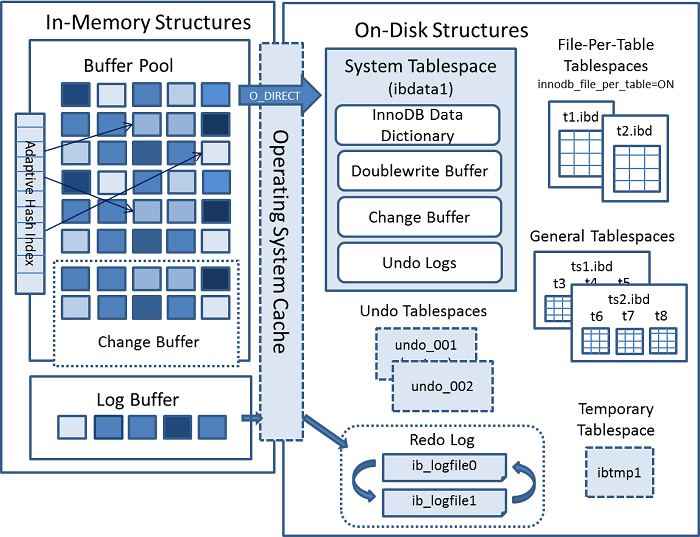
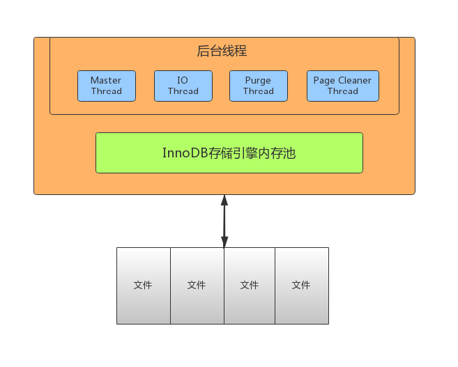
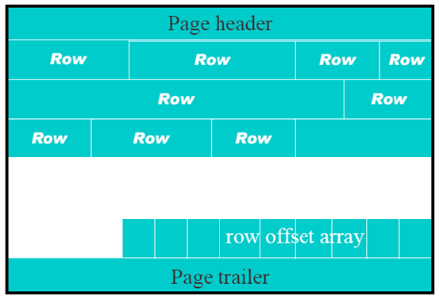
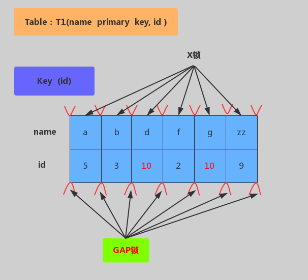

# MySQLTransaction


# 概述


* 高并发环境下,多个线程对同一行数据进行同时更新时可能出现的问题
* ACID:原子性(Atomicity),一致性(Consistent),隔离性(Isolation),持久性(Durable)
* 更新丢失:多个事务同时对同一个数据进行修改,后面的事务会覆盖前面的事务.加锁解决
* 脏读:A事务对数据进行了修改,但是还未进行提交.此时B事务来查询该数据,得到了未提交的新数据,若此时A事务发生异常进行了回滚,那B事务的操作就不符合一致性,数据也是无效的
* 不可重复读:一个事务范围内两个相同的查询却读取到了不同的结果.即在同一个事务中,A事务读取了某个数据,为了校验或其他操作再次读取该数据,发现数据不同,就是不可重复读.这种情况是另外的事务B对该数据进行了更新操作,导致了同一个事务中的2次读取结果不同
* 幻读:当两个完全相同的查询执行时,第二次查询的结果跟第一次查询的结果不同.此种情况发生在2次读中间发生了其他事物对该数据的更新操作
  * 和脏读的不同:幻读是事务进行了提交,而不是回退
  * 和不可重复读的不同:幻读是数据结果行数变化,不可重复读是数据的更新


# 隔离级别





* Read uncommitted:读未提交,级别最低,一个事务可以读取另外一个事务并未提交的数据.可能出现脏读,幻读,不可重复读
* Read Committed(RC):读已提交,Oracle和SqlServer采用的默认隔离级别.一个事务的更新操作结果只有在该事务提交之后,另外一个事务才可以读取到该数据更新后的结果.可能出现不可重复读和幻读
* Repeatable Read(RR):重复读,mysql的默认级别.整个事务过程中,对同一笔数据的读取结果是相同的,不管其他事务是否在对共享数据进行更新,也不管更新提交与否
  * Mysql的高版本的InnoDB已经解决了部分幻读问题,即该级别已经可以解决赃读,不可重复读,部分幻读
  * 另外出现幻读的情况:
    * 间隙锁.A先查,B新增了一条处于间隙锁位置的数据,A范围更新了包含间隙锁在内的数据,A再查,出现幻读
    * A先查,B插入任何一条数据,A更新了全部数据,A再查,出现幻读

* Serializable:序列化,最高隔离级别.所有事务操作依次顺序执行,注意这会导致并发度下降,性能最差.通常会用其他并发级别加上相应的并发锁机制来取代它
* `show variables like 'tx_isolation';`: 查看MySQL当前数据库的事务隔离级别
* `select @@tx_isolation;`:同上,也是查询默认隔离级别
* 设置隔离级别:
  * `set global/session tx_isolation='READ-UNCOMMITTED';`
  * `set global/session tx_isolation='READ-COMMITTED';`
  * `set global/session tx_isolation='REPEATABLE-READ';`
  * `set global/session tx_isolation='SERIALIZABLE';`


# MVCC


* Multi Version Concurrency Control,又称为多版本控制,是数据库为了实现高并发的数据访问,对数据进行多版本处理,并通过事务的可见性来保证事务能看到自己应该看到的数据版本
* 多版本并发控制:解决读写冲突(读想要的版本,写最新的版本),主要使用了隐藏列的方式,但是写写仍然不能并行
* MVCC只能在RC和RR模式下有效
* 读模式分为当前读(current read)和快照读(snapshot read),当前读是需要加锁的
  * 快照读: 读取的是记录的快照版本(有可能是历史版本),不用加锁.普通的select都是快照读
    * 对于读已提交,每次进行快照读时都会生成最新的Read View
    * 对于可重复读,只有事务开始的第一个快照读会创建Read View
  * 当前读: 读取的是记录的最新版本,并且当前读返回的记录,都会加锁吗,保证其他事务不会再并发修改这条记录,包括如下:
    * select... for update
    * lock in share mode
    * insert/delete/update
    * 对于读已提交和可重复读,行锁加间隙锁来解决,这个合并的锁叫做Next-Key锁,在修改的记录两边的区间加上间隙锁
* 多版本的生成:每次事务修改操作之前,都会在Undo日志中记录修改之前的数据状态和事务号,该备份记录可以用于其他事务的读取,也可以进行必要时的数据回滚
* 快照版本是存储在UNDO.LOG中,可以根据最小事务ID进行清理
* 对于一个快照来说,能读到哪些基于以下规则:
  * 当前事务内的更新,可以读到
  * 版本未提交,不能读到
  * 版本已提交,但是在快照创建后提交的,不能读到
  * 版本已提交,且是在快照创建前提交的,可以读到


## ReadView结构


* low_limit_id: 目前出现过的最大的事务ID+1,即下一个将被分配的事务ID
* up_limit_id: 活跃事务列表trx_ids中最小的事务ID,如果trx_ids为空,则up_limit_id 为 low_limit_id
* trx_ids: Read View创建时其他未提交的活跃事务ID列表
* creator_trx_id: 当前创建事务的ID,是一个递增的编号


## 读写流程


* `SELECT FOR UPDATE`: 会默认写入事务数据.如表中只有4个字段,后面的2个字段就是隐藏列
  * DB_TRX_ID: 当前事务ID,每次更新都会加1
  * DB_ROLL_PTR: 前一个事务的回滚指针,指向前一个事务,即从哪一个事务数据变更多来
* 下面的2个都是快照读,用于追溯事务的源头,同时读的时候也是读快照版
* 写数据时先用排他锁锁定该行,记录 Redo log
* 把该行修改前的值复制到 Undo log
* 修改当前行的值,填写事务编号(第一次修改)或事物编号+1,使回滚指针指向 Undo log 中修改前的行
* 后续事务操作过程与上述相同,此时 Undo log 中会有多条记录,并且可以通过当前记录的回滚指针回溯到该行创建时的初始内容
* Undo log会被MySQL服务的线程定时清理,避免文件过大


# 可见性判断


* 读的时候通过可见性来判断具体读取哪一个快照版本
  * 创建快照这一刻,还未提交事务的不可见
  * 创建快照之后创建的事务不可见
* 先找出当前活跃事务,即还未提交的以及当前快照创建后创建的第一个事务,将这些事务ID进行排序
* 先查看当前事务的前一个事务是否已经提交,如果已提交且事务ID比最小事务ID还小,则直接返回前一个事务的快照数据
* 如果前一个事务ID比最大事务ID还大,说明是在当前事务快照创建之后才创建的版本,直接回滚到前一个事务的再上一个版本的快照数据
* 如果前一个事务ID在最小和最大事务ID之间,就查看前一个事务ID是否在活跃事务区间中.如果在,说明事务还未提交,回滚到前一个事务的再上一个版本的快照数据.如果不在,说明是已经提交的数据,返回前一个事务的快照数据


# WAL


* 预写式日志(Write-Ahead Logging),是数据库系统中提供原子性(Atomicity)和持久性(Durability)的一系列技术
* 在使用WAL的系统中,所有的修改在提交前,都要先写入LOG文件中


# UNDO.LOG


* 回滚日志:保证事务原子性,要么全成功,要么全失败.实现数据多版本,存储MVCC的事务历史版本
* delete undo log:用于回滚,提交即清理
* update undo log:用于回滚,同时实现快照读,不能随便删除
* 依据系统活跃的最小事务ID去清理undo.log
* DML操作导致的数据记录变化,均需要将记录的前镜像写入Undo日志
* DML操作修改聚簇索引前,记录Undo日志
* 二级索引记录的修改,不记录Undo日志
* Undo页面的修改,同样需要记录Redo日志


# REDO.LOG


* 实现事务持久性,记录修改,同时用于异常恢复
* 在页面修改完成之后,在脏页刷出磁盘之前,写入Redo日志
* 日志先行,日志一定比数据页先写回磁盘
* DML操作导致的页面变化,聚簇索引/二级索引/Undo页面修改,均需要记录Redo日志  
* REDO.LOG和数据库磁盘文件的区别:
  * REDO.LOG体积小,只记录页的修改,比写入页代价低
  * 末尾追加,将数据库页的随机写变顺序写,发生改变的页不固定
* 4个redo.log循环写的方式实现事务持久性功能
  * Write Pos:写入开始位置
  * Check Point:刷盘位置,即可以将数据覆盖的位置.Write Pos不停的往前写数据,Check Point则在后面覆盖数据
  * Check Point->Write Pos:待落盘数据,即可以写入数据的空间


# 数据写入流程


* 客户端提交更新数据,MySQL服务器解析提交的修改命令,并发送到存储引擎
* 存储引擎先将数据写入到undo.log中,之后更新内存数据
* 记录页的修改,状态更改为prepare
* 存储引擎数据更新完成之后,事务进行提交,将事务记录为commit状态


## Insert


* 将插入记录的主键值,写入Undo
* 将[space_id, page_no, 完整插入记录, 系统列, ...]写入Redo
* space_id, page_no 组合代表了日志操作的页面


## Delete


* Delete,在InnoDB内部为Delete Mark操作,将记录上标识Delete_Bit,而不删除记录
* 将当前记录的系统列写入Undo (DB_TRX_ID, ROLLBACK_PTR, ...)
* 将当前记录的主键列写入Undo
* 将当前记录的所有索引列写入Undo (why? for what?)
* 将Undo Page的修改,写入Redo
* 将[space_id, page_no, 系统列,记录在页面中的Slot, ...]写入Redo


## Update


* 未修改聚簇索引键值,属性列长度未变化,聚簇索引

  

  * 将当前记录的系统列写入Undo (DB_TRX_ID, ROLLBACK_PTR, ...)
  * 将当前记录的主键列写入Undo
  * 将当前Update列的前镜像写入Undo
  * 若Update列中包含二级索引列,则将二级索引其他未修改列写入Undo
  * 将Undo页面的修改,写入Redo
  * 进行In Place Update,记录Update Redo日志(聚簇索引)
  * 若更新列包含二级索引列,二级索引肯定不能进行In Place Update,记录Delete Mark + Insert Redo日志

* 未修改聚簇索引键值,属性列长度发生变化,聚簇索引

  

  * 将当前记录的系统列写入Undo (DB_TRX_ID, ROLLBACK_PTR, ...)
  * 将当前记录的主键列写入Undo
  * 将当前Update列的前镜像写入Undo
  * 若Update列中包含二级索引列,则将二级索引其他未修改列写入Undo
  * 将Undo页面的修改,写入Redo
  * 不可进行In Place Update,记录Delete + Insert Redo日志(聚簇索引)
  * 若更新列包含二级索引列,二级索引肯定不能进行In Place Update,记录Delete Mark + Insert Redo日志

* 修改聚簇索引键值,聚簇索引

  

  * 不可进行In Place Update,Update = Delete Mark + Insert
  * 对原有记录进行Delete Mark操作,写入Delete Mark操作Undo
  * 将新纪录插入聚簇索引,写入Insert操作Undo
  * 将Undo页面的修改,写入Redo
  * 不可进行In Place Update,记录Delete Mark + Insert Redo日志(聚簇索引)
  * 若更新列包含二级索引列,二级索引肯定不能进行In Place Update,记录Delete Mark + Insert Redo日志


# 刷盘


* 将内存中的数据写入到磁盘中
* innodb_flush_log_at_trx_commit:0,1,2代表不同的刷盘策略,默认1
  * 0:commit数据到内存中,OS每秒将缓存中的数据写入磁盘,最多丢一秒数据
  * 1:commit数据每次提交时都写文件并刷盘,最多提交失败
  * 2:commit每次提交时写文件,OS每秒从文件写数据到磁盘中


# InnoDB锁


* `lock table tb_name read/write,tb_name1 read/write`:给表加锁
* `show open tables`:查看表上加过的锁,in_use为0表示没加锁
* `show status like '%table%'`:查看数据库表锁情况
  * table_locks_immediate:产生表锁定的次数.立即获取锁的查询次数,每次获取锁值加1
  * table_locks_waited:出现表锁定争用而发生等待的次数(不能立即获取锁的次数,每等待一次锁值加1),此值高则说明存在较严重的表级锁争用情况
* `unlock tables`:将所有的锁解锁
* 从对数据操作的类型(读/写)分
  * 读锁(共享锁,S锁)
  * 写锁(排他锁,X锁)
  * IS锁,IX锁: 意向读锁,意向写锁,属于表级锁,S和X主要针对行级锁.在对表记录添加S或X锁之前,会先对表添加IS或IX锁
* 从对数据操作的粒度分
  * 表锁(偏读)
  * 行锁(偏写)


## 读锁


* 如果是给表加读锁,若sesson1对a表加读锁,则sesson1能读a表,但不可读写其他没有锁的表(读报错),写a表报错.其他session可以读a表和其他表,但是往a表写数据则会被阻塞,直到sesson1解锁,可直接写其他表
* 如果是给行数据加了读锁(共享锁),和给表加锁唯一的不同是:加锁的线程仍然可以修改加锁的行数据
* 读锁会阻塞写,但是不会阻塞读.写锁则会把读写都堵塞
* 读锁只能读加锁了的表,不能读未加锁的表.其他链接可以读所有的表
* 加了读锁不可以对数据进行写操作,若需要写,则需要等解除锁之后才可以


## 写锁


* sesson1给t1表加写锁,则sesson1可以对t1表读写,但不能对其他没有写锁的表进行读写(报错)
* sesson2只能读写没有锁的表,读写t1表时都会被阻塞.等sesson1对t1表的锁释放后才能继续对t1表进行读写


## 表锁


* 元数据锁(meta data lock,MDL)
* 偏向MyISAM存储引擎,开销小,加锁快,无死锁,锁定粒度大,发生锁冲突的概率最高,并发低
* 全表扫描会导致表锁


## 行锁


* 偏向InnoDB引擎,开销大,加锁慢,会出现死锁.锁定粒度最小,发生锁冲突的概率最低,并发度也高
* 在行锁情况下,多个事务更新同一行会发生阻塞,只有当前一个事物更新完且commit之后,其他的事物才能继续更新
* 在行锁情况下,多个事务可以对不同的行进行更新,不会发生阻塞
* 锁只能作用在索引上,包括聚簇索引和二级索引.如果没有索引,则会升级为表锁
* 行锁又分为共享锁和排他锁,是通过对索引数据页上的记录加锁实现的,主要算法有 3 种: Record Lock,Gap Lock 和 Next-key Lock
  * RecordLock锁: 锁定单个行记录的锁.(记录锁,RC,RR隔离级别都支持)
  * GapLock锁: 间隙锁,锁定索引记录间隙,确保索引记录的间隙不变,(范围锁,RR隔离级别支持)
  * Next-key Lock 锁: 记录锁和间隙锁组合,同时锁住数据,并且锁住数据前后范围.(记录锁+范围锁,RR隔离级别支持)

* 写锁,排他锁:`select .... for update`,在select末尾加for update,增删改默认加写锁
* 在RR隔离级别,InnoDB的加锁行为都是先采用Next-Key Lock,但是当SQL操作含有唯一索引时,Innodb会对Next-Key Lock进行优化,降级为RecordLock,仅锁住索引本身而非范围
  * `select ... from`: InnoDB引擎采用MVCC机制实现非阻塞读,对于普通的select语句不加锁
  * `select ... from lock in share mode`: 加共享锁(读锁),InnoDB会先使用Next-Key Lock,如果发现唯一索引,降级为RecordLock
  * `select ... from for update`: 加排他锁,InnoDB会先使用Next-Key Lock,如果发现唯一索引,降级为RecordLock
  * `update ... where`: InnoDB会先使用Next-Key Lock,如果发现唯一索引,降级为RecordLock锁
  * `delete ... where`: InnoDB会先使用Next-Key Lock,如果发现唯一索引,降级为RecordLock锁
  * `insert`: InnoDB会在将要插入的那一行设置一个排他的RecordLock锁

* (唯一索引|非唯一索引)*(RC(读提交)|RR(重复读)):总共4种情况进行分析,当非唯一索引时,RC和RR在删除的情况下会有区别,其他情况相同


### RR*唯一索引


#### 主键加锁





* 以`update t1 set name='XX' where id=10`操作为例
* 加锁行为: 仅在id=10的主键索引记录上加X锁


#### 唯一键加锁


* 以`update t1 set name='XX' where id=10`操作为例
* 加锁行为: 先在唯一索引id上加X锁,然后在id=10的主键索引记录上加X锁


#### 非唯一键加锁





* 以`update t1 set name='XX' where id=10`操作为例
* 加锁行为: 对满足id=10条件的记录和主键分别加X锁,然后在(6,c)-(10,b)、(10,b)-(10,d)、(10,d)-(11,f)范围分别加Gap Lock


#### 无索引加锁





* 以`update t1 set name='XX' where id=10`操作为例
* 加锁行为: 表里所有行和间隙都会加X锁(当没有索引时,会导致全表锁定,因为InnoDB引擎锁机制是基于索引实现的记录锁定)


### RC*非唯一索引


* 读已提交,非唯一索引
* phone为非唯一二级索引,加锁时会锁住主键的103和105
* 在删除时会产生幻读问题


### RR*非唯一索引


* 可重复读,非唯一索引
* phone为非唯一二级索引,加锁时会锁住主键的103和105
* 在删除时也会产生幻读问题,MySQL的RR级别解决的是当前事务的幻读问题,若是多线程下,仍然无法解决幻读问题
* 为解决幻读问题,可以使用间隙锁,将133到135之间的数据锁住,不让插入新的数据


## 行锁升表锁


* 索引失效.如where子句中的自动类型转换,函数等都将会导致行锁变成表锁,此时整个表都只能有一个更新事务,其他事务都会被阻塞
* 在select ... for update,delete,update时,如果where条件的字段无索引,会升级为表锁


## 间隙锁


* 当用范围条件而不是相等条件检索数据,并请求共享或排他锁时,InnoDB会给符合条件的已有数据记录的索引项加锁,对于键值在条件范围内但并不存在的记录,叫做间隙.InnoDB会对这个间隙加锁,这种锁机制就是间隙锁

  ```mysql
  # 更新时会将索引从130到140的数据都锁定,虽然135并不在索引内,但仍然会被加锁,插入操作会被阻塞
  update tb_name set phone='' where uid > 130 and uid < 140;
  insert tb_name values('135',135);
  ```

* 解决可重复读模式下的幻读问题,即解决RR模式下的幻读问题

* GAP锁不是加在记录上,而是锁住是两条记录之间的位置(GAP),保证两次当前读返回一致的记录

* 因为查询过程中通过范围查找时,会锁定整个范围内所有的索引键值,即使这个键值并不存在.这样会带来意想不到的问题:

  * 当某些不存在的键值被锁定时,会造成在这些被锁定的键值无法插入数据,只能等上一个事务执行完毕
  * 在高并发下先更新后插入,可能导致实际结果和预期结果不一致的问题

* 例如范围更新id为1-9的数据的age,此时id为2的数据不存在,更新之后id为1-9的age都应该为同一个值.若是此时另外一个事务插入了id为2的数据,将会被阻塞,同时在上一个更新完成释放锁之后,插入操作完成,而此时插入的新值可能会和更新后的值不同


## 加锁过程


## 死锁


* name,age都是二级非唯一索引,uid是主键
* 当T1执行时先锁住了uid为120的数据,然后T2锁住了uid为130的数据
* T1处理完120时,去处理130发现被T2锁住了
* T2处理完130时,去处理120发现也被锁住了,此时就造成了死锁


### 表锁死锁


#### 产生原因


* 用户A访问表A(锁住了表A),然后又访问表B;另一个用户B访问表B(锁住了表B),然后企图访问表A;这时用户A由于用户B已经锁住表B,它必须等待用户B释放表B才能继续,同样用户B要等用户A释放表A才能继续,这就死锁就产生了


#### 解决方案


* 这种死锁通常是由于程序的BUG产生的,除了调整的程序的逻辑没有其它的办法
* 分析程序的逻辑,对于数据库的多表操作时,尽量按照相同的顺序进行处理,尽量避免同时锁定两个资源,如操作A和B两张表时,总是按先A后B的顺序处理, 必须同时锁定两个资源时,要保证在任何时刻都应该按照相同的顺序来锁定资源


### 行级锁死锁


#### 产生原因1


* 如果在事务中执行了一条没有索引条件的SQL,引发全表扫描,将行锁上升为全表锁定(等价于表锁),多个这样的事务执行后,就很容易产生死锁和阻塞,最终发生阻塞或死锁


#### 解决方案1


* SQL语句中不要使用太复杂的关联多表的查询
* 使用explain对SQL语句进行分析,对于有全表扫描和全表锁定的SQL语句,建立相应的索引进行优化


#### 产生原因2


* 两个事务分别想拿到对方持有的锁,互相等待,于是产生死锁


#### 解决方案2


* 在同一个事务中,尽可能做到一次锁定所需要的所有资源按照id对资源排序,然后按顺序进行处理


### 共享锁转换为排他锁


#### 产生原因


* 事务A 查询一条纪录,然后更新该条纪录;此时事务B 也更新该条纪录,这时事务B 的排他锁由于事务A 有共享锁,必须等A 释放共享锁后才可以获取,只能排队等待

* 事务A 再执行更新操作时,此处发生死锁,因为事务A 需要排他锁来做更新操作,但是,无法授予该锁请求,因为事务B 已经有一个排他锁请求,并且正在等待事务A 释放其共享锁

  ```mysql
  -- 事务A
  select * from dept where deptno=1 lock in share mode; -- 共享锁,第一步
  update dept set dname='java' where deptno=1; -- 排他锁,第三步
  
  -- 事务B
  update dept set dname='Java' where deptno=1; -- 由于1有共享锁,没法获取排他锁,需等待,第二步
  ```

  

#### 解决方案


* 使用乐观锁进行控制.但是乐观锁是在程序中实现,不受MySQL的控制,因此可能会造成脏数据被更新到数据库中


### 死锁排查


* `show engine innodb status\G`;: 查看引擎的同时可以查看死锁出现的时间,次数等
* `show status like 'innodb_row_lock%'`:可配合`show profile`使用
  * innodb_row_lock_current_waits:当前正在等待锁定的数量
  * innodb_row_lock_time:从系统启动到现在锁定总时间长度,比较重要
  * innodb_row_lock_time_avg:每次等待所花平局时间,比较重要
  * innodb_row_lock_time_max:从系统启动到现在等待最长的一次所花的时间
  * innodb_row_lock_waits:系统启动后到现在总共等待的次数,比较重要


## 锁相关系统表


### Innodb_trx


* 当前运行的所有事务
* `select * from information_schema.innodb_trx;`:重点关注trx_state为LOCK_WAIT的数据,查看 trx_mysql_thread_id 字段的值,可以使用kill trx_mysql_thread_id 来杀掉线程
* 表中各字段的含义:

| 字段名                     | 含义                        |
| -------------------------- | --------------------------- |
| trx_id                     | 事务id                      |
| trx_state                  | 事务状态                    |
| trx_started                | 事务开始时间                |
| trx_requested_lock_id      | innodb_locks表的lock_id     |
| trx_wait_started           | 事务开始等待的时间          |
| trx_weight                 | #                           |
| trx_mysql_thread_id        | 事务线程ID                  |
| trx_query                  | 具体SQL语句                 |
| trx_operation_state        | 事务当前操作状态            |
| trx_tables_in_use          | 事务中有多少表被使用        |
| trx_tables_locked          | 事务有多少个锁              |
| trx_lock_structs           | #                           |
| trx_lock_memory_bytes      | 事务锁住的内存大小,单位字节 |
| trx_rows_locked            | 事务锁住的行数              |
| trx_rows_modified          | 事务更改的行数              |
| trx_concurrency_tickets    | 事务并发票数                |
| trx_isolation_level        | 事务隔离级别                |
| trx_unique_checks          | 是否唯一性检查              |
| trx_foreign_key_checks     | 是否外键检查                |
| trx_last_foreign_key_error | 最后的外键错误              |
| trx_adaptive_hash_latched  | #                           |
| trx_adaptive_hash_timeout  | #                           |
| trx_is_read_only           | 事务是否只读                |
| trx_autocommit_non_locking | 事务是否在无锁时自动提交    |


### innodb_locks


* 当前出现的锁
* 表中各字段的含义:

| 字段名      | 含义           |
| ----------- | -------------- |
| lock_id     | 锁ID           |
| lock_trx_id | 拥有锁的事务ID |
| lock_mode   | 锁模式         |
| lock_type   | 锁类型         |
| lock_table  | 被锁的表       |
| lock_index  | 被锁的索引     |
| lock_space  | 被锁的表空间号 |
| lock_page   | 被锁的页号     |
| lock_rec    | 被锁的记录号   |
| lock_data   | 被锁的数据     |


### innodb_lock_waits


* 锁等待的对应关系
* 表中各字段的含义:

| 表字段            | 含义               |
| ----------------- | ------------------ |
| requesting_trx_id | 请求锁的事务ID     |
| requested_lock_id | 请求锁的锁ID       |
| blocking_trx_id   | 当前拥有锁的事务ID |
| blocking_lock_id  | 当前拥有锁的锁ID   |


## 优化


* 尽可能让所有数据检索都通过索引来完成,避免无索引行锁升级为表锁
* 合理设计索引,尽量缩小锁的范围
* 尽可能较少检索范围条件,避免间隙锁
* 尽量控制事务大小,减少锁定资源量和时间长度
* 尽可能低级别事务隔离


## Snapshot


* 生成一个数据请求时间点的一致性数据快照,并用这个快照来提供一定级别的一致性读取(MVCC:Multi Version Concurrency Control)
