# Design

24种设计模式

# 简单工厂模式

* 属于类的创建型模式,又叫做静态工厂方法模式.通过专门定义一个类来负责创建其他类的实例,被创建的实例通常都具有共同的父类或接口

## 角色

* 工厂角色:Creator,核心类,负责实现创建所有实例的内部逻辑.工厂类可以被外界直接调用,创建所需的产品对象.可以适用结合枚举使用
* 抽象角色:Product,简单工厂创建的所有对象的父类,负责描述所有实例所共有的公共接口
* 具体产品:Concrete Product,简单工厂模式所创建的具体实例对象,实现或继承抽象就角色

## 适用场景

* 工厂类是整个模式的关键所在,它包含必要的判断逻辑,能够根据外界给定的信息,决定究竟应该创建哪个具体类的对象.用户在使用时可以直接根据工厂类去创建所需的实例,而无需了解这些对象是如何创建以及如何组织的,有利于整个软件体系结构的优化
* 简单工厂模式的缺点也正体现在其工厂类上,由于工厂类集中了所有实例的创建逻辑,所以高内聚方面做的并不好.另外,当系统中的具体产品类不断增多时,可能会出现要求工厂类也要做相应的修改,扩展性并不很好

# 工厂模式

* 属于类的创建型模式,又被称为多态工厂模式
* 工厂方法模式的意义是定义一个创建产品对象的工厂接口,将实际创建工作推迟到子类当中
* 核心工厂类不再负责产品的创建,这样核心类成为一个抽象工厂角色,仅负责具体工厂子类必须实现的接口,这样进一步抽象化的好处是使得工厂方法模式可以使系统在不修改具体工厂角色的情况下引进新的产品

## 类图

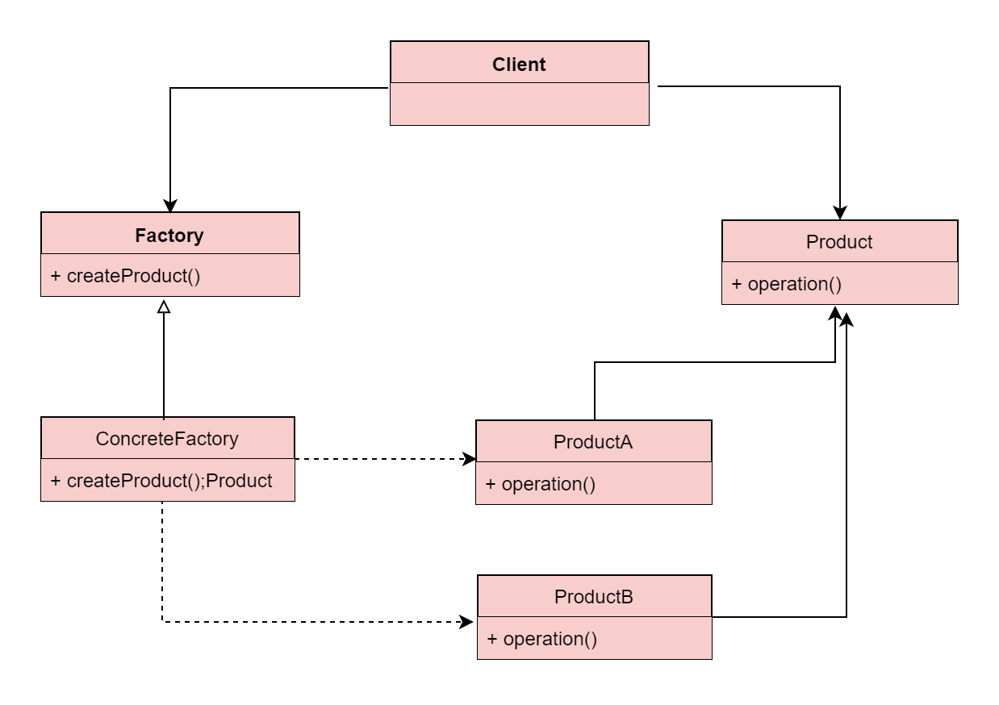

## 角色

* 抽象工厂:Factory,工厂方法模式的核心,任何工厂类都必须实现这个接口
* 具体工厂:Concrete Factory,具体工厂类是抽象工厂的一个实现,负责实例化产品对象
* 抽象:Product,工厂方法模式所创建的所有对象的父类,它负责描述所有实例所共有的公共接口
* 具体产品:Concrete Product,工厂方法模式所创建的具体实例对象,实现抽象接口

## 适用场景

* 工厂方法类的核心是一个接口工厂类,而简单工厂模式把核心放在一个具体类上
* 工厂方法模式的具体工厂类都有共同的接口,或者有共同的抽象父类
* 当系统扩展需要添加新的产品对象时,需要添加一个具体接口实现以及一个具体工厂实现,原有工厂接口不需要进行任何修改,也不需要修改客户端,很好的符合了开放－封闭原则.而简单工厂模式在添加新产品对象后不得不修改工厂方法,扩展性不好

# 抽象工厂

* 抽象工厂模式可以向客户端提供一个接口,使得客户端在不必指定产品的具体类型的情况下,能够创建多个产品族的产品对象

## 角色

* 抽象工厂:Factory,抽象工厂模式的核心,包含对多个产品结构的声明,任何工厂类都必须实现这个接口
* 具体工厂:Concrete Factory,具体工厂类是抽象工厂的一个实现,负责实例化某个产品族中的产品对象
* 抽象:Product,抽象模式所创建的所有对象的父类,它负责描述所有实例所共有的公共接口
* 具体产品:Concrete Product,抽象模式所创建的具体实例对象
* 抽象工厂中方法对应产品结构,具体工厂对应产品族

## 适用场景

* 要创建一组或者相互依赖的对象,工厂模式中创建多个工厂就升级为了抽象工厂

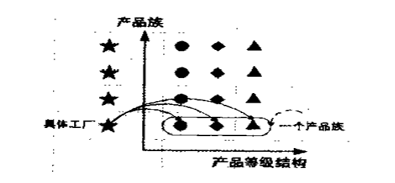

# 单例模式

* 单例模式是一种对象创建型模式,使用单例模式,可以保证为一个类只生成唯一的实例对象

## 适用场景

- 在多个线程之间,比如servlet环境,共享同一个资源或者操作同一个对象
- 在整个程序空间使用全局变量,共享资源
- 大规模系统中,为了性能的考虑,需要节省对象的创建时间等等

## 种类

* 饿汉式:使用内部类或枚举使得对象的初始化可以在使用时才创建,而不需要一启动程序就创建
* 懒汉式:需要使用的时候才创建对象,有线程问题

# 原型模式

* 是一种对象创建型模式,它采取复制原型对象的方法来创建对象的实例.使用Prototype模式创建的实例,具有与原型一样的数据

## 特点

* 由原型对象自身创建目标对象
* 通过Prototype模式创建的对象,不仅仅与原型对象具有相同的结构,还与原型对象具有相同的值
* 根据对象克隆深度层次的不同,有浅度克隆与深度克隆.浅克隆不能克隆引用类型,除了String

## 适用场景

- 在创建对象的时候,既希望被创建的对象继承其基类的基本结构,还希望继承原型对象的数据
- 希望对目标对象的修改不影响既有的原型对象(深度克隆的时候可以完全互不影响)
- 隐藏克隆操作的细节.很多时候,对对象本身的克隆需要涉及到类本身的数据细节

# 建造者模式

* Builder模式也叫建造者模式或者生成器模式,是一种对象创建型模式之一,用来隐藏复合对象的创建过程,它把复合对象的创建过程加以抽象,通过子类继承和重载的方式,动态地创建具有复合属性的对象

## 类图

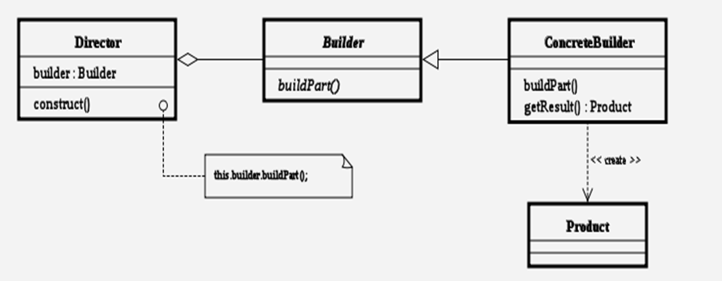

## 适用场景

- 对象的创建:Builder模式是为对象的创建而设计的模式
- 创建的是一个复合对象:被创建的对象为一个具有复合属性的复合对象
- 关注对象创建的各部分的创建过程:不同的工厂(这里指builder生成器)对产品属性有不同的创建方法

# 装饰者模式

* 装饰(Decorator)模式又叫做包装模式.通过对客户端透明的方式来扩展对象的功能,是继承的一个替换方案

## 类图

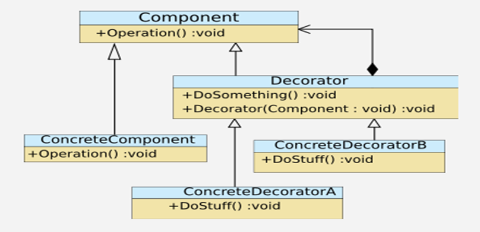

## 角色

* 抽象组件:一个抽象接口,是被装饰类和装饰类的父接口
* 具体组件:为抽象组件的实现类
* 抽象装饰:包含一个抽象组件的引用,并定义了与抽象组件一致的接口
* 具体装饰:抽象装饰角色的实现类,负责具体的装饰

# 策略模式

* Strategy模式也叫策略模式,是行为模式之一,它对一系列的算法加以封装,为所有算法定义一个抽象的算法接口,并通过继承该抽象算法接口对所有的算法加以封装和实现,具体的算法选择交由客户端决定

## 类图

## 角色

* Strategy:策略(算法)抽象
* ConcreteStrategy:各种策略(算法)的具体实现
* Context:策略的外部封装类,或者说策略的容器类.根据不同策略执行不同的行为.策略由外部环境决定

## 适用场景

* 策略模式提供了可以替换继承关系的办法
* 使用策略模式可以避免使用多重条件转移语句
* 策略模式只适用于客户端知道所有的算法或行为的情况,并自行决定使用哪一个策略类
* 策略模式造成很多的策略类.可以通过把依赖于环境的状态保存到客户端里,将策略类设计成可共享的,这样策略类实例可以被不同客户端使用.换言之,可以使用享元模式来减少对象的数量

# 观察者模式

* Observer模式是行为模式之一,它的作用是当一个对象的状态发生变化时,能够自动通知其他关联对象,自动刷新对象状态
* Observer模式提供给关联对象一种同步通信的手段,使某个对象与依赖它的其他对象之间保持状态同步

## 类图

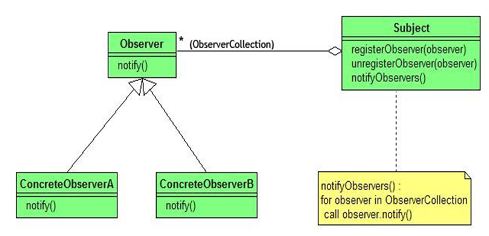

## 角色

* Subject:被观察者,当需要被观察的状态发生变化时,需要通知队列中所有观察者对象.Subject需要维持(添加,删除,通知)一个观察者对象的队列列表
* ConcreteSubject:被观察者的具体实现,包含一些基本的属性状态及其他操作
* Observer:观察者,接口或抽象类.当Subject的状态发生变化时,Observer对象将通过一个callback函数得到通知
* ConcreteObserver:观察者的具体实现.得到通知后将完成一些具体的业务逻辑处理

## 适用场景

* 侦听事件驱动程序设计中的外部事件
* 侦听/监视某个对象的状态变化
* 发布者/订阅者(publisher/subscriber)模型中,当一个外部事件被触发时,通知队列中的订阅者

# 享元模式

* Flyweight模式也叫享元模式,是构造型模式之一,通过与其他类似对象共享数据来减小内存占用

## 类图

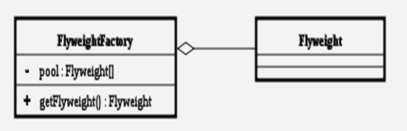

## 角色

* 抽象享元:所有具体享元类的父类,规定一些需要实现的公共接口
* 具体享元:抽象享元角色的具体实现类,并实现了抽象享元角色规定的方法
* 享元工厂:负责创建和管理享元角色,通常包含一个Map

# 代理模式

* Proxy模式,是构造型的设计模式之一,它可以为其他对象提供一种代理(Proxy)以控制对这个对象的访问
* 所谓代理,是指具有与代理元(被代理的对象)具有相同的接口的类,客户端必须通过代理与被代理的目标类交互,而代理一般在交互的过程中(交互前后),进行某些特别的处理

## 类图

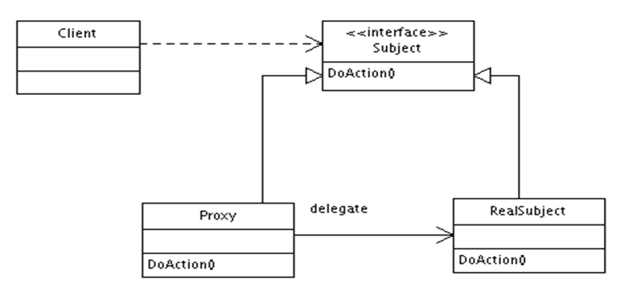

## 角色

* Subject:抽象主题角色,真实主题与代理主题的共同接口
* RealSubject:真实主题角色,定义了代理角色所代表的真实对象
* Proxy:代理主题角色,含有对真实主题角色的引用,代理角色通常在将客户端调用传递给真实主题对象之前或者之后执行某些操作,而不是单纯返回真实的对象

## 动态代理

* InvocationHandler 接口
* invoke方法
* Proxy.newProxyInstance()

# 外观模式

* Facade模式为一组具有类似功能的类群,比如类库,子系统等等,提供一个一致的简单的界面

## 类图

## 角色

* Facade:为调用方定义简单的调用接口
* Clients:调用者.通过Facade接口调用提供某功能的内部类群
* Packages:功能提供者.指提供功能的类群(模块或子系统)

# 组合模式

* Composite模式是构造型的设计模式之一.通过递归手段来构造树形的对象结构,并可以通过一个对象来访问整个对象树

## 类图

## 角色

* Component:树形结构的节点抽象,为所有的对象定义统一的接口(公共属性,行为等的定义),提供管理子节点对象的接口方法,提供管理父节点对象的接口方法
* Leaf:树形结构的叶节点,Component的实现子类
* Composite:树形结构的枝节点,Component的实现子类

# 桥接模式

* Bridge模式是构造型的设计模式之一.Bridge模式基于类的最小设计原则,通过使用封装,聚合以及继承等行为来让不同的类承担不同的责任
* 它的主要特点是把抽象(abstraction)与行为实现(implementation)分离开来,从而可以保持各部分的独立性以及应对它们的功能扩展

## 类图

## 角色

* Client:Bridge模式的使用者
* Abstraction:抽象类接口(接口或抽象类),维护对行为实现(Implementor)的引用
* Refined Abstraction:Abstraction子类
* Implementor:行为实现类接口(Abstraction接口定义了基于Implementor接口的更高层次的操作)
* ConcreteImplementor:Implementor子类

# 适配器模式

* Adapter模式是构造型模式之一,通过Adapter模式可以改变已有类(或外部类)的接口形式

## 类图

* 通过继承实现

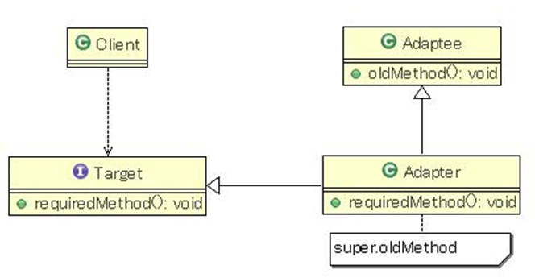

* 通过委让实现

## 适用场景

* 在大规模的系统开发过程中,需要实现某些功能,这些功能已有还不太成熟的一个或多个外部组件,随着对外部组件库的替换,可能需要对引用该外部组件的源代码进行大面积的修改,因此也极可能引入新的问题等等
* Adapter模式通过定义一个新的接口(对要实现的功能加以抽象),和一个实现该接口的Adapter(适配器)类来透明地调用外部组件
* 这样替换外部组件时,最多只要修改几个Adapter类就可以了,其他源代码都不会受到影响

# 解释器模式

* Interpreter模式是行为模式之一,它建立一个解释器,对于特定的计算机程序设计语言,用来解释预先定义的文法.简单地说,Interpreter模式是一种简单的语法解释器构架

## 类图

## 角色

* Context:解释器上下文环境类,用来存储解释器的上下文环境,比如需要解释的文法等
* AbstractExpression:解释器抽象类
* ConcreteExpression:解释器具体实现类

## 适用场景

* 当有一个语言需要解释执行,并且可将该语言中的句子表示为一个抽象语法树时,可使用解释器模式 
* 效率不是一个关键问题,最高效的解释器通常不是通过直接解释语法分析树实现的,而是首先将它们转换成另一种形式

# 中介者模式

* Mediator模式是行为模式之一,在该模式中,类之间的交互行为被统一放在Mediator的对象中,对象通过Mediator对象同其他对象交互,Mediator对象起着控制器的作用

## 类图

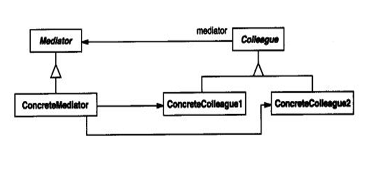

## 角色

* Mediator:中介者类的抽象父类
* ConcreteMediator:具体的中介者类
* Colleague:关联类的抽象父类
* ConcreteColleague:具体的关联类

## 适用场景

* 将系统按功能分割成更小的对象,符合类的最小设计原则,有利于提高类的重用性
* 对关联对象的集中控制
* 减小类的耦合程度,明确类之间的相互关系

# 职责链模式

* Chain of Responsibility(CoR)模式是行为模式之一,该模式构造一系列分别担当不同的职责的类的对象来共同完成一个任务,这些类的对象之间像链条一样紧密相连

## 类图

## 角色

* Handler:处理类的抽象父类
* ConcreteHandler:具体的处理类

## 适用场景

* 要实现Chain of Responsibility模式,需要满足该模式的基本条件:
  * 对象链的组织.需要将某任务的所有职责执行对象以链的形式加以组织
  * 消息或请求的传递.将消息或请求沿着对象链传递,以让处于对象链中的对象得到处理机会
  * 处于对象链中的对象的职责分配.不同的对象完成不同的职责
  * 任务的完成.处于对象链的末尾的对象结束任务并停止消息或请求的继续传递
* 责任的分担.每个类只需要处理自己该处理的工作(不该处理的传递给下一个对象完成),明确各类的责任范围,符合类的最小封装原则
* 可以根据需要自由组合工作流程.如工作流程发生变化,可以通过重新分配对象链便可适应新的工作流程
* 类与类之间可以以松耦合的形式加以组织
* 因为处理时以链的形式在对象间传递消息,根据实现方式不同,有可能会影响处理的速度

# 迭代模式

* Iterator模式是行为模式之一,它把对容器中包含的内部对象的访问委让给外部类,使用Iterator(遍历)按顺序进行遍历访问的设计模式

## 类图

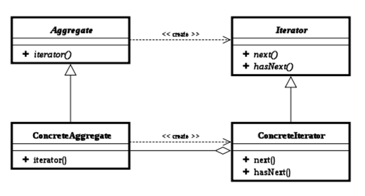

## 角色

* Iterator:迭代器接口,该接口必须定义实现迭代功能的最小定义方法集,比如提供hasNext()和next()
* ConcreteIterator:迭代器实现类,迭代器接口Iterator的实现类.可以根据具体情况加以实现
* Aggregate:容器接口,定义基本功能以及提供类似Iterator iterator()
* ConcreteAggregate:容器实现类,容器接口的实现类.必须实现Iterator iterator()

## 适用场景

* Iterator模式是为了处理按顺序进行遍历访问的一种设计模式,可以屏蔽聚集对象集合的容器类的实现细节,而能对容器内包含的对象元素按顺序进行遍历访问.Iterator模式的应用场景应该满足以下几个条件:
  * 访问容器中包含的内部对象
  * 按顺序访问
* 实现功能分离,简化容器接口.让容器只实现本身的基本功能,把迭代功能委让给外部类实现
* 隐藏容器的实现细节
* 为容器或其子容器提供了一个统一接口,一方面方便调用,另一方面使得调用者不必关注迭代器的实现细节
* 可以为容器或其子容器实现不同的迭代方法或多个迭代方法

# 模板方法模式

* Template Method模式是行为模式之一,它把具有特定步骤算法中的某些必要的处理委让给抽象方法,通过子类继承对抽象方法的不同实现改变整个算法的行为

## 类图

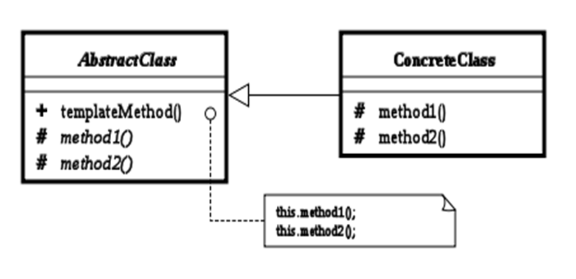

## 角色

* AbstractClass:抽象类的父类
* ConcreteClass:具体的实现子类
* TemplateMethod():模板方法
* method1()与method2():具体步骤方法  

## 适用场景

- 具有统一的操作步骤或操作过程

- 具有不同的操作细节

- 存在多个具有同样操作步骤的应用场景,但某些具体的操作细节却各不相同

# 备忘录模式

* Memento模式是行为模式之一,作用是保存对象的内部状态,并在需要的时候恢复对象以前的状态

## 类图

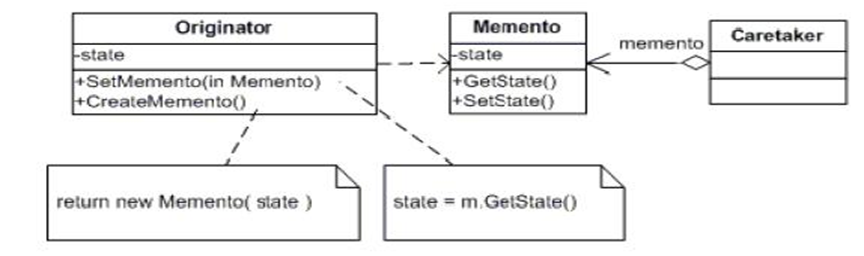

## 角色

* Originator:原生者,需要被保存状态以便恢复的那个对象
* Memento:备忘录,该对象由Originator创建,主要用来保存Originator的内部状态
* Caretaker:管理者,负责在适当的时间保存/恢复Originator对象的状态

## 适用场景

* 如果一个对象需要保存状态并可通过undo或rollback等操作恢复到以前的状态时,可使用Memento模式
* 一个类需要保存它的对象的状态(相当于Originator角色)
* 设计一个类,该类只是用来保存上述对象的状态(相当于Memento角色)
* 需要的时候,Caretaker角色要求Originator返回一个Memento并加以保存
* undo或rollback操作时,通过Caretaker保存的Memento恢复Originator对象的状态

# 状态模式

* State模式是行为设计模式的一种.State模式允许通过改变对象的内部状态而改变对象的行为

## 类图

## 角色

* Context:用户对象,拥有一个State类型的成员,以标识对象的当前状态
* State:接口或基类封装与Context的特定状态相关的行为
* ConcreteState:接口实现类或子类实现了一个与Context某个状态相关的行为

## 适用场景

* 状态模式主要解决的是当控制一个对象状态转换的条件表达式过于复杂时的情况.把状态的判断逻辑转译到表现不同状态的一系列类当中,可以把复杂的判断逻辑简化

# 命令模式

* Command模式是行为设计模式的一种.Command模式通过被称为Command的类封装了对目标对象的调用行为以及调用参数

## 类图

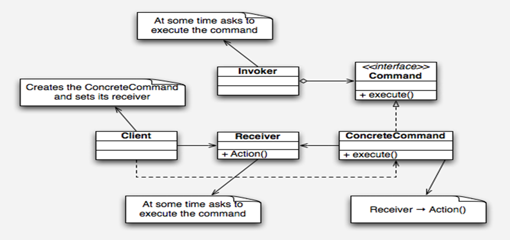

## 角色

* Command:Command抽象类
* ConcreteCommand:Command的具体实现类
* Receiver:需要被调用的目标对象
* Invorker:通过Invorker执行Command对象

## 适用场景

* 整个调用过程比较繁杂,或者存在多处这种调用,使用Command类对该调用加以封装,便于功能的再利用
* 调用前后需要对调用参数进行某些处理
* 调用前后需要进行某些额外处理,比如日志,缓存,记录历史操作等

# 访问者模式

* Visitor模式是行为模式之一,它分离对象的数据和行为,可以在不修改已有类的情况下,增加新的操作

## 类图

## 角色

* Visitor:访问者,为该对象结构中具体实现类声明一个接口.该接口的名字和参数标识了发送访问请求给具体访问者的具体对象,这样访问者就可以通过该元素角色的特定接口直接访问它.
* Concrete Visitor:具体访问者角色,实现每个由访问者角色(Visitor)声明的操作
* Element:元素角色,定义一个Accept操作,它以一个访问者为参数
* Concrete Element:具体元素角色,实现由元素角色提供的Accept操作
* Object Structure:对象结构角色,这是使用访问者模式必备的角色.它要具备以下特征:
  * 能枚举它的元素
  * 可以提供一个高层的接口以允许该访问者访问它的元素
  * 可以是一个复合(组合模式)或是一个集合,如一个列表或一个无序集合

## 适用场景

* 比如有一个公园,有一到多个不同的组成部分;该公园存在多个访问者:清洁工A负责打扫公园的A部分,清洁工B负责打扫公园的B部分,公园的管理者负责检点各项事务是否完成,上级领导可以视察公园等等
* 也就是说,对于同一个公园,不同的访问者有不同的行为操作,而且访问者的种类也可能需要根据时间的推移而变化

# 设计原则

## 开放封闭原则

* Open-Closed Principle:一个软件实体应当对扩展开放,修改关闭
* 在设计一个模块时,应当使得这个模块可以在不被修改源代码的前提下被扩展
* 绝对封闭的系统是不存在的.既然不能做到完全封闭,就应该清楚那些变化要封闭,那些变化要隔离做出选择.然后将那些无法封闭的变化抽象出来,允许扩展,尽可能的减少系统的开发
* 当变化到来时,首先需要做的不是修改代码,而是尽可能的将变化抽象出来进行隔离,然后进行扩展
* 面对需求的变化,对程序的修改应该是尽可能通过添加代码来实现,而不是通过修改代码来实现.
* 开放封闭原则的优越性
  * 通过扩展已有的软件系统,可以提供新的行为,以满足对软件的新需求
  * 已有的软件模块,特别是抽象模块不能再修改,这就使变化中的软件系统有一定的稳定性和延续性

## 单一职责原则

* Single Responsibility Principle:就一个类而言,应该仅有一个引起它变化的原因
* 功能多,但是每一个功能都不强
* 每一个职责都是一个变化的轴线,当需求变化时会反映为类的职责的变化.如果一个类承担的职责多于一个,那么引起它变化的原因就有多个
* 一个职责的变化甚至可能会削弱或者抑制类完成其他职责的能力,从而导致脆弱的设计
* 接受客户端输入并提交到数据库
  * 原有设计: 一个类负责接受客户端输入,对客户端输入进行校验,连接数据库,并提交数据到数据库
  * 现有设计: 一个功能也就是一个职责由一个类来负责

## 里氏代换原则

* Liskov Substitution Principle:一个软件实体如果使用的是一个父类的话,那么一定适用于其子类,而且它察觉不出父类和子类的区别.一个软件实体如果使用的是一个子类的话,那么它不能适用于其父类.

## 依赖倒转原则

* 传统的过程式设计倾向于使高层次的模块依赖于低层次的模块,抽象层依赖于具体的层次

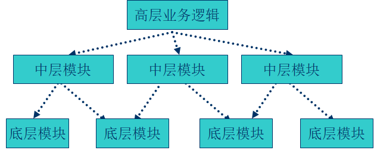

* 依赖倒转(Dependence Inversion Principle ):
  * 抽象不应该依赖于细节,细节应该依赖于抽象
  * 高层模块不依赖底层模块,两者都依赖抽象

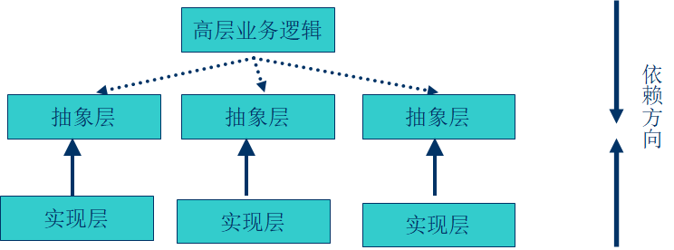

* 设计模式
  * 工厂模式
  * 模板模式
  * 迭代模式 

## 迪米特法则

* 迪米特法则(Law of Demeter )又叫做最少知识原则,即一个对象应当对其他对象尽可能少的了解
* 如果两个类不必彼此直接通信,那么这两个类就不应当发生直接的相互作用.如果其中一个类需要调用另一类的某一个方法的话,可以通过第三者转发这个调用
* 设计模式
  * 外观模式
  * 中介者模式