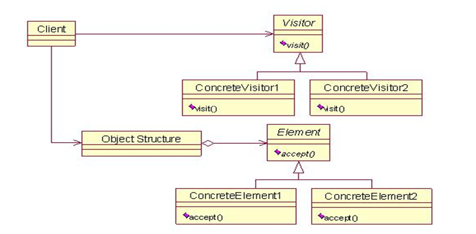

# Design


# 概述


## 设计模式分类


### 创建型模式


* 用于描述怎样创建对象,主要特点是将对象的创建与使用分离
* GoF书中提供了单例、原型、工厂方法、抽象工厂、建造者等 5 种创建型模式


### 结构型模式


* 用于描述如何将类或对象按某种布局组成更大的结构
* GoF书中提供了代理、适配器、桥接、装饰、外观、享元、组合等 7 种结构型模式


### 行为型模式


* 用于描述类或对象之间怎样相互协作共同完成单个对象无法单独完成的任务,以及怎样分配职责
* GoF书中提供了模板方法、策略、命令、职责链、状态、观察者、中介者、迭代器、访问者、备忘录、解释器等 11 种行为型模式


# UML


* 统一建模语言(Unified Modeling Language,UML)是用来设计软件的可视化建模语言,它的特点是简单、统一、图形化、能表达软件设计中的动态与静态信息
* UML 从目标系统的不同角度出发,定义了用例图、类图、对象图、状态图、活动图、时序图、协作图、构件图、部署图等 9 种图


## 类图


* 类图(Class diagram)是显示了模型的静态结构,特别是模型中存在的类、类的内部结构以及它们与其他类的关系等
* 类图不显示暂时性的信息
* 类图是面向对象建模的主要组成部分


## 类图表示法


### 类的表示


* 在UML类图中,类使用包含类名、属性(field) 和方法(method) 且带有分割线的矩形来表示


* 属性/方法名称前加的加号和减号表示了这个属性/方法的可见性,UML类图中表示可见性的符号有三种: 

  * +: 表示public


  * -: 表示private


  * #: 表示protected

* 属性的完整表示方式是:  **可见性  名称 : 类型 [ = 缺省值]**  

* 方法的完整表示方式是:  **可见性  名称(参数列表) [ :  返回类型]**

> 中括号中的内容表示是可选的
>
> 也有将类型放在变量名前面,返回值类型放在方法名前面


### 类关系的表示


#### 关联关系


##### 单向关联


* 单向关联用一个带箭头的实线表示


##### 双向关联


* 双向关联就是双方各自持有对方类型的成员变量,用一个不带箭头的直线表示


##### 自关联


* 自关联用一个带有箭头且指向自身的线表示


#### 聚合关系


* 聚合关系是关联关系的一种,是强关联关系,是整体和部分之间的关系
* 聚合关系也是通过成员对象来实现的,其中成员对象是整体对象的一部分,但是成员对象可以脱离整体对象而独立存在
* 聚合关系可以用带空心菱形的实线来表示,菱形指向整体: 


#### 组合关系


* 组合表示类之间的整体与部分的关系,但它是一种更强烈的聚合关系
* 在组合关系中,整体对象可以控制部分对象的生命周期,一旦整体对象不存在,部分对象也将不存在,部分对象不能脱离整体对象而存在
* 组合关系用带实心菱形的实线来表示,菱形指向整体


#### 依赖关系


* 依赖关系是一种使用关系,它是对象之间耦合度最弱的一种关联方式,是临时性的关联
* 在代码中,某个类的方法通过局部变量、方法的参数或者对静态方法的调用来访问另一个类(被依赖类)中的某些方法来完成一些职责
* 依赖关系使用带箭头的虚线来表示,箭头从使用类指向被依赖的类

 


#### 继承关系


* 继承关系是对象之间耦合度最大的一种关系,表示一般与特殊的关系,是父类与子类之间的关系,是一种继承关系
* 泛化关系用带空心三角箭头的实线来表示,箭头从子类指向父类
* 在代码实现时,使用面向对象的继承机制来实现泛化关系

 


#### 实现关系


* 实现关系是接口与实现类之间的关系,在这种关系中,类实现了接口,类中的操作实现了接口中所声明的所有的抽象操作
* 实现关系使用带空心三角箭头的虚线来表示,箭头从实现类指向接口


# 设计原则


## 开放封闭原则


* Open-Closed Principle:一个软件实体应当对扩展开放,修改关闭
* 在设计一个模块时,应当使得这个模块可以在不被修改源代码的前提下被扩展
* 绝对封闭的系统是不存在的.既然不能做到完全封闭,就应该清楚那些变化要封闭,那些变化要隔离做出选择.然后将那些无法封闭的变化抽象出来,允许扩展,尽可能的减少系统的开发
* 当变化到来时,首先需要做的不是修改代码,而是尽可能的将变化抽象出来进行隔离,然后进行扩展
* 面对需求的变化,对程序的修改应该是尽可能通过添加代码来实现,而不是通过修改代码来实现
* 开放封闭原则的优越性
  * 通过扩展已有的软件系统,可以提供新的行为,以满足对软件的新需求
  * 已有的软件模块,特别是抽象模块不能再修改,这就使变化中的软件系统有一定的稳定性和延续性


## 单一职责原则


* Single Responsibility Principle:就一个类而言,应该仅有一个引起它变化的原因
* 功能多,但是每一个功能都不强
* 每一个职责都是一个变化的轴线,当需求变化时会反映为类的职责的变化.如果一个类承担的职责多于一个,那么引起它变化的原因就有多个
* 一个职责的变化甚至可能会削弱或者抑制类完成其他职责的能力,从而导致脆弱的设计
* 接受客户端输入并提交到数据库
  * 原有设计: 一个类负责接受客户端输入,对客户端输入进行校验,连接数据库,并提交数据到数据库
  * 现有设计: 一个功能也就是一个职责由一个类来负责


## 里氏代换原则


* Liskov Substitution Principle:一个软件实体如果使用的是一个父类的话,那么一定适用于其子类,而且它察觉不出父类和子类的区别.一个软件实体如果使用的是一个子类的话,那么它不能适用于其父类
* 任何基类可以出现的地方,子类一定可以出现
* 子类可以扩展父类的功能,但不能改变父类原有的功能.即子类继承父类时,除添加新的方法完成新增功能外,尽量不要重写父类的方法


## 依赖倒转原则


* 传统的过程式设计倾向于使高层次的模块依赖于低层次的模块,抽象层依赖于具体的层次


* 依赖倒转(Dependence Inversion Principle ):
  * 抽象不应该依赖于细节,细节应该依赖于抽象
  * 高层模块不依赖底层模块,两者都依赖抽象


## 迪米特法则


* 迪米特法则(Law of Demeter )又叫做最少知识原则,即一个对象应当对其他对象尽可能少的了解
* 如果两个类不必彼此直接通信,那么这两个类就不应当发生直接的相互作用.如果其中一个类需要调用另一类的某一个方法的话,可以通过第三者转发这个调用
* 设计模式:外观模式,中介者模式


## 合成复用原则


* 尽量先使用组合或者聚合等关联关系来实现,其次才考虑使用继承关系来实现
* 继承复用虽然有简单和易实现的优点,但它也存在以下缺点: 
  * 继承复用破坏了类的封装性.因为继承会将父类的实现细节暴露给子类,父类对子类是透明的,所以这种复用又称为白箱复用
  * 子类与父类的耦合度高.父类的实现的任何改变都会导致子类的实现发生变化,这不利于类的扩展与维护
  * 它限制了复用的灵活性.从父类继承而来的实现是静态的,在编译时已经定义,所以在运行时不可能发生变化
* 组合或聚合复用可以将已有对象纳入新对象中,使之成为新对象的一部分,新对象可以调用已有对象的功能,它有以下优点: 
  * 维持了类的封装性.因为成分对象的内部细节是新对象看不见的,所以这种复用又称为黑箱复用
  * 对象间的耦合度低.可以在类的成员位置声明抽象
  * 复用的灵活性高.这种复用可以在运行时动态进行,新对象可以动态地引用与成分对象类型相同的对象


# 创建者模式


## 单例模式


* 单例模式是一种对象创建型模式,使用单例模式,可以保证为一个类只生成唯一的实例对象


### 种类


* 饿汉式:使用内部类或枚举使得对象的初始化可以在使用时才创建,而不需要一启动程序就创建
* 懒汉式:需要使用的时候才创建对象,有线程问题


### 适用场景


- 在多个线程之间,比如servlet环境,共享同一个资源或者操作同一个对象
- 在整个程序空间使用全局变量,共享资源
- 大规模系统中,为了性能的考虑,需要节省对象的创建时间等等


## 简单工厂模式


* 又叫做静态工厂方法模式.通过专门定义一个类来负责创建其他类的实例,被创建的实例通常都具有共同的父类或接口


### 角色


* 工厂角色:Creator,核心类,负责实现创建所有实例的内部逻辑.工厂类可以被外界直接调用,创建所需的产品对象,可以结合枚举使用
* 抽象角色:Product,负责描述所有实例所共有的公共接口
* 具体产品:Concrete Product,简单工厂模式所创建的具体实例对象,实现或继承抽象


### 适用场景


* 工厂类是整个模式的关键所在,它包含必要的判断逻辑,能够根据外界给定的信息,决定究竟应该创建哪个具体类的对象.用户在使用时可以直接根据工厂类去创建所需的实例,而无需了解这些对象是如何创建以及如何组织的,有利于整个软件体系结构的优化
* 简单工厂模式的缺点也正体现在其工厂类上,由于工厂类集中了所有实例的创建逻辑,所以高内聚方面做的并不好.另外,当系统中的具体产品类不断增多时,可能会出现要求工厂类也要做相应的修改,扩展性并不很好


## 工厂模式


* 工厂方法模式的意义是定义一个创建产品对象的工厂接口,将实际创建工作推迟到子类当中
* 核心工厂类不再负责产品的创建,这样核心类成为一个抽象工厂角色,仅负责具体工厂子类必须实现的接口


### 角色


* 抽象工厂:Abstract Factory,提供创建产品的接口,调用者通过它访问具体工厂的工厂方法来创建产品
* 具体工厂:Concrete Factory,具体工厂类是抽象工厂的实现,负责实例化产品对象
* 抽象产品:Product,工厂方法所创建的所有对象的父类,它负责描述所有实例所共有的公共接口
* 具体产品:Concrete Product,具体实例对象,实现抽象接口


### 优缺点


- 用户只需要知道具体工厂的名称就可得到所要的产品,无须知道产品的具体创建过程
- 在系统增加新的产品时只需要添加具体产品类和对应的具体工厂类,无须对原工厂进行任何修改,满足开闭原则
- 每增加一个产品就要增加一个具体产品类和一个对应的具体工厂类,这增加了系统的复杂度


### 适用场景


* 工厂方法类的核心是一个接口工厂类,而简单工厂模式把核心放在一个具体类上
* 工厂方法模式的具体工厂类都有共同的接口,或者有共同的抽象父类
* 当系统扩展需要添加新的产品对象时,需要添加一个具体接口实现以及一个具体工厂实现,原有工厂接口不需要进行任何修改,也不需要修改客户端,很好的符合了开放－封闭原则.而简单工厂模式在添加新产品对象后不得不修改工厂方法,扩展性不好


## 抽象工厂模式


* 抽象工厂模式将考虑多等级产品的生产,将同一个具体工厂所生产的位于不同等级的一组产品称为一个产品族
* 抽象工厂模式是工厂方法模式的升级版本,工厂方法模式只生产一个等级的产品,而抽象工厂模式可生产多个等级的产品


### 角色


* 抽象工厂:Abstract Factory,包含对多个产品结构的声明,任何工厂类都必须实现这个接口
* 具体工厂:Concrete Factory,具体工厂类是抽象工厂的一个实现,负责实例化某个产品族中的产品对象
* 抽象产品:Product,所有对象的父类,它负责描述所有实例所共有的公共接口
* 具体产品:Concrete Product,实现抽象产品的具体实例对象,由具体工厂来创建


### 优缺点


* 当一个产品族中的多个对象被设计成一起工作时,它能保证客户端始终只使用同一个产品族中的对象
* 当产品族中需要增加一个新的产品时,所有的工厂类都需要进行修改


### 适用场景


* 当需要创建的对象是一系列相互关联或相互依赖的产品族时
* 系统中有多个产品族,但每次只使用其中的某一族产品,如有人只喜欢穿某一个品牌的衣服和鞋

* 系统中提供了产品的类库,且所有产品的接口相同,客户端不依赖产品实例的创建细节和内部结构


## 原型模式


* 采取复制原型对象的方法来创建对象的实例.使用Prototype模式创建的实例,具有与原型一样的数据
* 浅克隆: 创建一个新对象,新对象的属性和原来对象完全相同,对于非基本类型属性,仍指向原有属性所指向的对象的内存地址
* 深克隆: 创建一个新对象,属性中引用的其他对象也会被克隆,不再指向原有对象地址


### 角色


* 抽象原型类: 规定了具体原型对象必须实现的的 clone() 方法
* 具体原型类: 实现抽象原型类的 clone() 方法,它是可被复制的对象
* 访问类: 使用具体原型类中的 clone() 方法来复制新的对象


### 适用场景


- 在创建对象的时候,既希望被创建的对象继承其基类的基本结构,还希望继承原型对象的数据
- 希望对目标对象的修改不影响既有的原型对象(深度克隆的时候可以完全互不影响)
- 隐藏克隆操作的细节.很多时候,对对象本身的克隆需要涉及到类本身的数据细节


## 建造者模式


* 也叫建造者或者生成器模式,用来隐藏复合对象的创建过程,它把复合对象的创建过程加以抽象,将一个复杂对象的构建与表示分离


### 类图


### 角色


* 抽象建造者类(Builder): 规定要实现复杂对象的那些部分的创建,并不涉及具体的部件对象的创建

* 具体建造者类(ConcreteBuilder): 实现 Builder 接口,完成复杂产品的各个部件的具体创建方法,在构造过程完成后,提供产品的实例

* 产品类(Product): 要创建的复杂对象

* 指挥者类(Director): 调用具体建造者来创建复杂对象的各个部分,负责保证对象各部分完整创建或按某种顺序创建


### 优缺点


- 封装性很好.使用建造者模式可以有效的封装变化,在使用建造者模式时,一般产品类和建造者类是比较稳定的,因此,将主要的业务逻辑封装在指挥者类中对整体而言可以取得比较好的稳定性
- 在建造者模式中,客户端不必知道产品内部组成的细节,将产品本身与产品的创建过程解耦,使得相同的创建过程可以创建不同的产品对象
- 可以更加精细地控制产品的创建过程.将复杂产品的创建步骤分解在不同的方法中,使得创建过程更加清晰,也更方便使用程序来控制创建过程
- 易扩展.如果有新的需求,通过实现一个新的建造者类就可以完成
- 建造者模式所创建的产品一般具有较多的共同点,如果产品之间的差异性很大,则不适合使用建造者模式


### 适用场景


- 对象的创建:Builder模式是为对象的创建而设计的模式
- 被创建的对象为一个具有复合属性的复合对象
- 关注对象创建的各部分的创建过程:不同的工厂(这里指builder生成器)对产品属性有不同的创建方法


## 对比


### 工厂VS建造者


* 工厂方法模式注重的是整体对象的创建方式;建造者模式注重的是部件构建的过程


### 抽象工厂VS建造者


* 抽象工厂模式实现对产品家族的创建,具有不同分类维度的产品组合,不需要关心构建过程,只关心什么产品由什么工厂生产
* 建造者模式则是要求按照指定的蓝图建造产品,它的主要目的是通过组装零配件而产生一个新产品


# 结构型模式


* 描述如何将类或对象按某种布局组成更大的结构.分为类结构型模式和对象结构型模式,前者采用继承,后者釆用组合或聚合
* 组合关系或聚合关系比继承关系耦合度低,满足合成复用原则,更灵活


## 代理模式


* 指具有与被代理的对象有相同的接口的类,客户端必须通过代理与被代理的目标类交互,而代理一般在交互的过程中,进行某些特别的处理


### 类图


### 角色


* Subject:抽象主题,真实主题与代理主题的共同接口
* RealSubject:真实主题,定义了代理角色所代表的真实对象
* Proxy:代理主题,含有对真实主题角色的引用,可以访问、控制或扩展真实主题的功能


### JDK动态代理


* InvocationHandler 接口
* invoke方法
* Proxy.newProxyInstance()


### 动态代理和静态代理


* 动态代理与静态代理相比较,最大的好处是接口中声明的所有方法都被转移到调用处理器一个集中的方法中处理.这样,在接口方法数量比较多的时候,可以进行灵活处理,而不需要像静态代理那样每一个方法进行中转

* 如果接口增加一个方法,静态代理模式除了所有实现类需要实现这个方法外,所有代理类也需要实现此方法,增加了代码维护的复杂度.而动态代理不会出现该问题


### JDK和CGLIB


* CGLib底层采用ASM字节码技术生成代理类,在JDK1.6之前比使用Java反射效率要高
* CGLib不能对声明为final的类或者方法进行代理,因为CGLib原理是动态生成被代理类的子类
* 在JDK1.8逐步对JDK动态代理优化之后,在调用次数较少的情况下,JDK代理效率高于CGLib代理效率,只有当进行大量调用的时候,JDK1.6和JDK1.7比CGLib代理效率低一点,但是到JDK1.8的时候,JDK代理效率高于CGLib代理


### 优缺点


- 代理对象可以扩展目标对象的功能,将客户端与目标对象分离,在一定程度上降低了系统的耦合度
- 增加了系统的复杂度


### 使用场景


* 远程(Remote)代理: 本地服务通过网络请求远程服务.为了实现本地到远程的通信,需要实现网络通信.可以将网络通信部分隐藏,只暴露给本地服务一个接口,通过该接口即可访问远程服务提供的功能

* 防火墙(Firewall)代理: 将浏览器配置成使用代理功能时,防火墙就将浏览器的请求转给互联网;当互联网返回响应时,代理服务器再把它转给浏览器

* 保护(Protect or Access)代理: 控制对一个对象的访问,如果需要,可以给不同的用户提供不同级别的使用权限


## 装饰者模式


* 装饰(Decorator)模式又叫做包装模式.指在不改变现有对象结构的情况下,动态地给该对象增加一些职责(即增加其额外功能)的模式


### 类图


### 角色


* 抽象组件:一个抽象接口,是被装饰类和装饰类的父接口
* 具体组件:为抽象组件的实现类
* 抽象装饰:包含一个抽象组件的引用,并继承或实现抽象组件
* 具体装饰:抽象装饰角色的实现类,负责具体的装饰


### 优缺点


* 比继承更加灵活性的扩展功能,可以通过组合不同的装饰者对象来获取具有不同行为状态的结果

* 装饰类和被装饰类可以独立发展,不会相互耦合


### 使用场景


* 当不能采用继承的方式对系统进行扩充或者采用继承不利于系统扩展和维护时

* 在不影响其他对象的情况下,以动态、透明的方式给单个对象添加职责

* 当对象的功能要求可以动态地添加,也可以再动态地撤销时


### 代理和装饰者


* 相同点: 
  * 都要实现与目标类相同的业务接口
  * 在两个类中都要声明目标对象
  * 都可以在不修改目标类的前提下增强目标方法
* 不同点: 
  * 装饰者是为了增强目标对象;代理是为了保护和隐藏目标对象
  * 装饰者是由外界传递进来,可以通过构造方法传递;静态代理是在代理类内部创建,以此来隐藏目标对象


## 适配器模式


* 通过Adapter模式可以改变已有类(或外部类)的接口形式,兼容多个接口的实现
* 分为类适配器模式和对象适配器模式,前者类之间的耦合度比后者高,且要求程序员了解现有组件库中的相关组件的内部结构


### 角色


* 目标(Target)接口: 当前系统业务所期待的接口,它可以是抽象类或接口
* 适配者(Adaptee)类: 被访问和适配的现存组件库中的组件接口
* 适配器(Adapter)类: 一个转换器,通过继承或引用适配者的对象,把适配者接口转换成目标接口


### 类适配器模式


* 定义一个适配器类来实现当前系统的业务接口,同时又继承现有组件库中已经存在的组件
* 类适配器模式违背了合成复用原则,类适配器是客户类有一个接口规范的情况下可用,反之不可用


### 对象适配器模式


* 对象适配器模式可釆用将现有组件库中已经实现的组件引入适配器类中,该类同时实现当前系统的业务接口


### 适用场景


* 以前开发的系统存在满足新系统功能需求的类,但其接口同新系统的接口不一致
* 使用第三方提供的组件,但组件接口定义和自己要求的接口定义不同


## 桥接模式


* Bridge模式基于类的最小设计原则,通过将抽象与实现分离,使用封装,聚合以及继承等行为来让不同的类承担不同的责任


### 类图


### 角色


* Client:Bridge模式的使用者
* Abstraction:抽象类接口(接口或抽象类),包含行为实现(Implementor)的引用
* Refined Abstraction:Abstraction子类,实现父类中的业务方法,并通过组合关系调用实现化角色中的业务方法
* Implementor:行为实现类接口(Abstraction接口定义了基于Implementor接口的更高层次的操作)
* ConcreteImplementor:Implementor子类


### 优缺点


* 系统的可扩充性,在两个变化维度中任意扩展一个维度,都不需要修改原有系统

* 实现细节对客户透明


### 使用场景


* 当一个类存在两个独立变化的维度,且这两个维度都需要进行扩展时
* 当一个系统不希望使用继承或因为多层次继承导致系统类的个数急剧增加时


## 外观模式


* 又名门面模式,为一组具有类似功能的类群,比如类库,子系统等等,提供一个一致的接口


### 类图


### 角色


* Facade:为调用方定义简单的调用接口
* Clients:调用者.通过Facade接口调用提供某功能的内部类群
* Packages:功能提供者.指提供功能的类群(模块或子系统)


### 优缺点


* 降低了子系统与客户端之间的耦合度,使得子系统的变化不会影响调用它的客户类
* 对客户屏蔽了子系统组件,减少了客户处理的对象数目,并使得子系统使用起来更加容易
* 不符合开闭原则,修改很麻烦


### 使用场景


* 对分层结构系统构建时,使用外观模式定义子系统中每层的入口点可以简化子系统之间的依赖关系
* 当一个复杂系统的子系统很多时,外观模式可以为系统设计一个简单的接口供外界访问
* 当客户端与多个子系统之间存在很大的联系时,引入外观模式可将它们分离,从而提高子系统的独立性和可移植性


## 享元模式


* Flyweight模式,通过与其他类似对象共享数据来减小内存占用


### 类图


### 角色


* 内部状态,即不会随着环境的改变而改变的可共享部分
* 外部状态,指随环境改变而改变的不可以共享的部分,享元模式的实现要领就是区分应用中的这两种状态,并将外部状态外部化
* 抽象享元:所有具体享元类的父类,规定一些需要实现的公共方法.这些方法可以向外界提供享元对象的内部数据,也可以设置外部数据
* 具体享元:抽象享元角色的具体实现类,为内部状态提供了存储空间.通常可以结合单例来设计具体享元类
* 享元工厂:负责创建和管理享元角色,通常包含一个Map
* 非享元:不能被共享的子类可设计为非共享具体享元类;当需要一个非共享具体享元类的对象时可以直接通过实例化创建


### 优缺点


- 极大减少内存中相似或相同对象数量,节约系统资源,提供系统性能
- 享元模式中的外部状态相对独立,且不影响内部状态
- 为了使对象可以共享,需要将享元对象的部分状态外部化,分离内部状态和外部状态,使程序逻辑复杂


### 使用场景


- 一个系统有大量相同或者相似的对象,造成内存的大量耗费
- 对象的大部分状态都可以外部化,可以将这些外部状态传入对象中
- 在使用时需要维护一个存储享元对象的享元池,而这需要耗费一定的系统资源,因此,应当在需要多次重复使用享元对象时才值得使用享元模式


## 组合模式


* Composite模式通过递归来构造树形的对象结构,并可以通过一个对象来访问整个对象树


### 类图


### 角色


* Component:树形结构的节点抽象,为所有对象定义统一的接口,提供管理子节点对象的接口方法,提供管理父节点对象的接口方法
* Leaf:树形结构的叶节点,Component的实现子类
* Composite:树形结构的枝节点,Component的实现子类


### 分类


* 透明组合模式.在抽象根节点角色中声明了所有用于管理成员对象的方法,这样做的好处是确保所有的构件类都有相同的接口

* 透明组合模式也是组合模式的标准形式

* 透明组合模式的缺点是不够安全,因为叶子对象和容器对象在本质上是有区别的,叶子对象不可能有下一个层次的对象,即不可能包含成员对象,因此为其提供 add()、remove() 等方法是没有意义的,这在编译阶段不会出错,但在运行阶段如果调用这些方法可能会出错

* 安全组合模式.在抽象构件角色中没有声明任何用于管理成员对象的方法,而是在树枝节点类中声明并实现这些方法.

* 安全组合模式的缺点是不够透明,因为叶子构件和容器构件具有不同的方法,且容器构件中那些用于管理成员对象的方法没有在抽象构件类中定义,因此客户端不能完全针对抽象编程,必须有区别地对待叶子构件和容器构件


### 优缺点


* 组合模式可以清楚地定义分层次的复杂对象,表示对象的全部或部分层次,它让客户端忽略了层次的差异,方便对整个层次结构进行控制
* 客户端可以一致地使用一个组合结构或其中单个对象,不必关心处理的是单个对象还是整个组合结构,简化了客户端代码
* 在组合模式中增加新的树枝节点和叶子节点都很方便,无须对现有类库进行任何修改,符合开闭原则
* 组合模式为树形结构的面向对象实现提供了一种灵活的解决方案,通过叶子节点和树枝节点的递归组合,可以形成复杂的树形结构,但对树形结构的控制却非常简单


### 使用场景


* 组合模式正是应树形结构而生,所以组合模式的使用场景就是出现树形结构的地方.比如文件目录显示,多级目录呈现等树形结构数据的操作


# 行为型模式


* 用于描述程序在运行时复杂的流程控制,即描述多个类或对象之间怎样相互协作共同完成单个对象都无法单独完成的任务
* 行为型模式分为类行为模式和对象行为模式,前者采用继承来在类间分派行为,后者采用组合或聚合在对象间分配行为


## 策略模式


* Strategy模式对一系列的算法加以封装,为所有算法定义一个抽象的算法接口,并通过继承该抽象算法接口对所有的算法加以封装和实现,具体的算法选择交由客户端决定


### 类图


### 角色


* Strategy:策略(算法)抽象
* ConcreteStrategy:各种策略(算法)的具体实现
* Context:策略的外部封装类,或者说策略的容器类.根据不同策略执行不同的行为.策略由外部环境决定


### 优缺点


* 策略类之间可以自由切换.由于策略类都实现同一个接口,所以使它们之间可以自由切换

* 易于扩展.增加一个新的策略只需要添加一个具体的策略类即可,基本不需要改变原有的代码,符合开闭原则

* 客户端必须知道所有的策略类,并自行决定使用哪一个策略类

* 策略模式将造成产生很多策略类,可以通过使用享元模式在一定程度上减少对象的数量


### 适用场景


* 使用策略模式可以避免使用多重条件转移语句
* 策略模式只适用于客户端知道所有的算法或行为的情况,并自行决定使用哪一个策略类
* 策略模式造成很多的策略类,可以使用享元模式来减少对象的数量


## 观察者模式


* Observer模式的作用是当一个对象的状态发生变化时,能够自动通知其他关联对象,自动刷新对象状态
* Observer模式提供给关联对象一种同步通信的手段,使某个对象与依赖它的其他对象之间保持状态同步


### 类图


### 角色


* Subject:被观察者,当需要被观察的状态发生变化时,需要通知队列中所有观察者对象.Subject需要维持一个观察者对象的列表
* ConcreteSubject:被观察者的具体实现,包含一些基本的属性状态及其他操作
* Observer:观察者,接口或抽象类.当Subject的状态发生变化时,Observer对象将通过一个callback函数得到通知
* ConcreteObserver:观察者的具体实现.得到通知后将完成一些具体的业务逻辑处理


### 优缺点


* 降低了目标与观察者之间的耦合关系,两者之间是抽象耦合关系
* 被观察者发送通知,所有注册的观察者都会收到信息,可以实现广播机制
* 如果观察者非常多的话,那么所有的观察者收到被观察者发送的通知会耗时
* 如果被观察者有循环依赖的话,那么被观察者发送通知会使观察者循环调用,会导致系统崩溃


### 适用场景


* 侦听事件驱动程序设计中的外部事件,侦听/监视某个对象的状态变化
* 发布者/订阅者(publisher/subscriber)模型中,当一个外部事件被触发时,通知队列中的订阅者
* 对象间存在一对多关系,一个对象的状态发生改变会影响其他对象
* 当一个抽象模型有两个方面,其中一个方面依赖于另一方面时


## 中介者模式


* Mediator模式中,类之间的交互行为被统一放在Mediator对象中,对象通过Mediator对象同其他对象交互


### 类图


### 角色


* Mediator:中介者类的抽象父类,提供了同事对象注册与转发同事对象信息的抽象方法
* ConcreteMediator:具体的中介者类,定义一个 List 来管理同事对象,协调各个同事角色之间的交互关系,因此它依赖于同事角色
* Colleague:关联类的抽象父类,保存中介者对象,提供同事对象交互的抽象方法,实现所有相互影响的同事类的公共功能
* ConcreteColleague:具体的关联类,当需要与其他同事对象交互时,由中介者对象负责后续的交互


### 优缺点


* 松散耦合.通过把多个同事对象之间的交互封装到中介者对象里面,从而使得同事对象之间松散耦合,同事对象就可以独立地变化和复用

* 集中控制交互.多个同事对象的交互,被封装在中介者对象里面集中管理,使得这些交互行为发生变化的时候,只需要修改中介者对象就可以了

* 一对多关联转变为一对一的关联.没有使用中介者模式的时候,同事对象之间的关系通常是一对多的,引入中介者对象以后,中介者对象和同事对象的关系通常变成双向的一对一,这会让对象的关系更容易理解和实现

* 当同事类太多时,中介者的职责将很大,它会变得复杂而庞大,以至于系统难以维护


### 适用场景


* 系统中对象之间存在复杂的引用关系,系统结构混乱且难以理解
* 当想创建一个运行于多个类之间的对象,又不想生成新的子类时


## 职责链模式


* Chain of Responsibility(CoR)模式构造一系列分别担当不同职责的类的对象来共同完成一个任务,这些类的对象之间像链条一样紧密相连


### 角色


* Handler:处理类的抽象父类,包含抽象处理方法和一个后继连接
* ConcreteHandler:具体的处理类,判断能否处理本次请求,如果可以处理请求则处理,否则将该请求转给它的后继者
* Client: 创建处理链,并向链头的具体处理者对象提交请求,它不关心处理细节和请求的传递过程


### 优缺点


* 降低了对象之间的耦合度.该模式降低了请求发送者和接收者的耦合度

* 增强了系统的可扩展性.可以根据需要增加新的请求处理类,满足开闭原则

* 增强了给对象指派职责的灵活性.当工作流程发生变化,可以动态地改变链内的成员或者修改它们的次序,也可动态地新增或者删除责任

* 责任链简化了对象之间的连接.一个对象只需保持一个指向其后继者的引用,不需保持其他所有处理者的引用,这避免了使用众多的if···else

* 责任分担.每个类只需要处理自己该处理的工作,不能处理的传递给下一个对象完成,明确各类的责任范围,符合类的单一职责原则

* 不能保证每个请求一定被处理。由于一个请求没有明确的接收者,所以不能保证它一定会被处理,该请求可能一直传到链的末端都得不到处理

* 对比较长的职责链,请求的处理可能涉及多个处理对象,系统性能将受到一定影响

* 职责链建立的合理性要靠客户端来保证,增加了客户端的复杂性,可能会由于职责链的错误设置而导致系统出错,如可能会造成循环调用


### 适用场景


* 要实现Chain of Responsibility模式,需要满足该模式的基本条件:
  * 对象链的组织.需要将某任务的所有职责执行对象以链的形式加以组织
  * 消息或请求的传递.将消息或请求沿着对象链传递,以让处于对象链中的对象得到处理机会
  * 处于对象链中的对象的职责分配.不同的对象完成不同的职责
  * 任务的完成.处于对象链的末尾的对象结束任务并停止消息或请求的继续传递
* 责任的分担.每个类只需要处理自己该处理的工作(不该处理的传递给下一个对象完成),明确各类的责任范围,符合类的最小封装原则
* 可以根据需要自由组合工作流程.如工作流程发生变化,可以通过重新分配对象链便可适应新的工作流程
* 类与类之间可以以松耦合的形式加以组织
* 因为处理时以链的形式在对象间传递消息,根据实现方式不同,有可能会影响处理的速度


## 迭代模式


* 提供一个对象来顺序访问聚合对象中的一系列数据,而不暴露聚合对象的内部表示


### 类图


### 角色


* Iterator:迭代器接口,该接口必须定义实现迭代功能的最小定义方法集,比如提供hasNext()和next()
* ConcreteIterator:迭代器实现类,迭代器接口Iterator的实现类.可以根据具体情况加以实现
* Aggregate:容器接口,定义存储、添加、删除聚合元素以及创建迭代器对象的接口
* ConcreteAggregate:容器实现类,容器接口的实现类,返回一个具体迭代器的实例


### 优缺点


* 支持以不同的方式遍历一个聚合对象,在同一个聚合对象上可以定义多种遍历方式
* 迭代器简化了聚合类.由于引入了迭代器,在原有的聚合对象中不需要再自行提供数据遍历等方法,这样可以简化聚合类的设计
* 在迭代器模式中,由于引入了抽象层,增加新的聚合类和迭代器类都很方便,无须修改原有代码,满足开闭原则的要求
* 增加了类的个数,这在一定程度上增加了系统的复杂性


### 适用场景


* 可以屏蔽聚集对象集合的容器类的实现细节,而能对容器内包含的对象元素按顺序进行遍历访问
* 实现功能分离,简化容器接口.让容器只实现本身的基本功能,把迭代功能委让给外部类实现
* 隐藏容器的实现细节


## 模板方法模式


* Template Method模式把具有特定步骤算法中的某些必要的处理委让给抽象方法,通过子类继承对抽象方法的不同实现改变整个算法的行为


### 类图


### 角色


* AbstractClass:抽象类的父类,负责给出一个算法的轮廓和骨架,由一个模板方法和若干个基本方法构成
  * 模板方法: 定义了算法的骨架,按某种顺序调用其包含的基本方法
  * 基本方法: 是实现算法各个步骤的方法,基本方法又可以分为三种: 

    * 抽象方法(Abstract Method) : 由抽象类声明、由其具体子类实现

    * 具体方法(Concrete Method) : 由一个抽象类或具体类声明并实现,其子类可以进行覆盖也可以直接继承

    * 钩子方法(Hook Method) : 在抽象类中已经实现,包括用于判断的逻辑方法和需要子类重写的空方法两种

* 具体子类(Concrete Class): 实现抽象类中所定义的抽象方法和钩子方法,它们是一个顶级逻辑的组成步骤


### 优缺点


* 提高代码复用性.将相同部分的代码放在抽象的父类中,而将不同的代码放入不同的子类中
* 实现了反向控制.通过一个父类调用其子类的操作,通过对子类的具体实现扩展不同的行为,实现了反向控制 ,并符合开闭原则
* 对每个不同的实现都需要定义一个子类,这会导致类的个数增加,系统更加庞大,设计也更加抽象
* 父类中的抽象方法由子类实现,子类执行的结果会影响父类的结果,这导致一种反向的控制结构,它提高了代码阅读的难度


### 适用场景


- 具有统一的操作步骤或操作过程,但具有不同的操作细节


## 备忘录模式


* Memento模式作用是保存对象的内部状态,并在需要的时候恢复对象以前的状态


### 类图


### 角色


* Originator:原生者,需要被保存状态以便恢复的那个对象,它可以访问备忘录里的所有信息
* Memento:备忘录,该对象由Originator创建,主要用来保存Originator的内部状态
* Caretaker:管理者,负责在适当的时间保存/恢复Originator对象的状态
* 备忘录有两个等效的接口: 

  * **窄接口**: 管理者(Caretaker)对象(和其他发起人对象之外的任何对象)看到的是备忘录的窄接口(narror Interface),这个窄接口只允许他把备忘录对象传给其他的对象
  * **宽接口**: 与管理者看到的窄接口相反,发起人对象可以看到一个宽接口(wide Interface),这个宽接口允许它读取所有的数据,以便根据这些数据恢复这个发起人对象的内部状态


### 白箱备忘录模式


* 备忘录角色对任何对象都提供一个接口,即宽接口,备忘录角色的内部所存储的状态就对所有对象公开
* 白箱备忘录模式是破坏封装性的,但是通过程序员自律,同样可以在一定程度上实现模式的大部分用意


### 黑箱备忘录模式


* 备忘录角色对发起人对象提供一个宽接口,而为其他对象提供一个窄接口.在Java语言中,实现双重接口的办法就是将**备忘录类**设计成**发起人类**的内部成员类
* 将 `RoleStateMemento` 设为 `GameRole` 的内部类,从而将 `RoleStateMemento` 对象封装在 `GameRole` 里面;在外面提供一个标识接口 `Memento` 给 `RoleStateCaretaker` 及其他对象使用.这样 `GameRole` 类看到的是 `RoleStateMemento` 所有的接口,而`RoleStateCaretaker`  及其他对象看到的仅仅是标识接口 `Memento` 所暴露出来的接口,从而维护了封装型


### 优缺点


- 提供了一种可以恢复状态的机制.当用户需要时能够比较方便地将数据恢复到某个历史的状态
- 实现了内部状态的封装.除了创建它的发起人之外,其他对象都不能够访问这些状态信息
- 简化了发起人类.发起人不需要管理和保存其内部状态的各个备份,所有状态信息都保存在备忘录中,并由管理者进行管理,这符合单一职责原则
- 资源消耗大.如果要保存的内部状态信息过多或者特别频繁,将会占用比较大的内存资源


### 适用场景


* 如果一个对象需要保存状态并可通过undo或rollback等操作恢复到以前的状态时
* 需要的时候,Caretaker角色要求Originator返回一个Memento并加以保存
* undo或rollback操作时,通过Caretaker保存的Memento恢复Originator对象的状态


## 状态模式


* State模式允许通过改变对象的内部状态而改变对象的行为,相当于if-else


### 角色


* Context:用户对象,拥有一个State类型的成员,以标识对象的当前状态,并将与状态相关的操作委托给当前状态对象来处理
* State:接口或基类封装与Context的特定状态相关的行为
* ConcreteState:接口实现类或子类实现了一个与Context某个状态相关的行为


### 优缺点


* 将所有与某个状态有关的行为放到一个类中,并且可以方便地增加新的状态,只需要改变对象状态即可改变对象的行为
* 允许状态转换逻辑与状态对象合成一体,而不是某一个巨大的条件语句块
* 状态模式的使用必然会增加系统类和对象的个数
* 状态模式的结构与实现都较为复杂,如果使用不当将导致程序结构和代码的混乱
* 状态模式对开闭原则的支持并不太好


### 适用场景


* 状态模式主要解决的是当控制一个对象状态转换的条件表达式过于复杂时的情况.把状态的判断逻辑转译到表现不同状态的一系列类当中,可以把复杂的判断逻辑简化


## 命令模式


* 将一个请求封装为一个对象,使发出请求的责任和执行请求的责任分割开,这样两者之间通过命令对象进行沟通,这样方便将命令对象进行管理


### 类图


### 角色


* Command:Command抽象类,定义命令的接口,声明执行的方法
* ConcreteCommand:Command的具体实现类,通常会持有接收者,并调用接收者的功能来完成命令要执行的操作
* Receiver:需要被调用的目标对象,真正执行命令的对象.任何类都可能成为一个接收者,只要它能够实现命令要求实现的相应功能
* Invorker:通过Invorker执行Command对象,要求命令对象执行请求,通常会持有命令对象,可以持有很多的命令对象.这个是客户端真正触发命令并要求命令执行相应操作的地方


### 优缺点


* 降低系统的耦合度.命令模式能将调用操作的对象与实现该操作的对象解耦
* 增加或删除命令非常方便,满足开闭原则,对扩展比较灵活
* 可以实现宏命令.命令模式可以与组合模式结合,将多个命令装配成一个组合命令,即宏命令
* 方便实现 Undo 和 Redo 操作.命令模式可以与后面介绍的备忘录模式结合,实现命令的撤销与恢复
* 使用命令模式可能会导致某些系统有过多的具体命令类
* 系统结构更加复杂


### 适用场景


* 整个调用过程比较繁杂,或者存在多处这种调用,使用Command类对该调用加以封装,便于功能的再利用
* 调用前后需要对调用参数进行某些处理
* 调用前后需要进行某些额外处理,比如日志,缓存,记录历史操作等


## 访问者模式


* Visitor模式分离对象的数据和行为,可以在不修改已有类的情况下,增加新的操作


### 类图





### 角色


* Visitor:访问者,为该对象结构中具体实现类声明一个接口.该接口的名字和参数标识了发送访问请求给具体访问者的具体对象,这样访问者就可以通过该元素角色的特定接口直接访问它
* Concrete Visitor:具体访问者角色,实现每个由访问者角色(Visitor)声明的操作
* Element:元素角色,定义一个Accept操作,它以一个访问者为参数,其意义是指每一个元素都要可以被访问者访问
* Concrete Element:具体元素角色,实现由元素角色提供的Accept操作
* Object Structure:对象结构角色,这是使用访问者模式必备的角色.它要具备以下特征:
  * 能枚举它的元素
  * 可以提供一个高层的接口以允许该访问者访问它的元素
  * 可以是一个复合(组合模式)或是一个集合,如一个列表或一个无序集合


### 优缺点


* 扩展性好.在不修改对象结构中的元素的情况下,为对象结构中的元素添加新的功能

* 复用性好.通过访问者来定义整个对象结构通用的功能,从而提高复用程度

* 分离无关行为.通过访问者来分离无关的行为,把相关的行为封装在一起,构成一个访问者,这样每一个访问者的功能都比较单一

* 对象结构变化很困难

* 在访问者模式中,每增加一个新的元素类,都要在每一个具体访问者类中增加相应的具体操作,这违背了开闭原则

* 违反了依赖倒置原则

* 访问者模式依赖了具体类,而没有依赖抽象类


### 适用场景


* 对象结构相对稳定,但其操作算法经常变化的程序
* 比如有一个公园,有一到多个不同的组成部分;该公园存在多个访问者:清洁工A负责打扫公园的A部分,清洁工B负责打扫公园的B部分,公园的管理者负责检点各项事务是否完成,上级领导可以视察公园等等.也就是说,对于同一个公园,不同的访问者有不同的行为操作,而且访问者的种类也可能需要根据时间的推移而变化


### 扩展


* 分派:变量被声明时的类型叫做变量的静态类型,有些人又把静态类型叫做明显类型;而变量所引用的对象的真实类型又叫做变量的实际类型.比如 `Map map = new HashMap()` ,map变量的静态类型是 `Map` ,实际类型是 `HashMap` .根据对象的类型而对方法进行的选择,就是分派(Dispatch),分派(Dispatch)又分为两种,即静态分派和动态分派
* **静态分派(Static Dispatch)** 发生在编译时期,分派根据静态类型信息发生.静态分派对于我们来说并不陌生,方法重载就是静态分派
* **动态分派(Dynamic Dispatch)** 发生在运行时期,动态分派动态地置换掉某个方法.Java通过方法的重写支持动态分派
* **双分派**: 就是在选择一个方法的时候,不仅仅要根据消息接收者(receiver)的运行时区别,还要根据参数的运行时区别

```java
public class Animal {
    public void accept(Execute exe) {
        exe.execute(this);
    }
}

public class Dog extends Animal {
    public void accept(Execute exe) {
        exe.execute(this);
    }
}

public class Cat extends Animal {
    public void accept(Execute exe) {
        exe.execute(this);
    }
}

public class Execute {
    public void execute(Animal a) {
        System.out.println("animal");
    }

    public void execute(Dog d) {
        System.out.println("dog");
    }

    public void execute(Cat c) {
        System.out.println("cat");
    }
}

public class Client {
    public static void main(String[] args) {
        Animal a = new Animal();
        Animal d = new Dog();
        Animal c = new Cat();

        Execute exe = new Execute();
        a.accept(exe);
        d.accept(exe);
        c.accept(exe);
    }
}
```

* 在上面代码中,客户端将Execute对象做为参数传递给Animal类型的变量调用的方法,这里完成第一次分派,这里是方法重写,所以是动态分派,也就是执行实际类型中的方法,同时也`将自己this作为参数传递进去,这里就完成了第二次分派`,这里的Execute类中有多个重载的方法,而传递进行的是this,就是具体的实际类型的对象
* **双分派实现动态绑定的本质,就是在重载方法委派的前面加上了继承体系中覆盖的环节,由于覆盖是动态的,所以重载就是动态的了**


## 解释器模式


* Interpreter模式建立一个解释器,对于特定的计算机程序设计语言,用来解释预先定义的文法.简单地说,Interpreter模式是一种简单的语法解释器构架


### 文法(语法)规则


* 文法是用于描述语言的语法结构的形式规则

```
expression ::= value | plus | minus
plus ::= expression ‘+’ expression   
minus ::= expression ‘-’ expression  
value ::= integer
```

> 这里的符号“::=”表示“定义为”的意思,竖线 | 表示或,左右的其中一个,引号内为字符本身,引号外为语法

* 上面规则描述为: 表达式可以是一个值,也可以是plus或者minus运算,而plus和minus又是由表达式结合运算符构成,值的类型为整型数


### 抽象语法树


* 在计算机科学中,抽象语法树(AbstractSyntaxTree,AST),或简称语法树(Syntax tree),是源代码语法结构的一种抽象表示,它以树状的形式表现编程语言的语法结构,树上的每个节点都表示源代码中的一种结构
* 用树形(二叉树)来表示符合文法规则的句子


### 类图


### 角色


* AbstractExpression: 抽象表达式,约定解释器的解释操作,主要包含解释方法 interpret()
* ConcreteExpression:解释器具体实现类
* Terminal  Expression: 抽象表达式的子类,用来实现文法中与终结符相关的操作,文法中的每一个终结符都有一个具体终结表达式与之相对应
* Nonterminal Expression: 也是抽象表达式的子类,用来实现文法中与非终结符相关的操作,文法中的每条规则都对应于一个非终结符表达式
* Context: 通常包含各个解释器需要的数据或是公共的功能,一般用来传递被所有解释器共享的数据,后面的解释器可以从这里获取这些值
* Client: 主要任务是将需要分析的句子或表达式转换成使用解释器对象描述的抽象语法树,然后调用解释器的解释方法


### 优缺点


* 易于改变和扩展文法.由于在解释器模式中使用类来表示语言的文法规则,因此可以通过继承等机制来改变或扩展文法。每一条文法规则都可以表示为一个类,因此可以方便地实现一个简单的语言

* 实现文法较为容易.在抽象语法树中每一个表达式节点类的实现方式都是相似的,这些类的代码编写都不会特别复杂

* 增加新的解释表达式较为方便.如果用户需要增加新的解释表达式只需要对应增加一个新的终结符表达式或非终结符表达式类,原有表达式类代码无须修改,符合 开闭原则

* 对于复杂文法难以维护

* 在解释器模式中,每一条规则至少需要定义一个类,因此如果一个语言包含太多文法规则,类的个数将会急剧增加,导致系统难以管理和维护

* 执行效率较低

* 由于在解释器模式中使用了大量的循环和递归调用,因此在解释较为复杂的句子时其速度很慢,而且代码的调试过程也比较麻烦


### 适用场景


* 当有一个语言需要解释执行,并且可将该语言中的句子表示为一个抽象语法树时,可使用解释器模式 
* 效率不是一个关键问题,最高效的解释器通常不是通过直接解释语法分析树实现的,而是首先将它们转换成另一种形式