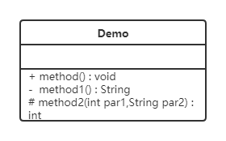

# 概述


## 设计模式分类


### 创建型模式


* 用于描述怎样创建对象,主要特点是将对象的创建与使用分离
* GoF书中提供了单例、原型、工厂方法、抽象工厂、建造者等 5 种创建型模式


### 结构型模式


* 用于描述如何将类或对象按某种布局组成更大的结构
* GoF书中提供了代理、适配器、桥接、装饰、外观、享元、组合等 7 种结构型模式


### 行为型模式


* 用于描述类或对象之间怎样相互协作共同完成单个对象无法单独完成的任务,以及怎样分配职责
* GoF书中提供了模板方法、策略、命令、职责链、状态、观察者、中介者、迭代器、访问者、备忘录、解释器等 11 种行为型模式


# UML


* 统一建模语言(Unified Modeling Language,UML)是用来设计软件的可视化建模语言,它的特点是简单、统一、图形化、能表达软件设计中的动态与静态信息
* UML 从目标系统的不同角度出发,定义了用例图、类图、对象图、状态图、活动图、时序图、协作图、构件图、部署图等 9 种图


## 类图


* 类图(Class diagram)是显示了模型的静态结构,特别是模型中存在的类、类的内部结构以及它们与其他类的关系等
* 类图不显示暂时性的信息
* 类图是面向对象建模的主要组成部分


## 类图表示法


### 类的表示


* 在UML类图中,类使用包含类名、属性(field) 和方法(method) 且带有分割线的矩形来表示




* 属性/方法名称前加的加号和减号表示了这个属性/方法的可见性,UML类图中表示可见性的符号有三种: 

  * +: 表示public


  * -: 表示private


  * #: 表示protected

* 属性的完整表示方式是:  **可见性  名称 : 类型 [ = 缺省值]**  

* 方法的完整表示方式是:  **可见性  名称(参数列表) [ :  返回类型]**

> 中括号中的内容表示是可选的
>
> 也有将类型放在变量名前面,返回值类型放在方法名前面


### 类关系的表示


#### 关联关系


##### 单向关联


* 单向关联用一个带箭头的实线表示


##### 双向关联


* 双向关联就是双方各自持有对方类型的成员变量,用一个不带箭头的直线表示


##### 自关联


* 自关联用一个带有箭头且指向自身的线表示


#### 聚合关系


* 聚合关系是关联关系的一种,是强关联关系,是整体和部分之间的关系
* 聚合关系也是通过成员对象来实现的,其中成员对象是整体对象的一部分,但是成员对象可以脱离整体对象而独立存在
* 聚合关系可以用带空心菱形的实线来表示,菱形指向整体: 


#### 组合关系


* 组合表示类之间的整体与部分的关系,但它是一种更强烈的聚合关系
* 在组合关系中,整体对象可以控制部分对象的生命周期,一旦整体对象不存在,部分对象也将不存在,部分对象不能脱离整体对象而存在
* 组合关系用带实心菱形的实线来表示,菱形指向整体


#### 依赖关系


* 依赖关系是一种使用关系,它是对象之间耦合度最弱的一种关联方式,是临时性的关联
* 在代码中,某个类的方法通过局部变量、方法的参数或者对静态方法的调用来访问另一个类(被依赖类)中的某些方法来完成一些职责
* 依赖关系使用带箭头的虚线来表示,箭头从使用类指向被依赖的类

 


#### 继承关系


* 继承关系是对象之间耦合度最大的一种关系,表示一般与特殊的关系,是父类与子类之间的关系,是一种继承关系
* 泛化关系用带空心三角箭头的实线来表示,箭头从子类指向父类
* 在代码实现时,使用面向对象的继承机制来实现泛化关系

 


#### 实现关系


* 实现关系是接口与实现类之间的关系,在这种关系中,类实现了接口,类中的操作实现了接口中所声明的所有的抽象操作
* 实现关系使用带空心三角箭头的虚线来表示,箭头从实现类指向接口


# 软件设计原则


## 迪米特法则


* 又叫最少知识原则.如果两个类无须直接通信,那就不应当发生直接的相互调用,可以通过第三方转发该调用,目的是降低类之间的耦合度
* 迪米特法则中的朋友是指: 当前对象本身、当前对象的成员对象、当前对象所创建的对象、当前对象的方法参数等,这些对象同当前对象存在关联、聚合或组合关系,可以直接访问这些对象的方法


## 合成复用原则


* 尽量先使用组合或者聚合等关联关系来实现,其次才考虑使用继承关系来实现
* 通常类的复用分为继承复用和合成复用两种
* 继承复用虽然有简单和易实现的优点,但它也存在以下缺点: 
  * 继承复用破坏了类的封装性.因为继承会将父类的实现细节暴露给子类,父类对子类是透明的,所以这种复用又称为白箱复用
  * 子类与父类的耦合度高.父类的实现的任何改变都会导致子类的实现发生变化,这不利于类的扩展与维护
  * 它限制了复用的灵活性.从父类继承而来的实现是静态的,在编译时已经定义,所以在运行时不可能发生变化
* 采用组合或聚合复用时,可以将已有对象纳入新对象中,使之成为新对象的一部分,新对象可以调用已有对象的功能,它有以下优点: 
  * 它维持了类的封装性.因为成分对象的内部细节是新对象看不见的,所以这种复用又称为黑箱复用
  * 对象间的耦合度低.可以在类的成员位置声明抽象
  * 复用的灵活性高.这种复用可以在运行时动态进行,新对象可以动态地引用与成分对象类型相同的对象


# 创建者模式


## 单例模式


* 这种模式涉及到一个单一的类,该类负责创建自己的对象,同时确保只有单个对象被创建
* 这个类提供了一种访问其唯一的对象的方式,可以直接访问,不需要实例化该类的对象


> 单例设计模式分类两种: 
>
> ​	饿汉式: 类加载就会导致该单实例对象被创建	
>
> ​	懒汉式: 类加载不会导致该单实例对象被创建,而是首次使用该对象时才会创建


## 工厂模式


### 简单工厂模式


* 简单工厂不是一种设计模式,反而比较像是一种编程习惯


#### 结构


* 抽象产品: 定义了产品的规范,描述了产品的主要特性和功能
* 具体产品: 实现或者继承抽象产品的子类
* 具体工厂: 提供了创建产品的方法,调用者通过该方法来获取产品


### 工厂模式


* 定义一个用于创建对象的接口,让子类决定实例化哪个产品类对象.工厂方法使一个产品类的实例化延迟到其工厂的子类


#### 结构


* 抽象工厂(Abstract Factory): 提供了创建产品的接口,调用者通过它访问具体工厂的工厂方法来创建产品
* 具体工厂(ConcreteFactory): 主要是实现抽象工厂中的抽象方法,完成具体产品的创建
* 抽象产品(Product): 定义了产品的规范,描述了产品的主要特性和功能
* 具体产品(ConcreteProduct): 实现了抽象产品角色所定义的接口,由具体工厂来创建,它同具体工厂之间一一对应


#### 优缺点


- 用户只需要知道具体工厂的名称就可得到所要的产品,无须知道产品的具体创建过程
- 在系统增加新的产品时只需要添加具体产品类和对应的具体工厂类,无须对原工厂进行任何修改,满足开闭原则
- 每增加一个产品就要增加一个具体产品类和一个对应的具体工厂类,这增加了系统的复杂度


### 抽象工厂模式


* 抽象工厂模式将考虑多等级产品的生产,将同一个具体工厂所生产的位于不同等级的一组产品称为一个产品族
* 抽象工厂模式是工厂方法模式的升级版本,工厂方法模式只生产一个等级的产品,而抽象工厂模式可生产多个等级的产品


#### 结构


* 抽象工厂(Abstract Factory): 提供了创建产品的接口,它包含多个创建产品的方法,可以创建多个不同等级的产品
* 具体工厂(Concrete Factory): 主要是实现抽象工厂中的多个抽象方法,完成具体产品的创建
* 抽象产品(Product): 定义了产品的规范,描述了产品的主要特性和功能,抽象工厂模式有多个抽象产品
* 具体产品(ConcreteProduct): 实现了抽象产品角色所定义的接口,由具体工厂来创建,它 同具体工厂之间是多对一的关系


#### 优缺点


* 当一个产品族中的多个对象被设计成一起工作时,它能保证客户端始终只使用同一个产品族中的对象
* 当产品族中需要增加一个新的产品时,所有的工厂类都需要进行修改


#### 使用场景


* 当需要创建的对象是一系列相互关联或相互依赖的产品族时,如电器工厂中的电视机、洗衣机、空调等

* 系统中有多个产品族,但每次只使用其中的某一族产品,如有人只喜欢穿某一个品牌的衣服和鞋

* 系统中提供了产品的类库,且所有产品的接口相同,客户端不依赖产品实例的创建细节和内部结构


## 原型模式


* 用一个已经创建的实例作为原型,通过复制该原型对象来创建一个和原型对象相同的新对象


### 结构


* 抽象原型类: 规定了具体原型对象必须实现的的 clone() 方法
* 具体原型类: 实现抽象原型类的 clone() 方法,它是可被复制的对象
* 访问类: 使用具体原型类中的 clone() 方法来复制新的对象


### 实现


* 原型模式的克隆分为浅克隆和深克隆

> 浅克隆: 创建一个新对象,新对象的属性和原来对象完全相同,对于非基本类型属性,仍指向原有属性所指向的对象的内存地址
>
> 深克隆: 创建一个新对象,属性中引用的其他对象也会被克隆,不再指向原有对象地址

* Java中的Object类中提供了 `clone()` 方法来实现浅克隆


### 使用场景


* 对象的创建非常复杂,可以使用原型模式快捷的创建对象
* 性能和安全要求比较高


## 建造者模式


### 概述


* 将一个复杂对象的构建与表示分离,使得同样的构建过程可以创建不同的表示,适用于某个对象的构建过程复杂的情况
* 分离了部件的构造(由Builder来负责)和装配(由Director负责),从而可以构造出复杂的对象
* 实现了构建算法、装配算法的解耦,实现了更好的复用


### 结构


* 抽象建造者类(Builder): 这个接口规定要实现复杂对象的那些部分的创建,并不涉及具体的部件对象的创建

* 具体建造者类(ConcreteBuilder): 实现 Builder 接口,完成复杂产品的各个部件的具体创建方法,在构造过程完成后,提供产品的实例

* 产品类(Product): 要创建的复杂对象

* 指挥者类(Director): 调用具体建造者来创建复杂对象的各个部分,在指导者中不涉及具体产品的信息,只负责保证对象各部分完整创建或按某种顺序创建


### 优缺点


- 建造者模式的封装性很好.使用建造者模式可以有效的封装变化,在使用建造者模式的场景中,一般产品类和建造者类是比较稳定的,因此,将主要的业务逻辑封装在指挥者类中对整体而言可以取得比较好的稳定性
- 在建造者模式中,客户端不必知道产品内部组成的细节,将产品本身与产品的创建过程解耦,使得相同的创建过程可以创建不同的产品对象
- 可以更加精细地控制产品的创建过程.将复杂产品的创建步骤分解在不同的方法中,使得创建过程更加清晰,也更方便使用程序来控制创建过程
- 建造者模式很容易进行扩展.如果有新的需求,通过实现一个新的建造者类就可以完成,基本上不用修改之前已经测试通过的代码,因此也就不会对原有功能引入风险。符合开闭原则
- 造者模式所创建的产品一般具有较多的共同点,其组成部分相似,如果产品之间的差异性很大,则不适合使用建造者模式,因此其使用范围受到一定的限制


### 使用场景


- 创建的对象较复杂,由多个部件构成,各部件面临着复杂的变化,但构件间的建造顺序是稳定的
- 创建复杂对象的算法独立于该对象的组成部分以及它们的装配方式,即产品的构建过程和最终的表示是独立的


## 创建者模式对比


### 工厂VS建造者


* 工厂方法模式注重的是整体对象的创建方式;建造者模式注重的是部件构建的过程,意在通过一步一步地精确构造创建出一个复杂的对象


### 抽象工厂VS建造者


* 抽象工厂模式实现对产品家族的创建,一个产品家族是这样的一系列产品:具有不同分类维度的产品组合,采用抽象工厂模式则是不需要关心构建过程,只关心什么产品由什么工厂生产即可
* 建造者模式则是要求按照指定的蓝图建造产品,它的主要目的是通过组装零配件而产生一个新产品
* 如果将抽象工厂模式看成汽车配件生产工厂,生产一个产品族的产品,那么建造者模式就是一个汽车组装工厂,通过对部件的组装可以返回一辆完整的汽车


# 结构型模式


* 结构型模式描述如何将类或对象按某种布局组成更大的结构.它分为类结构型模式和对象结构型模式,前者采用继承机制,后者釆用组合或聚合
* 组合关系或聚合关系比继承关系耦合度低,满足合成复用原则,所以对象结构型模式比类结构型模式具有更大的灵活性


## 代理模式


### 结构


* 抽象主题(Subject)类: 通过接口或抽象类声明真实主题和代理对象实现的业务方法
* 真实主题(Real Subject)类: 实现了抽象主题中的具体业务,是代理对象所代表的真实对象,是最终要引用的对象
* 代理(Proxy)类: 提供了与真实主题相同的接口,其内部含有对真实主题的引用,它可以访问、控制或扩展真实主题的功能


### 静态代理


### JDK动态代理


### CGLIB动态代理


### 对比


* jdk代理和CGLIB代理
  * 使用CGLib实现动态代理,CGLib底层采用ASM字节码生成框架,使用字节码技术生成代理类,在JDK1.6之前比使用Java反射效率要高.唯一需要注意的是,CGLib不能对声明为final的类或者方法进行代理,因为CGLib原理是动态生成被代理类的子类

  * 在JDK1.6、JDK1.7、JDK1.8逐步对JDK动态代理优化之后,在调用次数较少的情况下,JDK代理效率高于CGLib代理效率,只有当进行大量调用的时候,JDK1.6和JDK1.7比CGLib代理效率低一点,但是到JDK1.8的时候,JDK代理效率高于CGLib代理.所以如果有接口使用JDK动态代理,如果没有接口使用CGLIB代理

* 动态代理和静态代理
  * 动态代理与静态代理相比较,最大的好处是接口中声明的所有方法都被转移到调用处理器一个集中的方法中处理.这样,在接口方法数量比较多的时候,可以进行灵活处理,而不需要像静态代理那样每一个方法进行中转

  * 如果接口增加一个方法,静态代理模式除了所有实现类需要实现这个方法外,所有代理类也需要实现此方法,增加了代码维护的复杂度.而动态代理不会出现该问题


### 优缺点


- 代理模式在客户端与目标对象之间起到一个中介作用和保护目标对象的作用
- 代理对象可以扩展目标对象的功能
- 代理模式能将客户端与目标对象分离,在一定程度上降低了系统的耦合度
- 增加了系统的复杂度


### 使用场景


* 远程(Remote)代理: 本地服务通过网络请求远程服务.为了实现本地到远程的通信,我们需要实现网络通信,处理其中可能的异常.为良好的代码设计和可维护性,可以将网络通信部分隐藏起来,只暴露给本地服务一个接口,通过该接口即可访问远程服务提供的功能,而不必过多关心通信部分的细节

* 防火墙(Firewall)代理: 将浏览器配置成使用代理功能时,防火墙就将你的浏览器的请求转给互联网;当互联网返回响应时,代理服务器再把它转给你的浏览器

* 保护(Protect or Access)代理: 控制对一个对象的访问,如果需要,可以给不同的用户提供不同级别的使用权限


## 适配器模式


### 概述


* 将一个类的接口转换成客户希望的另外一个接口,使得原本由于接口不兼容而不能一起工作的那些类能一起工作
* 适配器模式分为类适配器模式和对象适配器模式,前者类之间的耦合度比后者高,且要求程序员了解现有组件库中的相关组件的内部结构


### 结构


* 目标(Target)接口: 当前系统业务所期待的接口,它可以是抽象类或接口
* 适配者(Adaptee)类: 它是被访问和适配的现存组件库中的组件接口
* 适配器(Adapter)类: 它是一个转换器,通过继承或引用适配者的对象,把适配者接口转换成目标接口,让客户按目标接口的格式访问适配者


### 类适配器模式


* 实现方式: 定义一个适配器类来实现当前系统的业务接口,同时又继承现有组件库中已经存在的组件
* 类适配器模式违背了合成复用原则,类适配器是客户类有一个接口规范的情况下可用,反之不可用


### 对象适配器模式


* 实现方式: 对象适配器模式可釆用将现有组件库中已经实现的组件引入适配器类中,该类同时实现当前系统的业务接口


### 应用场景


* 以前开发的系统存在满足新系统功能需求的类,但其接口同新系统的接口不一致
* 使用第三方提供的组件,但组件接口定义和自己要求的接口定义不同


## 装饰者模式


* 指在不改变现有对象结构的情况下,动态地给该对象增加一些职责(即增加其额外功能)的模式


### 结构


* 抽象构件(Component)角色: 定义一个抽象接口以规范准备接收附加责任的对象
* 具体构件(Concrete  Component)角色: 实现抽象构件,通过装饰角色为其添加一些职责
* 抽象装饰(Decorator)角色:  继承或实现抽象构件,并包含具体构件的实例,可以通过其子类扩展具体构件的功能
* 具体装饰(ConcreteDecorator)角色: 实现抽象装饰的相关方法,并给具体构件对象添加附加的责任


### 优缺点


* 比继承更加灵活性的扩展功能,使用更加方便,可以通过组合不同的装饰者对象来获取具有不同行为状态的多样化的结果

* 装饰类和被装饰类可以独立发展,不会相互耦合,装饰模式是继承的一个替代模式,装饰模式可以动态扩展一个实现类的功能


### 使用场景


* 当不能采用继承的方式对系统进行扩充或者采用继承不利于系统扩展和维护时

* 在不影响其他对象的情况下,以动态、透明的方式给单个对象添加职责

* 当对象的功能要求可以动态地添加,也可以再动态地撤销时


### 代理和装饰者


* 相同点: 
  * 都要实现与目标类相同的业务接口
  * 在两个类中都要声明目标对象
  * 都可以在不修改目标类的前提下增强目标方法
* 不同点: 
  * 装饰者是为了增强目标对象;静态代理是为了保护和隐藏目标对象
  * 装饰者是由外界传递进来,可以通过构造方法传递;静态代理是在代理类内部创建,以此来隐藏目标对象


## 桥接模式


* 将抽象与实现分离,使它们可以独立变化,它是用组合关系代替继承关系来实现,从而降低了抽象和实现这两个可变维度的耦合度


### 结构


* 抽象化(Abstraction)角色 : 定义抽象类,并包含一个对实现化对象的引用
* 扩展抽象化(Refined  Abstraction)角色 : 是抽象化角色的子类,实现父类中的业务方法,并通过组合关系调用实现化角色中的业务方法
* 实现化(Implementor)角色 : 定义实现化角色的接口,供扩展抽象化角色调用
* 具体实现化(Concrete Implementor)角色 : 给出实现化角色接口的具体实现


### 优缺点


* 系统的可扩充性,在两个变化维度中任意扩展一个维度,都不需要修改原有系统

* 实现细节对客户透明


### 使用场景


* 当一个类存在两个独立变化的维度,且这两个维度都需要进行扩展时
* 当一个系统不希望使用继承或因为多层次继承导致系统类的个数急剧增加时
* 当一个系统需要在构件的抽象化角色和具体化角色之间增加更多的灵活性时,避免在两个层次之间建立静态的继承联系,通过桥接模式可以使它们在抽象层建立一个关联关系


## 外观模式


* 又名门面模式,是一种通过为多个复杂的子系统提供一个一致的接口,而使这些子系统更加容易被访问的模式
* 该模式对外有一个统一接口,外部应用程序不用关心内部子系统的具体的细节,这样会大大降低应用程序的复杂度,提高了程序的可维护性


### 结构


* 外观(Facade)角色: 为多个子系统对外提供一个共同的接口
* 子系统(Sub System)角色: 实现系统的部分功能,客户可以通过外观角色访问它


### 优缺点


* 降低了子系统与客户端之间的耦合度,使得子系统的变化不会影响调用它的客户类
* 对客户屏蔽了子系统组件,减少了客户处理的对象数目,并使得子系统使用起来更加容易
* 不符合开闭原则,修改很麻烦


### 使用场景


* 对分层结构系统构建时,使用外观模式定义子系统中每层的入口点可以简化子系统之间的依赖关系
* 当一个复杂系统的子系统很多时,外观模式可以为系统设计一个简单的接口供外界访问
* 当客户端与多个子系统之间存在很大的联系时,引入外观模式可将它们分离,从而提高子系统的独立性和可移植性


## 组合模式


* 又名部分整体模式,是用于把一组相似的对象当作一个单一的对象
* 组合模式依据树形结构来组合对象,用来表示部分以及整体层次


### 结构


* 抽象根节点(Component): 定义系统各层次对象的共有方法和属性,可以预先定义一些默认行为和属性
* 树枝节点(Composite): 定义树枝节点的行为,存储子节点,组合树枝节点和叶子节点形成一个树形结构
* 叶子节点(Leaf): 叶子节点对象,其下再无分支,是系统层次遍历的最小单位


### 分类


* 透明组合模式.在抽象根节点角色中声明了所有用于管理成员对象的方法,这样做的好处是确保所有的构件类都有相同的接口

* 透明组合模式也是组合模式的标准形式

* 透明组合模式的缺点是不够安全,因为叶子对象和容器对象在本质上是有区别的,叶子对象不可能有下一个层次的对象,即不可能包含成员对象,因此为其提供 add()、remove() 等方法是没有意义的,这在编译阶段不会出错,但在运行阶段如果调用这些方法可能会出错

* 安全组合模式.在抽象构件角色中没有声明任何用于管理成员对象的方法,而是在树枝节点类中声明并实现这些方法.

* 安全组合模式的缺点是不够透明,因为叶子构件和容器构件具有不同的方法,且容器构件中那些用于管理成员对象的方法没有在抽象构件类中定义,因此客户端不能完全针对抽象编程,必须有区别地对待叶子构件和容器构件


### 优缺点


* 组合模式可以清楚地定义分层次的复杂对象,表示对象的全部或部分层次,它让客户端忽略了层次的差异,方便对整个层次结构进行控制
* 客户端可以一致地使用一个组合结构或其中单个对象,不必关心处理的是单个对象还是整个组合结构,简化了客户端代码
* 在组合模式中增加新的树枝节点和叶子节点都很方便,无须对现有类库进行任何修改,符合开闭原则
* 组合模式为树形结构的面向对象实现提供了一种灵活的解决方案,通过叶子节点和树枝节点的递归组合,可以形成复杂的树形结构,但对树形结构的控制却非常简单


### 使用场景


* 组合模式正是应树形结构而生,所以组合模式的使用场景就是出现树形结构的地方.比如文件目录显示,多级目录呈现等树形结构数据的操作


## 享元模式


* 运用共享技术来有效地支持大量细粒度对象的复用,通过共享已经存在的对象来大幅度减少需要创建的对象数量、避免大量相似对象的开销,从而提高系统资源的利用率


### 结构


* 内部状态,即不会随着环境的改变而改变的可共享部分
* 外部状态,指随环境改变而改变的不可以共享的部分,享元模式的实现要领就是区分应用中的这两种状态,并将外部状态外部化
* 抽象享元角色(Flyweight): 通常是一个接口或抽象类,在抽象享元类中声明了具体享元类公共的方法,这些方法可以向外界提供享元对象的内部数据(内部状态),同时也可以通过这些方法来设置外部数据(外部状态)
* 具体享元(Concrete Flyweight)角色: 它实现了抽象享元类,称为享元对象;在具体享元类中为内部状态提供了存储空间.通常我们可以结合单例模式来设计具体享元类,为每一个具体享元类提供唯一的享元对象
* 非享元(Unsharable Flyweight)角色: 并不是所有的抽象享元类的子类都需要被共享,不能被共享的子类可设计为非共享具体享元类;当需要一个非共享具体享元类的对象时可以直接通过实例化创建
* 享元工厂(Flyweight Factory)角色: 负责创建和管理享元角色.当客户对象请求一个享元对象时,享元工厂检査系统中是否存在符合要求的享元对象,如果存在则提供给客户;如果不存在的话,则创建一个新的享元对象


### 优缺点


- 极大减少内存中相似或相同对象数量,节约系统资源,提供系统性能
- 享元模式中的外部状态相对独立,且不影响内部状态
- 为了使对象可以共享,需要将享元对象的部分状态外部化,分离内部状态和外部状态,使程序逻辑复杂


### 使用场景


- 一个系统有大量相同或者相似的对象,造成内存的大量耗费
- 对象的大部分状态都可以外部化,可以将这些外部状态传入对象中
- 在使用享元模式时需要维护一个存储享元对象的享元池,而这需要耗费一定的系统资源,因此,应当在需要多次重复使用享元对象时才值得使用享元模式


# 行为型模式


* 行为型模式用于描述程序在运行时复杂的流程控制,即描述多个类或对象之间怎样相互协作共同完成单个对象都无法单独完成的任务,它涉及算法与对象间职责的分配
* 行为型模式分为类行为模式和对象行为模式,前者采用继承机制来在类间分派行为,后者采用组合或聚合在对象间分配行为.由于组合关系或聚合关系比继承关系耦合度低,满足合成复用原则,所以对象行为模式比类行为模式具有更大的灵活性


## 模板方法模式


* 定义一个操作中的算法骨架,而将算法的一些步骤延迟到子类中,使得子类可以不改变该算法结构的情况下重定义该算法的某些特定步骤


###  结构


* 抽象类(Abstract Class): 负责给出一个算法的轮廓和骨架,由一个模板方法和若干个基本方法构成

  * 模板方法: 定义了算法的骨架,按某种顺序调用其包含的基本方法

  * 基本方法: 是实现算法各个步骤的方法,是模板方法的组成部分,基本方法又可以分为三种: 

    * 抽象方法(Abstract Method) : 一个抽象方法由抽象类声明、由其具体子类实现

    * 具体方法(Concrete Method) : 一个具体方法由一个抽象类或具体类声明并实现,其子类可以进行覆盖也可以直接继承

    * 钩子方法(Hook Method) : 在抽象类中已经实现,包括用于判断的逻辑方法和需要子类重写的空方法两种.一般钩子方法是用于判断的逻辑方法,这类方法名一般为isXxx,返回值类型为boolean类型

* 具体子类(Concrete Class): 实现抽象类中所定义的抽象方法和钩子方法,它们是一个顶级逻辑的组成步骤


### 优缺点


* 提高代码复用性.将相同部分的代码放在抽象的父类中,而将不同的代码放入不同的子类中

* 实现了反向控制.通过一个父类调用其子类的操作,通过对子类的具体实现扩展不同的行为,实现了反向控制 ,并符合开闭原则

* 对每个不同的实现都需要定义一个子类,这会导致类的个数增加,系统更加庞大,设计也更加抽象

* 父类中的抽象方法由子类实现,子类执行的结果会影响父类的结果,这导致一种反向的控制结构,它提高了代码阅读的难度


### 适用场景


* 算法的整体步骤很固定,但其中个别部分易变时,这时候可以使用模板方法模式,将容易变的部分抽象出来,供子类实现
* 需要通过子类来决定父类算法中某个步骤是否执行,实现子类对父类的反向控制


## 策略模式


* 定义一系列算法,并将每个算法封装起来,使它们可以相互替换,且算法的变化不会影响使用算法的客户
* 策略模式属于对象行为模式,它通过对算法进行封装,把使用算法的责任和算法的实现分割开来,并委派给不同的对象对这些算法进行管理


### 结构


* 抽象策略(Strategy)类: 这是一个抽象角色,通常由一个接口或抽象类实现。此角色给出所有的具体策略类所需的接口
* 具体策略(Concrete Strategy)类: 实现了抽象策略定义的接口,提供具体的算法实现或行为
* 环境(Context)类: 持有一个策略类的引用,最终给客户端调用                                             


### 优缺点


* 策略类之间可以自由切换.由于策略类都实现同一个接口,所以使它们之间可以自由切换

* 易于扩展.增加一个新的策略只需要添加一个具体的策略类即可,基本不需要改变原有的代码,符合开闭原则

* 避免使用多重条件选择语句(if else),充分体现面向对象设计思想

* 客户端必须知道所有的策略类,并自行决定使用哪一个策略类

* 策略模式将造成产生很多策略类,可以通过使用享元模式在一定程度上减少对象的数量


### 使用场景


* 一个系统需要动态地在几种算法中选择一种时,可将每个算法封装到策略类中
* 一个类定义了多种行为,并且这些行为在这个类的操作中以多个条件语句的形式出现,可将每个条件分支移入它们各自的策略类中以代替这些条件语句
* 系统中各算法彼此完全独立,且要求对客户隐藏具体算法的实现细节时
* 系统要求使用算法的客户不应该知道其操作的数据时,可使用策略模式来隐藏与算法相关的数据结构
* 多个类只区别在表现行为不同,可以使用策略模式,在运行时动态选择具体要执行的行为


## 命令模式


* 将一个请求封装为一个对象,使发出请求的责任和执行请求的责任分割开,这样两者之间通过命令对象进行沟通,这样方便将命令对象进行存储、传递、调用、增加与管理


### 结构


* 抽象命令类(Command)角色:  定义命令的接口,声明执行的方法
* 具体命令(Concrete  Command)角色: 具体的命令,实现命令接口;通常会持有接收者,并调用接收者的功能来完成命令要执行的操作
* 实现者/接收者(Receiver)角色:  接收者,真正执行命令的对象.任何类都可能成为一个接收者,只要它能够实现命令要求实现的相应功能
* 调用者/请求者(Invoker)角色:  要求命令对象执行请求,通常会持有命令对象,可以持有很多的命令对象.这个是客户端真正触发命令并要求命令执行相应操作的地方,也就是说相当于使用命令对象的入口


### 优缺点


* 降低系统的耦合度.命令模式能将调用操作的对象与实现该操作的对象解耦
* 增加或删除命令非常方便.采用命令模式增加与删除命令不会影响其他类,它满足开闭原则,对扩展比较灵活
* 可以实现宏命令.命令模式可以与组合模式结合,将多个命令装配成一个组合命令,即宏命令
* 方便实现 Undo 和 Redo 操作.命令模式可以与后面介绍的备忘录模式结合,实现命令的撤销与恢复
* 使用命令模式可能会导致某些系统有过多的具体命令类
* 系统结构更加复杂


### 使用场景


* 系统需要将请求调用者和请求接收者解耦,使得调用者和接收者不直接交互
* 系统需要在不同的时间指定请求、将请求排队和执行请求
* 系统需要支持命令的撤销(Undo)操作和恢复(Redo)操作


## 责任链模式


* 又名职责链模式,为了避免请求发送者与多个请求处理者耦合在一起,将所有请求的处理者通过前一对象记住其下一个对象的引用而连成一条链;当有请求发生时,可将请求沿着这条链传递,直到有对象处理它为止


### 结构


* 抽象处理者(Handler)角色: 定义一个处理请求的接口,包含抽象处理方法和一个后继连接
* 具体处理者(Concrete Handler)角色: 实现抽象处理者的处理方法,判断能否处理本次请求,如果可以处理请求则处理,否则将该请求转给它的后继者
* 客户类(Client)角色: 创建处理链,并向链头的具体处理者对象提交请求,它不关心处理细节和请求的传递过程


### 优缺点


* 降低了对象之间的耦合度.该模式降低了请求发送者和接收者的耦合度

* 增强了系统的可扩展性.可以根据需要增加新的请求处理类,满足开闭原则

* 增强了给对象指派职责的灵活性.当工作流程发生变化,可以动态地改变链内的成员或者修改它们的次序,也可动态地新增或者删除责任

* 责任链简化了对象之间的连接.一个对象只需保持一个指向其后继者的引用,不需保持其他所有处理者的引用,这避免了使用众多的if···else

* 责任分担.每个类只需要处理自己该处理的工作,不能处理的传递给下一个对象完成,明确各类的责任范围,符合类的单一职责原则

* 不能保证每个请求一定被处理。由于一个请求没有明确的接收者,所以不能保证它一定会被处理,该请求可能一直传到链的末端都得不到处理

* 对比较长的职责链,请求的处理可能涉及多个处理对象,系统性能将受到一定影响

* 职责链建立的合理性要靠客户端来保证,增加了客户端的复杂性,可能会由于职责链的错误设置而导致系统出错,如可能会造成循环调用


## 状态模式


* 对有状态的对象,把复杂的判断逻辑提取到不同的状态对象中,允许状态对象在其内部状态发生改变时改变其行为


### 结构


* 环境(Context)角色: 也称为上下文,它定义了客户程序需要的接口,维护一个当前状态,并将与状态相关的操作委托给当前状态对象来处理
* 抽象状态(State)角色: 定义一个接口,用以封装环境对象中的特定状态所对应的行为
* 具体状态(Concrete  State)角色: 实现抽象状态所对应的行为


### 优缺点


* 将所有与某个状态有关的行为放到一个类中,并且可以方便地增加新的状态,只需要改变对象状态即可改变对象的行为
* 允许状态转换逻辑与状态对象合成一体,而不是某一个巨大的条件语句块
* 状态模式的使用必然会增加系统类和对象的个数
* 状态模式的结构与实现都较为复杂,如果使用不当将导致程序结构和代码的混乱
* 状态模式对开闭原则的支持并不太好


### 使用场景


- 当一个对象的行为取决于它的状态,并且它必须在运行时根据状态改变它的行为时,就可以考虑使用状态模式
- 一个操作中含有庞大的分支结构,并且这些分支决定于对象的状态时


## 观察者模式


* 又被称为发布-订阅(Publish/Subscribe)模式,它定义了一种一对多的依赖关系,让多个观察者对象同时监听某一个主题对象.这个主题对象在状态变化时,会通知所有的观察者对象,使他们能够自动更新自己


### 结构


* Subject: 抽象主题(抽象被观察者),抽象主题角色把所有观察者对象保存在一个集合里,每个主题都可以有任意数量的观察者,抽象主题提供一个接口,可以增加和删除观察者对象
* ConcreteSubject: 具体主题(具体被观察者),该角色将有关状态存入具体观察者对象,在具体主题的内部状态发生改变时,给所有注册过的观察者发送通知
* Observer: 抽象观察者,是观察者的抽象类,它定义了一个更新接口,使得在得到主题更改通知时更新自己
* ConcrereObserver: 具体观察者,实现抽象观察者定义的更新接口,以便在得到主题更改通知时更新自身的状态


### 优缺点


* 降低了目标与观察者之间的耦合关系,两者之间是抽象耦合关系
* 被观察者发送通知,所有注册的观察者都会收到信息,可以实现广播机制
* 如果观察者非常多的话,那么所有的观察者收到被观察者发送的通知会耗时
* 如果被观察者有循环依赖的话,那么被观察者发送通知会使观察者循环调用,会导致系统崩溃


### 使用场景


* 对象间存在一对多关系,一个对象的状态发生改变会影响其他对象
* 当一个抽象模型有两个方面,其中一个方面依赖于另一方面时


## 中介者模式


* 又叫调停模式,定义一个中介角色来封装一系列对象之间的交互,使原有对象之间的耦合松散,且可以独立地改变它们之间的交互


### 结构


* 抽象中介者(Mediator)角色: 它是中介者的接口,提供了同事对象注册与转发同事对象信息的抽象方法

* 具体中介者(ConcreteMediator)角色: 实现中介者接口,定义一个 List 来管理同事对象,协调各个同事角色之间的交互关系,因此它依赖于同事角色
* 抽象同事类(Colleague)角色: 定义同事类的接口,保存中介者对象,提供同事对象交互的抽象方法,实现所有相互影响的同事类的公共功能
* 具体同事类(Concrete Colleague)角色: 是抽象同事类的实现者,当需要与其他同事对象交互时,由中介者对象负责后续的交互


### 优缺点


* 松散耦合.中介者模式通过把多个同事对象之间的交互封装到中介者对象里面,从而使得同事对象之间松散耦合,基本上可以做到互补依赖,这样一来,同事对象就可以独立地变化和复用,而不再像以前那样牵一处而动全身了

* 集中控制交互.多个同事对象的交互,被封装在中介者对象里面集中管理,使得这些交互行为发生变化的时候,只需要修改中介者对象就可以了,当然如果是已经做好的系统,那么就扩展中介者对象,而各个同事类不需要做修改

* 一对多关联转变为一对一的关联.没有使用中介者模式的时候,同事对象之间的关系通常是一对多的,引入中介者对象以后,中介者对象和同事对象的关系通常变成双向的一对一,这会让对象的关系更容易理解和实现

* 当同事类太多时,中介者的职责将很大,它会变得复杂而庞大,以至于系统难以维护


### 使用场景


* 系统中对象之间存在复杂的引用关系,系统结构混乱且难以理解
* 当想创建一个运行于多个类之间的对象,又不想生成新的子类时


## 迭代器模式


* 提供一个对象来顺序访问聚合对象中的一系列数据,而不暴露聚合对象的内部表示


### 结构


* 抽象聚合(Aggregate)角色: 定义存储、添加、删除聚合元素以及创建迭代器对象的接口

* 具体聚合(ConcreteAggregate)角色: 实现抽象聚合类,返回一个具体迭代器的实例
* 抽象迭代器(Iterator)角色: 定义访问和遍历聚合元素的接口,通常包含 hasNext()、next() 等方法
* 具体迭代器(Concretelterator)角色: 实现抽象迭代器接口中所定义的方法,完成对聚合对象的遍历,记录遍历的当前位置


### 优缺点


* 它支持以不同的方式遍历一个聚合对象,在同一个聚合对象上可以定义多种遍历方式.在迭代器模式中只需要用一个不同的迭代器来替换原有迭代器即可改变遍历算法,也可以自己定义迭代器的子类以支持新的遍历方式
* 迭代器简化了聚合类。由于引入了迭代器,在原有的聚合对象中不需要再自行提供数据遍历等方法,这样可以简化聚合类的设计
* 在迭代器模式中,由于引入了抽象层,增加新的聚合类和迭代器类都很方便,无须修改原有代码,满足开闭原则的要求
* 增加了类的个数,这在一定程度上增加了系统的复杂性


### 使用场景


* 当需要为聚合对象提供多种遍历方式时
* 当需要为遍历不同的聚合结构提供一个统一的接口时
* 当访问一个聚合对象的内容而无须暴露其内部细节的表示时


## 访问者模式


* 封装一些作用于某种数据结构中的各元素的操作,它可以在不改变这个数据结构的前提下定义作用于这些元素的新的操作


### 结构


* 抽象访问者(Visitor)角色: 定义了对每一个元素`(Element)`访问的行为,它的参数就是可以访问的元素,它的方法个数理论上来讲与元素类个数(Element的实现类个数)是一样的,从这点不难看出,访问者模式要求元素类的个数不能改变
* 具体访问者(ConcreteVisitor)角色: 给出对每一个元素类访问时所产生的具体行为
* 抽象元素(Element)角色: 定义了一个接受访问者的方法(`accept`),其意义是指,每一个元素都要可以被访问者访问
* 具体元素(ConcreteElement)角色:  提供接受访问方法的具体实现,而这个具体的实现,通常情况下是使用访问者提供的访问该元素类的方法
* 对象结构(Object Structure)角色: 定义当中所提到的对象结构,对象结构是一个抽象表述,具体点可以理解为一个具有容器性质或者复合对象特性的类,它会含有一组元素(`Element`),并且可以迭代这些元素,供访问者访问


### 优缺点


* 扩展性好.在不修改对象结构中的元素的情况下,为对象结构中的元素添加新的功能

* 复用性好.通过访问者来定义整个对象结构通用的功能,从而提高复用程度

* 分离无关行为.通过访问者来分离无关的行为,把相关的行为封装在一起,构成一个访问者,这样每一个访问者的功能都比较单一

* 对象结构变化很困难

* 在访问者模式中,每增加一个新的元素类,都要在每一个具体访问者类中增加相应的具体操作,这违背了开闭原则

* 违反了依赖倒置原则

* 访问者模式依赖了具体类,而没有依赖抽象类


### 使用场景


* 对象结构相对稳定,但其操作算法经常变化的程序

* 对象结构中的对象需要提供多种不同且不相关的操作,而且要避免让这些操作的变化影响对象的结构

  

### 扩展


* 分派:变量被声明时的类型叫做变量的静态类型,有些人又把静态类型叫做明显类型;而变量所引用的对象的真实类型又叫做变量的实际类型.比如 `Map map = new HashMap()` ,map变量的静态类型是 `Map` ,实际类型是 `HashMap` .根据对象的类型而对方法进行的选择,就是分派(Dispatch),分派(Dispatch)又分为两种,即静态分派和动态分派
* **静态分派(Static Dispatch)** 发生在编译时期,分派根据静态类型信息发生.静态分派对于我们来说并不陌生,方法重载就是静态分派
* **动态分派(Dynamic Dispatch)** 发生在运行时期,动态分派动态地置换掉某个方法.Java通过方法的重写支持动态分派
* **双分派**: 就是在选择一个方法的时候,不仅仅要根据消息接收者(receiver)的运行时区别,还要根据参数的运行时区别

```java
public class Animal {
    public void accept(Execute exe) {
        exe.execute(this);
    }
}

public class Dog extends Animal {
    public void accept(Execute exe) {
        exe.execute(this);
    }
}

public class Cat extends Animal {
    public void accept(Execute exe) {
        exe.execute(this);
    }
}

public class Execute {
    public void execute(Animal a) {
        System.out.println("animal");
    }

    public void execute(Dog d) {
        System.out.println("dog");
    }

    public void execute(Cat c) {
        System.out.println("cat");
    }
}

public class Client {
    public static void main(String[] args) {
        Animal a = new Animal();
        Animal d = new Dog();
        Animal c = new Cat();

        Execute exe = new Execute();
        a.accept(exe);
        d.accept(exe);
        c.accept(exe);
    }
}
```

* 在上面代码中,客户端将Execute对象做为参数传递给Animal类型的变量调用的方法,这里完成第一次分派,这里是方法重写,所以是动态分派,也就是执行实际类型中的方法,同时也`将自己this作为参数传递进去,这里就完成了第二次分派`,这里的Execute类中有多个重载的方法,而传递进行的是this,就是具体的实际类型的对象
* **双分派实现动态绑定的本质,就是在重载方法委派的前面加上了继承体系中覆盖的环节,由于覆盖是动态的,所以重载就是动态的了**


## 备忘录模式


* 又叫快照模式,在不破坏封装性的前提下,捕获一个对象的内部状态,并在该对象之外保存这个状态,以便以后当需要时能将该对象恢复到原先保存的状态


### 结构


* 发起人(Originator)角色: 记录当前时刻的内部状态信息,提供创建备忘录和恢复备忘录数据的功能,实现其他业务功能,它可以访问备忘录里的所有信息
* 备忘录(Memento)角色: 负责存储发起人的内部状态,在需要的时候提供这些内部状态给发起人
* 管理者(Caretaker)角色: 对备忘录进行管理,提供保存与获取备忘录的功能,但其不能对备忘录的内容进行访问与修改

> 备忘录有两个等效的接口: 
>
> * **窄接口**: 管理者(Caretaker)对象(和其他发起人对象之外的任何对象)看到的是备忘录的窄接口(narror Interface),这个窄接口只允许他把备忘录对象传给其他的对象
> * **宽接口**: 与管理者看到的窄接口相反,发起人对象可以看到一个宽接口(wide Interface),这个宽接口允许它读取所有的数据,以便根据这些数据恢复这个发起人对象的内部状态


### 白箱备忘录模式


* 备忘录角色对任何对象都提供一个接口,即宽接口,备忘录角色的内部所存储的状态就对所有对象公开
* 白箱备忘录模式是破坏封装性的,但是通过程序员自律,同样可以在一定程度上实现模式的大部分用意


### 黑箱备忘录模式


* 备忘录角色对发起人对象提供一个宽接口,而为其他对象提供一个窄接口.在Java语言中,实现双重接口的办法就是将**备忘录类**设计成**发起人类**的内部成员类
* 将 `RoleStateMemento` 设为 `GameRole` 的内部类,从而将 `RoleStateMemento` 对象封装在 `GameRole` 里面;在外面提供一个标识接口 `Memento` 给 `RoleStateCaretaker` 及其他对象使用.这样 `GameRole` 类看到的是 `RoleStateMemento` 所有的接口,而`RoleStateCaretaker`  及其他对象看到的仅仅是标识接口 `Memento` 所暴露出来的接口,从而维护了封装型


### 优缺点


- 提供了一种可以恢复状态的机制.当用户需要时能够比较方便地将数据恢复到某个历史的状态
- 实现了内部状态的封装.除了创建它的发起人之外,其他对象都不能够访问这些状态信息
- 简化了发起人类.发起人不需要管理和保存其内部状态的各个备份,所有状态信息都保存在备忘录中,并由管理者进行管理,这符合单一职责原则
- 资源消耗大.如果要保存的内部状态信息过多或者特别频繁,将会占用比较大的内存资源


### 使用场景


* 需要保存与恢复数据的场景,如玩游戏时的中间结果的存档功能

* 需要提供一个可回滚操作的场景,如 Word、记事本、Photoshop,idea等软件在编辑时按 Ctrl+Z 组合键,还有数据库中事务操作


## 解释器模式


* 给定一个语言,定义它的文法表示,并定义一个解释器,这个解释器使用该标识来解释语言中的句子
* 在解释器模式中,我们需要将待解决的问题,提取出规则,抽象为一种语言.比如加减法运算,规则为: 由数值和+-符号组成的合法序列,“1+3-2” 就是这种语言的句子
* 解释器就是要解析出来语句的含义


### 文法(语法)规则


* 文法是用于描述语言的语法结构的形式规则

```
expression ::= value | plus | minus
plus ::= expression ‘+’ expression   
minus ::= expression ‘-’ expression  
value ::= integer
```

> 这里的符号“::=”表示“定义为”的意思,竖线 | 表示或,左右的其中一个,引号内为字符本身,引号外为语法

* 上面规则描述为: 表达式可以是一个值,也可以是plus或者minus运算,而plus和minus又是由表达式结合运算符构成,值的类型为整型数


### 抽象语法树


* 在计算机科学中,抽象语法树(AbstractSyntaxTree,AST),或简称语法树(Syntax tree),是源代码语法结构的一种抽象表示,它以树状的形式表现编程语言的语法结构,树上的每个节点都表示源代码中的一种结构
* 用树形(二叉树)来表示符合文法规则的句子


### 结构


* 抽象表达式(Abstract Expression)角色: 定义解释器的接口,约定解释器的解释操作,主要包含解释方法 interpret()

* 终结符表达式(Terminal  Expression)角色: 是抽象表达式的子类,用来实现文法中与终结符相关的操作,文法中的每一个终结符都有一个具体终结表达式与之相对应
* 非终结符表达式(Nonterminal Expression)角色: 也是抽象表达式的子类,用来实现文法中与非终结符相关的操作,文法中的每条规则都对应于一个非终结符表达式
* 环境(Context)角色: 通常包含各个解释器需要的数据或是公共的功能,一般用来传递被所有解释器共享的数据,后面的解释器可以从这里获取这些值
* 客户端(Client): 主要任务是将需要分析的句子或表达式转换成使用解释器对象描述的抽象语法树,然后调用解释器的解释方法,当然也可以通过环境角色间接访问解释器的解释方法


### 优缺点


* 易于改变和扩展文法.由于在解释器模式中使用类来表示语言的文法规则,因此可以通过继承等机制来改变或扩展文法。每一条文法规则都可以表示为一个类,因此可以方便地实现一个简单的语言

* 实现文法较为容易.在抽象语法树中每一个表达式节点类的实现方式都是相似的,这些类的代码编写都不会特别复杂

* 增加新的解释表达式较为方便.如果用户需要增加新的解释表达式只需要对应增加一个新的终结符表达式或非终结符表达式类,原有表达式类代码无须修改,符合 开闭原则

* 对于复杂文法难以维护

* 在解释器模式中,每一条规则至少需要定义一个类,因此如果一个语言包含太多文法规则,类的个数将会急剧增加,导致系统难以管理和维护

* 执行效率较低

* 由于在解释器模式中使用了大量的循环和递归调用,因此在解释较为复杂的句子时其速度很慢,而且代码的调试过程也比较麻烦


### 使用场景


* 当语言的文法较为简单,且执行效率不是关键问题时

* 当问题重复出现,且可以用一种简单的语言来进行表达时

* 当一个语言需要解释执行,并且语言中的句子可以表示为一个抽象语法树的时候
