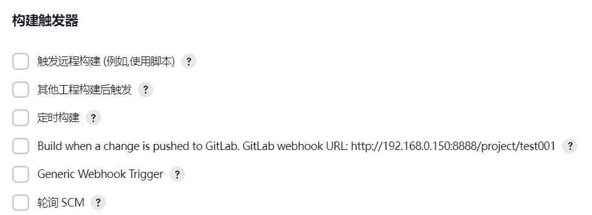
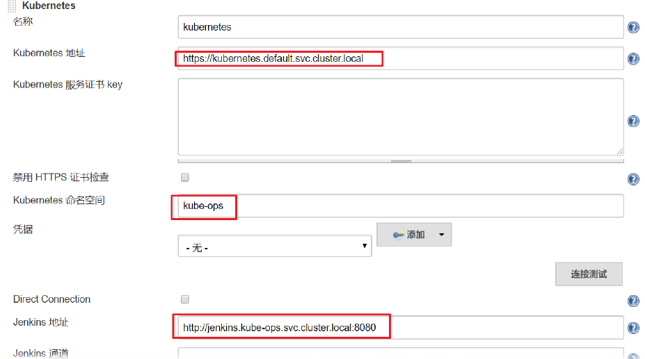

# Jenkins


# 概述


* 自动化集成,部署工具


# 安装


* [官网](https://www.jenkins.io/zh/download/)
* 使用yum安装

```shell
sudo wget -O /etc/yum.repos.d/jenkins.repo https://pkg.jenkins.io/redhat-stable/jenkins.repo
sudo rpm --import https://pkg.jenkins.io/redhat/jenkins.io.key
sudo yum upgrade
# 若不想使用openjdk,可以自行安装JDK
sudo yum install java-11-openjdk
sudo yum install jenkins
sudo systemctl daemon-reload
# 安装完成
```

* 若安装时报以下错误,可以在wget后添加参数:`--no-check-certificate`

```shell
ERROR: cannot verify pkg.jenkins.io's certificate, issued by ‘/C=US/O=Let's Encrypt/CN=R3’:
  Issued certificate has expired.
To connect to pkg.jenkins.io insecurely, use `--no-check-certificate'.
```

* 使用安装包安装

* 下载压缩包,解压到/software/jenkins: `rpm -ivh jenkins-2.190.3-1.1.noarch.rpm`
* 修改Jenkins配置: `vi /etc/syscofig/jenkins`

```shell
# 登录jenkins的账户,默认是jenkins,改成系统账户,也可以不改,自行添加jenkins账户
JENKINS_USER="root"
# jenknis运行端口
JENKINS_PORT="8888"
```

* 若修改上述配置文件无效,则需要修改`vi /usr/lib/systemd/system/jenkins.service`,新版本的配置文件地址

```shell
User=root
Environment="JENKINS_PORT=8888"
```

* 修改完之后执行`systemctl daemon-reload`

* 启动jenkins: `systemctl start jenkins`,如果启动出现:`usr/bin/java: No such file or directory`,做一个软连接到/usr/bin/java
  * `ln -s /usr/local/java/jdk8/bin/java /usr/bin/java`
* 网页访问: `ip:port/8888`,若一直停留在初始化页面,则需要更换Jenkins的源地址,`/root/.jenkins/hudson.model.UpdateCenter.xml`

```xml
# 修改URL里的标签为国内的源,以下为清华的源地址
<?xml version='1.1' encoding='UTF-8'?>
<sites>
  <site>
    <id>default</id>
    <url>https://mirrors.tuna.tsinghua.edu.cn/jenkins/updates/update-center.json</url>
  </site>
</sites>
```

* 初始化需要输入admin账号的密码: `cat /var/lib/jenkins/secrets/initialAdminPassword  `
* 不要选择推荐的插件安装,非常慢,直接选择插件来安装,选择无直接进入,新建一个管理员账号


# Configure


## JDK


* 进入Jenkins->Global Tool Configuration->JDK->新增JDK
* 名称可自定义,目录填写JDK目录.若是安装openjdk,则安装目录在/usr/lib/jvm中


## Maven


* Jenkins->Global Tool Configuration->Maven->新增Maven
* 名称可自定义,目录填写Maven目录,注意修改本地仓库地址和远程仓库地址


## 添加全局变量


* Manage Jenkins->Configure System->Global Properties,添加三个全局变量JAVA_HOME、M2_HOME、PATH+EXTRA
* 他们的值分别是各自的安装目录,而PATH+EXTRA的值是`$M2_HOME/bin`


# 插件管理


* 在Web页面上依次点击:Jenkins->Manage Jenkins->Manage Plugins,点击Availablera,让Jenkins将官方的插件列表下载到本地,接着修改地址文件,替换为国内插件地址

```shell
#  修改源地址,不同版本可能源地址不一样,需要修改2个地方cd /root/.jenkins/updates
cd /var/lib/jenkins/updates
sed -i 's/https:\/\/updates.jenkins.io\/download/https:\/\/mirrors.tuna.tsinghua.edu.cn\/jenkins/g' default.json && sed -i 's/https:\/\/updates.jenkins-ci.org\/download/https:\/\/mirrors.tuna.tsinghua.edu.cn\/jenkins/g' default.json && sed -i  's/https:\/\/www.google.com/https:\/\/www.baidu.com/g' default.json
cd /root/.jenkins/updates
```

* 修改完之后,切换到Manage Plugins的Advanced,把Update Site改为国内插件下载地址

```shell
https://mirrors.tuna.tsinghua.edu.cn/jenkins/updates/update-center.json
```

* Sumbit后,在浏览器输入http://ip:port/restart ,重启Jenkins
* 安装publish over ssh和ssh plugin,主要用来将服务部署到远程服务器上


## Chinese


* [Localization: Chinese (Simplified)](https://plugins.jenkins.io/localization-zh-cn)
* 汉化插件,只能部分汉化


## Role-based


* [ Role-based Authorization Strategy](https://plugins.jenkins.io/role-strategy)
* 权限管理插件,更细致的管理Jenkins权限
* 安装完之后进入Manage Jenkins->Security->Configure Global Security->Authentication,找到授权策略,修改为Role-Based Strategy


### 创建角色


* 从系统管理界面进入Manage and Assign Roles->Manage Roles,可以看到3种角色:
  * Global roles: 全局角色,管理员等高级用户可以创建基于全局的角色,在安装role-based之前创建的用户默认都是该角色
  * Project roles: 项目角色,针对某个或者某些项目的角色
  * Slave roles: 从节点角色,主从节点相关的权限
* 创建一个Global roles,角色至少要绑定Overall下的Read权限,这是为了给所有用户绑定最基本的Jenkins访问权限.如果不给后续用户绑定这个角色,会报错误: `用户名 is missing the Overall/Read permission`
* 除了read权限之外,可以根据实际情况赋予角色不同的权限
* 创建一个Project roles,该角色可指定访问的项目,使用正则表达式绑定`dream.*`,意思是只能操作dream开头的项目


### 创建用户


* 在系统管理页面进入 Manage Users->新建用户,用户名唯一
* 创建完成之后再回到创建角色的页面,给用户分配角色(用户名需要手输),全局权限至少要分配读,其他权限可自定义


## Git


* 名称就叫Git,直接安装
* 在Jenkins中拉取项目时,项目默认目录/var/lib/jenkins/workspace/


## GitHub Branch Source


* 新建多分支的Git项目时可以使用,不用一个分支就新建一个Jenkins项目


## Credentials Binding


* 凭证功能,用来保存用户名密码,SSH秘钥等凭证
* 插件安装完成之后会在首页左侧边栏看到凭据管理,进入凭据,可添加5种凭据,一般是用户密码或SSH
  * Username with password: 用户名和密码
  * SSH Username with private key: 使用SSH用户和密钥
  * Secret file: 需要保密的文本文件,使用时Jenkins会将文件复制到一个临时目录中,再将文件路径设置到一个变量中,等构建结束后,所复制的Secret file就会被删除
  * Secret text: 需要保存的一个加密的文本串,如钉钉机器人或Github的api token
  * Certificate: 通过上传证书文件的方式
* 添加凭据时,ID和描述可选填
* 从Git拉取代码时就需要用到凭据,可以是用户名密码登录,也可以SSH登录
* 使用SSH登录需要先生成公私钥: `ssh-keygen -t rsa`,按照提示来即可,生成的文件在`~/.ssh`目录中
* 将xxx.pub公钥设置到Git中,私钥要在新建SSH凭据时使用,由Jenkins管理


## Pipeline


* 流水线项目,安装后可新建流水线项目,默认情况下只能新建FreeStyle项目


## Email Extension


* 邮件扩展插件,显而易见


## Mailer


* 配置邮件


## JDK


* JDK已经安装过了,不需要再次自动安装,但是需要手动指定别名和Java_home


## Maven


* 取消自动安装,将本机上的maven地址填入即可


# 使用


* 自由风格软件项目: FreeStyle Project,可以编写任意项目
* Maven项目: Maven Project,专门针对Java Maven项目
* 流水线项目: Pipeline Project,灵活度很高,可以自由编写很多脚本,代码


## FreeStyle


* 可以编写任意项目,主要不同是在构建的时候可以添加脚本
* 填写Git地址,填写分支,一般是`*/master,*/dev,*/test,*/prod`
* 编译打包: 构建->添加构建步骤->Executor Shell,此处可以填写Maven构建命令,如`mvn clean package`
* 部署: 把项目部署到远程的服务器里,Jenkins本身无法实现远程部署的功能,需要安装Deploy to container插件实现
* 构建后操作: 选择Deploy war/jar to a container,填写相关信息即可


## Maven


* 需要先安装Maven Integration插件才能支持该风格构建
* Maven风格和FreeStyle风格的主要不同是在构建模块,Maven风格会找到pom.xml文件,而不是直接使用Shell脚本

* 构建一个maven项目
* 点击源码管理,将git仓库的地址填入其中,根据实际情况添加密钥验证
* build的Root Pom需要根据实际情况选择pom.xml文件,一般直接写pom.xml即可.Goals and Options填写需要执行的maven命令,如maven clean package或直接填写clean package
* post steps:可选择execute shell,添加一些脚本,如重新构建之后重启的脚本等
* 如需通过git进行自动构建,则需要通过git的webhook功能,填入Jenkins项目地址即可


## Pipeline


* 和其他模式的区别在于多了流水线模块,该模块集中了其他模块的代码拉取,构建等等模块,需要构建比较复杂的脚本内容


### Declarative脚本


* 脚本示例

  ```python
  pipeline {
      agent any
      stages {
          stage('拉取代码') {
              steps {
                  checkout([$class: 'GitSCM', branches: [[name: '*/master']],doGenerateSubmoduleConfigurations: false, extensions: [], submoduleCfg: [],
  userRemoteConfigs: [[credentialsId: '68f2087f-a034-4d39-a9ff-1f776dd3dfa8', url:'git@192.168.66.100:dream/web_demo.git']]])
              }
          } 
          stage('编译构建') {
              steps {
                  sh label: '', script: 'mvn clean package'
              }
          }
          stage('项目部署') {
              steps {
                  deploy adapters: [tomcat8(credentialsId: 'afc43e5e-4a4e-4de6-984fb1d5a254e434', path: '', url: 'http://192.168.66.102:8080')], contextPath: null,war: 'target/*.war'
              }
          }
      }
  }
  ```

* stages: 代表整个流水线的所有执行阶段,通常stages只有1个,里面包含多个stage

* stage: 代表流水线中的某个阶段,可能出现n个.一般分为拉取代码,编译构建,部署等阶段

* steps: 代表一个阶段内需要执行的逻辑.steps里面是shell脚本,git拉取代码,ssh远程发布等任意内容


### Scripted脚本


* 脚本示例

  ```python
  node {
      def mvnHome=/app/softwares/maven
      stage('Preparation') { 
      }
      stage('Build') {
      }
      stage('Results') {
      }
  }
  ```

* Node: 节点,一个 Node 就是一个 Jenkins 节点,Master 或者 Agent,是执行 Step 的具体运行环境

* Stage: 阶段,一个 Pipeline 可以划分为若干个 Stage,每个 Stage 代表一组操作,比如: Build、Test、Deploy,Stage 是一个逻辑分组的概念

* Step: 步骤,Step 是最基本的操作单元,可以是打印一句话,也可以是构建一个 Docker 镜像,由各类 Jenkins 插件提供,比如命令: sh ‘make’,就相当于平时 shell 终端中执行 make 命令一样


### 项目中使用


* 直接在Jenkins的UI界面编写Pipeline代码,这样不方便脚本维护,建议把Pipeline脚本放在项目中,一起进行版本控制
* 在项目根目录建立Jenkinsfile文件,把内容复制到该文件中,把Jenkinsfile上传到Gitlab
* 在项目中引用该文件


## 构建触发器


### 触发远程构建


* 通过指定的token调用指定的远程地址触发构建,其中身份验证令牌需自定义,在调用时传入到token中即可


### 其他工程构建后触发


* 顾名思义,需要在其他工程构建完成之后触发,关注的项目可以写多个,逗号隔开


### 定时构建


* 定时任务进行构建,只需要在日程表中填写正确的定时任务表达式即可,顺序为分时日月周


### 轮询SCM


* 类似于定时构建,通用需要输入一个定时任务表达式,但不同的是,如果Git的代码没有变更,即时时间到了也不会构建
* 定时和轮训都不建议使用,会增大系统开销


### GitLab自动构建


* Jenkins要先安装GitLab Hook和GitLab插件
* 进入新建好的项目,进入配置,选择构建触发器
* 选择`Build when a change is pushed to GitLab.GitLab webhook URL xxxx`: xxxx为GitLab推送的Webhook地址





* 进入Jenkins的Manage Jenkins->Configure System,设置允许GitLab匿名访问Jenkins,不勾选如下选项


* GitLab项目需要先设置好Webhook,在网址里填写构建触发中的地址,勾选推送事件


## 配置邮箱发送构建结果


* 安装[Email Extension Plugin](https://plugins.jenkins.io/email-ext)
* Manage Jenkins->Configure System:设置系统管理员地址,即邮件发送地址


* Manage Jenkins->Configure System:设置邮件相关信息.邮件相关全局参数参考列表:系统设置->Extended E-mail Notification->Content Token Reference,点击旁边的?号
  * SMTP server: 邮件服务地址,如新浪的`smtp.sina.cn`,腾讯`smtp.qq.com`
  * SMTP Port: 邮件服务端口,默认25.下面的高级可以设置SSL等
  * Default user e-mail suffix: 默认邮件用户名后缀,如新浪的`@sina.cn`,qq的`@qq.com`


* Manage Jenkins->Configure System:邮件通知
  * SMTP服务器: 邮件服务地址
  * 用户默认邮件后缀: 邮件后缀
  * 使用不同认证方式需要填写不同参数,一般使用SMTP认证,端口默认465


* 在项目中根目录下添加邮件发送模板

```html
<!DOCTYPE html5>
<html>
    <head>
        <meta charset="UTF-8">
        <title>${ENV, var="JOB_NAME"}-第${BUILD_NUMBER}次构建日志</title>
    </head>
    <body leftmargin="8" marginwidth="0" topmargin="8" marginheight="4" offset="0">
        <table width="95%" cellpadding="0" cellspacing="0" style="font-size: 11pt; font-family: Tahoma, Arial, Helvetica, sansserif">
            <tr>
                <td>(本邮件是程序自动下发的,请勿回复！)</td>
            </tr>
            <tr>
                <td>
                    <h2>
                        <font color="#0000FF">构建结果 - ${BUILD_STATUS}</font>
                    </h2>
                </td>
            </tr>
            <tr>
                <td>
                    <br />
                    <b><font color="#0B610B">构建信息</font></b>
                    <hr size="2" width="100%" align="center" />
                </td>
            </tr>
            <tr>
                <td>
                    <ul>
                        <li>项目名称&nbsp;：&nbsp;${PROJECT_NAME}</li>
                        <li>构建编号&nbsp;：&nbsp;第${BUILD_NUMBER}次构建</li>
                        <li>触发原因：&nbsp;${CAUSE}</li>
                        <li>构建日志：&nbsp;<a href="${BUILD_URL}console">${BUILD_URL}console</a></li>
                        <li>构建&nbsp;&nbsp;Url&nbsp;：&nbsp;<a href="${BUILD_URL}">${BUILD_URL}</a></li>
                        <li>工作目录&nbsp;：&nbsp;<a href="${PROJECT_URL}ws">${PROJECT_URL}ws</a></li>
                        <li>项目&nbsp;&nbsp;Url&nbsp;：&nbsp;<a href="${PROJECT_URL}">${PROJECT_URL}</a></li>
                    </ul>
                </td>
            </tr>
            <tr>
                <td>
                    <b><font color="#0B610B">Changes Since Last Successful Build:</font></b>
                    <hr size="2" width="100%" align="center" />
                </td>
            </tr>编写Jenkinsfile添加构建后发送邮件
            <tr>
                <td>
                    <ul>
                        <li>历史变更记录 : <a href="${PROJECT_URL}changes">${PROJECT_URL}changes</a></li>
                    </ul>
                    ${CHANGES_SINCE_LAST_SUCCESS,reverse=true, format="Changes for Build #%n:
                    <br />
                    %c
                    <br />
                    ",showPaths=true,changesFormat="
                    <pre>[%a]<br />%m</pre>
                    ",pathFormat="&nbsp;&nbsp;&nbsp;&nbsp;%p"}
                </td>
            </tr>
            <tr>
                <td>
                    <b>Failed Test Results</b>
                    <hr size="2" width="100%" align="center" />
                </td>
            </tr>
            <tr>
                <td>
                    <pre style="font-size: 11pt; font-family: Tahoma, Arial, Helvetica, sans-serif">$FAILED_TESTS</pre>
                    <br />
                </td>
            </tr>
            <tr>
                <td>
                    <b><font color="#0B610B">构建日志 (最后 100行):</font></b>
                    <hr size="2" width="100%" align="center" />
                </td>
            </tr>
            <tr>
                <td>
                    <textarea cols="80" rows="30" readonly="readonly" style="font-family: Courier New">${BUILD_LOG, maxLines=100}
                    </textarea>
                </td>
            </tr>
        </table>
    </body>
</html>
```

* 在项目中编写Jenkinsfile添加构建后发送邮件

```js
pipeline {
    agent any
    stages {
        stage('拉取代码') {
            steps {
                checkout([$class: 'GitSCM', branches: [[name: '*/master']],
                         doGenerateSubmoduleConfigurations: false, extensions: [], submoduleCfg: [],
                    userRemoteConfigs: [[credentialsId: '68f2087f-a034-4d39-a9ff-1f776dd3dfa8', url:
                                         'git@192.168.0.150:test001.git']]])
            }
        }
        stage('编译构建') {
            steps {
                sh label: '', script: 'mvn clean package'
            }
        }
        stage('项目部署') {
            steps {
                deploy adapters: [tomcat8(credentialsId: 'afc43e5e-4a4e-4de6-984fb1d5a254e434', path: '', url: 'http://192.168.1.151:8080')], contextPath: null,war: 'target/*.war'
            }
        }
    }
    post {
        always {
            emailext(
                subject: '构建通知：${PROJECT_NAME} - Build # ${BUILD_NUMBER} - ${BUILD_STATUS}!',body: '${FILE,path="email.html"}',to: 'xxx@qq.com'
            )
        }
    }
}
```


# SonarQube


## 安装


* [官网](https://www.sonarqube.org/)

* SonarQube是一个用于管理代码质量的开放平台,可以快速的定位代码中潜在的或者明显的错误

* 安装SonarQube需要先安装MySQL数据库

* 在MySQL创建sonar数据库,下载sonar压缩包:https://www.sonarqube.org/downloads/,解压sonar,并设置权限

  ```shell
  yum install unzip
  unzip sonarqube-6.7.4.zip
  mkdir /opt/sonar
  mv sonarqube-6.7.4/* /opt/sonar
  # 创建sonar用户,必须sonar用于启动,否则报错
  useradd sonar
  #  更改sonar目录及文件权限
  chown -R sonar. /opt/sonar
  ```

* 修改sonar配置文件: `vi /opt/sonarqube-6.7.4/conf/sonar.properties`

  ```properties
  sonar.jdbc.username=root
  sonar.jdbc.password=root
  sonar.jdbc.url=jdbc:mysql://localhost:3306/sonar?useUnicode=true&characterEncoding=utf8&rewriteBatchedStatements=true&useConfigs=maxPerformance&useSSL=false
  ```

* 启动sonar.sonar默认监听9000端口,如果9000端口被占用,需要更改

  ```shell
  cd /opt/sonarqube-6.7.4
  su sonar ./bin/linux-x86-64/sonar.sh start
  su sonar ./bin/linux-x86-64/sonar.sh status
  su sonar ./bin/linux-x86-64/sonar.sh stop
  tail -f logs/sonar.logs
  ```

* 访问sonar: http://192.168.0.150:9000,默认账户: admin/admin,第一次打开页面会看到token,要记下来后面要使用


## Jenkins中使用


* 安装SonarQube Scanner插件
* 添加SonarQube凭证,在新建凭证页面选择Secret Text类型,在Secret栏填入刚才打开Sonar页面出现的token


* Manage Jenkins->Configure System->SonarQube servers: 配置Sonar服务地址,name可自定义
* Manage Jenkins->Global Tool Configuration: 


* SonaQube关闭审查结果上传到SCM功能


## 项目中添加Sonar


### 非流水线项目


* 添加构建步骤

  ```properties
  # must be unique in a given SonarQube instance
  sonar.projectKey=web_demo
  # this is the name and version displayed in the SonarQube UI. Was mandatory
  prior to SonarQube 6.1.
  sonar.projectName=web_demo
  sonar.projectVersion=1.0
  # Path is relative to the sonar-project.properties file. Replace "\" by "/" on
  Windows.
  # This property is optional if sonar.modules is set.
  sonar.sources=.
  sonar.exclusions=**/test/**,**/target/**
  sonar.java.source=1.8
  sonar.java.target=1.8
  # Encoding of the source code. Default is default system encoding
  sonar.sourceEncoding=UTF-8
  ```


### 流水线项目


* 项目根目录下,创建sonar-project.properties文件

  ```properties
  # must be unique in a given SonarQube instance
  sonar.projectKey=web_demo
  # this is the name and version displayed in the SonarQube UI. Was mandatory
  prior to SonarQube 6.1.
  sonar.projectName=web_demo
  sonar.projectVersion=1.0
  # Path is relative to the sonar-project.properties file. Replace "\" by "/" on
  Windows.
  # This property is optional if sonar.modules is set.
  sonar.sources=.
  sonar.exclusions=**/test/**,**/target/**
  sonar.java.source=1.8
  sonar.java.target=1.8
  # Encoding of the source code. Default is default system encoding
  sonar.sourceEncoding=UTF-8
  ```

* 修改Jenkinsfile,加入SonarQube代码审查阶段

  ```js
  pipeline {
      agent any
      stages {
          stage('拉取代码') {
              steps {
                  checkout([$class: 'GitSCM', branches: [[name: '*/master']],
                           doGenerateSubmoduleConfigurations: false, extensions: [], submoduleCfg: [],
                      userRemoteConfigs: [[credentialsId: '68f2087f-a034-4d39-a9ff-1f776dd3dfa8', url:
                                           'git@192.168.0.160:test001.git']]])
              }
          }
          stage('编译构建') {
              steps {
                  sh label: '', script: 'mvn clean package'
              }
          }
          stage('SonarQube代码审查') {
              steps{
                  script {
                      scannerHome = tool 'sonarqube-scanner'
                  } w
                  ithSonarQubeEnv('sonarqube6.7.4') {
                      sh "${scannerHome}/bin/sonar-scanner"
                  }
              }
          }
          stage('项目部署') {
              steps {
                  deploy adapters: [tomcat8(credentialsId: 'afc43e5e-4a4e-4de6-984fb1d5a254e434', path: '', url: 'http://192.168.0.151:8080')], contextPath: null,war: 'target/*.war'
              }
          }
      }
      post {
          always {
              emailext(
                  subject: '构建通知：${PROJECT_NAME} - Build # ${BUILD_NUMBER} - ${BUILD_STATUS}!',body: '${FILE,path="email.html"}',to: '1234567@qq.com'
              )
          }
      }
  }
  ```

  

## 查看审查结果


# 微服务持续集成


## 从Gitlab拉取项目源码


* 在项目根目录创建Jenkinsfile文件

  ```java
  // gitlab的凭证
  def git_auth = "68f2087f-a034-4d39-a9ff-1f776dd3dfa8"
  
  node {
      stage('拉取代码') {
      	checkout([$class: 'GitSCM', branches: [[name: '*/${branch}']], doGenerateSubmoduleConfigurations: false, extensions: [], submoduleCfg: [], userRemoteConfigs: [[credentialsId: "${git_auth}", url: 'git@192.168.66.100:dream/tensquare_back.git']]])
      }
  }
  ```

* 拉取Jenkinsfile文件


## 提交到SonarQube


* 该步骤若没有,可省略

* 创建项目,每个项目的根目录下添加sonar-project.properties

  ```properties
  # must be unique in a given SonarQube instance
  sonar.projectKey=tensquare_zuul
  # this is the name and version displayed in the SonarQube UI. Was mandatory
  prior to SonarQube 6.1.
  sonar.projectName=tensquare_zuul
  sonar.projectVersion=1.0
  # Path is relative to the sonar-project.properties file. Replace "\" by "/" on
  Windows.
  # This property is optional if sonar.modules is set.
  sonar.sources=.
  sonar.exclusions=**/test/**,**/target/**
  sonar.java.binaries=.
  sonar.java.source=1.8
  sonar.java.target=1.8
  sonar.java.libraries=**/target/classes/**
  # Encoding of the source code. Default is default system encoding
  sonar.sourceEncoding=UTF-8
  ```

* 每个项目需要修改sonar.projectKey和sonar.projectName

* 修改Jenkinsfile构建脚本

  ```python
  // gitlab的凭证
  def git_auth = "68f2087f-a034-4d39-a9ff-1f776dd3dfa8"
  // 构建版本的名称
  def tag = "latest"
  
  node {
      stage('拉取代码') {
          checkout([$class: 'GitSCM', branches: [[name: '*/${branch}']], doGenerateSubmoduleConfigurations: false, extensions: [], submoduleCfg: [], userRemoteConfigs: [[credentialsId: "${git_auth}", url: 'git@192.168.66.100:dream/tensquare_back.git']]])
      }
  
      stage('代码审查') {
          def scannerHome = tool 'sonarqube-scanner' withSonarQubeEnv('sonarqube6.7.4') {
              sh """
              	cd ${project_name}
              	${scannerHome}/bin/sonar-scanner
              """
          }
      }
  }
  ```


## 使用Dockerfile


* 利用dockerfile-maven-plugin插件构建Docker镜像,在每个微服务项目的pom.xml加入dockerfile-maven-plugin插件

  ```xml
  <plugin>
      <groupId>com.spotify</groupId>
      <artifactId>dockerfile-maven-plugin</artifactId>
      <version>1.3.6</version>
      <configuration>
          <repository>${project.artifactId}</repository>
          <buildArgs>
              <JAR_FILE>target/${project.build.finalName}.jar</JAR_FILE>
          </buildArgs>
      </configuration>
  </plugin>
  ```

* 在每个微服务项目根目录下建立Dockerfile文件

  ```dockerfile
  #FROM java:8
  FROM openjdk:8-jdk-alpine ARG JAR_FILE
  COPY ${JAR_FILE} app.jar EXPOSE 10086
  ENTRYPOINT ["java","-jar","/app.jar"]
  ```

* 每个项目公开的端口不一样

* 修改Jenkinsfile构建脚本

  ```python
  // gitlab的凭证
  def git_auth = "68f2087f-a034-4d39-a9ff-1f776dd3dfa8"
  // 构建版本的名称
  def tag = "latest"
  // Harbor私服地址
  def harbor_url = "192.168.66.102:85/tensquare/"
  
  node {
      stage('拉取代码') {
          checkout([$class: 'GitSCM', branches: [[name: '*/${branch}']], doGenerateSubmoduleConfigurations: false, extensions: [], submoduleCfg: [], userRemoteConfigs: [[credentialsId: "${git_auth}", url: 'git@192.168.66.100:dream/tensquare_back.git']]])
      }
  
      stage('代码审查') {
          def scannerHome = tool 'sonarqube-scanner' withSonarQubeEnv('sonarqube6.7.4') {
              sh """
                  cd ${project_name}
                  ${scannerHome}/bin/sonar-scanner
              """
          }
      }
      
      stage('编译,构建镜像') {
          // 定义镜像名称
          def imageName = "${project_name}:${tag}"
          // 编译,安装公共工程
          
          sh "mvn -f tensquare_common clean install"
          // 编译,构建本地镜像
          sh "mvn -f ${project_name} clean package dockerfile:build"
      }
  }
  ```

* 如果出现找不到父工程依赖,需要手动把父工程的依赖上传到仓库中


## 上传到Harbor


* 修改Jenkinsfile构建脚本

  ```python
  // gitlab的凭证
  def git_auth = "68f2087f-a034-4d39-a9ff-1f776dd3dfa8"
  // 构建版本的名称
  def tag = "latest"
  // Harbor私服地址
  def harbor_url = "192.168.66.102:85"
  // Harbor的项目名称
  def harbor_project_name = "tensquare"
  // Harbor的凭证
  def harbor_auth = "ef499f29-f138-44dd-975e-ff1ca1d8c933"
  
  node {
      stage('拉取代码') {
          checkout([$class: 'GitSCM', branches: [[name: '*/${branch}']], doGenerateSubmoduleConfigurations: false, extensions: [], submoduleCfg: [], userRemoteConfigs: [[credentialsId: "${git_auth}", url: 'git@192.168.66.100:dream/tensquare_back.git']]])
      }
  
      stage('代码审查') {
          def scannerHome = tool 'sonarqube-scanner' withSonarQubeEnv('sonarqube6.7.4') {
              sh """
                  cd ${project_name}
                  ${scannerHome}/bin/sonar-scanner
              """
          }
      }
  
      stage('编译,构建镜像') {
          // 定义镜像名称
          def imageName = "${project_name}:${tag}"
          // 编译,安装公共工程
          sh "mvn -f tensquare_common clean install"
          // 编译,构建本地镜像
          sh "mvn -f ${project_name} clean package dockerfile:build"
          // 给镜像打标签
          sh "docker tag ${imageName} ${harbor_url}/${harbor_project_name}/${imageName}"
          // 登录Harbor,并上传镜像
          withCredentials([usernamePassword(credentialsId: "${harbor_auth}",passwordVariable: 'password', usernameVariable: 'username')]) {
              // 登录
              sh "docker login -u ${username} -p ${password} ${harbor_url}"
              // 上传镜像
              sh "docker push ${harbor_url}/${harbor_project_name}/${imageName}"
          }
  
          //删除本地镜像
          sh "docker rmi -f ${imageName}"
          sh "docker rmi -f ${harbor_url}/${harbor_project_name}/${imageName}"
      }
  }
  ```

* 使用凭证管理Harbor私服账户和密码,先在凭证建立Harbor的凭证,在生成凭证脚本代码


## 拉取镜像和发布应用


* 192.168.66.103服务已经安装Docker并启动

* Jenkins安装Publish Over SSH插件,可以实现远程发送Shell命令
* 配置远程部署服务器,拷贝公钥到远程服务器: `ssh-copy-id 192.168.66.103`
* 系统配置->添加远程服务器


* 修改Jenkinsfile构建脚本,生成远程调用模板代码


* 添加一个port参数


* Jenkinsfile

  ```python
  // gitlab的凭证
  def git_auth = "68f2087f-a034-4d39-a9ff-1f776dd3dfa8"
  // 构建版本的名称
  def tag = "latest"
  // Harbor私服地址
  def harbor_url = "192.168.66.102:85"
  // Harbor的项目名称
  def harbor_project_name = "tensquare"
  // Harbor的凭证
  def harbor_auth = "ef499f29-f138-44dd-975e-ff1ca1d8c933"
  
  node {
  
      stage('拉取代码') {
          checkout([$class: 'GitSCM', branches: [[name: '*/${branch}']], doGenerateSubmoduleConfigurations: false, extensions: [], submoduleCfg: [], userRemoteConfigs: [[credentialsId: "${git_auth}", url: 'git@192.168.66.100:dream/tensquare_back.git']]])
      }
  
      stage('代码审查') {
          def scannerHome = tool 'sonarqube-scanner' withSonarQubeEnv('sonarqube6.7.4') {
              sh """
                  cd ${project_name}
                  ${scannerHome}/bin/sonar-scanner
              """
          }
      }
  
      stage('编译,构建镜像,部署服务') {
          // 定义镜像名称
          def imageName = "${project_name}:${tag}"
          // 编译并安装公共工程
          sh "mvn -f tensquare_common clean install"
          // 编译,构建本地镜像
          sh "mvn -f ${project_name} clean package dockerfile:build"
          // 给镜像打标签
          sh "docker tag ${imageName}
          ${harbor_url}/${harbor_project_name}/${imageName}"
          // 登录Harbor,并上传镜像
          withCredentials([usernamePassword(credentialsId: "${harbor_auth}",passwordVariable: 'password', usernameVariable: 'username')]) {
              // 登录
              sh "docker login -u ${username} -p ${password} ${harbor_url}"
              // 上传镜像
              sh "docker push ${harbor_url}/${harbor_project_name}/${imageName}"
          }
  
          //删除本地镜像
          sh "docker rmi -f ${imageName}"
          sh "docker rmi -f ${harbor_url}/${harbor_project_name}/${imageName}"
  
          //=====以下为远程调用进行项目部署========
          sshPublisher(publishers: [sshPublisherDesc(configName: 'master_server', transfers: [sshTransfer(cleanRemote: false, excludes: '', execCommand: "/opt/jenkins_shell/deploy.sh $harbor_url $harbor_project_name $project_name $tag $port", execTimeout: 120000, flatten: false, makeEmptyDirs: false, noDefaultExcludes: false, patternSeparator: '[, ]+', remoteDirectory: '', remoteDirectorySDF: false, removePrefix: '', sourceFiles: '')], usePromotionTimestamp: false, useWorkspaceInPromotion: false, verbose: false)])
      }
  }                                 
  ```

* 编写deploy.sh部署脚本

  ```shell
  #! /bin/sh
  # 接收外部参数
  harbor_url=$1
  harbor_project_name=$2
  project_name=$3
  tag=$4
  port=$5
  imageName=$harbor_url/$harbor_project_name/$project_name:$tag
  
  echo "$imageName"
  
  # 查询容器是否存在,存在则删除
  containerId=`docker ps -a | grep -w ${project_name}:${tag} | awk '{print $1}'`
  if [ "$containerId" != "" ] ; then
      # 停掉容器
      docker stop $containerId
  
      # 删除容器
      docker rm $containerId
      echo "成功删除容器"
  fi
  
  # 查询镜像是否存在,存在则删除
  imageId=`docker images | grep -w $project_name | awk '{print $3}'`
  if [ "$imageId" != "" ] ; then
      # 删除镜像
      docker rmi -f $imageId
      echo "成功删除镜像"
  fi
  
  # 登录Harbor私服
  docker login -u root -p 123 $harbor_url
  # 下载镜像
  docker pull $imageName
  # 启动容器
  docker run -di -p $port:$port $imageName
  
  echo "容器启动成功"
  ```

* 上传deploy.sh文件到/opt/jenkins_shell目录下,且文件至少有执行权限


# 批量微服务持续集成


* 微服务持续集成上面部署方案存在的问题:
  * 一次只能选择一个微服务部署
  * 只有一台生产者部署服务器
  * 每个微服务只有一个实例,容错率低
* 优化方案:
  * 在一个Jenkins工程中可以选择多个微服务同时发布
  * 在一个Jenkins工程中可以选择多台生产服务器同时部署
  * 每个微服务都是以集群高可用形式部署


## 集群部署流程说明


* 根据实际情况修改所有微服务配置,然后提交到Gitlab


## Jenkins构建参数


* 安装Extended Choice Parameter插件,支持多选框
* 创建流水线项目
* 添加字符串参数以区分Gitlab分支:名称为branch,值为master
* 多选框:项目名称


* tensquare_eureka_server@10086,tensquare_zuul@10020,tensquare_admin_service@9001, tensquare_gathering@9002
* 选择默认值,根据实际情况从上述4个值中选择
* 最后效果


* 成微服务构建镜像,上传私服

  ```python
  // gitlab的凭证
  def git_auth = "68f2087f-a034-4d39-a9ff-1f776dd3dfa8"
  // 构建版本的名称
  def tag = "latest"
  // Harbor私服地址
  def harbor_url = "192.168.66.102:85"
  // Harbor的项目名称
  def harbor_project_name = "tensquare"
  // Harbor的凭证
  def harbor_auth = "ef499f29-f138-44dd-975e-ff1ca1d8c933"
  
  node {
      // 把选择的项目信息转为数组
      def selectedProjects = "${project_name}".split(',')
  
      stage('拉取代码') {
          checkout([$class: 'GitSCM', branches: [[name: '*/${branch}']], doGenerateSubmoduleConfigurations: false, extensions: [], submoduleCfg: [], userRemoteConfigs: [[credentialsId: '${git_auth}', url: 'git@192.168.66.100:dream/tensquare_back_cluster.git']]])
      }
  
      stage('代码审查') {
          def scannerHome = tool 'sonarqube-scanner'
          withSonarQubeEnv('sonarqube6.7.4') {
              for(int i=0;i<selectedProjects.size();i++){
                  // 取出每个项目的名称和端口
                  def currentProject = selectedProjects[i];
                  // 项目名称
                  def currentProjectName = currentProject.split('@')[0]
                  // 项目启动端口
                  def currentProjectPort = currentProject.split('@')[1]
                  sh """
                      cd ${currentProjectName}
                      ${scannerHome}/bin/sonar-scanner
                  """
                  echo "${currentProjectName}完成代码审查"
              }
          }
      }
  
      stage('编译,构建镜像,部署服务') {
          // 编译并安装公共工程
          sh "mvn -f tensquare_common clean install"
          for(int i=0;i<selectedProjects.size();i++){
              // 取出每个项目的名称和端口
              def currentProject = selectedProjects[i];
              // 项目名称
              def currentProjectName = currentProject.split('@')[0]
              // 项目启动端口
              def currentProjectPort = currentProject.split('@')[1]
              // 定义镜像名称
              def imageName = "${currentProjectName}:${tag}"
              //编译,构建本地镜像
              sh "mvn -f ${currentProjectName} clean package dockerfile:build"
              // 给镜像打标签
              sh "docker tag ${imageName} ${harbor_url}/${harbor_project_name}/${imageName}"
              // 登录Harbor,并上传镜像
              withCredentials([usernamePassword(credentialsId:"${harbor_auth}", passwordVariable: 'password', usernameVariable: 'username')]) {
                  // 登录
                  sh "docker login -u ${username} -p ${password} ${harbor_url}"
                  // 上传镜像
                  sh "docker push ${harbor_url}/${harbor_project_name}/${imageName}"
              }
  
              // 删除本地镜像
              sh "docker rmi -f ${imageName}"
              sh "docker rmi -f ${harbor_url}/${harbor_project_name}/${imageName}"
  
              // =====以下为远程调用进行项目部署========
              // sshPublisher(publishers: [sshPublisherDesc(configName: 'master_server', transfers: [sshTransfer(cleanRemote: false, excludes: '', execCommand: "/opt/jenkins_shell/deployCluster.sh $harbor_url $harbor_project_name $currentProjectName $tag $currentProjectPort", execTimeout: 120000, flatten: false, makeEmptyDirs: false, noDefaultExcludes: false, patternSeparator: '[, ]+', remoteDirectory: '', remoteDirectorySDF: false, removePrefix: '', sourceFiles: '')], usePromotionTimestamp: false, useWorkspaceInPromotion: false, verbose: false)])
              echo "${currentProjectName}完成编译,构建镜像"
          }
      }
  }
  ```


## 微服务多服务器远程发布


* 配置远程部署服务器,拷贝公钥到远程服务器: `ssh-copy-id 192.168.66.104`
* 系统配置->添加远程服务器


* 修改Docker配置信任Harbor私服地址

  ```json
  {
      "registry-mirrors": ["https://mirrors.tuna.tsinghua.edu.cn"],
      "insecure-registries": ["192.168.66.102:85"]
  }
  ```

* 重启Docker

* 添加参数,多选框,部署服务器


* 最终效果


* 修改Jenkinsfile构建脚本

  ```python
  // gitlab的凭证
  def git_auth = "68f2087f-a034-4d39-a9ff-1f776dd3dfa8"
  // 构建版本的名称
  def tag = "latest"
  // Harbor私服地址
  def harbor_url = "192.168.66.102:85"
  // Harbor的项目名称
  def harbor_project_name = "tensquare"
  // Harbor的凭证
  def harbor_auth = "ef499f29-f138-44dd-975e-ff1ca1d8c933"
  
  node {
      // 把选择的项目信息转为数组
      def selectedProjects = "${project_name}".split(',')
      // 把选择的服务区信息转为数组
      def selectedServers = "${publish_server}".split(',')
  
      stage('拉取代码') {
          checkout([$class: 'GitSCM', branches: [[name: '*/${branch}']], doGenerateSubmoduleConfigurations: false, extensions: [], submoduleCfg: [], userRemoteConfigs: [[credentialsId: '${git_auth}', url: 'git@192.168.66.100:dream/tensquare_back_cluster.git']]])
      }
  
      stage('代码审查') {
          def scannerHome = tool 'sonarqube-scanner'
          withSonarQubeEnv('sonarqube6.7.4') {
              for(int i=0;i<selectedProjects.size();i++){
                  // 取出每个项目的名称和端口
                  def currentProject = selectedProjects[i];
                  // 项目名称
                  def currentProjectName = currentProject.split('@')[0]
                  // 项目启动端口
                  def currentProjectPort = currentProject.split('@')[1]
                  sh """
                      cd ${currentProjectName}
                      ${scannerHome}/bin/sonar-scanner
                  """
                  echo "${currentProjectName}完成代码审查"
              }
          }
      }
  
      stage('编译,构建镜像,部署服务') {
          // 编译并安装公共工程
          sh "mvn -f tensquare_common clean install"
          for(int i=0;i<selectedProjects.size();i++){
              // 取出每个项目的名称和端口
              def currentProject = selectedProjects[i];
              // 项目名称
              def currentProjectName = currentProject.split('@')[0]
              // 项目启动端口
              def currentProjectPort = currentProject.split('@')[1]
              // 定义镜像名称
              def imageName = "${currentProjectName}:${tag}"
              //编译,构建本地镜像
              sh "mvn -f ${currentProjectName} clean package dockerfile:build"
              // 给镜像打标签
              sh "docker tag ${imageName} ${harbor_url}/${harbor_project_name}/${imageName}"
              // 登录Harbor,并上传镜像
              withCredentials([usernamePassword(credentialsId:"${harbor_auth}", passwordVariable: 'password', usernameVariable: 'username')]) {
                  // 登录
                  sh "docker login -u ${username} -p ${password} ${harbor_url}"
                  // 上传镜像
                  sh "docker push ${harbor_url}/${harbor_project_name}/${imageName}"
              }
  
              // 删除本地镜像
              sh "docker rmi -f ${imageName}"
              sh "docker rmi -f ${harbor_url}/${harbor_project_name}/${imageName}"
  
              //=====以下为远程调用进行项目部署========
              for(int j=0;j<selectedServers.size();j++){
                  // 每个服务名称
                  def currentServer = selectedServers[j]
                  // 添加微服务运行时的参数：spring.profiles.active
                  def activeProfile = "--spring.profiles.active="
                  if(currentServer=="master_server"){
                      activeProfile = activeProfile+"eureka-server1"
                  }else if(currentServer=="slave_server1"){
                      activeProfile = activeProfile+"eureka-server2"
                  }
  
                  sshPublisher(publishers: [sshPublisherDesc(configName: "${currentServer}", transfers: [sshTransfer(cleanRemote: false, excludes: '', execCommand: "/opt/jenkins_shell/deployCluster.sh $harbor_url $harbor_project_name $currentProjectName $tag $currentProjectPort $activeProfile", execTimeout: 120000, flatten: false, makeEmptyDirs: false, noDefaultExcludes: false, patternSeparator: '[, ]+', remoteDirectory: '', remoteDirectorySDF: false, removePrefix: '', sourceFiles: '')], usePromotionTimestamp: false, useWorkspaceInPromotion: false, verbose: false)])
              }
              echo "${currentProjectName}完成编译,构建镜像"
          }
      }
  }
  ```

* 编写deployCluster.sh部署脚本

  ```shell
  #!/bin/sh
  # 接收外部参数
  harbor_url=$1
  harbor_project_name=$2
  project_name=$3
  tag=$4
  port=$5
  profile=$6
  imageName=$harbor_url/$harbor_project_name/$project_name:$tag
  echo "$imageName"
  
  # 查询容器是否存在,存在则删除
  containerId=`docker ps -a | grep -w ${project_name}:${tag} | awk '{print $1}'`
  if [ "$containerId" != "" ] ; then
      # 停掉容器
      docker stop $containerId
      # 删除容器
      docker rm $containerId
      echo "成功删除容器"
  fi
  
  # 查询镜像是否存在,存在则删除
  imageId=`docker images | grep -w $project_name | awk '{print $3}'`
  if [ "$imageId" != "" ] ; then
      # 删除镜像
      docker rmi -f $imageId
      echo "成功删除镜像"
  fi
  
  # 登录Harbor私服
  docker login -u root -p 123 $harbor_url
  # 下载镜像
  docker pull $imageName
  # 启动容器
  docker run -di -p $port:$port $imageName $profile
  echo "容器启动成功
  ```


# Jenkins的Master-Slave


* 开启代理程序的TCP端口
* Manage Jenkins -> Configure Global Security


* Manage Jenkins—Manage Nodes—新建节点
* 安装和配置节点,下载agent.jar,并上传到Slave节点,然后执行页面提示的命令:`java -jar agent.jar -jnlpUrl http://192.168.66.101:8888/computer/slave1/slave- agent.jnlp -secret f2ecbb99e0c81331e8b7a7917a94d478f39cb9763fc6c66d9a9741c61f9ae6d6 -workDir "/root/jenkins"`
* 刷新页面如果看到`Agent is connected`表示节点已经生效
* 传统Jenkins的Master-Slave方案的缺陷
  * Master节点发生单点故障时,整个流程都不可用了
  * 每个 Slave节点的配置环境不一样,来完成不同语言的编译打包等操作,但是这些差异化的配置导致管理起来非常不方便,维护是比较费劲
  * 资源分配不均衡,有的 Slave节点要运行的job出现排队等待,而有的Slave节点处于空闲状态
  * 资源浪费,每台 Slave节点可能是实体机或者VM,当Slave节点处于空闲状态时,也不会完全释放掉资源


# K8S+Jenkins


## 持续集成架构图


* 大致工作流程: 手动/自动构建 -> Jenkins 调度 K8S API ->动态生成 Jenkins Slave pod -> Slave pod拉取 Git 代码/编译/打包镜像 ->推送到镜像仓库 Harbor -> Slave 工作完成,Pod 自动销毁 -> 部署到测试或生产 Kubernetes平台


## 安装环境


| 主机名称         | IP**地址**     | 安装的软件                                                   |
| ---------------- | -------------- | ------------------------------------------------------------ |
| 代码托管服务器   | 192.168.66.100 | Gitlab-12.4.2                                                |
| Docker仓库服务器 | 192.168.66.102 | Harbor1.9.2                                                  |
| k8s-master       | 192.168.66.101 | kube-apiserver、kube-controller-manager、kube-scheduler、docker、etcd、calico,NFS |
| k8s-node1        | 192.168.66.103 | kubelet、kubeproxy、Docker18.06.1-ce                         |
| k8s-node2        | 192.168.66.104 | kubelet、kubeproxy、Docker18.06.1-ce                         |


## 安装


* 三台机器都需要完成

* 修改三台机器的hostname及hosts文件

* 关闭防火墙和关闭SELinux: `systemctl stop firewalld systemctl disable firewalld`,setenforce 0 临时关闭

* vi /etc/sysconfig/selinux 永久关闭改为SELINUX=disabled

* 设置允许路由转发,不对bridge的数据进行处理,创建文件: `vi /etc/sysctl.d/k8s.conf`

  ```
  net.bridge.bridge-nf-call-ip6tables = 1
  net.bridge.bridge-nf-call-iptables = 1
  net.ipv4.ip_forward = 1 vm.swappiness = 0
  ```

* 执行文件: `sysctl -p /etc/sysctl.d/k8s.conf`

* kube-proxy**开启**ipvs的前置条件

  ```shell
  cat > /etc/sysconfig/modules/ipvs.modules <<EOF
  #!/bin/bash
  modprobe -- ip_vs
  modprobe -- ip_vs_rr
  modprobe -- ip_vs_wrr
  modprobe -- ip_vs_sh
  modprobe -- nf_conntrack_ipv4 EOF
  chmod 755 /etc/sysconfig/modules/ipvs.modules && bash
  /etc/sysconfig/modules/ipvs.modules && lsmod | grep -e ip_vs -e nf_conntrack_ipv4
  ```

* 所有节点关闭swap:`vi /etc/fstab`,永久关闭注释掉以下字段:`/dev/mapper/cl-swap swap swap defaults 0 0`

* 安装kubelet、kubeadm、kubectl: 略过,见K8s.md

* 安装和配置NFS: 略,见K8s.md


### 创建NFS client provisioner


* 创建NFS client provisioner,nfs-client-provisioner 是一个K8S的简易NFS的外部provisioner,本身不提供NFS,需要NFS服务器提供存储
* 上传nfs-client-provisioner构建文件: class.yaml,deployment.yaml,rbac.yaml
* 其中注意修改deployment.yaml,使用之前配置NFS服务器和目录


* 构建nfs-client-provisioner的pod资源

  ```shell
  cd nfs-client
  kubectl create -f .
  ```

* 查看pod是否创建成功: `kubectl get pods`,若status为running则正常


### 安装Jenkins-Master


* 上传Jenkins-Master构建文件: Service.yaml,rbac.yaml,ServiceaAcount.yaml,StatefulSet.yaml
* 在StatefulSet.yaml文件,声明了利用nfs-client-provisioner进行Jenkins-Master文件存储


* Service发布方法采用NodePort,会随机产生节点访问端口
* 创建kube-ops的namespace: `kubectl create namespace kube-ops`
* 构建Jenkins-Master的pod资源: `cd jenkins-master`, `kubectl create -f .`
* 查看pod是否创建成功: `kubectl get pods -n kube-ops`
* 查看Pod运行在那个Node上: `kubectl describe pods -n kube-ops`
* 查看分配的端口: `kubectl get service -n kube-ops`
* 最终访问地址为: http://192.168.66.103:30136 (192.168.66.103为k8s-node1的IP),完成安装


## Jenkins与K8S整合


* Jenkins安装K8S插件
* 实现Jenkins与K8S整合:系统管理->系统配置->云->新建云->Kubernetes





* kubernetes地址采用了kube[的服务器发现：](https://kubernetes.default.svc.cluster.local/)https://kubernetes.default.svc.cluster.local
* namespace填kube-ops,然后点击Test Connection,如果出现 Connection test successful 证明 Jenkins 已经可以和 Kubernetes 正常通信
* Jenkins URL 地址: http://jenkins.kube-ops.svc.cluster.local:8080


## 构建Jenkins-Slave自定义镜像


* Jenkins-Master在构建Job的时候,K8S会创建Jenkins-Slave的Pod来完成Job的构建

* 默认选择运行Jenkins-Slave的镜像为官方镜像:jenkins/jnlp-slave:latest,但是该镜像并没有Maven环境,需要自定义一个新的镜像

* 需要准备Linux版本的maven安装文件,maven的settings.xml文件和一个Dockerfile,放在同一个目录中

  ```dockerfile
  FROM jenkins/jnlp-slave:latest
  MAINTAINER root
  # 切换到 root 账户进行操作
  USER root
  # 安装 maven
  COPY apache-maven-3.6.2-bin.tar.gz .
  RUN tar -zxf apache-maven-3.6.2-bin.tar.gz && \ mv apache-maven-3.6.2 /usr/local && \
  rm -f apache-maven-3.6.2-bin.tar.gz && \
  ln -s /usr/local/apache-maven-3.6.2/bin/mvn /usr/bin/mvn && \
  ln -s /usr/local/apache-maven-3.6.2 /usr/local/apache-maven && \ mkdir -p /usr/local/apache-maven/repo
  COPY settings.xml /usr/local/apache-maven/conf/settings.xml
  USER jenkins
  ```

* 构建出一个新镜像: jenkins-slave-maven:latest,然把镜像上传到Harbor的公共库library中

  ```shell
  docker tag jenkins-slave-maven:latest 192.168.66.102:85/library/jenkins-slave- maven:latest
  docker push 192.168.66.102:85/library/jenkins-slave-maven:latest
  ```


## 完成微服务持续集成


### 拉取代码,构建镜像


* 创建NFS共享目录,让所有Jenkins-Slave构建指向NFS的Maven的共享仓库目录

  ```shell
  vi /etc/exports
  # 添加内容
  /opt/nfs/jenkins
  /opt/nfs/maven
  *(rw,no_root_squash)
  *(rw,no_root_squash)
  # 重启NFS
  systemctl restart nfs
  ```

* 创建项目,编写构建Pipeline

  ```python
  def git_address = "http://192.168.66.100:82/dream/tensquare_back_cluster.git"
  def git_auth = "9d9a2707-eab7-4dc9-b106-e52f329cbc95"
  // 构建版本的名称
  def tag = "latest"
  // Harbor私服地址
  def harbor_url = "192.168.66.102:85"
  // Harbor的项目名称
  def harbor_project_name = "tensquare"
  // Harbor的凭证
  def harbor_auth = "71eff071-ec17-4219-bae1-5d0093e3d060"
  
  podTemplate(label: 'jenkins-slave', cloud: 'kubernetes', 
              containers: [ containerTemplate(name: 'jnlp',image: "192.168.66.102:85/library/jenkins-slave-maven:latest"),containerTemplate( name: 'docker',image: "docker:stable", ttyEnabled: true, command: 'cat'),],
              volumes: [
                  hostPathVolume(mountPath: '/var/run/docker.sock', hostPath: '/var/run/docker.sock'),
                  nfsVolume(mountPath: '/usr/local/apache-maven/repo', serverAddress: '192.168.66.101' , serverPath: '/opt/nfs/maven'),
              ],){
      node("jenkins-slave"){
          // 第一步
          stage('拉取代码'){
              checkout([$class: 'GitSCM', branches: [[name: '${branch}']],userRemoteConfigs: [[credentialsId: "${git_auth}", url: "${git_address}"]]])
          }
          // 第二步
          stage('代码编译'){
              // 编译并安装公共工程
              sh "mvn -f tensquare_common clean install"
          }
          // 第三步
          stage('构建镜像,部署项目'){
              // 把选择的项目信息转为数组
              def selectedProjects = "${project_name}".split(',')
              for(int i=0;i<selectedProjects.size();i++){
                  // 取出每个项目的名称和端口
                  def currentProject = selectedProjects[i];
                  // 项目名称
                  def currentProjectName = currentProject.split('@')[0]
                  // 项目启动端口
                  def currentProjectPort = currentProject.split('@')[1]
                  // 定义镜像名称
                  def imageName = "${currentProjectName}:${tag}"
                  // 编译,构建本地镜像
                  sh "mvn -f ${currentProjectName} clean package dockerfile:build"
                  container('docker') {
                      // 给镜像打标签
                      sh "docker tag ${imageName}
                      ${harbor_url}/${harbor_project_name}/${imageName}"
                      // 登录Harbor,并上传镜像
                      withCredentials([usernamePassword(credentialsId:"${harbor_auth}", passwordVariable: 'password', usernameVariable: 'username')]) {
                          // 登录
                          sh "docker login -u ${username} -p ${password} ${harbor_url}"
                          // 上传镜像
                          sh "docker push ${harbor_url}/${harbor_project_name}/${imageName}"
                      }
                      // 删除本地镜像
                      sh "docker rmi -f ${imageName}" 
                      sh "docker rmi -f ${harbor_url}/${harbor_project_name}/${imageName}"
                  }
              }
          }
      }
  }
  ```

* 在构建过程会发现无法创建仓库目录,是因为NFS共享目录权限不足,需更改权限

  ```shell
  chown -R jenkins:jenkins /opt/nfs/maven
  chmod -R 777 /opt/nfs/maven
  ```

* 还有Docker命令执行权限问题: `chmod 777 /var/run/docker.sock`


### 微服务部署到K8S


* 修改每个微服务的application.yml中的相关配置,如服务发现地址

* 安装Kubernetes Continuous Deploy插件

* 修改后的流水线脚本

  ```python
  def deploy_image_name = "${harbor_url}/${harbor_project_name}/${imageName}"
  // 部署到K8S
  sh """
      sed -i 's#\$IMAGE_NAME#${deploy_image_name}#'
      ${currentProjectName}/deploy.yml
      sed -i 's#\$SECRET_NAME#${secret_name}#'
      ${currentProjectName}/deploy.yml
  """
  kubernetesDeploy configs: "${currentProjectName}/deploy.yml",kubeconfigId: "${k8s_auth}"
  ```

* 建立k8s认证凭证


* kubeconfig到k8s的Master节点复制: `cat /root/.kube/config`

* 生成Docker凭证,用于Kubernetes到Docker私服拉取镜像

  ```shell
  # 登录Harbor
  docker login -u root -p 123 192.168.66.102:85
  # 生成
  kubectl create secret docker-registry registry-auth-secret --docker- server=192.168.66.102:85 --docker-username=root --docker-password=123 [-- docker-email](mailto:docker-email=12345@qq.com)[=](mailto:docker-email=12345@qq.com)12345@qq.com
  # 查看密钥
  kubectl get secret
  ```

* 在每个项目下建立deploy.xml,Eureka的deply.yml

  ```yaml
  ---
  apiVersion: v1
  kind: Service
  metadata:
  	name: eureka
  	labels:
  		app: eureka
  spec:
  	type: NodePort
  	ports:
  		- port: 10086
  		name: eureka
  		targetPort: 10086
  	selector:
  		app: eureka
  ---
  apiVersion: apps/v1
  kind: StatefulSet
  metadata:
  	name: eureka
  spec:
  	serviceName: "eureka"
  	replicas: 2
  	selector:
  		matchLabels:
  			app: eureka
  	template:
  		metadata:
  			labels:
  				app: eureka
  		spec:
  			imagePullSecrets:
  				- name: $SECRET_NAME
  			containers:
  				- name: eureka
  				image: $IMAGE_NAME
  				ports:
  					- containerPort: 10086
  				env:
  					- name: MY_POD_NAME
  					valueFrom:
  						fieldRef:
  							fieldPath: metadata.name
  					- name: EUREKA_SERVER
  						value: "http://eureka-0.eureka:10086/eureka/,http://eureka-1.eureka:10086/eureka/"
  					- name: EUREKA_INSTANCE_HOSTNAME
  					value: ${MY_POD_NAME}.eureka
  	podManagementPolicy: "Parallel"
  ```

* 其他项目的deploy.yml主要把名字和端口修改

* 项目构建后,查看服务创建情况

  ```shel
  kubectl get pods -owide
  kubectl get service
  ```
