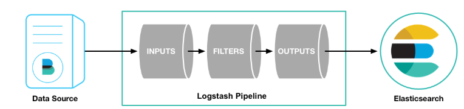

# ELK


* ELK主要是用来做日志分析,由es,logstash,kibana组成,还加入了Beats,ELK Cloud等
* 使用redis或队列作为数据来源的理由
  * 防止Logstash和ES无法正常通信,从而丢失日志
  * 防止日志量过大导致ES无法承受大量写操作从而丢失日志
  * 防止logstash 直接与es操作,产生大量的链接,导致es瓶颈
  * 如果redis使用的消息队列出现扩展瓶颈,可以使用更加强大的kafka,flume来代替
* x-pack:权限管理和邮件服务


# Logstash


## 概述





* [官网](https://www.elastic.co/cn/downloads/logstash)
* 一个数据抽取转化工具,可以从本地磁盘,网络服务,消息队列中收集各种日志,然后进行过滤分析,并将日志输出到Elasticsearch中,类似于大数据中的Flume
* Logstash有丰富的过滤器插件,插件不仅过滤,还可以对进入过滤器的原始数据进行复杂的逻辑处理,甚至添加独特的事件到后续流程中


## 配置文件


* Logstash配置文件有三部分组成,其中input,output部分是必须配置,filter部分是可选配置,而filter就是过滤器插件,可以在这部分实现各种日志过滤功能

```
input {
    #输入插件
}
filter {
    #过滤匹配插件
}
output {
    #输出插件
}
```


## 安装


* 启动: `logstash.bat -e 'input{stdin{}} output{stdout{}}'`,数据从控制台输入,从控制台输出
* 指定配置文件启动: `logstash.bat -f ../config/test1.conf`


## 输入插件input


* [下载地址](https://www.elastic.co/guide/en/logstash/current/input-plugins.html)
* 输入方式可以参照下载地址页面


### 标准输入(Stdin)


```
input{
    stdin{
       
    }
}
output {
    stdout{
        codec=>rubydebug    
    }
}
```


### 读取文件(File)


* Logstash使用一个名为filewatch的ruby gem库来监听文件变化,通过.sincedb数据库文件来记录被监听的日志文件的读取进度(时间戳)
* sincedb数据文件的默认路径在plugins/inputs/file,文件名类似于.sincedb_123456,logstash默认插件目录是LOGSTASH_HOME/data
* 默认情况下,Logstash会从文件的结束位置开始读取数据,也就是说Logstash进程会以类似tail -f命令的形式逐行获取数据


```
input {
    file {
        // 文件地址
        path => ["/var/*/*"]
        // 从头开始读取
        start_position => "beginning"
    }
}
output {
    stdout{
        codec=>rubydebug    
    }
}
```


### 读取TCP网络数据


```
input {
  tcp {
    port => "1234"
  }
}

filter {
  grok {
    match => { "message" => "%{SYSLOGLINE}" }
  }
}

output {
    stdout{
        codec=>rubydebug
    }
}
```


## 过滤器插件Filter


* [下载地址](https://www.elastic.co/guide/en/logstash/current/filter-plugins.html)


### Grok正则捕获


* Grok可以通过正则解析任意文本,将非结构化日志数据转变为结构化和方便查询的结构,是目前logstash 中解析非结构化日志数据最好的方式
* Grok 的语法规则是: `%{语法: 语义}`
* 例如输入的内容为: `172.16.213.132 [07/Feb/2019:16:24:19 +0800] "GET / HTTP/1.1" 403 5039`
  * `%{IP:clientip}`匹配模式将获得的结果为: clientip: 172.16.213.132
  * `%{HTTPDATE:timestamp}`匹配模式将获得的结果为: timestamp: 07/Feb/2018:16:24:19 +0800
  * `%{QS:referrer}`匹配模式将获得的结果为: referrer: "GET / HTTP/1.1"
* 组合匹配模式,可以获取上面输入的所有内容:

```
%{IP:clientip}\ \[%{HTTPDATE:timestamp}\]\ %{QS:referrer}\ %{NUMBER:response}\ %{NUMBER:bytes}
```

* 通过上面的组合匹配模式,可以将输入的内容分成五个部分,即五个字段,这对于日后解析和查询日志数据非常有用

```
input{
    stdin{}
}
filter{
    grok{
        match => ["message","%{IP:clientip}\ \[%{HTTPDATE:timestamp}\]\ %{QS:referrer}\ %{NUMBER:response}\ %{NUMBER:bytes}"]
    }
}
output{
    stdout{
        codec => "rubydebug"
    }
}

# 输入内容进行匹配
172.16.213.132 [07/Feb/2019:16:24:19 +0800] "GET / HTTP/1.1" 403 5039
```


#### 内置类型


```
USERNAME [a-zA-Z0-9._-]+
USER %{USERNAME}
INT (?:[+-]?(?:[0-9]+))
BASE10NUM (?<![0-9.+-])(?>[+-]?(?:(?:[0-9]+(?:\.[0-9]+)?)|(?:\.[0-9]+)))
NUMBER (?:%{BASE10NUM})
BASE16NUM (?<![0-9A-Fa-f])(?:[+-]?(?:0x)?(?:[0-9A-Fa-f]+))
BASE16FLOAT \b(?<![0-9A-Fa-f.])(?:[+-]?(?:0x)?(?:(?:[0-9A-Fa-f]+(?:\.[0-9A-Fa-f]*)?)|(?:\.[0-9A-Fa-f]+)))\b

POSINT \b(?:[1-9][0-9]*)\b
NONNEGINT \b(?:[0-9]+)\b
WORD \b\w+\b
NOTSPACE \S+
SPACE \s*
DATA .*?
GREEDYDATA .*
QUOTEDSTRING (?>(?<!\\)(?>"(?>\\.|[^\\"]+)+"|""|(?>'(?>\\.|[^\\']+)+')|''|(?>`(?>\\.|[^\\`]+)+`)|``))
UUID [A-Fa-f0-9]{8}-(?:[A-Fa-f0-9]{4}-){3}[A-Fa-f0-9]{12}

# Networking
MAC (?:%{CISCOMAC}|%{WINDOWSMAC}|%{COMMONMAC})
CISCOMAC (?:(?:[A-Fa-f0-9]{4}\.){2}[A-Fa-f0-9]{4})
WINDOWSMAC (?:(?:[A-Fa-f0-9]{2}-){5}[A-Fa-f0-9]{2})
COMMONMAC (?:(?:[A-Fa-f0-9]{2}:){5}[A-Fa-f0-9]{2})
IPV6 ((([0-9A-Fa-f]{1,4}:){7}([0-9A-Fa-f]{1,4}|:))|(([0-9A-Fa-f]{1,4}:){6}(:[0-9A-Fa-f]{1,4}|((25[0-5]|2[0-4]\d|1\d\d|[1-9]?\d)(\.(25[0-5]|2[0-4]\d|1\d\d|[1-9]?\d)){3})|:))|(([0-9A-Fa-f]{1,4}:){5}(((:[0-9A-Fa-f]{1,4}){1,2})|:((25[0-5]|2[0-4]\d|1\d\d|[1-9]?\d)(\.(25[0-5]|2[0-4]\d|1\d\d|[1-9]?\d)){3})|:))|(([0-9A-Fa-f]{1,4}:){4}(((:[0-9A-Fa-f]{1,4}){1,3})|((:[0-9A-Fa-f]{1,4})?:((25[0-5]|2[0-4]\d|1\d\d|[1-9]?\d)(\.(25[0-5]|2[0-4]\d|1\d\d|[1-9]?\d)){3}))|:))|(([0-9A-Fa-f]{1,4}:){3}(((:[0-9A-Fa-f]{1,4}){1,4})|((:[0-9A-Fa-f]{1,4}){0,2}:((25[0-5]|2[0-4]\d|1\d\d|[1-9]?\d)(\.(25[0-5]|2[0-4]\d|1\d\d|[1-9]?\d)){3}))|:))|(([0-9A-Fa-f]{1,4}:){2}(((:[0-9A-Fa-f]{1,4}){1,5})|((:[0-9A-Fa-f]{1,4}){0,3}:((25[0-5]|2[0-4]\d|1\d\d|[1-9]?\d)(\.(25[0-5]|2[0-4]\d|1\d\d|[1-9]?\d)){3}))|:))|(([0-9A-Fa-f]{1,4}:){1}(((:[0-9A-Fa-f]{1,4}){1,6})|((:[0-9A-Fa-f]{1,4}){0,4}:((25[0-5]|2[0-4]\d|1\d\d|[1-9]?\d)(\.(25[0-5]|2[0-4]\d|1\d\d|[1-9]?\d)){3}))|:))|(:(((:[0-9A-Fa-f]{1,4}){1,7})|((:[0-9A-Fa-f]{1,4}){0,5}:((25[0-5]|2[0-4]\d|1\d\d|[1-9]?\d)(\.(25[0-5]|2[0-4]\d|1\d\d|[1-9]?\d)){3}))|:)))(%.+)?
IPV4 (?<![0-9])(?:(?:25[0-5]|2[0-4][0-9]|[0-1]?[0-9]{1,2})[.](?:25[0-5]|2[0-4][0-9]|[0-1]?[0-9]{1,2})[.](?:25[0-5]|2[0-4][0-9]|[0-1]?[0-9]{1,2})[.](?:25[0-5]|2[0-4][0-9]|[0-1]?[0-9]{1,2}))(?![0-9])
IP (?:%{IPV6}|%{IPV4})
HOSTNAME \b(?:[0-9A-Za-z][0-9A-Za-z-]{0,62})(?:\.(?:[0-9A-Za-z][0-9A-Za-z-]{0,62}))*(\.?|\b)
HOST %{HOSTNAME}
IPORHOST (?:%{HOSTNAME}|%{IP})
HOSTPORT %{IPORHOST}:%{POSINT}

# paths
PATH (?:%{UNIXPATH}|%{WINPATH})
UNIXPATH (?>/(?>[\w_%!$@:.,-]+|\\.)*)+
TTY (?:/dev/(pts|tty([pq])?)(\w+)?/?(?:[0-9]+))
WINPATH (?>[A-Za-z]+:|\\)(?:\\[^\\?*]*)+
URIPROTO [A-Za-z]+(\+[A-Za-z+]+)?
URIHOST %{IPORHOST}(?::%{POSINT:port})?
# uripath comes loosely from RFC1738, but mostly from what Firefox
# doesn't turn into %XX
URIPATH (?:/[A-Za-z0-9$.+!*'(){},~:;=@#%_\-]*)+
#URIPARAM \?(?:[A-Za-z0-9]+(?:=(?:[^&]*))?(?:&(?:[A-Za-z0-9]+(?:=(?:[^&]*))?)?)*)?
URIPARAM \?[A-Za-z0-9$.+!*'|(){},~@#%&/=:;_?\-\[\]]*
URIPATHPARAM %{URIPATH}(?:%{URIPARAM})?
URI %{URIPROTO}://(?:%{USER}(?::[^@]*)?@)?(?:%{URIHOST})?(?:%{URIPATHPARAM})?

# Months: January, Feb, 3, 03, 12, December
MONTH \b(?:Jan(?:uary)?|Feb(?:ruary)?|Mar(?:ch)?|Apr(?:il)?|May|Jun(?:e)?|Jul(?:y)?|Aug(?:ust)?|Sep(?:tember)?|Oct(?:ober)?|Nov(?:ember)?|Dec(?:ember)?)\b
MONTHNUM (?:0?[1-9]|1[0-2])
MONTHNUM2 (?:0[1-9]|1[0-2])
MONTHDAY (?:(?:0[1-9])|(?:[12][0-9])|(?:3[01])|[1-9])

# Days: Monday, Tue, Thu, etc...
DAY (?:Mon(?:day)?|Tue(?:sday)?|Wed(?:nesday)?|Thu(?:rsday)?|Fri(?:day)?|Sat(?:urday)?|Sun(?:day)?)

# Years?
YEAR (?>\d\d){1,2}
HOUR (?:2[0123]|[01]?[0-9])
MINUTE (?:[0-5][0-9])
# '60' is a leap second in most time standards and thus is valid.
SECOND (?:(?:[0-5]?[0-9]|60)(?:[:.,][0-9]+)?)
TIME (?!<[0-9])%{HOUR}:%{MINUTE}(?::%{SECOND})(?![0-9])
# datestamp is YYYY/MM/DD-HH:MM:SS.UUUU (or something like it)
DATE_US %{MONTHNUM}[/-]%{MONTHDAY}[/-]%{YEAR}
DATE_EU %{MONTHDAY}[./-]%{MONTHNUM}[./-]%{YEAR}
ISO8601_TIMEZONE (?:Z|[+-]%{HOUR}(?::?%{MINUTE}))
ISO8601_SECOND (?:%{SECOND}|60)
TIMESTAMP_ISO8601 %{YEAR}-%{MONTHNUM}-%{MONTHDAY}[T ]%{HOUR}:?%{MINUTE}(?::?%{SECOND})?%{ISO8601_TIMEZONE}?
DATE %{DATE_US}|%{DATE_EU}
DATESTAMP %{DATE}[- ]%{TIME}
TZ (?:[PMCE][SD]T|UTC)
DATESTAMP_RFC822 %{DAY} %{MONTH} %{MONTHDAY} %{YEAR} %{TIME} %{TZ}
DATESTAMP_RFC2822 %{DAY}, %{MONTHDAY} %{MONTH} %{YEAR} %{TIME} %{ISO8601_TIMEZONE}
DATESTAMP_OTHER %{DAY} %{MONTH} %{MONTHDAY} %{TIME} %{TZ} %{YEAR}
DATESTAMP_EVENTLOG %{YEAR}%{MONTHNUM2}%{MONTHDAY}%{HOUR}%{MINUTE}%{SECOND}

# Syslog Dates: Month Day HH:MM:SS
SYSLOGTIMESTAMP %{MONTH} +%{MONTHDAY} %{TIME}
PROG (?:[\w._/%-]+)
SYSLOGPROG %{PROG:program}(?:\[%{POSINT:pid}\])?
SYSLOGHOST %{IPORHOST}
SYSLOGFACILITY <%{NONNEGINT:facility}.%{NONNEGINT:priority}>
HTTPDATE %{MONTHDAY}/%{MONTH}/%{YEAR}:%{TIME} %{INT}

# Shortcuts
QS %{QUOTEDSTRING}

# Log formats
SYSLOGBASE %{SYSLOGTIMESTAMP:timestamp} (?:%{SYSLOGFACILITY} )?%{SYSLOGHOST:logsource} %{SYSLOGPROG}:
COMMONAPACHELOG %{IPORHOST:clientip} %{USER:ident} %{USER:auth} \[%{HTTPDATE:timestamp}\] "(?:%{WORD:verb} %{NOTSPACE:request}(?: HTTP/%{NUMBER:httpversion})?|%{DATA:rawrequest})" %{NUMBER:response} (?:%{NUMBER:bytes}|-)
COMBINEDAPACHELOG %{COMMONAPACHELOG} %{QS:referrer} %{QS:agent}

# Log Levels
LOGLEVEL ([Aa]lert|ALERT|[Tt]race|TRACE|[Dd]ebug|DEBUG|[Nn]otice|NOTICE|[Ii]nfo|INFO|[Ww]arn?(?:ing)?|WARN?(?:ING)?|[Ee]rr?(?:or)?|ERR?(?:OR)?|[Cc]rit?(?:ical)?|CRIT?(?:ICAL)?|[Ff]atal|FATAL|[Ss]evere|SEVERE|EMERG(?:ENCY)?|[Ee]merg(?:ency)?)
```


### 时间处理(Date)


* date插件对于排序事件和回填旧数据尤其重要,它可以用来转换日志记录中的时间字段,变成LogStash::Timestamp对象,然后转存到@timestamp字段里

```
filter {
    grok {
        match => ["message", "%{HTTPDATE:timestamp}"]
    }
    date {
        match => ["timestamp", "dd/MMM/yyyy:HH:mm:ss Z"]
    }
}
```


### 数据修改(Mutate)


#### gsub


* gsub可以通过正则表达式替换字段中匹配到的值,只对字符串字段有效

```
filter {
    mutate {
        # 将filed_name_1字段中所有"/"字符替换为"_"
        gsub => ["filed_name_1", "/" , "_"]
    }
}
```


#### split


* split可以通过指定的分隔符分割字段中的字符串为数组

```
filter {
    mutate {
        # 将filed_name_2字段以"|"为区间分隔为数组
        split => ["filed_name_2", "|"]
    }
}
```


#### rename


* rename可以实现重命名某个字段的功能

```
filter {
    mutate {
        rename => { "old_field" => "new_field" }
    }
}
```


#### remove_field


* remove_field可以实现删除某个字段的功能

```
filter {
    mutate {
        # 将字段timestamp删除
        remove_field  =>  ["timestamp"]
    }
}
```


#### GeoIP


* 地址查询归类

```
filter {
    geoip {
        source => "ip_field"
    }
}
```


#### 综合


```
input {
    stdin {}
}
filter {
    grok {
        match => { "message" => "%{IP:clientip}\ \[%{HTTPDATE:timestamp}\]\ %{QS:referrer}\ %{NUMBER:response}\ %{NUMBER:bytes}" }
        remove_field => [ "message" ]
   }
date {
        match => ["timestamp", "dd/MMM/yyyy:HH:mm:ss Z"]
    }
mutate {
          convert => [ "response","float" ]
           rename => { "response" => "response_new" }   
           gsub => ["referrer","\"",""]          
           split => ["clientip", "."]
        }
}
output {
    stdout {
        codec => "rubydebug"
    }
```


## 输出插件output


* [下载地址](https://www.elastic.co/guide/en/logstash/current/output-plugins.html)
* output是Logstash的最后阶段,一个事件可以经过多个输出,而一旦所有输出处理完成,整个事件就执行完成.一些常用的输出包括:
  * file: 表示将日志数据写入磁盘上的文件
  * elasticsearch: 表示将日志数据发送给Elasticsearch,Elasticsearch可以高效方便和易于查询的保存数据


### 标准输出(stdout)


```
output {
    stdout {
        codec => rubydebug
    }
}
```


### 保存为文件(file)


```
output {
    file {
        path => "/data/log/%{+yyyy-MM-dd}/%{host}_%{+HH}.log"
    }
}
```


### 输出到elasticsearch


```
output {
    elasticsearch {
        host => ["192.168.1.149:9200","192.168.1.150:9200"]
        index => "logstash-%{+YYYY.MM.dd}"       
    }
}
```


- host: 一个数组类型的值,后面跟的值是elasticsearch节点的地址与端口,默认端口是9200,可添加多个地址
- index: 写入elasticsearch的索引的名称,这里可以使用变量.Logstash提供了%{+YYYY.MM.dd}这种写法,在语法解析的时候,看到以+ 号开头的,就会自动认为后面是时间格式,尝试用时间格式来解析后续字符串.这种以天为单位分割的写法,可以很容易的删除老的数据或者搜索指定时间范围内的数据.此外,注意索引名中不能有大写字母
- manage_template: 用来设置是否开启logstash自动管理模板功能,如果设置为false将关闭自动管理模板功能
- template_name: 设置在Elasticsearch中模板的名称


## 案例


```
input {
    file {
        path => ["D:/ES/logstash-7.3.0/nginx.log"]        
        start_position => "beginning"
    }
}

filter {
    grok {
        match => { "message" => "%{IP:clientip}\ \[%{HTTPDATE:timestamp}\]\ %{QS:referrer}\ %{NUMBER:response}\ %{NUMBER:bytes}" }
        remove_field => [ "message" ]
   }
    date {
        match => ["timestamp", "dd/MMM/yyyy:HH:mm:ss Z"]
    }
	mutate {
           rename => { "response" => "response_new" }
           convert => [ "response","float" ]
           gsub => ["referrer","\"",""]
           remove_field => ["timestamp"]
           split => ["clientip", "."]
        }
}

output {
    stdout {
        codec => "rubydebug"
    }

elasticsearch {
    host => ["localhost:9200"]
    index => "logstash-%{+YYYY.MM.dd}"       
}

}
```


# Beats


* 集合了多种单一用途数据采集器,从成千上万台机器和系统向 Logstash 或 Elasticsearch 发送数据.Beats由如下组成:
  * Packetbeat: 轻量型网络数据采集器,用于深挖网线上传输的数据,了解应用程序动态.Packetbeat 是一款轻量型网络数据包分析器,能够将数据发送至 Logstash 或 Elasticsearch,其支 持ICMP (v4 and v6)、DNS、HTTP、Mysql、PostgreSQL、Redis、MongoDB、Memcache等协议
  * Filebeat: 轻量型日志采集器.当要面对成千上万的服务器、虚拟机和容器生成的日志时,Filebeat 可以提供一种轻量型方法,用于转发和汇总日志与文件,让简单的事情不再繁杂
  * Metricbeat: 轻量型指标采集器.Metricbeat 能够以一种轻量型的方式,输送各种系统和服务统计数据,从 CPU 到内存,从 Redis 到 Nginx等.可定期获取外部系统的监控指标信息,其可以监控,收集 Apache http、HAProxy、MongoDB、MySQL、Nginx、PostgreSQL、Redis、System、Zookeeper等服务
  * Winlogbeat: 轻量型 Windows 事件日志采集器.用于密切监控基于 Windows 的基础设施上发生的事件.Winlogbeat 能够以一种轻量型的方式,将 Windows 事件日志实时地流式传输至 Elasticsearch 和 Logstash
  * Auditbeat: 轻量型审计日志采集器.收集 Linux 审计框架的数据,监控文件完整性,实时采集这些事件,然后发送到 Elastic Stack 其他部分做进一步分析
  * Heartbeat: 面向运行状态监测的轻量型采集器,通过主动探测来监测服务的可用性,通过给定 URL 列表,Heartbeat 仅仅询问网站运行是否正常.Heartbeat 会将此信息和响应时间发送至 Elastic 的其他部分,以进行进一步分析
  * Functionbeat: 面向云端数据的无服务器采集器.在作为一项功能部署在云服务提供商的功能即服务 (FaaS) 平台上后,Functionbeat 即能收集、传送并监测来自您的云服务的相关数据


# Elastic Cloud


* 基于 Elasticsearch 的软件即服务(SaaS)解决方案,通过 Elastic 的官方合作伙伴使用托管的 Elasticsearch 服务


# 集群部署


## 节点的三个角色


* 主节点: master节点主要用于集群的管理及索引.比如新增结点、分片分配、索引的新增和删除等
* 数据节点: data 节点上保存了数据分片,负责索引和搜索操作
* 客户端节点: client 节点仅作为请求客户端存在,client的作用也作为负载均衡器,client 节点不存数据,只是将请求均衡转发到其它节点
* 通过下边两项参数来配置结点的功能: 

```
node.master: #是否允许为主节点
node.data: #允许存储数据作为数据节点
node.ingest: #是否允许成为协调节点
```

* 四种组合方式:

```
master=true,data=true：即是主结点又是数据节点
master=false,data=true：仅是数据节点
master=true,data=false：仅是主节点,不存储数据
master=false,data=false：即不是主节点也不是数据节点,此时可设置ingest为true表示它是一个客户端
```


