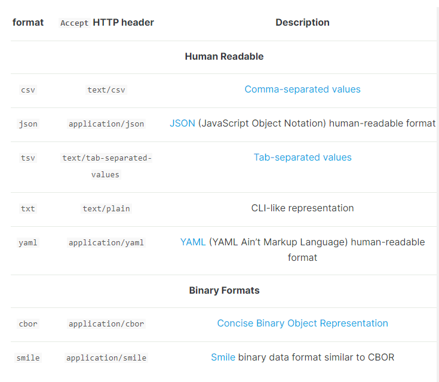
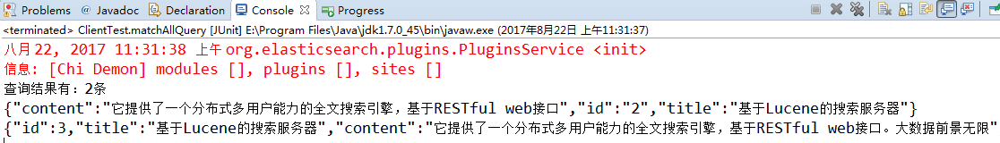
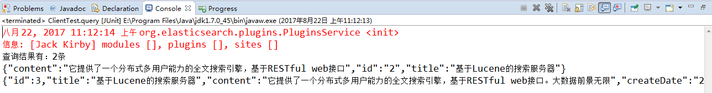
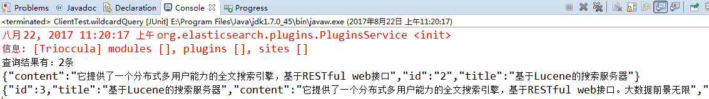
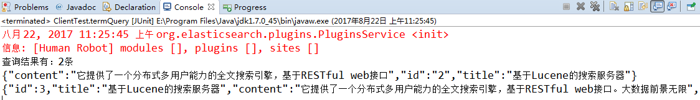
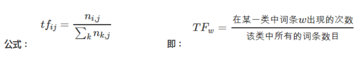
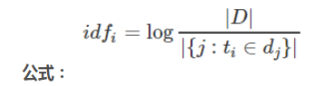
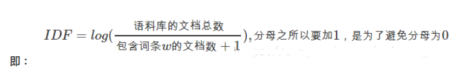

# ElasticSearch


# 概述6,8


* [官网](https://www.elastic.co/cn/products/elasticsearch)

* 用数据库做搜索的效果:见**ElasticSearch.pptx-01**,不太靠谱,性能很差
* 全文检索:指计算机索引程序通过扫描文章中的每一个词,对每一个词建立一个索引,指明该词在文章中出现的次数和位置,当用户查询时,检索程序就根据事先建立的索引进行查找,并将查找的结果反馈给用户的检索方式.这个过程类似于通过字典中的检索字表查字的过程.**见ElasticSearch.pptx-02**
* Lucene,就是一个jar包,里面包含了封装好的各种建立倒排索引,以及进行搜索的代码,包括各种算法
* 倒排索引:通常从文章中搜索关键字是直接全文扫描文章,查看是否有关键字,倒排索引正好相反.先将文章分词建立关键字索引,搜索关键字的时候直接就能通过预先建立好的索引查找文章
* ES是基于Lucene的搜索引擎,是一个实时的分布式搜索和分析引擎,可用于全文搜索,结构化搜索以及分析
  * 全文搜索:将非结构化数据中的一部分信息提取出来,重新组织,使其变得有一定结构,然后对此有一定结构的数据进行搜索,从而达到搜索相对较快的目的
  * 结构化搜索:类似于从数据库中读取数据
  * 数据分析:电商网站,最近7天牙膏这种商品销量排名前10的商家有哪些等
* 高可用,多用户能力,多类型,多API,面相文档,异步写入,不需要其他组件,分发也是实时(push replication)
* 处理多租户(multitenancy)不需要特殊配置,而Solr需要更多的高级配置
* 扩展性好,自带分布式架构,但是只支持json格式文件,可集群处理PB级数据
* 基于restful接口,能够达到实时搜索,稳定,可靠,快速,比Solr更适合实时搜索
* 采用Gateway概念,使得完全备份更加简单
* 近实时的去索引数据,搜索数据,结构化搜索以及分析
* 更注重核心功能,更多的高级功能有插件完成
* 存储数据到ES叫做索引,但是索引之前需要确定文档的存放位置
* 集群可以有多个索引,每个索引可以包含多个类型,每个类型可以存放多个文档,每个文档可以有多个属性
* 当文档很大时,由于内存和硬盘限制,同时也为了提高效率,ES将索引分为若干分片,每个分片可以放在不同的服务器,这样可以实现多个服务器共同对外提供索引以及搜索服务
* 若首次提交数据时,字段类型错误,可能会影响字段的分析效果,进而影响索引,需要修改数据类型之后,再次新增或修改后,覆盖原先的索引
* ES的搜索包括document和field,document类似于表,field是字段.但是在创建document时,在9版本以前还有一个type类型,该type类型用来指定表的名称,实际上已经没有太大意义,但是不能少.type的名称可以是任意非关键字字符串,和field的type并非同一个
* ES在更新映射时,已经定义好的field的type不可修改,唯一的方法是将整个映射删除之后重新添加.查看映射:ip:port/documentname/typename/_mapping
* 在新增一个field时,除了类型(type)之外还需要设置搜索分词器和索引分词器,索引分词器越细粒度越好,而搜索分词器则需要稍微粗颗粒度些,如name:{type:text,analyzer:"ik_max_word",search_analyzer:"ik_smart"}


# 适用场景


* 维基百科,类似百度百科,全文检索,高亮,搜索推荐
* 新闻网站,类似搜狐新闻,用户行为日志(点击,浏览,收藏,评论)+社交网络数据(对某某新闻的相关看法),数据分析,给到每篇新闻文章的作者,让他知道他的文章的公众反馈(好,坏,热门,垃圾等)
* StackOverflow论坛,IT问题,程序的报错,提交上去,有人会跟你讨论和回答,全文检索,搜索相关问题和答案,程序报错了,就会将报错信息粘贴到里面去,搜索有没有对应的答案
* GitHub,开源代码管理,搜索上千亿行代码
* 站内搜索(电商,招聘,门户,等等),IT系统搜索(OA,CRM,ERP,等等),数据分析(ES热门的一个使用场景)
* 电商网站,检索商品,传统论坛页面等
* 日志数据分析,logstash采集日志,ES进行复杂的数据分析(ELK技术)
* 商品价格监控网站,用户设定某商品的价格阈值,当低于该阈值的时候,发送通知消息给用户
* BI系统,商业智能(Business Intelligence).大型连锁超市,分析全国网点传回的数据,分析各个商品在什么季节的销售量最好、利润最高.成本管理,店面租金、员工工资、负债等信息进行分析.从而部署下一个阶段的战略目标


# 核心


## 近实时

* 从写入数据到数据可以被搜索到有一个小延迟(大概1秒);基于es执行搜索和分析可以达到秒级


## 分片


* 一个分片是一个底层的工作单元,保存了全部数据中的一部分,可以认为是一个数据区
* 所有文档被存储和索引到分片内,但应用程序是直接与索引而不是分片进行交互
* 一个分片可以是主分片或副本分片
* 索引内所有文档都是归属于一个分片,所以主分片的数量决定索引能够保证的最大数据量
* 在索引建立的时候就已经确定了主分片数,但副本分片数可随时修改


## Cluster


* 集群:包含多个节点,每个节点属于哪个集群是通过配置(集群名称,默认是elasticsearch)来决定的,对于中小型应用来说,刚开始一个集群就一个节点很正常


## Node


* 节点:集群中的一个节点,节点也有一个名称,默认随机分配
* 节点名称很重要,特别是在执行运维管理操作的时候
* 默认节点会去加入一个名称为“elasticsearch”的集群,如果直接启动一堆节点,那么它们会自动组成一个elasticsearch集群,当然一个节点也可以组成一个elasticsearch集群


## Index


* 索引:类似关系型数据库的数据库,包含一堆有相似结构的文档数据,索引有一个名称
* 一个index包含很多document,一个index就代表了一类类似的或者相同的document
* 索引创建规则: 

  - 仅限小写字母

  - 不能包含\、/、 *、?、"、<、>、|、#以及空格符等特殊符号

  - 从7.0版本开始不再包含冒号

  - 不能以-、_或+开头

  - 不能超过255个字节,多字节字符将计入255个限制


## Type


* 类型:类似数据库中的表,**ES6以上就准备废弃,ES8中移除**
* 每个索引里都可以有一个或多个type,type是index中的一个逻辑数据分类
* 一个type下的document,都有相同的field,比如博客系统,有一个索引,可以定义用户数据type,博客数据type,评论数据type
* 商品index,里面存放了所有的商品数据,商品document
* 但是商品分很多种类,每个种类的document的field可能不太一样,比如说电器商品,可能还包含一些诸如售后时间范围这样的特殊field;生鲜商品,还包含一些诸如生鲜保质期之类的特殊field
* type,日化商品type,电器商品type,生鲜商品type
* 日化商品type:product_id,product_name,product_desc,category_id,category_name
* 电器商品type:product_id,product_name,product_desc,category_id,category_name,service_period
* 生鲜商品type:product_id,product_name,product_desc,category_id,category_name,eat_period
* 每一个type里面,都会包含一堆document

```json
{"product_id": "1","product_name": "长虹电视机","product_desc": "4k高清",   "category_id": "3","category_name": "电器","service_period": "1年"}
{"product_id": "2","product_name": "基围虾","product_desc": "纯天然,冰岛产",   "category_id": "4","category_name": "生鲜","eat_period": "7天"}
```

 

## Document


* 文档,类似关系型数据库中的行
* 文档是es中的最小数据单元,一个document可以是一条客户数据,一条商品分类数据
* 通常用JSON数据结构表示,每个index下的type中,都可以去存储多个document


## Field


* 字段,类似关系型数据库中的字段
* Field是Elasticsearch的最小单位
* 一个document里面有多个field,每个field就是一个数据字段

```json
product document:{"product_id":"1","product_name":"高露洁牙膏","product_desc":"高效美白","category_id":"2","category_name":"日化用品"}
```

* type:字段类型
* analyzer:索引分词器,越细粒度越好
* search_analyzer:搜索分词器,稍微粗粒度
* index:是否索引,默认true,类似链接之类的字段则可以不索引
* store:是否在source之外存储,每个文档索引后会在ES中保存一份原始文档,存放在_source中,一般不需要设置为true,因为在 _source中已经有一份原始文档了
* format:格式化字符串.通常字段为date类型时才会设置,同java,多种格式中间用双竖线(||)
* scaling_factor:比例因子,当type为数字类型时,若是有精度的,如float类型,可设置该值为100,存储时会将需要存储的值乘以该比例因子100存入到ES中,如23.45会在ES中存为2345,若是23.456,则会四舍五入为2346


## Nested

* 嵌入式类型字段.当某个字段的值是数组或list时,会被扁平化,如

  ```json
  {"user":[{"first":["aaa","bbb"]},{"second":["ccc,","ddd"]}]}
  // 在es中存储时会扁平化,不是以层级模式存储
  user.first=["aaa","bbb"]
  user.second=["ccc,","ddd"]
  ```

* 该存储方式会使查找时结果不准,此时就必须规定user的类型为nested


## Shard


* 分片.index数据过大时,将index里面的数据,分为多个shard,分布式的存储在各个服务器上面.可以支持海量数据和高并发,提升性能和吞吐量,充分利用多台机器的cpu


## Replica


* 副本.为了保证数据的安全,需要将每个index的分片进行备份,存储在另外的机器上,保证少数机器宕机es集群仍可以搜索
* 能正常提供查询和插入的分片叫做主分片(primary shard),其余的叫做备份的分片(replica shard)


# 字段映射类型

* string:text和keyword,keyword在进行搜索时不会对值存储在ES中的值进行分词,是通过整体搜索
* number:long,integer,short,byte,double,float,half_float,scaled_float
* date:date
* boolean:boolean
* binary:binary
* range:integer_range,float_range,long_range,double_range,date_range


## Mapping

* 映射,类似关系型数据库中的约束.第一次存数据时,若不指定类型,由ES自行判断类型

* 创建映射

  ```json
  // 创建映射,esip:port/indexname,_mapping是固定写法,put
  {
      "mappings":{
          "properties":{
              "age":{"type":"integer"},
              "email":{"type":"keyword"},
              "username":{"type":"text"}
          }
      }
  }
  ```

* 添加映射

  ```json
  // 添加映射,esip:port/indexname/_mapping,_mapping是固定写法,put
  {
      "mappings":{
          "properties":{
              "salary":{"type":"double"}
          }
      }
  }
  ```

* 不能更新映射,因为修改映射会对数据的检索方式造成很大的变动,只能数据迁移.需要先重新新增正确的映射方式,之后使用_reindex对数据重新建立索引

  ```json
  // 重新建立索引,在kibana中直接使用_reindex接口即可
  {
      "source":{
          "index":"oldindexname"
      },
      "dest":{
          "index":"newindexname"
      }
  }
  ```

* 数据如何存放到索引对象上,需要有一个映射配置,包括:数据类型,是否存储,是否分词等

* 这样就创建了一个名为blog的Index.Type不用单独创建,在创建Mapping 时指定就可以

* Mapping用来定义Document中每个字段的类型,即所使用的analyzer,是否索引等属性,非常关键

```json

// 复杂Mapping
client.indices.putMapping({
    index : 'blog',
    type : 'article',
    body : {
        article:{
            properties:{
                id:{
                    type:'string',
                    analyzer:'ik',
                    store:'yes',
                },
                title:{
                    type:'string',
                    analyzer:'ik',
                    store:'no',
                },
                content:{
                    type:'string',
                    analyzer:'ik',
                    store:'yes',
                }
            }
        }
    }
});
```


## 对比数据库

| 关系型数据库(比如Mysql) | 非关系型数据库(Elasticsearch) |
| ----------------------- | ----------------------------- |
| 数据库Database          | 索引Index                     |
| 表Table                 | 类型Type,ES6以上废弃,ES8移除  |
| 数据行Row               | 文档Document                  |
| 数据列Column            | 字段Field                     |
| 约束 Schema             | 映射Mapping                   |


## 存储和搜索数据

* **见ElasticSearch.pptx-03**
* 索引对象(blog):存储数据的表结构 ,任何搜索数据,存放在索引对象上
* 映射(mapping):数据如何存放到索引对象上,需要有一个映射配置, 包括:数据类型,是否存储,是否分词等
* 文档(document):一条数据记录,存在索引对象上


# 插件


## Elasticsearch head


* ES集群可视化操作,可在Web上管理ES集群
* [下载插件](https://github.com/mobz/elasticsearch-head),elasticsearch-head-master.zip
* nodejs[官网](https://nodejs.org/dist/)下载安装包
* 将elasticsearch-head-master.zip和node-linux-x64.tar.xz都导入到linux的/app/software目录
* 安装nodejs,配置环境变量,查看node和npm版本

```shell
vi /etc/profile
export NODE_HOME=/app/nodejs
export PATH=$PATH:$NODE_HOME/bin
source /etc/profile
node -v
npm -v
```

* 解压head插件到/app/eshead目录下
* 查看当前head插件目录下有无node_modules/grunt目录,没有:执行命令创建

```shell
# 替换nodejs源为淘宝镜像源,加速依赖下载
npm install -g cnpm --registry=https://registry.npm.taobao.org
# 安装依赖
npm install grunt --save
npm install -g grunt-cli
```

* 编辑Gruntfile.js:vim Gruntfile.js

```javascript
# 文件93行添加hostname:'0.0.0.0'
options: {
    hostname:'0.0.0.0',
    port: 9100,
    base: '.',
    keepalive: true
}
```

* 检查head根目录下是否存在base文件夹,没有:将_site下的base文件夹及其内容复制到head根目录下
* 启动grunt server:grunt server -d->Started connect web server on http://localhost:9100
* 如果提示grunt的模块没有安装:

```shell
Local Npm module “grunt-contrib-clean” not found. Is it installed? 
Local Npm module “grunt-contrib-concat” not found. Is it installed? 
Local Npm module “grunt-contrib-watch” not found. Is it installed? 
Local Npm module “grunt-contrib-connect” not found. Is it installed? 
Local Npm module “grunt-contrib-copy” not found. Is it installed? 
Local Npm module “grunt-contrib-jasmine” not found. Is it installed? 
Warning: Task “connect:server” not found. Use –force to continue. 
# 执行以下命令,最后一个模块可能安装不成功,但是不影响使用
npm install grunt-contrib-clean grunt-contrib-concat grunt-contrib-watch grunt-contrib-connect grunt-contrib-copy grunt-contrib-jasmine 
```

* 浏览器访问head插件:http://hadoop102:9100
* 启动集群插件后发现集群未连接,提示跨域访问,可在es配置文件添加如下配置

```yaml
http.cors.enabled: true
http.cors.allow-origin: "*"
```

* 再重新启动elasticsearch
* 关闭插件服务:ctrl+c


## IK分词器


* 默认是使用官方的标准分词器,但是对中文支持不友好,需要使用IK分词器

  ```json
  // standard 分词器,仅适用于英文
  GET /_analyze
  {
    "analyzer": "standard",
    "text": "中华人民共和国人民大会堂"
  }
  ```

* 结果:

  * token 实际存储的term 关键字
  * position 在此词条在原文本中的位置
  * start_offset/end_offset字符在原始字符串中的位置


### 安装


* IK分词器:对中文友好的分词器,不会像标准分词器一样将每个词都拆开,[官网](https://github.com/medcl/elasticsearch-analysis-ik/releases)

* 根据es版本下载相应版本包,解压到 es/plugins/ik中,重启ES和Kibana


### 配置


* ik配置文件地址: es/plugins/ik/config目录
* IKAnalyzer.cfg.xml: 用来配置自定义词库
* main.dic: ik原生内置的中文词库,总共有27万多条,只要是这些单词,都会被分在一起
* preposition.dic: 介词
* quantifier.dic: 放了一些单位相关的词,量词
* suffix.dic: 放了一些后缀
* surname.dic: 中国的姓氏
* stopword.dic: 英文停用词
* ik原生最重要的两个配置文件
  * main.dic: 包含了原生的中文词语,会按照这个里面的词语去分词
  * stopword.dic: 包含了英文的停用词
* 停用词,stopword,英文中类似`a,the,is`等,停用词会在分词的时候直接被干掉,不会建立在倒排索引中

 

### 使用


* ik_max_word:最大粒度的对中文词汇进行拆分.比如会将`中华人民共和国人民大会堂`拆分为`中华人民共和国,中华人民,中华,华人,人民共和国,人民大会堂,人民大会,大会堂`,会穷尽各种可能的组合

* ik_smart:最粗粒度的对中文进行拆分,智能拆分.比如会将`中华人民共和国人民大会堂`拆分为`中华人民共和国,人民大会堂`

* 存储时,使用ik_max_word,搜索时,使用ik_smart

  ```json
  PUT /index_name 
  {
    "mappings": {
        "properties": {
          "text": {
            "type": "text",
            "analyzer": "ik_max_word",
            "search_analyzer": "ik_smart"
          }
        }
    }
  }
  ```

* 搜索

  ```json
  GET /index_name/_search?q=中华人民共和国人民大会堂
  ```


### 自定义分词


* 自定义分词:需要修改IK分词器目录下的config/IKAnalyzer.cfg.xml

* ext_dict:本地分词文件地址,在值的位置配置自定义分词的文件名称.文件的每行只能定义一个词,最好是将文件的后缀定义为dic,同时该文件的编码模式选择UTF8,配置好后重启ES即可
* remote_ext_dict:远程分词器地址,是一个远程的http/https地址,可以配置到nginx或其他服务器中,文件形式和内容同ext_dict即可,配置后重启ES即可
* custom/ext_stopword.dic:自己建立停用词库:比如了,的等.已经有了常用的停用词,可以补充停用词,然后重启es


## Logstash


* 将mysql中的数据同步到ES中


# MySQL热更新


## 方案


* 方案1: 基于ik分词器原生支持的热更新方案,部署一个web服务器,提供一个http接口,通过modified和tag两个http响应头,来提供词语的热更新
* 方案2: 修改ik分词器源码,然后手动支持从mysql中每隔一定时间,自动加载新的词库
* 用第二种方案,第一种,ik git社区官方都不建议采用,觉得不太稳定


##  步骤


* [下载源码](https://github.com/medcl/elasticsearch-analysis-ik/releases)
* ik分词器是个标准的java maven工程,直接导入IDE就可以看到源码
* 修改源`org.wltea.analyzer.dic.Dictionary`类,160行Dictionary单例类的初始化方法,在这里需要创建一个自定义的线程,并且启动它
* `org.wltea.analyzer.dic.HotDictReloadThread`: 就是死循环,不断调用Dictionary.getSingleton().reLoadMainDict(),去重新加载词典
* `Dictionary类399行`: this.loadMySQLExtDict(); 加载mymsql字典
* `Dictionary类609行`: this.loadMySQLStopwordDict();加载mysql停用词
* config下jdbc-reload.properties是mysql配置文件
* 修改完之后用命令`mvn clean package`打包:target\releases\elasticsearch-analysis-ik-7.3.0.zip
* 解压缩ik压缩包,将mysql驱动jar,放入ik的目录下
* 修改jdbc相关配置
* 重启es.观察日志,日志中就会显示我们打印的那些东西,比如加载了什么配置,加载了什么词语,什么停用词
* 在mysql中添加词库与停用词
* 分词实验,验证热更新生效

```json
GET /_analyze
{
  "analyzer": "ik_smart",
  "text": "飞花梦影"
}
```


## Cat API


* es提供了一套api,叫做cat api,可以查看es中各种各样的数据

* `GET /_cat/health?v`:查看集群状态

  * green: 每个索引的primary shard和replica shard都是active状态的
  * yellow: 每个索引的primary shard都是active状态的,但是部分replica shard不是active状态,处于不可用的状态
  * red: 不是所有索引的primary shard都是active状态的,部分索引有数据丢失了

  ```
  epoch      timestamp cluster       status node.total node.data shards pri relo init unassign pending_tasks max_task_wait_time active_shards_percent
  1568635460 12:04:20  elasticsearch green           1         1      4   4    0    0        0             0                  -                100.0%
  ```

* `GET /_cat/indices?v`: 快速查看集群中有哪些索引

  ```
  health status index                           uuid                   pri rep docs.count docs.deleted store.size pri.store.size
  green  open   .kibana_task_manager            JBMgpucOSzenstLcjA_G4A   1   0          2            0     45.5kb         45.5kb
  green  open   .monitoring-kibana-7-2019.09.16 LIskf15DTcS70n4Q6t2bTA   1   0        433            0    218.2kb        218.2kb
  green  open   .monitoring-es-7-2019.09.16     RMeUN3tQRjqM8xBgw7Zong   1   0       3470         1724      1.9mb          1.9mb
  green  open   .kibana_1                       1cRiyIdATya5xS6qK5pGJw   1   0          4            0     18.2kb         18.2kb
  ```

* `GET /_cat/nodes`:查看所有节点
* `GET /_cat/master`:查看主节点


# API调用


[官方文档](https://www.elastic.co/guide/en/elasticsearch/client/java-rest/current/java-rest-high-getting-started.html)


## 内置API


* `PUT /index`: 建立索引,如`PUT /book`

* `PUT /index/type/id`: 新增或更新文档,参数都相同,更新是整体覆盖

  ```json
  // PUT /book/_doc/1
  {
      "name": "Bootstrap开发",
      "description": "spring 在java领域非常流行,java程序员都在用。",
      "studymodel": "201002",
      "price":38.6,
      "timestamp":"2019-08-25 19:11:35",
      "pic":"group1/M00/00/00/wKhlQFs6RCeAY0pHAAJx5ZjNDEM428.jpg",
      "tags": [ "bootstrap", "dev"]
  }
  ```

* `GET /_mapping`: 查看所有mapping

* `GET /{index}/_mapping/`: 查看mapping

* `PUT /{index}/_mapping`: 创建mapping,需要先创建索引,且还没有插入数据

  ```json
  // PUT /book/_mapping
  {
      "properties": {
          "name": {
              "type": "text"
          },
          "description": {
              "type": "text",
              "analyzer":"english",
              "search_analyzer":"english"
          },
          "pic":{
              "type":"text",
              "index":false
          },
          "studymodel":{
              "type":"text"
          }
      }
  }
  ```

* `PUT /{index}/type/{id}/_create`:强制创建,若存在相同id的值,不会更新,会报错

* `POST  /{index}/type /{id}/_update`或`POST  /{index}/_update/{id}`: 更新

  ```json
  // POST /book/_update/1/ 
  {
      "doc": {
          "name": " Bootstrap开发教程高级"
      }
  }
  ```

* `GET /{index}/type/id`:快速搜索,如`GET /book/_doc/1`就可看到json形式的文档

* `DELETE /{index}/type/id`:删除某个文档,如`DELETE /book/_doc/1`

* `POST /{index}/type/[\_id]`:,在es中添加数据,数据为json格式,请求头为application/json

  * _index:相当于数据库中的数据库,索引名
  * _type:相当于数据库中的表,类型名
  * _id:相当于数据库中的唯一标识.若不带id会自动生成一个随机uuid作为id;若带id,则es中没有该id数据时,created,若存在,则是updated

* `GET /{index}/type/[_id]`: 在es中根据id进行搜索,得到json数据,下划线开头的统称为元数据,\_source中数据为查看到的真实数据,若没有,则为null

  ```json
  {
  	"_index":"_index",	// 在那个索引
  	"_type":"_type",	// 在哪个类型
  	"_id":"_id",		// 记录id
  	"_version":2,		// 版本号,每修改一次就加1
  	"_seq_no":1,		// 并发控制字段,每次更新就会+1,用来做乐观锁,可以写在url后
  	"_primary_term":1,	// 同上,主分片重新分配,如重启就会变化
  	"found":true,
  	"_source":{			// 真实数据
  		"shuju":"shuju"
  	}
  }
  ```

* `GET /{index}/type/{id}?_source_includes=column1...`:只查询指定column1的值,_source_includes为固定写法

* `POST /{index}/_update/{id}`: 专用更新数据.该方式和不带`_update`更新方式不同,只能用来更新,不能用来新增.且两种方式的参数格式也不一样,对数据的影响也不一样.将`_update`放在末尾的方式已经废除

  ```json
  // 带_udpate的更新数据传递格式,doc为固定写法
  {
  	"doc":{
  		// 更新内容
  	}
  }
  // 不带_update的更新方式
  {
      // 更新内容
  }
  ```

  * 带_update时若是第一次更新,\_version,\_seq_no等会变化,但是多次更新内容连续且相同时,这些元数据不会再变化.不带\_update的这些元数据都会变化

* `POST /{index}/type/_bulk`: 批量新增数据,固定格式,只能在kibana中测试

  ```json
  {"index":"_id":"1"} // index是固定写法,_id是标识,注意不是一个严格的json,没有逗号
  {
  	// 需要更新的内容key-value
  }					// 注意,没有逗号
  {"index":"_id":"2"}
  {
  	// 需要更新的内容key-value
  }
  ```

* `POST /_bulk`: 复杂批量操作

  ```json
  {"delete":{"_index":"index1","_type":"type1","_id":1}}
  {"create":{"_index":"index1","_type":"type1","_id":1}}
  // 需要创建内容的json,需要紧挨着create
  {"name":"testee"}
  {"update":{"_index":"index1","_type":"type1","_id":1}}
  // 需要更新的内容,固定写法
  {"doc":{"name":"test2"}}
  ```

* queryDsl:通过json格式的请求从es中查询数据,可以定制各种查询类型,排序,过滤等

  ```json
  {
      // 查询类型
      "query":{
          // 具体查询类型,全文检索,会根据空格等进行分词
          "match_all":{},
          // 匹配具体的字段,该方式默认是全文检索
          "match":{
              // 具体匹配的字段名,需要匹配的值,包含value1或value2的内容都会被搜索到
              "fildname1":"value1 value2",
              "fildname2":"value3",
              // 同match_phrase:不同的是必须精确匹配,不可以是包含
              "fildname3.keyword":"value4 value5"
          },
          // 同match,但不会进行分词,用于精确值的查找
          // 官方不建议该方式用于文本值的检索,而是数值的检索
          "term":{
            "fildname1" :"value1"
          },
          // 短语匹配,不会对空格等进行分词,不会对需要搜索的关键字进行分词
          // 可以匹配包含搜索关键字的字段
          "match_phrase":{
              "fieldname1":"value1 value2"
          },
          // 多字段匹配.只要有一个字段中包含搜索关键字即可,同样会进行分词
          "multi_match":{
              "query":"value1 value2",
              "fields":["fildname1","fildname2"]
          },
          // 符合查询,需要满足多个条件,bool和must,must_not,should是固定写法
          "bool":{
              // 必须符合的条件
              "must":[
                  {
                      "match":{
                          "fildname1":"value1 value2"
                      }
                  },{
                      "match":{
                          "fildname2":"value1 value2"
                      }
                  }
              ],
              // 必须不符合的条件
              "must_not":[
                  {
                      "match":{
                          "fildname1":"value1 value2"
                      }
                  },{
                      "match":{
                          "fildname2":"value1 value2"
                      }
                  }
              ],
              // 可满足,可不满足的条件,只会影响评分和排序
              "should":[
                  {
                      "match":{
                          "fildname1":"value1 value2"
                      }
                  },{
                      "match":{
                          "fildname2":"value1 value2"
                      }
                  }
              ],
              // filter的作用和must_not的作用相同,但是不影响评分
              "filter":[
                  {
                      "match":{
                          "fildname1":"value1 value2"
                      }
                  },{
                      "match":{
                          "fildname2":"value1 value2"
                      }
                  }
              ]
          }
      },
      // 排序,可对多个字段进行排序
      "sort":[{
          // 需要进行排序的字段
      	"balance":{
              // 排序类型
              "order":"desc"
          }
  	}],
      // 分页查询,从第几条数据开始
      "from":0,
      // 分页查询,每页显示条数
      "size":10,
      // 指定查询返回的字段,默认是返回所有
      "_source":["userId","username"]
  }
  ```


## 搜索


### 查询所有


* 无条件搜索所有
* took: 耗费了几毫秒
* timed_out: 是否超时
* _shards: 到几个分片搜索,成功几个,跳过几个,失败几个
* hits.total: 查询结果的数量,1个document
* hits.max_score: score的含义,就是document对于一个search的相关度的匹配分数,越相关,就越匹配,分数也高
* hits.hits: 包含了匹配搜索的document的所有详细数据

```json
GET /book/_search
{
  "took" : 969,
  "timed_out" : false,
  "_shards" : {
    "total" : 1,
    "successful" : 1,
    "skipped" : 0,
    "failed" : 0
  },
  "hits" : {
    "total" : {
      "value" : 1,
      "relation" : "eq"
    },
    "max_score" : 1.0,
    "hits" : [
      {
        "_index" : "book",
        "_type" : "_doc",
        "_id" : "1",
        "_score" : 1.0,
        "_source" : {
          "name" : "java编程思想",
          "description" : "java语言是世界第一编程语言,在软件开发领域使用人数最多。",
          "studymodel" : "201001",
          "price" : 68.6,
          "timestamp" : "2022-07-25 19:11:35",
          "pic" : "group1/M00/00/00/wKhlQFs6RCeAY0pHAAJx5ZjNDEM428.jpg",
          "tags" : [
            "java",
            "dev"
          ]
        }
      }
    ]
  }
}
```


### 传参


```
GET /book/_search?q=name:java&sort=price:desc
类比sql:  select * from book where name like ’ %java%’ order by price desc
```


```json
{
  "took" : 2,
  "timed_out" : false,
  "_shards" : {
    "total" : 1,
    "successful" : 1,
    "skipped" : 0,
    "failed" : 0
  },
  "hits" : {
    "total" : {
      "value" : 1,
      "relation" : "eq"
    },
    "max_score" : null,
    "hits" : [
      {
        "_index" : "book",
        "_type" : "_doc",
        "_id" : "2",
        "_score" : null,
        "_source" : {
          "name" : "java编程思想",
          "description" : "java语言是世界第一编程语言,在软件开发领域使用人数最多。",
          "studymodel" : "201001",
          "price" : 68.6,
          "timestamp" : "2022-07-25 19:11:35",
          "pic" : "group1/M00/00/00/wKhlQFs6RCeAY0pHAAJx5ZjNDEM428.jpg",
          "tags" : [
            "java",
            "dev"
          ]
        },
        "sort" : [
          68.6
        ]
      }
    ]
  }
}
```


### timeout超时


* 单次搜索: `GET /book/_search?timeout=10ms`
* 全局设置: 配置文件中设置 search.default_search_timeout: 100ms,默认不超时
* 搜索时,请求必定跨所有主分片,数据量太大时,搜索完毕,每个分片可能需要的时间太久,影响用户体验.timeout超时机制可以指定每个分片只能在给定的时间内查询数据,能有几条就返回几条给客户端


## multi-index多索引搜索


* 一次性搜索多个index和多个type下的数据
* `/_search`: 所有索引下的所有数据都搜索出来
* `/index1/_search`: 指定一个index,搜索其下所有的数据
* `/index1,index2/_search`: 同时搜索两个index下的数据
* `/index*/_search`: 按照通配符去匹配多个索引
* 应用场景: 生产环境log索引可以按照日期分开


## 分页搜索


### 语法


* 关键词:`size,from`
* `GET /book/_search?size=10`
* `GET /book/_search?size=10&from=0`
* `GET /book/_search?size=10&from=20`
* `GET /book_search?from=0&size=3`
* 分页原理: 从每个分片获得相同数量的数据,然后再到coordinate进行汇总排序,将最终的结果取出


### deep paging


* 根据相关度评分倒排序,所以分页过深,协调节点会将大量数据聚合分析
* 消耗网络带宽,因为所搜过深的话,各 shard 要把数据传递给 coordinate node,这个过程是有大量数据传递的,消耗网络
* 消耗内存,各 shard 要把数据传送给 coordinate ,这个传递回来的数据,是被 coordinate 保存在内存中的,这样会大量消耗内存
* 消耗cup,coordinate 要把传回来的数据进行排序,这个排序过程很消耗cpu
* 所以: 鉴于deep paging的性能问题,所有应尽量减少使用


## Query String


### 基础语法


* `GET /book/_search?q=name:java`
* `GET /book/_search?q=+name:java`
* `GET /book/_search?q=-name:java`


### _all metadata


* 直接可以搜索所有的field,任意一个field包含指定的关键字就可以搜索出来,在进行中搜索的时候,并不是对document中的每一个field都进行一次搜索
* es中_all元数据,建立索引的时候,插入一条docunment,es会将所有的field值经行全量分词,把这些分词,放到_all field中,在搜索的时候,没有指定field,就在_all搜索


## Query DSL


* Query string 后边的参数越多,搜索条件越来越复杂,不能满足需求
* DSL:Domain Specified Language,特定领域的语言,es特有的搜索语言,可在请求体中携带搜索条件,功能强大

```json
// 查询全部
GET /book/_search
{
  "query": { "match_all": {} }
}

// 排序 GET /book/_search?sort=price:desc
GET /book/_search 
{
    "query" : {
        "match" : {
            "name" : " java"
        }
    },
    "sort": [
        { "price": "desc" }
    ]
}

// 分页查询 GET /book/_search?size=10&from=0
GET  /book/_search 
{
  "query": { "match_all": {} },
  "from": 0,
  "size": 1
}

// 指定返回字段 GET /book/ _search? _source=name,studymodel
GET /book/_search 
{
  "query": { "match_all": {} },
  "_source": ["name", "studymodel"]
}
```


### 语法


```
{
    QUERY_NAME: {
        ARGUMENT: VALUE,
        ARGUMENT: VALUE,...
    }
}
```

```
{
    QUERY_NAME: {
        FIELD_NAME: {
            ARGUMENT: VALUE,
            ARGUMENT: VALUE,...
        }
    }
}
```

```
GET /index_name/_search 
{
  "query": {
    "match": {
      "test_field": "test"
    }
  }
}
```


### 组合多个搜索条件


* 搜索需求: title必须包含elasticsearch,content可以包含elasticsearch也可以不包含,author_id必须不为111

```json
// 原始数据
POST /website/_doc/1
{
          "title": "my hadoop article",
          "content": "hadoop is very bad",
          "author_id": 111
}

POST /website/_doc/2
{
          "title": "my elasticsearch  article",
          "content": "es is very bad",
          "author_id": 112
}
POST /website/_doc/3
{
          "title": "my elasticsearch article",
          "content": "es is very goods",
          "author_id": 111
}
```

* 搜索: 

```json
GET /website/_doc/_search
{
  "query": {
    "bool": {
      "must": [
        {
          "match": {
            "title": "elasticsearch"
          }
        }
      ],
      "should": [
        {
          "match": {
            "content": "elasticsearch"
          }
        }
      ],
      "must_not": [
        {
          "match": {
            "author_id": 111
          }
        }
      ]
    }
  }
}
```

* 返回: 

```json
{
  "took" : 488,
  "timed_out" : false,
  "_shards" : {
    "total" : 1,
    "successful" : 1,
    "skipped" : 0,
    "failed" : 0
  },
  "hits" : {
    "total" : {
      "value" : 1,
      "relation" : "eq"
    },
    "max_score" : 0.47000363,
    "hits" : [
      {
        "_index" : "website",
        "_type" : "_doc",
        "_id" : "2",
        "_score" : 0.47000363,
        "_source" : {
          "title" : "my elasticsearch  article",
          "content" : "es is very bad",
          "author_id" : 112
        }
      }
    ]
  }
}
```

* 更复杂的搜索需求: `select * from test_index where name='tom' or (hired =true and (personality ='good' and rude != true ))`

```json
GET /index_name/_search
{
    "query": {
            "bool": {
                "must": { "match":{ "name": "tom" }},
                "should": [
                    { "match":{ "hired": true }},
                    { "bool": {
                        "must":{ "match": { "personality": "good" }},
                        "must_not": { "match": { "rude": true }}
                    }}
                ],
                "minimum_should_match": 1
            }
    }
}
```


## 全文检索


* 创建book索引

```json
PUT /book/
{
  "settings": {
    "number_of_shards": 1,
    "number_of_replicas": 0
  },
  "mappings": {
    "properties": {
      "name":{
        "type": "text",
        "analyzer": "ik_max_word",
        "search_analyzer": "ik_smart"
      },
      "description":{
        "type": "text",
        "analyzer": "ik_max_word",
        "search_analyzer": "ik_smart"
      },
      "studymodel":{
        "type": "keyword"
      },
      "price":{
        "type": "double"
      },
      "timestamp": {
         "type": "date",
         "format": "yyyy-MM-dd HH:mm:ss||yyyy-MM-dd||epoch_millis"
      },
      "pic":{
        "type":"text",
        "index":false
      }
    }
  }
}
```

* 插入数据

```json
PUT /book/_doc/1
{
    "name": "Bootstrap开发",
    "description": "Bootstrap是由Twitter推出的一个前台页面开发css框架,是一个非常流行的开发框架,此框架集成了多种页面效果。此开发框架包含了大量的CSS、JS程序代码,可以帮助开发者（尤其是不擅长css页面开发的程序人员）轻松的实现一个css,不受浏览器限制的精美界面css效果。",
    "studymodel": "201002",
    "price":38.6,
    "timestamp":"2022-07-25 19:11:35",
    "pic":"group1/M00/00/00/wKhlQFs6RCeAY0pHAAJx5ZjNDEM428.jpg",
    "tags": [ "bootstrap", "dev"]
}

PUT /book/_doc/2
{
    "name": "java编程思想",
    "description": "java语言是世界第一编程语言,在软件开发领域使用人数最多。",
    "studymodel": "201001",
    "price":68.6,
    "timestamp":"2022-07-25 19:11:35",
    "pic":"group1/M00/00/00/wKhlQFs6RCeAY0pHAAJx5ZjNDEM428.jpg",
    "tags": [ "java", "dev"]
}

PUT /book/_doc/3
{
    "name": "spring开发基础",
    "description": "spring 在java领域非常流行,java程序员都在用。",
    "studymodel": "201001",
    "price":88.6,
    "timestamp":"2022-07-25 19:11:35",
    "pic":"group1/M00/00/00/wKhlQFs6RCeAY0pHAAJx5ZjNDEM428.jpg",
    "tags": [ "spring", "java"]
}
```

* 搜索

```json
GET  /book/_search 
{
    "query" : {
        "match" : {
            "description" : "java程序员"
        }
    }
}
```


## _score


```json
{
  "took" : 1,
  "timed_out" : false,
  "_shards" : {
    "total" : 1,
    "successful" : 1,
    "skipped" : 0,
    "failed" : 0
  },
  "hits" : {
    "total" : {
      "value" : 2,
      "relation" : "eq"
    },
    "max_score" : 2.137549,
    "hits" : [
      {
        "_index" : "book",
        "_type" : "_doc",
        "_id" : "3",
        "_score" : 2.137549,
        "_source" : {
          "name" : "spring开发基础",
          "description" : "spring 在java领域非常流行,java程序员都在用。",
          "studymodel" : "201001",
          "price" : 88.6,
          "timestamp" : "2022-07-24 19:11:35",
          "pic" : "group1/M00/00/00/wKhlQFs6RCeAY0pHAAJx5ZjNDEM428.jpg",
          "tags" : [
            "spring",
            "java"
          ]
        }
      },
      {
        "_index" : "book",
        "_type" : "_doc",
        "_id" : "2",
        "_score" : 0.57961315,
        "_source" : {
          "name" : "java编程思想",
          "description" : "java语言是世界第一编程语言,在软件开发领域使用人数最多。",
          "studymodel" : "201001",
          "price" : 68.6,
          "timestamp" : "2022-07-25 19:11:35",
          "pic" : "group1/M00/00/00/wKhlQFs6RCeAY0pHAAJx5ZjNDEM428.jpg",
          "tags" : [
            "java",
            "dev"
          ]
        }
      }
    ]
  }
}
```


* 建立索引时, description字段 term倒排索引
* 搜索时,直接找description中含有java的文档 2,3,并且3号文档含有两个java字段,一个程序员,所以得分高,排在前面.2号文档含有一个java,排在后面


## DSL


* match_all:
* match:
* multi_match: 多匹配
* range: 范围查询
* term: 字段为keyword时,存储和搜索都不分词
* exists: 查询有某些字段值的文档
* fuzzy: 返回包含与搜索词类似的词的文档,该词由Levenshtein编辑距离度量,包括以下几种情况: 
  - 更改角色(box→fox)

  - 删除字符(aple→apple)

  - 插入字符(sick→sic)

  - 调换两个相邻字符(ACT→CAT)
* ids: 根据id列表搜索多个
* prefix: 前缀查询
* regexp: 正则查询

```json
GET /book/_search
{
    "query": {
        "match_all": {},
        "match": { 
            "description": "java程序员"
        },
        "multi_match": {
            "query": "java程序员",
            "fields": ["name", "description"]
        },
        "range": {
            "price": {
                "gte": 80,
                "lte": 90
            }
        },
        "term": {
            "description": "java程序员"
        },
        "terms": { 
            "tag":[ "search", "full_text", "nosql"]
        },
        "exists": {
            "field": "join_date"
        },
        "fuzzy": {
            "description": {
                "value": "jave"
            }
        },
        "ids" : {
            "values" : ["1", "4", "100"]
        },
        "prefix": {
            "description": {
                "value": "spring"
            }
        },
        "regexp": {
            "description": {
                "value": "j.*a",
                "flags" : "ALL",
                "max_determinized_states": 10000,
                "rewrite": "constant_score"
            }
        }
    }
}
```


## Filter


### filter与query


* filter: 仅仅只是按照搜索条件过滤出需要的数据而已,不计算任何相关度分数,对相关度没有任何影响
* query: 会去计算每个document相对于搜索条件的相关度,并按照相关度进行排序
* 应用场景: 如果是在进行搜索,需要将最匹配搜索条件的数据先返回,那么用query;如果只是要根据一些条件筛选出一部分数据,不关注其排序,那么用filter


* 需求: 用户查询description中有"java程序员",并且价格大于80小于90的数据

```json
// GET /book/_search
{
    "query": {
        "bool": {
            "must": [
                {
                    "match": {
                        "description": "java程序员"
                    }
                },
                {
                    "range": {
                        "price": {
                            "gte": 80,
                            "lte": 90
                        }
                    }
                }
            ]
        }
    }
}
```

* 使用filter:

```json
// GET /book/_search
{
    "query": {
        "bool": {
            "must": [
                {
                    "match": {
                        "description": "java程序员"
                    }
                }
            ],
            "filter": {
                "range": {
                    "price": {
                        "gte": 80,
                        "lte": 90
                    }
                }
            }
        }
    }
}
```


### filter与query性能


* filter: 不需要计算相关度分数,不需要按照相关度分数进行排序,同时还有内置的自动cache最常使用filter的数据
* query: 要计算相关度分数,按照分数进行排序,而且无法cache结果


## 定位错误语法


* 一般用在那种特别复杂庞大的搜索下,这个时候可以先用validate api去验证一下,搜索是否合法.合法以后,explain就像mysql的执行计划,可以看到搜索的目标等信息


* 验证错误语句: 

```json
// GET /book/_validate/query?explain
{
    "query": {
        "mach": {
            "description": "java程序员"
        }
    }
}
```


```json
{
  "valid" : false,
  "error" : "org.elasticsearch.common.ParsingException: no [query] registered for [mach]"
}
```


* 正确的情况

```json
// GET /book/_validate/query?explain
{
    "query": {
        "match": {
            "description": "java程序员"
        }
    }
}
```


```json
{
  "_shards" : {
    "total" : 1,
    "successful" : 1,
    "failed" : 0
  },
  "valid" : true,
  "explanations" : [
    {
      "index" : "book",
      "valid" : true,
      "explanation" : "description:java description:程序员"
    }
  ]
}
```


## 定制排序规则


### 默认排序规则


* 默认情况下,是按照`_score`降序排序的,然而,某些情况下,可能没有有用的`_score`,比如说filter

```json
// GET book/_search
{
    "query": {
        "bool": {
            "must": [
                {
                    "match": {
                        "description": "java程序员"
                    }
                }
            ]
        }
    }
}
```


### 定制排序规则


* 相当于sql中order by  ?sort=sprice:desc

```json
// GET /book/_search 
{
    "query": {
        "constant_score": {
            "filter" : {
                "term" : {
                    "studymodel" : "201001"
                }
            }
        }
    },
    "sort": [
        {
            "price": {
                "order": "asc"
            }
        }
    ]
}
```


## Text字段排序问题


* 如果对一个text field进行排序,结果往往不准确,因为分词后是多个单词,再排序就不是我们想要的结果了
* 通常解决方案是将一个text field建立两次索引,一个分词,用来进行搜索;一个不分词,用来进行排序

```json
// PUT /website 
{
    "mappings": {
        "properties": {
            "title": {
                "type": "text",
                "fields": {
                    "keyword": {
                        "type": "keyword"
                    }        
                }      
            },
            "content": {
                "type": "text"
            },
            "post_date": {
                "type": "date"
            },
            "author_id": {
                "type": "long"
            }
        }
    }
}
```

* 插入数据

```json
// PUT /website/_doc/1
{
  "title": "first article",
  "content": "this is my second article",
  "post_date": "2022-01-01",
  "author_id": 110
}

PUT /website/_doc/2
{
    "title": "second article",
    "content": "this is my second article",
     "post_date": "2022-01-01",
    "author_id": 110
}

PUT /website/_doc/3
{
     "title": "third article",
     "content": "this is my third article",
     "post_date": "2022-01-02",
     "author_id": 110
}
```

* 搜索

```json
// GET /website/_search
{
    "query": {
        "match_all": {}
    },
    "sort": [
        {
            "title.keyword": {
                "order": "desc"
            }
        }
    ]
}
```


## Scroll分批查询


* 应用场景: 下载某一个索引中1亿条数据,到文件或是数据库
* 不能一下全查出来,系统内存溢出,所以使用scroll滚动搜索技术,一批一批查询
* scroll搜索会在第一次搜索的时候,保存一个当时的视图快照,之后只会基于该旧的视图快照提供数据搜索,如果这个期间数据变更,是不会让用户看到的
* 每次发送scroll请求,还需要指定一个scroll参数,指定一个时间窗口,每次搜索请求只要在这个时间窗口内能完成就可以

```json
// GET /book/_search?scroll=1m
{
    "query": {
        "match_all": {}
    },
    "size": 3
}
```


```json
// 返回
{
    "_scroll_id" : "DXF1ZXJ5QW5kRmV0Y2gBAAAAAAAAMOkWTURBNDUtcjZTVUdKMFp5cXloVElOQQ==",
    "took" : 3,
    "timed_out" : false,
    "_shards" : {
        "total" : 1,
        "successful" : 1,
        "skipped" : 0,
        "failed" : 0
    },
    "hits" : {
        "total" : {
            "value" : 3,
            "relation" : "eq"
        },
        "max_score" : 1.0,
        "hits" : [

        ]
    }
}
```

* 获得的结果会有一个scroll_id,下一次再发送scoll请求的时候,必须带上这个scoll_id

```json
// GET /_search/scroll
{
    "scroll": "1m", 
    "scroll_id" : "DXF1ZXJ5QW5kRmV0Y2gBAAAAAAAAMOkWTURBNDUtcjZTVUdKMFp5cXloVElOQQ=="
}
```

* 与分页区别: 
  * 分页给用户看的  deep paging
  * scroll是用户系统内部操作,如下载批量数据,数据转移.零停机改变索引映射


# 文档存储机制


## 数据路由


* 一个文档,最终会落在主分片的一个分片上,数据路由决定文档最终落在那个分片上


### 路由算法


* 哈希值对主分片数取模

```
shard = hash(routing) % number_of_primary_shards
```

* 对一个文档进行CRUDd时,都会带一个路由值 routing number,默认为文档_id(可能是手动指定,也可能是自动生成)
* 存储1号文档,经过哈希计算,哈希值为2,此索引有3个主分片,那么计算2%3=2,就算出此文档在P2分片上
* 决定一个document在哪个shard上,最重要的一个值就是routing值,默认是_id,也可以手动指定,相同的routing值,计算的hash值是相同的


### 手动指定routing number


```
PUT /test_index/_doc/15?routing=num
{
  "num": 0,
  "tags": []
}
```

* 可以指定已有数据的一个属性为路由值,好处是可以定制一类文档数据存储到一个分片中,缺点是设计不好,会造成数据倾斜
* 不同文档尽量放到不同的索引中,剩下的事情交给es集群自己处理


### 主分片数量不可变


## 文档增删改


* 增删改可以看做update,都是对数据的改动,一个改动请求发送到es集群,经历以下四个步骤:
  * 客户端选择一个node发送请求过去,这个node就是coordinating node(协调节点)
  * coordinating node,对document进行路由,将请求转发给对应的node(有primary shard)
  * 实际的node上的primary shard处理请求,然后将数据同步到replica node
  * coordinating node,如果发现primary node和所有replica node都搞定之后,就返回响应结果给客户端


## 文档查询


* 客户端发送请求到任意一个node,成为coordinate node
* coordinate node对document进行路由,将请求转发到对应的node,此时会使用round-robin随机轮询算法,在primary shard以及其所有replica中随机选择一个,让读请求负载均衡
* 接收请求的node返回document给coordinate node
* coordinate node返回document给客户端
* 特殊情况: document如果还在建立索引过程中,可能只有primary shard有,任何一个replica shard都没有,此时可能会导致无法读取到document,但是document完成索引建立之后,primary shard和replica shard就都有了


## bulk api


```json
// POST /_bulk
{ "delete": { "_index": "test_index",  "_id": "5" }} \n
{ "create": { "_index": "test_index",  "_id": "14" }}\n
{ "test_field": "test14" }\n
{ "update": { "_index": "test_index",  "_id": "2"} }\n
{ "doc" : {"test_field" : "bulk test"} }\n
```


* bulk中的每个操作都可能要转发到不同的node的shard去执行
* 允许任意的换行,es拿到那种标准格式的json串以后,要按照下述流程去进行处理
  * 直接按照换行符切割json
  * 对每两个一组的json,读取meta,进行document路由
  * 直接将对应的json发送到node上去
* 耗费更多内存,更多的jvm gc开销
* bulk size最佳大小一般建议在几千条,大小在10MB左右,如果此时有多个请求同时发送,会极大的消耗内存.占用更多的内存可能会积压其他请求的内存使用量,此时就可能会导致其他请求的性能急速下降
* 占用内存更多会导致java虚拟机的垃圾回收次数更多,更频繁,每次要回收的垃圾对象更多,耗费的时间更多


# Document


## 内置字段


```json
{
    "_index" : "book",
    "_type" : "_doc",
    "_id" : "1",
    "_version" : 1,
    "_seq_no" : 10,
    "_primary_term" : 1,
    "found" : true,
    "_source" : {
        "name" : "Bootstrap开发教程1",
        "description" : "Bootstrap是由Twitter推出的一个前台页面开发css框架",
        "studymodel" : "201002",
        "price" : 38.6,
        "timestamp" : "2019-08-25 19:11:35",
        "pic" : "group1/M00/00/00/wKhlQFs6RCeAY0pHAAJx5ZjNDEM428.jpg",
        "tags" : [
            "bootstrap",
            "开发"
        ]
    }
}
```


### _index


-  此文档属于哪个索引
-  类似数据放在一个索引中,数据库中表的定义规则,各个索引存储和搜索时互不影响
-  定义规则: 英文小写,尽量不要使用特殊字符


### _type


-  类别
-  以后的es9将彻底删除此字段


### _id


* 文档的唯一标识,类似表的主键,结合索引可以标识和定义一个文档
* 生成: 手动(put /index/_doc/id),自动


## 生成文档id


### 手动生成id


* `PUT /{index}/_doc/id`

```json
PUT /test_index/_doc/1
{
  "test_field": "test"
}
```


### 自动生成id


* `POST /{index}/_doc`

```json
POST /test_index/_doc
{
  "test_field": "test1"
}
```


```json
{
  "_index" : "test_index",
  "_type" : "_doc",
  "_id" : "x29LOm0BPsY0gSJFYZAl",
  "_version" : 1,
  "result" : "created",
  "_shards" : {
    "total" : 2,
    "successful" : 1,
    "failed" : 0
  },
  "_seq_no" : 0,
  "_primary_term" : 1
}
```

* 自动id特点: 长度为20个字符,URL安全,base64编码,GUID,分布式生成不冲突


## _source


* 插入数据时的所有字段和值,在get获取数据时,在_source字段中原样返回
* `GET /book/_doc/1`: 查询id为1的所有字段


### 自定义返回字段


* 就像sql不要select *,而要select name,price from book …一样
* `GET  /book/_doc/1?__source_includes=name,price`: 指定返回字段

```json
{
  "_index" : "book",
  "_type" : "_doc",
  "_id" : "1",
  "_version" : 1,
  "_seq_no" : 10,
  "_primary_term" : 1,
  "found" : true,
  "_source" : {
    "price" : 38.6,
    "name" : "Bootstrap开发教程1"
  }
}
```


## 全量更新


* `PUT /{index}/_doc/{id}`

```json
PUT /test_index/_doc/1
{
  "test_field": "test"
}
```


## 强制创建


* 为防止覆盖原有数据,在新增时,设置为强制创建,不会覆盖原有文档
* `PUT /{index}/ _doc/{id}/_create`

```json
PUT /test_index/_doc/1/_create
{
  "test_field": "test"
}
```

* 已有相同数据时会返回错误

```json
{
    "error": {
        "root_cause": [
            {
                "type": "version_conflict_engine_exception",
                "reason": "[2]: version conflict, document already exists (current version [1])",
                "index_uuid": "lqzVqxZLQuCnd6LYtZsMkg",
                "shard": "0",
                "index": "test_index"
            }
        ],
        "type": "version_conflict_engine_exception",
        "reason": "[2]: version conflict, document already exists (current version [1])",
        "index_uuid": "lqzVqxZLQuCnd6LYtZsMkg",
        "shard": "0",
        "index": "test_index"
    },
    "status": 409
}
```


## 删除


* `DELETE /{index}/_doc/{id}`
* 旧文档的内容不会立即删除,只是标记为deleted,适当的时机,集群会将这些文档删除


## 局部更新


* 使用`PUT /index/type/id` 为文档全量替换,需要将文档所有数据提交,而partial update局部替换则只修改变动字段
* `POST /{index}/type/{id}/_update`

```json
post /index/type/id/_update 
{
   "doc": {
      "field": "value"
   }
}
```


## 脚本


* ES可以内置脚本执行复杂操作,例如painless脚本.groovy脚本在ES6以后就不支持了,原因是耗内存,不安全远程注入漏洞


### 内置脚本


* 修改文档6的num字段,+1

```json
POST /test_index/_doc/6/_update
{
   "script" : "ctx._source.num+=1"
}
```

* 搜索所有文档,将num字段乘以2输出

```json
GET /test_index/_search
{
  "script_fields": {
    "my_doubled_field": {
      "script": {
       "lang": "expression",
        "source": "doc['num'] * multiplier",
        "params": {
          "multiplier": 2
        }
      }
    }
  }
}
```

* 返回

```json
{
    "_index" : "test_index",
    "_type" : "_doc",
    "_id" : "7",
    "_score" : 1.0,
    "fields" : {
        "my_doubled_field" : [
            10.0
        ]
    }
}
```


### 外部脚本


* [官方文档](https://www.elastic.co/guide/en/elasticsearch/reference/current/modules-scripting-using.html)
* Painless是内置支持的,脚本内容可以通过多种途径传给 es,包括 rest 接口,或者放到 config/scripts目录等,默认开启
* 脚本性能低下,且容易发生注入,不建议使用


## ES并发


* 如同秒杀,多线程情况下,es同样会出现并发冲突问题
* es内部主从同步时,是多线程异步,乐观锁机制


### 基于_version乐观锁


* ES对于文档的增删改都是基于版本号.新增多次文档,返回版本号递增


### 案例


* 客户端基于_version并发操作流程
* 新建文档

```json
PUT /test_index/_doc/5
{
  "test_field": "test001"
}
```

* 返回:  

```json
{
  "_index" : "test_index",
  "_type" : "_doc",
  "_id" : "3",
  "_version" : 1,
  "result" : "created",
  "_shards" : {
    "total" : 2,
    "successful" : 1,
    "failed" : 0
  },
  "_seq_no" : 8,
  "_primary_term" : 1
}
```

* 客户端1修改,带版本号1
* 先获取数据的当前版本号

```
GET /test_index/_doc/5
```

* 更新文档

```
PUT /test_index/_doc/5?version=1
{
  "test_field": "test001"
}
PUT /test_index/_doc/5?if_seq_no=21&if_primary_term=1
{
  "test_field": "test001"
}
```

* 客户端2并发修改,带版本号1

```
PUT /test_index/_doc/5?version=1
{
  "test_field": "test001"
}
PUT /test_index/_doc/5?if_seq_no=21&if_primary_term=1
{
  "test_field": "test001"
}
```

* 报错
* 客户端2重新查询,得到最新版本为2,seq_no=22

```
GET /test_index/_doc/4
```

* 客户端2并发修改,带版本号2

```
PUT /test_index/_doc/4?version=2
{
  "test_field": "test001"
}
es7
PUT /test_index/_doc/5?if_seq_no=22&if_primary_term=1
{
  "test_field": "test001"
}
```

* 修改成功


## 手动控制版本号


* 已有数据是在数据库中,有自己手动维护的版本号的情况下,可以使用external version控制
* 修改时external version要大于当前文档的_version
* 基于_version时,修改的文档version等于当前文档的版本号
* `?version=1&version_type=external`
* 新建文档

```
PUT /test_index/_doc/4
{
  "test_field": "test001"
}
```

* 客户端1修改文档

```
PUT /test_index/_doc/4?version=2&version_type=external
{
  "test_field": "test001"
}
```

* 客户端2同时修改

```
PUT /test_index/_doc/4?version=2&version_type=external
{
  "test_field": "test002"
}
```

* 返回: 

```json
{
    "error": {
        "root_cause": [
            {
                "type": "version_conflict_engine_exception",
                "reason": "[4]: version conflict, current version [2] is higher or equal to the one provided [2]",
                "index_uuid": "-rqYZ2EcSPqL6pu8Gi35jw",
                "shard": "1",
                "index": "test_index"
            }
        ],
        "type": "version_conflict_engine_exception",
        "reason": "[4]: version conflict, current version [2] is higher or equal to the one provided [2]",
        "index_uuid": "-rqYZ2EcSPqL6pu8Gi35jw",
        "shard": "1",
        "index": "test_index"
    },
    "status": 409
}
```

* 客户端2重新查询数据: `GET /test_index/_doc/4`
* 客户端2重新修改数据

```
PUT /test_index/_doc/4?version=3&version_type=external
{
  "test_field": "test002"
}
```


## retry_on_conflict


* 更新时指定重试次数: `POST /test_index/_doc/5/_update?retry_on_conflict=3`

```json
{
    "doc": {
        "test_field": "test001"
    }
}
```

* 与 _version结合使用: `POST /test_index/_doc/5/_update?retry_on_conflict=3&version=22&version_type=external`

```json
{
    "doc": {
        "test_field": "test001"
    }
}
```


## 批量查询


### mget


* `GET /_mget`

```json
{
    "docs" : [
        {
            "_index" : "test_index",
            "_type" :  "_doc",
            "_id" :    1
        },
        {
            "_index" : "test_index",
            "_type" :  "_doc",
            "_id" :    7
        }
    ]
}
```

* 返回: 

```json
{
    "docs" : [
        {
            "_index" : "test_index",
            "_type" : "_doc",
            "_id" : "2",
            "_version" : 6,
            "_seq_no" : 12,
            "_primary_term" : 1,
            "found" : true,
            "_source" : {
                "test_field" : "test12333123321321"
            }
        },
        {
            "_index" : "test_index",
            "_type" : "_doc",
            "_id" : "3",
            "_version" : 6,
            "_seq_no" : 18,
            "_primary_term" : 1,
            "found" : true,
            "_source" : {
                "test_field" : "test3213"
            }
        }
    ]
}
```


### 同一索引下批量查询


* `GET /test_index/_mget`

```json
{
    "docs" : [
        {
            "_id" :    2
        },
        {
            "_id" :    3
        }
    ]
}
```


### 搜索


* `POST /test_index/_doc/_search`

```json
{
    "query": {
        "ids" : {
            "values" : ["1", "7"]
        }
    }
}
```


## 批量增删改


* Bulk 操作解释将文档的增删改查一些列操作,通过一次请求全都做完,减少网络传输次数

```
POST /_bulk
{"action": {"metadata"}}
{"data"}
```

* 如下操作,删除5,新增14,修改2

```
POST /_bulk
{ "delete": { "_index": "test_index",  "_id": "5" }} 
{ "create": { "_index": "test_index",  "_id": "14" }}
{ "test_field": "test14" }
{ "update": { "_index": "test_index",  "_id": "2"} }
{ "doc" : {"test_field" : "bulk test"} } 
```

-  delete: 删除一个文档,只要1个json串就可以了
-  create: 相当于强制创建`PUT /index/type/id/_create`
-  index: 普通的put操作,可以是创建文档,也可以是全量替换文档
-  update: 执行的是局部更新partial update操作
-  格式: 每个json不能换行,相邻json必须换行
-  隔离: 每个操作互不影响,操作失败的行会返回其失败信息
-  bulk请求一次不要太大,否则一下积压到内存中,性能会下降,一次请求几千个操作、大小在几M正好


# Index索引


## 索引管理


### 创建索引


* 直接put数据 PUT index/_doc/1,es会自动生成索引,并建立动态映射dynamic mapping
* 在生产上,需要自己手动建立索引和映射,是为了更好地管理索引,就像数据库的建表语句一样


### 创建索引


```json
// PUT /my_index
{
    "settings": {
        "number_of_shards": 1,
        "number_of_replicas": 1
    },
    "mappings": {
        "properties" : {
            "field1" : { "type" : "text" }
        }
    },
    // 索引别名
    "aliases": {
        "default_index": {}
    } 
}
```


### 插入数据


```
POST /my_index/_doc/1
{
	"field1":"java",
	"field2":"js"
}
```


### 查询


* `GET /my_index/_doc/1`,`GET /default_index/_doc/1`:查询数据
* `GET /my_index/_mapping`,`GET /my_index/_setting`: 查询索引结构信息


### 修改索引


```console
PUT /my_index/_settings
{
    "index" : {
        "number_of_replicas" : 2
    }
}
```


### 删除索引


* `DELETE /my_index`: 删除单个索引
* `DELETE /index_one,index_two`: 同时删除2个索引
* `DELETE /index_*`: 删除index_开头的索引
* `DELETE /_all`: 删除所有索引


为了安全起见,防止恶意删除索引,删除时必须指定索引名: 

elasticsearch.yml

action.destructive_requires_name: true


## 定制分词器


### 默认的分词器


* standard: 对中文不友好
* 分词三个组件,character filter,tokenizer,token filter
* standard tokenizer: 以单词边界进行切分
* standard token filter: 什么都不做
* lowercase token filter: 将所有字母转换为小写
* stop token filer: 移除停用词,比如a the it等等,默认被禁用


### 修改分词器的设置


* 启用english停用词token filter

```
PUT /my_index
{
  "settings": {
    "analysis": {
      "analyzer": {
        "es_std": {
          "type": "standard",
          "stopwords": "_english_"
        }
      }
    }
  }
}
```


### 自定义分词器


```
PUT /my_index
{
  "settings": {
    "analysis": {
      "char_filter": {
        "&_to_and": {
          "type": "mapping",
          "mappings": ["&=> and"]
        }
      },
      "filter": {
        "my_stopwords": {
          "type": "stop",
          "stopwords": ["the", "a"]
        }
      },
      "analyzer": {
        "my_analyzer": {
          "type": "custom",
          "char_filter": ["html_strip", "&_to_and"],
          "tokenizer": "standard",
          "filter": ["lowercase", "my_stopwords"]
        }
      }
    }
  }
}
```

* 设置字段使用自定义分词器

```
PUT /my_index/_mapping/
{
  "properties": {
    "content": {
      "type": "text",
      "analyzer": "my_analyzer"
    }
  }
}
```


## type


* type,是一个index中用来区分类似的数据的,类似的数据,但是可能有不同的fields,而且有不同的属性来控制索引建立、分词器.
* field的value,在底层的lucene中建立索引的时候,全部是opaque bytes类型,不区分类型的
* lucene是没有type的概念的,在document中,实际上将type作为一个document的field来存储,即`_type,es`通过_type来进行type的过滤和筛选


### es中不同type存储机制


* 一个index中的多个type是放在一起存储的,因此一个index下的type不能重名

```json
{
    "goods": {
        "mappings": {
            "electronic_goods": {
                "properties": {
                    "name": {
                        "type": "string",
                    },
                    "price": {
                        "type": "double"
                    },
                    "service_period": {
                        "type": "string"
                    }			
                }
            },
            "fresh_goods": {
                "properties": {
                    "name": {
                        "type": "string",
                    },
                    "price": {
                        "type": "double"
                    },
                    "eat_period": {
                        "type": "string"
                    }
                }
            }
        }
    }
}
```

```json
PUT /goods/electronic_goods/1
{
    "name": "小米空调",
    "price": 1999.0,
    "service_period": "one year"
}
```

```json
PUT /goods/fresh_goods/1
{
    "name": "澳洲龙虾",
    "price": 199.0,
    "eat_period": "one week"
}
```


* es文档的底层存储形式

```json
{
    "goods": {
        "mappings": {
            "_type": {
                "type": "string",
                "index": "false"
            },
            "name": {
                "type": "string"
            },
            "price": {
                "type": "double"
            },
            "service_period": {
                "type": "string"
            },
            "eat_period": {
                "type": "string"
            }
        }
    }
}
```


* 底层数据存储格式

```json
{
    "_type": "electronic_goods",
    "name": "小米空调",
    "price": 1999.0,
    "service_period": "one year",
    "eat_period": ""
}
```

```json
{
    "_type": "fresh_goods",
    "name": "澳洲龙虾",
    "price": 199.0,
    "service_period": "",
    "eat_period": "one week"
}
```


### type弃用


* 同一索引下,不同type的数据存储其他type的field 大量空值,造成资源浪费,所以,不同类型数据,要放到不同的索引中
* es9中,将会彻底删除type


## dynamic mapping


### dynamic策略


* true: 遇到陌生字段,就进行dynamic mapping
* false: 新检测到的字段将被忽略,这些字段将不会被索引,因此将无法搜索,但仍将出现在返回点击的源字段中
* strict: 遇到陌生字段,就报错


```json
// PUT /my_index
{
    "mappings": {
        "dynamic": "strict",
        "properties": {
            "title": {
                "type": "text"
            },
            "address": {
                "type": "object",
                "dynamic": "true"
            }
        }
    }
}
```


### 自定义策略


* es会根据传入的值推断类型


#### date_detection


* 日期探测,默认会按照一定格式识别date,比如yyyy-MM-dd
* 如果某个field先过来一个2017-01-01的值,就会被自动dynamic mapping成date,后面如果再来一个"hello world"之类的值,就会报错.可以手动关闭某个type的date_detection,如果有需要,自己手动指定某个field为date类型

```json
// PUT /my_index
{
    "mappings": {
        "date_detection": false,
        "properties": {
            "title": {
                "type": "text"
            },
            "address": {
                "type": "object",
                "dynamic": "true"
            }
        }
    }
}
```


#### 自定义日期格式

```console
PUT my_index
{
  "mappings": {
    "dynamic_date_formats": ["MM/dd/yyyy"]
  }
}
```


####  numeric_detection


* 数字探测,默认禁用

```console
PUT my_index
{
  "mappings": {
    "numeric_detection": true
  }
}
```

```
PUT my_index/_doc/1
{
  "my_float":   "1.0", 
  "my_integer": "1" 
}
```


### 自定义template


```json
// PUT /my_index
{
    "mappings": {
        "dynamic_templates": [
            { 
                "en": {
                    "match":              "*_en", 
                    "match_mapping_type": "string",
                    "mapping": {
                        "type":           "text",
                        "analyzer":       "english"
                    }
                }                  
            }
        ]
    }
}
```


#### 模板语法


* "match":   "long_*",
  "unmatch": "*_text",
  "match_mapping_type": "string",
  "path_match":   "name.*",
  "path_unmatch": "*.middle",
* "match_pattern": "regex",
  "match": "^profit_\d+$"

```json
PUT my_index
{
    "mappings": {
        "dynamic_templates": [
            {
                "integers": {
                    "match_mapping_type": "long",
                    "mapping": {
                        "type": "integer"
                    }
                }
            },
            {
                "strings": {
                    "match_mapping_type": "string",
                    "mapping": {
                        "type": "text",
                        "fields": {
                            "raw": {
                                "type":  "keyword",
                                "ignore_above": 256
                            }
                        }
                    }
                }
            }
        ]
    }
}
```


#### 场景


##### 结构化搜索


* 默认情况下,elasticsearch将字符串字段映射为带有子关键字字段的文本字段,但是,如果只对结构化内容进行索引,而对全文搜索不感兴趣,则可以仅将字段映射为关键字,这意味着为了搜索这些字段,必须搜索索引所用的完全相同的值

```json
{
    "strings_as_keywords": {
        "match_mapping_type": "string",
        "mapping": {
            "type": "keyword"
        }
    }
}
```


##### 仅搜索


* 与结构化搜索相反,如果只关心字符串字段的全文搜索,并且不打算对字符串字段运行聚合、排序或精确搜索,可以仅映射为文本字段

```json
{
    "strings_as_text": {
        "match_mapping_type": "string",
        "mapping": {
            "type": "text"
        }
    }
}
```


##### norms 不关心评分


* norms是指标时间的评分因素,如果不关心评分,则可以在索引中禁用这些评分因子的存储并节省一些空间

```json
{
    "strings_as_keywords": {
        "match_mapping_type": "string",
        "mapping": {
            "type": "text",
            "norms": false,
            "fields": {
                "keyword": {
                    "type": "keyword",
                    "ignore_above": 256
                }
            }
        }
    }
}
```


## 零停机重建索引


### 零停机重建索引 


* 如果要修改一个Field,那么应该重新按照新的mapping建立一个index,然后将数据批量查询出来,重新用bulk api写入index中
* 批量查询的时候,建议采用scroll api,并且采用多线程并发的方式来reindex数据,每次scoll就查询指定日期的一段数据,交给一个线程即可
* 依靠dynamic mapping插入数据时,有些数据的格式错误,如string类型被映射为date.当后期向索引中加入string类型值的时候,就会报错.如果此时想修改field的类型,是不可能的
* 唯一的办法,就是进行reindex,即重新建立一个索引,将旧索引的数据查询出来,再导入新索引
* 如果旧索引的名字,是old_index,新索引的名字是new_index,需要给旧索引一个别名,让其他程序先使用.这个别名是指向旧索引的
* 创建索引的时候带上别名: `PUT /my_index/_alias/prod_index`
* 新建一个新的index,修改其中需要调整的字段
* 使用scroll api将数据批量查询出来

```json
// GET /my_index/_search?scroll=1m
{
    "query": {
        "match_all": {}
    },    
    "size":  1
}
```

* 采用bulk api将scroll查出来的一批数据,批量写入新索引
* 反复循环导入,查询一批又一批的数据出来,采取bulk api将每一批数据批量写入新索引
* 将程序中连接的alias切换到new_index上去

```
POST /_aliases
{
    "actions": [
        { "remove": { "index": "my_index", "alias": "prod_index" }},
        { "add":    { "index": "new_index", "alias": "prod_index" }}
    ]
}
```

* 直接通过prod_index别名来查询,是否ok

```
GET /prod_index/_search
```

* 该方法缺点是不能在迁移的时候做增删改的操作,否则不能保证数据的完整性


# Mapping


* 自动或手动为index中的_doc建立的一种数据结构和相关配置
* 动态映射: dynamic mapping,自动建立index以及对应的mapping,mapping中包含了每个field对应的数据类型,以及如何分词等设置
* 往es里面直接插入数据,es会自动建立索引,同时建立对应的mapping(dynamic mapping)
* mapping中就自动定义了每个field的数据类型
* 不同的数据类型,如text和date,可能有的是exact value,有的是full text
* exact value在建立倒排索引的时候,分词的时候,是将整个值一起作为一个关键词建立到倒排索引中的;full text会进行分词,normaliztion(时态转换,同义词转换,大小写转换),才会建立到倒排索引中
* exact value和full text类型的field在搜索时的行为也是不一样的,会跟建立倒排索引的行为保持一致;比如exact value搜索的时候,就是直接按照整个值进行匹配,full text query string,也会进行分词和normalization再去倒排索引中去搜索
* 可以用es的dynamic mapping,让其自动建立mapping,包括自动设置数据类型;也可以提前手动创建index和mapping,自己对各个field进行设置,包括数据类型,包括索引行为,包括分词器等


## 精确匹配与全文搜索


### exact value


* 精确匹配,顾名思义,完全相同才可以查到数据


### full text


* 全文检索,并不是单纯的只匹配完整的一个值,而是可以对值进行分词后匹配,也可以通过缩写、时态、大小写、同义词等进行匹配,深入 NPL,自然语义处理


## 全文检索原理


* 分词,初步建立倒排索引
* 重建倒排索引,加入normalization
  * normalization: 正规化,建立倒排索引的时候,会对拆分出的各个单词进行处理,以提升搜索的时候能够搜索到相关联的文档的概率.如时态的转换,单复数的转换,同义词的转换,大小写的转换等


## analyzer


* 分词器,切分词语,normalization(提升recall召回率)
* 将句子拆分成一个一个的单词,同时对每个单词进行normalization(时态转换,单复数转换)
* recall,召回率: 搜索的时候,增加能够搜索到的结果的数量
* analyzer 组成部分: 
  * character filter: 在一段文本进行分词之前,先进行预处理,比如过滤html标签`<span>hello<span> --> hello,& --> and I&you --> I and you`
  * tokenizer: 分词,hello you and me --> hello, you, and, me
  * token filter: lowercase,stop word,synonymom,dogs --> dog,liked --> like,Tom --> tom,a/the/an --> 干掉,mother --> mom,small --> little

 

### 内置分词器


* [官网](https://www.elastic.co/guide/en/elasticsearch/reference/7.4/analysis-analyzers.html)
* standard analyzer标准分词器: set, the, shape, to, semi, transparent, by, calling, set_trans, 5(默认的是standard)
* simple analyzer简单分词器: set, the, shape, to, semi, transparent, by, calling, set, trans
* whitespace analyzer: Set, the, shape, to, semi-transparent, by, calling, set_trans(5)
* language analyzer(特定语言分词器,比如english,英语分词器): set, shape, semi, transpar, call, set_tran, 5


## query string


* 根据字段分词策略
* 必须以和index建立时相同的analyzer进行分词
* 对exact value和full text的区别对待.如:  date: exact value 精确匹配;text: full text 全文检索


## 数据类型


* [文档](https://www.elastic.co/guide/en/elasticsearch/reference/7.3/mapping-types.html)
* string :text and keyword
* byte,short,integer,long,float,double
* boolean
* date


## dynamic mapping 推测规则


* true or false   --> boolean
* 123     --> long
* 123.45      --> double
* 2019-01-01  --> date
* "hello world"   --> text/keywod


## 创建索引


```json
// PUT /book/_mapping
{
    "properties": {
        "name": {
            "type": "text"
        },
        "description": {
            "type": "text",
            "analyzer":"english",
            "search_analyzer":"english"
        },
        "pic":{
            "type":"text",
            "index":false
        },
        "studymodel":{
            "type":"text"
        }
    }
}
```


### Text


* 文本类型
* analyzer: 通过analyzer属性指定分词器.上述例子指定了analyzer是指在索引和搜索都使用english,如果单独想定义搜索时使用的分词器则可以通过search_analyzer属性
* index: index属性指定是否索引.默认为true,即要进行索引,只有进行索引才可以从索引库搜索到
* store: 是否在source之外存储,每个文档索引后会在 ES中保存一份原始文档,存放在`_source`中,一般不需要设置store为true,因为在_source中已经有一份原始文档了


### keyword


* 关键字字段
* 目前已经取代了index: false.上述例子介绍的text文本字段在映射时要设置分词器,keyword字段为关键字字段,通常搜索keyword是按照整体搜索,所以创建keyword字段的索引时是不进行分词的,比如邮政编码、手机号码、身份证等.keyword字段通常用于过虑、排序、聚合等


### date


* 日期类型,不用设置分词器,通常用于排序

* format: 通过format设置日期格式

  ```json
  {
      "properties": {
          "timestamp": {
              "type":   "date",
              // 设置允许date字段存储年月日时分秒、年月日及毫秒三种格式
              "format": "yyyy-MM-dd HH:mm:ss||yyyy-MM-dd"
          }
      }
  }
  ```


### 数值类型


* ES支持常见是数字类型,如byte,short,int,long,float,double,另外还有half_float,scaled_float等
* 尽量选择范围小的类型,提高搜索效率
* 对于浮点数尽量用比例因子,比如一个价格字段,单位为元,将比例因子设置为100这在ES中会按分存储: 
  * 由于比例因子为100,如果我们输入的价格是23.45则ES中会将23.45乘以100存储在ES中
  * 如果输入的价格是23.456,ES会将23.456乘以100再取一个接近原始值的数,得出2346
  * 使用比例因子的好处是整型比浮点型更易压缩,节省磁盘空间.如果比例因子不适合,则从下表选择范围小的去用

```json
"price": {
    "type": "scaled_float",
    "scaling_factor": 100
},
```


## 修改映射


* 只能创建index时手动建立mapping,或者新增field mapping,但是不能update field mapping
* 因为已有数据按照映射早已分词存储好,如果修改,那这些存量数据就无法匹配


## 删除映射


* 只能通过删除索引来删除映射


## 复杂数据类型


### multivalue field


* `{ "tags": [ "tag1", "tag2" ]}`: 建立索引时与string是一样的


### empty field


* `null,[],[null]`


### object field


```
PUT /company/_doc/1
{
  "address": {
    "country": "china",
    "province": "guangdong",
    "city": "guangzhou"
  },
  "name": "jack"
}
```

* 上述例子中address就是object类型

```json
// GET /company/_mapping
{
    "company" : {
        "mappings" : {
            "properties" : {
                "address" : {
                    "properties" : {
                        "city" : {
                            "type" : "text",
                            "fields" : {
                                "keyword" : {
                                    "type" : "keyword",
                                    "ignore_above" : 256
                                }
                            }
                        },
                        "country" : {
                            "type" : "text",
                            "fields" : {
                                "keyword" : {
                                    "type" : "keyword",
                                    "ignore_above" : 256
                                }
                            }
                        },
                        "province" : {
                            "type" : "text",
                            "fields" : {
                                "keyword" : {
                                    "type" : "keyword",
                                    "ignore_above" : 256
                                }
                            }
                        }
                    }
                },
                "name" : {
                    "type" : "text",
                    "fields" : {
                        "keyword" : {
                            "type" : "keyword",
                            "ignore_above" : 256
                        }
                    }
                }
            }
        }
    }
}
```

* 底层存储格式

```json
{
    "name":            [jack],
    "age":          [27],
    "join_date":      [2017-01-01],
    "address.country":         [china],
    "address.province":   [guangdong],
    "address.city":  [guangzhou]
}
```

* 对象数组: 

```
{
    "authors": [
        { "age": 26, "name": "Jack White"},
        { "age": 55, "name": "Tom Jones"},
        { "age": 39, "name": "Kitty Smith"}
    ]
}
```

* 存储格式: 

```
{
    "authors.age":    [26, 55, 39],
    "authors.name":   [jack, white, tom, jones, kitty, smith]
}
```


# Aggregations


* 聚合,主要对查询提供分组和提取数据的能力,类似于数据库中的max,avg,group by等函数

```json
{
    "query":{
        "match":{
            "fieldname1":"value1 value2"
        }
    },
    // 固定写法,表示聚合查询
    "aggs":{
        // 聚合名称,自定义,会返回到结果集中
        "aggTerms":{
            // 聚合类型,可从官网中查看,terms表示统计分组
            "terms":{
                // 从查询结果的字段中进行分析
                "field":"fildname1",
                // 查询条件
                "size":10
            },
            // 在聚合中对上次的结果集再次聚合
            "aggs":{
                // 计算每个fildname1下的数量
                "group_by_model": {
                    "terms": { "field": "fildname1" }
                },
                "aggAvgTerms":{
                    // 对统计分析的结果再次求平均值
                    "avg":{
                        "field":"fildname1"
                    }
                }
            }
        },
        "aggAvg":{
            // 平均值聚合
            "avg":{
                // 从查询结果的字段中进行分析
                "field":"fildname1",
                // 查询条件
                "size":10
            }
        }
    }
}
```


* 计算每个tags下的商品数量

```json
// GET /book/_search/
{
    "size": 0, 
    "query": {
        "match_all": {}
    }, 
    "aggs": {
        "group_by_tags": {
            "terms": { "field": "tags" }
        }
    }
}
```


* 加上搜索条件,计算每个tags下的商品数量

```json
// GET /book/_search
{
    "size": 0, 
    "query": {
        "match": {
            "description": "java程序员"
        }
    }, 
    "aggs": {
        "group_by_tags": {
            "terms": { "field": "tags" }
        }
    }
}
```


* 先分组,再算每组的平均值,计算每个tag下的商品的平均价格

```json
// GET /book/_search
{
    "size": 0,
    "aggs" : {
        "group_by_tags" : {
            "terms" : { 
                "field" : "tags" 
            },
            "aggs" : {
                "avg_price" : {
                    "avg" : { "field" : "price" }
                }
            }
        }
    }
}
```


* 计算每个tag下的商品的平均价格,并且按照平均价格降序排序

```json
// GET /book/_search
{
    "size": 0,
    "aggs" : {
        "group_by_tags" : {
            "terms" : { 
                "field" : "tags",
                "order": {
                    "avg_price": "desc"
                }
            },
            "aggs" : {
                "avg_price" : {
                    "avg" : { "field" : "price" }
                }
            }
        }
    }
}
```


* 按照指定的价格范围区间进行分组,然后在每组内再按照tag进行分组,最后再计算每组的平均价格

```json
// GET /book/_search
{
    "size": 0,
    "aggs": {
        "group_by_price": {
            "range": {
                "field": "price",
                "ranges": [
                    {
                        "from": 0,
                        "to": 60
                    },
                    {
                        "from": 60,
                        "to": 80
                    }
                ]
            },
            "aggs": {
                "group_by_tags": {
                    "terms": {
                        "field": "tags"
                    },
                    "aggs": {
                        "average_price": {
                            "avg": {
                                "field": "price"
                            }
                        }
                    }
                }
            }
        }
    }
}
```


## bucket


* 一个数据分组


## metric


* 对一个bucket执行的某种聚合分析的操作,比如说求平均值,求最大值,求最小值
* `select count(*) from book group column1`
* bucket: group by column1 --> 那些column1 相同的数据,就会被划分到一个bucket中
* metric: count(*),对每个user_id bucket中所有的数据,计算一个数量,还有avg(),sum(),max(),min()


## 案例


### 创建索引及映射


```json
// PUT /tvs
// PUT /tvs/_search
{			
    "properties": {
        "price": {
            "type": "long"
        },
        "color": {
            "type": "keyword"
        },
        "brand": {
            "type": "keyword"
        },
        "sold_date": {
            "type": "date"
        }
    }
}
```


### 插入数据


```json
// POST /tvs/_bulk
{ "index": {}}
{ "price" : 1000, "color" : "红色", "brand" : "长虹", "sold_date" : "2019-10-28" }
{ "index": {}}
{ "price" : 2000, "color" : "红色", "brand" : "长虹", "sold_date" : "2019-11-05" }
{ "index": {}}
{ "price" : 3000, "color" : "绿色", "brand" : "小米", "sold_date" : "2019-05-18" }
{ "index": {}}
{ "price" : 1500, "color" : "蓝色", "brand" : "TCL", "sold_date" : "2019-07-02" }
{ "index": {}}
{ "price" : 1200, "color" : "绿色", "brand" : "TCL", "sold_date" : "2019-08-19" }
{ "index": {}}
{ "price" : 2000, "color" : "红色", "brand" : "长虹", "sold_date" : "2019-11-05" }
{ "index": {}}
{ "price" : 8000, "color" : "红色", "brand" : "三星", "sold_date" : "2020-01-01" }
{ "index": {}}
{ "price" : 2500, "color" : "蓝色", "brand" : "小米", "sold_date" : "2020-02-12" }
```


* 统计哪种颜色的电视销量最高
  * size: 只获取聚合结果,而不要执行聚合的原始数据
  * aggs: 固定语法,要对一份数据执行分组聚合操作
  * popular_colors: 就是对每个aggs,都要起一个名字
  * terms: 根据字段的值进行分组
  * field: 根据指定的字段的值进行分组

```json
// GET /tvs/_search
{
    "size" : 0,
    "aggs" : { 
        "popular_colors" : { 
            "terms" : { 
                "field" : "color"
            }
        }
    }
}
```


* 返回
  * hits.hits: 指定了size是0,所以hits.hits就是空的
  * aggregations: 聚合结果
  * popular_color: 我们指定的某个聚合的名称
  * buckets: 根据我们指定的field划分出的buckets
  * key: 每个bucket对应的那个值
  * doc_count: 这个bucket分组内,有多少个数据.数量,其实就是这种颜色的销量.每种颜色对应的bucket中的数据的默认的排序规则:按照doc_count降序排序

```json
{
    "took" : 18,
    "timed_out" : false,
    "_shards" : {
        "total" : 1,
        "successful" : 1,
        "skipped" : 0,
        "failed" : 0
    },
    "hits" : {
        "total" : {
            "value" : 8,
            "relation" : "eq"
        },
        "max_score" : null,
        "hits" : [ ]
    },
    "aggregations" : {
        "popular_colors" : {
            "doc_count_error_upper_bound" : 0,
            "sum_other_doc_count" : 0,
            "buckets" : [
                {"key" : "红色","doc_count" : 4},
                {"key" : "绿色","doc_count" : 2},
                {"key" : "蓝色","doc_count" : 2}
            ]
        }
    }
}
```


* 统计每种颜色电视平均价格.在一个aggs执行的bucket操作(terms),平级的json结构下,再加一个aggs,这个第二个aggs内部,同样取个名字,执行一个metric操作,avg,对之前的每个bucket中的数据的指定的field,price field,求一个平均值

```json
// GET /tvs/_search
{
    "size" : 0,
    "aggs": {
        "colors": {
            "terms": {
                "field": "color"
            },
            "aggs": { 
                "avg_price": { 
                    "avg": {
                        "field": "price" 
                    }
                }
            }
        }
    }
}
```


* 返回
  * buckets,除了key和doc_count
  * avg_price: 自己取的metric aggs的名字
  * value: metric计算的结果,每个bucket中的数据的price字段求平均值后的结果,相当于`select avg(price) from tvs group by color`

```json
{
    "took" : 4,
    "timed_out" : false,
    "_shards" : {
        "total" : 1,
        "successful" : 1,
        "skipped" : 0,
        "failed" : 0
    },
    "hits" : {
        "total" : {
            "value" : 8,
            "relation" : "eq"
        },
        "max_score" : null,
        "hits" : [ ]
    },
    "aggregations" : {
        "colors" : {
            "doc_count_error_upper_bound" : 0,
            "sum_other_doc_count" : 0,
            "buckets" : [
                {
                    "key" : "红色",
                    "doc_count" : 4,
                    "avg_price" : {
                        "value" : 3250.0
                    }
                },
                {
                    "key" : "绿色",
                    "doc_count" : 2,
                    "avg_price" : {
                        "value" : 2100.0
                    }
                },
                {
                    "key" : "蓝色",
                    "doc_count" : 2,
                    "avg_price" : {
                        "value" : 2000.0
                    }
                }
            ]
        }
    }
}
```


* 每个颜色下,平均价格及每个颜色下,每个品牌的平均价格

```json
// GET /tvs/_search 
{
    "size": 0,
    "aggs": {
        "group_by_color": {
            "terms": {
                "field": "color"
            },
            "aggs": {
                "color_avg_price": {
                    "avg": {
                        "field": "price"
                    }
                },
                "group_by_brand": {
                    "terms": {
                        "field": "brand"
                    },
                    "aggs": {
                        "brand_avg_price": {
                            "avg": {
                                "field": "price"
                            }
                        }
                    }
                }
            }
        }
    }
}
```


* 更多的metric
  * count: bucket,terms,自动就会有一个doc_count,就相当于是count
  * avg: avg aggs,求平均值
  * max: 求一个bucket内,指定field值最大的那个数据
  * min: 求一个bucket内,指定field值最小的那个数据
  * sum: 求一个bucket内,指定field值的总和

```json
// GET /tvs/_search
{
    "size" : 0,
    "aggs": {
        "colors": {
            "terms": {
                "field": "color"
            },
            "aggs": {
                "avg_price": { "avg": { "field": "price" } },
                "min_price" : { "min": { "field": "price"} }, 
                "max_price" : { "max": { "field": "price"} },
                "sum_price" : { "sum": { "field": "price" } } 
            }
        }
    }
}
```


* 划分范围 histogram
* histogram: 类似于terms,也是进行bucket分组操作,接收一个field,按照这个field的值的各个范围区间,进行bucket分组操作
  * interval: 2000,划分范围,0~2000,2000~4000,4000~6000,6000~8000,8000~10000,buckets,bucket有了之后,去对每个bucket执行avg,count,sum,max,min,等各种metric操作,聚合分析


```json
// GET /tvs/_search
{
    "size" : 0,
    "aggs":{
        "price":{
            "histogram":{ 
                "field": "price",
                "interval": 2000
            },
            "aggs":{
                "income": {
                    "sum": { 
                        "field" : "price"
                    }
                }
            }
        }
    }
}
```


### 按照日期分组聚合


* date_histogram,按照指定的某个date类型的日期field,以及日期interval,按照一定的日期间隔,去划分bucket
* min_doc_count: 即使某个日期interval中一条数据都没有,这个区间也是要返回的,不然默认会过滤掉这个区间
* extended_bounds,min,max: 划分bucket的时候,会限定在这个起始日期,和截止日期内

```json
// GET /tvs/_search
{
    "size" : 0,
    "aggs": {
        "sales": {
            "date_histogram": {
                "field": "sold_date",
                "interval": "month", 
                "format": "yyyy-MM-dd",
                "min_doc_count" : 0, 
                "extended_bounds" : { 
                    "min" : "2019-01-01",
                    "max" : "2020-12-31"
                }
            }
        }
    }
}
```


### 统计每季度每个品牌的销售额

```json
// GET /tvs/_search 
{
    "size": 0,
    "aggs": {
        "group_by_sold_date": {
            "date_histogram": {
                "field": "sold_date",
                "interval": "quarter",
                "format": "yyyy-MM-dd",
                "min_doc_count": 0,
                "extended_bounds": {
                    "min": "2019-01-01",
                    "max": "2020-12-31"
                }
            },
            "aggs": {
                "group_by_brand": {
                    "terms": {"field": "brand"},
                    "aggs": {
                        "sum_price": {
                            "sum": {"field": "price"}
                        }
                    }
                },
                "total_sum_price": {
                    "sum": {"field": "price"}
                }
            }
        }
    }
}
```


### 查询某个品牌按颜色销量


* sql: `select count(*) from tvs where brand like "%小米%" group by color`
* es: aggregation,scope,任何的聚合,都必须在搜索出来的结果数据中之行,搜索结果,就是聚合分析操作的scope

```json
// GET /tvs/_search 
{
    "size": 0,
    "query": {
        "term": {
            "brand": {
                "value": "小米"
            }
        }
    },
    "aggs": {
        "group_by_color": {
            "terms": {
                "field": "color"
            }
        }
    }
}
```


### 单个品牌与所有品牌销量对比


* aggregation,scope,一个聚合操作,必须在query的搜索结果范围内执行
* 出来两个结果,一个结果,是基于query搜索结果来聚合的; 一个结果,是对所有数据执行聚合的

```json
// GET /tvs/_search 
{
    "size": 0, 
    "query": {
        "term": {
            "brand": {"value": "小米"}
        }
    },
    "aggs": {
        "single_brand_avg_price": {
            "avg": {"field": "price"}
        },
        "all": {
            "global": {},
            "aggs": {
                "all_brand_avg_price": {
                    "avg": {"field": "price"}
                }
            }
        }
    }
}
```


### 过滤+聚合


```json
// GET /tvs/_search 
{
    "size": 0,
    "query": {
        "constant_score": {
            "filter": {
                "range": {
                    "price": {"gte": 1200}
                }
            }
        }
    },
    "aggs": {
        "avg_price": {
            "avg": {"field": "price"}
        }
    }
}
```


### bucket filter


* aggs.filter,针对的是聚合去做的,如果放query里面的filter,是全局的,会对所有的数据都有影响
* bucket filter: 对不同的bucket下的aggs,进行filter

```json
// GET /tvs/_search 
{
  "size": 0,
  "query": {
    "term": {
      "brand": {"value": "小米"}
    }
  },
  "aggs": {
    "recent_150d": {
      "filter": {
        "range": {
          "sold_date": {"gte": "now-150d"}
        }
      },
      "aggs": {
        "recent_150d_avg_price": {
          "avg": {"field": "price"}
        }
      }
    },
    "recent_140d": {
      "filter": {
        "range": {
          "sold_date": {"gte": "now-140d"}
        }
      },
      "aggs": {
        "recent_140d_avg_price": {
          "avg": {"field": "price"}
        }
      }
    },
    "recent_130d": {
      "filter": {
        "range": {
          "sold_date": {"gte": "now-130d"}
        }
      },
      "aggs": {
        "recent_130d_avg_price": {
          "avg": {"field": "price"}
        }
      }
    }
  }
}
```


### 排序1

```json
// GET /tvs/_search 
{
    "size": 0,
    "aggs": {
        "group_by_color": {
            "terms": {
                "field": "color",
                "order": {
                    "avg_price": "asc"
                }
            },
            "aggs": {
                "avg_price": {
                    "avg": {
                        "field": "price"
                    }
                }
            }
        }
    }
}
```


### 排序2

```json
// GET /tvs/_search  
{
    "size": 0,
    "aggs": {
        "group_by_color": {
            "terms": {
                "field": "color"
            },
            "aggs": {
                "group_by_brand": {
                    "terms": {
                        "field": "brand",
                        "order": {
                            "avg_price": "desc"
                        }
                    },
                    "aggs": {
                        "avg_price": {
                            "avg": {
                                "field": "price"
                            }
                        }
                    }
                }
            }
        }
    }
}
```


# Sql新特性


## 快速入门

```
POST /_sql?format=txt
{
    "query": "SELECT * FROM tvs "
}
```


## 启动方式


* http 请求
* 客户端: elasticsearch-sql-cli.bat
* 代码


## 显示方式





## Sql翻译


```
POST /_sql/translate
{
    "query": "SELECT * FROM tvs "
}
```


```
{
  "size" : 1000,
  "_source" : false,
  "stored_fields" : "_none_",
  "docvalue_fields" : [
    {
      "field" : "brand"
    },
    {
      "field" : "color"
    },
    {
      "field" : "price"
    },
    {
      "field" : "sold_date",
      "format" : "epoch_millis"
    }
  ],
  "sort" : [
    {
      "_doc" : {
        "order" : "asc"
      }
    }
  ]
}
```


## 与其他DSL结合


```
POST /_sql?format=txt
{
    "query": "SELECT * FROM tvs",
    "filter": {
        "range": {
            "price": {
                "gte" : 1200,
                "lte" : 2000
            }
        }
    }
}
```


# ES内部机制


-   分布式机制: 分布式数据存储及共享
-   分片机制: 数据存储到哪个分片,副本数据写入
-   集群发现机制: cluster discovery,新启动es实例,自动加入集群
-   shard负载均衡: 大量数据写入及查询,es会将数据平均分配
-   shard副本: 新增副本数,分片重分配
-   新增或减少es实例时,es集群会将数据重新分配


## 扩容


* 垂直扩容: 使用更加强大的服务器替代老服务器.但单机存储及运算能力有上限,且成本直线上升
* 水平扩容: 采购更多服务器,加入集群,大数据


## master节点

 

* 创建删除节点

-  创建删除索引


## 节点对等架构


- 节点对等,每个节点都能接收所有的请求
- 自动请求路由
- 响应收集


## 分片,副本


* 每个index包含一个或多个shard
* 每个shard都是一个最小工作单元,承载部分数据,lucene实例,完整的建立索引和处理请求的能力
* 增减节点时,shard会自动在nodes中负载均衡
* primary shard和replica shard,每个document只存在于某一个primary shard以及其对应的replica shard中
* replica shard是primary shard的副本,负责容错,以及承担读请求负载
* primary shard的数量在创建索引的时候就固定了,replica shard的数量可以随时修改
* primary shard的默认数量是1,replica默认是1,默认共有2个shard.ES7以前primary shard的默认数量是5,replica默认是1,默认有10个shard,5个primary shard,5个replica shard
* primary shard不能和自己的replica shard放在同一个节点上,否则节点宕机,primary shard和副本都丢失,起不到容错的作用


## 单node创建index


* 单node环境下,创建一个index,有3个primary shard,3个replica shard,集群status是yellow
* 此时只会将3个primary shard分配到仅有的一个node上去,另外3个replica shard是无法分配的
* 集群可以正常工作,但是一旦出现节点宕机,数据全部丢失,而且集群不可用,无法承接任何请求


## 横向扩容


- 分片自动负载均衡,分片向空闲机器转移
- 每个节点存储更少分片,系统资源给与每个分片的资源更多,整体集群性能提高
- 扩容极限: 节点数大于整体分片数,则必有空闲机器
- 超出扩容极限时,可以增加副本数,如设置副本数为2,总共3*3=9个分片,9台机器同时运行,存储和搜索性能更强,容错性更好
- 容错性: 只要一个索引的所有主分片在,集群就就可以运行


## 容错


* master选举,replica容错,数据恢复,以3分片,2副本数,3节点为例:
* master node宕机,自动master选举,集群为red
* replica容错: 新master将replica提升为primary shard,yellow
* 重启宕机node,master copy replica到该node,使用原有的shard并同步宕机后的修改,green


# Springboot


* Springboot2直接利用JPA整合了Elasticsearch进行操作,repository直接继承ElasticsearchRepository即可
* Java High Level Rest Client调用,官方推荐使用
* DSL:以json格式定义关键字来搜索关键字,调用API查询
  * SearchRequest:主要的查询类,所有个有关查询的设置都需要在这个类里
  * SearchSourceBuilder:源字段过滤,设置那些字段显示,那些字段不显示
  * 分页采用from,size,和mysql类型,from是从第几条开始,不是从第几页开始
  * TermQuery,id:精准查询,TermQuery不会对需要搜索的关键字进行拆分,而是直接利用关键字搜索
  * MatchQuery:全文检索,将搜索的关键字拆分之后进行检索,搜索多个关键字还需要进行占比的计算
  * MultiQuery:同时可对多个关键字进行搜索,而Term和Match只能对一个关键字进行搜索
  * Boolean:多条件查询,可以将Term,Match,Multi3个结合起来查询,必须结合must,should,must_not关键字进行关联,类似and,or的意思
  * HighlightBuilder:高亮,必须根据关键字来搜索,设置在SearchSourceBuilder中
  * 排序:sort,可以在一个字段上添加一个或多个排序,支持在keyword,date,number等类型,但不支持text
  * SearchResponse:经过ES的搜素之后的结果集,包含源字段以及其他信息
  * SearchHists:搜索的匹配结果集,其他相关信息
  * SearchHit:只包含在SearchSourceBuilder中设置的源字段信息
* 搜索单个索引文档,代码见**dream-study-java/dream-study-search/com.wy.service**
* 搜索多个索引文档,代码见**dream-study-java/dream-study-search/com.wy.service**
* 更新文档update,代码见**dream-study-java/dream-study-search/com.wy.service**
* 更新文档upsert,代码见**dream-study-java/dream-study-search/com.wy.service**
* 删除文档delete,代码见**dream-study-java/dream-study-search/com.wy.service**


# Java原生API


* 所有代码见**dream-study-java/dream-study-search/com.wy.service.ElasticSearchService**

* 查询所有(matchAllQuery)



* 对所有字段分词查询(queryStringQuery)



* 通配符查询(wildcardQuery)
  * *:表示多个任意的字符
  * ?:表示单个字符



* 词条查询(TermQuery)



* 模糊查询(fuzzy)


# 过滤器

* 过滤器是针对搜索结果进行的,主要是判断文档是否匹配,并不计算和判断文档的匹配得分,所有比查询的性能要高,且方便缓存,尽量使用过滤器去实现查询或者过滤器和查询共同使用
* 针对范围进行过滤(range),一次只能对一个Field过滤
* 针对项进行精准过滤,一次只能对一个Field过滤


# 评分


## 评分算法


* relevance score算法,就是计算出一个索引中的文本,与搜索文本,他们之间的关联匹配程度
* Elasticsearch使用的是 term frequency/inverse document frequency算法,简称为TF/IDF算法
  * TF词频(Term Frequency)
  * IDF逆向文件频率(Inverse Document Frequency)


### TF


* Term frequency: 搜索文本中的各个词条在field文本中出现了多少次,出现次数越多,就越相关





* Inverse document frequency: 搜索文本中的各个词条在整个索引的所有文档中出现了多少次,出现的次数越多,就越不相关







* Field-length norm: field长度,field越长,相关度越弱


### _score计算


## Doc value


* 搜索的时候,要依靠倒排索引;排序的时候,需要依靠正排索引,看到每个document的每个field,然后进行排序,正排索引,其实就是doc values
* 在建立索引的时候,一方面会建立倒排索引,以供搜索用;一方面会建立正排索引,也就是doc values,以供排序,聚合,过滤等操作使用
* doc values是被保存在磁盘上的,此时如果内存足够,os会自动将其缓存在内存中,性能还是会很高;如果内存不足够,os会将其写入磁盘上


## query phase


* 工作流程:

  * 搜索请求发送到某一个coordinate node,构建一个priority queue,长度以paging操作from和size为准,默认为10

  * coordinate node将请求转发到所有shard,每个shard本地搜索,并构建一个本地的priority queue

  * 各个shard将自己的priority queue返回给coordinate node,并构建一个全局的priority queue


### replica shard提升吞吐量


* 一次请求要打到所有shard的一个replica/primary上,如果每个shard都有多个replica,那么同时并发过来的搜索请求可以同时打到其他的replica上


## fetch phase


* 工作流程:
  * coordinate node构建完priority queue之后,就发送mget请求去所有shard上获取对应的document
  * 各个shard将document返回给coordinate node
  * coordinate node将合并后的document结果返回给client客户端

* 一般搜索,如果不加from和size,就默认搜索前10条,按照_score排序


## 搜索参数


### preference


* 决定了哪些shard会被用来执行搜索操作:`_primary, _primary_first, _local, _only_node:xyz, _prefer_node:xyz, _shards:2,3`
* bouncing results问题,两个document排序,field值相同;不同的shard上,可能排序不同;每次请求轮询打到不同的replica shard上;每次页面上看到的搜索结果的排序都不一样.这就是bouncing result,也就是跳跃的结果
* 搜索的时候,是轮询将搜索请求发送到每一个replica shard(primary shard),但是在不同的shard上,可能document的排序不同
* 解决方案: 将preference设置为一个字符串,比如user_id,让每个user每次搜索都使用同一个replica shard执行,就不会看到bouncing results


### routing


* document文档路由,_id路由,routing=user_id,这样的话可以让同一个user对应的数据到一个shard上去


### search_type


* default: query_then_fetch
* dfs_query_then_fetch: 可以提升revelance sort精准度


# 优化


## FileSystem Cache


* 就是os cache,操作系统的缓存
* 往es里写的数据,最终都写到磁盘文件里去了,读的时候,ES将磁盘文件里的数据缓存到os cache里面去
* 给os cache更多的内存,就可以让内存容纳更多的index segment file索引数据文件,搜索时基本走内存,性能会非常高
* 从内存查询和从磁盘上查询的性能差距可以有很大,如果走磁盘,搜索性能绝对是秒级别的,1秒,5秒,10秒.但是如果是走os cache,是走纯内存的,一般性能比走磁盘要高一个数量级,基本上就是毫秒级的
* 最佳的情况下,集群机器的分配给es的内存至少可以用容纳总数据量的一半


## 减少搜索字段


* 比如一行数据有30个字段,但是搜索的时候只需要根据id name age三个字段来搜索
* 如果往es里写入一行数据所有的字段,就会导致70%的数据是不用来搜索的,导致os cahce能缓存的数据就越少
* 仅仅只是写入es中要用来检索的字段就可以了,其他的字段数据存在mysql中,或者用es+hbase的架构
* hbase适用于海量数据的在线存储,在hbase写入海量数据,不要做复杂的搜索,就是做很简单的一些根据id或者范围进行查询就可以
* 从es中根据name或age去搜索,拿到结果的doc id,然后根据doc id到hbase里去查询doc id对应的完整数据


## 数据预热


* 将一些搜索比较频繁的数据通过手动或定时任务刷到内存中
* 比如微博,电商等,可以将平时查看最多的大V,商品,热数据等,提前搞个后台程序,每隔1分钟,自己去后台系统搜索一下,刷到os cache里去
* 对于那些比较热的,经常会有人访问的数据,最好做一个专门的缓存预热子系统,每隔一段时间就提前访问一下,让数据进入os cache里面去


## 冷热分离


* es可以做类似于mysql的水平拆分,将访问少,频率低的数据单独写一个索引,访问频繁的数据单独写一个索引,这样可以确保热数据在被预热之后,尽量都让他们留在os cache里,别让冷数据给冲刷掉
* 假设你有6台机器,2个索引,一个放冷数据,一个放热数据,每个索引3个shard,3台机器放热数据index,另外3台机器放冷数据index
* 大量访问热数据index时,热数据可能就占总数据量的10%,此时数据量很少,几乎全都保留在os  cache里面了,就可以确保热数据的访问性能是很高的
* 对于冷数据而言,是在别的index里的,跟热数据index都不在相同的机器上,互相之间都没什么联系.如果有人访问冷数据,可能大量数据是在磁盘上的,此时性能差点


## document模型设计

 

* es里面的复杂的关联查询,复杂的查询语法,尽量别用,一旦用了性能一般都不太好
* 若必须联表查询的数据,可以创建2个索引,大的索引包含小的索引,如
  * order索引,orderItem索引
  * order索引,包含id,order_code,total_price
  * orderItem索引,写入es的时候,就完成join操作.id,order_code,total_price,id,order_id,goods_id,price
* 将关联好的数据直接写入es中,搜索的时候,就不需要利用es的搜索语法去完成join来搜索了
* document模型设计是非常重要的,很多操作,不要在搜索的时候才想去执行各种复杂的操作
* es能支持的操作就是那么多,不要考虑用es做一些它不好操作的事情
* 如果真的有那种操作,尽量在document模型设计的时候,写入的时候就完成
* 另外对于一些太复杂的操作,比如join,nested,parent-child搜索都要尽量避免,性能都很差


## 分页性能优化


* es的分页是较坑的,假如你每页是10条数据,若要查询第100页,实际上是会把每个shard上存储的前1000条数据都查到一个协调节点上,如果你有个5个shard,那么就有5000条数据,接着协调节点对这5000条数据进行一些合并,处理,再获取到最终第100页的10条数据
* 分布式的程序要查第100页的10条数据,不可能说从5个shard,每个shard就查2条数据,最后到协调节点合并成10条数据.必须得从每个shard都查1000条数据过来,然后根据需求进行排序,筛选等操作,最后再次分页,拿到里面第100页的数据
* 翻页的时候,翻的越深,每个shard返回的数据就越多,协调节点处理的时间越长,所以用es做分页的时候,越翻到后面,就越是慢
* 不允许深度分页,默认深度分页性能很惨,超过10页可能数据查询的时间就超过秒级了
* 类似于app里的推荐商品不断下拉出来一页一页的,可以用scroll api
* scroll会一次性生成所有数据的一个快照,然后每次翻页就是通过游标移动获取下一页,性能会比es高很多
* 缺点就是只适合于那种类似微博下拉翻页的,不能随意跳到任何一页的场景
* scroll的数据快照只保存一段时间,如果用户持续翻几个小时也不行
* 无论翻多少页,性能基本上都是毫秒级的


# 集群

* ES自带集群,一个运行中的ES实例称为一个节点,而集群是由一个或多个拥有相同cluster.name配置的节点组成,当有新节点加入集群时,集群将会自动重新平均分布所有的数据
* 当一个节点被选举为主节点时,它将负责管理集群范围内的所有变更.
* 主节点并不需要涉及到文档级别的变更和搜索等操作,所有当集群只有一个主节点时,即使流量的增加它也不会成为瓶颈
* 任何节点都可以成为主节点
* 客户端发送请求到集群中的任何节点都能感知文档所处的位置,并且正确处理请求并返回数据
* 集群健康状态:get,地址/_cluster/\_health,返回结果的status字段中展示为green,yellow,red
  * status:表示当前集群在总体上是否正常工作
  * green:所有的主分片和副本分片都正常运行
  * yellow:所有的主分片都正常运行,但不是所有的副本分片都正常运行
  * red:有主分片没正常运行


## 主节点异常

* 立刻会选举一个新的节点作为主节点
* 由于在其他节点上存在完整的主分片,所以数据不会丢失


## 候选节点

* 当主节点异常时,那些节点可以升级为主节点,只需要配置node.master=true即可


## 数据节点

* 数据节点通常只负责数据的增删改查等,只需要配置node.data=true即可
* 一个节点最好不要同时是候选节点和数据节点,否则大并发情况下对服务器造成的压力较大


## 客户端节点

* node.master和node.data都是false,这样的节点只负责请求的分发,汇总等
* 该类型的节点主要是为了负载均衡


## 脑裂

* 网络不通或其他情况下导致集群中部分节点和另外部分节点无法通信,出现多个主节点
* 当主节点即是master又为data时,若访问量较大,可能造成短暂的无响应而造成延迟
* data节点上的ES进程占用的内存较大,引发JVM大规模内存回收造成ES时区响应
* 减少脑裂应该进行角色分离,主节点和数据节点分开
* 减少误判,延长主节点的心跳超时响应时间:discovery.zen.ping_timeout
* 选举触发:discovery.zen.minimum_master_nodes,该属性定义在集群中有候选节点且相互连接的节点的最小数量为多少时,才能形成新的集群


# 案例


## 课程案例


* mysql导入course表
* ES中创建索引course
* ES中创建映射: `PUT /course`

```json
{
    "settings": {"number_of_shards": 1,"number_of_replicas": 0},
    "mappings": {
        "properties": {
            "description" : {"analyzer" : "ik_max_word","search_analyzer": "ik_smart","type" : "text"},
            "grade" : {"type" : "keyword"},
            "id" : {"type" : "keyword"},
            "mt" : {"type" : "keyword"},
            "name" : {"analyzer" : "ik_max_word","search_analyzer": "ik_smart","type" : "text"},
            "users" : {"index" : false,"type" : "text"},
            "charge" : {"type" : "keyword"},
            "valid" : {"type" : "keyword"},
            "pic" : {"index" : false,"type" : "keyword"},
            "qq" : {"index" : false,"type" : "keyword"},
            "price" : {"type" : "float"},
            "price_old" : {"type" : "float"},
            "st" : {"type" : "keyword"},
            "status" : {"type" : "keyword"},
            "studymodel" : {"type" : "keyword"},
            "teachmode" : {"type" : "keyword"},
            "teachplan" : {"analyzer" : "ik_max_word","search_analyzer": "ik_smart","type" : "text"},
            "expires" : {"type" : "date","format": "yyyy-MM-dd HH:mm:ss"},
            "pub_time" : {"type" : "date","format": "yyyy-MM-dd HH:mm:ss"},
            "start_time" : {"type" : "date","format": "yyyy-MM-dd HH:mm:ss"},
            "end_time" : {"type" : "date","format": "yyyy-MM-dd HH:mm:ss"}
        }
    } 
}
```

* Logstash创建模板文件: 从MySQL中读取数据,向ES中创建索引,这里需要提前创建mapping的模板文件以便Logstash使用.在Logstach的config目录创建course_template.json

```json
{
    "mappings" : {
        "doc" : {
            "properties" : {
                "charge" : {"type" : "keyword"},
                "description" : {"analyzer" : "ik_max_word","search_analyzer" : "ik_smart","type" : "text"},
                "end_time" : {"format" : "yyyy-MM-dd HH:mm:ss","type" : "date"},
                "expires" : {"format" : "yyyy-MM-dd HH:mm:ss","type" : "date"},
                "grade" : {"type" : "keyword"},
                "id" : {"type" : "keyword"},
                "mt" : {"type" : "keyword"},
                "name" : {"analyzer" : "ik_max_word","search_analyzer" : "ik_smart","type" : "text"},
                "pic" : {"index" : false,"type" : "keyword"},
                "price" : {"type" : "float"},
                "price_old" : {"type" : "float"},
                "pub_time" : {"format" : "yyyy-MM-dd HH:mm:ss","type" : "date"},
                "qq" : {"index" : false,"type" : "keyword"},
                "st" : {"type" : "keyword"},
                "start_time" : {"format" : "yyyy-MM-dd HH:mm:ss","type" : "date"},
                "status" : {"type" : "keyword"},
                "studymodel" : {"type" : "keyword"},
                "teachmode" : {"type" : "keyword"},
                "teachplan" : {"analyzer" : "ik_max_word","search_analyzer" : "ik_smart","type" : "text"},
                "users" : {"index" : false,"type" : "text"},
                "valid" : {"type" : "keyword"}
            }
        }
    },
    "template" : "course"
}
```

* Logstash配置mysql.conf
  * ES采用UTC时区问题,比北京时间早8小时,所以ES读取数据时让最后更新时间加8小时
  * `where timestamp > date_add(:sql_last_value,INTERVAL 8 HOUR)`
* Logstash每个执行完成会在/config/logstash_metadata记录执行时间下次以此时间为基准进行增量同步数据到索引库
* 启动: `.\logstash.bat -f ..\config\mysql.conf`
* 后台代码见**dream-study-search/**

7后端代码

7.1Controller

```java
@RestController
@RequestMapping("/search/course")
public class EsCourseController  {
    @Autowired
    EsCourseService esCourseService;

    @GetMapping(value="/list/{page}/{size}")
    public QueryResponseResult<CoursePub> list(@PathVariable("page") int page, @PathVariable("size") int size, CourseSearchParam courseSearchParam) {
        return esCourseService.list(page,size,courseSearchParam);
    }

}
```

7.2

```
@Service
public class EsCourseService {
   
}
```


# Docker中使用

* docker中安装ES7,启动命令如下

```shell
docker run -p 9200:9200 -p 9300:0300 --name elasticsearch -e "discovery.type=single-node" -e ES_JAVA_OPS="-Xms64m -Xmx128m" -v /app/elasticsearch/config/elasticsearch.yml:/usr/share/elasticsearch/config/elasticsearch.yml -v /app/elasticsearch/data:/usr/share/elasticsearch/data -v /app/elasticsearch/plugins:/usr/share/elasticsearch/plugins -d elasticsearch:7.4.2
```

* docker中启动ES插件Kibana:ES的可视化插件

```shell
docker run --name kibana -e ELASTICSEARCH_HOSTS=ip:port -p 5601:5601 -d kibana:7.4.2
```

