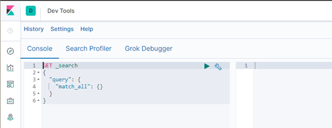
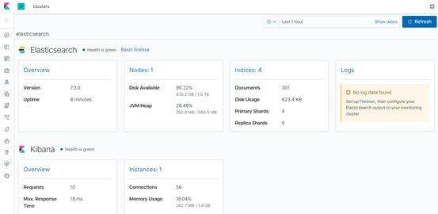

# ElasticSearchOps


# ES7


## Windows安装


* 安装JDK,至少1.8.0_73以上版本
* [下载地址](https://www.elastic.co/cn/downloads/elasticsearch)
* 下载和解压缩Elasticsearch安装包,查看目录结构
  * bin：脚本目录,包括：启动、停止等可执行脚本
  * config：配置文件目录
  * data：索引目录,存放索引文件的地方
  * logs：日志目录
  * modules：模块目录,包括了es的功能模块
  * plugins :插件目录,es支持插件机制


### 启动


* `bin\elasticsearch.bat`
* es7 windows版本不支持机器学习,所以elasticsearch.yml中添加如下几个参数:

```yaml
node.name: node-1  
cluster.initial_master_nodes: ["node-1"]  
xpack.ml.enabled: false 
http.cors.enabled: true
http.cors.allow-origin: /.*/
```

* 检查ES是否启动成功,浏览器访问http://localhost:9200/?Pretty

```json
{
    // node名称,取自机器的hostname
    "name": "node-1",
    "cluster_name": "elasticsearch",
    "cluster_uuid": "HqAKQ_0tQOOm8b6qU-2Qug",
    "version": {
        // es版本号
        "number": "7.3.0",
        "build_flavor": "default",
        "build_type": "zip",
        "build_hash": "de777fa",
        "build_date": "2022-07-24T18:30:11.767338Z",
        "build_snapshot": false,
        // 封装的lucene版本号
        "lucene_version": "8.1.0",
        "minimum_wire_compatibility_version": "6.8.0",
        "minimum_index_compatibility_version": "6.0.0-beta1"
    },
    "tagline": "You Know, for Search"
}
```

* 浏览器访问 http://localhost:9200/_cluster/health 查询集群状态

```json
{
    "cluster_name": "elasticsearch",
    // 集群状态,Green标识所有分片可用;Yellow所有主分片可用;Red主分片不可用,集群不可用
    "status": "green",
    "timed_out": false,
    "number_of_nodes": 1,
    "number_of_data_nodes": 1,
    "active_primary_shards": 0,
    "active_shards": 0,
    "relocating_shards": 0,
    "initializing_shards": 0,
    "unassigned_shards": 0,
    "delayed_unassigned_shards": 0,
    "number_of_pending_tasks": 0,
    "number_of_in_flight_fetch": 0,
    "task_max_waiting_in_queue_millis": 0,
    "active_shards_percent_as_number": 100
}
```


## Linux安装


* 下载对应JDK版本的Elasticsearch安装包,或直接用yum或web-get下载安装包,解压到/app/es下

* 在es目录下创建data和logs目录

* 配置文件elasticsearch.yml在es/conf下

  ```yaml
  # 数据目录
  path.data:  /app/es/data
  # 日志目录
  path.logs:  /app/es/logs
  ```

* 配置linux进程访问数量,vi /etc/security/limits.conf,添加如下内容:

  ```shell
  * soft nofile 65536
  * hard nofile 131072
  * soft nproc 2048
  * hard nproc 4096
  ```

* 其他相关系统配置

  * vi /etc/security/limits.d/90-nproc.conf,修改如下内容:

  ```shell
  # * soft nproc 1024 修改为
  * soft nproc 2048
  ```

  * vi /etc/sysctl.conf ,添加下面配置:

  ```shell
  vm.max_map_count=655360
  sysctl -p
  ```

* 启动.es/bin/,根据系统的不同,进入不同的文件夹,进入后./elasticserach.sh start

* 启动测试:curl http://localhost:9200或在网页直接打开改地址

* 可使用elasticsearch-head对es进行可视化查看,主要需要开启es的跨域

* IK分词器,ES默认的分词器对中文支持不太好,使用IK分词器可以更好的查询中文,他分为2种模式:

  * ik_max_word:会对中文做最细粒度的拆分
  * ik_smart:最粗粒度的拆分

* 当直接在ElasticSearch建立文档对象时,如果索引不存在的,默认会自动创建,映射采用默认方式

* ElasticSearch服务默认端口9300,Web管理平台端口9200


## 常见问题


* 内存不足

  ```shell
  # 报错:
  # max virtual memory areas vm.max_map_count [65530] is too low, increase to at least [262144]
  # 在/etc/sysctl.conf中添加如下
  vm.max_map_count=655360
  sysctl -p
  # 若是docker,可添加命令参数: -e ES_JAVA_OPTS="-Xms1g -Xmx1g"
  ```

* 内存锁定

  ```shell
  # unable to install syscall filter: 
  # java.lang.UnsupportedOperationException: seccomp unavailable: CONFIG_SECCOMP not compiled into kernel, CONFIG_SECCOMP and CONFIG_SECCOMP_FILTER are needed
  # 在配置文件中添加如下配置
  bootstrap.memory_lock: false
  bootstrap.system_call_filter: false
  ```

* bootstrap checks failed

  ```shell
  # max file descriptors [4096] for elasticsearch process likely too low, increase to at least [65536]
  # max number of threads [1024] for user [lishang] likely too low, increase to at least [2048]
  # 修改/etc/security/limits.conf,添加如下
  * soft nofile 65536
  * hard nofile 131072
  * soft nproc 2048
  * hard nproc 4096
  ```


## 配置文件


### elasticserch.yml


* 配置文件地址es/conf/elasticsearch.yml
* cluster.name:集群名称,如果要配置集群,需要两个以上的es节点配置的cluster.name相同,都启动可以自动组成集群
* node.name:当前es节点的名称,集群内部可重复
* network.host:绑定地址,若是0.0.0.0,任何ip都可以访问es
* http.port:http访问端口
* http.cors.enabled:true,是否允许跨域访问
* http.cors.allow-origin:/.*/,允许跨域访问的请求头
* transport.tcp.port:es内部交互接口,用于集群内部通讯,选举等
* node.master:true/false,集群中该节点是否能被选举为master节点,默认为true
* node.data:true/false,指定节点是否存储索引数据,默认为true
* discovery.zen.ping.unicast.hosts:["ip1:port1","ip2:port2"],设置集群中master节点的初始列表
* discovery.zen.ping.timeout:3s,es自动发现节点连接超时时间,默认为3s
* discovery.zen.minimum_master_nodes:2,最小主节点个数,此值的公式为:`(master_eligible_nodes/2)+1`
* discovery.seed_hosts:设置集群中的master节点的出事列表ip端口地址,逗号分隔
* cluster.initial_master_nodes:新集群初始时的候选主节点
* node.max_local_storage_nodes:2,单机允许的最大存储节点数,通常单机启动一个节点设置为1,开发环境如果单机启动多个节点可设置大于1
* node.ingest:true/false,是否允许成为协调节点
* bootstrap.memeory_lock:true/false,设置true可以锁住es使用的内存,避免内存与swap分区交换数据
* path.data:数据存储目录.默认是es根目录下的data文件夹,可以设置多个存储路径,用逗号隔开
* path.logs:日志存储目录.默认是es根目录下的logs文件夹
* path.conf:设置配置文件的存储路径,tar或zip默认在es根目录下的config,rpm默认在/etc/elasticsearch
* path.plugins:设置插件的存放路径,默认是es根目录下的plugins文件夹
* xpack.ml.enabled:boolean,是否启用机器学习,在windows上不支持,要设置为false


### jvm.options


* 设置最小及最大的JVM堆内存大小,在jvm.options中设置 -Xms和-Xmx
* 两个值设置为相等,将Xmx 设置为不超过物理内存的一半


# Kibana


* [下载地址](https://www.elastic.co/cn/downloads/kibana)

* 基于nodejs,可视化日志Web展示工具,对ES中存储的日志进行展示,还可以生成相应的图标
* 建立索引模式,index partten;discover 中使用DSL搜索
* 可视化: 绘制图形
* 仪表盘: 将各种可视化图形放入,形成大屏幕
* 使用模板数据指导绘图: 点击主页的添加模板数据,可以看到很多模板数据以及绘图
* 其他功能: 监控,日志,APM等功能非常丰富


## Windows安装


* kibana是es数据的前端展现,数据分析时,可以方便地看到数据
* 下载,解压kibana
* 启动Kibana：bin\kibana.bat
* 浏览器访问 http://localhost:5601 进入Dev Tools界面,像plsql一样支持代码提示
* 发送get请求,查看集群状态GET _cluster/health,相当于浏览器访问
* DevTool界面



* 监控集群界面




# Elasticsearch head


* head插件是ES的一个可视化管理插件,用来监视ES的状态,并通过head客户端和ES服务进行交互,比如创建映射、创建索引等


## Windows安装


* [下载地址](https://github.com/mobz/elasticsearch-head)
* nodejs[官网](https://nodejs.org/dist/)下载安装,配置环境变量
* 下载head并运行

```
git clone git://github.com/mobz/elasticsearch-head.git 
cd elasticsearch-head 
npm install 
npm run start 
```

* 浏览器打开 http://localhost:9100/
* 打开浏览器调试工具发现报请求跨域错误,需要设置elasticsearch允许跨域访问,在config/elasticsearch.yml 后面增加以下参数:

```
# 开启cors跨域访问支持,默认为false   
http.cors.enabled: true   
# 跨域访问允许的域名地址,(允许所有域名)以上使用正则   
http.cors.allow-origin: /.*/
```

* kibana\postman\head插件选择自己喜欢的一种使用即可


## Linux安装


* [下载插件](https://github.com/mobz/elasticsearch-head)
* nodejs[官网](https://nodejs.org/dist/)下载安装,配置环境变量,查看node和npm版本

```shell
vi /etc/profile
export NODE_HOME=/app/nodejs
export PATH=$PATH:$NODE_HOME/bin
source /etc/profile
node -v
npm -v
```

* 解压head插件到/app/eshead目录下
* 查看当前head插件目录下有无node_modules/grunt目录,没有:执行命令创建

```shell
# 替换nodejs源为淘宝镜像源,加速依赖下载
npm install -g cnpm --registry=https://registry.npm.taobao.org
# 安装依赖
npm install grunt --save
npm install -g grunt-cli
```

* 编辑Gruntfile.js:vim Gruntfile.js

```javascript
# 文件93行添加hostname:'0.0.0.0'
options: {
    hostname:'0.0.0.0',
    port: 9100,
    base: '.',
    keepalive: true
}
```

* 检查head根目录下是否存在base文件夹,没有:将_site下的base文件夹及其内容复制到head根目录下
* 启动grunt server:grunt server -d->Started connect web server on http://localhost:9100
* 如果提示grunt的模块没有安装:

```shell
Local Npm module “grunt-contrib-clean” not found. Is it installed? 
Local Npm module “grunt-contrib-concat” not found. Is it installed? 
Local Npm module “grunt-contrib-watch” not found. Is it installed? 
Local Npm module “grunt-contrib-connect” not found. Is it installed? 
Local Npm module “grunt-contrib-copy” not found. Is it installed? 
Local Npm module “grunt-contrib-jasmine” not found. Is it installed? 
Warning: Task “connect:server” not found. Use –force to continue. 
# 执行以下命令,最后一个模块可能安装不成功,但是不影响使用
npm install grunt-contrib-clean grunt-contrib-concat grunt-contrib-watch grunt-contrib-connect grunt-contrib-copy grunt-contrib-jasmine 
```

* 浏览器访问head插件:http://hadoop102:9100
* 启动集群插件后发现集群未连接,提示跨域访问,可在es配置文件添加如下配置

```yaml
http.cors.enabled: true
http.cors.allow-origin: "*"
```

* 再重新启动elasticsearch
* 关闭插件服务:ctrl+c


# IK分词器


* 默认是使用官方的标准分词器,但是对中文支持不友好,需要使用IK分词器

  ```json
  // standard 分词器,仅适用于英文
  GET /_analyze
  {
    "analyzer": "standard",
    "text": "中华人民共和国人民大会堂"
  }
  ```

* 结果:

  * token 实际存储的term 关键字
  * position 在此词条在原文本中的位置
  * start_offset/end_offset字符在原始字符串中的位置


## 安装


* IK分词器:对中文友好的分词器,不会像标准分词器一样将每个词都拆开,[官网](https://github.com/medcl/elasticsearch-analysis-ik/releases)

* 根据es版本下载相应版本包,解压到 es/plugins/ik中,重启ES和Kibana


## 配置


* ik配置文件地址: es/plugins/ik/config目录
* IKAnalyzer.cfg.xml: 用来配置自定义词库
* main.dic: ik原生内置的中文词库,总共有27万多条,只要是这些单词,都会被分在一起
* preposition.dic: 介词
* quantifier.dic: 放了一些单位相关的词,量词
* suffix.dic: 放了一些后缀
* surname.dic: 中国的姓氏
* stopword.dic: 英文停用词
* ik原生最重要的两个配置文件
  * main.dic: 包含了原生的中文词语,会按照这个里面的词语去分词
  * stopword.dic: 包含了英文的停用词
* 停用词,stopword,英文中类似`a,the,is`等,停用词会在分词的时候直接被干掉,不会建立在倒排索引中

 

## 使用


* ik_max_word:最大粒度的对中文词汇进行拆分.比如会将`中华人民共和国人民大会堂`拆分为`中华人民共和国,中华人民,中华,华人,人民共和国,人民大会堂,人民大会,大会堂`,会穷尽各种可能的组合

* ik_smart:最粗粒度的对中文进行拆分,智能拆分.比如会将`中华人民共和国人民大会堂`拆分为`中华人民共和国,人民大会堂`

* 存储时,使用ik_max_word,搜索时,使用ik_smart

  ```json
  PUT /index_name 
  {
    "mappings": {
        "properties": {
          "text": {
            "type": "text",
            "analyzer": "ik_max_word",
            "search_analyzer": "ik_smart"
          }
        }
    }
  }
  ```

* 搜索

  ```json
  GET /index_name/_search?q=中华人民共和国人民大会堂
  ```


## 自定义分词


* 自定义分词:需要修改IK分词器目录下的config/IKAnalyzer.cfg.xml

* ext_dict:本地分词文件地址,在值的位置配置自定义分词的文件名称.文件的每行只能定义一个词,最好是将文件的后缀定义为dic,同时该文件的编码模式选择UTF8,配置好后重启ES即可
* remote_ext_dict:远程分词器地址,是一个远程的http/https地址,可以配置到nginx或其他服务器中,文件形式和内容同ext_dict即可,配置后重启ES即可
* custom/ext_stopword.dic:自己建立停用词库:比如了,的等.已经有了常用的停用词,可以补充停用词,然后重启es


# MySQL热更新


## 方案


* 方案1: 基于ik分词器原生支持的热更新方案,部署一个web服务器,提供一个http接口,通过modified和tag两个http响应头,来提供词语的热更新
* 方案2: 修改ik分词器源码,然后手动支持从mysql中每隔一定时间,自动加载新的词库
* 用第二种方案,第一种,ik git社区官方都不建议采用,觉得不太稳定


##  步骤


* [下载源码](https://github.com/medcl/elasticsearch-analysis-ik/releases)
* ik分词器是个标准的java maven工程,直接导入IDE就可以看到源码
* 修改源`org.wltea.analyzer.dic.Dictionary#initial()`,该方法为词典初始化方法
* 参照该方法中加载主词典和停用词等方法,自定义加载MySQL数据,利用多线程或队列实现

```java
public static synchronized void initial(Configuration cfg) {
    if (singleton == null) {
        synchronized (Dictionary.class) {
            if (singleton == null) {

                singleton = new Dictionary(cfg);
                singleton.loadMainDict();
                singleton.loadSurnameDict();
                singleton.loadQuantifierDict();
                singleton.loadSuffixDict();
                singleton.loadPrepDict();
                singleton.loadStopWordDict();
                // 可以在此处自定义加载MySQL数据的方法,主要是参照loadMainDict()和loadStopWordDict();

                if(cfg.isEnableRemoteDict()){
                    // 建立监控线程
                    for (String location : singleton.getRemoteExtDictionarys()) {
                        // 10 秒是初始延迟可以修改的 60是间隔时间 单位秒
                        pool.scheduleAtFixedRate(new Monitor(location), 10, 60, TimeUnit.SECONDS);
                    }
                    for (String location : singleton.getRemoteExtStopWordDictionarys()) {
                        pool.scheduleAtFixedRate(new Monitor(location), 10, 60, TimeUnit.SECONDS);
                    }
                }

            }
        }
    }
}
```

* 修改完之后用命令`mvn clean package`打包:target\releases\elasticsearch-analysis-ik-7.3.0.zip
* 解压缩ik压缩包,将mysql驱动jar,放入ik的目录下
* 修改jdbc相关配置
* 重启es.观察日志,日志中就会显示我们打印的那些东西,比如加载了什么配置,加载了什么词语,什么停用词
* 在mysql中添加词库与停用词
* 分词实验,验证热更新生效

```json
GET /_analyze
{
  "analyzer": "ik_smart",
  "text": "飞花梦影"
}
```


# 集群


* ES自带集群,一个运行中的ES实例称为一个节点,而集群是由一个或多个拥有相同cluster.name配置的节点组成,当有新节点加入集群时,集群将会自动重新平均分布所有的数据
* 当一个节点被选举为主节点时,它将负责管理集群范围内的所有变更.
* 主节点并不需要涉及到文档级别的变更和搜索等操作,所有当集群只有一个主节点时,即使流量的增加它也不会成为瓶颈
* 任何节点都可以成为主节点
* 客户端发送请求到集群中的任何节点都能感知文档所处的位置,并且正确处理请求并返回数据
* 集群健康状态:get,地址/_cluster/\_health,返回结果的status字段中展示为green,yellow,red
  * status:表示当前集群在总体上是否正常工作
  * green:所有的主分片和副本分片都正常运行
  * yellow:所有的主分片都正常运行,但不是所有的副本分片都正常运行
  * red:有主分片没正常运行


## 主节点异常


* 立刻会选举一个新的节点作为主节点
* 由于在其他节点上存在完整的主分片,所以数据不会丢失


## 候选节点


* 当主节点异常时,那些节点可以升级为主节点,只需要配置node.master=true即可


## 数据节点


* 数据节点通常只负责数据的增删改查等,只需要配置node.data=true即可
* 一个节点最好不要同时是候选节点和数据节点,否则大并发情况下对服务器造成的压力较大


## 客户端节点


* node.master和node.data都是false,这样的节点只负责请求的分发,汇总等
* 该类型的节点主要是为了负载均衡


## 脑裂


* 网络不通或其他情况下导致集群中部分节点和另外部分节点无法通信,出现多个主节点
* 当主节点即是master又为data时,若访问量较大,可能造成短暂的无响应而造成延迟
* data节点上的ES进程占用的内存较大,引发JVM大规模内存回收造成ES时区响应
* 减少脑裂应该进行角色分离,主节点和数据节点分开
* 减少误判,延长主节点的心跳超时响应时间:discovery.zen.ping_timeout
* 选举触发:discovery.zen.minimum_master_nodes,该属性定义在集群中有候选节点且相互连接的节点的最小数量为多少时,才能形成新的集群


# Docker中使用


* docker中安装ES7,启动命令如下

```shell
docker run --name elasticsearch  --restart=always 
# 端口映射:服务器端口:docker端口
-p 9200:9200 -p 9300:0300 
# 指定运行参数
-e "discovery.type=single-node" -e ES_JAVA_OPS="-Xms64m -Xmx128m" 
# 配置文件目录映射:服务器目录:docker目录
-v /app/elasticsearch/config:/usr/share/elasticsearch/config 
# 存储数据目录映射
-v /app/elasticsearch/data:/usr/share/elasticsearch/data 
# 插件目录映射
-v /app/elasticsearch/plugins:/usr/share/elasticsearch/plugins -d elasticsearch:7.4.2
```

* docker中启动ES插件Kibana:ES的可视化插件

```shell
docker run --name kibana -e ELASTICSEARCH_HOSTS=ip:port -p 5601:5601 -d kibana:7.4.2
```

