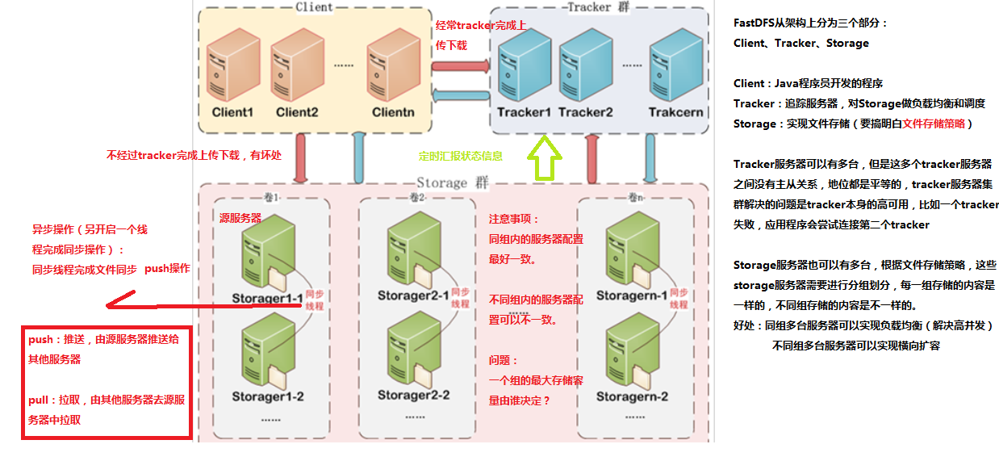
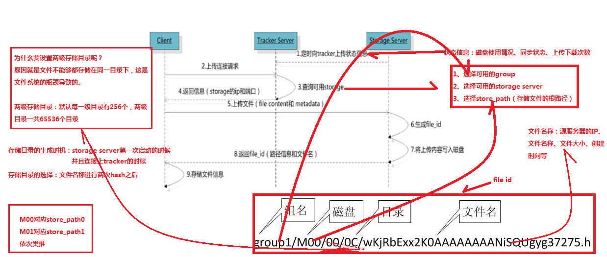
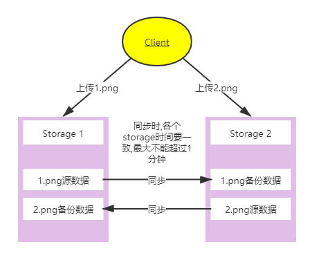
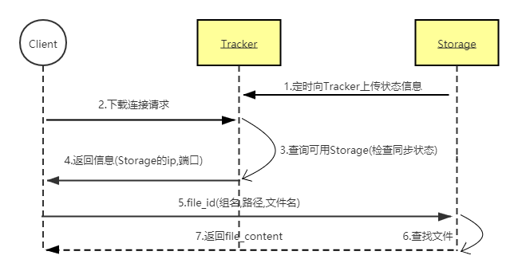
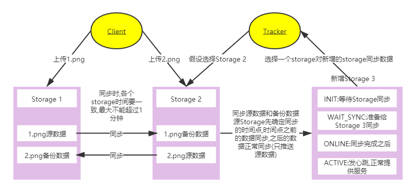
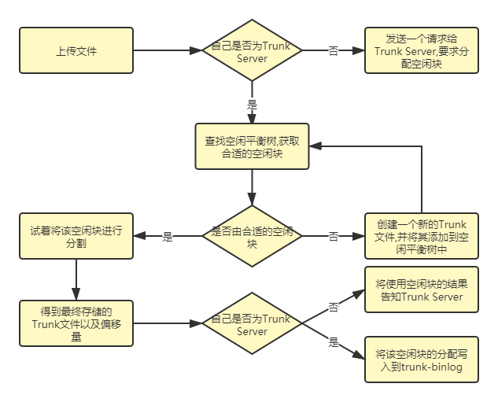
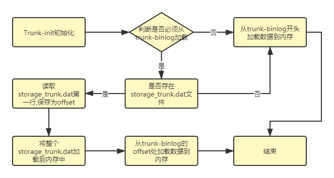
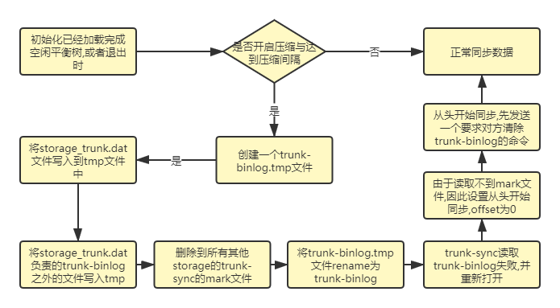
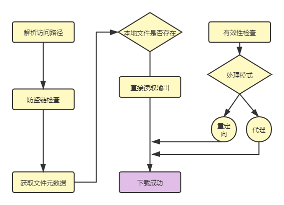

# Fastdfs


# 概述


* 一个使用C编写的开源的高性能分布式文件系统:Distributed File System,简称DFS
* 主要对文件进行管理,包括文件存储、同步、上传下载等,解决了大容量存储和负载均衡的问题
* 适合以文件为载体的在线服务,如视频、电商网站等.特别适合中小文件(不超过500M)为载体的在线服务
* 支持相同文件内容只保存一份,节省存储空间
* 存储服务器上可以保存文件附加属性
* 下载文件支持多线程方式,支持断点续传


# 原理

## 组成




## Tracker Server


* 跟踪服务器,主要做调度工作,并对Storage Server起到负载均衡的作用
* 负责管理所有的Storage和Group,每个Storage在启动后会连接 Tracker,告知自己所属Group
  等信息,并保持周期性心跳
* Tracker可以有多台,Tracker之间是相互平等关系同时提供服务,Tracker不存在单点故障
* 客户端请求Tracker采用轮询方式,如果请求的Tracker无法提供服务则换另一个Tracker


## Storage Server


* 存储服务器,主要提供容量和备份服务
* 以Group为单位,不同Group之间互相独立,每个Group内可以有多台Storage,数据互为备份
* 采用分组存储方式的好处是灵活、可控性较强.比如上传文件时,可以由客户端直接指定上传到的组也可以由Tracker进行调度选择
* 一个分组的存储服务器访问压力较大时,可以在该组增加存储服务器来扩充服务能力(纵向扩容).当系统容量不足时,可以增加组来扩充存储容量(横向扩容)


## Client


* 客户端,上传下载数据的服务器,也就是我们自己的项目所部署在的服务器


## 存储策略


* 为了支持大容量,存储节点(服务器)采用了分卷(或分组)的组织方式
* 存储系统由一个或多个卷组成,卷与卷之间的文件是相互独立的,所有卷的文件容量累加就是整个存储系统中的文件容量
* 一个卷可以由一台或多台存储服务器组成,一个卷下的存储服务器中的文件都是相同的,卷中的多台存储服务器起到了冗余备份和负载均衡的作用
* 在卷中增加服务器时,同步已有的文件由系统自动完成,同步完成后,系统自动将新增服务器切换到线上提供服务
* 当存储空间不足或即将耗尽时,可以动态添加卷.只需要增加一台或多台服务器,并将它们配置为一个新的卷,这样就扩大了存储系统的容量


## Storage状态收集


* Storage会通过配置连接集群中所有的Tracker,定时向他们报告自己的状态,包括磁盘剩余空间、文件同步状况、文件上传下载次数等统计信息
* Storage有7个状态:
  * FDFS_Storage_STATUS_INIT:初始化,尚未得到同步已有数据的源服务器
  * FDFS_Storage_STATUS_WAIT_SYNC:等待同步,已得到同步已有数据的源服务器
  * FDFS_Storage_STATUS_SYNCING:同步中
  * FDFS_Storage_STATUS_DELETED:已删除,该服务器从本组中摘除
  * FDFS_Storage_STATUS_OFFLINE:离线
  * FDFS_Storage_STATUS_ONLINE:在线,但不能提供服务
  * FDFS_Storage_STATUS_ACTIVE:在线,可提供服务
* 当Storage的状态为FDFS_Storage_STATUS_ONLINE时,若该Storage向Tracker发起一次heart beat(心跳),Tracker将其状态更改为ACTIVE


## 文件上传





* Tracker收集Storage的状态信息
  * Storage定时向已知的Tracker(可以是多个),发送磁盘剩余空间,文件同步状况,文件上传下载次数等统计信息
  * Storage会链接整个集群中所有的Tracker,向他们报告自己的状态
* 当集群中不止一个Tracker时,由于Tracker之间是完全对等的,Client在上传时可以任意选择
* 当Tracker接收到上传请求时,会为该文件分配一个可以存储该文件的Group,规则如下:
  * Round robin:所有的Group间轮询
  * Specified Group:指定某一个确定的Group
  * Load balance:剩余存储空间多的Group优先
* 当选定Group后,Tracker会在Group内选择一个Storage给客户端,规则如下:
  * Round robin:在Group内所有的Storage间轮询
  * First server ordered by ip:按ip排序
  * First server ordered by priority:按优先级排序,优先级在Storage上配置
* 当分配好Storage后,客户端将向Storage发送写文件请求,Storage将会为文件分配一个数据存储目录,规则如下(在Storage配置文件可以通过store_path来设置,该参数可以设置多个,通过*区别):
  * Round robin:多个存储目录间轮询
  * 剩余存储空间最多的优先
* 生成文件名.选定存储目录之后,Storage会为文件生一个文件名.由源Storage server ip,文件创建时间,文件大小,文件crc32和一个随机数拼接而成,然后将这个二进制串进行base64编码,转换为可打印的字符串.如果是文件合并,则会在原文件名后多16个字节,依次是文件存放的trunk file id,文件偏移量,占用空间大小
* 选择两级目录.当选定存储目录之后,Storage会为文件分配一个fileid,每个存储目录下有两级256*256的子目录,Storage会按文件名称进行两次hash,路由到其中一个子目录,然后将文件以fileid为文件名存储到该子目录下
* 生成fileid.当文件存储到某个子目录后,即认为该文件存储成功,接下来会为该文件生成一个文件名,文件名由Group、存储目录、两级子目录、文件名、文件后缀名(由客户端指定,主要用于区分文件类型)拼接而成.如:Group2/M00/01/02/dfdsfdsfdsfdsfds.png


## 文件同步




* 写文件时,客户端将文件写至Group内任意一个Storage即认为写文件成功
* Storage写完文件后,会由后台线程将文件同步至同Group内其他的Storage
* 同步规则总结如下:
  * 只在本组内的Storage之间进行同步
  * 源头数据才需要同步,备份数据不需要再次同步,否则就构成环路了
  * 例外,新增一台Storage时,由已有的一台Storage将已有的所有数据(包括源头数据和备份数据)同步给该新增服务器
* 每个Storage写文件后,同时会写一份binlog,binlog里不包含文件数据,只包含文件名等元信息,这份binlog用于后台同步
* Storage会记录向Group内其他Storage同步的进度,以便重启后能接上次的进度继续同步
* 进度以时间戳的方式进行记录,所以最好能保证集群内所有server的时钟保持同步
* Storage的同步进度会作为元数据的一部分汇报到Tracker上,Tracker在选择读Storage的时候会以同步进度作为参考
  * 如一个Group内有A、B、C三个Storage,A向C同步到进度为T1 (T1以前写的文件都已经同步到B),B向C同步到时间戳为T2(T2 > T1)
  * Tracker接收到这些同步进度信息时,就会进行整理,将最小的那个做为C的同步时间戳,本例中T1即为C的同步时间戳为T1(即所有T1以前写的数据都已经同步到C上)
  * 同理,根据上述规则,Tracker会为A、B生成一个同步时间戳


## 文件下载





* 客户端上传文件成功后,会拿到一个Storage生成的文件名,客户端根据这个文件名即可访问到该文件
* Tracker收集Storage的状态信息.Storage定时向已知的Tracker(可以是多个)发送磁盘剩余空间、文件同步状况、文件上传下载次数等统计信息
* Storage会连接整个集群中所有的Tracker,向他们报告自己的状态
* 选择Tracker,和上传文件时一样,客户端可选择任意tracker
* 选择可用的Storage
  * Client发送下载请求给某个Tracker,必须带上文件名信息
  * Tracker从文件名中解析出文件的Group,路径信息,文件大小,创建时间,源Storage server ip信息,然后为该请求选择一个Storage用来服务读请求
  * 由于Group内的文件同步是在后台异步进行的,所以有可能出现在读的时候文件还没同步到某些Storage上,为了尽量避免访问到这样的Storage,Tracker按照如下规则选择Group内可读的Storage:
    * 该文件上传的源头Storage:源Storage只要存活,肯定包含该文件,源头的地址被编码在文件名中
    * 文件创建时间戳==Storage被同步到的时间戳,且(当前时间-文件创建时间戳) > 文件同步最大时间(如5分钟) - 文件创建后,认为经过最大同步时间后,肯定已经同步到其他Storage
    * 文件创建时间戳 < Storage被同步到的时间戳-同步时间戳之前的文件确定已经同步
    * (当前时间-文件创建时间戳) > 同步延迟阈值(如一天) - 经过同步延迟阈值时间,认为文件已同步


## Storage新增




* 组内新增加一台Storage A时,由系统自动完成已有数据同步,处理逻辑如下:
* Storage A连接tracker,tracker将Storage A的状态设置为INIT 
* Storage A询问追加同步的源服务器和追加同步截至时间点.若该组内只有Storage A或该组已上传文件数为0,则无需同步,Storage A可以提供在线服务.此时Tracker将其状态设置为ONLINE,否则Tracker将其状态设置为WAIT_SYNC
* 假设Tracker分配向Storage A同步已有数据的源Storage为B,同组的Storage和Tracker通讯得知新增了Storage A,将启动同步线程,并向Tracker询问向Storage A追加同步的源服务器和截至时间点
* Storage B将把截至时间点之前的所有数据同步给Storage A.而其余的Storage从截至时间点之后进行正常同步,只把源头数据同步给Storage A
* 到了截至时间点之后,Storage B对Storage A的同步将由追加同步切换为正常同步,只同步源头数据
* Storage B向Storage A同步完所有数据,暂时没有数据要同步时,Storage B请求Tracker将Storage A的状态设置为ONLINE
* 当Storage A向Tracker发起heart beat时,Tracker将其状态更改为ACTIVE


# 合并存储


* FastDFS提供的合并存储功能,默认创建的大文件为64MB,然后在该大文件中存储很多小文件

* 大文件中容纳一个小文件的空间称为一个Slot,规定Slot最小值为256字节,最大为16MB,也就是小于256字节的文件也需要占用256字节,超过16MB的文件不会合并存储而是创建独立的文件

* 合并存储的功能配置都在tracker.conf中

* 合并存储文件命名与文件结构:FastDFS上传文件成功时,服务器返回该文件的存取ID叫fileid.当没有启动合并存储时,该fileid和磁盘上实际存储文件相对应,当采用合并存储时就不再一一对应,而是多个fileid对应的文件被存储成一个大文件

* 采用合并存储后的大文件统称为 Trunk文件,没有合并存储的文件称源文件

* Trunk文件:Storage服务器磁盘上存储的实际文件,默认大小为64MB

* Trunk文件文件名格式:fdfs_storage1/data/00/00/000001,文件名从1开始递增,类型为int

* 合并存储文件的fileid表示服务器启用合并存储后,每次上传返回给客户端的fileid,此时该fileid与磁盘上的文件没有一一对应关系

* 没有合并存储的fileid表示服务器未启用合并存储时,Upload时返回的fileid

* 合并存储后fileid的变化:

  ```nginx
  group1/M00/00/00/CgAEbFQWWbyIPCu1AAAFr1bq36EAAAAAQAAAAAAAAXH82.conf
  ```

  * 合并存储的fileid比源文件更长,因为其中需要加入保存的大文件id以及偏移量,具体包括了如下信息
    * file_size:占用大文件的空间,注意按照最小slot-256字节进行对齐
    * mtime:文件修改时间
    * crc32:文件内容的crc32码
    * formatted_ext_name:文件扩展名
    * alloc_size:文件大小与size相等
    * id:大文件ID如000001
    * offset:文件内容在trunk文件中的偏移量
    * size:文件大小

* 没有合并存储时fileid:

  ```nginx
  group1/M00/00/00/CmQPRlP0T4-AA9_ECDsoXi21HR0.tar.gz
  ```

  * CmQPRlP0T4-AA9_ECDsoXi21HR0.tar.gz除了文件后缀,前面部分是一个base64编码缓冲区,组成如下:
    * storage_id:ip的数值型
    * timestamp:创建时间
    * file_size:若原始值为32位则前面加入一个随机值填充,最终为64位
    * crc32:文件内容的检验码

* Trunk文件内部结构:trunk内部是由多个小文件组成,每个小文件都会有一个trunkHeader,以及紧跟在其后的真实数据,结构如下

  ```
  ---1bytes---|---4bytes---|---4bytes---|---4bytes---|---4bytes---|---7bytes---
  -fileType--|-alloc_size--|--fileSize--|--crc32--|--mtime--|formatted_ext_name--
  |---------------------------file_data filesize bytes --------------------------|
  |--------------------------------file_data-------------------------------------|
  ```


# 合并存储空间管理


## 概述

* Trunk文件为64MB,因此每次创建一次Trunk文件总是会产生空余空间
  * 如存储一个10MB文件,创建一个Trunk文件,那么就会剩下接近54MB的空间,下次要想再次存储10MB文件时就不需要创建新的文件,存储在已经创建的Trunk文件中即可
* 当删除一个存储的文件时,也会产生空余空间
* 在Storage内部会为每个store_path构造一颗以空闲块大小作为关键字的空闲平衡树,相同大小的空闲块保存在链表之中
* 每当需要存储一个文件时会首先到空闲平衡树中查找大于并且最接近的空闲块,然后试着从该空闲块中分
  割出多余的部分作为一个新的空闲块,加入到空闲平衡树中
  * 例如要求存储文件为300KB,通过空闲平衡树找到一个350KB的空闲块,那么就会将350KB的空闲块分裂成两块,前面300KB返回用于存储,后面50KB则继续放置到空闲平衡树之中
  * 假若此时找不到可满足的空闲块,那么就会创建一个新的Trunk文件64MB,将其加入到空闲平衡树之中,再次执行上面的查找操作


## TrunkServer




* 若所有的Storage都具有分配空闲空间的能力(upload文件时自主决定存储到哪个TrunkFile之中),那么可能会由于同步延迟导致数据冲突.
  * Storage-A上传一个文件A.txt,将其保存到000001这个TrunkFile的开头
  * 与此同时,Storage-B也上传一个文件B.txt,将其保存在000001这个TrunkFile文件的开头
  * 当Storage-B收到Storage-A的同步信息时,B无法将A.txt保存在000001这个Trunk文件的开头,因为这个位置已经被B.txt占用
* 为了处理这种冲突,引入了TrunkServer,只有TrunkServer才有权限分配空闲空间,决定文件应该保存到哪个TrunkFile的什么位置
* TrunkServer由Tracker指定,并且在心跳信息中通知所有的Storage


## TrunkFile同步

* 开启了合并存储服务后,除了原本的源文件同步之外,TrunkServer还多了TrunkBinlog的同步
* 源文件的同步与没有开启合并存储时过程完全一样,都是从binlog触发同步文件
* TrunkBinlog记录了TrunkServer所有分配与回收空闲块的操作,由TrunkServer同步给同组中的Storage
* TrunkServer为同组中的其他Storage各创建一个同步线程,每秒将TrunkBinlog的变化同步出去
* 同组的Storage接收到TrunkBinlog只是保存到文件中,不做其他任何操作

```shell
# TrunkBinlog文件文件记录如下
1410750754 A 0 0 0 1 0 67108864
1410750754 D 0 0 0 1 0 67108864
# 各字段含义如下(按照顺序)
# 时间戳
# 操作类型(A:增加,D:删除)
# store_path_index
# sub_path_high
# sub_path_low
# file.id(TrunkFile文件名,比如000001)
# offset(在TrunkFile文件中的偏移量)
# size(占用的大小,按照slot对齐)
```


## 空闲平衡树重建





* 当作为TrunkServer的Storage启动时可以从TrunkBinlog文件中加载所有的空闲块分配与加入操作,这个过程就可以实现空闲平衡树的重建
* 当长期运行时,随着空闲块的不断删除添加会导致TrunkBinlog文件很大,加载时间会很长,FastDFS引入了检查点文件storage_trunk.dat
* 每次TrunkServer进程退出时会将当前内存里的空闲平衡树导出为storage_trunk.dat.该文件的第一行为TrunkBinlog的offset,也就是该检查点文件负责到这个offset为止的TrunkBinlog
* 下次TrunkServer启动时,先加载storage_trunk.dat,然后继续加载这个offset之后的TrunkBinlog内容


## TrunkBinlog压缩





* 上文提到的storage_trunk.dat既是检查点文件,也是一个压缩文件,因为从内存中将整个空闲平衡树直接导出,没有了中间步骤,因此文件就很小
* 这种方式虽然实现了TrunkServer自身重启时快速加载空闲平衡树的目的,但是并没有实际上缩小TrunkBinlog文件的大小
  * 假如这台TrunkServer宕机后,Tracker会选择另外一台机器作为新的TrunkServer
  * 新的TrunkServer必须从很庞大的TrunkBinlog中加载空闲平衡树
  * 由于TrunkBinlog文件很大,这将是一个很漫长的过程

* 为了减少TrunkBinlog,可以选择压缩文件
* 在TrunkServer初始化完成后,或退出时,可以将storage_trunk.dat与其负责偏移量之后的TrunkBinlog合并,产生一个新的TrunkBinlog
* 由于此时的TrunkBinlog已经从头到尾整个修改了,就需要将该文件完成的同步给同组内的其他Storage,为了达到该目的,FastDFS使用了如下方法:
  * TrunkServer将TrunkBinlog同步给组内其他Storage时会将同步的最后状态记录到一个mark文件之中,比如同步给A,则记录到A.mark文件(其中包括最后同步成功的TrunkBinlog偏移量)
  * TrunkServer在将storage_trunk.dat与TrunkBinlog合并后,就将本地记录TrunkBinlog最后同步状态的所有mark文件删除.如一组有A、B、C,其中A为TrunkServer,则A此时删除B.mark、C.mark
  * 当下次TrunkServer要同步TrunkBinlog到B、C时,发现找不到B.mark、C.mark文件,就会自动从头转换成从头开始同步文件
  * 当TrunkServer判断需要从头开始同步TrunkBinlog,由于担心B、C已经有旧的文件,因此就需要向B、C发送一个删除旧的TrunkBinlog的命令
  * 发送删除命令成功之后,就可以从头开始将TrunkBinlog同步给B、C
  * 删除TrunkBinlog文件时,会有一个时间窗口,即删除B、C的TrunkBinlog后,到将TrunkBinlog同步给他们之前,假如TrunkBinlog宕机,那么组内的B、C都会没有TrunkBinlog可使用


## Tracker-Leader


* 开启合并存储时,为了分配空间引入了TrunkServer,该TrunkServer是该Group中的一个Storage,只是该Storage要负责为该组内的所有Upload操作分配空间
* 为了避免不同Tracker为该Group选择了不同的TrunkServer,引入了Tracker-Leader.即TrunkServer最终由Tracker-Leader来选择,然后通知给该组内的所有Storage
* Tracker -Leader选择TrunkServer时机:
  * 当组内一个Storage状态变成Active,且该组还未指定TrunkServer时,在
    tracker_mem_active_store_server()中触发
  * 某个Tracker在经过选择,被设置成Leader时,则为当前还没有指定TrunkServer的组选择TrunkServer,在relationship_select_leader()中触发
  * 在定期指定的任务tracker_mem_check_alive()中,默认该函数100秒指定一次
    * 尝试为每个当前还没有指定TrunkServer的组选择TrunkServer
    * 对已经指定的组检查其TrunkServer是否还处于活动状态(根据TrunkServer与Tracker的最后心跳时间计算),若不处于活动状态,则会尝试给该组选择一个新的TrunkServer.
    * 在tracker_mem_check_alive()中触发
* Tracker-Leader选择TrunkServer,该过程由tracker_mem_find_trunk_server()负责:
  * 依次向组内状态为ACTIVE的Storage发送TRUNK_GET_BINLOG_SIZE命令,查询每个Storage当前保存的Trunk-Binlog的文件大小,找到Trunk-Binlog文件最大的Storage
  * 若该Group的最后一个TrunkServer与要设置的新的TrunkServer并非同一个,则向新TrunkServer发送TRUNK_DELETE_BINLOG_MARKS命令,让其删除trunk-binlog同步的状态mark文件
  * 变更该组的TrunkServer,并将修改写入到storage_groups_new.dat文件之中,更新该组的最后TrunkServer设置,设置TrunkServer已经变更标志,该标志使得在与Storage的心跳中通知对方TrunkServer已经变更


# 安装


* 安装其他依赖:yum install -y gcc-c++ libevent perl git
* 下载libfastcommon源码到/app目录中

```shell
git clone https://gitee.com/fastdfs100/libfastcommon.git
cd libfastcommon
git checkout V1.0.43
./make.sh clean && ./make.sh && ./make.sh install
```

* 安装成功后,若是32位的linux系统会将libfastcommon.so和libfdfsclient.so自动安装到/usr/lib中,64位系统会自动安装到/usr/lib64中
* 建立软连接,必须建立,安装FastDFS时需要使用

```shell
ln -s /usr/lib64/libfastcommon.so /usr/local/lib/libfastcommon.so
ln -s /usr/lib64/libfastcommon.so /usr/lib/libfastcommon.so
ln -s /usr/lib64/libfdfsclient.so /usr/local/lib/libfdfsclient.so
ln -s /usr/lib64/libfdfsclient.so /usr/lib/libfdfsclient.so
```

* 下载FastDFS源码到/app目录中

```shell
git clone https://gitee.com/fastdfs100/fastdfs.git
cd fastdfs 
git checkout V6.06
./make.sh clean && ./make.sh && ./make.sh install
# 安装成功后将在/etc/fdfs目录下生成4个文件:
# client.conf.sample,Storage.conf.sample,Storage_ids.conf.sample,tracker.conf.sample
cd /etc/fdfs
cp client.conf.sample client.conf
cp Storage.conf.sample Storage.conf
cp Storage_ids.conf.sample Storage_ids.conf
cp tracker.conf.sample tracker.conf
cd /app/fastdfs/conf/
cp mime.types http.conf /etc/fdfs/
```

* 修改tracker.conf中的base_path为自定义的目录,该目录主要存放数据和日志文件
* 启动Tracker

```shell
/usr/bin/fdfs_trackerd /etc/fdfs/tracker.conf restart
# 或者
service fdfs_trackerd restart
# Tracker开机自启
vi /etc/rc.d/rc.local
# 添加如下命令
/usr/bin/fdfs_trackerd /etc/fdfs/tracker.conf
```

* 修改Storage.conf配置文件

```shell
# 组名
group_name=group1
# 数据和日志地址
base_path:
# 存储根目录.自定义,若有多个磁盘,可继续写store_path1:...
store_path0:
# store_path1:
# store_path2:
# tracker服务器地址,可以是主机:port,也可以是ip:port,可以写多个
tracker_server:
```

* 启动Storage

```shell
/usr/bin/fdfs_storaged /etc/fdfs/storage.conf restart
# 或者
service fdfs_storaged restart
# Storage开机自启
vi /etc/rc.d/rc.local
# 添加如下命令
/usr/bin/fdfs_storaged /etc/fdfs/storage.conf
```

* 修改客户端配置client.conf:修改base_path,修改tracker_server地址同上面的配置文件
* 测试上传图片,在/app/fastdfs/images有张图片可以用来测试上传
  * /usr/bin/fdfs_test /etc/fdfs/client.conf upload  /app/fastdfs/images/architect.png
  * /app/fastdfs/images/architect.png:fdfs_test是专门用来测试的脚本,client.conf为客户端配置文件地址,upload为固定写法,最后一个参数为需要上传的图片地址
  * 上传成功的日志会在控制台打印,其中有example file url的参数,该参数为下载图片的http地址
  * remote_filename地址为$base_path/data下存储文件的地址


# 配置


## Tracker


* /etc/fdfs/mod_fastdfs.conf:fastdfs配置文件
* connect_timeout:Socket连接超时时间,默认30S
* network_timeout:网络超时时间,单位秒
* base_path:fastdfs存储数据以及日志的目录,在会该目录下生成data和logs目录
  * data/storage_groups.dat:存储分组信息,字段以逗号隔开,依次是:
    * group_name:组名
    * storage_port:storage server 端口号
  * data/storage_servers.dat:存储服务器列表,字典用逗号隔开,依次是:
    * group_name:所属组名
    * ip_addr: ip 地址
    * status:状态
    * sync_src_ip_addr:向该 storage server 同步已有数据文件的源服务器
    * sync_until_timestamp:同步已有数据文件的截至时间(UNIX 时间戳)
    * stat.total_upload_count:上传文件次数
    * stat.success_upload_count:成功上传文件次数
    * stat.total_set_meta_count:更改 meta data 次数
    * stat.success_set_meta_count:成功更改 meta data 次数
    * stat.total_delete_count:删除文件次数
    * stat.success_delete_count:成功删除文件次数
    * stat.total_download_count:下载文件次数
    * stat.success_download_count:成功下载文件次数
    * stat.total_get_meta_count:获取 meta data 次数
    * stat.success_get_meta_count:成功获取 meta data 次数
    * stat.last_source_update:最近一次源头更新时间(更新操作来自客户端)
    * stat.last_sync_update:最近一次同步更新时间(更新操作来自其他 storage server 的同步)
  * data/.data_init_flag:当前storage server初始化信息
  * data/storage_stat.dat:当前storage server统计信息
  * data/sync:存放数据同步相关文件
    * binlog.index:当前的binlog文件索引号
    * binlog.###:存放更新操作记录(日志)
    * ${ip_addr}_${port}.mark:存放同步的完成情况
  * data/一级目录:256个存放数据文件的目录,如:00, 1F
    * 二级目录:256个存放数据文件的目录
  * logs/storaged.log:storage server日志文件
  * logs/trackerd.log:tracker server日志文件
  
* log_level:日志等级,大小写敏感.`emerg > alert > crit > error > warn > notice > info > debug`
* allow_hosts:可访问的域名,主机名或ip地址,*表示所有ip都可访问.可以写ip段,如10.10.10.[1-15,20],或者主机名段,如host[1-6,12]
* port:tracker.conf独有,访问服务时的端口
* store_lookup:存储策略
  * 0:默认,轮询
  * 1:特殊的组,需要配置store_group使用
  * 2:负载均衡,选择剩余空间最大的组
* store_group:当store_lookup为1时,指定访问的组名
* store_server:上传服务器的选择方式
  * 0:默认,轮询方式
  * 1:根据ip地址进行排序选择第一个服务器(IP地址最小者)
  * 2:根据优先级进行排序(优先级由Storage设置,参数名为upload_priority),值越小优先级越高
* store_path:上传路径的选择方式.Storage可以有多个存放文件的base_path
  * 0:轮流方式,多个目录依次存放文件
  * 2:存储负载均衡,选择剩余空间最大的目录存放文件
* download_Server:下载服务器的选择方式
  * 0:默认轮询
  * 1:IP最小者
  * 2:优先级排序,值最小的,优先级最高
* reserved_storage_space:预留空间,当存储服务器的可用空间小于该值时,将不再存储文件
  * G or g:gigabyte,GB
  * M or m:megabyte,MB
  * K or k:kiloby,KB
  * 默认为字节,也可以使用百分比
* run_by_group:指定运行该程序的用户组
* run_by_user:指定运行该程序的用户
* check_active_interval:检测Storage存活的时间间隔,单位秒.Storage定期向Tracker发心跳,如果Tracker在一个check_active_interval内还没有收到Storage的一次心跳,便认为该Storage已下线.所以本参数值必须大于Storage配置的心跳时间,通常为Storage心跳时间间隔的2倍或3倍
* thread_stack_size:设置线程栈的大小.线程栈越大,一个线程占用的系统资源就越多.若要启动更多线程,可以适当降低本参数值.默认值为64,Tracker线程栈不应小于64KB
* storage_ip_changed_auto_adjust:true或false.该参数控制当Storage server ip地址改变时,集群是否自动调整.只有在Storage进程重启时才完成自动调整
* storage_sync_file_max_delay:同组Storage服务器之间同步的最大延迟时间.存储服务器之间同步文件的最大延迟时间,根据实际情况进行调整,单位为秒,默认值为1天
* storage_sync_file_max_time:存储服务器同步一个文件需要消耗的最大时间,默认为300s
* sync_log_buff_interval:同步或刷新日志信息到硬盘的时间间隔.Tracker的日志不是实时写硬盘的,而是先写内存,再刷到硬盘.单位为秒
* http.disabled:true或false,是否启用 HTTP
* http.server_port:Http服务器端口号,只有http.disabled=false时才生效
* http.check_alive_interval:检查Storage存活状态的间隔时间,单位为秒,http.disabled=false时才生效
* http.check_alive_type:心跳检测使用的协议方式
  * tcp:连接到storage Server的http端口,不进行request和response
  * http:storage check alive url must return http status 200
  * note:只有http.disabled=false时才生效
* http.check_alive_uri:检查Storage状态的URI,只有http.disabled=false时才生效
* max_connections:最大并发连接数,默认256.FastDFS采用预先分配好buffer队列的做法,分配的内存大小为max_connections * buff_size.因此配置的连接数越大,消耗的内存越多,不建议配置得过大  
* work_threads:工作线程数,默认为4.为了避免CPU上下文切换的开销,以及不必要的资源消耗,不建议将本参数设置得过大.为了发挥出多个CPU的效能,系统中的线程数总和,应等于CPU总数
  * 对于Tracker:work_threads + 1 = CPU数
  * 对于Storage:work_threads + 1 + (disk_reader_threads +disk_writer_threads) * store_path_count = CPU数
* use_trunk_file:true或false.是否使用trunk文件来存储几个小文件
* slot_min_size:trunk文件最小分配单元.即最小slot大小,默认256字节,最大4K
* slot_max_size:trunk文件最大分配单元,超过该值会被独立存储.即最大slot大小,默认16M,必须大于slot_min_size,小于该值存储到trunk file中
* trunk_file_size:trunk file的size,默认64M,大于4M
* trunk_create_file_advance:true或false.是否预先创建trunk文件
* trunk_create_file_time_base:预先创建trunk文件的基准时间
* trunk_create_file_interval:预先创建trunk文件的时间间隔,单位秒
* trunk_create_file_space_threshold:trunk创建文件的最大空闲空间,默认20G
* trunk_init_check_occupying:true或false.启动时是否检查每个空闲空间列表项已经被使用
* trunk_init_reload_from_binlog:true或false.是否纯粹从trunk-binlog重建空闲空间列表
* trunk_compress_binlog_min_interval:对trunk-binlog进行压缩的时间间隔
* use_storage_id:是否使用server id作为storage server标识
* storage_ids_filename:use_storage_id为 true时设置.在文件中设置组名,server ID 和对应的 IP 地址
* store_slave_file_use_link:存储从文件是否采用 symbol link(符号链接)方式.如果为 true,一个从文件将占用两个文件:原始文件及指向它的符号链接
* rotate_error_log:是否定期轮转 error log,目前仅支持一天轮转一次
* error_log_rotate_time:error log 定期轮转的时间点,只有当 rotate_error_log 设置为 true 时有效
* rotate_error_log_size:error log 按大小轮转.设置为 0 表示不按文件大小轮转,否则当 error log 达到该大小,就会轮转到新文件中


## Storage


* group_name:指定此 storage server 所在组(卷)
* bind_addr:同Tracker
* client_bind:bind_addr通常是针对 server,当指定 bind_addr 时,本参数才有效.当前storage server 作为 client 连接其他服务器(如 tracker server,其他 storage server),是否绑定 bind_addr
* port:storage server 服务端口
* connect_timeout:连接超时时间,针对 socket 套接字函数 connect
* network_timeout:storage server 发送或接收数据时网络超时时间,单位秒
* heart_beat_interval:心跳间隔时间,单位秒(这里是指主动向 tracker server 发送心跳)
* stat_report_interval:storage server 向 tracker server 报告磁盘剩余空间的时间间隔,单位秒
* base_path:base_path 目录地址.根目录必须存在,子目录会自动生成
* max_connections:同Tracker Server
* work_threads:工作线程数,通常设置为 CPU 数
* buff_size:设置队列结点的 buffer 大小.工作队列消耗的内存大小 = `buff_size * max_connections`,设置得大一些,系统整体性能会有所提升.消耗的内存请不要超过系统物理内存大小
* disk_rw_direct:为 true 表示不使用操作系统的文件内容缓冲特性.如果文件数量很多,且访问很分散,可以考虑将本参数设置为 true
* disk_rw_separated:磁盘 IO 读写是否分离,默认是分离的
* disk_reader_threads:针对单个存储路径的读线程数,缺省值为 1
  * 读写分离时,系统中的读线程数 = disk_reader_threads * store_path_count
  * 读写混合时,系统中的读写线程数 = (disk_reader_threads + disk_writer_threads) *
    store_path_count
* disk_writer_threads:针对单个存储路径的写线程数,缺省值为 1
  * 读写分离时,系统中的写线程数 = disk_writer_threads * store_path_count
  * 读写混合时,系统中的读写线程数 = (disk_reader_threads + disk_writer_threads) *
    store_path_count
* sync_wait_msec:同步文件时,如果从 binlog 中没有读到要同步的文件,休眠 N 毫秒后重新读取.0 表示不休眠,立即再次尝试读取.出于 CPU 消耗考虑,不建议设置为 0.如果想同步尽可能快一些,可以将本参数设置得小一些,比如设置为 10ms
* sync_interval:同步上一个文件后,再同步下一个文件的时间间隔,单位为毫秒,0 表示不休眠,直接同步下一个文件
* sync_start_time:同步开始时间,如00:00
* sync_end_time:同步结束时间,如23:59
* write_mark_file_freq:同步完 N 个文件后,把 storage 的 mark 文件同步到磁盘.如果 mark 文件内容没有变化,则不会同步
* store_path_count:存放文件时 storage server 支持多个路径(例如磁盘),这里配置存放文件的基路径数目,通常只配一个目录
* store_path0:配置 store_path 路径,索引从0开始.如store_path1,store_path2...
* subdir_count_per_path:FastDFS 存储文件时,采用了两级目录,这里配置存放文件的目录个数
* tracker_server:tracker_server 的列表,要写端口.多个 tracker server ,每个 tracker server 写一行
* log_level:日志级别
* run_by_group:同Tracker Server
* run_by_user:同Tracker  Server
* allow_hosts:允许连接本 Storage Server 的 IP 地址列表(不包括自带 HTTP 服务的所有连接).可配置多行,每行都会起作用
* file_distribute_path_mode:文件在 data 目录下分散存储策略
  * 0:轮流存放.在一个目录下存储设置的文件数后(参数 file_distribute_rotate_count 中设置
    文件数),使用下一个目录进行存储
  * 1:随机存储.根据文件名对应的 hash code 来分散存储
* file_distribute_rotate_count:当 file_distribute_path_mode 配置为 0时,本参数有效.当一个目录下的文件存放的文件数达到本参数值时,后续上传的文件存储到下一个目录中
* fsync_after_written_bytes:当写入大文件时,每写入 N 个字节,调用一次系统函数 fsync 将内容强行同步到硬盘.0表示从不调用 fsync
* sync_log_buff_interval:同步或刷新日志信息到硬盘的时间间隔,单位秒
* sync_binlog_buff_interval:同步 binglog到硬盘的时间间隔,单位秒
* sync_stat_file_interval:把 storage 的 stat 文件同步到磁盘的时间间隔,单位秒
* thread_stack_size:线程栈的大小.线程栈越大,一个线程占用的系统资源就越多
* upload_priority:上传文件的优先级,可以为负数.值越小,优先级越高.这里就和 tracker.conf 中 store_server= 2 时的配置相对应
* check_file_duplicate:是否检测上传文件已经存在.如果已经存在,则不存在文件内容,建立一个符号链接以节省磁盘空间.这个应用要配合 FastDHT 使用,所以打开前要先安装 FastDHT
  * 1 或 yes:检测
  * 0 或 no:不检测
* file_signature_method:文件去重时,文件内容的签名方式:hash或md5
* key_namespace:当check_file_duplicate设定为 1 或 yes 时, 在 FastDHT 中的命名空间
* keep_alive:与 FastDHT servers 的连接方式(是否为持久连接),默认是 0(短连接).可以考虑使用长连接,这要看 FastDHT server 的连接数是否够用
* use_access_log:是否将文件操作记录到 access log
* rotate_access_log:是否定期轮转 access log,目前仅支持一天轮转一次
* access_log_rotate_time:access log 定期轮转的时间点,只有当 rotate_access_log 为 true 时有效
* rotate_error_log:是否定期轮转 error log,目前仅支持一天轮转一次
* error_log_rotate_time:error log 定期轮转的时间点,只有当 rotate_error_log 设置为 true 时有效
* rotate_access_log_size:access log 按文件大小轮转.设置为 0 表示不按文件大小轮转,否则当 access log 达到该大小,就会轮转到新文件中
* rotate_error_log_size:error log 按文件大小轮转.设置为 0 表示不按文件大小轮转,否则当 error log 达到该大小,就会轮转到新文件中
* file_sync_skip_invalid_record:文件同步的时候,是否忽略无效的 binlog 记录
* HTTP相关配置:
  * http.trunk_size:读取文件内容的 buffer 大小(一次读取的文件内容大小),也就是回复给 HTTP client 的块大小
  * http.domain_name:storage server 上 web server 域名,通常仅针对单独部署的 web server.这样 URL 中就可以通过域名方式来访问 storage server 上的文件.为空就是 IP 地址的方式
* subdir_count_per_path:Storage目录数,默认256.FastDFS采用二级目录的做法,目录会在FastDFS初始化时自动创建.存储海量小文件,打开了trunk存储方式的情况下,建议将本参数适当改小.比如设置为32,此时存放文件的目录数为 32 * 32 = 1024.假如trunk文件大小采用缺省值64MB,磁盘空间为2TB,那么每个目录下存放的trunk文件数均值为:2TB / (1024 *64MB) = 32个
* storage磁盘读写线程设置:
  * disk_rw_separated:磁盘读写是否分离,storage磁盘读写线程设置
  * disk_reader_threads:单个磁盘读线程数,storage磁盘读写线程设置
  * disk_writer_threads:单个磁盘写线程数,storage磁盘读写线程设置
  * 如果磁盘读写混合,单个磁盘读写线程数为读线程数和写线程数之和
  * 对于单盘挂载方式,磁盘读写线程分别设置为1即可
  * 如果磁盘做了RAID,那么需要酌情加大读写线程数,这样才能最大程度地发挥磁盘性能
* 同步延迟相关设置,为了缩短文件同步时间,可以将下方3个参数适当调小即可
  * sync_binlog_buff_interval:将binlog buffer写入磁盘的时间间隔,取值大于0,默认为60s
  * sync_wait_msec:如果没有需要同步的文件,对binlog进行轮询的时间间隔,取值大于0,默认100ms
  * sync_interval:同步完一个文件后,休眠的毫秒数,默认为0
  * sync_start_time,sync_end_time:允许系统同步的时间段(默认是全天).一般用于避免高峰同步产
    生一些问题而设定,只需要设置小时和分钟  


# 日志


## Tracker日志

* 在/etc/fdfs/tracker.conf中配置base_path路径


## Storage日志

* 在/etc/fdfs/Storage.conf中配置base_path路径


## Nginx日志

* 默认在/var/log/nginx/error.log或nginx/conf下
* 通过安装nginx时的configure脚本参数更改


# Shell

* /usr/bin/fdfs_monitor /etc/fdfs/client.conf:检查fastdfs运行是否正常,查看ip_addr是active为正常
* /usr/bin/fdfs_test <client_conf_filename> <operation>:运行某些测试程序
  * /usr/bin/fdfs_test /etc/fdfs/client.conf upload /usr/include/stdlib.h:上传文件到fastdfs


# Fastdfs-nginx-module


## 概述

* 该模块为Fastdfs扩展模块,主要是应对FastDFS文件下载
* 仅支持HTTP HEAD和GET
* 支持文件合并下载功能
* 支持token方式的防盗链(默认是关闭的)
  * ts:生成token的时间(unix时间戳)
  * token:32位的token字符串(md5签名)
* 支持指定保存的默认文件名, URL参数名为filename
* 支持断点续传
* 需要安装到每台Storage中


## 安装


```shell
git clone https://gitee.com/fastdfs100/fastdfs-nginx-module.git
cd fastdfs-nginx-module
git checkout V1.22
cp mod_fastdfs.conf /etc/fdfs/
vi /etc/fdfs/mod_fastdfs.conf
# 根据实际情况修改如下内容
# base_path=/app/fastdfs
# tracker_server = 192.168.1.146:22122,若是分布式的,可以写多个tracker_server
# url_have_group_name = true,url中包含group名称
# store_path0=/app/fastdfs,指定文件存储路径,和Storage配置一样,若有多个,可写多个
# 其他配置可根据情况自行填写
```


## Nginx安装


* 安装见Nginx文档,此处只写关于module的配置

* 在使用configure安装时需要添加额外的模块,参数:--add-module=/app/fastdfs-nginx-module/src

* 最后的module目录按照实际情况填写

* 若Nginx已经安装,可使用命令添加,不需要重新安装nginx,见Nginx文档

* 在nginx.conf中添加如下

  ```nginx
  server {
      # 监听端口
      listen 80;
      # ip或域名
      server_name localhost;
      # 将请求中指定结尾的url重定向到module
      location /group1/M00/{
          ngx_fastdfs_module;
      }
  }
  ```

  


## 配置


* 直接在Tracker配置文件:/etc/fdfs/mod_fastdfs.conf
* storage_id:Storage的id,Tracker可以对Storage定义一组ip到id的映射,以id的形式对Storage进行管理.而文件名写入的不再是storage的ip而是id,这样的方式对于数据迁移十分有利
* group_count:Group的个数
* url_have_group_name:url中是否包含Group
* anti_steal_token:指文件ID防盗链的方式,FastDFS采用 token认证 的方式进行文件防盗链检查
* group.store_path:group对应的存储路径
* connect_timeout:连接超时,单位秒
* network_timeout:网络超时,接收或发送超时,单位秒
* response_mode:响应模式,proxy或redirect
* load_fdfs_parameters_from_tracker:是否从Tracker加载配置
  * 当该值为true:
    * 调用fdfs_load_tracker_group_ex解析Tracker连接配置
    * 调用fdfs_get_ini_context_from_tracker连接Tracker获取配置信息
    * 调取storage_sync_file_max_delay阈值
    * 获取use_storage_id:如果use_storage_id为true,则连接Tracker获取storage_ids映射表(调用方法:fdfs_get_storage_ids_from_tracker_group)
  * 当该值为false:
    * 从mod_fastdfs.conf加载所需配置:storage_sync_file_max_delay、use_storage_id
    * 如果use_storage_id为true,则根据storage_ids_filename获取storage_ids映射表(调用方法:fdfs_load_storage_ids_from_file)


## 下载





* 解析访问路径:得到 group 和 file_id_without_group 两个参数

* 防盗链检查

  * 根据g_http_params.anti_steal_token配置(见http.conf文件),判断是否进行防盗链检查
  * 采用token的方式实现防盗链, 该方式要求下载地址带上token,且token具有时效性(由ts参数指明)
  * 检查方式:md5(fileid_without_group + privKey + ts) = token;同时ts没有超过ttl范围
  * 调用方法:fdfs_http_check_token(),详见[防盗链](http://bbs.chinaunix.net/thread-1916999-1-1.html)

* 获取文件元数据.根据文件ID获取元数据信息,包括源storage ip,文件路径,名称,大小

* 检查本地文件是否存在.辨别当前文件是trunkfile还是singlefile,获得文件句柄fd,如果文件是trunk形式则同时也将相关信息(偏移量/长度)一并获得

* 文件不存在的处理

  * 进行有效性检查:在通过有效性检查之后将进行代理或重定向处理
  * 重定向模式:配置项 response_mode = redirect ,此时服务端返回返回302响应码,url如下.该模式下要求源Storage配备公开访问的webserver、同样的端口(一般是80)、同样的path配置

  ```http
  http:// {源storage地址} : {当前port} {当前url} {参数"redirect=1"}(标记已重定向过)
  ```

  * 代理模式:配置项response_mode = proxy,该模式的工作原理如同反向代理的做法,而仅仅使用源Storage地址作为代理proxy的host,其余部分保持不变

* 输出本地文件

  * 根据是否trunkfile获取文件名,文件名长度、文件offset
  * 若nginx开启了send_file开关而且当前为非chunkFile的情况下尝试使用sendfile方法以优化性能
  * 否则使用lseek 方式随机访问文件,并输出相应的段.做法:使用chunk方式循环读,输出


# 缩略图


* FastDFS自带,但需要多次上传文件,且还需要另外编码,直接使用nginx_http_image_filter_module

* 该模块用于对JPEG,GIF和PNG图片进行转换处理(压缩图片,裁剪图片,旋转图片)
* 默认不被编译,需要在编译nginx源码的时候,加入相关配置


## 安装


```shell
# 检测nginx模块安装情况,查看是否安装了上述模块
nginx/sbin/nginx -V
# 安装依赖
yum -y install gd-devel
# 重新编译
./configure \
--prefix=/app/server/nginx \
--with-http_stub_status_module \
--with-http_ssl_module \
--with-http_realip_module \
--with-http_image_filter_module
make && make install
```


## 访问普通图片


```shell
location ~* /img/(.*)_(\d+)x(\d+)\.(jpg|gif|png)$ {
    root /;
    set $s $1;
    set $w $2;
    set $h $3;
    set $t $4;
    image_filter resize $w $h;
    image_filter_buffer 10M;
    # 普通图片地址
    rewrite ^/img/(.*)$ /app/data/img/$s.$t break;
}
```


## 访问FastDFS图片


```nginx
location ~ group1/M00/(.+)_([0-9]+)x([0-9]+)\.(jpg|gif|png) {
    # 设置别名,类似于root的用法
    alias /app/server/fastdfs/storage/data/;
    # fastdfs中的ngx_fastdfs_module模块
    ngx_fastdfs_module;
    set $w $2;
    set $h $3;
    if ($w != "0") {
    	rewrite group1/M00(.+)_(\d+)x(\d+)\.(jpg|gif|png)$ group1/M00$1.$4 break;
    } 
    if ($h != "0") {
    	rewrite group1/M00(.+)_(\d+)x(\d+)\.(jpg|gif|png)$ group1/M00$1.$4 break;
    } 
    # 根据给定的长宽生成缩略图
    image_filter resize $w $h;
    #原图最大2M,要裁剪的图片超过2M返回415错误,需要调节参数image_filter_buffer
    image_filter_buffer 2M;
    #try_files group1/M00$1.$4 $1.jpg;
}
```

* 重启nginx:nginx/sbin/nginx -s reload


# nginx image


* 该模块主要功能是对请求的图片进行缩略/水印处理,支持文字水印和图片水印
* 支持自定义字体,文字大小,水印透明度,水印位置
* 判断原图是否大于指定尺寸才处理
* 支持jpeg/png/gif(Gif生成后变成静态图片)


## 安装


```shell
yum install -y gd-devel pcre-devel libcurl-devel
wget https://github.com/oupula/ngx_image_thumb/archive/master.tar.gz
tar -xf master.tar.gz
cd /app/plugins/nginx
./configure \
--prefix=/app/server/nginx \
--pid-path=/var/run/nginx/nginx.pid \
--lock-path=/var/lock/nginx.lock \
--error-log-path=/var/log/nginx/error.log \
--http-log-path=/var/log/nginx/access.log \
--http-client-body-temp-path=/var/temp/nginx/client \
--http-proxy-temp-path=/var/temp/nginx/proxy \
--http-fastcgi-temp-path=/var/temp/nginx/fastcgi \
--http-uwsgi-temp-path=/var/temp/nginx/uwsgi \
--http-scgi-temp-path=/var/temp/nginx/scgi \
--with-http_gzip_static_module \
--with-http_stub_status_module \
--with-http_ssl_module \
--add-module=/app/plugins/nginx/ngx_image_thumb-master \
--add-module=/app/server/fastdfs-nginx-module-1.20/src
make && make install
```


## 访问普通图片


```nginx
location /img/{
    root /app/data/;
    # 开启压缩功能
    image on;
    # 是否不生成图片而直接处理后输出
    image_output on;
    image_water on;
    # 水印类型:0为图片水印,1位文字水印
    image_water_type 0;
    # 水印出现位置
    image_water_pos 9;
    # 水印透明度
    image_water_transparent 80;
    # 水印文件
    image_water_file "/app/data/logo.png";
}
```

* 访问方式:
  * nginx服务器地址: http://192.168.1.150
  * 访问源文件地址:http://192.168.1.150/img/1.jpg
  * 访问压缩文件地址:http://192.168.1.150/img/1.jpg !c300x200.jpg
  * 其中c是生成图片缩略图的参数,300是生成缩略图的宽度,200是生成缩略图的高度
* 参数说明,一共可以生成四种不同类型的缩略图:
  * C:按请求宽高比例从图片高度10%处开始截取图片,然后缩放到指定尺寸,图片缩略图大小等于请求
    的宽高
  * M:按请求宽高比例居中截图图片,然后缩放到指定尺寸,图片缩略图大小等于请求的宽高
  * T:按请求宽高比例按比例缩放到指定尺寸,图片缩略图大小可能小于请求的宽高
  * W:按请求宽高比例缩放到指定尺寸,空白处填充白色背景颜色,图片缩略图大小等于请求的宽高


## 访问**FastDFS**图片


```nginx
location /group1/M00/{
    alias /app/server/fastdfs/storage/data/;
    image on;
    image_output on;
    image_jpeg_quality 75;
    image_water on;
    image_water_type 0;
    image_water_pos 9;
    image_water_transparent 80;
    image_water_file "/app/data/logo.png";
    # image_backend off;
    #配置一个不存在的图片地址,防止查看缩略图时图片不存在,服务器响应慢
    # image_backend_server http://www.baidu.com/img/baidu_jgylogo3.gif;
}
```


* image on/off:是否开启缩略图功能,默认关闭
* image_backend on/off:是否开启镜像服务,当开启该功能时,请求目录不存在的图片(判断原图),将自动从镜像服务器地址下载原图
* image_backend_server:镜像服务器地址
* image_output on/off:否不生成图片而直接处理后输出 默认off
* image_jpeg_quality 75:生成JPEG图片的质量,默认75
* image_water on/off:是否开启水印功能
* image_water_type 0/1:水印类型->0:图片水印;1:文字水印
* image_water_min 300 300:图片宽度300,高度300的情况才添加水印
* image_water_pos 0-9:水印位置,默认值9.
  * 0:随机位置
  * 1:顶端居左
  * 2:顶端居中
  * 3:顶端居右
  * 4:中部居左
  * 5:中部居中
  * 6:中部居右
  * 7:底端居左
  * 8:底端居中
  * 9:底端居右
* image_water_file:水印文件(jpg/png/gif),绝对路径或者相对路径的水印图片
* image_water_transparent:水印透明度,默认20
* image_water_text:水印文字
* image_water_font_size:水印大小,默认 5
* image_water_font:文字水印字体文件路径
* image_water_color:水印文字颜色,默认#000000
