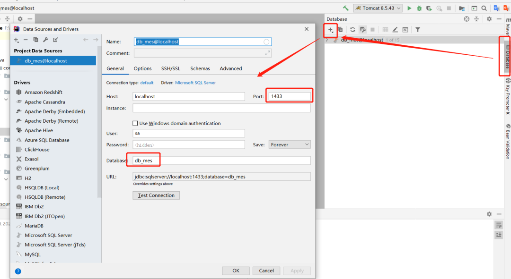
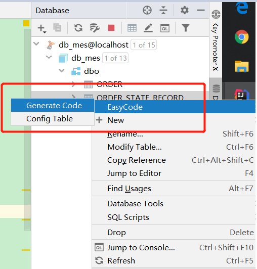

# IDEA


# 安装

* 安装完成后不要第一时间打开,配置idea.properties,将源文件地址和缓存地址修改成其他盘


# Appearace->System Settings


## Updates


* Check IDE updates for:不勾选,关闭检查IDEA更新
* Check for plugin updates:不勾选,关闭检查插件更新


# Keymap


## Editor Actions


* Duplicate Line or Selection:删除快捷键,这个快捷键是只复制选中的内容
* Duplicate Enter Lines:添加快捷键,只要在光标在当前行,就可以直接复制整行


## Main menu


* Refactor->Rename:添加快捷键F2
* Code->Code Completion:移除Ctrl+空格,添加ALT+/
* File->New:添加快捷键为CTRL+N
* Navigate->Implementation(s):修改为CTRL+鼠标左键


## Other


* Show Intention Actions/Show Context Actions:去掉Alt+Enter,改为CTRL+1


# Editor->General


* Change font size(Zoom) with Ctrl+Mouse Wheel:鼠标滚轮控制字体大小
* Remove trailing blank lines at the end of saved files:删除文件末尾空白
* Editor Tabs:Mark modifyied tabs with asterisk勾选,被修改的文件会以*号标识出来


## Auto Import


### Java

* Add unambigous...,Optimize imports...:勾选,自动导包,快捷键ALT+ENTER


## Appearance


* Show hard wrap guide(configured in Code Style options):不勾选,去掉中间的白线
* Show line numbers:勾选,显示行号


## Code Completion


* Code Completion:取消勾选Match case,自动提示忽略大小写


## Editor Tabs


* show tabs in one row:不勾选


## Postfix Completion


* serr->syse
* souf->sysof
* sout->syso
* soutv->sysov


# Editor->Code Editing


* Show quick documentation on mouse move:勾选,鼠标滑过显示文档
* Tooltip delay:设置提示出现的延迟时间


# Editor->Color Scheme


## General

* Code
  * Identifier under caret:修改选中字符其他相同字符的背景色
    * Background->FFBE4C
    * Error stripe mark->BAA8FF
  * Identifier under caret(write):
    * Background->FFBE4C
    * Error stripe mark->F0ADF0
  * Line number:修改行号颜色,可选000000
* Editor
  * Selection background:修改选中字符属性背景颜色->FFBE4C
* Search Results
  * Search result:修改搜索选中字符的背景色
    * Background->FFBE4C
    * Error stripe mark->BAA8FF
  * Search result(write):修改搜索选中字符的背景色
    * Background->FFBE4C
    * Error stripe mark->BAA8FF


## Language Defaults

* Comments
  * Block comment:Foreground->C87737,调整注释字体颜色
  * Doc Comment
    * Tag:Effects->C87737
    * Text:Foreground->C87737
  * Line comment:Foreground->C87737


## Console Font


* Use console font instead of the default:可勾选,使用不用于通用字体的其他字体


# Editor->Code Style


* General->Line separator:选择使用哪种换行符


## Java


### Tabs and Indents


* Use tab character,Smart tabs:使用制表符代替空格进行格式化


### Spaces

* Before Left Brace
  * Array initializer left brace:勾选
* Within
  * Array initializer braces:勾选


### Wrappging and Braces


* Hard wrap at:每行最大宽度
* Keep when reformatting
  * Line breaks:不勾选,默认有换行时,格式化不回到上一行
  * Comment at first column:不勾选
  * Control statement...:不勾选
* Ensure right margin is not exceeded:格式化时每行字符不能超过最大宽度
* Extends/Implements list:选择Wrap if long
* Extends/Implements keyword:选择Wrap if long
* Throws list:选择Wrap if long
* Throws keyword:选择Wrap if long
* Method declaration parameters:选择Wrap if long

  * Align when multiline:不勾选,多行时不对齐
* Method call arguments:选择Wrap if long
* Chained method calls:选择Wrap if long
* if() statement
  * Force braces:选择Always
* switch statement:
  * Indent case branches:不勾选
* try-with-resources:选择Wrap if long
  * Align when multiline:不勾选
* Binary expressions:选择Wrap if long
  * Operation sign on next line:勾选
* Assignment statement:选择Wrap if long
  * Assignment sign on next line:不勾选
* Ternary operation:选择Wrap if long
  * ? and : signs on next line:勾选
* Enum constants:选择Wrap always
* Annotation Parameters:Wrap if long


### Blank Lines

* Minimum blank lines
  * Before package statement:0
  * After package statement:1
  * Before imports:1
  * After imports:1
  * Around class:1
  * After class header:1
  * Before class end:0
  * After anonymous class header:1
  * Around field in interface:1
  * Around field:1
  * Around method in interface:1
  * Around method:1
  * Before method body:0
  * Around initializer:1


### JavaDoc

* Alignment
  * Align parameter description:不勾选
  * Align thrown exception descriptions:不勾选
* Blank lines
  * After description:勾选
* Invalid tags
  * Keep invalid tags:勾选,不会情况不可用标签
  * Keep empty @Param tags:不勾选,删除未解释的参数
  * Keep empty @Return tags:不勾选,删除未解释的返回
  * Keep empty @throws tags:不勾选,删除未解释的异常
* Other
  * Generate "<p>" on empty lines:取消勾选
  * Do not wrap one line comments:勾选


### Imports


* Use fully qualifies class names in JavaDoc:在注释中使用类的模式,选择Never,use short name...

* Class count to use import with `*`:导入类超过多少时使用`*`,值设大一点就不会显示`*`
* Names count to use static import with `*`:同上,只不过时静态导入


### Code Generation


#### Comment Code:


* Line comment at first column:不勾选,让//注释紧贴代码


## HTML


### Tabs and Indents


* Use tab character,Smart tabs:使用制表符代替空格进行格式化,勾选


## XML


### Tabs and Indents


* Use tab character,Smart tabs:使用制表符代替空格进行格式化,勾选


# Editor->Inspections


## General


* Duplicated code fragment:改为黄色警告,重复代码提醒


## Java


### Class structure

* parameter/field can be local:不勾选,将不会提示变量声明成local,不同版本第一个关键字不一样


### Declarataion redundancy

* Declaration access can be weaker:不勾选,将不会提示方法访问符可变


### Java language level migration aids

* Java 5:
  * Raw use of parameterized class:勾选,将提示缺少泛型
  * Unnecessary boxing:不勾选,不会提示不必要的装箱
  * Unnecessary unboxing:不勾选,不会提示不必要的拆箱


### Serialization issues

* Serializable class without serialVersionUID:勾选,右键菜单生成序列号


## Spring


### Spring Core


#### Code


* Field injection waring:不勾选


### Proofreading


* Typo:不勾选


# Editor->File and Code templates


## Includes


* 新建文件自定义时间

```java
#set($str = "")
#set($stringClass=$str.getClass())
#set($localeClass=$stringClass.forName("java.util.Locale")) 
#set($date=$stringClass.forName("java.util.Date").newInstance())
#set($locale=$localeClass.getConstructor($stringClass).newInstance("en_US"))
#set($dateFormat=$stringClass.forName("java.text.SimpleDateFormat").getConstructor($stringClass, $localeClass).newInstance("yyyy-MM-dd HH:mm:ss", $locale))
#set($fdate=$dateFormat.format($date)) 

/**
 * 
 * @author 飞花梦影
 * @date : ${fdate}
 * @git {@link https://github.com/dreamFlyingFlower }
 */
```


# Editor->File Encodings


* Global Encoding,Project Encoding,Default encoding for properties files:设置编码,都设为UTF-8


# Editor->Live Templates


## iterrations

* iter:修改为foreach


## Java

* serr:修改为syses:输出一个error的String
* serrc:修改为Eclipse快捷键:syse
* souf:修改为sysf,输出一个formatted string
* sout:修改为syss,输出一个String
* soutc:修改为Eclipse快捷键:syso


## 自定义注释时间

* 新建一个变量名dateFormat,不能和系统已经设置好的重名,Abbreviation设置为dateFormat,template text输入{$dateFormat$}
* 点击右边的Edit variables,在弹出框中Name设置为dateFormat,Expression设置为date("自定义的格式,与Java时间格式相同")
* default value不填,skip if defined勾选,在Live Templates和File and code template中可以使用${dateFormat}链接当前自定义的表达式


## 自定义类注释模板

* 新建一个变量名`/**`,Abbreviation设置为`/**`,template text输入如下

  ```java
  /**
   * $END$
   *
   * @author 作者
   * @date $dateFormat$
   * @git 自定义
   */
  ```

* $END$为系统自带,表示鼠标停留的位置

* $dateFormat$需要自定义

  * 点击右边的Edit variables,会自动将dateFormat填入其中
  * Expression改为自己想要的格式,如date("yyyy-MM-dd HH:mm:ss")
  * Default value不填,Skip if defined勾选

* 右边的Expand with选择Tab,Enter已经被系统占用为方法等注释触发条件


# Editor->File Types


## 隐藏文件


* ignore files and folders:添加如下.apt_generated,.apt_generated_test,.mvn,.classpath,.project,.settings,.factorypath,.idea,*.iml,target


# Build->Build Tools


## Maven


* Maven home path:配置Maven目录地址
* User settings file:Maven配置文件地址
* Local repository:本地Maven仓库地址


### Importing


* Automatically download:自动下载资源,可选
* JDK for importer:设置JDK版本


### Runner


* Skip tests:勾选,跳过测试


# Build->Complier


## 自动编译

* Build project automatically,Compile independent modules in parallel:勾选
* 不能对SpringBoot项目进行热部署开发,需要其他配置,且自动编译极慢极耗资源


# File->Project Structure


## Project Settings


### Libraries

* 添加额外的包到项目中


# 双击SHIFT设置


## 显示内存使用

* show Memory indicator:设置为on


## Spring项目自动编译

* 需要先启用devtools依赖
* 运行一次项目后,修改configerations,勾选spring boot->running application update policies
  * on update action:选择update classes and resources
  * on frame deactivetion:选择update classes and resources
* File->Settings->Build...->Compiler:勾选Build project automatically
* 双击SHITF,搜索Registry,选择Registry...,勾选:compiler.automake.allow.when.app.running


# Plugins


## Adapter Eclipse Code Formatter


* 让IDEA使用Eclipse的格式化
* 打开File->Settings->Other Settings->Eclipse Code Formatter
* Use the Eclipse Code Formatter:勾选
* Eclipse Java Formatter config file:选择从Eclipse导出来的格式化文件,OK
* Import order的From File也为Eclipse用的code-style.xml文件
* 格式化时,若是出错会输出提示到Event Log里,若是看到`xxx formatted sucessfully by Eclipse code formatter`则表示格式化成功


## Background Image Plus +


* 更换IDEA背景


## Jclasslib


* 查看class的字节码文件
* view->show bytecode with jclasslib


## code iris


* 显示整个工程所有类关系图


## Save Actions


* 代码格式化插件.可以优化包导入,自动给没有修改的变量添加final修饰符,调用方法的时候自动添加this关键字等


## Translation


* 翻译插件


## HighlightBracketPair


* 括号开始结尾高亮显示


## Rainbow Brackets


* 彩虹括号


## Stack trace to UML


* 根据JVM异常堆栈画UML时序图和通信图
* Analyze -> Open Stack trace to UML plugin + Generate UML diagrams from stacktrace from debug


## Xcode-Dark Theme


* 该主题可适用于蓝色背景


## GsonFormat


* 将Json字符串转为实体类


## Search In Repository


* 搜索maven/gradle的第三方坐标地址


## SequenceDiagram


* 调用链路自动生成时序图,右键->Sequence Diagaram 即可调出


## Easy_Javadoc


* 快速给Java中的类,属性,方法生成注释,会根据英文命名自动生成中文注释,快捷键`CTRL+\`.也可以批量生成注释,快捷键`CTRL+SHIFT+\`
* 在Other Settings中自定义注释模板


## Easy Code


* 快速生成entity,dao,service,controller






## Lombok


* Lombok插件


## RestfulTool


* 维护项目中所有请求以及对应的类,主要是Controller中的值,快捷键`CTRL+ALT+N`
* IDEA右侧会出现一栏RestServices,这里有整个项目的http请求,可以简单的进行测试


## CamelCase


* 驼峰,下划线相互转换,默认快捷键`ALT+SHIFT+U`
* File->Editor->Camel Case可设置相关配置


## String Manipulation


* 字符串转换工具,可以进行驼峰,蛇形相互转换,快捷键`ALT+M`,功能比CamelCase更丰富
* File->Settings->Other Settings可设置相关配置


## Codota


* 代码提示以及最新的代码样例,需要再Brower for more solutions中搜索,消耗性能


## aiXcoder


* 代码提示,支持相似代码搜索功能


## Java Stream Debugger


* 对Java8的Stream进行Debug


## MyBatisX


* 从dao跳到Mybatis的xml文件
* 没有Eclipse的好用,只能从dao层条,service中不能跳


## MyBatisCodeHelperPro


* 收费
* 可以识别mybatis动态标签,使用mybatis动态标签的sql可以正常提示,检测
* mybatis几乎所有地方的sql都有代码提示,可以写出安全的sql
* 从java类生成建表语句
* 从表上生成增删查改代码,在表上加字段后重新生成不会覆盖自己写的方法
* 使用方法名生成完整的sql,只要一个方法名就可以生成大部分单表操作的sql
* 使用方法名生成mybatisplus QueryWrapper
* resultMap column和property代码提示,检测,支持associaction,collection,columnPrefix
* #{}自动提示,检测
* #{},if test等可重构参数名称
* 最好的ognl支持,if test自动提示检测,bind,foreach等
* 解析select语句中查询的字段,一键从sql生成java类和resultMap
* 从接口方法一键生成testcase,可快速测试sql
* mybatis代码格式化,兼容mybatis的动态标签
* 检测项目配置的mapperscan,识别@Mapper注解,将mybatis的类注入到spring中,注入不再报错
* mybatis sql log支持,从控制台打印出完整的sql,点击直接执行sql
* 最好的泛型支持,接口方法或者参数使用泛型在#{} if test等也可以正常解析
* 支持mybatis简单的注解,代码提示,检测,可以一键把注解sql挪到xml
* 兼容mybatisplus,tkmapper框架,兼容kotlin


## Alibaba Java Coding Guidelines


* 阿里代码规范检测


# Version


## File Status Colors

* 修改Git以及其他类型版本控制工具不同文件的颜色显示


