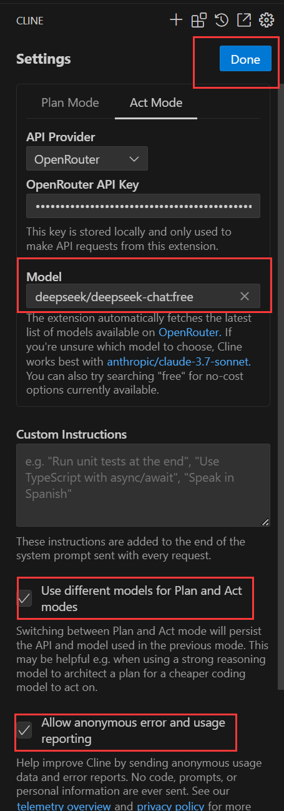

# VSCode


# MCP


* 安装Cline插件,选择使用自己的API key

* API Provider:选择OpenRouter,开源免费,提供免费的DeepSeekV3

* 点击Open Router下的Get OpenRouter API key:会打开浏览器进行登录,没账号的注册即可

* 登录后点击页面上的Authorize即可

* Model:选择DeepSeek...带free字样的,默认为V3版本

* 勾选2个模型,然后点Done

  

* 使用MCP Server之前,电脑上需要安装Nodejs或Python

* 点击+号右边的MCP Servers,添加MCP Server.以Git Tool为例

  * 在模型市场中搜索Git Tool

  * 直接点击安装,会自动生成一个json文件

  * 如果是windows,需要将npx改到下面的`args`中,同时在最上面添加`/c`

    ```json
    # 如果是uvx,不用改
    {
      "mcpServers": {
        "github.com/modelcontextprotocol/servers/tree/main/src/git": {
          "command": "uvx",
          "args": ["mcp-server-git"]
        }
      }
    }
    # 如果是npx,需要修改
    {
      "mcpServers": {
        "github.com/modelcontextprotocol/servers/tree/main/src/git": {
          "command": "cmd",
          "args": ["/c","npx,""mcp-server-git"]
        }
      }
    }
    ```

    

* 常用MCP Server

  * Browser Tools:浏览器插件,读取浏览器数据


# Plugins


## Settings Sync


* 将 VSCode 的设置保存在 GitHub 上,并轻松地将其用于其他计算机
* 已废弃,直接使用左下角的内置同步设置


## Github Copilot


* AI编程,VsCode自带


## BlackBoxAI


* 可免费试用几乎所有AI模型


## Gemini Code Assisst


* Google编程助手,不能直接生成项目,只能编写代码片段,分析代码,分析文件


## Chinese


* 中文插件


## Better Comments


* 一款美化注释的插件,可以根据不同种类的注释,显示不同的颜色,一目了然


## Json2ts


* 自动把 `json` 格式转成 `ts` 的类型,复制 `json` 之后按 `ctrl + alt + v` 即可


## Path Autocomplete


* 文件路径自动完成


## Path Intellisense


* 自动补全代码中的路径和文件名


## Debugger for chrome


* 允许在 VSCode 中调试 JS 代码,可以设置断点,逐步执行代码,调试动态添加的脚本等


## Npm Intellisense


* npm 安装包之后,在 require 时提供该插件可以获得智能提示,import 语句中自动填充 npm 模块


## Auto Import


* 可以自动找到、解析所有可用的导入,并提供代码操作和完成


## Partial Diff


* 文件比较
* 先复制要比较的内容,然后选中要比较的另外的一部分内容,右键选择`Compare Text with Clipboard`,就会打开一个比较窗口


## Import Cost


* 显示依赖的大小


## Path-alias


* 在导入组件的时候,使用别名路径没用提示时 (可和别名路径跳转同时使用, 无冲突)


## Template String Converter


* 在字符串中输入$触发,将字符串转换为模板字符串,即将双引号转为`


## Parameter Hints


* 提示函数的参数类型及消息


## Project Manager


* 项目管理


## ES6 JS sinppets


* ES6代码片段


## Any-Rule


* 正则表达式检测


## PostCode


* 在VSCode中使用PostMan


## 美化


### Color Highlight


* 用于给代码中的颜色进行高亮展示


### Bracket Pair Colorizer


* 可以用不同颜色区分出代码中的括号,对于括号很多的代码非常实用,还支持自定义括号颜色


### VSCode-Icons


* 文件图片插件,可以为不同类型的文件赋予不同的图标
* 使用:文件 -> 首选项 -> 文件图标主题 -> VSCode-Icons


### Image preview


* 预览代码中图片的引用,鼠标移上去就会有小窗展示图片


### Svg Preview


* 显示SVG图片


### Indenticator


* 当点击一个缩进部分的时候,会出现一条白线来告诉你当前处于的缩进层级


### Trailing Spaces


* 把尾随空格显示出来


### AZ AL Dev Tools/AL Code Outline


* 用来梳理代码结构的插件,安装完后在文件图标里就会多出一个 `AL OUTLINE` 的选项


### Beautify


* 格式化插件


### Prettier


* 格式化插件


### Better Align


* 代码优雅排版,在`CTRL+SHIFT+P`中输入Align即可


### Better Comments


* 让注释变得更加清晰的插件,可以方便的为不同注释做分类,也支持自定义分类,非常有助于在注释中记录和查看不同级别的信息


### Moonlight Theme


* 带有月光背景的泡泡糖色 VS Code 主题


### Todo Tree


* 按文件目录结构树,显示其中的TODO内容
* 支持将其他的tag也识别成TODOs,比如`todo-tree.general.tags (["TODO","FIXME","BUG"])`


### TODO Highlight


* 高亮显示代码中的 TODO、FIXME 及其他注解


## Git


### Git History


* 右键单击文件选择 `Git:View File History` 来以列表的形式查看所有的提交记录


### GitLens — Git supercharged


* 功能`Git History`要强大一些,可以看到Git相关信息,展示更丰富


### Git Graph


* 查看存储库的 Git Graph 并从图中执行简单的 Git 操作


## 代码提示


### CodeGeeX


* AI智能生成代码.可以实现代码的生成与补全,自动为代码添加注释,不同编程语言的代码间实现互译,针对技术和代码问题的智能问答,代码解释,生成单元测试,实现代码审查,修复代码bug等非常丰富的功能


### Fitten Code


* 大模型智能编程助手


### TONGYI Lingma


* 通义灵码,阿里出品,提供`行级/函数级实时续写`、`自然语言生成代码`、`单元测试生成`、`代码优化`、`注释生成`、`代码解释`、`研发智能问答`、`异常报错排查`等能力,并针对阿里云的云服务使用场景调优


### Tabnine


* 自动提示插件


### IntelliCode


* 智能代码建议


## CSS


### CSS Peek


* 允许在 HTML 中选择某个 class 或者 id 名称时使用`Ctrl+鼠标左键`可以直接定位到该名称的CSS的位置


### Live SASS Compiler


* 将 SASS 或 SCSS 文件实时编译或转译为 CSS 文件


## 代码检查


### JavaScript Booster


* 通过分析代码及其上下文自动建议快速操作以重构或增强代码,支持来自重构条件,声明,函数,TypeScript,promise,JSX 等的多种代码操作


### Error Gutters


* 报错的地方都有大红波浪线提示


### Error Lens


* 把代码检查(错误、警告、语法问题)进行突出显示的插件


## HTML


### Highlight Matching Tag


* 一个找标签对象的插件,当点击一下 `html` 标签,配对的标签就会出现下划线进行匹配


### Auto Close Tag


* 自动补全HTML结束标签


### Auto Rename Tag


* 自动修改标签名,重命名一个开始标签时,自动重命名配对的结束标签


### HTML Snippets


* HTML代码片段,可提供html标签的代码提示


## Vue


### Vetur


* Vue 开发必备插件,它为 Vue.js 提供了实用的工具,例如调试、错误检查、语法高亮、片段等


### Vue-component


* 输入组件名称自动导入找到的组件,自动导入路径和组件


### Vue 3 Snippets


* Vue3代码片段
