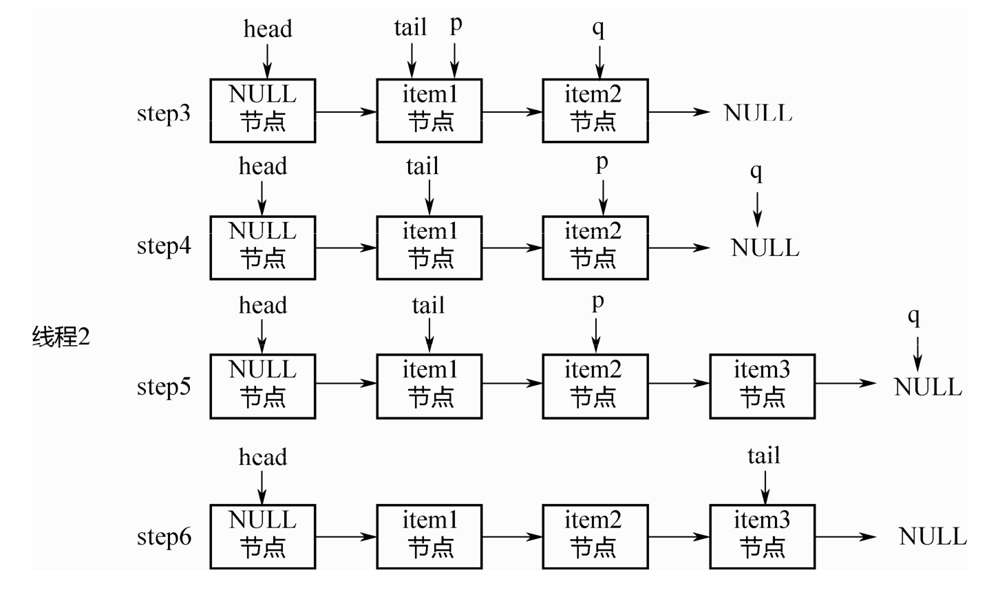

# Concurrent


# Striped64


* java.util.concurrent.atomic.Striped64:抽象类


```java
// 累加单元数组,懒加载
transient volatile Cell[] cells;
// 基础值,如果没有竞争,则用cas累加这个域
transient volatile long base;
// 在cells创建或扩容时置为1,表示加锁
transient volatile int cellsBusy;
```


## Cell


* java.util.concurrent.atomic.Striped64.Cell:Striped64内部类,用来分段操作


```java
// Contended:该注解用来防止缓存行的伪共享行为
@sun.misc.Contended static final class Cell {
    volatile long value;
    Cell(long x) { value = x; }
    final boolean cas(long cmp, long val) {
        // 用CAS方式进行累加,cmp表示旧值,val表示新值
        return UNSAFE.compareAndSwapLong(this, valueOffset, cmp, val);
    }

    // Unsafe mechanics
    private static final sun.misc.Unsafe UNSAFE;
    private static final long valueOffset;
    static {
        try {
            UNSAFE = sun.misc.Unsafe.getUnsafe();
            Class<?> ak = Cell.class;
            valueOffset = UNSAFE.objectFieldOffset(ak.getDeclaredField("value"));
        } catch (Exception e) {
            throw new Error(e);
        }
    }
}
```


* 因为Cell是数组,在内存中是连续存储的,一个Cell为24字节(16字节的对象头和 8 字节的 value),因此一个缓存行可以存下 2 个 Cell,这样存的问题是:无论那个CPU缓存中的值修改成功,都会导致另外Core的缓存行失效,降低了效率


* @sun.misc.Contended注解用来解决这个问题,使用此注解的对象或字段会在前后各增加 128 字节大小的padding,从而让 CPU 将对象预读至缓存时占用不同的缓存行,这样,不会造成其他CPU核心缓存行的失效


## LongAdder


* java.util.concurrent.atomic.LongAdder:线程安全类,主要做高并发下的数字运算,效率比AtomicLong高
* `add()`:


```java
public void add(long x) {
    // as 为累加单元数组,b 为基础值, x 为累加值
    Cell[] as; long b, v; int m; Cell a;
    // 1. as 有值, 表示已经发生过竞争, 进入 if
    // 2. cas 给 base 累加时失败了, 表示 base 发生了竞争, 进入 if
    if ((as = cells) != null || !casBase(b = base, b + x)) {
        // uncontended 表示 cell 没有竞争
        boolean uncontended = true;
        if (
            // as 还没有创建
            as == null || (m = as.length - 1) < 0 ||
            // 当前线程对应的 cell 还没有
            (a = as[getProbe() & m]) == null ||
            // cas 给当前线程的 cell 累加失败 uncontended=false ( a 为当前线程的 cell )
            !(uncontended = a.cas(v = a.value, v + x)))
            // 进入 cell 数组创建、cell 创建的流程
            longAccumulate(x, null, uncontended);
    }
}
```


* `longAccumulate()`:


```java
final void longAccumulate(long x, LongBinaryOperator fn,
                          boolean wasUncontended) {
    int h;
    // 当前线程还没有对应的 cell, 需要随机生成一个 h 值用来将当前线程绑定到 cell
    if ((h = getProbe()) == 0) {
        // 初始化 probe
        ThreadLocalRandom.current();
        // h 对应新的 probe 值, 用来对应 cell
        h = getProbe();
        wasUncontended = true;
    }
    // collide 为 true 表示需要扩容
    boolean collide = false;
    for (;;) {
        Cell[] as; Cell a; int n; long v;
        // 已经有了 cells
        if ((as = cells) != null && (n = as.length) > 0) {
            // 还没有 cell
            if ((a = as[(n - 1) & h]) == null) {
                // 为 cellsBusy 加锁, 创建 cell, cell 的初始累加值为 x,成功则 break, 否则继续 continue 循环
                // ......省略代码
            }
            // 有竞争, 改变线程对应的 cell 来重试 cas
            else if (!wasUncontended)
                wasUncontended = true;
            // cas 尝试累加, fn 配合 LongAccumulator 不为 null, 配合 LongAdder 为 null
            else if (a.cas(v = a.value, ((fn == null) ? v + x : fn.applyAsLong(v, x))))
                break;
            // 如果 cells 长度已经超过了最大长度, 或者已经扩容, 改变线程对应的 cell 来重试 cas
            else if (n >= NCPU || cells != as)
                collide = false;
            // 确保 collide 为 false 进入此分支, 就不会进入下面的 else if 进行扩容了
            else if (!collide)
                collide = true;
            // 加锁
            else if (cellsBusy == 0 && casCellsBusy()) {
                // ......省略代码
                // 加锁成功, 扩容
                continue;
            }
            // 改变线程对应的 cell
            h = advanceProbe(h);
        }
        // 还没有 cells, 尝试给 cellsBusy 加锁
        else if (cellsBusy == 0 && cells == as && casCellsBusy()) {
            // 加锁成功, 初始化 cells, 最开始长度为 2, 并填充一个 cell;成功则 break;
            // ......省略代码
        }
        // 上两种情况失败, 尝试给 base 累加
        else if (casBase(v = base, ((fn == null) ? v + x : fn.applyAsLong(v, x))))
            break;
    }
}
```


# Unsafe


* Unsafe 对象提供了非常底层的,操作内存、线程的方法,Unsafe 对象不能直接调用,只能通过反射获得


# defensive copy


* 保护性拷贝,通过创建副本对象来避免共享的手段,如String,底层是创建新的String对象,同时char[]数组也会重新复制一份
* 在JDK8以后,String的底层是byte[],而不是char[]


# Final


* 在编译后的字节码中,final变量的赋值也会通过putfield指令来完成,同样在这条指令之后会加入写屏障,保证其他线程在读到该变量的时候不会出现为0(初始化未赋值)的情况
* 获取final变量的值,是直接复制原值给其他变量或直接输出;若是非final变量,需要从堆中重新获取


# ThreadPoolExecutor


* ThreadPoolExecutor 使用 int 的高 3 位来表示线程池状态,低 29 位表示线程数量

| 状态名     | 高3位 | 接收新任务 | 处理阻塞任务队列 | 说明                                    |
| ---------- | ----- | ---------- | ---------------- | --------------------------------------- |
| RUNNING    | 111   | Y          | Y                |                                         |
| SHUTDOWN   | 000   | N          | Y                | 不会接收新任务,但会处理阻塞队列剩余任务 |
| STOP       | 001   | N          | N                | 会中断正在执行的任务,并抛弃阻塞队列任务 |
| TIDYING    | 010   | -          | -                | 任务全执行完毕,活动线程为 0 即将进入    |
| TERMINATED | 011   | -          | -                | 终结状态                                |

* 从数字上比较,TERMINATED > TIDYING > STOP > SHUTDOWN > RUNNING
* 这些信息存储在一个原子变量 ctl 中,目的是将线程池状态与线程个数合二为一,这样就可以用一次 cas 原子操作进行赋值

```java

private void advanceRunState(int targetState) {
    for (;;) {
        int c = ctl.get();
        if (runStateAtLeast(c, targetState) ||
            // c 为旧值,ctlOf 返回结果为新值
            ctl.compareAndSet(c, ctlOf(targetState, workerCountOf(c))))
            break;
    }
}

// rs 为高 3 位代表线程池状态, wc 为低 29 位代表线程个数,ctl 是合并它们
private static int ctlOf(int rs, int wc) { 
    return rs | wc;
}
```


# 并发编程


# 概述


* 并发编程三要素
  * 原子性: 即一个不可再被分割的颗粒,在Java中指的是一个或多个操作要么全部执行成功要么全部执行失败
  * 有序性: 程序执行的顺序按照代码的先后顺序执行(处理器可能会对指令进行重排序)
  * 可见性: 当多个线程访问同一个变量时,如果其中一个线程对其作了修改,其他线程能立即获取到最新的值
* 线程的五大状态
  * 创建状态: 当用 new 操作符创建一个线程的时候
  * 就绪状态: 调用 start 方法,处于就绪状态的线程并不一定马上就会执行 run 方法,还需要等待CPU的调度
  * 运行状态: CPU 开始调度线程,并开始执行 run 方法
  * 阻塞状态: 线程的执行过程中由于一些原因进入阻塞状态比如: 调用sleep()、尝试去得到一个锁等等
  * 死亡状态: run 方法执行完 或者 执行过程中遇到了一个异常
* 悲观锁与乐观锁
  * 悲观锁: 每次操作都会加锁,会造成线程阻塞
  * 乐观锁: 每次操作不加锁而是假设没有冲突而去完成某项操作,如果因为冲突失败就重试,直 到成功为止,不会造成线程阻塞
* 线程之间的协作
  * 线程间的协作有: wait/notify/notifyAll等
* synchronized: 一种同步锁,它修饰的对象有以下几种: 
  * 修饰一个代码块: 被修饰的代码块称为同步语句块,其作用的范围是大括号{}括起来 的代码,作用的对象是调用这个代码块的对象
  * 修饰一个方法: 被修饰的方法称为同步方法,其作用的范围是整个方法,作用的对象是调用这个方法的对象
  * 修饰一个静态的方法: 其作用的范围是整个静态方法,作用的对象是这个类的所有对象
  * 修饰一个类: 其作用的范围是synchronized后面括号括起来的部分,作用主的对象 是这个类的所有对象
* CAS: Compare And Swap,即比较替换,是实现并发应用到的一种技术.操作包含三个操作数—内存位置(V)、预期原值(A)和新值(B).如果内存位置的值与预期原值相匹配,那么处理器会自动将该位置值更新为新值,否则,处理器不做任何操作
  * CAS存在三大问题: ABA问题,循环时间长开销大,以及只能保证一个共享变量的原子操作
* 线程池: 减少线程的创建和销毁来节省资源


# 线程面试问题


* 重排序有哪些分类?如何避免?
* 新的Lock接口相对于synchronized有什么优势?如果让你实现一个高性能缓存,支持并发读取和单一写入,你如何保证数据完整性
* 如何在Java中实现一个阻塞队列
* 写一段死锁代码,说说你在Java中如何解决死锁
* volatile变量和atomic变量有什么不同
* 为什么要用线程池
* 实现Runnable接口和Callable接口的区别
* 执行execute()方法和submit()方法的区别是什么呢
* AQS的实现原理是什么
* java API中哪些类中使用了AQS?
* 多线程&并发设计原理


# JDK源码解析


* 多线程&并发设计原理
  * 并发核心概念
  * 并发的问题
  * JMM内存模型
* JUC
  * 并发容器同步工具类Atomic类
  * Lock与Condition
* 线程池与Future 线程池的实现原理
  * 线程池的类继承体系
* ThreadPoolExecutor
  * Executors工具类ScheduledThreadPool Executor
  * CompletableFuture用法
* ForkJoinPool
  * ForkJoinPool用法核心数据结构
  * 工作窃取队列
  * ForkJoinPool状态控制
  * Worker线程的阻塞-唤醒机制任务的提交过程分析
  * 工作窃取算法: 任务的执行过程分析
  * ForkJoinTask的fork/join
  * ForkJoinPool的优雅关闭
* 多线程设计模式
  * Single Threaded Execution模式
  * Immutable模式
  * Guarded Suspension模式
  * Balking模式
  * Producer-Consumer模式Read-Write Lock模式Thread-Per-Message模式Worker Thread模式
  * Future模式


# 多线程

 

## 线程创建的方式


* 继承Thread
* 实现Runnable
* 实现Callable


## 线程特征


* Java中的线程共享应用程序中的所有资源,包括内存和打开的文件,快速而简单地共享信息,但是必须使用同步避免数据竞争
* Java中的所有线程都有一个优先级,这个整数值介于`Thread.MIN_PRIORITY(1)`和`Thread.MAX_PRIORITY(10)`之间,默认优先级是`Thread.NORM_PRIORITY(5)`
* 通常较高优先级的线程将在较低优先级的钱程之前执行,但是并不绝对
* 可以创建两种线程: 守护线程和非守护线程,区别在于它们如何影响程序的结束


## 程序结束执行


* 程序执行Runtime类的exit()方法, 而且用户有权执行该方法
* 应用程序的所有非守护线程均已结束执行,无论是否有**正在运行的守护线程**
* 守护线程通常用在作为垃圾收集器或缓存管理器的应用程序中,执行辅助任务.在线程start之前调用`isDaemon()`检查线程是否为守护线程,也可以使用`setDaemon()`将某个线程设置为守护线程


## 线程状态


* Thread.States类中定义线程的状态如下: 
  * NEW: Thread对象已经创建,但是还没有开始执行,即只是new出来,还没有调用`start()`
  * RUNNABLE: Thread对象正在Java虚拟机中运行
  * BLOCKED: Thread对象正在阻塞,一般锁都会造成阻塞
  * WAITING: Thread 对象正在等待另一个线程的动作,如wait()
  * TIME_WAITING: Thread对象正在等待另一个线程的操作,但是有时间限制.如sleep(),wait(1)
  * TERMINATED: Thread对象已经完成了执行
* `getState()`获取Thread对象的状态,可以直接更改线程的状态
* 在给定时间内,线程只能处于一个状态,这些状态是JVM使用的状态,不能映射到操作系统的线程状态


## 线程状态变化


* 初始线程处于NEW状态,此时只是new,还没有调用start()
* 调用start()开始执行后,进入RUNNING或者READY状态
* 如果没有调用任何的阻塞函数,线程只会在RUNNING和READY之间切换,也就是系统的时间片调度.这两种状态的切换是操作系统完成的,除非手动调用yield()函数,放弃对CPU的占用
* 一旦调用了图中的任何阻塞函数,线程就会进入WAITING或者TIMED_WAITING状态,两者的区别只是前者为无限期阻塞,后者则传入了一个时间参数.如果使用了synchronized 或 锁,则会进入BLOCKED状态
* LockSupport.park()/unpark(): 不太常见的阻塞/唤醒函数,Concurrent包中Lock的实现即依赖这一对操作原语


## synchronized


### 锁的对象


* 实例方法的锁加在对象实例上,静态方法的锁加在类字节码上


### 锁的本质


* 如果一份资源需要多个线程同时访问,需要给该资源加锁.加锁之后,可以保证同一时间只能有一个线程访问该资源
* 资源可以是一个变量、一个对象或一个文件等
* 锁是一个对象,作用如下: 
  * 这个对象内部得有一个标志位(state变量),记录自己有没有被某个线程占用.最简单的情况是这个state有0、1两个取值,0表示没有线程占用锁,1表示有某个线程占用锁
  * 如果这个对象被某个线程占用,记录这个线程的thread ID
  * 这个对象维护一个thread id list,记录其他所有阻塞的、等待获取这个锁的线程.在当前线程释放锁之后从这个thread id list里取一个线程唤醒


### 实现原理


* 在对象头里,有一块数据叫Mark Word.在64位机器上,Mark Word是8字节(64位)的,这64位中有2个重要字段: 锁标志位和占用该锁的thread ID.因为不同版本的JVM实现,对象头的数据结构会有各种差异


## wait与notify


### 生产者−消费者模型


* 一个内存队列,多个生产者线程往队列中放数据;多个消费者线程从队列中取数据.要实现这样一个编程模型,需要做下面几件事情: 
  * 内存队列本身要加锁,才能实现线程安全
  * 阻塞.当内存队列满了,生产者放不进去时,会被阻塞;当内存队列是空的时候,消费者无事可做,会被阻塞
  * 双向通知.消费者被阻塞之后,生产者放入新数据,要notify()消费者;反之,生产者被阻塞之后,消费者消费了数据,要notify()生产者


### 如何阻塞?


* 办法1: 线程自己阻塞自己,也就是生产者、消费者线程各自调用wait()和notify()
* 办法2: 用一个阻塞队列,当取不到或者放不进去数据的时候,入队/出队函数本身就是阻塞的


### 如何双向通知?


* 办法1: wait()与notify()机制
* 办法2: Condition机制


### wait()必须释放锁


* 当线程A进入synchronized(obj1)后,也就是对obj1上了锁.此时,调用wait()进入阻塞状态,一直不能退出synchronized代码块,线程B就永远无法进入synchronized(obj1)里,永远没有机会调用notify(),发生死锁
* 在wait()的内部,会先释放锁obj1,然后进入阻塞状态,之后,它被另外一个线程用notify()唤醒,重新获取锁.其次,wait()调用完成后,执行后面的业务逻辑代码,然后退出synchronized同步块,再次释放锁,如此则可以避免死锁


## 轻量级与重量级阻塞


* 能够被中断的阻塞称为轻量级阻塞,对应的线程状态是WAITING或者TIMED_WAITING;而像synchronized 这种不能被中断的阻塞称为重量级阻塞,对应的状态是 BLOCKED


## 线程的优雅关闭


* 运行到一半的线程不能强制关闭,如果强制杀死线程,则线程中所使用的资源,例如文件描述符、网络连接等无法正常关闭
* 一个线程一旦运行起来,不要强行关闭,合理的做法是让其运行完(方法执行完毕),干净地释放掉所有资源,然后退出
* 如果是一个不断循环运行的线程,就需要用到线程间的通信机制,让主线程通知其退出


# 并发


## 同步


* 在并发中,可以将同步定义为一种协调两个或更多任务以获得预期结果的机制.同步的方式有 两种: 
  * 控制同步: 例如,当一个任务的开始依赖于另一个任务的结束时,第二个任务不能再第一个任务完成之前开始
  * 数据访问同步: 当两个或更多任务访问共享变量时,再任意时间里,只有一个任务可以访问该变量
* 与同步密切相关的一个概念是临界段.临界段是一段代码,由于它可以访问共享资源,因此在任何给定时间内,只能被一个任务执行.**互斥**是用来保证这一要求的机制,而且可以采用不同的方式来实现
* 如果算法有着粗粒度(低互通信的大型任务),同步方面的开销就会较低,也许程序不会用到系统所有的核心;如果算法有着细粒度(高互通信的小型任务),同步方面的开销就会很高,而且该算法的吞吐量可能不会很好
* 并发系统中有不同的同步机制,从理论角度看,最流行的机制如下: 
  * 信号量(semaphore): 一种用于控制对一个或多个单位资源进行访问的机制.它有一个用于存放可用资源数量的变量,而且可以采用两种原子操作来管理该变量.**互斥**(mutex, mutual exclusion的简写形式)是一种特殊类型的信号量,它只能取两个值(即**资源空闲**和**资源忙**),而且只有将互斥设置为**忙**的那个进程才可以释放它.互斥可以通过保护临界段来帮助程序避免出现竞争条件
  * 监视器: 一种在共享资源上实现互斥的机制.它有一个互斥、一个条件变量、两种操作(等待条件和通报条件).一旦通报了该条件,在等待它的任务中只有一个会继续执行


## 并发的问题


### 数据竞争


* 如果有多个任务在临界段之外对一个共享变量进行写入操作,没有使用任何同步机制,那么应用程序可能存在**数据竞争**(也叫做**竞争条件**)
* 在这些情况下,应用程序的最终结果可能取决于任务的执行顺序


### 死锁


* 当多个任务正在等待必须由另一线程释放的某个共享资源,而该线程又正在等待必须由前述任务之一释放的另一共享资源时,并发应用程序就出现了死锁.当系统中同时出现如下四种条件 时,就会导致这种情形
  * 互斥: 死锁中涉及的资源必须是不可共享的,一次只有一个任务可以使用该资源
  * 占有并等待条件:  一个任务在占有某一互斥的资源时又请求另一互斥的资源,当它在等待时,不会释放任何资源
  * 不可剥夺: 资源只能被那些持有它们的任务释放
  * 循环等待: 任务1正等待任务2所占有的资源,而任务2又正在等待任务3所占有的资源,以此类推,这样就出现了循环等待
* 避免死锁
  * 检测: 系统中有一项专门分析系统状态的任务,可以检测是否发生了死锁.如果它检测到了死锁,可以采取一些措施来修复该问题
  * 预防: 如果想防止系统出现死锁,就必须预防上述死锁条件中的一条或多条出现
  * 规避: 如果可以在某一任务执行之前得到该任务所使用资源的相关信息,那么死锁是可以规避的


### 活锁


* 如果有两个任务总是因对方的行为而改变自己的状态,那么就出现了活锁,最终结果是它们陷入了状态变更的循环而无法继续向下执行
* 例如,任务1和任务2都需要用到资源1和资源2,假设任务1对资源1加了一个锁,而任务2对资源2加了一个锁,当它们无法访问所需的资源时,就会释放自己的资源并且重新开始循环.这种情况可以无限地持续下去,所以这两个任务都不会结束自己的执行过程


### 资源不足


* 当某个任务在系统中无法获取维持其继续执行所需的资源时,就会出现资源不足.当有多个任务在等待某一资源且该资源被释放时,系统需要选择下一个可以使用该资源的任务,如果系统中没有设计良好的算法,那么系统中有些线程很可能要为获取该资源而等待很长时间
* 要解决这一问题就要确保公平原则.所有等待某一资源的任务必须在某一给定时间之内占有该资源,可选方案之一就是实现一个算法,在选择下一个将占有某一资源的任务时,对任务已等待该资源的时间因素加以考虑.然而,实现锁的公平需要增加额外的开销,这可能会降低程序的吞吐量


# JMM内存模型


* JMM是一套规范,在多线程中,即要让编译器和CPU可以灵活地重排序;又要明确告知开发者不需要感知什么样的重排序,需要感知什么样的重排序.开发者根据需要决定重排序对程序是否有影响,如果有,就需要显示地通过volatile、synchronized等线程同步机制来禁止重排序


## CPU缓存


* 每个CPU内核都有自己的寄存器,寄存器之上是L1(一级缓存),L2,L3以及内存.L3和内存是多核CPU共享
* CPU读数据时先从寄存器读,找不到再到L1,再到L2,依次类推
* CPU从寄存器读数据的时间大概是1cycle(4GHZ的CPU约为0.25ns(纳秒))
* 从L1读数据的时间为3-4cycle,L2为10-20cycle,L3为40-45cycle,内存为120-240cycle
* 因为CPU与内存的速度差异很大,需要靠预读数据至缓存来提升效率.
* 而缓存以缓存行为单位,每个缓存行对应着一块内存,一般是64byte (8个long)
* 缓存的加入会造成数据副本的产生,即同一份数据会缓存在不同核心的缓存行中CPU,要保证数据的一致性,如果某个 CPU 核心更改了数据,其它CPU 核心对应的整个缓存行必须失效


## 缓存一致性


* 因为存在CPU缓存一致性协议,例如MESI,多个CPU核心之间缓存不会出现不同步的问题,不会有内存可见性问题
* 缓存一致性协议对性能有很大损耗,为解决这个问题,又进行了各种优化.例如,在计算单元和L1之间加了Store Buffer,Load Buffer以及其他其他各种Buffer
  * Store Buffer: 写变量
  * Load Buffer: 读变量

* L1、L2、L3和主内存之间是同步的,有缓存一致性协议的保证,但是Store Buffer,Load Buffer和L1之间却是异步的,向内存中写入一个变量,这个变量会保存在Store Buffer里面,稍后才异步写入L1中,同时同步写入主内存中
* 多CPU,每个CPU多核,每个核上面可能还有多个硬件线程,对于操作系统来讲,就相当于一个个的逻辑CPU,每个逻辑CPU都有自己的缓存,这些缓存和主内存之间不是完全同步的.对应到Java里,就是JVM抽象内存模型:


## 内存可见性


* CPU缓存与主存之间数据共享导致了内存可见性问题


## JMM与happen-before


### 重排序


* Store Buffer的延迟写入(异步写入)是重排序的一种,称为内存重排序(Memory Ordering),即其他核心从L1读数据的时候,写入数据的核心还没有将数据写入到L1中,导致其他核心读取数据不是最新
* 除了内存重排序,还有编译器和CPU的指令重排序
  * 编译器重排序.对于没有先后依赖关系的语句,编译器可以重新调整语句的执行顺序
  * CPU指令重排序:在指令级别,让没有依赖关系的多条指令并行
  * CPU内存重排序: CPU有自己的缓存,指令的执行顺序和写入主内存的顺序不完全一致,是造成内存可见性问题的主因
* 假设X,Y是两个全局变量,初始X,Y=0,线程1和线程2的执行先后顺序是不确定的,最终结果也是不确定的:

```
线程1
X=1
a=Y
线程2: 
Y=1
b=X

1. a=0,b=1
2. a=1,b=0
3. a=1,b=1
```

* 不管谁先谁后,执行结果应该是这三种场景中的一种,但实际可能是a=0,b=0.两个线程的指令都没有重排序,执行顺序也没重排序,仍然出现这种结果的原因是线程1先执行X=1,后执行a=Y,但此时X=1还在自己的Store Buffer里,没有写入主存中,所以线程2看到的X还是0.线程2同理


### 内存屏障


* Memory Barrier.为了禁止编译器和 CPU 重排序,在编译器和 CPU 层面产生的对应指令,这也是JMM和happen-before的底层实现原理
* 编译器的内存屏障,只在编译期告诉编译器不要进行指令重排.当编译完成之后,内存屏障就消失了,CPU并不会感知到编译器中的内存屏障
* CPU的内存屏障是CPU提供的指令,可以由开发者显示调用
* 内存屏障是很底层的概念,一般用 volatile 关键字就足够了.但从JDK 8开始,Unsafe类中提供了三个内存屏障函数

```java
public final class Unsafe {
    // ...
    public native void loadFence();
    public native void storeFence();
    public native void fullFence();
    // ...
}
```

* 在理论层面,可以把基本的CPU内存屏障分成四种: 
  * LoadLoad: 禁止读读重排序
  * StoreStore: 禁止写写重排序
  * LoadStore: 禁止读写重排序
  * StoreLoad: 禁止写读重排序
* Unsafe中的方法: 
  * loadFence=LoadLoad+LoadStore
  * storeFence=StoreStore+LoadStore
  * fullFence=loadFence+storeFence+StoreLoad


### as-if-serial


#### 单线程重排序


* 无论什么语言,站在编译器和CPU的角度,不管怎么重排序,单线程程序的执行结果不能改变,这就是单线程程序的重排序规则.即只要操作之间没有数据依赖性,编译器和CPU都可以任意重排序,因为执行结果不会改变,这也就是as-if-serial语义
* 对于单线程程序来说,即使编译器和CPU做了重排序,也不存在内存可见性问题


#### 多线程重排序


* 多线程之间的数据依赖性太复杂,编译器和CPU不能完全理解这种依赖性并做出优化,只能保证每个线程的as-if-serial语义
* 线程之间的数据依赖和相互影响,需要编译器和CPU的上层告知编译器和CPU在多线程场景下什么时候可以重排序,什么时候不能重排序


### happen-before


* 描述两个操作之间的内存可见性(hb):
  * 如果A happen-before B,意味着A的执行结果必须对B可见,也就是保证跨线程的内存可见性
  * A happen before B不代表A一定在B之前执行.因为多线程程序中,两个操作的执行顺序是不确定的
  * happen-before只确保如果A在B之前执行,则A的执行结果必须对B可见
* 基于happen-before的这种描述方法,JMM对开发者做出了一系列承诺: 

  * 单线程中的每个操作,happen-before 对应该线程中任意后续操作(也就是 as-if-serial语义保证)
  * 对volatile变量的写入,happen-before对应后续对这个变量的读取,即保证先写后读
  * 对synchronized的解锁,happen-before对应后续对这个锁的加锁,即保证先解锁后加锁
* JMM对编译器和CPU来说,volatile 变量不能重排序;非 volatile 变量可以任意重排序


#### 传递性


* 即若A hb B,B hb C,则A hb C

  ```java
  class A {
      private int a = 0;
      private volatile int c = 0;
      public void set() {
          a = 5; // 操作1
          c = 1; // 操作2
      }
      public int get() {
          int d = c; // 操作3
          return a; // 操作4
      }
  }
  ```

* 假设线程A先调用了set,设置了a=5;之后线程B调用了get,则返回值一定是a=5

* 操作1和操作2是在同一个线程内存中执行的,操作1 hb 操作2,操作3 hb 操作4

* 而c是volatile变量,对c的写入 hb 对c的读取,所以操作2 hb 操作3

* 利用hb的传递性,就得到: 操作1 hb 操作2 hb 操作3 hb操作4,所以,操作1的结果,一定对操作4可见

  ```java
  class A {
      private int a = 0;
      private int c = 0;
      public synchronized void set() {
          a = 5; // 操作1
          c = 1; // 操作2
      }
      public synchronized int get() {
          return a;
      }
  }
  ```
  
* 假设线程A先调用了set,设置了a=5;之后线程B调用了get,返回值也一定是a=5

* 因为与volatile一样,synchronized同样具有hb语义,展开上面的代码可得到类似于下面的伪代码: 

  ```
  线程A：
  加锁; // 操作1
  a = 5; // 操作2
  c = 1; // 操作3
  解锁; // 操作4
  线程B：
  加锁; // 操作5
  读取a; // 操作6
  解锁; // 操作7
  ```

* 根据synchronized的hb语义,操作4 hb 操作5,再结合传递性,最终就会得到: 操作1 hb 操作2 ...... hb 操作7,所以,a、c都不是volatile变量,但仍然有内存可见性


## volatile


### **64**位写入的原子性(**Half Write**)


* 对于一个long型变量的赋值和取值操作而言,在多线程某些场景下,返回值可能不是并不准确

* 因为JVM的规范并没有要求64位的long或者double的写入是原子的.在32位的机器上,一个64位变量的写入可能被拆分成两个32位的写操作来执行,这样读取的线程就可能读到一半的值,另外一半读取不到.解决办法也很简单,在long前面加上volatile


### 重排序DCL问题


* 单例模式的线程安全的写法不止一种,常用写法为DCL(Double Checking Locking)-双重检查锁定,如下所示: 

```java
public class Singleton {
    private static Singleton instance;
    public static Singleton getInstance() {
        if (instance == null) {
            synchronized(Singleton.class) {
                if (instance == null) {
                    // 此处代码有问题
                    instance = new Singleton();
                }
            }
        }
        return instance;
    }
}
```

* 上述的 `instance = new Singleton();` 代码有问题,其底层会分为三个操作: 
  * 1.分配一块内存
  * 2.在内存上初始化成员变量
  * 3.把instance引用指向内存
* 在这三个操作中,操作2和操作3可能重排序,即先把instance指向内存,再初始化成员变量,因为二者并没有先后的依赖关系.此时,另外一个线程可能拿到一个未完全初始化的对象,这时,直接访问里面的成员变量,就可能出错.这就是典型的构造方法溢出问题
* 为instance变量加上volatile可解决该问题
* volatile的三重功效: 64位写入的原子性、内存可见性和禁止重排序


### 实现原理


* 这里只探讨为了实现volatile关键字的语义的一种参考做法: 
  * 在volatile写操作的前面插入一个StoreStore屏障,保证volatile写操作不会和之前的写操作重排序
  * 在volatile写操作的后面插入一个StoreLoad屏障,保证volatile写操作不会和之后的读操作重排序
  * 在volatile读操作的后面插入一个LoadLoad屏障+LoadStore屏障,保证volatile读操作不会和之后的读操作、写操作重排序
* 具体到x86平台上,其实不会有LoadLoad、LoadStore和StoreStore,只有StoreLoad一种重排序(内存屏障),也就是只需要在volatile写操作后面加上StoreLoad屏障


### volatile增强


* 在之前的旧内存模型中,一个64位`long/double`变量的`读/写`操作可以被拆分为两个32位的`读/写`操作来执行
* 从JSR -133内存模型开始 (即JDK5),仅仅只允许把一个64位`long/double`变量的**写操作拆分**为两个32位的写操作来执行,任意的**读操作**在JSR -133中都**必须具有原子性**(即任意读操作必须要在单个读事务中执行)


## final


### 构造方法溢出


* 详见重排序DCL问题


### final的hb


* final也有相应的hb语义: 
  * 对final域的写(构造方法内部) hb 对final域所在对象的读
  * 对final域所在对象的读 hb 对final域字段的读
* 通过hb语义的限定,保证了final域的赋值,一定在构造方法之前完成,不会出现另外一个线程读取到了对象,但对象里面的变量却还没有初始化的情形,避免出现构造方法溢出的问 题


## happen-before总结


* 单线程中的每个操作,happen-before于该线程中任意后续操作
* 对volatile变量的写,happen-before于后续对这个变量的读
* 对synchronized的解锁,happen-before于后续对这个锁的加锁
* 对final变量的写,happen-before于final域对象的读,happen-before于后续对final变量的读
* 四个基本规则再加上happen-before的传递性,就构成JMM对开发者的整个承诺


# JUC


## 并发容器


### BlockingQueue


* BlockingQueue是一个带阻塞功能的队列,当入队列时,若队列已满,则阻塞调用者;当出队列时,若队列为空,则阻塞调用者


### ArrayBlockingQueue


* 是一个用数组实现的环形队列,在构造方法中,会要求传入数组的容量

```java
public class ArrayBlockingQueue<E> extends AbstractQueue<E> implements BlockingQueue<E>, java.io.Serializable {
    final Object[] items;
    // 队头指针索引
    int takeIndex;
    // 队尾指针索引
    int putIndex;
    int count;
    // 1把锁+2个条件
    final ReentrantLock lock;
    private final Condition notEmpty;
    private final Condition notFull;

    // ....
}
```


### LinkedBlockingQueue


* 基于**单向链表**的阻塞队列,因为队头和队尾是2个指针分开操作的,所以用了2把锁+2个条件,同时有1个AtomicInteger的记录count


### PriorityBlockingQueue


* 队列通常是先进先出的,而PriorityQueue是按照元素的优先级从小到大出队列的.PriorityQueue中的2个元素之间需要可以比较大小,并实现Comparable接口


### DelayQueue


* 延迟队列,是一个按延迟时间从小到大出队的PriorityQueue,放入DelayQueue中的元素,必须实现Delayed接口


### SynchronousQueue


* 本身没有容量,先调put(),线程会阻塞;直到另外一个线程调用了take(),两个线程才同时解锁,反之亦然
* 对于多个线程而言,例如3个线程, 调用3次put(),3个线程都会阻塞;直到另外的线程调用3次take(),6个线程才同时解锁,反之亦然


#### TransferQueue


* TransferQueue是一个基于单向链表而实现的队列,通过head和tail 2个指针记录头部和尾部.初始的时候,head和tail会指向一个空节点
* `TransferQueue#transfer()`

```java
E transfer(E e, boolean timed, long nanos) {
    QNode s = null;
    boolean isData = (e != null);

     // 队列还未初始化,自旋等待
    for (;;) {
        QNode t = tail;
        QNode h = head;
        if (t == null || h == null)
            continue;                      
	// 队列为空或者当前线程和队列中元素为同一种模式
        if (h == t || t.isData == isData) { 
            QNode tn = t.next;
            // 不一致读,重新执行for循环
            if (t != tail)
                continue;
            if (tn != null) {
                advanceTail(t, tn);
                continue;
            }
            if (timed && nanos <= 0)
                return null;
            if (s == null)
                s = new QNode(e, isData);
            if (!t.casNext(null, s))
                continue;
	    // 后移tail指针
            advanceTail(t, s);
            // 进入阻塞状态
            Object x = awaitFulfill(s, e, timed, nanos);
            if (x == s) {
                clean(t, s);
                return null;
            }
	    // 从阻塞中唤醒,确定已经处于队列中的第1个元素
            if (!s.isOffList()) {
                advanceHead(t, s);
                if (x != null)
                    s.item = s;
                s.waiter = null;
            }
            return (x != null) ? (E)x : e;
        } else {
            // 当前线程可以和队列中的第一个元素配对
            // 取队列中第一个元素
            QNode m = h.next;
            // 不一致读,重新for循环
            if (t != tail || m == null || h != head)
                continue;

            Object x = m.item;
            // 已经配对
            if (isData == (x != null) ||
                x == m ||
                // 尝试配对
                !m.casItem(x, e)) {
                // 已经配对,直接对队列
                advanceHead(h, m);
                continue;
            }
	    // 配对成功,出队列
            advanceHead(h, m);
            // 唤醒队列中与第一个元素对应的线程
            LockSupport.unpark(m.waiter);
            return (x != null) ? (E)x : e;
        }
    }
}
```


#### TransferStack


* 一个单向链表,只需要head指针就能 实现入栈和出栈操作
* 链表中的节点有三种状态,REQUEST对应take节点,DATA对应put节点,二者配对之后,会生成一个FULFILLING节点,入栈,然后FULLING节点和被配对的节点一起出栈
* `TransferQueue#transfer()`

```java
E transfer(E e, boolean timed, long nanos) {
    SNode s = null;
    int mode = (e == null) ? REQUEST : DATA;

    for (;;) {
        SNode h = head;
        // 同一种模式
        if (h == null || h.mode == mode) {
            if (timed && nanos <= 0) {
                if (h != null && h.isCancelled())
                    casHead(h, h.next);
                else
                    return null;
            } 
            // 入栈
            else if (casHead(h, s = snode(s, e, h, mode))) {
                // 阻塞等待
                SNode m = awaitFulfill(s, timed, nanos);
                if (m == s) {
                    clean(s);
                    return null;
                }
                if ((h = head) != null && h.next == s)
                    casHead(h, s.next);
                return (E) ((mode == REQUEST) ? m.item : s.item);
            }
        } 
        // 非同一种模式,待匹配
        else if (!isFulfilling(h.mode)) {
            if (h.isCancelled())
                casHead(h, h.next);
            // 生成一个FULFILLING节点,入栈
            else if (casHead(h, s=snode(s, e, h, FULFILLING|mode))) {
                for (;;) {
                    SNode m = s.next;
                    if (m == null) {
                        casHead(s, null);
                        s = null;
                        break;
                    }
                    SNode mn = m.next;
                    if (m.tryMatch(s)) {
                        // 2个节点一处出栈
                        casHead(s, mn);
                        return (E) ((mode == REQUEST) ? m.item : s.item);
                    } else
                        s.casNext(m, mn);
                }
            }
        } 
        // 已经匹配过了,出栈
        else {
            SNode m = h.next;
            if (m == null)
                casHead(h, null);
            else {
                SNode mn = m.next;
                if (m.tryMatch(h))
                    // 配对,一起出栈
                    casHead(h, mn);
                else
                    h.casNext(m, mn);
            }
        }
    }
}
```


### BlockingDeque


* 一个阻塞的双端队列接口,继承了BlockingQueue,同时增加了对应的双端队列操作接口
* 该接口只有一个实现, 就是LinkedBlockingDeque,其核心数据结构是一个双向链表
* 对应的实现原理,和LinkedBlockingQueue基本一样,只是LinkedBlockingQueue是单向链表,而LinkedBlockingDeque是双向链表


### CopyOnWrite


* CopyOnWrite指在写的时候,不是直接写源数据,而是把数据拷贝一份进行修改,再通过悲观锁或者乐观锁的方式写回
* 这样做是为了读的时候不加锁


#### CopyOnWriteArrayList


* 线程安全的ArrayList,有读写数据不一致问题


#### CopyOnWriteArraySet


* 就是用 Array 实现的一个 Set,保证所有元素都不重复,其内部是封装的一个CopyOnWriteArrayList


### ConcurrentLinkedQueue


* 线程安全的LinkedQueue
* 初始化的时候, head 和 tail 都指向一个 null 节点


#### 入队列


```java
    public boolean offer(E e) {
        checkNotNull(e);
        final Node<E> newNode = new Node<E>(e);

        for (Node<E> t = tail, p = t;;) {
            Node<E> q = p.next;
            if (q == null) {
                // 对tail的next指针进行CAS操作而不是对tail指针进行CAS操作
                if (p.casNext(null, newNode)) {
                    if (p != t)
                        // 每入列2个节点,后移一次tail指针,失败也没问题
                        casTail(t, newNode);
                    return true;
                }
            }
            else if (p == q)
                // 已经达到队列尾部
                p = (t != (t = tail)) ? t : head;
            else
                // 后移p指针
                p = (p != t && t != (t = tail)) ? t : q;
        }
    }
```





* 上面的入队其实是每次在队尾追加2个节点时,才移动一次tail节点
* 初始的时候,队列中有1个节点item1,tail指向该节点,假设线程1要入队item2节点:
  * 1:p=tail,q=p.next=NULL
  * 2: 对p的next执行CAS操作,追加item2,成功之后,p=tail.所以上面的casTail方法不会执行,直接返回.此时tail指针没有变化
  * 之后,假设线程2要入队item3节点
  * 3:p=tail,q=p.next
  * 4: q!=NULL,因此不会入队新节点,p,q都后移1位
  * 5: q=NULL,对p的next执行CAS操作,入队item3节点
  * 6: p!=t,满足条件,执行上面的casTail操作,tail后移2个位置,到达队列尾部

* 即使tail指针没有移动,只要对p的next指针成功进行CAS操作,就算成功入队列
* 只有当 p != tail时,才会后移tail指针.即每连续追加2个节点,才后移1次tail指针.即使CAS失败也没关系,可以由下1个线程来移动tail指针


#### 出队列


```java
public E poll() {
    restartFromHead:
    for (;;) {
        for (Node<E> h = head, p = h, q;;) {
            E item = p.item;
	    // 在出队时,没有移动head,而是把item置为null
            if (item != null && p.casItem(item, null)) {
                if (p != h)
                    // 每产生2个NULL节点才将head后移2位
                    updateHead(h, ((q = p.next) != null) ? q : p);
                return item;
            }
            else if ((q = p.next) == null) {
                updateHead(h, p);
                return null;
            }
            else if (p == q)
                continue restartFromHead;
            else
                p = q;
        }
    }
}
```


* 出队列的代码和入队列类似,也有p,q2个指针.假设初始的时候head 指向空节点,队列中有item1、item2、item3 三个节点
  * 1:p=head,q=p.next.p!=q.
  * 2: 后移 p 指针,使得 p=q
  * 3: 出队列.此处并没有直接删除item1节点,只是把该节点的item通过CAS操作置为了NULL
  * 4: p!=head,此时队列中有了2个 NULL 节点,再前移1次head指针,对其执行updateHead 操作
* 出队列的判断并非观察 tail 指针的位置,而是依赖于 head 指针后续的节点是否为NULL这一条件
* 只要对节点的item执行CAS操作,置为NULL成功,则出队列成功.即使head指针没有成功移动,也可以由下1个线程继续完成


#### 队列判空


* 因为head/tail 并不是精确地指向队列头部和尾部,所以不能简单地通过比较 head/tail 指针来判断队列是否为空,而是需要从head指针开始遍历,找第1个不为NULL的节点.如果找到,则队列不为空;如果找不到,则队列为空


### ConcurrentLinkedDeque


* 实现和ConcurrentLinkedQueue相似,双向队列


### ConcurrentHashMap


#### 初始化


```java
private final Node<K,V>[] initTable() {
    Node<K,V>[] tab; int sc;
    while ((tab = table) == null || tab.length == 0) {
        if ((sc = sizeCtl) < 0)
            Thread.yield(); // 自旋等待
        else if (U.compareAndSetInt(this, SIZECTL, sc, -1)) { // 将sizeCtl设置为-1
                try {
                    if ((tab = table) == null || tab.length == 0) {
                        int n = (sc > 0) ? sc : DEFAULT_CAPACITY;
                        @SuppressWarnings("unchecked")
                        Node<K,V>[] nt = (Node<K,V>[])new Node<?,?>[n]; // 初始化
                        table = tab = nt;
                        // sizeCtl不是数组长度,因此初始化成功后,就不再等于数组长度,而是n-(n>>>2)=0.75n,表示下一次扩容的阈值:n-n/4
                        sc = n - (n >>> 2);
                    }
                } finally {
                    sizeCtl = sc; // 设置sizeCtl的值为sc
                }
            break;
        }
    }
    return tab;
}
```


* 如果某个线程成功把 sizeCtl 设为-1,就可以进行初始化,等初始化完成,再把sizeCtl设置回去;其他线程则自旋等待,直到数组不为null时退出
* 因为初始化的工作量很小,所以此处选择的策略是让其他线程一直等待


#### putVal()


```java
final V putVal(K key, V value, boolean onlyIfAbsent) {
    if (key == null || value == null) throw new NullPointerException();
    int hash = spread(key.hashCode());
    int binCount = 0;
    for (Node<K,V>[] tab = table;;) {
        Node<K,V> f; int n, i, fh; K fk; V fv;
        // 分支1: 整个数组初始化
        if (tab == null || (n = tab.length) == 0)
            tab = initTable();
        // 分支2: 第i个元素初始化
        else if ((f = tabAt(tab, i = (n - 1) & hash)) == null) {
            if (casTabAt(tab, i, null, new Node<K,V>(hash, key, value)))
                break;
        }
        // 分支3: 扩容
        else if ((fh = f.hash) == MOVED)
            tab = helpTransfer(tab, f);
        else if (onlyIfAbsent && fh == hash && ((fk = f.key) == key || (fk != null && key.equals(fk))) && (fv = f.val) != null)
            return fv;
        // 分支4:放入元素
        else {
            V oldVal = null;
            // 加锁
            synchronized (f) {
                // 链表
                if (tabAt(tab, i) == f) {
                    if (fh >= 0) {
                        // ......
                    }
                    // 红黑树
                    else if (f instanceof TreeBin) {
                        // ......
                    }
                    else if (f instanceof ReservationNode)
                        throw new IllegalStateException("Recursive update");
                }
            }
            // 如果是链表,上面的binCount会一直累加
            if (binCount != 0) {
                if (binCount >= TREEIFY_THRESHOLD)
                    // 超出阈值,转换为红黑树
                    treeifyBin(tab, i);
                if (oldVal != null)
                    return oldVal;
                break;
            }
        }
    }
    // 总元素个数累加1
    addCount(1L, binCount);
    return null;
}
```


* 分支1:整个数组的初始化
* 分支2:是所在的槽为空,说明该元素是该槽的第一个元素,直接新建一个头节点,然后返回
* 分支3:说明该槽正在进行扩容,帮助其扩容
* 分支4:把元素放入槽内.槽内可能是一个链表,也可能是一棵红黑树,通过头节点的类型可以判断是哪一种.分支包裹在synchronized(f)里,f对应的数组下标位置的头节点,意味着每个数组元素有一把锁,并发度等于数组的长度
* binCount表示链表的元素个数,当这个数目超过TREEIFY_THRESHOLD=8时,把链表转换成红黑树,也就是 treeifyBin(tab,i).但在这个方法内部,不一定需要进行红黑树转换,可能只做扩容操作


#### 扩容


```java
private final void treeifyBin(Node<K,V>[] tab, int index) {
    Node<K,V> b; int n;
    if (tab != null) {
        if ((n = tab.length) < MIN_TREEIFY_CAPACITY)
            // 数组长度小于阈值64,不做红黑树转换,直接扩容
            tryPresize(n << 1);
        else if ((b = tabAt(tab, index)) != null && b.hash >= 0) {
            // 链表转换为红黑树
            synchronized (b) {
                if (tabAt(tab, index) == b) {
                    TreeNode<K,V> hd = null, tl = null;
                    // 遍历链表,初始化红黑树
                    for (Node<K,V> e = b; e != null; e = e.next) {
                        // ......
                    }
                    setTabAt(tab, index, new TreeBin<K,V>(hd));
                }
            }
        }
    }
}
```


* 在 tryPresize(int size)内部调用了一个核心方法 transfer(Node＜K,V＞\[\] tab,Node＜K,V＞\[\] nextTab)


```java
private final void transfer(Node<K,V>[] tab, Node<K,V>[] nextTab) {
    int n = tab.length, stride;
    // 计算步长
    if ((stride = (NCPU > 1) ? (n >>> 3) / NCPU : n) < MIN_TRANSFER_STRIDE)
        stride = MIN_TRANSFER_STRIDE;
    // 初始化新的HashMap
    if (nextTab == null) {
        // .....
        // 初始的transferIndex为旧HashMap的数组长度
        transferIndex = n;
    }
    // ......
    // 此处i为遍历下标,bound为边界.如果成功获取一个任务,则i=nextIndex-1,bound=nextIndex-stride;如果获取不到,则i=0,bound=0
    for (int i = 0, bound = 0;;) {
        Node<K,V> f; int fh;
        // advance表示在从i=transferIndex-1遍历到bound位置的过程中,是否一直继续
        while (advance) {
            int nextIndex, nextBound;
		// 以下是哪个分支中的advance都是false,表示如果三个分支都不执行,才可以一直while循环
		// 目的在于当对transferIndex执行CAS操作不成功时,需要自旋以期获取一个stride的迁移任务
                if (--i >= bound || finishing)
                    // 对数组遍历,通过这里的--i进行.如果成功执行了--i,就不需要继续while循环了,因为advance只能进一步
                    advance = false;
            else if ((nextIndex = transferIndex) <= 0) {
                // transferIndex <= 0,整个HashMap完成
                i = -1;
                advance = false;
            }
            // 对transferIndex执行CAS操作,即为当前线程分配1个stride.CAS操作成功,线程成功获取到一个stride的迁移任务;
            // CAS操作不成功,线程没有抢到任务,会继续执行while循环,自旋
            else if (U.compareAndSetInt(this, TRANSFERINDEX, nextIndex, nextBound = (nextIndex > stride ? nextIndex - stride : 0))) {
                bound = nextBound;
                i = nextIndex - 1;
                advance = false;
            }
        }
        // i越界,整个HashMap遍历完成
        if (i < 0 || i >= n || i + n >= nextn) {
            int sc;
            // finishing表示整个HashMap扩容完成
            if (finishing) {
                // ......
            }
            // ......
        }
        // tab[i]迁移完毕,赋值一个ForwardingNode
        else if ((f = tabAt(tab, i)) == null)
            advance = casTabAt(tab, i, null, fwd);
        // tab[i]的位置已经在迁移过程中
        else if ((fh = f.hash) == MOVED)
            advance = true;
        else {
            // 对tab[i]进行迁移操作，tab[i]可能是一个链表或者红黑树
            synchronized (f) {
                if (tabAt(tab, i) == f) {
                    Node<K,V> ln, hn;
                    // 链表
                    if (fh >= 0) {
                        int runBit = fh & n;
                        Node<K,V> lastRun = f;
                        for (Node<K,V> p = f.next; p != null; p = p.next) {
                            int b = p.hash & n;
                            if (b != runBit) {
                                runBit = b;
                                // 表示lastRun之后的所有元素,hash值都是一样的
                                // 记录下这个最后的位置
                                lastRun = p;
                            }
                        }
                        if (runBit == 0) {
                            // 链表迁移的优化做法
                            ln = lastRun;
                            hn = null;
                        }
                        else {
                            hn = lastRun;
                            ln = null;
                        }
                        // ......
                    }
                    // 红黑树,迁移做法和链表类似
                    else if (f instanceof TreeBin) {
                        //.......
                    }
                }
            }
        }
    }
}
```


* 扩容的基本原理如上图,首先建一个新的HashMap,其数组长度是旧数组长度的2倍,然后把旧元素逐个迁移过来
* 当nextTab=null时,方法最初会对nextTab进行初始化.该方法会被多个线程调用,所以每个线程只是扩容旧的HashMap部分
* 上图为多个线程并行扩容-任务划分示意图:旧数组的长度是N,每个线程扩容一段,一段的长度用变量stride来表示,transferIndex表示了整个数组扩容的进度
* stride的计算公式:在单核模式下直接等于n,因为在单核模式下没有办法多个线程并行扩容,只需要1个线程来扩容整个数组;在多核模式下为 `(n>>>3)/NCPU`,并且保证步长的最小值是 16,显然,需要的线程个数约为n/stride


* transferIndex是ConcurrentHashMap的一个成员变量,记录了扩容的进度.初始值为n,从大到小扩容,每次减stride个位置,最终减至`n<=0`,表示整个扩容完成.因此,从\[0,transferIndex-1\]的位置表示还没有分配到线程扩容的部分,从\[transfexIndex,n-1\]的位置表示已经分配给某个线程进行扩容,当前正在扩容中,或者已经扩容成功
* 因为transferIndex会被多个线程并发修改,每次减stride,所以需要通过CAS操作
* 在扩容未完成之前,有的数组下标对应的槽已经迁移到了新的HashMap里面,有的还在旧的HashMap里面,这个时候,所有调用get()的线程还是会访问旧 HashMap
* 当Node\[0\]已经迁移成功,如果有线程要读取Node\[0\]的数据,就会访问失败.为此,新建一个ForwardingNode,即转发节点,在这个节点里面记录的是新的 ConcurrentHashMap 的引用.这样,当线程访问到ForwardingNode之后,会去查询新的ConcurrentHashMap


* 因为数组的长度是2的整数次方,每次扩容又是2倍,而 Hash() 是`hashCode%tab.length`,等价于`hashCode&(tab.length-1)`.这表示处于第i个位置的元素,在新的Hash表的数组中一定处于第i个或者第i+n个位置.假设数组长度是8,扩容之后是16: 

  * 若hashCode=5,5%8=0,扩容后,5%16=0,位置保持不变
  * 若hashCode=24,24%8=0,扩容后,24%16=8,后移8个位置
  * 若hashCode=25,25%8=1,扩容后,25%16=9,后移8个位置
  * 若hashCode=39,39%8=7,扩容后,39%8=7,位置保持不变

* 正因为有这样的规律,所以如下有代码: 

  ```java
  setTabAt(nextTab, i, ln);
  setTabAt(nextTab, i + n, hn);
  setTabAt(tab, i, fwd);
  ```

* 也就是把tab\[i\]位置的链表或红黑树重新组装成两部分,一部分链接到nextTab\[i\]的位置,一部分链接到nextTab\[i+n\]的位置,然后把tab\[i\]的位置指向一个ForwardingNode节点

* 同时,当tab\[i\]后面是链表时,使用类似于JDK 7中在扩容时的优化方法,从lastRun往后的所有节点,不需依次拷贝,而是直接链接到新的链表头部.从lastRun往前的所有节点,需要依次拷贝

* 了解了transfer(tab,nextTab),再回头看tryPresize(int size),这个函数的输入是整个Hash表的元素个数,在函数里面,根据需要对整个Hash表进行扩容.想要看明白这个函数,需要透彻地理解sizeCtl变量

  * 当sizeCtl=-1时,表示整个HashMap正在初始化
  * 当sizeCtl=某个其他负数时,表示多个线程在对HashMap做并发扩容
  * 当sizeCtl=cap时,tab=null,表示未初始之前的初始容量(如上面的构造函数所示)
  * 扩容成功之后,sizeCtl存储的是下一次要扩容的阈值,即上面初始化代码中的`n-(n>>>2)=0.75n`

* 第一次扩容时,sizeCtl被设置成一个很大的负数`U.compareAndSwapInt(this,SIZECTL, sc,(rs << RESIZE_STAMP_SHIFT)+2)`,之后每一个线程扩容的时候,sizeCtl 就加 1,U.compareAndSwapInt(this,SIZECTL,sc,sc+1),待扩容完成之后,sizeCtl减1


### ConcurrentSkipListMap


* ConcurrentHashMap 是一种 key 无序的 HashMap,ConcurrentSkipListMap则是 key 有序的, 实现了NavigableMap接口,此接口又继承了SortedMap接口


#### 使用**SkipList**实现Map


* ConcurrentSkipListMap是基于SkipList(跳查表)来实现的,而不是红黑树
* Doug Lea的原话: 也就是目前计算机领域还未找到一种高效的、作用在树上的、无锁的、增加和删除节点的办法
* SkipList可以无锁地实现节点的增加、删除,这要从无锁链表的实现说起


#### 无锁链表


* 前面讲的无锁队列、栈,都是只在队头、队尾进行CAS操作,通常不会有问题。如果在链表的中间进行插入或删除操作,按照通常的CAS做法,就会出现问题
* 关于这个问题,Doug Lea的论文中有清晰的论述,此处引用如下: 
* 操作1: 在节点10后面插入节点20。如下图所示,首先把节点20的next指针指向节点30,然后对节 点10的next指针执行CAS操作,使其指向节点20即可


* 操作2: 删除节点10。如下图所示,只需把头节点的next指针,进行CAS操作到节点30即可


* 但是,如果两个线程同时操作,一个删除节点10,一个要在节点10后面插入节点20。并且这两个操作都各自是CAS的,此时就会出现问题.如下图所示,删除节点10,会同时把新插入的节点20也删除掉,这个问题超出了CAS的解决范围


* 为什么会出现这个问题呢?
* 究其原因: 在删除节点10的时候,实际受到操作的是节点10的前驱,也就是头节点。节点10本身没 有任何变化。故而,再往节点10后插入节点20的线程,并不知道节点10已经被删除了
* 针对这个问题,在论文中提出了如下的解决办法,如下图所示,把节点 10 的删除分为两2步: 
  * 第一步,把节点10的next指针,mark成删除,即软删除;
  * 第二步,找机会,物理删除
* 做标记之后,当线程再往节点10后面插入节点20的时候,便可以先进行判断,节点10是否已经被删 除,从而避免在一个删除的节点10后面插入节点20。**这个解决方法有一个关键点: “把节点**10**的**next**指 针指向节点**20**(插入操作)”和“判断节点**10**本身是否已经删除(判断操作)”,必须是原子的,必须在**1 **个**CAS操作里面完成


* 具体的实现有两个办法: 
  * 办法一: AtomicMarkableReference保证每个 next 是 AtomicMarkableReference 类型。但这个办法不够高效,Doug Lea 在ConcurrentSkipListMap的实现中用了另一种办法
  * 办法2: Mark节点.我们的目的是标记节点10已经删除,也就是标记它的next字段。那么可以新造一个marker节点,使 节点10的next指针指向该Marker节点。这样,当向节点10的后面插入节点20的时候,就可以在插入的同时判断节点10的next指针是否指向了一个Marker节点,这两个操作可以在一个CAS操作里面完成


#### 跳查表


* 解决了无锁链表的插入或删除问题,也就解决了跳查表的一个关键问题。因为跳查表就是多层链表叠起来的

* 下面先看一下跳查表的数据结构(下面所用代码都引用自JDK 7,JDK 8中的代码略有差异,但不影响下面的原理分析)

* 

* 上图中的Node就是跳查表底层节点类型。所有的\<K, V\>对都是由这个单向链表串起来的。上面的Index层的节点: 

* 

* 上图中的node属性不存储实际数据,指向Node节点

* down属性: 每个Index节点,必须有一个指针,指向其下一个Level对应的节点

* right属性: Index也组成单向链表。

* 整个ConcurrentSkipListMap就只需要记录顶层的head节点即可: 

* 

* 下面详细分析如何从跳查表上查找、插入和删除元素。

* 

* put实现分析

  ```
  while ((r = q.right) != null) { Node\<K,V\> p; K k;
  if ((p = r.node) == null \|\| (k = p.key) == null \|\| p.val == null)
  RIGHT.compareAndSet(q, r, r.right); else if (cpr(cmp, key, k) \> 0)
  q = r;
   if (rnd \>= 0L \|\| --skips \< 0)
  break;
  ```


* 在底层,节点按照从小到大的顺序排列,上面的index层间隔地串在一起,因为从小到大排列。查找 的时候,从顶层index开始,自左往右、自上往下,形成图示的遍历曲线。假设要查找的元素是32,遍 历过程如下: 
* 先遍历第2层Index,发现在21的后面；
* 从21下降到第1层Index,从21往后遍历,发现在21和35之间； 从21下降到底层,从21往后遍历,最终发现在29和35之间
* 在整个的查找过程中,范围不断缩小,最终定位到底层的两个元素之间
* 
* 关于上面的put(...)方法,有一个关键点需要说明: 在通过findPredecessor找到了待插入的元素在\[b,n\]之间之后,并不能马上插入。因为其他线程也在操作这个链表,b、n都有可能被删除,所以在插 入之前执行了一系列的检查逻辑,而这也正是无锁链表的复杂之处


##### remove()分析


* 
* 上面的删除方法和插入方法的逻辑非常类似,因为无论是插入,还是删除,都要先找到元素的前 驱,也就是定位到元素所在的区间\[b,n\]。在定位之后,执行下面几个步骤: 
  * 如果发现b、n已经被删除了,则执行对应的删除清理逻辑
  * 否则,如果没有找到待删除的(k, v),返回null
  * 如果找到了待删除的元素,也就是节点n,则把n的value置为null,同时在n的后面加上Marker节点,同时检查是否需要降低Index的层次
  * 

##### get分析


1.  private V doGet(Object key) 

 }

break;

} }

 }

return result;

* 无论是插入、删除,还是查找,都有相似的逻辑,都需要先定位到元素位置\[b,n\],然后判断b、n 是否已经被删除,如果是,则需要执行相应的删除清理逻辑。这也正是无锁链表复杂的地方


### ConcurrentSkipListSet


* 如下面代码所示,ConcurrentSkipListSet只是对ConcurrentSkipListMap的简单封装


## 同步工具类


### Semaphore


* Semaphore也就是信号量,提供了资源数量的并发访问控制
* 当初始的资源个数为1的时候,Semaphore退化为排他锁。正因为如此,Semaphone的实现原理和 锁十分类似,是基于AQS,有公平和非公平之分。Semaphore相关类的继承体系如下图所示: 
* 由于Semaphore和锁的实现原理基本相同。资源总数即state的初始值,在acquire里对state变量进行CAS减操作,减到0之后,线程阻塞；在release里对state变量进行CAS加操作


### CountDownLatch


#### 使用场景


* 假设一个主线程要等待5个 Worker 线程执行完才能退出,可以使用CountDownLatch来实现:  线程: 
* Main类: 
* 下图为CountDownLatch相关类的继承层次,CountDownLatch原理和Semaphore原理类似,同样是基于AQS,不过没有公平和非公平之分
* 


#### await()


* 如下所示,await()调用的是AQS 的模板方法,这个方法在前面已经介绍过。
* CountDownLatch.Sync重新实现了tryAccuqireShared方法: 
* 从tryAcquireShared(...)方法的实现来看,只要state != 0,调用await()方法的线程便会被放入AQS的阻塞队列,进入阻塞状态


#### countDown()


* countDown()调用的AQS的模板方法releaseShared(),里面的tryReleaseShared(...)由CountDownLatch.Sync实现。从上面的代码可以看出,只有state=0,tryReleaseShared(...)才会返回true,然后执行doReleaseShared(...),一次性唤醒队列中所有阻塞的线程
* 总结: 由于是基于AQS阻塞队列来实现的,所以可以让多个线程都阻塞在state=0条件上,通过countDown()一直减state,减到0后一次性唤醒所有线程。如下图所示,假设初始总数为*M*,*N*个线程await(),*M*个线程countDown(),减到0之后,*N*个线程被唤醒
* 


### CyclicBarrier


#### 使用场景


* CyclicBarrier使用方式比较简单: 该类用于协调多个线程同步执行操作的场合
* 使用场景: 10个工程师一起来公司应聘,招聘方式分为笔试和面试。首先,要等人到齐后,开始笔 试；笔试结束之后,再一起参加面试。把10个人看作10个线程,10个线程之间的同步过程如下图所示: 
* 
* Main类: 
* MyThread类: 
* 在整个过程中,有2个同步点: 第1个同步点,要等所有应聘者都到达公司,再一起开始笔试；第2 个同步点,要等所有应聘者都结束笔试,之后一起进入面试环节


#### 实现原理


* CyclicBarrier基于ReentrantLock+Condition实现
* 下面详细介绍 CyclicBarrier 的实现原理。先看构造方法: 
* 接下来看一下await()方法的实现过程。
* 

1.  public int await() throws InterruptedException, BrokenBarrierException {

2.  try {

3.  return dowait(false, 0L);

4.  } catch (TimeoutException toe) {

5.  throw new Error(toe); // cannot happen 6 }

> 7 }
>
> 9 private int dowait(boolean timed, long nanos)

10. throws InterruptedException, BrokenBarrierException,

11. TimeoutException {

12. final ReentrantLock lock = this.lock;

13. lock.lock();

14. try {

15. final Generation g = generation; 16

17. if (g.broken)

18. throw new BrokenBarrierException();

19. // 响应中断

20. if (Thread.interrupted()) {

21. // 唤醒所有阻塞的线程

22. breakBarrier();

23. throw new InterruptedException();  }

26. // 每个线程调用一次await(),count都要减1

27. int index = --count;

28. // 当count减到0的时候,此线程唤醒其他所有线程

29. if (index == 0) { // tripped

30. boolean ranAction = false;

31. try {

32. final Runnable command = barrierCommand;

33. if (command != null)

34. command.run();

35. ranAction = true;

36. nextGeneration();

37. return 0;

38. } finally {

39. if (!ranAction)

40. breakBarrier(); }}

 // loop until tripped, broken, interrupted, or timed out

 }

for (;;) {

try {

if (!timed)

trip.await(); else if (nanos \> 0L)

nanos = trip.awaitNanos(nanos);} catch (InterruptedException ie) {

if (g == generation && ! g.broken) { breakBarrier();

throw ie;

} else {

// We're about to finish waiting even if we had not

// been interrupted, so this interrupt is deemed to

// "belong" to subsequent execution. Thread.currentThread().interrupt();

}

}

if (g.broken)

throw new BrokenBarrierException();

if (g != generation) return index;

if (timed && nanos \<= 0L) { breakBarrier();

throw new TimeoutException();

}

}

} finally {

lock.unlock();

}

private void breakBarrier() {

generation.broken = true;

count = parties;

trip.signalAll(); }

private void nextGeneration() {

// signal completion of last generation

trip.signalAll();

// set up next generation

count = parties;

generation = new Generation(); }


 

* CyclicBarrier是可以被重用的。以上一节的应聘场景为例,来了10个线程,这10个线程互相等 待,到齐后一起被唤醒,各自执行接下来的逻辑；然后,这10个线程继续互相等待,到齐后再 一起被唤醒。每一轮被称为一个Generation,就是一次同步点
* CyclicBarrier 会响应中断。10 个线程没有到齐,如果有线程收到了中断信号,所有阻塞的线程也会被唤醒,就是上面的breakBarrier()方法。然后count被重置为初始值(parties),重新开始
* 上面的回调方法,barrierAction只会被第10个线程执行1次(在唤醒其他9个线程之前),而 不是10个线程每个都执行1次


### Exchanger


#### 使用场景


* Exchanger用于线程之间交换数据,其使用代码很简单,是一个exchange(...)方法,使用示例如 下: 

 package com.lagou.concurrent.demo; 

import java.util.Random;

3.  import java.util.concurrent.Exchanger; 5

&nbsp;

6.  public class Main {

7.  private static final Random random = new Random();

8.  public static void main(String\[\] args) {

9.  // 建一个多线程共用的exchange对象

10.  // 把exchange对象传给3个线程对象。每个线程在自己的run方法中调用exchange,把自己的数据作为参数

11.  // 传递进去,返回值是另外一个线程调用exchange传进去的参数

12.  Exchanger\<String\> exchanger = new Exchanger\<\>(); 13

&nbsp;

14. new Thread("线程1") {

15. @Override

16. public void run() {

17. while (true) {

18. try {

19. // 如果没有其他线程调用exchange,线程阻塞,直到有其他线程调用exchange为止。

20. String otherData = exchanger.exchange("交换数据1");

21. System.out.println(Thread.currentThread().getName()

> \+ "得到\<==" + otherData);

22. Thread.sleep(random.nextInt(2000));

23. } catch (InterruptedException e) {

24. e.printStackTrace();

> 25 }
>
> 26 }
>
> 27 }
>
> 28 }.start(); 29

30. new Thread("线程2") {

31. @Override

32. public void run() {

33. while (true) {

34. try {

35. String otherData = exchanger.exchange("交换数据2");

36. System.out.println(Thread.currentThread().getName()

> \+ "得到\<==" + otherData);

37. Thread.sleep(random.nextInt(2000));

38. } catch (InterruptedException e) {

39. e.printStackTrace();

* 在上面的例子中,3个线程并发地调用exchange(...),会两两交互数据,如1/2、1/3和2/3


#### 实现原理


* Exchanger的核心机制和Lock一样,也是CAS+park/unpark。
* 首先,在Exchanger内部,有两个内部类: Participant和Node,代码如下: 
* 每个线程在调用exchange(...)方法交换数据的时候,会先创建一个Node对象。
* 这个Node对象就是对该线程的包装,里面包含了3个重要字段: 第一个是该线程要交互的数据,第 二个是对方线程交换来的数据,最后一个是该线程自身
* 一个Node只能支持2个线程之间交换数据,要实现多个线程并行地交换数据,需要多个Node,因 此在Exchanger里面定义了Node数组: 


#### exchange(V x)

 


* 上面方法中,如果arena不是null,表示启用了arena方式交换数据。如果arena不是null,并且线程 被中断,则抛异常如果arena不是null,并且arenaExchange的返回值为null,则抛异常。对方线程交换来的null值是封装为NULL_ITEM对象的,而不是null
* 如果slotExchange的返回值是null,并且线程被中断,则抛异常
* 如果slotExchange的返回值是null,并且areaExchange的返回值是null,则抛异常
* slotExchange的实现: 

13. private final Object slotExchange(Object item, boolean timed, long ns)

{

14. // participant在初始化的时候设置初始值为new Node()

15. // 获取本线程要交换的数据节点

16. Node p = participant.get();

17. // 获取当前线程

18. Thread t = Thread.currentThread();

19. // 如果线程被中断,则返回null。

20. if (t.isInterrupted())

21. return null;

23. for (Node q;;) {

24. // 如果slot非空,表明有其他线程在等待该线程交换数据

25. if ((q = slot) != null) {

26. // CAS操作,将当前线程的slot由slot设置为null

27. // 如果操作成功,则执行if中的语句

28. if (SLOT.compareAndSet(this, q, null)) {

29. // 获取对方线程交换来的数据

30. Object v = q.item;

31. // 设置要交换的数据

32. q.match = item;

33. // 获取q中阻塞的线程对象

34. Thread w = q.parked;

35. if (w != null)

36. // 如果对方阻塞的线程非空,则唤醒阻塞的线程

37. LockSupport.unpark(w);

38. return v;

39 }

40. // create arena on contention, but continue until slot null

41. // 创建arena用于处理多个线程需要交换数据的场合,防止slot冲突

42. if (NCPU \> 1 && bound == 0 &&

43. BOUND.compareAndSet(this, 0, SEQ)) {

44. arena = new Node\[(FULL + 2) \<\< ASHIFT\]; 45 }

46 }

47 // 如果arena不是null,需要调用者调用arenaExchange方法接着获取对方线程交换来的数据

}


else if (arena != null) return null;

else {

// 如果slot为null,表示对方没有线程等待该线程交换数据

// 设置要交换的本方数据

p.item = item;

// 设置当前线程要交换的数据到slot

// CAS操作,如果设置失败,则进入下一轮for循环 if (SLOT.compareAndSet(this, null, p))

break; p.item = null;

}

// 没有对方线程等待交换数据,将当前线程要交换的数据放到slot中,是一个Node对象

// 然后阻塞,等待唤醒

int h = p.hash;

// 如果是计时等待交换,则计算超时时间；否则设置为0。

long end = timed ? System.nanoTime() + ns : 0L;

// 如果CPU核心数大于1,则使用SPINS数,自旋；否则为1,没必要自旋。

int spins = (NCPU \> 1) ? SPINS : 1;

null;

// 记录对方线程交换来的数据

Object v;

// 如果p.match==null,表示还没有线程交换来数据

while ((v = p.match) == null) {

// 如果自旋次数大于0,计算hash随机数

if (spins \> 0) {

// 生成随机数,用于自旋次数控制

h ^= h \<\< 1; h ^= h \>\>\> 3; h ^= h \<\< 10; if (h == 0)

h = SPINS \| (int)t.getId();

else if (h \< 0 && (--spins & ((SPINS \>\>\> 1) - 1)) == 0) Thread.yield();

// p是ThreadLocal记录的当前线程的Node。

// 如果slot不是p表示slot是别的线程放进去的

} else if (slot != p) { spins = SPINS;

} else if (!t.isInterrupted() && arena == null &&

(!timed \|\| (ns = end - System.nanoTime()) \> 0L)) { p.parked = t;

if (slot == p) { if (ns == 0L)

// 阻塞当前线程

LockSupport.park(this);

else

// 如果是计时等待,则阻塞当前线程指定时间

LockSupport.parkNanos(this, ns);

}

p.parked = null;

} else if (SLOT.compareAndSet(this, p, null)) {

// 没有被中断但是超时了,返回TIMED_OUT,否则返回null

v = timed && ns \<= 0L && !t.isInterrupted() ? TIMED_OUT :

break;

}


* arenaExchange的实现: 


xorshift

wait


h ^= h \<\< 1; h ^= h \>\>\> 3; h ^= h \<\< 10; //

if (h == 0) // initialize hash h = SPINS \| (int)t.getId();

else if (h \< 0 && // approx 50% true (--spins & ((SPINS \>\>\> 1) - 1)) == 0)

Thread.yield(); // two yields per

}

match yet

为null成功

}

}

else

// 如果arena的第j个元素不是p

else if (AA.getAcquire(a, j) != p)

spins = SPINS; // releaser hasn't set

else if (!t.isInterrupted() && m == 0 && (!timed \|\|

(ns = end - System.nanoTime()) \> 0L)) { p.parked = t; // minimize window if (AA.getAcquire(a, j) == p) {

if (ns == 0L)

// 当前线程阻塞,等待交换数据

LockSupport.park(this);

else

LockSupport.parkNanos(this, ns);

}

p.parked = null;

}

// arena的第j个元素是p并且CAS设置arena的第j个元素由p设置

else if (AA.getAcquire(a, j) == p && AA.compareAndSet(a, j, p, null)) {

if (m != 0) // try to shrink BOUND.compareAndSet(this, b, b + SEQ - 1);

p.item = null; p.hash = h;

i = p.index \>\>\>= 1; // descend

// 如果线程被中断,则返回null值

if (Thread.interrupted()) return null;

if (timed && m == 0 && ns \<= 0L)

// 如果超时,返回TIMED_OUT。

return TIMED_OUT;

break; // expired; restart

}

}

// else {

p.item = null; // clear offer

if (p.bound != b) { // stale; reset

p.bound = b;

p.collides = 0;

i = (i != m \|\| m == 0) ? m : m - 1;

 }else if ((c = p.collides) \< m \|\| m == FULL \|\|

!BOUND.compareAndSet(this, b, b + SEQ + 1)) {

p.collides = c + 1;


### Phaser


* 用Phaser替代CyclicBarrier和CountDownLatch
* 从JDK7开始,新增了一个同步工具类Phaser,其功能比CyclicBarrier和CountDownLatch更加强 大


#### Phaser替代CountDownLatch


* 考虑讲CountDownLatch时的例子,1个主线程要等10个worker线程完成之后,才能做接下来的事 情,也可以用Phaser来实现此功能。在CountDownLatch中,主要是2个方法: await()和countDown(),在Phaser中,与之相对应的方法是awaitAdance(int n)和arrive()


#### Phaser替代CyclicBarrier


* 考虑前面讲CyclicBarrier时,10个工程师去公司应聘的例子,也可以用Phaser实现,代码基本类似

> 1 package com.lagou.concurrent.demo; 2
>
> 3 import java.util.concurrent.Phaser; 4

5.  public class Main {

6.  public static void main(String\[\] args) {

7.  Phaser phaser = new Phaser(5); 8

> 9 for (int i = 0; i \< 5; i++) {
>
> 10 new MyThread("线程-" + (i + 1), phaser).start(); 11 }
>
> 12
>
> 13 phaser.awaitAdvance(0); 14
>
> 15 }
>
> 16 }
>
> 17
>
> 18 package com.lagou.concurrent.demo; 19

20. import java.util.Random;

21. import java.util.concurrent.Phaser; 22

> 23 public class MyThread extends Thread { 24

25. private final Phaser phaser;

26. private final Random random = new Random(); 27

&nbsp;

28. public MyThread(String name, Phaser phaser) {

29. super(name);

30. this.phaser = phaser; 31 }

> 32

33. @Override

34. public void run() {

35. System.out.println(getName() + " - 开始向公司出发");

36. slowly();

37. System.out.println(getName() + " - 已经到达公司");

38. // 到达同步点,等待其他线程

39. phaser.arriveAndAwaitAdvance(); 40

&nbsp;

41. System.out.println(getName() + " - 开始笔试");

42. slowly();

43. System.out.println(getName() + " - 笔试结束");

44. // 到达同步点,等待其他线程

45. phaser.arriveAndAwaitAdvance();


* arriveAndAwaitAdance()就是 arrive()与 awaitAdvance(int)的组合,表示“我自己已到达这个同步点,同时要等待所有人都到达这个同步点,然后再一起前行”


#### Phaser新特性


* 特性1: 动态调整线程个数
* CyclicBarrier 所要同步的线程个数是在构造方法中指定的,之后不能更改,而 Phaser 可以在运行期间动态地调整要同步的线程个数。Phaser 提供了下面这些方法来增加、减少所要同步的线程个数
* 特性2: 层次Phaser
* 多个Phaser可以组成如下图所示的树状结构,可以通过在构造方法中传入父Phaser来实现
* 
* 先简单看一下Phaser内部关于树状结构的存储,如下所示: 
* 
* 可以发现,在Phaser的内部结构中,每个Phaser记录了自己的父节点,但并没有记录自己的子节点 列表。所以,每个 Phaser 知道自己的父节点是谁,但父节点并不知道自己有多少个子节点,对父节点的操作,是通过子节点来实现的
* 树状的Phaser怎么使用呢?考虑如下代码,会组成下图的树状Phaser
* 
* 本来root有两个参与者,然后为其加入了两个子Phaser(c1,c2),每个子Phaser会算作1个参与 者,root的参与者就变成2+2=4个。c1本来有3个参与者,为其加入了一个子Phaser c3,参与者数量变成3+1=4个。c3的参与者初始为0,后续可以通过调用register()方法加入
* 对于树状Phaser上的每个节点来说,可以当作一个独立的Phaser来看待,其运作机制和一个单独的Phaser是一样的
* 父Phaser并不用感知子Phaser的存在,当子Phaser中注册的参与者数量大于0时,会把自己向父节 点注册；当子Phaser中注册的参与者数量等于0时,会自动向父节点解除注册。父Phaser把子Phaser当 作一个正常参与的线程就即可


#### state


* 
* 大致了解了Phaser的用法和新特性之后,下面仔细剖析其实现原理。Phaser没有基于AQS来实现, 但具备AQS的核心特性: state变量、CAS操作、阻塞队列。先从state变量说起
* 这个64位的state变量被拆成4部分,下图为state变量各部分: 
* 
* 最高位0表示未同步完成,1表示同步完成,初始最高位为0。
* 
* Phaser提供了一系列的成员方法来从state中获取上图中的几个数字,如下所示: 
* 
* 
* 下面再看一下state变量在构造方法中是如何被赋值的: 
* 
* 
* 当parties=0时,state被赋予一个EMPTY常量,常量为1；
* parties != 0时,把phase值左移32位；把parties左移16位；然后parties也作为最低的16位,3个值做或操作,赋值给state


#### 阻塞与唤醒(Treiber Stack)


* 基于上述的state变量,对其执行CAS操作,并进行相应的阻塞与唤醒。如下图所示,右边的主线程 会调用awaitAdvance()进行阻塞；左边的arrive()会对state进行CAS的累减操作,当未到达的线程数减到 0时,唤醒右边阻塞的主线程
* 
* 
* 在这里,阻塞使用的是一个称为Treiber Stack的数据结构,而不是AQS的双向链表。Treiber Stack是一个无锁的栈,它是一个单向链表,出栈、入栈都在链表头部,所以只需要一个head指针,而不需要tail指针,如下的实现: 
* 
* 为了减少并发冲突,这里定义了2个链表,也就是2个Treiber Stack。当phase为奇数轮的时候,阻塞线程放在oddQ里面；当phase为偶数轮的时候,阻塞线程放在evenQ里面。代码如下所示


#### arrive()


* 
* 
* 
* 
* 下面看arrive()方法是如何对state变量进行操作,又是如何唤醒线程的
* arrive()和 arriveAndDeregister()内部调用的都是 doArrive(boolean)方法
* 区别在于前者只是把“未达到线程数”减1；后者则把“未到达线程数”和“下一轮的总线程数”都减1。下 面看一下doArrive(boolean)方法的实现
* 关于上面的方法,有以下几点说明: 
  * 定义了2个常量如下
  * 当 deregister=false 时,只最低的16位需要减 1,adj=ONE_ARRIVAL；当deregister=true时,低32位中的2个16位都需要减1,adj=ONE_ARRIVAL\|ONE_PARTY
  * 
  * 把未到达线程数减1。减了之后,如果还未到0,什么都不做,直接返回。如果到0,会做2件事 情: 第1,重置state,把state的未到达线程个数重置到总的注册的线程数中,同时phase加1；第2,唤醒队列中的线程
* 下面看一下唤醒方法: 
* 
* 遍历整个栈,只要栈当中节点的phase不等于当前Phaser的phase,说明该节点不是当前轮的,而 是前一轮的,应该被释放并唤醒


#### awaitAdvance()


* 
* 下面的while循环中有4个分支: 
  * 初始的时候,node==null,进入第1个分支进行自旋,自旋次数满足之后,会新建一个QNode节 点
  * 之后执行第3、第4个分支,分别把该节点入栈并阻塞
  * 这里调用了ForkJoinPool.managedBlock(ManagedBlocker blocker)方法,目的是把node对应的线程阻塞。ManagerdBlocker是ForkJoinPool里面的一个接口,定义如下: 
  * QNode实现了该接口,实现原理还是park(),如下所示。之所以没有直接使用park()/unpark()来实现阻塞、唤醒,而是封装了ManagedBlocker这一层,主要是出于使用上的方便考虑。一方面是park()可 能被中断唤醒,另一方面是带超时时间的park(),把这二者都封装在一起。

1.  static final class QNode implements ForkJoinPool.ManagedBlocker {

2.  final Phaser phaser;

3.  final int phase;

4.  final boolean interruptible;

5.  final boolean timed;

6.  boolean wasInterrupted;

7.  long nanos;

8.  final long deadline;

9.  volatile Thread thread; // nulled to cancel wait

10.  QNode next;

11.  QNode(Phaser phaser, int phase, boolean interruptible,

12.  boolean timed, long nanos) {

13.  this.phaser = phaser;

14.  this.phase = phase;

15.  this.interruptible = interruptible;

16.  this.nanos = nanos;

17.  this.timed = timed;

18.  this.deadline = timed ? System.nanoTime() + nanos : 0L;

19.  thread = Thread.currentThread(); 20 }

&nbsp;

21. public boolean isReleasable() {

22. if (thread == null)

23. return true;

24. if (phaser.getPhase() != phase) {

25. thread = null;

26. return true;

 }

28. if (Thread.interrupted())

29. wasInterrupted = true;

30. if (wasInterrupted && interruptible) {

31. thread = null;

32. return true;

}

34. if (timed &&

35. (nanos \<= 0L \|\| (nanos = deadline - System.nanoTime()) \<= 0L)) {

36. thread = null;

37. return true;

 }return false; 40 }

41. public boolean block() {

42. while (!isReleasable()) {

43. if (timed)

44. LockSupport.parkNanos(this, nanos);

45. else

46. LockSupport.park(this); 47 }

 return true; 49 }

}


* 理解了arrive()和awaitAdvance(),arriveAndAwaitAdvance()就是二者的一个组合版本


## Atomic


### AtomicInteger和AtomicLong


* 如下面代码所示,对于一个整数的加减操作,要保证线程安全,需要加锁,也就是加synchronized 关键字
* 但有了Concurrent包的Atomic相关的类之后,synchronized关键字可以用AtomicInteger代替,其性能更好,对应的代码变为: 
* 
* 其对应的源码如下: 
* 上图中的U是Unsafe的对象: 
* 
* AtomicInteger的 getAndIncrement() 方法和 getAndDecrement() 方法都调用了一个方法: 
* U.getAndAddInt(…) 方法,该方法基于CAS实现: 
* 
* do-while循环直到判断条件返回true为止。该操作称为**自旋**
* 
* getAndAddInt 方法具有volatile的语义,也就是对所有线程都是同时可见的。而 weakCompareAndSetInt 方法的实现: 调用了 compareAndSetInt 方法,该方法的实现: 
* 
* 
* 上图中的方法中,第一个参数表示要修改哪个对象的属性值;第二个参数是该对象属性在内存的偏移量;第三个参数表示期望值;第四个参数表示要设置为的目标值


### 悲观锁与乐观锁


* 对于悲观锁,认为数据发生并发冲突的概率很大,读操作之前就上锁。synchronized关键字,后面 要讲的ReentrantLock都是悲观锁的典型
* 对于乐观锁,认为数据发生并发冲突的概率比较小,读操作之前不上锁。等到写操作的时候,再判 断数据在此期间是否被其他线程修改了。如果被其他线程修改了,就把数据重新读出来,重复该过程； 如果没有被修改,就写回去。判断数据是否被修改,同时写回新值,这两个操作要合成一个原子操作, 也就是CAS ( Compare And Set )
* AtomicInteger的实现就是典型的乐观锁


### Unsafe


* Unsafe类是整个Concurrent包的基础,里面所有方法都是native的。具体到上面提到的compareAndSetInt方法,即: 
* 
* 要特别说明一下第二个参数,它是一个long型的整数,经常被称为xxxOffset,意思是某个成员变量 在对应的类中的内存偏移量(该变量在内存中的位置),表示该成员变量本身
* 第二个参数的值为AtomicInteger中的属性VALUE: 
* 
* VALUE的值: 
* 
* 而Unsafe的 objectFieldOffset() 方法调用,就是为了找到AtomicInteger类中value属性所在的内存偏移量
* objectFieldOffset 方法的实现: 
* 
* 其中objectFieldOffset1的实现为: 
* 
* 所有调用CAS的地方,都会先通过这个方法把成员变量转换成一个Offset。以AtomicInteger为例: 
* 从上面代码可以看到,无论是Unsafe还是VALUE,都是静态的,也就是类级别的,所有对象共用的
* 此处的VALUE就代表了value变量本身,后面执行CAS操作的时候,不是直接操作value,而是操作VALUE


### 自旋与阻塞


* 当一个线程拿不到锁的时候,有以下两种基本的等待策略: 
* 策略1: 放弃CPU,进入阻塞状态,等待后续被唤醒,再重新被操作系统调度
* 策略2: 不放弃CPU,空转,不断重试,也就是所谓的自旋
* 很显然,如果是单核的CPU,只能用策略1。因为如果不放弃CPU,那么其他线程无法运行,也就无法释放锁。但对于多CPU或者多核,策略2就很有用了,因为没有线程切换的开销
* 以上两种策略并不互斥,可以结合使用.如果获取不到锁,先自旋;如果自旋还拿不到锁, 再阻塞,synchronized关键字就是这样的实现策略


### AtomicBoolean和AtomicReference


* 对于int或者long型变量,需要进行加减操作,所以要加锁；但对于一个boolean类型来说,true或false的赋值和取值操作,加上volatile关键字就够了,为什么还需要AtomicBoolean呢?
* 这是因为往往要实现下面这种功能: 
* 也就是要实现 compare和set两个操作合在一起的原子性,而这也正是CAS提供的功能。上面的代码,就变成: 
* 同样地,AtomicReference也需要同样的功能,对应的方法如下: 
* 
* 其中,expect是旧的引用,update为新的引用


### 如何支持boolean和double


* 在Unsafe类中,只提供了三种类型的CAS操作: int、long、Object(也就是引用类型)。如下所 示: 
* 
* 
* 即,在jdk的实现中,这三种CAS操作都是由底层实现的,其他类型的CAS操作都要转换为这三种之一进行操作
* 其中的参数: 
  * 第一个参数是要修改的对象
  * 第二个参数是对象的成员变量在内存中的位置(一个long型的整数)
  * 第三个参数是该变量的旧值
  * 第四个参数是该变量的新值
* AtomicBoolean类型如何支持?
* 
* 对于用int型来代替的,在入参的时候,将boolean类型转换成int类型；在返回值的时候,将int类型 转换成boolean类型。如下所示: 
* 如果是double类型,又如何支持呢?
* 这依赖double类型提供的一对double类型和long类型互转的方法: 
* 
* Unsafe类中的方法实现: 
* 


### AtomicStampedReference和AtomicMarkableReference


#### ABA问题


* 到目前为止,CAS都是基于“值”来做比较的。但如果另外一个线程把变量的值从A改为B,再从B改回到A,那么尽管修改过两次,可是在当前线程做CAS操作的时候,却会因为值没变而认为数据没有被其他线程修改过,这就是所谓的ABA问题
* 要解决 ABA 问题,不仅要比较“值”,还要比较“版本号”,而这正是 AtomicStampedReference做的事情,其对应的CAS方法如下: 
* 
* 之前的 CAS只有两个参数,这里的 CAS有四个参数,后两个参数就是版本号的旧值和新值。当expectedReference != 对象当前的reference时,说明该数据肯定被其他线程修改过
* 当expectedReference == 对象当前的reference时,再进一步比较expectedStamp是否等于对象当前的版本号,以此判断数据是否被其他线程修改过


### 为什么没有AtomicStampedInteger或AtomictStampedLong


* 要解决Integer或者Long型变量的ABA问题,为什么只有AtomicStampedReference,而没有AtomicStampedInteger或者AtomictStampedLong呢?
* 因为这里要同时比较数据的“值”和“版本号”,而Integer型或者Long型的CAS没有办法同时比较两个变量
* 于是只能把值和版本号封装成一个对象,也就是这里面的Pair内部类,然后通过对象引用的CAS来实现。代码如下所示: 
* 
* 
* 
* 当使用的时候,在构造方法里面传入值和版本号两个参数,应用程序对版本号进行累加操作,然后 调用上面的CAS。如下所示: 


### AtomicMarkableReference


* AtomicMarkableReference与AtomicStampedReference原理类似,只是Pair里面的版本号是boolean类型的,而不是整型的累加变量,如下所示: 
* 
* 因为是boolean类型,只能有true、false 两个版本号,所以并不能完全避免ABA问题,只是降低了ABA发生的概率


### AtomicIntegerFieldUpdater、AtomicLongFieldUpdater和AtomicReferenceFieldUpdater


#### 为什么需要AtomicXXXFieldUpdater


* 如果一个类是自己编写的,则可以在编写的时候把成员变量定义为Atomic类型。但如果是一个已经 有的类,在不能更改其源代码的情况下,要想实现对其成员变量的原子操作,就需要AtomicIntegerFieldUpdater、AtomicLongFieldUpdater 和 AtomicReferenceFieldUpdater
* 通过AtomicIntegerFieldUpdater理解它们的实现原理
* AtomicIntegerFieldUpdater是一个抽象类
* 
* 首先,其构造方法是protected,不能直接构造其对象,必须通过它提供的一个静态方法来创建,如 下所示: 
* 方法 newUpdater 用于创建AtomicIntegerFieldUpdater类对象:
* 
* newUpdater(...)静态方法传入的是要修改的类(不是对象)和对应的成员变量的名字,内部通过反 射拿到这个类的成员变量,然后包装成一个AtomicIntegerFieldUpdater对象。所以,这个对象表示的是 **类**的某个成员,而不是对象的成员变量
* 
* 若要修改某个对象的成员变量的值,再传入相应的对象,如下所示: 
* accecssCheck方法的作用是检查该obj是不是tclass类型,如果不是,则拒绝修改,抛出异常。 从代码可以看到,其 CAS 原理和 AtomictInteger 是一样的,底层都调用了 Unsafe 的compareAndSetInt(...)方法


#### 限制条件


* 要想使用AtomicIntegerFieldUpdater修改成员变量,成员变量必须是volatile的int类型(不能是Integer包装类),该限制从其构造方法中可以看到
* 
* 至于 AtomicLongFieldUpdater、AtomicReferenceFieldUpdater,也有类似的限制条件。其底层的CAS原理,也和AtomicLong、AtomicReference一样


### AtomicIntegerArray、AtomicLongArray和AtomicReferenceArray


* Concurrent包提供了AtomicIntegerArray、AtomicLongArray、AtomicReferenceArray三个数组元素的原子操作,这里并不是说对整个数组的操作是原子的,而是针对数组中一个元素的原子操作而言


#### 使用方式


* 
* 以AtomicIntegerArray为例,其使用方式如下: 
* 
* 相比于AtomicInteger的getAndIncrement()方法,这里只是多了一个传入参数: 数组的下标**i**.其他方法也与此类似,相比于 AtomicInteger 的各种加减方法,也都是多一个下标 **i**,如下所示
* 
* 
* 


#### 实现原理


* 
* 
* 其底层的CAS方法直接调用VarHandle中native的getAndAdd方法。如下所示: 
* 明白了AtomicIntegerArray的实现原理,另外两个数组的原子类实现原理与之类似


### Striped64与LongAdder


* 从JDK 8开始,针对Long型的原子操作,Java又提供了LongAdder、LongAccumulator；针对Double类型,Java提供了DoubleAdder、DoubleAccumulator。Striped64相关的类的继承层次如下图所示
* 


#### LongAdder


* AtomicLong内部是一个volatile long型变量,由多个线程对这个变量进行CAS操作。多个线程同时对一个变量进行CAS操作,在高并发的场景下仍不够快,如果再要提高性能,该怎么做呢?
* 把一个变量拆成多份,变为多个变量,有些类似于 ConcurrentHashMap 的分段锁的例子。如下图所示,把一个Long型拆成一个base变量外加多个Cell,每个Cell包装了一个Long型变量。当多个线程并 发累加的时候,如果并发度低,就直接加到base变量上；如果并发度高,冲突大,平摊到这些Cell上。 在最后取值的时候,再把base和这些Cell求sum运算
* 
* 以LongAdder的sum()方法为例,如下所示
* 
* 由于无论是long,还是double,都是64位的。但因为没有double型的CAS操作,所以是通过把double型转化成long型来实现的。所以,上面的base和cell\[\]变量,是位于基类Striped64当中的。英文Striped意为“条带”,也就是分片


#### 最终一致性


* 在sum求和方法中,并没有对cells\[\]数组加锁。也就是说,一边有线程对其执行求和操作,一边还 有线程修改数组里的值,也就是最终一致性,而不是强一致性。这也类似于ConcurrentHashMap 中的clear()方法,一边执行清空操作,一边还有线程放入数据,clear()方法调用完毕后再读取,hash map里面可能还有元素。因此,在LongAdder适合高并发的统计场景,而不适合要对某个 Long 型变量进行严格同步的场景


#### 伪共享与缓存行填充


* 在Cell[类的定义中,用了一个独特的注解@sun.misc.Contended](mailto:用了一个独特的注解@sun.misc.Contended),这是JDK 8之后才有的,背后涉及一个很重要的优化原理: 伪共享与缓存行填充
* 
* 每个 CPU 都有自己的缓存。缓存与主内存进行数据交换的基本单位叫Cache Line(缓存行)。在64位x86架构中,缓存行是64字节,也就是8个Long型的大小。这也意味着当缓存失效,要刷新到主内 存的时候,最少要刷新64字节
* 如下图所示,主内存中有变量*X*、*Y*、*Z*(假设每个变量都是一个Long型),被CPU1和CPU2分别读入自己的缓存,放在了同一行Cache Line里面。当CPU1修改了*X*变量,它要失效整行Cache Line,也就是往总线上发消息,通知CPU 2对应的Cache Line失效。由于Cache Line是数据交换的基本单位,无法只失效*X*,要失效就会失效整行的Cache Line,这会导致*Y*、*Z*变量的缓存也失效
* 
* 虽然只修改了*X*变量,本应该只失效*X*变量的缓存,但*Y*、*Z*变量也随之失效。*Y*、*Z*变量的数据没有修改,本应该很好地被 CPU1 和 CPU2 共享,却没做到,这就是所谓的“伪共享问题”
* 问题的原因是,*Y*、*Z*和*X*变量处在了同一行Cache Line里面。要解决这个问题,需要用到所谓的“缓存行填充”,分别在*X*、*Y*、*Z*后面加上7个无用的Long型,填充整个缓存行,让*X*、*Y*、*Z*处在三行不同的缓存行中,如下图所示: 
* 
* [声明一个@jdk.internal.vm.annotation.Contended即可实现缓存行的填充。之所以这个地方要用](mailto:声明一个@jdk.internal.vm.annotation.Contended即可实现缓存行的填充)缓存行填充,是为了不让Cell\[\]数组中相邻的元素落到同一个缓存行里


#### LongAdder核心实现


* 
* 
* 下面来看LongAdder最核心的累加方法add(long x),自增、自减操作都是通过调用该方法实现的
* 
* 当一个线程调用add(x)的时候,首先会尝试使用casBase把x加到base变量上。如果不成功,则再用c.cas()方法尝试把 x 加到 Cell 数组的某个元素上。如果还不成功,最后再调用longAccumulate()方法
* 注意:Cell\[\]数组的大小始终是2的整数次方,在运行中会不断扩容,每次扩容都是增长2倍。上面代 码中的 cs\[getProbe() & m\] 其实就是对数组的大小取模。因为m=cs.length–1,getProbe()为该线程生成一个随机数,用该随机数对数组的长度取模。因为数组长度是2的整数次方,所以可以用&操作来优 化取模运算
* 对于一个线程来说,它并不在意到底是把x累加到base上面,还是累加到Cell\[\]数组上面,只要累加 成功就可以。因此,这里使用随机数来实现Cell的长度取模
* 如果两次尝试都不成功,则调用 longAccumulate(...)方法,该方法在 Striped64 里面LongAccumulator也会用到,如下所示

1.  final void longAccumulate(long x, LongBinaryOperator fn,

2.  boolean wasUncontended) {

3.  int h;

4.  if ((h = getProbe()) == 0) {

5.  ThreadLocalRandom.current(); // force initialization

6.  h = getProbe();

7.  wasUncontended = true; 8 }

9.  // true表示最后一个slot非空

10.  boolean collide = false;

11.  done: for (;;) {

12.  Cell\[\] cs; Cell c; int n; long v;

13.  // 如果cells不是null,且cells长度大于0

14.  if ((cs = cells) != null && (n = cs.length) \> 0) {

15.  // cells最大下标对随机数取模,得到新下标。

16.  // 如果此新下标处的元素是null

 if ((c = cs\[(n - 1) & h\]) == null) {

18. // 自旋锁标识,用于创建cells或扩容cells

19. if (cellsBusy == 0) { // 尝试添加新的Cell

20. Cell r = new Cell(x); // Optimistically create

21. // 如果cellsBusy为0,则CAS操作cellsBusy为1,获取锁

22. if (cellsBusy == 0 && casCellsBusy()) {

23. try { // 获取锁之后,再次检查

24. Cell\[\] rs; int m, j;

25. if ((rs = cells) != null &&

 }

(m = rs.length) \> 0 &&

rs\[j = (m - 1) & h\] == null) {

// 赋值成功,返回rs\[j\] = r; break done;

 }

} finally {

// 重置标志位,释放锁

cellsBusy = 0;

}

continue; // 如果slot非空,则进入下一次循环

}

 }

collide = false;

 }

else if (!wasUncontended) // CAS操作失败wasUncontended = true; // rehash之后继续

else if (c.cas(v = c.value,

(fn == null) ? v + x : fn.applyAsLong(v, x)))

break;

else if (n \>= NCPU \|\| cells != cs)

collide = false; // At max size or stale else if (!collide)

collide = true;

else if (cellsBusy == 0 && casCellsBusy()) { try {

if (cells == cs) // 扩容,每次都是上次的两倍长度

cells = Arrays.copyOf(cs, n \<\< 1);

} finally {

cellsBusy = 0;

}

collide = false;

continue; // Retry with expanded table

}

h = advanceProbe(h);

// 如果cells为null或者cells的长度为0,则需要初始化cells数组

// 此时需要加锁,进行CAS操作

else if (cellsBusy == 0 && cells == cs && casCellsBusy()) {

try { // Initialize table

if (cells == cs) {

// 实例化Cell数组,实例化Cell,保存x值

Cell\[\] rs = new Cell\[2\];

// h为随机数,对Cells数组取模,赋值新的Cell对象。

rs\[h & 1\] = new Cell(x);

cells = rs;

break done;

}

} finally {

// 释放CAS锁

cellsBusy = 0;

}

 }

79. // 如果CAS操作失败,最后回到对base的操作

80. // 判断fn是否为null,如果是null则执行加操作,否则执行fn提供的操作

81. // 如果操作失败,则重试for循环流程,成功就退出循环

82. else if (casBase(v = base,

83. (fn == null) ? v + x : fn.applyAsLong(v, x)))


#### LongAccumulator


* 
* 
* LongAccumulator的原理和LongAdder类似,只是**功能更强大**,下面为两者构造方法的对比: 
* LongAdder只能进行累加操作,并且初始值默认为0；LongAccumulator可以自己定义一个二元操 作符,并且可以传入一个初始值
* 
* 操作符的左值,就是base变量或者Cells\[\]中元素的当前值；右值,就是add()方法传入的参数x
* 下面是LongAccumulator的accumulate(x)方法,与LongAdder的add(x)方法类似,最后都是调用 的Striped64的LongAccumulate()方法
* 唯一的差别就是LongAdder的add(x)方法调用的是casBase(b, b+x),这里调用的是casBase(b, r), 其中,r=function.applyAsLong(b=base, x)
* 


#### DoubleAdder与DoubleAccumulator


* 
* DoubleAdder 其实也是用 long 型实现的,因为没有 double 类型的 CAS 方法。下面是DoubleAdder的add(x)方法,和LongAdder的add(x)方法基本一样,只是多了long和double类型的相互转换
* 其中的关键Double.doubleToRawLongBits(Double.longBitsToDouble(b) + x),在读出来的时候, 它把 long 类型转换成 double 类型,然后进行累加,累加的结果再转换成 long 类型,通过CAS写回去
* DoubleAccumulate也是Striped64的成员方法,和longAccumulate类似,也是多了long类型和double类型的互相转换
* DoubleAccumulator和DoubleAdder的关系,与LongAccumulator和LongAdder的关系类似,只是多了一个二元操作符


## Lock与Condition


### 互斥锁


#### 锁的可重入性


* 可重入锁是指当一个线程调用 object.lock()获取到锁,进入临界区后,再次调用object.lock(),仍然可以获取到该锁。显然,通常的锁都要设计成可重入的,否则就会发生死锁
* synchronized关键字,就是可重入锁。如下所示: 
* 在一个synchronized方法method1()里面调用另外一个synchronized方法method2()。如果synchronized关键字不可重入,那么在method2()处就会发生阻塞,这显然不可行


#### 类继承层次


* Concurrent 包中的与互斥锁(ReentrantLock)相关类之间的继承层次,如下图所示: 
* 
* Lock是一个接口,其定义如下: 
* 常用的方法是lock()/unlock()。lock()不能被中断,对应的lockInterruptibly()可以被中断
* ReentrantLock本身没有代码逻辑,实现都在其内部类Sync中


#### 公平锁vs非公平锁


* Sync是一个抽象类,它有两个子类FairSync与NonfairSync,分别对应公平锁和非公平锁。从下面 的ReentrantLock构造方法可以看出,会传入一个布尔类型的变量fair指定锁是公平的还是非公平的,默 认为非公平的
* 什么叫公平锁和非公平锁呢?先举个现实生活中的例子,一个人去火车站售票窗口买票,发现现场 有人排队,于是他排在队伍末尾,遵循先到者优先服务的规则,这叫公平；如果他去了不排队,直接冲 到窗口买票,这叫作不公平
* 对应到锁的例子,一个新的线程来了之后,看到有很多线程在排队,自己排到队伍末尾,这叫公 平；线程来了之后直接去抢锁,这叫作不公平。默认设置的是非公平锁,其实是为了提高效率,减少线 程切换


#### 锁实现的基本原理


* Sync的父类AbstractQueuedSynchronizer经常被称作队列同步器(**AQS**),这个类非常**重要**,该 类的父类是AbstractOwnableSynchronizer
* 此处的锁具备synchronized功能,即可以阻塞一个线程。为了实现一把具有阻塞或唤醒功能的锁, 需要几个核心要素: 
  * 需要一个state变量,标记该锁的状态。state变量至少有两个值: 0、1。对state变量的操作, 使用CAS保证线程安全
  * 需要记录当前是哪个线程持有锁
  * 需要底层支持对一个线程进行**阻塞**或**唤醒**操作
  * 需要有一个**队列**维护所有阻塞的线程。这个队列也必须是线程安全的无锁队列,也需要使用CAS
* 针对要素1和2,在上面两个类中有对应的体现: 
* state取值不仅可以是0、1,还可以大于1,就是为了支持锁的可重入性。例如,同样一个线程,调 用5次lock,state会变成5；然后调用5次unlock,state减为0
* 当state=0时,没有线程持有锁,exclusiveOwnerThread=null
* 当state=1时,有一个线程持有锁,exclusiveOwnerThread=该线程； 当state \> 1时,说明该线程重入了该锁
* 对于要素3,Unsafe类提供了阻塞或唤醒线程的一对操作原语,也就是park/unpark
* 有一个LockSupport的工具类,对这一对原语做了简单封装:
* 在当前线程中调用**park()**,该线程就会被阻塞；在另外一个线程中,调用unpark(Thread thread),传入一个被阻塞的线程,就可以唤醒阻塞在park()地方的线程
* unpark(Thread thread),它实现了一个线程对另外一个线程的“精准唤醒”。notify也只是唤醒某一个线程,但无法指定具体唤醒哪个线程
* 针对要素4,在AQS中利用双向链表和CAS实现了一个阻塞队列。如下所示: 
* 阻塞队列是整个AQS核心中的核心。
* 如下图所示,head指向双向链表头部,tail指向双向链表尾 部。入队就是把新的Node加到tail后面,然后对tail进行CAS操作；出队就是对head进行CAS操作,把head向后移一个位置
* 
* 初始的时候,head=tail=NULL；然后,在往队列中加入阻塞的线程时,会新建一个空的Node,让head和tail都指向这个空Node；之后,在后面加入被阻塞的线程对象。所以,当head=tail的时候,说 明队列为空


#### 公平与非公平的lock()


* 
* 下面分析基于AQS,ReentrantLock在公平性和非公平性上的实现差异
* 
* 


#### 阻塞队列与唤醒机制


* 
* 下面进入锁的最为关键的部分,即acquireQueued()方法内部一探究竟
* 先说addWaiter(),就是为当前线程生成一个Node,然后把Node放入双向链表的尾部。要注 意的是,这只是把Thread对象放入了一个队列中而已,线程本身并未阻塞
* 
* 创建节点,尝试将节点追加到队列尾部。获取tail节点,将tail节点的next设置为当前节点。 如果tail不存在,就初始化队列
* 在addWaiter()方法把Thread对象加入阻塞队列之后的工作就要靠acquireQueued()方法完成
* 线程一旦进入acquireQueued()就会被无限期阻塞,即使有其他线程调用interrupt()方法也不能将其唤 醒,除非有其他线程释放了锁,并且该线程拿到了锁,才会从accquireQueued()返回
* 进入acquireQueued(),该线程被阻塞。在该方法返回的一刻,就是拿到锁的那一刻,也就是被唤 醒的那一刻,此时会删除队列的第一个元素(head指针前移1个节点)
* 
* 首先,acquireQueued()方法有一个返回值,表示什么意思呢?虽然该方法不会中断响应,但它会 记录被阻塞期间有没有其他线程向它发送过中断信号。如果有,则该方法会返回true；否则,返回false
* 基于这个返回值,才有了下面的代码: 
* 
* 当 acquireQueued()返回 true 时,会调用 selfInterrupt(),自己给自己发送中断信号,也就是自己把自己的中断标志位设为true.之所以要这么做,是因为自己在阻塞期间,收到其他线程中断信号没 有及时响应,现在要进行补偿。这样一来,如果该线程在lock代码块内部有调用sleep()之类的阻塞方 法,就可以抛出异常,响应该中断信号
* 
* 阻塞就发生在下面这个方法中: 
* 线程调用 park()方法,自己把自己阻塞起来,直到被其他线程唤醒,该方法返回
* park()方法返回有两种情况
  * 其他线程调用了unpark(Thread t)
  * 其他线程调用了t.interrupt()。这里要注意的是,lock()不能响应中断,但LockSupport.park() 会响应中断
* 也正因为LockSupport.park()可能被中断唤醒,acquireQueued()方法才写了一个for死循环。唤 醒之后,如果发现自己排在队列头部,就去拿锁；如果拿不到锁,则再次自己阻塞自己。不断重复此过 程,直到拿到锁
* 被唤醒之后,通过Thread.interrupted()来判断是否被中断唤醒。如果是情况1,会返回false；如果 是情况2,则返回true


#### unlock()


* 
* 说完了lock,下面分析unlock的实现。unlock不区分公平还是非公平
* 
* 上图中,当前线程要释放锁,先调用tryRelease(arg)方法,如果返回true,则取出head,让head获 取锁。
* 对于tryRelease方法: 
* 首先计算当前线程释放锁后的state值。
* 如果当前线程不是排他线程,则抛异常,因为只有获取锁的线程才可以进行释放锁的操作。 此时设置state,没有使用CAS,因为是单线程操作
* 再看unparkSuccessor方法: 
* 
* 
* release()里面做了两件事: tryRelease()方法释放锁；unparkSuccessor()方法唤醒队列中的后继者


#### lockInterruptibly()


* 上面的 lock 不能被中断,这里的 lockInterruptibly()可以被中断: 
* 
* 这里的 acquireInterruptibly(...)也是 AQS 的模板方法,里面的 tryAcquire(...)分别被 FairSync和NonfairSync实现
* 
* 主要看doAcquireInterruptibly(...)方法: 
* 当parkAndCheckInterrupt()返回true的时候,说明有其他线程发送中断信号,直接抛出InterruptedException,跳出for循环,整个方法返回


#### tryLock()


* 
* tryLock()实现基于调用非公平锁的tryAcquire(...),对state进行CAS操作,如果操作成功就拿到锁； 如果操作不成功则直接返回false,也不阻塞


### 读写锁


* 和互斥锁相比,读写锁(ReentrantReadWriteLock)就是读线程和读线程之间不互斥。 读读不互斥,读写互斥,写写互斥


#### 类继承层次


* ReadWriteLock是一个接口,内部由两个Lock接口组成
* 
* ReentrantReadWriteLock实现了该接口,使用方式如下: 
* 也就是说,当使用 ReadWriteLock 的时候,并不是直接使用,而是获得其内部的读锁和写锁,然后分别调用lock/unlock


#### 实现原理


* 从表面来看,ReadLock和WriteLock是两把锁,实际上它只是同一把锁的两个视图而已。什么叫两 个视图呢?可以理解为是一把锁,线程分成两类: 读线程和写线程。读线程和写线程之间不互斥(可以 同时拿到这把锁),读线程之间不互斥,写线程之间互斥
* 从下面的构造方法也可以看出,readerLock和writerLock实际共用同一个sync对象。sync对象同互 斥锁一样,分为非公平和公平两种策略,并继承自AQS
* 同互斥锁一样,读写锁也是用state变量来表示锁状态的。只是state变量在这里的含义和互斥锁完全 不同。在内部类Sync中,对state变量进行了重新定义,如下所示: 
* 也就是把 state 变量拆成两半,低16位,用来记录写锁。但同一时间既然只能有一个线程写,为什么还需要16位呢?这是因为一个写线程可能多次重入。例如,低16位的值等于5,表示一个写线程重入 了5次
* 高16位,用来“读”锁。例如,高16位的值等于5,既可以表示5个读线程都拿到了该锁；也可以表示 一个读线程重入了5次
* 为什么要把一个int类型变量拆成两半,而不是用两个int型变量分别表示读锁和写锁的状态呢?
* 这是因为无法用一次CAS 同时操作两个int变量,所以用了一个int型的高16位和低16位分别表示读锁和写锁的状态
* 当state=0时,说明既没有线程持有读锁,也没有线程持有写锁；当state != 0时,要么有线程持有读锁,要么有线程持有写锁,两者不能同时成立,因为读和写互斥。这时再进一步通过sharedCount(state)和exclusiveCount(state)判断到底是读线程还是写线程持有了该锁


#### AQS的两对模板方法


* 下面介绍在ReentrantReadWriteLock的两个内部类ReadLock和WriteLock中,是如何使用state变量的
* acquire/release、acquireShared/releaseShared 是AQS里面的两对模板方法。互斥锁和读写锁的写锁都是基于acquire/release模板方法来实现的。读写锁的读锁是基于acquireShared/releaseShared 这对模板方法来实现的。这两对模板方法的代码如下: 
* 将读/写、公平/非公平进行排列组合,就有4种组合。如下图所示,上面的两个方法都是在Sync中实 现的。Sync中的两个方法又是模板方法,在NonfairSync和FairSync中分别有实现。最终的对应关系如 下: 
  * 读锁的公平实现: Sync.tryAccquireShared()+FairSync中的两个重写的子方法
  * 读锁的非公平实现: Sync.tryAccquireShared()+NonfairSync中的两个重写的子方法
  * 写锁的公平实现: Sync.tryAccquire()+FairSync中的两个重写的子方法
  * 写锁的非公平实现: Sync.tryAccquire()+NonfairSync中的两个重写的子方法
* 

1.  static final class NonfairSync extends Sync {

2.  private static final long serialVersionUID = -8159625535654395037L;

3.  // 写线程抢锁的时候是否应该阻塞

4.  final boolean writerShouldBlock() {

5.  // 写线程在抢锁之前永远不被阻塞,非公平锁

6.  return false;  }

8.  // 读线程抢锁的时候是否应该阻塞

9.  final boolean readerShouldBlock() {

10.  // 读线程抢锁的时候,当队列中第一个元素是写线程的时候要阻塞

11.  return apparentlyFirstQueuedIsExclusive(); 12 }

}

15. static final class FairSync extends Sync {

16. private static final long serialVersionUID = -2274990926593161451L;

17. // 写线程抢锁的时候是否应该阻塞

18. final boolean writerShouldBlock() {

19. // 写线程在抢锁之前,如果队列中有其他线程在排队,则阻塞。公平锁

20. return hasQueuedPredecessors();  }

22. // 读线程抢锁的时候是否应该阻塞

23. final boolean readerShouldBlock() {

24. // 读线程在抢锁之前,如果队列中有其他线程在排队,阻塞。公平锁

25. return hasQueuedPredecessors();  }

}


* 对于公平,比较容易理解,不论是读锁,还是写锁,只要队列中有其他线程在排队(排队等读锁, 或者排队等写锁),就不能直接去抢锁,要排在队列尾部
* 对于非公平,读锁和写锁的实现策略略有差异
* 写线程能抢锁,前提是state=0,只有在没有其他线程持有读锁或写锁的情况下,它才有机会去抢 锁。或者state != 0,但那个持有写锁的线程是它自己,再次重入。写线程是非公平的,即writerShouldBlock()方法一直返回false
* 对于读线程,假设当前线程被读线程持有,然后其他读线程还非公平地一直去抢,可能导致写线程 永远拿不到锁,所以对于读线程的非公平,要做一些“约束”。当发现队列的第1个元素是写线程的时候, 读线程也要阻塞,不能直接去抢。即偏向写线程


#### WriteLock公平vs非公平


* 写锁是排他锁,实现策略类似于互斥锁


##### tryLock()


* 
* 
* lock()
* 方法: 
* 在 互 斥 锁 部 分 讲 过 了 。 tryLock和lock方法不区分公平/非公平。


##### unlock()


* 
* 
* unlock()方法不区分公平/非公平


#### ReadLock公平vs非公平


* 读锁是共享锁,其实现策略和排他锁有很大的差异
* 


##### tryLock()


* 


##### unlock()


* 
* 


##### tryReleaseShared()


* 因为读锁是共享锁,多个线程会同时持有读锁,所以对读锁的释放不能直接减1,而是需要通过一个for循环+CAS操作不断重试。这是tryReleaseShared和tryRelease的根本差异所在


### Condition


#### Condition与Lock


* Condition本身也是一个接口,其功能和wait/notify类似,如下所示: 
* wait()/notify()必须和synchronized一起使用,Condition也必须和Lock一起使用。因此,在Lock的接口中,有一个与Condition相关的接口:


#### 使用场景


* 以ArrayBlockingQueue为例。如下所示为一个用数组实现的阻塞队列,执行put(...)操作的时候,队 列满了,生产者线程被阻塞；执行take()操作的时候,队列为空,消费者线程被阻塞

> final ReentrantLock lock = this.lock; lock.lockInterruptibly();
>
> try {
>
> while (count == items.length)
>
> // 非满条件阻塞,队列容量已满
>
> notFull.await(); enqueue(e);
>
> } finally {
>
> lock.unlock();
>
> }
>
> }
>
> private void enqueue(E e) {
>
> // assert lock.isHeldByCurrentThread();
>
> // assert lock.getHoldCount() == 1;
>
> // assert items\[putIndex\] == null; final Object\[\] items = this.items; items\[putIndex\] = e;
>
> if (++putIndex == items.length) putIndex = 0; count++;
>
> // put数据结束,通知消费者非空条件
>
> notEmpty.signal();
>
> }
>
> public E take() throws InterruptedException { final ReentrantLock lock = this.lock; lock.lockInterruptibly();
>
> try {
>
> while (count == 0)
>
> // 阻塞于非空条件,队列元素个数为0,无法消费
>
> notEmpty.await(); return dequeue();
>
> } finally {
>
> lock.unlock();
>
> }
>
> }
>
> private E dequeue() {
>
> // assert lock.isHeldByCurrentThread();
>
> // assert lock.getHoldCount() == 1;
>
> // assert items\[takeIndex\] != null; final Object\[\] items = this.items;
>
> @SuppressWarnings("unchecked") E e = (E) items\[takeIndex\]; items\[takeIndex\] = null;
>
> if (++takeIndex == items.length) takeIndex = 0; count--;
>
> if (itrs != null) itrs.elementDequeued();
>
> // 消费成功,通知非满条件,队列中有空间,可以生产元素了。
>
> notFull.signal(); return e;
>
> }
>
> // ...


#### 实现原理


* 可以发现,Condition的使用很方便,避免了wait/notify的生产者通知生产者、消费者通知消费者的 问题。具体实现如下: 
* 由于Condition必须和Lock一起使用,所以Condition的实现也是Lock的一部分。首先查看互斥锁和 读写锁中Condition的构造方法: 
* 首先,读写锁中的 ReadLock 是不支持 Condition 的,读写锁的写锁和互斥锁都支持Condition。虽然它们各自调用的是自己的内部类Sync,但内部类Sync都继承自AQS。因此,上面的代码sync.newCondition最终都调用了AQS中的newCondition: 
* 每一个Condition对象上面,都阻塞了多个线程。因此,在ConditionObject内部也有一个双向链表 组成的队列,如下所示: 
* 下面来看一下在await()/notify()方法中,是如何使用这个队列的


#### await()


* 线程调用 await()的时候,肯定已经先拿到了锁。所以,在 addConditionWaiter()内部,对这个双向链表的操作不需要执行CAS操作,线程天生是安全的,代码如下: 
* 在线程执行wait操作之前,必须先释放锁。也就是fullyRelease(node),否则会发生死锁。这 个和wait/notify与synchronized的配合机制一样
* 线程从wait中被唤醒后,必须用acquireQueued(node, savedState)方法重新拿锁
* checkInterruptWhileWaiting(node)代码在park(this)代码之后,是为了检测在park期间是否收到过中断信号。当线程从park中醒来时,有两种可能: 一种是其他线程调用了unpark,另 一种是收到中断信号。这里的await()方法是可以响应中断的,所以当发现自己是被中断唤醒 的,而不是被unpark唤醒的时,会直接退出while循环,await()方法也会返回
* isOnSyncQueue(node)用于判断该Node是否在AQS的同步队列里面。初始的时候,Node只 在Condition的队列里,而不在AQS的队列里。但执行notity操作的时候,会放进AQS的同步队列


#### awaitUninterruptibly()


* 与await()不同,awaitUninterruptibly()不会响应中断,其方法的定义中不会有中断异常抛出,下面 分析其实现和await()的区别
* 
* 可以看出,整体代码和 await()类似,区别在于收到异常后,不会抛出异常,而是继续执行while循环


#### notify()


* 同 await()一样,在调用 notify()的时候,必须先拿到锁(否则就会抛出上面的异常),是因为前面执行await()的时候,把锁释放了
* 然后,从队列中取出firstWaiter,唤醒它。在通过调用unpark唤醒它之前,先用enq(node)方法把 这个Node放入AQS的锁对应的阻塞队列中。也正因为如此,才有了await()方法里面的判断条件:
* while( ! isOnSyncQueue(node))
* 这个判断条件满足,说明await线程不是被中断,而是被unpark唤醒的
* notifyAll()与此类似


### StampedLock


* 从ReentrantLock到StampedLock,并发度依次提高
* 另一方面,因为ReentrantReadWriteLock采用的是“悲观读”的策略,当第一个读线程拿到锁之后, 第二个、第三个读线程还可以拿到锁,使得写线程一直拿不到锁,可能导致写线程“饿死”。虽然在其公 平或非公平的实现中,都尽量避免这种情形,但还有可能发生
* StampedLock引入了“乐观读”策略,读的时候不加读锁,读出来发现数据被修改了,再升级为“悲观 读”,相当于降低了“读”的地位,把抢锁的天平往“写”的一方倾斜了一下,避免写线程被饿死


#### 使用场景


* 在剖析其原理之前,下面先以官方的一个例子来看一下StampedLock如何使用。
* 如上面代码所示,有一个Point类,多个线程调用move()方法,修改坐标；还有多个线程调用distanceFromOrigin()方法,求距离
* 首先,执行move操作的时候,要加写锁。这个用法和ReadWriteLock的用法没有区别,写操作和写 操作也是互斥的
* 关键在于读的时候,用了一个“乐观读”sl.tryOptimisticRead(),相当于在读之前给数据的状态做了 一个“快照”。然后,把数据拷贝到内存里面,在用之前,再比对一次版本号。如果版本号变了,则说明 在读的期间有其他线程修改了数据。读出来的数据废弃,重新获取读锁。关键代码就是下面这三行: 
* 要说明的是,这三行关键代码对顺序非常敏感,不能有重排序。因为 **state** 变量已经是**volatile**, 所以可以禁止重排序,但**stamp**并不是**volatile**的。为此,在**validate(stamp)**方法里面插入内存屏 障
* 乐观读的实现原理
  * 首先,StampedLock是一个读写锁,因此也会像读写锁那样,把一个state变量分成两半,分别表示 读锁和写锁的状态。同时,它还需要一个数据的version。但是,一次CAS没有办法操作两个变量,所以 这个state变量本身同时也表示了数据的version。下面先分析state变量
  * 如下图: 用最低的8位表示读和写的状态,其中第8位表示写锁的状态,最低的7位表示读锁的状 态。因为写锁只有一个bit位,所以写锁是不可重入的
  * 
* 初始值不为0,而是把WBIT 向左移动了一位,也就是上面的ORIGIN 常量,构造方法如下所示。
* 
* 为什么state的初始值不设为0呢?看乐观锁的实现: 
* 上面两个方法必须结合起来看: 当state&WBIT != 0的时候,说明有线程持有写锁,上面的tryOptimisticRead会永远返回0。这样,再调用validate(stamp),也就是validate(0)也会永远返回false。这正是我们想要的逻辑: 当有线程持有写锁的时候,validate永远返回false,无论写线程是否 释放了写锁。因为无论是否释放了(state回到初始值)写锁,state值都不为0,所以validate(0)永远 为false
* 为什么上面的validate(...)方法不直接比较stamp=state,而要比较state&SBITS=state&SBITS 呢? 因为读锁和读锁是不互斥的
* 所以,即使在“乐观读”的时候,state 值被修改了,但如果它改的是第7位,validate(...)还是会返回true
* 另外要说明的一点是,上面使用了内存屏障VarHandle.acquireFence();,是因为在这行代码的下一 行里面的stamp、SBITS变量不是volatile的,由此可以禁止其和前面的currentX=X,currentY=Y进行重排序
* 通过上面的分析,可以发现state的设计非常巧妙。只通过一个变量,既实现了读锁、写锁的状态记 录,还实现了数据的版本号的记录


#### 悲观读**/**写:阻塞与自旋策略实现差异


* 同ReadWriteLock一样,StampedLock也要进行悲观的读锁和写锁操作。不过,它不是基于AQS实 现的,而是内部重新实现了一个**阻塞队列**。如下所示
* 这个阻塞队列和 AQS 里面的很像
* 刚开始的时候,whead=wtail=NULL,然后初始化,建一个空节点,whead和wtail都指向这个空节 点,之后往里面加入一个个读线程或写线程节点
* 但基于这个阻塞队列实现的锁的调度策略和AQS很不一样,也就是“自旋”
* 在AQS里面,当一个线程CAS state失败之后,会立即加入阻塞队列,并且进入阻塞状态
* 但在StampedLock中,CAS state失败之后,会不断自旋,自旋足够多的次数之后,如果还拿不到锁,才进入阻塞状态
* 为此,根据CPU的核数,定义了自旋次数的常量值。如果是单核的CPU,肯定不能自旋,在多核情况下,才采用自旋策略
* 下面以写锁的加锁,也就是StampedLock的writeLock()方法为例,来看一下自旋的实现
* 如上面代码所示,当state&ABITS==0的时候,说明既没有线程持有读锁,也没有线程持有写锁,此 时当前线程才有资格通过CAS操作state。若操作不成功,则调用acquireWrite()方法进入阻塞队列,并 进行自旋,这个方法是整个加锁操作的核心,代码如下: 

>  }
>
> if (WCOWAIT.weakCompareAndSet(h, c, c.cowait) && (w = c.thread) != null) LockSupport.unpark(w);
>
> }

66. if (whead == h) {

67. if ((np = node.prev) != p) {

68. if (np != null)

69. (p = np).next = node; // stale 70 }

71. else if ((ps = p.status) == 0)

72. WSTATUS.compareAndSet(p, 0, WAITING);

73. else if (ps == CANCELLED) {

74. if ((pp = p.prev) != null) {

75. node.prev = pp;

76. pp.next = node;

 }

}

79. else {

80. long time; // 0 argument to park means no timeout

81. if (deadline == 0L)

82. time = 0L;

83. else if ((time = deadline - System.nanoTime()) \<= 0L)

84. return cancelWaiter(node, node, false);

85. Thread wt = Thread.currentThread();

86. node.thread = wt;

87. if (p.status \< 0 && (p != h \|\| (state & ABITS) != 0L) &&

88. whead == h && node.prev == p) {

89. if (time == 0L)

90. // 阻塞,直到被唤醒

91. LockSupport.park(this);

92. else

93. // 计时阻塞

94. LockSupport.parkNanos(this, time); }

96. node.thread = null;

97. if (Thread.interrupted()) {

98. if (interruptible)

99. // 如果被中断了,则取消等待

100. return cancelWaiter(node, node, true);


* 整个acquireWrite()方法是两个大的for循环,内部实现了非常复杂的自旋策略。在第一个大的for 循环里面,目的就是把该Node加入队列的尾部,一边加入,一边通过CAS操作尝试获得锁。如果获得 了,整个方法就会返回；如果不能获得锁,会一直自旋,直到加入队列尾部
* 在第二个大的for循环里,也就是该Node已经在队列尾部了。这个时候,如果发现自己刚好也在队 列头部,说明队列中除了空的Head节点,就是当前线程了。此时,再进行新一轮的自旋,直到达到MAX_HEAD_SPINS次数,然后进入阻塞。这里有一个关键点要说明: 当release(...)方法被调用之后,会唤醒队列头部的第1个元素,此时会执行第二个大的for循环里面的逻辑,也就是接着for循环里面park() 方法后面的代码往下执行
* 另外一个不同于AQS的阻塞队列的地方是,在每个WNode里面有一个cowait指针,用于串联起所有 的读线程。例如,队列尾部阻塞的是一个读线程 1,现在又来了读线程 2、3,那么会通过cowait指针, 把1、2、3串联起来。1被唤醒之后,2、3也随之一起被唤醒,因为读和读之间不互斥
* 明白加锁的自旋策略后,下面来看锁的释放操作。和读写锁的实现类似,也是做了两件事情: 一是 把state变量置回原位,二是唤醒阻塞队列中的第一个节点
* 
* 
* 


# 线程池与Future


## 线程池的实现原理


* 下图所示为线程池的实现原理: 调用方不断地向线程池中提交任务；线程池中有一组线程,不断地 从队列中取任务,这是一个典型的生产者—消费者模型
* 
* 要实现这样一个线程池,有几个问题需要考虑: 
  * 队列设置多长?如果是无界的,调用方不断地往队列中放任务,可能导致内存耗尽。如果是有 界的,当队列满了之后,调用方如何处理?
  * 线程池中的线程个数是固定的,还是动态变化的?
  * 每次提交新任务,是放入队列?还是开新线程?
  * 当没有任务的时候,线程是睡眠一小段时间?还是进入阻塞?如果进入阻塞,如何唤醒?
* 针对问题4,有3种做法: 
  * 不使用阻塞队列,只使用一般的线程安全的队列,也无阻塞/唤醒机制。当队列为空时,线程 池中的线程只能睡眠一会儿,然后醒来去看队列中有没有新任务到来,如此不断轮询
  * 不使用阻塞队列,但在队列外部、线程池内部实现了阻塞/唤醒机制。
  * 使用阻塞队列
* 很显然,做法3最完善,既避免了线程池内部自己实现阻塞/唤醒机制的麻烦,也避免了做法1的睡 眠/轮询带来的资源消耗和延迟。正因为如此,接下来要讲的ThreadPoolExector/ScheduledThreadPoolExecutor都是基于阻塞队列来实现的,而不是一般的队列, 至此,各式各样的阻塞队列就要派上用场了


## 线程池的类继承体系


* 线程池的类继承体系如下图所示: 
* 
* 在这里,有两个核心的类:  ThreadPoolExector 和 ScheduledThreadPoolExecutor ,后者不仅可以执行某个任务,还可以周期性地执行任务
* 向线程池中提交的每个任务,都必须实现 Runnable 接口,通过最上面的 Executor 接口中的execute(Runnable command) 向线程池提交任务
* 然后,在 中,定义了线程池的关闭接口 shutdown() ,还定义了可以有返回值的任务,也就是 Callable ,后面会详细介绍


## ThreadPoolExecutor


### 核心数据结构


* 基于线程池的实现原理,下面看一下ThreadPoolExector的核心数据结构
* 每一个线程是一个Worker对象。Worker是ThreadPoolExector的内部类,核心数据结构如下:
* 由定义会发现,Worker继承于AQS,也就是说Worker本身就是一把锁。这把锁有什么用处呢?用 于线程池的关闭、线程执行任务的过程中


### 核心配置参数解释


* 
* ThreadPoolExecutor在其构造方法中提供了几个核心配置参数,来配置不同策略的线程池
* 上面的各个参数,解释如下: 
  * corePoolSize: 在线程池中始终维护的线程个数。
  * maxPoolSize: 在corePooSize已满、队列也满的情况下,扩充线程至此值
  * keepAliveTime/TimeUnit: maxPoolSize 中的空闲线程,销毁所需要的时间,总线程数收缩回corePoolSize
  * blockingQueue: 线程池所用的队列类型
  * threadFactory: 线程创建工厂,可以自定义,有默认值
  * RejectedExecutionHandler: corePoolSize已满,队列已满,maxPoolSize 已满,最后的拒绝策略
* 下面来看这6个配置参数在任务的提交过程中是怎么运作的。在每次往线程池中提交任务的时候,有 如下的处理流程: 
* 步骤一: 判断当前线程数是否大于或等于corePoolSize。如果小于,则新建线程执行；如果大于, 则进入步骤二
* 步骤二: 判断队列是否已满。如未满,则放入；如已满,则进入步骤三
* 步骤三: 判断当前线程数是否大于或等于maxPoolSize。如果小于,则新建线程执行；如果大于, 则进入步骤四
* 步骤四: 根据拒绝策略,拒绝任务
* 总结一下: 首先判断corePoolSize,其次判断blockingQueue是否已满,接着判断maxPoolSize, 最后使用拒绝策略
* 很显然,基于这种流程,如果队列是无界的,将永远没有机会走到步骤三,也即maxPoolSize没有 使用,也一定不会走到步骤四


### 线程池的优雅关闭


* 线程池的关闭,较之线程的关闭更加复杂。当关闭一个线程池的时候,有的线程还正在执行某个任 务,有的调用者正在向线程池提交任务,并且队列中可能还有未执行的任务。因此,关闭过程不可能是 瞬时的,而是需要一个平滑的过渡,这就涉及线程池的完整生命周期管理


#### 线程池的生命周期


* 在JDK 7中,把线程数量(workerCount)和线程池状态(runState)这两个变量打包存储在一个字段里面,即ctl变量。如下图所示,最高的3位存储线程池状态,其余29位存储线程个数。而在JDK 6中, 这两个变量是分开存储的
* 
* 由上面的代码可以看到,ctl变量被拆成两半,最高的3位用来表示线程池的状态,低的29位表示线 程的个数。线程池的状态有五种,分别是RUNNING、SHUTDOWN、STOP、TIDYING和TERMINATED
* 下面分析状态之间的迁移过程,如图所示: 
* 
* 线程池有两个关闭方法,shutdown()和shutdownNow(),这两个方法会让线程池切换到不同的状态。在队列为空,线程池也为空之后,进入TIDYING 状态；最后执行一个钩子方法terminated(),进入TERMINATED状态,线程池才真正关闭
* 这里的状态迁移有一个非常关键的特征: 从小到大迁移,-1,0,1,2,3,只会从小的状态值往大 的状态值迁移,不会逆向迁移。例如,当线程池的状态在TIDYING=2时,接下来只可能迁移到TERMINATED=3,不可能迁移回STOP=1或者其他状态
* 除 terminated()之外,线程池还提供了其他几个钩子方法,这些方法的实现都是空的。如果想实现自己的线程池,可以重写这几个方法: 


#### 正确关闭线程池的步骤


* 关闭线程池的过程为: 在调用 shutdown()或者shutdownNow()之后,线程池并不会立即关闭,接下来需要调用 awaitTermination() 来等待线程池关闭。关闭线程池的正确步骤如下: 
* 
* awaitTermination(...)方法的内部实现很简单,如下所示。不断循环判断线程池是否到达了最终状态TERMINATED,如果是,就返回；如果不是,则通过termination条件变量阻塞一段时间,之后继续判断


* 
* 
* 下面看一下在上面的代码里中断空闲线程和中断所有线程的区别
* 
* shutdown()方法中的interruptIdleWorkers()方法的实现: 
* 关键区别点在tryLock(): 一个线程在执行一个任务之前,会先加锁,这意味着通过是否持有锁,可 以判断出线程是否处于空闲状态。tryLock()如果调用成功,说明线程处于空闲状态,向其发送中断信 号；否则不发送
* tryLock()
* 
* tryAcquire()
* 
* shutdownNow()调用了 interruptWorkers(); 方法: 
* 
* interruptIfStarted() 方法的实现: 
* 
* 在上面的代码中,shutdown() 和shutdownNow()都调用了tryTerminate()方法,如下所示: 
* tryTerminate()不会强行终止线程池,只是做了一下检测: 当workerCount为0,workerQueue为空时,先把状态切换到TIDYING,然后调用钩子方法terminated()。当钩子方法执行完成时,把状态从TIDYING 改为 TERMINATED,接着调用termination.sinaglAll(),通知前面阻塞在awaitTermination的所有调用者线程
* 所以,TIDYING和TREMINATED的区别是在二者之间执行了一个钩子方法terminated(),目前是一 个空实现


### 任务的提交过程分析


* 提交任务的方法如下: 

> }
>
> // 添加Worker,并将command设置为Worker线程的第一个任务开始执行。
>
> if (addWorker(command, true)) return;
>
> c = ctl.get();
>
>  }
>
> // 如果当前的线程数大于或等于corePoolSize,则调用workQueue.offer放入队列
>
> if (isRunning(c) && workQueue.offer(command)) { int recheck = ctl.get();
>
> // 如果线程池正在停止,则将command任务从队列移除,并拒绝command任务请求。
>
> if (! isRunning(recheck) && remove(command)) reject(command);
>
> // 放入队列中后发现没有线程执行任务,开启新线程
>
> else if (workerCountOf(recheck) == 0) addWorker(null, false);
>
> }
>
> // 线程数大于maxPoolSize,并且队列已满,调用拒绝策略
>
> else if (!addWorker(command, false)) reject(command);

27. // 该方法用于启动新线程。如果第二个参数为true,则使用corePoolSize作为上限,否则使用

> maxPoolSize作为上限。

28. private boolean addWorker(Runnable firstTask, boolean core) {

29. retry:

30. for (int c = ctl.get();;) {

31. // 如果线程池状态值起码是SHUTDOWN和STOP,或则第一个任务不是null,或者工作队列为空

32. // 则添加worker失败,返回false

33. if (runStateAtLeast(c, SHUTDOWN)

34. && (runStateAtLeast(c, STOP)

35. \|\| firstTask != null

36. \|\| workQueue.isEmpty()))

37. return false; 38

> 39 for (;;) {

40. // 工作线程数达到上限,要么是corePoolSize要么是maximumPoolSize,启动线程失败

41. if (workerCountOf(c)

42. \>= ((core ? corePoolSize : maximumPoolSize) & COUNT_MASK))

43. return false;

44. // 增加worker数量成功,返回到retry语句

45. if (compareAndIncrementWorkerCount(c))

46. break retry;

47. c = ctl.get(); // Re-read ctl

48. // 如果线程池运行状态起码是SHUTDOWN,则重试retry标签语句,CAS

49. if (runStateAtLeast(c, SHUTDOWN))

50. continue retry;

51. // else CAS failed due to workerCount change; retry inner loop 52 }

> 53 }

54. // worker数量加1成功后,接着运行: 

55. boolean workerStarted = false;

56. boolean workerAdded = false;

57. Worker w = null;

58. try {

59. // 新建worker对象

60. w = new Worker(firstTask);

61. // 获取线程对象


### 任务的执行过程分析


* 在上面的任务提交过程中,可能会开启一个新的Worker,并把任务本身作为firstTask赋给该Worker。但对于一个Worker来说,不是只执行一个任务,而是源源不断地从队列中取任务执行,这是 一个不断循环的过程
* 下面来看Woker的run()方法的实现过程

4.  // 线程需要运行的第一个任务。可以是null,如果是null,则线程从队列获取任务

5.  Runnable firstTask;

6.  // 记录线程执行完成的任务数量,每个线程一个计数器

7.  volatile long completedTasks; 8

> 9 /\*\*

10. \* 使用给定的第一个任务并利用线程工厂创建Worker实例

11. \* @param firstTask 线程的第一个任务,如果没有,就设置为null,此时线程会从队列获取任务。

> 12 \*/

13. Worker(Runnable firstTask) {

14. setState(-1); // 线程处于阻塞状态,调用runWorker的时候中断

15. this.firstTask = firstTask;

16. this.thread = getThreadFactory().newThread(this); 17 }

> 18

19. // 调用ThreadPoolExecutor的runWorker方法执行线程的运行

20. public void run() {

21. runWorker(this); 22 }

> 23 }
>
> 24

25. final void runWorker(Worker w) {

26. Thread wt = Thread.currentThread();

27. Runnable task = w.firstTask;

28. w.firstTask = null;

29. // 中断Worker封装的线程

30. w.unlock();

31. boolean completedAbruptly = true;

32. try {

33. // 如果线程初始任务不是null,或者从队列获取的任务不是null,表示该线程应该执行任务。

34. while (task != null \|\| (task = getTask()) != null) {

35. // 获取线程锁

36. w.lock();

37. // 如果线程池停止了,确保线程被中断

38. // 如果线程池正在运行,确保线程不被中断

39. if ((runStateAtLeast(ctl.get(), STOP) \|\|

40. (Thread.interrupted() &&

41. runStateAtLeast(ctl.get(), STOP))) &&

42. !wt.isInterrupted())

43. // 获取到任务后,再次检查线程池状态,如果发现线程池已经停止,则给自己发中断信号

44. wt.interrupt();

45. try {

46. // 任务执行之前的钩子方法,实现为空

47. beforeExecute(wt, task);

48. try {

49. task.run();

50. // 任务执行结束后的钩子方法,实现为空

51. afterExecute(task, null);

52. } catch (Throwable ex) {

53. afterExecute(task, ex);

54. throw ex;

> 55 }

56. } finally {

57. // 任务执行完成,将task设置为null

58. task = null;


#### shutdown()与任务执行过程综合分析


* 把任务的执行过程和上面的线程池的关闭过程结合起来进行分析,当调用 shutdown()的时候,可能出现以下几种场景: 
* 当调用shutdown()的时候,所有线程都处于空闲状态
  * 这意味着任务队列一定是空的。此时,所有线程都会阻塞在 getTask()方法的地方。然后,所有线程都会收到interruptIdleWorkers()发来的中断信号,getTask()返回null,所有Worker都会退出while循环,之后执行processWorkerExit
* 当调用shutdown()的时候,所有线程都处于忙碌状态
  * 此时,队列可能是空的,也可能是非空的。interruptIdleWorkers()内部的tryLock调用失败, 什么都不会做,所有线程会继续执行自己当前的任务。之后所有线程会执行完队列中的任务, 直到队列为空,getTask()才会返回null。之后,就和场景1一样了,退出while循环
* 当调用shutdown()的时候,部分线程忙碌,部分线程空闲
  * 有部分线程空闲,说明队列一定是空的,这些线程肯定阻塞在 getTask()方法的地方。空闲的这些线程会和场景1一样处理,不空闲的线程会和场景2一样处理

* 下面看一下getTask()方法的内部细节: 


#### shutdownNow()与任务执行过程综合分析


* 和上面的 shutdown()类似,只是多了一个环节,即清空任务队列。如果一个线程正在执行某个业务代码,即使向它发送中断信号,也没有用,只能等它把代码执行完成。因此,中断空闲线程和中断所有 线程的区别并不是很大,除非线程当前刚好阻塞在某个地方
* 当一个Worker最终退出的时候,会执行清理工作: 


## ScheduledThreadPoolExecutor


### 执行原理


* 延迟执行任务依靠的是DelayQueue。DelayQueue是 BlockingQueue的一种,其实现原理是二叉堆
* 而周期性执行任务是执行完一个任务之后,再把该任务扔回到任务队列中,如此就可以对一个任务 反复执行
* 
* 不过这里并没有使用DelayQueue,而是在ScheduledThreadPoolExecutor内部又实现了一个特定的DelayQueue
* 其原理和DelayQueue一样,但针对任务的取消进行了优化。下面主要讲延迟执行和周期性执行的 实现过程


### 延迟执行


* 传进去的是一个Runnable,外加延迟时间delay。在内部通过decorateTask(...)方法把Runnable包 装成一个ScheduleFutureTask对象,而DelayedWorkQueue中存放的正是这种类型的对象,这种类型 的对象一定实现了Delayed接口


* 从上面的代码中可以看出,schedule()方法本身很简单,就是把提交的Runnable任务加上delay时 间,转换成ScheduledFutureTask对象,放入DelayedWorkerQueue中。任务的执行过程还是复用的ThreadPoolExecutor,延迟的控制是在DelayedWorkerQueue内部完成的


### 周期性执行


* 和schedule()方法的框架基本一样,也是包装一个ScheduledFutureTask对象,只是在延迟时间参 数之外多了一个周期参数,然后放入DelayedWorkerQueue就结束了
* 两个方法的区别在于一个传入的周期是一个负数,另一个传入的周期是一个正数,为什么要这样做 呢?
* 用于生成任务序列号的sequencer,创建ScheduledFutureTask的时候使用: 

1.  private class ScheduledFutureTask\<V\>

2.  extends FutureTask\<V\> implements RunnableScheduledFuture\<V\> {

3.  private final long sequenceNumber;

4.  private volatile long time;

5.  private final long period; 

7.  ScheduledFutureTask(Runnable r, V result, long triggerTime,

8.  long period, long sequenceNumber) {

9.  super(r, result);

10.  this.time = triggerTime; // 延迟时间

11.  this.period = period; // 周期

12.  this.sequenceNumber = sequenceNumber; }

15. // 实现Delayed接口

16. public long getDelay(TimeUnit unit) {

17. return unit.convert(time - System.nanoTime(), NANOSECONDS);  }

20. // 实现Comparable接口

21. public int compareTo(Delayed other) {

22. if (other == this) // compare zero if same object

23. return 0;

24. if (other instanceof ScheduledFutureTask) {

25. ScheduledFutureTask\<?\> x = (ScheduledFutureTask\<?\>)other;

26. long diff = time - x.time;

27. if (diff \< 0)

28. return -1;

29. else if (diff \> 0)

30. return 1;

31. // 延迟时间相等,进一步比较序列号

32. else if (sequenceNumber \< x.sequenceNumber)

33. return -1;

34. else

35. return 1;}

long diff = getDelay(NANOSECONDS) - other.getDelay(NANOSECONDS); 38 return (diff \< 0) ? -1 : (diff \> 0) ? 1 : 0;

 }

41. // 实现Runnable接口

42. public void run() {

43. if (!canRunInCurrentRunState(this))

44. cancel(false);

45. // 如果不是周期执行,则执行一次

46. else if (!isPeriodic())

47. super.run();


* withFixedDelay和atFixedRate的区别就体现在setNextRunTime里面
* 如果是atFixedRate,period＞0,下一次开始执行时间等于上一次开始执行时间+period； 如果是withFixedDelay,period ＜ 0,下一次开始执行时间等于triggerTime(-p),为now+(-period),now即上一次执行的结束时间


### CompletionStage


* CompletionStage接口定义的正是前面的各种链式方法、组合方法,如下所示。
* 所有方法的返回值都是CompletionStage类型,也就是它自己。正因为如此,才能实现如下的 链式调用:future1.thenApply(...).thenApply(...).thenCompose(...).thenRun(...)
* thenApply接收的是一个有输入参数、返回值的Function。这个Function的输入参数,必须 是?Super T 类型,也就是T或者T的父类型,而T必须是调用thenApplycompletableFuture对象的类型；返回值则必须是?Extends U类型,也就是U或者U的子类型,而U恰好是thenApply的返回值的CompletionStage对应的类型。
* 其他方法,诸如thenCompose、thenCombine也是类似的原理


### CompletableFuture原理


#### 构造ForkJoinPool


* CompletableFuture中任务的执行依靠ForkJoinPool: 
* 通过上面的代码可以看到,asyncPool是一个static类型,supplierAsync、asyncSupplyStage也都 是static方法。Static方法会返回一个CompletableFuture类型对象,之后就可以链式调用,CompletionStage里面的各个方法


#### 任务类型的适配


* ForkJoinPool接受的任务是ForkJoinTask 类型,而我们向CompletableFuture提交的任务是Runnable/Supplier/Consumer/Function 。因此,肯定需要一个适配机制,把这四种类型的任务转换成ForkJoinTask,然后提交给ForkJoinPool,如下图所示: 
* 
* 为了完成这种转换,在CompletableFuture内部定义了一系列的内部类,下图是CompletableFuture的各种内部类的继承体系
* 在 supplyAsync(...)方法内部,会把一个 Supplier 转换成一个 AsyncSupply,然后提交给ForkJoinPool执行
* 在runAsync(...)方法内部,会把一个Runnable转换成一个AsyncRun,然后提交给ForkJoinPool执 行
* 在 thenRun/thenAccept/thenApply 内部,会分别把 Runnable/Consumer/Function 转换成UniRun/UniAccept/UniApply对象,然后提交给ForkJoinPool执行
* 除此之外,还有两种 CompletableFuture 组合的情况,分为“与”和“或”,所以有对应的Bi和Or类型的Completion类型
* 
* 下面的代码分别为 UniRun、UniApply、UniAccept 的定义,可以看到,其内部分别封装了Runnable、Function、Consumer
* 
* 
* 


#### 任务的链式执行过程


* 下面以CompletableFuture.supplyAsync(...).thenApply(...).thenRun()链式代码为例,分析整个执行过程
* 第1步: CompletableFuture future1=CompletableFuture.supplyAsync()


* 在上面的代码中,关键是构造了一个AsyncSupply对象,该对象有三个关键点: 
  * 它继承自ForkJoinTask,所以能够提交ForkJoinPool来执行
  * 它封装了Supplier f,即它所执行任务的具体内容
  * 该任务的返回值,即CompletableFuture d,也被封装在里面
* ForkJoinPool执行一个ForkJoinTask类型的任务,即AsyncSupply。该任务的输入就是Supply,输 出结果存放在CompletableFuture中
* 
* 第2步: CompletableFuture future2=future1.thenApply(...)
* 第1步的返回值,也就是上面代码中的 CompletableFuture d,紧接着调用其成员方法thenApply: 
* 
* 必须等第1步的任务执行完毕,第2步的任务才可以执行。因此,这里提交的任务不可能 立即执行,在此处构建了一个UniApply对象,也就是一个ForkJoinTask类型的任务,这个任务放入了第1个任务的栈当中
* 
* 每一个CompletableFuture对象内部都有一个栈,存储着是后续依赖它的任务,如下面代码所示。 这个栈也就是Treiber Stack,这里的stack存储的就是栈顶指针
* 
* 上面的UniApply对象类似于第1步里面的AsyncSupply,它的构造方法传入了4个参数: 
  * 第1个参数是执行它的ForkJoinPool
  * 第2个参数是输出一个CompletableFuture对象。这个参数,也是thenApply方法的返回值, 用来链式执行下一个任务
  * 第3个参数是其依赖的前置任务,也就是第1步里面提交的任务
  * 第4个参数是输入(也就是一个Function对象)
* 
* UniApply对象被放入了第1步的CompletableFuture的栈中,在第1步的任务执行完成之后,就会从 栈中弹出并执行。如下代码: 
* 
* ForkJoinPool执行上面的AsyncSupply对象的run()方法,实质就是执行Supplier的get()方法。执行 结果被塞入了 CompletableFuture d 当中,也就是赋值给了 CompletableFuture 内部的Object result 变量
* 
* 调用d.postComplete(),也正是在这个方法里面,把第2步压入的UniApply对象弹出来执行,代码 如下所示
* 第3步: CompletableFuture future3=future2.thenRun()
* 第3步和第2步的过程类似,构建了一个 UniRun 对象,这个对象被压入第2步的CompletableFuture所在的栈中。第2步的任务,当执行完成时,从自己的栈中弹出UniRun对象并执 行
* 综上所述: 通过supplyAsync/thenApply/thenRun,分别提交了3个任务,每1个任务都有1个返回值对象,也就是1个CompletableFuture。这3个任务通过2个CompletableFuture完成串联。后1个任务,被放入了前1个任务的CompletableFuture里面,前1个任务在执行完成时,会从自己的栈中,弹出下1个任务执 行。如此向后传递,完成任务的链式执行


#### thenApply与thenApplyAsync


* 在上面的代码中,我们分析了thenApply,还有一个与之对应的方法是thenApplyAsync。这两个方 法调用的是同一个方法,只不过传入的参数不同
* 
* 
* 对于上一个任务已经得出结果的情况: 
* 
* 如果e != null表示是thenApplyAsync,需要调用ForkJoinPool的execute方法,该方法: 
* 
* 
* 通过上面的代码可以看到: 
* 如果前置任务没有完成,即a.result=null,thenApply和thenApplyAsync都会将当前任务的下一个任务入栈；然后再出栈执行；
* 只有在当前任务已经完成的情况下,thenApply才会立即执行,不会入栈,再出栈,不会交给ForkJoinPool；thenApplyAsync还是将下一个任务封装为ForkJoinTask,入栈,之后出栈再执 行
* 同理,thenRun与thenRunAsync、thenAccept与thenAcceptAsync的区别与此类似


### 任务的网状执行:有向无环图


* 如果任务只是链式执行,便不需要在每个CompletableFuture里面设1个栈了,用1个指针使所有任 务组成链表即可
* 但实际上,任务不只是链式执行,而是网状执行,组成 1 张图。如下图所示,所有任务组成一个有向无环图: 
* 任务一执行完成之后,任务二、任务三可以并行,在代码层面可以写为: future1.thenApply(任务 二),future1.thenApply(任务三)
* 任务四在任务二执行完成时可开始执行
* 任务五要等待任务二、任务三都执行完成,才能开始,这里是AND关系； 任务六在任务三执行完成时可以开始执行
* 对于任务七,只要任务四、任务五、任务六中任意一个任务结束,就可以开始执行
* 总而言之,任务之间是多对多的关系: 1个任务有*n*个依赖它的后继任务；1个任务也有*n*个它依赖的 前驱任务
* 
* 这样一个有向无环图,用什么样的数据结构表达呢?AND和OR的关系又如何表达呢? 有几个关键点: 

1.  在每个任务的返回值里面,存储了依赖它的接下来要执行的任务。所以在上图中,任务一的CompletableFuture的栈中存储了任务二、任务三；任务二的CompletableFuutre中存储了任务四、任务五；任务三的CompletableFuture中存储了任务五、任务六。即每个任务的CompletableFuture对象的栈里面,其实存储了该节点的出边对应的任务集合

2.  任务二、任务三的CompletableFuture里面,都存储了任务五,那么任务五是不是会被触发两 次,执行两次呢?
    1.  任务五的确会被触发二次,但它会判断任务二、任务三的结果是不是都完成,如果只完成其中 一个,它就不会执行


3.  任务七存在于任务四、任务五、任务六的CompletableFuture的栈里面,因此会被触发三次。 但它只会执行一次,只要其中1个任务执行完成,就可以执行任务七了

4.  

5.  正因为有AND和OR两种不同的关系,因此对应BiApply和OrApply两个对象,这两个对象的构 造方法几乎一样,只是在内部执行的时候,一个是AND的逻辑,一个是OR的逻辑

6.  

7.  

8.  BiApply和OrApply都是二元操作符,也就是说,只能传入二个被依赖的任务。但上面的任务 七同时依赖于任务四、任务五、任务六,这怎么处理呢?
    1.  任何一个多元操作,都能被转换为多个二元操作的叠加。如上图所示,假如任务一AND任务二AND任务三 **==\>** 任务四,那么它可以被转换为右边的形式。新建了一个AND任务,这个AND 任务和任务三再作为参数,构造任务四。OR的关系,与此类似
    2.  此时,thenCombine的内部实现原理也就可以解释了。thenCombine用于任务一、任务二执行完 成,再执行任务三


### allOf


* 下面以allOf方法为例,看一下有向无环计算图的内部运作过程: 
* 
* 上面的方法是一个递归方法,输入是一个CompletableFuture对象的列表,输出是一个具有AND关 系的复合CompletableFuture对象
* 最关键的代码如上面加注释部分所示,因为d要等a,b都执行完成之后才能执行,因此d会被分别压 入a,b所在的栈中
* 
* 
* 下图为allOf内部的运作过程。假设allof的参数传入了future1、future2、future3、future4,则对应四个原始任务
* 生成BiRelay1、BiRelay2任务,分别压入future1/future2、future3/future4的栈中。无论future1 或future2完成,都会触发BiRelay1；无论future3或future4完成,都会触发BiRelay2；
* 生成BiRelay3任务,压入future5/future6的栈中,无论future5或future6完成,都会触发BiRelay3 任务。
* 
* BiRelay只是一个中转任务,它本身没有任务代码,只是参照输入的两个future是否完成。如果完 成,就从自己的栈中弹出依赖它的BiRelay任务,然后执行


# ForkJoinPool


* 一种分治算法的多线程并行计算框架,也可以将ForkJoinPool看作一个单机版的Map/Reduce,多个线程并行计算
* 相比于ThreadPoolExecutor,ForkJoinPool可以更好地实现计算的负载均衡,提高资源利用率
* ForkJoinPool可以把大的任务拆分成很多小任务,然后这些小任务被所有的线程执行,从而实现任务计算的负载均衡


## 核心数据结构


* 与ThreadPoolExector不同的是,除一个全局的任务队列之外,每个线程还有一个自己的局部队列
* 
* 核心数据结构如下所示: 
* 下面看一下这些核心数据结构的构造过程。
* 

1.  public ForkJoinPool(int parallelism,

2.  ForkJoinWorkerThreadFactory factory,

3.  UncaughtExceptionHandler handler,

4.  boolean asyncMode,

5.  int corePoolSize,

6.  int maximumPoolSize,

7.  int minimumRunnable,

8.  Predicate\<? super ForkJoinPool\> saturate,

9.  long keepAliveTime,

10.  TimeUnit unit) {

11.  // check, encode, pack parameters

12.  if (parallelism \<= 0 \|\| parallelism \> MAX_CAP \|\|

13.  maximumPoolSize \< parallelism \|\| keepAliveTime \<= 0L)

14.  throw new IllegalArgumentException();

15.  if (factory == null)

16.  throw new NullPointerException();

17.  long ms = Math.max(unit.toMillis(keepAliveTime), TIMEOUT_SLOP); 

19. int corep = Math.min(Math.max(corePoolSize, parallelism), MAX_CAP);

20. long c = ((((long)(-corep) \<\< TC_SHIFT) & TC_MASK) \|

21. (((long)(-parallelism) \<\< RC_SHIFT) & RC_MASK));

22. int m = parallelism \| (asyncMode ? FIFO : 0);

23. int maxSpares = Math.min(maximumPoolSize, MAX_CAP) - parallelism;

24. int minAvail = Math.min(Math.max(minimumRunnable, 0), MAX_CAP);

25. int b = ((minAvail - parallelism) & SMASK) \| (maxSpares \<\< SWIDTH); 26 //

> 27 int n = (parallelism \> 1) ? parallelism - 1 : 1; // at least 2 slots 28 n \|= n \>\>\> 1; n \|= n \>\>\> 2; n \|= n \>\>\> 4; n \|= n \>\>\> 8; n \|= n \>\>\> 16;
>
> 29 n = (n + 1) \<\< 1; // power of two, including space for submission queues 30

31. // 工作线程名称前缀

32. this.workerNamePrefix = "ForkJoinPool-" + nextPoolId() + "-worker-";

33. // 初始化工作线程数组为n,2的幂次方

34. this.workQueues = new WorkQueue\[n\];

35. // worker线程工厂,有默认值

36. this.factory = factory;

37. this.ueh = handler;

38. this.saturate = saturate;

39. this.keepAlive = ms;

40. this.bounds = b;

41. this.mode = m;

42. // ForkJoinPool的状态

43. this.ctl = c;

44. checkPermission(); 45 }


## 工作窃取队列


* 关于上面的全局队列,有一个关键点需要说明: 它并非使用BlockingQueue,而是基于一个普通的 数组得以实现
* 这个队列又名工作窃取队列,为 ForkJoinPool 的工作窃取算法提供服务
* 所谓工作窃取算法,是指一个Worker线程在执行完毕自己队列中的任务之后,可以窃取其他线程队 列中的任务来执行,从而实现负载均衡,以防有的线程很空闲,有的线程很忙。这个过程要用到工作窃 取队列


* 这个队列只有如下几个操作: 

1.  Worker线程自己,在队列头部,通过对top指针执行加、减操作,实现入队或出队,这是单线 程的。

2.  其他Worker线程,在队列尾部,通过对base进行累加,实现出队操作,也就是窃取,这是多 线程的,需要通过CAS操作

3.  这个队列,在*Dynamic Circular Work-Stealing Deque*这篇论文中被称为dynamic-cyclic-array。之所以这样命名,是因为有两个关键点: 
    1.  整个队列是环形的,也就是一个数组实现的RingBuffer。并且base会一直累加,不会减小； top会累加、减小。最后,base、top的值都会大于整个数组的长度,只是计算数组下标的时候,会取top&(queue.length-1),base&(queue.length-1)。因为queue.length是2的整数次方,这里也就是对queue.length进行取模操作。当top-base=queue.length-1 的时候,队列为满,此时需要扩容； 当top=base的时候,队列为空,Worker线程即将进入阻塞状态
    2.  当队列满了之后会扩容,所以被称为是动态的。但这就涉及一个棘手的问题: 多个线程同时在 读写这个队列,如何实现在不加锁的情况下一边读写、一边扩容呢?

4.  通过分析工作窃取队列的特性,我们会发现: 在 base 一端,是多线程访问的,但它们只会使base 变大,也就是使队列中的元素变少。所以队列为满,一定发生在top一端,对top进行累加的时候,这一 端却是单线程的！队列的扩容恰好利用了这个单线程的特性！即在扩容过程中,不可能有其他线程对top 进行修改,只有线程对base进行修改

5.  下图为工作窃取队列扩容示意图。扩容之后,数组长度变成之前的二倍,但top、base的值是不变 的！通过top、base对新的数组长度取模,仍然可以定位到元素在新数组中的位置。


> 下面结合WorkQueue扩容的代码进一步分析。
>
> 


> 


## 状态控制


### ctl


* 类似于ThreadPoolExecutor,在ForkJoinPool中也有一个ctl变量负责表达ForkJoinPool的整个生命 周期和相关的各种状态。不过ctl变量更加复杂,是一个long型变量,代码如下所示


* ctl变量的64个比特位被分成五部分: 
  * AC: 最高的16个比特位,表示Active线程数-parallelism,parallelism是上面的构造方法传进 去的参数
  * TC: 次高的16个比特位,表示Total线程数-parallelism
  * ST: 1个比特位,如果是1,表示整个ForkJoinPool正在关闭
  * EC: 15个比特位,表示阻塞栈的栈顶线程的wait count(关于什么是wait count,接下来解释)
  * ID: 16个比特位,表示阻塞栈的栈顶线程对应的id
* 


### 阻塞栈TreiberStack


* 什么叫阻塞栈呢?
* 要实现多个线程的阻塞、唤醒,除了park/unpark这一对操作原语,还需要一个**无锁链表**实现的阻 塞队列,把所有阻塞的线程串在一起
* 在ForkJoinPool中,没有使用阻塞队列,而是使用了阻塞栈。把所有空闲的Worker线程放在一个栈 里面,这个栈同样通过链表来实现,名为Treiber Stack。前面讲解Phaser的实现原理的时候,也用过这个数据结构
* 下图为所有阻塞的Worker线程组成的Treiber Stack


* 首先,WorkQueue有一个id变量,记录了自己在WorkQueue\[\]数组中的下标位置,id变量就相当于 每个WorkQueue或ForkJoinWorkerThread对象的地址；
* 
* 其次,ForkJoinWorkerThread还有一个stackPred变量,记录了前一个阻塞线程的id,这个stackPred变量就相当于链表的next指针,把所有的阻塞线程串联在一起,组成一个Treiber Stack
* 最后,ctl变量的最低16位,记录了栈的栈顶线程的id；中间的15位,记录了栈顶线程被阻塞的次 数,也称为wait count


### ctl的初始值


* 构造方法中,有如下的代码: 
* 
* 因为在初始的时候,ForkJoinPool 中的线程个数为 0,所以 AC=0-parallelism,TC=0- parallelism。这意味着只有高32位的AC、TC 两个部分填充了值,低32位都是0填充


### ForkJoinWorkerThread


* 在ThreadPoolExecutor中,有corePoolSize和maxmiumPoolSize 两个参数联合控制总的线程数, 而在ForkJoinPool中只传入了一个parallelism参数,且这个参数并不是实际的线程数。那么, ForkJoinPool在实际的运行过程中,线程数究竟是由哪些因素决定的呢?
* 要回答这个问题,先得明白ForkJoinPool中的线程都可能有哪几种状态?可能的状态有三种: 
  * 空闲状态(放在Treiber Stack里面)
  * 活跃状态(正在执行某个ForkJoinTask,未阻塞)
  * 阻塞状态(正在执行某个ForkJoinTask,但阻塞了,于是调用join,等待另外一个任务的结果 返回)
* ctl变量很好地反映出了三种状态: 高32位: u=(int) (ctl \>\>\> 32),然后u又拆分成tc、ac 两个16位； 低32位: c=(int) ctl
  * c＞0,说明Treiber Stack不为空,有空闲线程；c=0,说明没有空闲线程；
  * ac＞0,说明有活跃线程；ac＜=0,说明没有空闲线程,并且还未超出parallelism；
  * tc＞0,说明总线程数 ＞parallelism
* 
* 在提交任务的时候: 
* 
* 
* 在通知工作线程的时候,需要判断ctl的状态,如果没有闲置的线程,则开启新线程: 


## Worker线程的阻塞唤醒


* ForkerJoinPool 没有使用 BlockingQueue,也就不利用其阻塞/唤醒机制,而是利用了park/unpark原语,并自行实现了Treiber Stack
* 下面进行详细分析ForkerJoinPool,在阻塞和唤醒的时候,分别是如何入栈的


### 阻塞入栈


* 
* 当一个线程窃取不到任何任务,也就是处于空闲状态时就会阻塞入栈

> }
>
> do {
>
> w.stackPred = (int)(c = ctl);
>
> // ForkJoinPool中status表示运行中的线程的,数字减一,因为入队列了。nc = ((c - RC_UNIT) & UC_MASK) \| np;
>
> // CAS操作,自旋,直到操作成功
>
> } while (!CTL.weakCompareAndSet(this, c, nc));

27. else { // already queued

28. int pred = w.stackPred;

29. Thread.interrupted(); // clear before park

30. w.source = DORMANT; // enable signal

31. long c = ctl;

32. int md = mode, rc = (md & SMASK) + (int)(c \>\> RC_SHIFT);

33. // 如果ForkJoinPool停止,则break,跳出循环

34. if (md \< 0)

35. break;

36. // 优雅关闭

37. else if (rc \<= 0 && (md & SHUTDOWN) != 0 &&

38. tryTerminate(false, false))

39. break;

40. else if (rc \<= 0 && pred != 0 && phase == (int)c) {

41. long nc = (UC_MASK & (c - TC_UNIT)) \| (SP_MASK & pred);

42. long d = keepAlive + System.currentTimeMillis();

43. // 线程阻塞,计时等待

44. LockSupport.parkUntil(this, d);

 //

46. if (ctl == c && // drop on timeout if all idle

47. d - System.currentTimeMillis() \<= TIMEOUT_SLOP &&


### 唤醒出栈


* 在新的任务到来之后,空闲的线程被唤醒,其核心逻辑在signalWork方法里面


## 任务的提交过程分析


* 在明白了工作窃取队列、ctl变量的各种状态、Worker的各种状态,以及线程阻塞—唤醒机制之后, 接下来综合这些知识,详细分析任务的提交和执行过程
* 
* 关于任务的提交,ForkJoinPool最外层的接口如下所示。
* 如何区分一个任务是内部任务,还是外部任务呢? 可以通过调用该方法的线程类型判断。
* 如果线程类型是ForkJoinWorkerThread,说明是线程池内部的某个线程在调用该方法,则把该任务 放入该线程的局部队列；
* 否则,是外部线程在调用该方法,则将该任务加入全局队列


### 内部提交任务push


* 
* 内部提交任务,即上面的q.push(task),会放入该线程的工作窃取队列中,代码如下所示。
* 由于工作窃取队列的特性,操作是单线程的,所以此处不需要执行CAS操作


### 外部提交任务

 

> if ((md & SHUTDOWN) != 0 \|\| ws == null \|\| (n = ws.length) \<= 0) throw new RejectedExecutionException();
>
> // 如果随机数计算的workQueues索引处的元素为null,则添加队列
>
> // 即提交任务的时候,是随机向workQueue中添加workQueue,负载均衡的考虑。
>
> else if ((q = ws\[(n - 1) & r & SQMASK\]) == null) { // add queue
>
> // 计算新workQueue对象的id值
>
> int qid = (r \| QUIET) & ~(FIFO \| OWNED);
>
> // worker线程名称前缀
>
> Object lock = workerNamePrefix;
>
> // 创建任务数组
>
> ForkJoinTask\<?\>\[\] qa =
>
> new ForkJoinTask\<?\>\[INITIAL_QUEUE_CAPACITY\];
>
> // 创建WorkQueue,将当前线程作为
>
> q = new WorkQueue(this, null);
>
> // 将任务数组赋值给workQueue q.array = qa;
>
> // 设置workQueue的id值
>
> q.id = qid;
>
> // 由于是通过客户端线程添加的workQueue,没有前置workQueue
>
> // 内部提交任务有源workQueue,表示子任务
>
> q.source = QUIET;
>
> if (lock != null) { // unless disabled, lock pool to install synchronized (lock) {
>
> WorkQueue\[\] vs; int i, vn;
>
> // 如果workQueues数组不是null,其中有元素,
>
> // 并且qid对应的workQueues中的元素为null,则赋值
>
> // 因为有可能其他线程将qid对应的workQueues处的元素设置了,
>
> // 所以需要加锁,并判断元素是否为null
>
> if ((vs = workQueues) != null && (vn = vs.length) \> 0 && vs\[i = qid & (vn - 1) & SQMASK\] == null)
>
> //
>
> vs\[i\] = q;
>
> }
>
> }
>
> }
>
> // CAS操作,使用随机数
>
> else if (!q.tryLockPhase()) // move if busy r = ThreadLocalRandom.advanceProbe(r);
>
> else {
>
> // 如果任务添加成功,通知线程池调度,执行。
>
> if (q.lockedPush(task)) signalWork();
>
> return;
>
> }
>
> }
>
> 

* lockedPush(task)方法的实现: 
* 
* 外部多个线程会调用该方法,所以要加锁,入队列和扩容的逻辑和线程内部的队列基本相同。最 后,调用signalWork(),通知一个空闲线程来取


## 工作窃取算法: 任务执行过程


* 全局队列有任务,局部队列也有任务,每一个Worker线程都会不间断地扫描这些队列,窃取任务来 执行。下面从Worker线程的run方法开始分析: 
* 
* run()方法调用的是所在ForkJoinPool的runWorker方法,如下所示

1.  final void runWorker(WorkQueue w) {

2.  int r = (w.id ^ ThreadLocalRandom.nextSecondarySeed()) \| FIFO; // rng

3.  w.array = new ForkJoinTask\<?\>\[INITIAL_QUEUE_CAPACITY\]; // initialize 4 for (;;) {

5.  int phase;

6.  if (scan(w, r)) { // scan until apparently empty 7 r ^= r \<\< 13; r ^= r \>\>\> 17; r ^= r \<\< 5; // move (xorshift)

> 8 }
>
> 9 else if ((phase = w.phase) \>= 0) { // enqueue, then rescan

10. long np = (w.phase = (phase + SS_SEQ) \| UNSIGNALLED) & SP_MASK;

11. long c, nc;

12. do {

13. w.stackPred = (int)(c = ctl);

14. nc = ((c - RC_UNIT) & UC_MASK) \| np;

15. } while (!CTL.weakCompareAndSet(this, c, nc));  }

17. else { // already queued

18. int pred = w.stackPred;

19. Thread.interrupted(); // clear before park

20. w.source = DORMANT; // enable signal

21. long c = ctl;

22. int md = mode, rc = (md & SMASK) + (int)(c \>\> RC_SHIFT);

23. if (md \< 0) // terminating

24. break;

25. else if (rc \<= 0 && (md & SHUTDOWN) != 0 &&

26. tryTerminate(false, false))

27. break; // quiescent shutdown

28. else if (rc \<= 0 && pred != 0 && phase == (int)c) {

29. long nc = (UC_MASK & (c - TC_UNIT)) \| (SP_MASK & pred);

30. long d = keepAlive + System.currentTimeMillis();

31. LockSupport.parkUntil(this, d);

32. if (ctl == c && // drop on timeout if all idle

33. d - System.currentTimeMillis() \<= TIMEOUT_SLOP &&

34. CTL.compareAndSet(this, c, nc)) {

35. w.phase = QUIET;

36. break; }

 }

39. else if (w.phase \< 0)

40. LockSupport.park(this); // OK if spuriously woken

41. w.source = 0; // disable signal 42 } }

}

* 下面详细看扫描过程scan(w, a)


## ForkJoinTask的fork/join


* 如果局部队列、全局中的任务全部是相互独立的,就很简单了。但问题是,对于分治算法来说,分 解出来的一个个任务并不是独立的,而是相互依赖,一个任务的完成要依赖另一个前置任务的完成
* 这种依赖关系是通过ForkJoinTask中的join()来体现的。且看前面的代码: 
* 线程在执行当前ForkJoinTask的时候,产生了left、right 两个子Task
* fork是指把这两个子Task放入队列里面
* join则是要等待2个子Task完成
* 而子Task在执行过程中,会再次产生两个子Task。如此层层嵌套,类似于递归调用,直到最底层的Task计算完成,再一级级返回


### fork


fork()的代码很简单,就是把自己放入当前线程所在的局部队列中。如果是外部线程调用fork方法,则直接将任务添加到共享队列中


### join的嵌套


#### 层层嵌套阻塞原理


* join会导致线程的层层嵌套阻塞,如图所示: 


* 线程1在执行 ForkJoinTask1,在执行过程中调用了 forkJoinTask2.join(),所以要等ForkJoinTask2完成,线程1才能返回
* 线程2在执行ForkJoinTask2,但由于调用了forkJoinTask3.join(),只有等ForkJoinTask3完成后,线 程2才能返回
* 线程3在执行ForkJoinTask3
* 结果是: 线程3首先执行完,然后线程2才能执行完,最后线程1再执行完。所有的任务其实组成一 个有向无环图DAG。如果线程3调用了forkJoinTask1.join(),那么会形成环,造成死锁
* 那么,这种层次依赖、层次通知的 DAG,在 ForkJoinTask 内部是如何实现的呢?站在ForkJoinTask的角度来看,每个ForkJoinTask,都可能有多个线程在等待它完成,有1个线程在执行它。 所以每个ForkJoinTask就是一个同步对象,线程在调用join()的时候,阻塞在这个同步对象上面,执行完 成之后,再通过这个同步对象通知所有等待的线程
* 利用synchronized关键字和Java原生的wait()/notify()机制,实现了线程的等待-唤醒机制。调用join()的这些线程,内部其实是调用ForkJoinTask这个对象的wait()；执行该任务的Worker线程,在任务 执行完毕之后,顺便调用notifyAll()
* 


#### ForkJoinTask状态解析


* 要实现fork()/join()的这种线程间的同步,对应的ForkJoinTask一定是有各种状态的,这个状态变量 是实现fork/join的基础
* 初始时,status=0。共有五种状态,可以分为两大类: 
  * 未完成: status＞=0。
  * 已完成: status＜0
* 所以,通过判断是status＞=0,还是status＜0,就可知道任务是否完成,进而决定调用join()的线 程是否需要被阻塞


#### join的详细实现


* 下面看一下代码的详细实现


* getRawResult()是ForkJoinTask中的一个模板方法,分别被RecursiveAction和RecursiveTask实 现,前者没有返回值,所以返回null,后者返回一个类型为V的result变量
* 
* 阻塞主要发生在上面的doJoin()方法里面。在dojoin()里调用t.join()的线程会阻塞,然后等待任务t执 行完成,再唤醒该阻塞线程,doJoin()返回
* 当doJoin()返回的时候,就是该任务执行完成的时候,doJoin()的返回值就是任务的完成状态,也就是上面的几种状态
* 上面的返回值可读性比较差,变形之后: 
* 先看一下externalAwaitDone(),即外部线程的阻塞过程,相对简单。
* 内部Worker线程的阻塞,即上面的wt.pool.awaitJoin(w, this, 0L),相比外部线程的阻塞要做更多工作。它现不在ForkJoinTask里面,而是在ForkJoinWorkerThread里面。

1.  final int awaitJoin(WorkQueue w, ForkJoinTask\<?\> task, long deadline) {

2.  int s = 0;

3.  int seed = ThreadLocalRandom.nextSecondarySeed();

4.  if (w != null && task != null &&

5.  (!(task instanceof CountedCompleter) \|\|

6.  (s = w.helpCC((CountedCompleter\<?\>)task, 0, false)) \>= 0)) {

7.  // 尝试执行该任务

8.  w.tryRemoveAndExec(task);

9.  int src = w.source, id = w.id;

> 10 int r = (seed \>\>\> 16) \| 1, step = (seed & ~1) \| 2;

11. s = task.status;

12. while (s \>= 0) {

13. WorkQueue\[\] ws;

14. int n = (ws = workQueues) == null ? 0 : ws.length, m = n - 1;

15. while (n \> 0) {

16. WorkQueue q; int b;

17. if ((q = ws\[r & m\]) != null && q.source == id &&

18. q.top != (b = q.base)) {

19. ForkJoinTask\<?\>\[\] a; int cap, k;

20. int qid = q.id;

21. if ((a = q.array) != null && (cap = a.length) \> 0) {

22. ForkJoinTask\<?\> t = (ForkJoinTask\<?\>)

23. QA.getAcquire(a, k = (cap - 1) & b);

24. if (q.source == id && q.base == b++ &&

25. t != null && QA.compareAndSet(a, k, t, null)) {

26. q.base = b;

27. w.source = qid;

28. // 执行该任务

29. t.doExec();

30. w.source = src;

> 31 }
>
> 32 }
>
> 33 break;
>
> 34 }

35. else {

36. r += step;

> 37 --n;
>
> 38 }
>
> 39 }

40. // 如果任务的status \< 0,任务执行完成,则退出循环,返回s的值

41. if ((s = task.status) \< 0)

42. break;

43. else if (n == 0) { // empty scan

44. long ms, ns; int block;

45. if (deadline == 0L)

46. ms = 0L; // untimed

47. else if ((ns = deadline - System.nanoTime()) \<= 0L)

48. break; // timeout

49. else if ((ms = TimeUnit.NANOSECONDS.toMillis(ns)) \<= 0L)

50. ms = 1L; // avoid 0 for timed wait

51. if ((block = tryCompensate(w)) != 0) {

52. task.internalWait(ms);

* 上面的方法有个关键点: for里面是死循环,并且只有一个返回点,即只有在task.status＜0,任务 完成之后才可能返回。否则会不断自旋；若自旋之后还不行,就会调用task.internalWait(ms);阻塞task.internalWait(ms);的代码如下
* 


#### join的唤醒


* 
* 调用t.join()之后,线程会被阻塞。接下来看另外一个线程在任务**t**执行完毕后如何唤醒阻塞的线程
* 
* 任务的执行发生在doExec()方法里面,任务执行完成后,调用一个setDone()通知所有等待的线程。 这里也做了两件事: 
  * 把status置为完成状态
  * 如果s != 0,即 s = SIGNAL,说明有线程正在等待这个任务执行完成。调用Java原生的notifyAll()通知所有线程。如果s = 0,说明没有线程等待这个任务,不需要通知


## ForkJoinPool的优雅关闭


* 同ThreadPoolExecutor一样,ForkJoinPool的关闭也不可能是“瞬时的”,而是需要一个平滑的过渡过程


### 工作线程的退出


* 对于一个Worker线程来说,它会在一个for循环里面不断轮询队列中的任务,如果有任务,则执 行,处在活跃状态；如果没有任务,则进入空闲等待状态
* 这个线程如何退出呢?

> 1 /\*\*
>
> 2 \* 工作线程的顶级循环,通过ForkJoinWorkerThread.run调用
>
> 3 \*/

4.  final void runWorker(WorkQueue w) {

5.  int r = (w.id ^ ThreadLocalRandom.nextSecondarySeed()) \| FIFO; // rng

6.  w.array = new ForkJoinTask\<?\>\[INITIAL_QUEUE_CAPACITY\]; // 初始化任务数组。

> 7 for (;;) {

8.  int phase;

9.  if (scan(w, r)) { // scan until apparently empty 10 r ^= r \<\< 13; r ^= r \>\>\> 17; r ^= r \<\< 5; // move (xorshift)

> 11 }

12. else if ((phase = w.phase) \>= 0) { // enqueue, then rescan

13. long np = (w.phase = (phase + SS_SEQ) \| UNSIGNALLED) & SP_MASK;

14. long c, nc;

15. do {

16. w.stackPred = (int)(c = ctl);

17. nc = ((c - RC_UNIT) & UC_MASK) \| np;

18. } while (!CTL.weakCompareAndSet(this, c, nc)); 19 }

&nbsp;

20. else { // already queued

21. int pred = w.stackPred;

22. Thread.interrupted(); // clear before park

23. w.source = DORMANT; // enable signal

24. long c = ctl;

25. int md = mode, rc = (md & SMASK) + (int)(c \>\> RC_SHIFT);

> (int) (c = ctl) \< 0,即低32位的最高位为1,说明线程池已经进入了关闭状态。但线程池进入关闭状态,不代表所有的线程都会立马关闭。


### shutdown()与shutdownNow()


* 二者的代码基本相同,都是调用tryTerminate(boolean, boolean)方法,其中一个传入的是false, 另一个传入的是true。tryTerminate意为试图关闭ForkJoinPool,并不保证一定可以关闭成功: 

9

> 10 }
>
> 11
>
> MODE.compareAndSet(this, md, md \| SHUTDOWN);

12. while (((md = mode) & STOP) == 0) { // try to initiate termination

13. if (!now) { // check if quiescent & empty

14. for (long oldSum = 0L;;) { // repeat until stable

15. boolean running = false;

16. long checkSum = ctl;

17. WorkQueue\[\] ws = workQueues;

18. if ((md & SMASK) + (int)(checkSum \>\> RC_SHIFT) \> 0)

19. // 还有正在运行的线程

20. running = true;

21. else if (ws != null) {

22. WorkQueue w;

23. for (int i = 0; i \< ws.length; ++i) {

24. if ((w = ws\[i\]) != null) {

25. int s = w.source, p = w.phase;

26. int d = w.id, b = w.base;

27. if (b != w.top \|\|

> 28 ((d & 1) == 1 && (s \>= 0 \|\| p \>= 0))) {

29. running = true;

30. // 还正在运行

31. break;

> 32 }
>
> 33 checkSum += (((long)s \<\< 48) + ((long)p \<\< 32) + 34 ((long)b \<\< 16) + (long)d);
>
> 35 }
>
> 36 }
>
> 37 }

38. if (((md = mode) & STOP) != 0)

39. break; // already triggered

40. else if (running)

41. return false;

42. else if (workQueues == ws && oldSum == (oldSum = checkSum))

43. break;

> 44 }
>
> 45 }

46. if ((md & STOP) == 0)

47. // 如果需要立即停止,同时md没有设置为STOP,则设置为STOP

48. MODE.compareAndSet(this, md, md \| STOP); 49 }

> 50

51. // 如果mode还没有设置为TERMINATED,则进行循环

52. while (((md = mode) & TERMINATED) == 0) { // help terminate others

53. for (long oldSum = 0L;;) { // repeat until stable

54. WorkQueue\[\] ws; WorkQueue w;

55. long checkSum = ctl;

56. if ((ws = workQueues) != null) {

57. for (int i = 0; i \< ws.length; ++i) {

58. if ((w = ws\[i\]) != null) {

59. ForkJoinWorkerThread wt = w.owner;

60. // 清空任务队列

61. w.cancelAll();

62. if (wt != null) {

63. try {

64. // 中断join或park的线程

65. wt.interrupt();

66. } catch (Throwable ignore) {


* shutdown()只拒绝新提交的任务；shutdownNow()会取消现有的全局队列和局部队列中的 任务,同时唤醒所有空闲的线程,让这些线程自动退出


# 多线程设计模式


## SingleThreadedExecution


* 指的是以一个线程执行,该模式用于设置限制,以确保同一时间只能让一个线程执行处理
* Single Threaded Execution有时也称为临界区(critical section)或临界域(critical region)。Single Threaded Execution名称侧重于执行处理的线程,临界区或临界域侧重于执行范围


### 示例程序

> 运行效果: 


> 上述代码之所以递增异常,是因为showNumber方法是一个临界区,其中对数字加一,但又不能保 证原子性,在多线程执行的时候,就会出现问题。
>
> 线程安全的NumberResource类: 


### 总结


* SharedResource(共享资源)
* Single Threaded Execution模式中出现了一个发挥SharedResource(共享资源)作用的类。在示例程序中,由NumberResource类扮演SharedResource角色
* SharedResource角色是可以被多个线程访问的类,包含很多方法,但这些方法主要分为如下两 类: 
* safeMethod:  多 个 线 程 同 时 调 用 也 不 会 发 生 问 题 的 方 法 。 unsafeMethod: 多个线程同时访问会发生问题,因此必须加以保护的方法
* safeMethod,无需考虑
* 对于unsafeMethod,在被多个线程同时执行时,实例状态有可能发生分歧。这时就需要保护该方 法,使其不被多个线程同时访问
* Single Threaded Execution模式会保护unsafeMethod,使其同时只能由一个线程访问。java则是通过unsafeMethod声明为synchronized方法来进行保护
* 我们将只允许单个线程执行的程序范围称为临界区


### 类图


* 


### 使用场景


* 多线程时:在单线程程序中使用synchronized关键字并不会破坏程序的安全性,但是调用synchronized方法要 比调用一般方法花费时间,稍微降低程序性能
* 多个线程访问时:当SharedResource角色的实例有可能被多个线程同时访问时,就需要使用Single Threaded Execution模式.
  * 即便是多线程程序,如果所有线程都是完全独立操作的,也无需使用Single Threaded Execution模式。这种状态称为线程互不干涉
  * 在某些处理多个线程的框架中,有时线程的独立性是由框架控制的。此时,框架的使用者就无需考 虑是否使用Single Threaded Execution模式
* 状态有可能变化时
  * 之所以需要使用Single Threaded Execution模式,是因为SharedResource角色的状态会发生变化
  * 如果在创建实例后,实例的状态再也不发生变化,就无需使用Single Threaded Execution模式
* 需要确保安全性时
  * 只有在需要确保安全性时,才需要使用Single Threaded Execution模式。Java的集合类大多数都是非线程安全的。这是为了在不需要考虑安全性的时候提高程序运行速度。用户在使用类时,需要考虑自己要用的类是否时线程安全的


### 死锁


* 使用Single Threaded Execution模式时,存在发生死锁的危险
* 在Single Threaded Execution模式中,满足下列条件时,会发生死锁: 
* 存在多个SharedResource角色线程在持有某个SharedResource角色锁的同时,还想获取其他SharedResource角色的锁 获取SharedResource角色的锁的顺序不固定(SharedResource角色是对称的)


### 临界区的大小和性能


* 一般情况下,Single Threaded Execution模式会降低程序性能: 
* 获取锁花费时间
  * 进入synchronized方法时,线程需要获取对象的锁,该处理会花费时间
  * 如果SharedResource角色的数量减少了,那么要获取的锁的数量也会相应地减少,从而就能够抑 制性能的下降了
* 线程冲突引起的等待
  * 当线程执行临界区内的处理时,其他想要进入临界区的线程会阻塞。这种状况称为线程冲突。发生 冲突时,程序的整体性能会随着线程等待时间的增加而下降


## Immutable模式


* Immutable就是不变的、不发生改变。Immutable模式中存在着确保实例状态不发生改变的类。在 访问这些实例时不需要执行耗时的互斥处理。如果能用好该模式,就可以提高程序性能


### 类图


* 在Single Threaded Execution模式,将修改或引用实例状态的地方设置为临界区,该区只能由一个线程执行。对于本案例的User类,实例的状态绝对不会发生改变,即使多个线程同时对该实例执行处 理,实例也不会出错,因为实例的状态不变。如此也无需使用synchronized关键字来保护实例


### Immutable模式中的角色


1.  Immutable

> Immutable角色是一个类,该角色中的字段值不可修改,也不存在修改字段内容的方法。无需对
>
> Immutable角色应用Single Threaded Execution模式。无需使用synchronized关键字。就是本案例的User类。
>
> 


### 使用场景


* 创建实例后,状态不再发生改变
  * 必须是实例创建后,状态不再发生变化的。实例的状态由字段的值决定。即使字段是final的且不存 在setter,也有可能不是不可变的。因为字段引用的实例有可能发生变化。
* 实例是共享的,且被频繁访问时
  * Immutable模式的优点是不需要使用synchronized关键字进行保护。意味着在不失去安全性和生存 性的前提下提高性能。当实例被多个线程共享,且有可能被频繁访问时,Immutable模式优点明显。
* StringBuffer类表示字符串的可变类,String类表示字符串的不可变类。String实例表示的字符串不 可以修改,执行操作的方法都不是synchronized修饰的,引用速度更快。
* 如果需要频繁修改字符串内容,则使用StringBuffer；如果不需要修改字符串内容,只是引用内 容,则使用String
* **JDK中的不可变模式**java.lang.String java.math.BigInteger java.math.Decimal java.util.regex.Pattern java.lang.Boolean,java.lang.Byte java.lang.Character java.lang.Double java.lang.Float java.lang.Integer java.lang.Long java.lang.Short java.lang.Void


## Guarded Suspension


* Guarded表示被守护、被保卫、被保护。Suspension表示暂停。如果执行现在的处理会造成问题, 就让执行处理的线程进行等待——这就是Guarded Suspension模式
* Guarded Suspension模式通过让线程等待来保证实例的安全型。Guarded Suspension也称为guarded wait、spin lock等名称


### 示例程序:


* 应用保护条件进行保护: 
* 
* 上图中,getRequest方法执行的逻辑是从queue中取出一个Request实例,即 queue.remove() , 但是要获取Request实例,必须满足条件:  queue.peek() != null 。该条件就是GuardedSuspension模式的守护条件(guard condition)
* 当线程执行到while语句时: 
* 若守护条件成立,线程不进入while语句块,直接执行queue.remove()方法,线程不会等待。 若守护条件不成立,线程进入while语句块,执行wait,开始等待
* 
* 若守护条件不成立,则线程等待。等待什么?等待notifyAll()唤醒该线程
* 守护条件阻止了线程继续向前执行,除非实例状态发生改变,守护条件成立,被另一个线程唤醒。 该类中的synchronized关键字保护的是queue字段,getRequest方法的synchronized保护该方法只能由一个线程执行
* 线程执行this.wait之后,进入this的等待队列,并释放持有的this锁
* notify、notifyAll或interrupt会让线程退出等待队列,实际继续执行之前还必须再次获取this的锁线程才可以继续执行


### 时序图


* Guarded Suspension模式中的角色
* GuardedObject(被保护的对象) GuardedObject角色是一个持有被保护(guardedMethod)的方法的类。当线程执行guardedMethod方法时,若守护条件成立,立即执行；当守护条件不成立,等待。守护条件随着GuardedObject角色的状态不同而变
* 除了guardedMethod之外,GuardedObject角色也可以持有其他改变实例状态(stateChangingMethod)的方法
* java中,guardedMethod通过while语句和wait方法来实现,stateChangingMethod通过notify/notifyAll方法实现
* 在本案例中,RequestQueue为GuardedObject,getRequest方法为guardedMethod,putRequest为stateChangingMethod
* 可以将Guarded Suspension理解为多线程版本的if


### LinkedBlockingQueue


* 可以使用LinkedBlockingQueue替代RequestQueue


#### 类图


## Balking模式


* 所谓Balk,就是停止并返回的意思
* Balking模式与Guarded Suspension模式一样,也存在守护条件。在Balking模式中,如果守护条件不成立,则立即中断处理。而Guarded Suspension模式一直等待直到可以运行


### 示例程序


* 两个线程,一个是修改线程,修改之后,等待随机时长,保存文件内容。另一个是保存线程,固定时长进行文件内容的保存。
* 如果文件需要保存,则执行保存动作
* 如果文件不需要保存,则不执行保存动作


### 执行效果


### Balking模式中的角色


* GuardedObject(受保护对象)
* GuardedObject角色是一个拥有被保护的方法(guardedMethod)的类。当线程执行guardedMethod时,若保护条件成立,则执行实际的处理,若不成立,则不执行实际的处理,直接返回
* 护条件的成立与否随着GuardedObject角色状态的改变而变动
* 除了guardedMethod之外,GuardedObject角色还有可能有其他改变状态的方法(stateChangingMethod)
* 在此案例中,Data类对应于GuardedObject,save方法对应guardedMethod,change方法对应stateChangingMethod方法
* 保护条件是changed字段为true


### 类图


### 使用场景


* 不需要执行时
* 在此示例程序中,content字段的内容如果没有修改,就将save方法balk。之所以要balk,是因为content已经写文件了,无需再写了。如果并不需要执行,就可以使用Balking模式。此时可以提高程序 性能
* 不需要等待守护条件成立时
* Balking模式的特点就是不等待。若条件成立,就执行,若不成立,就不执行,立即进入下一个操 作。
* 守护条件仅在第一次成立时
* 当“守护条件仅在第一次成立”时,可以使用Balking模式
* 比如各种类的初始化操作,检查一次是否初始化了,如果初始化了,就不用执行了。如果没有初始 化,则进行初始化


### balk结果的表示


* 忽略balk:最简单的方式就是不通知调用端“发生了balk”。示例程序采用的就是这种方式
* 通过返回值表示balk:通过boolean值表示balk。若返回true,表示未发生balk,需要执行并执行了处理。若false,则表 示发生了balk,处理已执行,不再需要执行
  * 有时也会使用null来表示“发生了balk”
* 通过异常表示balk
  * 有时也通过异常表示“发生了balk”。即,当balk时,程序并不从方法return,而是抛异常


### Balking和GuardedSuspension


* 介于“直接balk并返回”和“等待到守护条件成立为止“这两种极端之间的还有一种”在守护条件成立之 前等待一段时间“。在守护条件成立之前等待一段时间,如果到时条件还未成立,则直接balk
* 这种操作称为计时守护(guarded timed)或超时(timeout)


### java.util.concurrent中的超时


* 通过异常通知超时
  * 当发生超时抛出异常时,不适合使用返回值表示超时,需要使用java.util.concurrent.TimeoutException异常
  * 如: java.util.concurrent.Future的get方法；java.util.concurrent.Exchanger的exchange方法； java.util.concurrent.Cyclicarrier的await方法;java.util.concurrent.CountDownLatch的await方法
* 通过返回值通知超时
  * 当执行多次try时,则不使用异常,而使用返回值表示超时。如: java.util.concurrent.BlockingQueue接口,当offer方法的返回值为false,或poll方法的返回值为null,表示发生了超时
  * java.util.concurrent.Semaphore类,当tryAcquire方法的返回值为false时,表示发生了超时
  * java.util.concurrent.locks.Lock接口,当tryLock方法的返回值为false时,表示发生了超时


## Producer-Consumer


### 示例程序


* 执行效果:


* 关于put()
  * put方法会抛出InterruptedException异常。如果抛出,可以理解为该操作已取消
  * put方法使用了Guarded Suspension模式。tail和count的更新采取buffer环的形式。notifyAll方法唤醒正在等待馒头的线程来吃
* 关于take()
  * take方法会抛出InterruptedException异常,表示该操作已取消
  * take方法采用了Guarded Suspension模式
  * head和count的更新采用了buffer环的形式。notifyAll唤醒等待的厨子线程开始蒸馒头


### 时序图


### 角色


* Data
  * Data角色由Producer角色生成,供Consumer角色使用。在本案例中,String类的馒头对应于Data角色
* Producer
  * Producer角色生成Data角色,并将其传递给Channel角色。本案例中,CookerThread对应于Producer角色
* Consumer
  * Consumer角色从Channel角色获取Data角色并使用。本案例中,EaterThread对应于Consumer角色
* Channel角色
  * Channel角色管理从Producer角色获取的Data角色,还负责响应Consumer角色的请求,传递Data角色。为了安全,Channel角色会对Producer角色和Consumer角色进行互斥处理
* 当producer角色将Data角色传递给Channel角色时,如果Channel角色状态不能接收Data角色,则Producer角色将一直等待,直到Channel可以接收Data角色为止
* 当Consumer角色从Channel角色获取Data角色时,如果Channel角色状态没有可以传递的Data角 色,则Consumer角色将一直等待,直到Channel角色状态转变为可以传递Data角色为止
* 当存在多个Producer角色和Consumer角色时,Channel角色需要对它们做互斥处理
* 
* 类图: 
* 守护安全性的Channel角色(可复用)
* 在生产者消费者模型中,承担安全守护责任的是Channel角色。Channel角色执行线程间的互斥处 理,确保Producer角色正确地将Data角色传递给Consumer角色


### 不要直接传递


* Consumer角色想要获取Data角色,通常是因为想使用这些Data角色来执行某些处理。如果Producer角色直接调用Consumer的方法,执行处理的就不是Consumer的线程,而是Producer角色的 线程了。这样一来,异步处理变同步处理,会发生不同Data间的延迟,降低程序的性能


### 传递Data角色的顺序


* 队列——先生产先消费
* 栈——先生产后消费
* 优先队列——”优先“的先消费


### Channel意义


* 线程的协调要考虑”放在中间的东西“ 线程的互斥要考虑”应该保护的东西“为了让线程协调运行,必须执行互斥处理,以防止共享的内容被破坏。线程的互斥处理时为了线程 的协调运行而执行的


### JUC包和Producer-Consumer


* JUC中提供了BlockingQueue接口及其实现类,相当于Producer-Consumer模式中的Channel角色


* BlockingQueue接口——阻塞队列ArrayBlockingQueue——基于数组的BlockingQueue
* LinkedBlockingQueue——基于链表的BlockingQueue
* PriorityBlockingQueue——带有优先级的BlockingQueue
* DelayQueue——一定时间之后才可以take的BlockingQueue SynchronousQueue——直接传递的BlockingQueue
* ConcurrentLinkedQueue——元素个数没有最大限制的线程安全队列


## Read-Write Lock


* 当线程读取实例的状态时,实例的状态不会发生变化。实例的状态仅在线程执行写入操作时才会发 生变化。
* 从实例状态变化来看,读取和写入有本质的区别
* 在本模式中,读取操作和写入操作分开考虑。在执行读取操作之前,线程必须获取用于读取的锁。 在执行写入操作之前,线程必须获取用于写入的锁
* 可以多个线程同时读取,读取时不可写入
* 当线程正在写入时,其他线程不可以读取或写入
* 一般来说,执行互斥会降低程序性能。如果把写入的互斥和读取的互斥分开考虑,则可以提高性 能


### 示例程序


#### 入口程序


* **数据对象**
* **读写锁**
* **写线程**
* **读取线程**
* **守护条件**
* readLock方法和writeLock方法都是用了Guarded Suspension模式。Guarded Suspension模式的重点是守护条件。


### readLock()


* 读取线程首先调用readLock方法。当线程从该方法返回,就可以执行实际的读取操作。
* 当线程开始执行实际的读取操作时,只需要判断是否存在正在写入的线程,以及是否存在正在等待 的写入线程。
* 不考虑读取线程
* 如果存在正在写入的线程或者存在正在等待的写线程,则等待


### writeLock()


* 在线程开始写入之前,调用writeLock方法。当线程从该方法返回后,就可以执行实际的写入操作。 开始执行写入的条件: 如果有线程正在执行读取操作,出现读写冲突；或者如果有线程正在执行写入的操作,引起写冲突,当前线程等待


### 角色


#### Reader


* 该角色对共享资源角色执行读取操作


#### Writer


* 该角色对共享资源角色执行写操作


#### SharedResource


* 共享资源角色表示Reader角色和Writer角色共享的资源。共享资源角色提供不修改内部状态的操作(读取)和修改内部状态的操作(写)
* 当前案例中对应于Data类


#### ReadWriteLock


* 读写锁角色提供了共享资源角色实现读操作和写操作时需要的锁,即当前案例中的readLock和readUnlock,以及writeLock和writeUnlock。对应于当前案例中ReadWriteLock类
* 


### 要点


* 利用读取操作的线程之间不会冲突的特性来提高程序性能
  * Read-Write Lock模式利用了读操作的线程之间不会冲突的特性。由于读取操作不会修改共享资源的状态,所以彼此之间无需加锁。因此,多个Reader角色同时执行读取操作,从而提高 程序性能
* 适合读取操作负载较大的情况
  * 如果单纯使用Single Threaded Execution模式,则read也只能运行一个线程。如果read负载很重,可以使用Read-Write Lock模式
* 适合少写多读
  * Read-Write Lock模式优点是Reader之间不会冲突。如果写入很频繁,Writer会频繁停止Reader的处理,也就无法体现出Read-Write Lock模式的优势了


### 锁的含义


* synchronized可以用于获取实例的锁。java中同一个对象锁不能由两个以上的线程同时获取。用于读取的锁和用于写入的锁与使用synchronized获取的锁是不一样的。开发人员可以通过修改ReadWriteLock类来改变锁的运行
* ReadWriteLock类提供了用于读取的锁和用于写入的锁两个逻辑锁,但是实现这两个逻辑锁的物理 锁只有一个,就是ReadWriteLock实例持有的锁


### JUC包和Read-Write Lock


* java.util.concurrent.locks包提供了已实现Read-Write Lock模式的ReadWriteLock接口和ReentrantReadWriteLock类
* java.util.concurrent.locks.ReadWriteLock接口的功能和当前案例中的ReadWriteLock类类似。不 同之处在于该接口用于读取的锁和用于写入的锁是通过其他对象来实现的
* java.util.concurrent.locks.ReentrantReadWriteLock类实现了ReadWriteLock接口。其特征如下:  
* 公平性:当创建ReentrantReadWriteLock类的实例时,可以选择锁的获取顺序是否要设置为fair的。如果创建的实例是公平的,那么等待时间久的线程将可以优先获取锁
* 可重入性:ReentrantReadWriteLock类的锁是可重入的。Reader角色的线程可以获取用于写入的锁,Writer角色的线程可以获取用于读取的锁
* 锁降级:ReentrantReadWriteLock类可以按如下顺序将用于写入的锁降级为用于读取的锁:
* 用于读取的锁不能升级为用于写入的锁。快捷方法ReentrantReadWriteLock类提供了获取等待中的线程个数的方法 getQueueLength ,以及检查是否获取了用于写入锁的方法 isWriteLocked 等方法


## Thread-Per-Message


* 该模式可以理解为“每个消息一个线程”。消息这里可以理解为命令或请求。每个命令或请求分配一 个线程,由这个线程来处理
* 这就是Thread-Per-Message模式
* 在Thread-Per-Message模式中,消息的委托方和执行方是不同的线程


### 示例程序


* 在此示例程序中,ConcurrentDemo类委托Host来显示字符。Host类会创建一个线程,来处理委 托。启动的线程使用Helper类来执行实际的显示


### 主入口类


* **处理器类**
* **工具类**
* 


### 角色


* Client(委托方):Client角色向Host角色发起请求,而不用关心Host角色如何实现该请求处理。 当前案例中对应于ConcurrentDemo类
* Host:Host角色收到Client角色请求后,创建并启用一个线程。新建的线程使用Helper角色来处理请求。 当前案例中对应于Host类
* Helper:Helper角色为Host角色提供请求处理的功能。Host角色创建的新线程调用Helper角色。 当前案例中对应于Helper类


### 类图**1**


### 要点


* 提高响应性,缩短延迟时间
  * Thread-Per-Message模式能够提高与Client角色对应的Host角色的响应性,降低延迟时间。 尤其是当handle操作非常耗时或者handle操作需要等待输入/输出时,效果很明显
  * 为了缩短线程启动花费的时间,可以使用Worker Thread模式
* 适用于操作顺序没有要求时
  * 在Thread-Per-Message模式中,handle方法并不一定按照request方法的调用顺序来执行
* 适用于不需要返回值时
  * Thread-Per-Message模式中,request方法并不会等待handle方法的执行结束。request得不到handle的结果
  * 当需要获取操作结果时,可以使用Future模式
* 应用于服务器


### JUC和Thread-Per-Message


* java.lang.Thread:最基本的创建、启动线程的类
* java.lang.Runnable:线程锁执行的任务接口
* java.util.concurrent.ThreadFactory:将线程创建抽象化的接口
* java.util.concurrent.Executors:用于创建实例的工具类
* java.util.concurrent.Executor:将线程执行抽象化的接口
* java.util.concurrent.ExecutorService:将被复用的线程抽象化的接口
* java.util.concurrent.ScheduledExecutorService:将被调度线程的执行抽象化的接口


### 类图2


> 
>
> 


## Worker Thread


* 在Worker Thread模式中,工人线程(worker thread)会逐个取回工作并进行处理。当所有工作全部完成后,工人线程会等待新的工作到来。
* Worker Thread模式也被称为Background Thread模式。有时也称为Thread Pool模式


### 示例程序


* ClientThread类的线程会向Channel类发送工作请求(委托)。
* Channel类的实例有五个工人线程进行工作。所有工人线程都在等待工作请求的到来。
* 当收到工作请求后,工人线程会从Channel获取一项工作请求并开始工作。工作完成后,工人线程 回到Channel那里等待下一项工作请求


### 类图


> **时序图**
>
> threadPool = new WorkerThread\[threads\];
>
> for (int i = 0; i \< threadPool.length; i++) { threadPool\[i\] = new WorkerThread("Worker-" + i, this);
>
> }
>
> 
>
> 62 }
>
> public void startWorkers() {
>
> for (int i = 0; i \< threadPool.length; i++) { threadPool\[i\].start();
>
> }
>
> }
>
> public synchronized void putRequest(Request request) { while (count \>= requestQueue.length) {
>
> try {
>
> wait();
>
> } catch (InterruptedException e) {
>
> }
>
> }
>
> requestQueue\[tail\] = request;
>
> tail = (tail + 1) % requestQueue.length; count++;
>
> notifyAll();
>
> }
>
> public synchronized Request takeRequest() { while (count \<= 0) {
>
> try {
>
> wait();
>
> } catch (InterruptedException e) {
>
> }
>
> }
>
> Request request = requestQueue\[head\]; head = (head + 1) % requestQueue.length; count--;
>
> notifyAll(); return request;
>
> }


### 角色


* Client(委托者):Client角色创建Request角色并将其传递给Channel角色。在本例中,ClientThread对应Client角色。
* Channel:Channel角色接收来自Client角色的Request角色,并将其传递给Worker角色。在本例中,Channel类对应Channel角色
* Worker:Worker角色从Channel角色中获取Request角色,并执行其逻辑。当一项工作结束后,继续从Channel获取另外的Request角色。本例中,WorkerThread类对应Worker角色
* Request:Request角色表示工作。Request角色中保存了工作的逻辑。本例中,Request类对应Request角色


### 优点


* 提高吞吐量
  * 如果将工作交给其他线程,当前线程就可以处理下一项工作,称为Thread Per Message模式。
  * 由于启动新线程消耗时间,可以通过Worker Thread模式轮流和反复地使用线程来提高吞吐量。
* 容量控制
  * Worker角色的数量在本例中可以传递参数指定
  * Worker角色越多,可以并发处理的逻辑越多。同时增加Worker角色会增加消耗的资源。必须 根据程序实际运行环境调整Worker角色的数量
* 调用与执行的分离
  * Worker Thread模式和Thread Per Message模式一样,方法的调用和执行是分开的。方法的调用是invocation,方法的执行是execution
  * 这样,可以: 
  * 提高响应速度；
  * 控制执行顺序,因为执行不受调用顺序的制约； 可以取消和反复执行
  * 进行分布式部署,通过网络将Request角色发送到其他Woker计算节点进行处理
* Runnable接口的意义
  * java.lang.Runnable 接口有时用作Worker Thread模式的Request角色。即可以创建Runnable接口的实现类对象表示业务逻辑,然后传递给Channel角色
  * Runnable对象可以作为方法参数,可以放到队列中,可以跨网络传输,也可以保存到文件 中。如此则Runnable对象不论传输到哪个计算节点,都可以执行
* 多态的Request角色
  * 本案例中,ClientThread传递给Channel的只是Request实例。但是WorkerThread并不知道Request类的详细信息
  * 即使我们传递的是Request的子类给Channel,WorkerThread也可以正常执行execute方法。 通过Request的多态,可以增加任务的种类,而无需修改Channel角色和Worker角色


### JUC和Worker Thread


* ThreadPoolExecutor:java.util.concurrent.ThreadPoolExecutor 类是管理Worker线程的类。可以轻松实现Worker Thread模式
* 通过 java.util.concurrent 包创建线程池java.util.concurrent.Executors类就是创建线程池的工具类


## Future


* 假设由一个方法需要长时间执行才能获取结果,则一般不会让调用的程序等 待,而是先返回给它一张“提货卡”。获取提货卡并不消耗很多时间。该“提货卡”就是Future角色
* 获取Future角色的线程稍后使用Future角色来获取运行结果


### 示例程序


#### Host类

**Data接口: **

**FutureData类: **

**RealData类: **

**Main类: **


### 流程图


### 角色


* Client(请求者):Client角色向Host角色发出请求,并立即接收到请求的处理结果——VirtualData角色,也就是Future角色
  * Client角色不必知道返回值是RealData还是Future角色。稍后通过VirtualData角色来操作。 本案例中,对应Main类
* Host:Host角色创建新的线程,由新线程创建RealData角色。同时,Host角色将Future角色(当做VirtualData角色)返回给Client角色。本案例中对应Host类
* VirtualData(虚拟数据):VirtualData角色是让Future角色与RealData角色具有一致性的角色。本案例中对应Data接 口
* RealData(真实数据):RealData角色是表示真实数据的角色。创建该对象需要花费很多时间。本案例中对应RealData类
* Future:Future角色是RealData角色的“提货单”,由Host角色传递给Client角色。对Client而言,Future角色就是VirtualData角色。当Client角色操作Future角色时线程会wait,直到RealData角色创建完成
  * Future角色将Client角色的操作委托给RealData角色。本案例中,对应于FutureData类


### 要点


* 使用Thread Per Message模式,可以提高程序响应性,但是不能获取结果。Future模式也可以提高程序响应性,还可以获取处理结果
* 利用Future模式异步处理特性,可以提高程序吞吐量。虽然并没有减少业务处理的时长,但是 如果考虑到I/O,当程序进行磁盘操作时,CPU只是处于等待状态。CPU有空闲时间处理其他 的任务
* 准备返回值和使用返回值的分离
* 如果想等待处理完成后获取返回值,还可以考虑采用回调处理方式。即,当处理完成后,由Host角色启动的线程调用Client角色的方法,进行结果的处理。此时Client角色中的方法需要 线程安全地传递返回值


### JUC与Future


* java.util.concurrent包提供了用于支持Future模式的类和接口
* java.util.concurrent.Callable接口将“返回值的某种处理调用”抽象化了。Callable接口声明了call方法。call方法类似于Runnable的run方法,但是call方法有返回值。Callable\<String\>表示Callable接口的call方法返回值类型为String类型
* java.util.concurrent.Future接口相当于本案例中的Future角色。Future接口声明了get方法来获取结果,但是没有声明设置值的方法。设置值的方法需要在Future接口的实现类中声明。Future\<String\> 表示“Future接口的get方法返回值类型是String类型”。除了get方法,Future接口还声明了用于中断运行 的cancel方法
* java.util.concurrent.FutureTask类是实现了Future接口的标准类。FutureTask类声明了用于获取值的get方法、用于中断运行的cancel方法、用于设置值的set方法,以及用于设置异常的setException 方法。由于FutureTask类实现了Runnable接口,还声明了run方法


### Callable、Future、FutureTask类图


