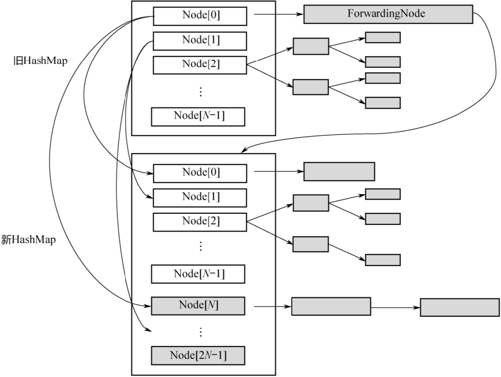

# Concurrent


# Striped64


* java.util.concurrent.atomic.Striped64:抽象类


```java
// 累加单元数组,懒加载
transient volatile Cell[] cells;
// 基础值,如果没有竞争,则用cas累加这个域
transient volatile long base;
// 在cells创建或扩容时置为1,表示加锁
transient volatile int cellsBusy;
```


## Cell


* java.util.concurrent.atomic.Striped64.Cell:Striped64内部类,用来分段操作


```java
// Contended:该注解用来防止缓存行的伪共享行为
@sun.misc.Contended static final class Cell {
    volatile long value;
    Cell(long x) { value = x; }
    final boolean cas(long cmp, long val) {
        // 用CAS方式进行累加,cmp表示旧值,val表示新值
        return UNSAFE.compareAndSwapLong(this, valueOffset, cmp, val);
    }

    // Unsafe mechanics
    private static final sun.misc.Unsafe UNSAFE;
    private static final long valueOffset;
    static {
        try {
            UNSAFE = sun.misc.Unsafe.getUnsafe();
            Class<?> ak = Cell.class;
            valueOffset = UNSAFE.objectFieldOffset(ak.getDeclaredField("value"));
        } catch (Exception e) {
            throw new Error(e);
        }
    }
}
```


* 因为Cell是数组,在内存中是连续存储的,一个Cell为24字节(16字节的对象头和 8 字节的 value),因此一个缓存行可以存下 2 个 Cell,这样存的问题是:无论那个CPU缓存中的值修改成功,都会导致另外Core的缓存行失效,降低了效率


* @sun.misc.Contended注解用来解决这个问题,使用此注解的对象或字段会在前后各增加 128 字节大小的padding,从而让 CPU 将对象预读至缓存时占用不同的缓存行,这样,不会造成其他CPU核心缓存行的失效


## LongAdder


* java.util.concurrent.atomic.LongAdder:线程安全类,主要做高并发下的数字运算,效率比AtomicLong高
* `add()`:


```java
public void add(long x) {
    // as 为累加单元数组,b 为基础值, x 为累加值
    Cell[] as; long b, v; int m; Cell a;
    // 1. as 有值, 表示已经发生过竞争, 进入 if
    // 2. cas 给 base 累加时失败了, 表示 base 发生了竞争, 进入 if
    if ((as = cells) != null || !casBase(b = base, b + x)) {
        // uncontended 表示 cell 没有竞争
        boolean uncontended = true;
        if (
            // as 还没有创建
            as == null || (m = as.length - 1) < 0 ||
            // 当前线程对应的 cell 还没有
            (a = as[getProbe() & m]) == null ||
            // cas 给当前线程的 cell 累加失败 uncontended=false ( a 为当前线程的 cell )
            !(uncontended = a.cas(v = a.value, v + x)))
            // 进入 cell 数组创建、cell 创建的流程
            longAccumulate(x, null, uncontended);
    }
}
```


* `longAccumulate()`:


```java
final void longAccumulate(long x, LongBinaryOperator fn,
                          boolean wasUncontended) {
    int h;
    // 当前线程还没有对应的 cell, 需要随机生成一个 h 值用来将当前线程绑定到 cell
    if ((h = getProbe()) == 0) {
        // 初始化 probe
        ThreadLocalRandom.current();
        // h 对应新的 probe 值, 用来对应 cell
        h = getProbe();
        wasUncontended = true;
    }
    // collide 为 true 表示需要扩容
    boolean collide = false;
    for (;;) {
        Cell[] as; Cell a; int n; long v;
        // 已经有了 cells
        if ((as = cells) != null && (n = as.length) > 0) {
            // 还没有 cell
            if ((a = as[(n - 1) & h]) == null) {
                // 为 cellsBusy 加锁, 创建 cell, cell 的初始累加值为 x,成功则 break, 否则继续 continue 循环
                // ......省略代码
            }
            // 有竞争, 改变线程对应的 cell 来重试 cas
            else if (!wasUncontended)
                wasUncontended = true;
            // cas 尝试累加, fn 配合 LongAccumulator 不为 null, 配合 LongAdder 为 null
            else if (a.cas(v = a.value, ((fn == null) ? v + x : fn.applyAsLong(v, x))))
                break;
            // 如果 cells 长度已经超过了最大长度, 或者已经扩容, 改变线程对应的 cell 来重试 cas
            else if (n >= NCPU || cells != as)
                collide = false;
            // 确保 collide 为 false 进入此分支, 就不会进入下面的 else if 进行扩容了
            else if (!collide)
                collide = true;
            // 加锁
            else if (cellsBusy == 0 && casCellsBusy()) {
                // ......省略代码
                // 加锁成功, 扩容
                continue;
            }
            // 改变线程对应的 cell
            h = advanceProbe(h);
        }
        // 还没有 cells, 尝试给 cellsBusy 加锁
        else if (cellsBusy == 0 && cells == as && casCellsBusy()) {
            // 加锁成功, 初始化 cells, 最开始长度为 2, 并填充一个 cell;成功则 break;
            // ......省略代码
        }
        // 上两种情况失败, 尝试给 base 累加
        else if (casBase(v = base, ((fn == null) ? v + x : fn.applyAsLong(v, x))))
            break;
    }
}
```


# Unsafe


* Unsafe 对象提供了非常底层的,操作内存、线程的方法,Unsafe 对象不能直接调用,只能通过反射获得


# defensive copy


* 保护性拷贝,通过创建副本对象来避免共享的手段,如String,底层是创建新的String对象,同时char[]数组也会重新复制一份
* 在JDK8以后,String的底层是byte[],而不是char[]


# Final


* 在编译后的字节码中,final变量的赋值也会通过putfield指令来完成,同样在这条指令之后会加入写屏障,保证其他线程在读到该变量的时候不会出现为0(初始化未赋值)的情况
* 获取final变量的值,是直接复制原值给其他变量或直接输出;若是非final变量,需要从堆中重新获取


# ThreadPoolExecutor


* ThreadPoolExecutor 使用 int 的高 3 位来表示线程池状态,低 29 位表示线程数量

| 状态名     | 高3位 | 接收新任务 | 处理阻塞任务队列 | 说明                                    |
| ---------- | ----- | ---------- | ---------------- | --------------------------------------- |
| RUNNING    | 111   | Y          | Y                |                                         |
| SHUTDOWN   | 000   | N          | Y                | 不会接收新任务,但会处理阻塞队列剩余任务 |
| STOP       | 001   | N          | N                | 会中断正在执行的任务,并抛弃阻塞队列任务 |
| TIDYING    | 010   | -          | -                | 任务全执行完毕,活动线程为 0 即将进入    |
| TERMINATED | 011   | -          | -                | 终结状态                                |

* 从数字上比较,TERMINATED > TIDYING > STOP > SHUTDOWN > RUNNING
* 这些信息存储在一个原子变量 ctl 中,目的是将线程池状态与线程个数合二为一,这样就可以用一次 cas 原子操作进行赋值

```java

private void advanceRunState(int targetState) {
    for (;;) {
        int c = ctl.get();
        if (runStateAtLeast(c, targetState) ||
            // c 为旧值,ctlOf 返回结果为新值
            ctl.compareAndSet(c, ctlOf(targetState, workerCountOf(c))))
            break;
    }
}

// rs 为高 3 位代表线程池状态, wc 为低 29 位代表线程个数,ctl 是合并它们
private static int ctlOf(int rs, int wc) { 
    return rs | wc;
}
```


# 并发编程


# 概述


* 并发编程三要素
  * 原子性: 即一个不可再被分割的颗粒,在Java中指的是一个或多个操作要么全部执行成功要么全部执行失败
  * 有序性: 程序执行的顺序按照代码的先后顺序执行(处理器可能会对指令进行重排序)
  * 可见性: 当多个线程访问同一个变量时,如果其中一个线程对其作了修改,其他线程能立即获取到最新的值
* 线程的五大状态
  * 创建状态: 当用 new 操作符创建一个线程的时候
  * 就绪状态: 调用 start 方法,处于就绪状态的线程并不一定马上就会执行 run 方法,还需要等待CPU的调度
  * 运行状态: CPU 开始调度线程,并开始执行 run 方法
  * 阻塞状态: 线程的执行过程中由于一些原因进入阻塞状态比如: 调用sleep()、尝试去得到一个锁等等
  * 死亡状态: run 方法执行完 或者 执行过程中遇到了一个异常
* 悲观锁与乐观锁
  * 悲观锁: 每次操作都会加锁,会造成线程阻塞
  * 乐观锁: 每次操作不加锁而是假设没有冲突而去完成某项操作,如果因为冲突失败就重试,直 到成功为止,不会造成线程阻塞
* 线程之间的协作
  * 线程间的协作有: wait/notify/notifyAll等
* synchronized: 一种同步锁,它修饰的对象有以下几种: 
  * 修饰一个代码块: 被修饰的代码块称为同步语句块,其作用的范围是大括号{}括起来 的代码,作用的对象是调用这个代码块的对象
  * 修饰一个方法: 被修饰的方法称为同步方法,其作用的范围是整个方法,作用的对象是调用这个方法的对象
  * 修饰一个静态的方法: 其作用的范围是整个静态方法,作用的对象是这个类的所有对象
  * 修饰一个类: 其作用的范围是synchronized后面括号括起来的部分,作用主的对象 是这个类的所有对象
* CAS: Compare And Swap,即比较替换,是实现并发应用到的一种技术.操作包含三个操作数—内存位置(V)、预期原值(A)和新值(B).如果内存位置的值与预期原值相匹配,那么处理器会自动将该位置值更新为新值,否则,处理器不做任何操作
  * CAS存在三大问题: ABA问题,循环时间长开销大,以及只能保证一个共享变量的原子操作
* 线程池: 减少线程的创建和销毁来节省资源


# 线程面试问题


* 重排序有哪些分类?如何避免?
* 新的Lock接口相对于synchronized有什么优势?如果让你实现一个高性能缓存,支持并发读取和单一写入,你如何保证数据完整性
* 如何在Java中实现一个阻塞队列
* 写一段死锁代码,说说你在Java中如何解决死锁
* volatile变量和atomic变量有什么不同
* 为什么要用线程池
* 实现Runnable接口和Callable接口的区别
* 执行execute()方法和submit()方法的区别是什么呢
* AQS的实现原理是什么
* java API中哪些类中使用了AQS?
* 多线程&并发设计原理


# JDK源码解析


* 多线程&并发设计原理
  * 并发核心概念
  * 并发的问题
  * JMM内存模型
* JUC
  * 并发容器同步工具类Atomic类
  * Lock与Condition
* 线程池与Future 线程池的实现原理
  * 线程池的类继承体系
* ThreadPoolExecutor
  * Executors工具类ScheduledThreadPool Executor
  * CompletableFuture用法
* ForkJoinPool
  * ForkJoinPool用法核心数据结构
  * 工作窃取队列
  * ForkJoinPool状态控制
  * Worker线程的阻塞-唤醒机制任务的提交过程分析
  * 工作窃取算法: 任务的执行过程分析
  * ForkJoinTask的fork/join
  * ForkJoinPool的优雅关闭
* 多线程设计模式
  * Single Threaded Execution模式
  * Immutable模式
  * Guarded Suspension模式
  * Balking模式
  * Producer-Consumer模式Read-Write Lock模式Thread-Per-Message模式Worker Thread模式
  * Future模式


# 多线程

 

## 线程创建的方式


* 继承Thread
* 实现Runnable
* 实现Callable


## 线程特征


* Java中的线程共享应用程序中的所有资源,包括内存和打开的文件,快速而简单地共享信息,但是必须使用同步避免数据竞争
* Java中的所有线程都有一个优先级,这个整数值介于`Thread.MIN_PRIORITY(1)`和`Thread.MAX_PRIORITY(10)`之间,默认优先级是`Thread.NORM_PRIORITY(5)`
* 通常较高优先级的线程将在较低优先级的钱程之前执行,但是并不绝对
* 可以创建两种线程: 守护线程和非守护线程,区别在于它们如何影响程序的结束


## 程序结束执行


* 程序执行Runtime类的exit()方法, 而且用户有权执行该方法
* 应用程序的所有非守护线程均已结束执行,无论是否有**正在运行的守护线程**
* 守护线程通常用在作为垃圾收集器或缓存管理器的应用程序中,执行辅助任务.在线程start之前调用`isDaemon()`检查线程是否为守护线程,也可以使用`setDaemon()`将某个线程设置为守护线程


## 线程状态


* Thread.States类中定义线程的状态如下: 
  * NEW: Thread对象已经创建,但是还没有开始执行,即只是new出来,还没有调用`start()`
  * RUNNABLE: Thread对象正在Java虚拟机中运行
  * BLOCKED: Thread对象正在阻塞,一般锁都会造成阻塞
  * WAITING: Thread 对象正在等待另一个线程的动作,如wait()
  * TIME_WAITING: Thread对象正在等待另一个线程的操作,但是有时间限制.如sleep(),wait(1)
  * TERMINATED: Thread对象已经完成了执行
* `getState()`获取Thread对象的状态,可以直接更改线程的状态
* 在给定时间内,线程只能处于一个状态,这些状态是JVM使用的状态,不能映射到操作系统的线程状态


## 线程状态变化


* 初始线程处于NEW状态,此时只是new,还没有调用start()
* 调用start()开始执行后,进入RUNNING或者READY状态
* 如果没有调用任何的阻塞函数,线程只会在RUNNING和READY之间切换,也就是系统的时间片调度.这两种状态的切换是操作系统完成的,除非手动调用yield()函数,放弃对CPU的占用
* 一旦调用了图中的任何阻塞函数,线程就会进入WAITING或者TIMED_WAITING状态,两者的区别只是前者为无限期阻塞,后者则传入了一个时间参数.如果使用了synchronized 或 锁,则会进入BLOCKED状态
* LockSupport.park()/unpark(): 不太常见的阻塞/唤醒函数,Concurrent包中Lock的实现即依赖这一对操作原语


## synchronized


### 锁的对象


* 实例方法的锁加在对象实例上,静态方法的锁加在类字节码上


### 锁的本质


* 如果一份资源需要多个线程同时访问,需要给该资源加锁.加锁之后,可以保证同一时间只能有一个线程访问该资源
* 资源可以是一个变量、一个对象或一个文件等
* 锁是一个对象,作用如下: 
  * 这个对象内部得有一个标志位(state变量),记录自己有没有被某个线程占用.最简单的情况是这个state有0、1两个取值,0表示没有线程占用锁,1表示有某个线程占用锁
  * 如果这个对象被某个线程占用,记录这个线程的thread ID
  * 这个对象维护一个thread id list,记录其他所有阻塞的、等待获取这个锁的线程.在当前线程释放锁之后从这个thread id list里取一个线程唤醒


### 实现原理


* 在对象头里,有一块数据叫Mark Word.在64位机器上,Mark Word是8字节(64位)的,这64位中有2个重要字段: 锁标志位和占用该锁的thread ID.因为不同版本的JVM实现,对象头的数据结构会有各种差异


## wait与notify


### 生产者−消费者模型


* 一个内存队列,多个生产者线程往队列中放数据;多个消费者线程从队列中取数据.要实现这样一个编程模型,需要做下面几件事情: 
  * 内存队列本身要加锁,才能实现线程安全
  * 阻塞.当内存队列满了,生产者放不进去时,会被阻塞;当内存队列是空的时候,消费者无事可做,会被阻塞
  * 双向通知.消费者被阻塞之后,生产者放入新数据,要notify()消费者;反之,生产者被阻塞之后,消费者消费了数据,要notify()生产者


### 如何阻塞?


* 办法1: 线程自己阻塞自己,也就是生产者、消费者线程各自调用wait()和notify()
* 办法2: 用一个阻塞队列,当取不到或者放不进去数据的时候,入队/出队函数本身就是阻塞的


### 如何双向通知?


* 办法1: wait()与notify()机制
* 办法2: Condition机制


### wait()必须释放锁


* 当线程A进入synchronized(obj1)后,也就是对obj1上了锁.此时,调用wait()进入阻塞状态,一直不能退出synchronized代码块,线程B就永远无法进入synchronized(obj1)里,永远没有机会调用notify(),发生死锁
* 在wait()的内部,会先释放锁obj1,然后进入阻塞状态,之后,它被另外一个线程用notify()唤醒,重新获取锁.其次,wait()调用完成后,执行后面的业务逻辑代码,然后退出synchronized同步块,再次释放锁,如此则可以避免死锁


## 轻量级与重量级阻塞


* 能够被中断的阻塞称为轻量级阻塞,对应的线程状态是WAITING或者TIMED_WAITING;而像synchronized 这种不能被中断的阻塞称为重量级阻塞,对应的状态是 BLOCKED


## 线程的优雅关闭


* 运行到一半的线程不能强制关闭,如果强制杀死线程,则线程中所使用的资源,例如文件描述符、网络连接等无法正常关闭
* 一个线程一旦运行起来,不要强行关闭,合理的做法是让其运行完(方法执行完毕),干净地释放掉所有资源,然后退出
* 如果是一个不断循环运行的线程,就需要用到线程间的通信机制,让主线程通知其退出


# 并发


## 同步


* 在并发中,可以将同步定义为一种协调两个或更多任务以获得预期结果的机制.同步的方式有 两种: 
  * 控制同步: 例如,当一个任务的开始依赖于另一个任务的结束时,第二个任务不能再第一个任务完成之前开始
  * 数据访问同步: 当两个或更多任务访问共享变量时,再任意时间里,只有一个任务可以访问该变量
* 与同步密切相关的一个概念是临界段.临界段是一段代码,由于它可以访问共享资源,因此在任何给定时间内,只能被一个任务执行.**互斥**是用来保证这一要求的机制,而且可以采用不同的方式来实现
* 如果算法有着粗粒度(低互通信的大型任务),同步方面的开销就会较低,也许程序不会用到系统所有的核心;如果算法有着细粒度(高互通信的小型任务),同步方面的开销就会很高,而且该算法的吞吐量可能不会很好
* 并发系统中有不同的同步机制,从理论角度看,最流行的机制如下: 
  * 信号量(semaphore): 一种用于控制对一个或多个单位资源进行访问的机制.它有一个用于存放可用资源数量的变量,而且可以采用两种原子操作来管理该变量.**互斥**(mutex, mutual exclusion的简写形式)是一种特殊类型的信号量,它只能取两个值(即**资源空闲**和**资源忙**),而且只有将互斥设置为**忙**的那个进程才可以释放它.互斥可以通过保护临界段来帮助程序避免出现竞争条件
  * 监视器: 一种在共享资源上实现互斥的机制.它有一个互斥、一个条件变量、两种操作(等待条件和通报条件).一旦通报了该条件,在等待它的任务中只有一个会继续执行


## 并发的问题


### 数据竞争


* 如果有多个任务在临界段之外对一个共享变量进行写入操作,没有使用任何同步机制,那么应用程序可能存在**数据竞争**(也叫做**竞争条件**)
* 在这些情况下,应用程序的最终结果可能取决于任务的执行顺序


### 死锁


* 当多个任务正在等待必须由另一线程释放的某个共享资源,而该线程又正在等待必须由前述任务之一释放的另一共享资源时,并发应用程序就出现了死锁.当系统中同时出现如下四种条件 时,就会导致这种情形
  * 互斥: 死锁中涉及的资源必须是不可共享的,一次只有一个任务可以使用该资源
  * 占有并等待条件:  一个任务在占有某一互斥的资源时又请求另一互斥的资源,当它在等待时,不会释放任何资源
  * 不可剥夺: 资源只能被那些持有它们的任务释放
  * 循环等待: 任务1正等待任务2所占有的资源,而任务2又正在等待任务3所占有的资源,以此类推,这样就出现了循环等待
* 避免死锁
  * 检测: 系统中有一项专门分析系统状态的任务,可以检测是否发生了死锁.如果它检测到了死锁,可以采取一些措施来修复该问题
  * 预防: 如果想防止系统出现死锁,就必须预防上述死锁条件中的一条或多条出现
  * 规避: 如果可以在某一任务执行之前得到该任务所使用资源的相关信息,那么死锁是可以规避的


### 活锁


* 如果有两个任务总是因对方的行为而改变自己的状态,那么就出现了活锁,最终结果是它们陷入了状态变更的循环而无法继续向下执行
* 例如,任务1和任务2都需要用到资源1和资源2,假设任务1对资源1加了一个锁,而任务2对资源2加了一个锁,当它们无法访问所需的资源时,就会释放自己的资源并且重新开始循环.这种情况可以无限地持续下去,所以这两个任务都不会结束自己的执行过程


### 资源不足


* 当某个任务在系统中无法获取维持其继续执行所需的资源时,就会出现资源不足.当有多个任务在等待某一资源且该资源被释放时,系统需要选择下一个可以使用该资源的任务,如果系统中没有设计良好的算法,那么系统中有些线程很可能要为获取该资源而等待很长时间
* 要解决这一问题就要确保公平原则.所有等待某一资源的任务必须在某一给定时间之内占有该资源,可选方案之一就是实现一个算法,在选择下一个将占有某一资源的任务时,对任务已等待该资源的时间因素加以考虑.然而,实现锁的公平需要增加额外的开销,这可能会降低程序的吞吐量


# JMM内存模型


* JMM是一套规范,在多线程中,即要让编译器和CPU可以灵活地重排序;又要明确告知开发者不需要感知什么样的重排序,需要感知什么样的重排序.开发者根据需要决定重排序对程序是否有影响,如果有,就需要显示地通过volatile、synchronized等线程同步机制来禁止重排序


## CPU缓存


* 每个CPU内核都有自己的寄存器,寄存器之上是L1(一级缓存),L2,L3以及内存.L3和内存是多核CPU共享
* CPU读数据时先从寄存器读,找不到再到L1,再到L2,依次类推
* CPU从寄存器读数据的时间大概是1cycle(4GHZ的CPU约为0.25ns(纳秒))
* 从L1读数据的时间为3-4cycle,L2为10-20cycle,L3为40-45cycle,内存为120-240cycle
* 因为CPU与内存的速度差异很大,需要靠预读数据至缓存来提升效率.
* 而缓存以缓存行为单位,每个缓存行对应着一块内存,一般是64byte (8个long)
* 缓存的加入会造成数据副本的产生,即同一份数据会缓存在不同核心的缓存行中CPU,要保证数据的一致性,如果某个 CPU 核心更改了数据,其它CPU 核心对应的整个缓存行必须失效


## 缓存一致性


* 因为存在CPU缓存一致性协议,例如MESI,多个CPU核心之间缓存不会出现不同步的问题,不会有内存可见性问题
* 缓存一致性协议对性能有很大损耗,为解决这个问题,又进行了各种优化.例如,在计算单元和L1之间加了Store Buffer,Load Buffer以及其他其他各种Buffer
  * Store Buffer: 写变量
  * Load Buffer: 读变量

* L1、L2、L3和主内存之间是同步的,有缓存一致性协议的保证,但是Store Buffer,Load Buffer和L1之间却是异步的,向内存中写入一个变量,这个变量会保存在Store Buffer里面,稍后才异步写入L1中,同时同步写入主内存中
* 多CPU,每个CPU多核,每个核上面可能还有多个硬件线程,对于操作系统来讲,就相当于一个个的逻辑CPU,每个逻辑CPU都有自己的缓存,这些缓存和主内存之间不是完全同步的.对应到Java里,就是JVM抽象内存模型:


## 内存可见性


* CPU缓存与主存之间数据共享导致了内存可见性问题


## JMM与happen-before


### 重排序


* Store Buffer的延迟写入(异步写入)是重排序的一种,称为内存重排序(Memory Ordering),即其他核心从L1读数据的时候,写入数据的核心还没有将数据写入到L1中,导致其他核心读取数据不是最新
* 除了内存重排序,还有编译器和CPU的指令重排序
  * 编译器重排序.对于没有先后依赖关系的语句,编译器可以重新调整语句的执行顺序
  * CPU指令重排序:在指令级别,让没有依赖关系的多条指令并行
  * CPU内存重排序: CPU有自己的缓存,指令的执行顺序和写入主内存的顺序不完全一致,是造成内存可见性问题的主因
* 假设X,Y是两个全局变量,初始X,Y=0,线程1和线程2的执行先后顺序是不确定的,最终结果也是不确定的:

```
线程1
X=1
a=Y
线程2: 
Y=1
b=X

1. a=0,b=1
2. a=1,b=0
3. a=1,b=1
```

* 不管谁先谁后,执行结果应该是这三种场景中的一种,但实际可能是a=0,b=0.两个线程的指令都没有重排序,执行顺序也没重排序,仍然出现这种结果的原因是线程1先执行X=1,后执行a=Y,但此时X=1还在自己的Store Buffer里,没有写入主存中,所以线程2看到的X还是0.线程2同理


### 内存屏障


* Memory Barrier.为了禁止编译器和 CPU 重排序,在编译器和 CPU 层面产生的对应指令,这也是JMM和happen-before的底层实现原理
* 编译器的内存屏障,只在编译期告诉编译器不要进行指令重排.当编译完成之后,内存屏障就消失了,CPU并不会感知到编译器中的内存屏障
* CPU的内存屏障是CPU提供的指令,可以由开发者显示调用
* 内存屏障是很底层的概念,一般用 volatile 关键字就足够了.但从JDK 8开始,Unsafe类中提供了三个内存屏障函数

```java
public final class Unsafe {
    // ...
    public native void loadFence();
    public native void storeFence();
    public native void fullFence();
    // ...
}
```

* 在理论层面,可以把基本的CPU内存屏障分成四种: 
  * LoadLoad: 禁止读读重排序
  * StoreStore: 禁止写写重排序
  * LoadStore: 禁止读写重排序
  * StoreLoad: 禁止写读重排序
* Unsafe中的方法: 
  * loadFence=LoadLoad+LoadStore
  * storeFence=StoreStore+LoadStore
  * fullFence=loadFence+storeFence+StoreLoad


### as-if-serial


#### 单线程重排序


* 无论什么语言,站在编译器和CPU的角度,不管怎么重排序,单线程程序的执行结果不能改变,这就是单线程程序的重排序规则.即只要操作之间没有数据依赖性,编译器和CPU都可以任意重排序,因为执行结果不会改变,这也就是as-if-serial语义
* 对于单线程程序来说,即使编译器和CPU做了重排序,也不存在内存可见性问题


#### 多线程重排序


* 多线程之间的数据依赖性太复杂,编译器和CPU不能完全理解这种依赖性并做出优化,只能保证每个线程的as-if-serial语义
* 线程之间的数据依赖和相互影响,需要编译器和CPU的上层告知编译器和CPU在多线程场景下什么时候可以重排序,什么时候不能重排序


### happen-before


* 描述两个操作之间的内存可见性(hb):
  * 如果A happen-before B,意味着A的执行结果必须对B可见,也就是保证跨线程的内存可见性
  * A happen before B不代表A一定在B之前执行.因为多线程程序中,两个操作的执行顺序是不确定的
  * happen-before只确保如果A在B之前执行,则A的执行结果必须对B可见
* 基于happen-before的这种描述方法,JMM对开发者做出了一系列承诺: 

  * 单线程中的每个操作,happen-before 对应该线程中任意后续操作(也就是 as-if-serial语义保证)
  * 对volatile变量的写入,happen-before对应后续对这个变量的读取,即保证先写后读
  * 对synchronized的解锁,happen-before对应后续对这个锁的加锁,即保证先解锁后加锁
* JMM对编译器和CPU来说,volatile 变量不能重排序;非 volatile 变量可以任意重排序


#### 传递性


* 即若A hb B,B hb C,则A hb C

  ```java
  class A {
      private int a = 0;
      private volatile int c = 0;
      public void set() {
          a = 5; // 操作1
          c = 1; // 操作2
      }
      public int get() {
          int d = c; // 操作3
          return a; // 操作4
      }
  }
  ```

* 假设线程A先调用了set,设置了a=5;之后线程B调用了get,则返回值一定是a=5

* 操作1和操作2是在同一个线程内存中执行的,操作1 hb 操作2,操作3 hb 操作4

* 而c是volatile变量,对c的写入 hb 对c的读取,所以操作2 hb 操作3

* 利用hb的传递性,就得到: 操作1 hb 操作2 hb 操作3 hb操作4,所以,操作1的结果,一定对操作4可见

  ```java
  class A {
      private int a = 0;
      private int c = 0;
      public synchronized void set() {
          a = 5; // 操作1
          c = 1; // 操作2
      }
      public synchronized int get() {
          return a;
      }
  }
  ```
  
* 假设线程A先调用了set,设置了a=5;之后线程B调用了get,返回值也一定是a=5

* 因为与volatile一样,synchronized同样具有hb语义,展开上面的代码可得到类似于下面的伪代码: 

  ```
  线程A：
  加锁; // 操作1
  a = 5; // 操作2
  c = 1; // 操作3
  解锁; // 操作4
  线程B：
  加锁; // 操作5
  读取a; // 操作6
  解锁; // 操作7
  ```

* 根据synchronized的hb语义,操作4 hb 操作5,再结合传递性,最终就会得到: 操作1 hb 操作2 ...... hb 操作7,所以,a、c都不是volatile变量,但仍然有内存可见性


## volatile


### **64**位写入的原子性(**Half Write**)


* 对于一个long型变量的赋值和取值操作而言,在多线程某些场景下,返回值可能不是并不准确

* 因为JVM的规范并没有要求64位的long或者double的写入是原子的.在32位的机器上,一个64位变量的写入可能被拆分成两个32位的写操作来执行,这样读取的线程就可能读到一半的值,另外一半读取不到.解决办法也很简单,在long前面加上volatile


### 重排序DCL问题


* 单例模式的线程安全的写法不止一种,常用写法为DCL(Double Checking Locking)-双重检查锁定,如下所示: 

```java
public class Singleton {
    private static Singleton instance;
    public static Singleton getInstance() {
        if (instance == null) {
            synchronized(Singleton.class) {
                if (instance == null) {
                    // 此处代码有问题
                    instance = new Singleton();
                }
            }
        }
        return instance;
    }
}
```

* 上述的 `instance = new Singleton();` 代码有问题,其底层会分为三个操作: 
  * 1.分配一块内存
  * 2.在内存上初始化成员变量
  * 3.把instance引用指向内存
* 在这三个操作中,操作2和操作3可能重排序,即先把instance指向内存,再初始化成员变量,因为二者并没有先后的依赖关系.此时,另外一个线程可能拿到一个未完全初始化的对象,这时,直接访问里面的成员变量,就可能出错.这就是典型的构造方法溢出问题
* 为instance变量加上volatile可解决该问题
* volatile的三重功效: 64位写入的原子性、内存可见性和禁止重排序


### 实现原理


* 这里只探讨为了实现volatile关键字的语义的一种参考做法: 
  * 在volatile写操作的前面插入一个StoreStore屏障,保证volatile写操作不会和之前的写操作重排序
  * 在volatile写操作的后面插入一个StoreLoad屏障,保证volatile写操作不会和之后的读操作重排序
  * 在volatile读操作的后面插入一个LoadLoad屏障+LoadStore屏障,保证volatile读操作不会和之后的读操作、写操作重排序
* 具体到x86平台上,其实不会有LoadLoad、LoadStore和StoreStore,只有StoreLoad一种重排序(内存屏障),也就是只需要在volatile写操作后面加上StoreLoad屏障


### volatile增强


* 在之前的旧内存模型中,一个64位`long/double`变量的`读/写`操作可以被拆分为两个32位的`读/写`操作来执行
* 从JSR -133内存模型开始 (即JDK5),仅仅只允许把一个64位`long/double`变量的**写操作拆分**为两个32位的写操作来执行,任意的**读操作**在JSR -133中都**必须具有原子性**(即任意读操作必须要在单个读事务中执行)


## final


### 构造方法溢出


* 详见重排序DCL问题


### final的hb


* final也有相应的hb语义: 
  * 对final域的写(构造方法内部) hb 对final域所在对象的读
  * 对final域所在对象的读 hb 对final域字段的读
* 通过hb语义的限定,保证了final域的赋值,一定在构造方法之前完成,不会出现另外一个线程读取到了对象,但对象里面的变量却还没有初始化的情形,避免出现构造方法溢出的问 题


## happen-before总结


* 单线程中的每个操作,happen-before于该线程中任意后续操作
* 对volatile变量的写,happen-before于后续对这个变量的读
* 对synchronized的解锁,happen-before于后续对这个锁的加锁
* 对final变量的写,happen-before于final域对象的读,happen-before于后续对final变量的读
* 四个基本规则再加上happen-before的传递性,就构成JMM对开发者的整个承诺


# JUC


## 并发容器


### BlockingQueue


* BlockingQueue是一个带阻塞功能的队列,当入队列时,若队列已满,则阻塞调用者;当出队列时,若队列为空,则阻塞调用者


### ArrayBlockingQueue


* 是一个用数组实现的环形队列,在构造方法中,会要求传入数组的容量

```java
public class ArrayBlockingQueue<E> extends AbstractQueue<E> implements BlockingQueue<E>, java.io.Serializable {
    final Object[] items;
    // 队头指针索引
    int takeIndex;
    // 队尾指针索引
    int putIndex;
    int count;
    // 1把锁+2个条件
    final ReentrantLock lock;
    private final Condition notEmpty;
    private final Condition notFull;

    // ....
}
```


### LinkedBlockingQueue


* 基于**单向链表**的阻塞队列,因为队头和队尾是2个指针分开操作的,所以用了2把锁+2个条件,同时有1个AtomicInteger的记录count


### PriorityBlockingQueue


* 队列通常是先进先出的,而PriorityQueue是按照元素的优先级从小到大出队列的.PriorityQueue中的2个元素之间需要可以比较大小,并实现Comparable接口


### DelayQueue


* 延迟队列,是一个按延迟时间从小到大出队的PriorityQueue,放入DelayQueue中的元素,必须实现Delayed接口


### SynchronousQueue


* 本身没有容量,先调put(),线程会阻塞;直到另外一个线程调用了take(),两个线程才同时解锁,反之亦然
* 对于多个线程而言,例如3个线程, 调用3次put(),3个线程都会阻塞;直到另外的线程调用3次take(),6个线程才同时解锁,反之亦然


#### TransferQueue


* TransferQueue是一个基于单向链表而实现的队列,通过head和tail 2个指针记录头部和尾部.初始的时候,head和tail会指向一个空节点
* `TransferQueue#transfer()`

```java
E transfer(E e, boolean timed, long nanos) {
    QNode s = null;
    boolean isData = (e != null);

     // 队列还未初始化,自旋等待
    for (;;) {
        QNode t = tail;
        QNode h = head;
        if (t == null || h == null)
            continue;                      
	// 队列为空或者当前线程和队列中元素为同一种模式
        if (h == t || t.isData == isData) { 
            QNode tn = t.next;
            // 不一致读,重新执行for循环
            if (t != tail)
                continue;
            if (tn != null) {
                advanceTail(t, tn);
                continue;
            }
            if (timed && nanos <= 0)
                return null;
            if (s == null)
                s = new QNode(e, isData);
            if (!t.casNext(null, s))
                continue;
	    // 后移tail指针
            advanceTail(t, s);
            // 进入阻塞状态
            Object x = awaitFulfill(s, e, timed, nanos);
            if (x == s) {
                clean(t, s);
                return null;
            }
	    // 从阻塞中唤醒,确定已经处于队列中的第1个元素
            if (!s.isOffList()) {
                advanceHead(t, s);
                if (x != null)
                    s.item = s;
                s.waiter = null;
            }
            return (x != null) ? (E)x : e;
        } else {
            // 当前线程可以和队列中的第一个元素配对
            // 取队列中第一个元素
            QNode m = h.next;
            // 不一致读,重新for循环
            if (t != tail || m == null || h != head)
                continue;

            Object x = m.item;
            // 已经配对
            if (isData == (x != null) ||
                x == m ||
                // 尝试配对
                !m.casItem(x, e)) {
                // 已经配对,直接对队列
                advanceHead(h, m);
                continue;
            }
	    // 配对成功,出队列
            advanceHead(h, m);
            // 唤醒队列中与第一个元素对应的线程
            LockSupport.unpark(m.waiter);
            return (x != null) ? (E)x : e;
        }
    }
}
```


#### TransferStack


* 一个单向链表,只需要head指针就能 实现入栈和出栈操作
* 链表中的节点有三种状态,REQUEST对应take节点,DATA对应put节点,二者配对之后,会生成一个FULFILLING节点,入栈,然后FULLING节点和被配对的节点一起出栈
* `TransferQueue#transfer()`

```java
E transfer(E e, boolean timed, long nanos) {
    SNode s = null;
    int mode = (e == null) ? REQUEST : DATA;

    for (;;) {
        SNode h = head;
        // 同一种模式
        if (h == null || h.mode == mode) {
            if (timed && nanos <= 0) {
                if (h != null && h.isCancelled())
                    casHead(h, h.next);
                else
                    return null;
            } 
            // 入栈
            else if (casHead(h, s = snode(s, e, h, mode))) {
                // 阻塞等待
                SNode m = awaitFulfill(s, timed, nanos);
                if (m == s) {
                    clean(s);
                    return null;
                }
                if ((h = head) != null && h.next == s)
                    casHead(h, s.next);
                return (E) ((mode == REQUEST) ? m.item : s.item);
            }
        } 
        // 非同一种模式,待匹配
        else if (!isFulfilling(h.mode)) {
            if (h.isCancelled())
                casHead(h, h.next);
            // 生成一个FULFILLING节点,入栈
            else if (casHead(h, s=snode(s, e, h, FULFILLING|mode))) {
                for (;;) {
                    SNode m = s.next;
                    if (m == null) {
                        casHead(s, null);
                        s = null;
                        break;
                    }
                    SNode mn = m.next;
                    if (m.tryMatch(s)) {
                        // 2个节点一处出栈
                        casHead(s, mn);
                        return (E) ((mode == REQUEST) ? m.item : s.item);
                    } else
                        s.casNext(m, mn);
                }
            }
        } 
        // 已经匹配过了,出栈
        else {
            SNode m = h.next;
            if (m == null)
                casHead(h, null);
            else {
                SNode mn = m.next;
                if (m.tryMatch(h))
                    // 配对,一起出栈
                    casHead(h, mn);
                else
                    h.casNext(m, mn);
            }
        }
    }
}
```


### BlockingDeque


* 一个阻塞的双端队列接口,继承了BlockingQueue,同时增加了对应的双端队列操作接口
* 该接口只有一个实现, 就是LinkedBlockingDeque,其核心数据结构是一个双向链表
* 对应的实现原理,和LinkedBlockingQueue基本一样,只是LinkedBlockingQueue是单向链表,而LinkedBlockingDeque是双向链表


### CopyOnWrite


* CopyOnWrite指在写的时候,不是直接写源数据,而是把数据拷贝一份进行修改,再通过悲观锁或者乐观锁的方式写回
* 这样做是为了读的时候不加锁


#### CopyOnWriteArrayList


* 线程安全的ArrayList,有读写数据不一致问题


#### CopyOnWriteArraySet


* 就是用 Array 实现的一个 Set,保证所有元素都不重复,其内部是封装的一个CopyOnWriteArrayList


### ConcurrentLinkedQueue


* 线程安全的LinkedQueue
* 初始化的时候, head 和 tail 都指向一个 null 节点


#### 入队列


```java
    public boolean offer(E e) {
        checkNotNull(e);
        final Node<E> newNode = new Node<E>(e);

        for (Node<E> t = tail, p = t;;) {
            Node<E> q = p.next;
            if (q == null) {
                // 对tail的next指针进行CAS操作而不是对tail指针进行CAS操作
                if (p.casNext(null, newNode)) {
                    if (p != t)
                        // 每入列2个节点,后移一次tail指针,失败也没问题
                        casTail(t, newNode);
                    return true;
                }
            }
            else if (p == q)
                // 已经达到队列尾部
                p = (t != (t = tail)) ? t : head;
            else
                // 后移p指针
                p = (p != t && t != (t = tail)) ? t : q;
        }
    }
```


* 上面的入队其实是每次在队尾追加2个节点时,才移动一次tail节点
* 初始的时候,队列中有1个节点item1,tail指向该节点,假设线程1要入队item2节点:
  * 1:p=tail,q=p.next=NULL
  * 2: 对p的next执行CAS操作,追加item2,成功之后,p=tail.所以上面的casTail方法不会执行,直接返回.此时tail指针没有变化
  * 之后,假设线程2要入队item3节点
  * 3:p=tail,q=p.next
  * 4: q!=NULL,因此不会入队新节点,p,q都后移1位
  * 5: q=NULL,对p的next执行CAS操作,入队item3节点
  * 6: p!=t,满足条件,执行上面的casTail操作,tail后移2个位置,到达队列尾部

* 即使tail指针没有移动,只要对p的next指针成功进行CAS操作,就算成功入队列
* 只有当 p != tail时,才会后移tail指针.即每连续追加2个节点,才后移1次tail指针.即使CAS失败也没关系,可以由下1个线程来移动tail指针


#### 出队列


```java
public E poll() {
    restartFromHead:
    for (;;) {
        for (Node<E> h = head, p = h, q;;) {
            E item = p.item;
	    // 在出队时,没有移动head,而是把item置为null
            if (item != null && p.casItem(item, null)) {
                if (p != h)
                    // 每产生2个NULL节点才将head后移2位
                    updateHead(h, ((q = p.next) != null) ? q : p);
                return item;
            }
            else if ((q = p.next) == null) {
                updateHead(h, p);
                return null;
            }
            else if (p == q)
                continue restartFromHead;
            else
                p = q;
        }
    }
}
```


* 出队列的代码和入队列类似,也有p,q2个指针.假设初始的时候head 指向空节点,队列中有item1、item2、item3 三个节点
  * 1:p=head,q=p.next.p!=q.
  * 2: 后移 p 指针,使得 p=q
  * 3: 出队列.此处并没有直接删除item1节点,只是把该节点的item通过CAS操作置为了NULL
  * 4: p!=head,此时队列中有了2个 NULL 节点,再前移1次head指针,对其执行updateHead 操作
* 出队列的判断并非观察 tail 指针的位置,而是依赖于 head 指针后续的节点是否为NULL这一条件
* 只要对节点的item执行CAS操作,置为NULL成功,则出队列成功.即使head指针没有成功移动,也可以由下1个线程继续完成


#### 队列判空


* 因为head/tail 并不是精确地指向队列头部和尾部,所以不能简单地通过比较 head/tail 指针来判断队列是否为空,而是需要从head指针开始遍历,找第1个不为NULL的节点.如果找到,则队列不为空;如果找不到,则队列为空


### ConcurrentLinkedDeque


* 实现和ConcurrentLinkedQueue相似,双向队列


### ConcurrentHashMap


#### 初始化


```java
private final Node<K,V>[] initTable() {
    Node<K,V>[] tab; int sc;
    while ((tab = table) == null || tab.length == 0) {
        if ((sc = sizeCtl) < 0)
            Thread.yield(); // 自旋等待
        else if (U.compareAndSetInt(this, SIZECTL, sc, -1)) { // 将sizeCtl设置为-1
                try {
                    if ((tab = table) == null || tab.length == 0) {
                        int n = (sc > 0) ? sc : DEFAULT_CAPACITY;
                        @SuppressWarnings("unchecked")
                        Node<K,V>[] nt = (Node<K,V>[])new Node<?,?>[n]; // 初始化
                        table = tab = nt;
                        // sizeCtl不是数组长度,因此初始化成功后,就不再等于数组长度,而是n-(n>>>2)=0.75n,表示下一次扩容的阈值:n-n/4
                        sc = n - (n >>> 2);
                    }
                } finally {
                    sizeCtl = sc; // 设置sizeCtl的值为sc
                }
            break;
        }
    }
    return tab;
}
```


* 如果某个线程成功把 sizeCtl 设为-1,就可以进行初始化,等初始化完成,再把sizeCtl设置回去;其他线程则自旋等待,直到数组不为null时退出
* 因为初始化的工作量很小,所以此处选择的策略是让其他线程一直等待


#### putVal()


```java
final V putVal(K key, V value, boolean onlyIfAbsent) {
    if (key == null || value == null) throw new NullPointerException();
    int hash = spread(key.hashCode());
    int binCount = 0;
    for (Node<K,V>[] tab = table;;) {
        Node<K,V> f; int n, i, fh; K fk; V fv;
        // 分支1: 整个数组初始化
        if (tab == null || (n = tab.length) == 0)
            tab = initTable();
        // 分支2: 第i个元素初始化
        else if ((f = tabAt(tab, i = (n - 1) & hash)) == null) {
            if (casTabAt(tab, i, null, new Node<K,V>(hash, key, value)))
                break;
        }
        // 分支3: 扩容
        else if ((fh = f.hash) == MOVED)
            tab = helpTransfer(tab, f);
        else if (onlyIfAbsent && fh == hash && ((fk = f.key) == key || (fk != null && key.equals(fk))) && (fv = f.val) != null)
            return fv;
        // 分支4:放入元素
        else {
            V oldVal = null;
            // 加锁
            synchronized (f) {
                // 链表
                if (tabAt(tab, i) == f) {
                    if (fh >= 0) {
                        // ......
                    }
                    // 红黑树
                    else if (f instanceof TreeBin) {
                        // ......
                    }
                    else if (f instanceof ReservationNode)
                        throw new IllegalStateException("Recursive update");
                }
            }
            // 如果是链表,上面的binCount会一直累加
            if (binCount != 0) {
                if (binCount >= TREEIFY_THRESHOLD)
                    // 超出阈值,转换为红黑树
                    treeifyBin(tab, i);
                if (oldVal != null)
                    return oldVal;
                break;
            }
        }
    }
    // 总元素个数累加1
    addCount(1L, binCount);
    return null;
}
```


* 分支1:整个数组的初始化
* 分支2:是所在的槽为空,说明该元素是该槽的第一个元素,直接新建一个头节点,然后返回
* 分支3:说明该槽正在进行扩容,帮助其扩容
* 分支4:把元素放入槽内.槽内可能是一个链表,也可能是一棵红黑树,通过头节点的类型可以判断是哪一种.分支包裹在synchronized(f)里,f对应的数组下标位置的头节点,意味着每个数组元素有一把锁,并发度等于数组的长度
* binCount表示链表的元素个数,当这个数目超过TREEIFY_THRESHOLD=8时,把链表转换成红黑树,也就是 treeifyBin(tab,i).但在这个方法内部,不一定需要进行红黑树转换,可能只做扩容操作


#### 扩容


```java
private final void treeifyBin(Node<K,V>[] tab, int index) {
    Node<K,V> b; int n;
    if (tab != null) {
        if ((n = tab.length) < MIN_TREEIFY_CAPACITY)
            // 数组长度小于阈值64,不做红黑树转换,直接扩容
            tryPresize(n << 1);
        else if ((b = tabAt(tab, index)) != null && b.hash >= 0) {
            // 链表转换为红黑树
            synchronized (b) {
                if (tabAt(tab, index) == b) {
                    TreeNode<K,V> hd = null, tl = null;
                    // 遍历链表,初始化红黑树
                    for (Node<K,V> e = b; e != null; e = e.next) {
                        // ......
                    }
                    setTabAt(tab, index, new TreeBin<K,V>(hd));
                }
            }
        }
    }
}
```


* 在 tryPresize(int size)内部调用了一个核心方法 transfer(Node＜K,V＞\[\] tab,Node＜K,V＞\[\] nextTab)


```java
private final void transfer(Node<K,V>[] tab, Node<K,V>[] nextTab) {
    int n = tab.length, stride;
    // 计算步长
    if ((stride = (NCPU > 1) ? (n >>> 3) / NCPU : n) < MIN_TRANSFER_STRIDE)
        stride = MIN_TRANSFER_STRIDE;
    // 初始化新的HashMap
    if (nextTab == null) {
        // .....
        // 初始的transferIndex为旧HashMap的数组长度
        transferIndex = n;
    }
    // ......
    // 此处i为遍历下标,bound为边界.如果成功获取一个任务,则i=nextIndex-1,bound=nextIndex-stride;如果获取不到,则i=0,bound=0
    for (int i = 0, bound = 0;;) {
        Node<K,V> f; int fh;
        // advance表示在从i=transferIndex-1遍历到bound位置的过程中,是否一直继续
        while (advance) {
            int nextIndex, nextBound;
		// 以下是哪个分支中的advance都是false,表示如果三个分支都不执行,才可以一直while循环
		// 目的在于当对transferIndex执行CAS操作不成功时,需要自旋以期获取一个stride的迁移任务
                if (--i >= bound || finishing)
                    // 对数组遍历,通过这里的--i进行.如果成功执行了--i,就不需要继续while循环了,因为advance只能进一步
                    advance = false;
            else if ((nextIndex = transferIndex) <= 0) {
                // transferIndex <= 0,整个HashMap完成
                i = -1;
                advance = false;
            }
            // 对transferIndex执行CAS操作,即为当前线程分配1个stride.CAS操作成功,线程成功获取到一个stride的迁移任务;
            // CAS操作不成功,线程没有抢到任务,会继续执行while循环,自旋
            else if (U.compareAndSetInt(this, TRANSFERINDEX, nextIndex, nextBound = (nextIndex > stride ? nextIndex - stride : 0))) {
                bound = nextBound;
                i = nextIndex - 1;
                advance = false;
            }
        }
        // i越界,整个HashMap遍历完成
        if (i < 0 || i >= n || i + n >= nextn) {
            int sc;
            // finishing表示整个HashMap扩容完成
            if (finishing) {
                // ......
            }
            // ......
        }
        // tab[i]迁移完毕,赋值一个ForwardingNode
        else if ((f = tabAt(tab, i)) == null)
            advance = casTabAt(tab, i, null, fwd);
        // tab[i]的位置已经在迁移过程中
        else if ((fh = f.hash) == MOVED)
            advance = true;
        else {
            // 对tab[i]进行迁移操作,tab[i]可能是一个链表或者红黑树
            synchronized (f) {
                if (tabAt(tab, i) == f) {
                    Node<K,V> ln, hn;
                    // 链表
                    if (fh >= 0) {
                        int runBit = fh & n;
                        Node<K,V> lastRun = f;
                        for (Node<K,V> p = f.next; p != null; p = p.next) {
                            int b = p.hash & n;
                            if (b != runBit) {
                                runBit = b;
                                // 表示lastRun之后的所有元素,hash值都是一样的
                                // 记录下这个最后的位置
                                lastRun = p;
                            }
                        }
                        if (runBit == 0) {
                            // 链表迁移的优化做法
                            ln = lastRun;
                            hn = null;
                        }
                        else {
                            hn = lastRun;
                            ln = null;
                        }
                        // ......
                    }
                    // 红黑树,迁移做法和链表类似
                    else if (f instanceof TreeBin) {
                        //.......
                    }
                }
            }
        }
    }
}
```


* 扩容的基本原理如上图,首先建一个新的HashMap,其数组长度是旧数组长度的2倍,然后把旧元素逐个迁移过来
* 当nextTab=null时,方法最初会对nextTab进行初始化.该方法会被多个线程调用,所以每个线程只是扩容旧的HashMap部分
* 上图为多个线程并行扩容-任务划分示意图:旧数组的长度是N,每个线程扩容一段,一段的长度用变量stride来表示,transferIndex表示了整个数组扩容的进度
* stride的计算公式:在单核模式下直接等于n,因为在单核模式下没有办法多个线程并行扩容,只需要1个线程来扩容整个数组;在多核模式下为 `(n>>>3)/NCPU`,并且保证步长的最小值是 16,显然,需要的线程个数约为n/stride


* transferIndex是ConcurrentHashMap的一个成员变量,记录了扩容的进度.初始值为n,从大到小扩容,每次减stride个位置,最终减至`n<=0`,表示整个扩容完成.因此,从\[0,transferIndex-1\]的位置表示还没有分配到线程扩容的部分,从\[transfexIndex,n-1\]的位置表示已经分配给某个线程进行扩容,当前正在扩容中,或者已经扩容成功
* 因为transferIndex会被多个线程并发修改,每次减stride,所以需要通过CAS操作
* 在扩容未完成之前,有的数组下标对应的槽已经迁移到了新的HashMap里面,有的还在旧的HashMap里面,这个时候,所有调用get()的线程还是会访问旧 HashMap
* 当Node\[0\]已经迁移成功,如果有线程要读取Node\[0\]的数据,就会访问失败.为此,新建一个ForwardingNode,即转发节点,在这个节点里面记录的是新的 ConcurrentHashMap 的引用.这样,当线程访问到ForwardingNode之后,会去查询新的ConcurrentHashMap





* 因为数组的长度是2的整数次方,每次扩容又是2倍,而 Hash() 是`hashCode%tab.length`,等价于`hashCode&(tab.length-1)`.这表示处于第i个位置的元素,在新的Hash表的数组中一定处于第i个或者第i+n个位置.假设数组长度是8,扩容之后是16: 

  * 若hashCode=5,5%8=0,扩容后,5%16=0,位置保持不变
  * 若hashCode=24,24%8=0,扩容后,24%16=8,后移8个位置
  * 若hashCode=25,25%8=1,扩容后,25%16=9,后移8个位置
  * 若hashCode=39,39%8=7,扩容后,39%8=7,位置保持不变

* 正因为有这样的规律,所以如下有代码: 

  ```java
  setTabAt(nextTab, i, ln);
  setTabAt(nextTab, i + n, hn);
  setTabAt(tab, i, fwd);
  ```

* 也就是把tab\[i\]位置的链表或红黑树重新组装成两部分,一部分链接到nextTab\[i\]的位置,一部分链接到nextTab\[i+n\]的位置,然后把tab\[i\]的位置指向一个ForwardingNode节点

* 同时,当tab\[i\]后面是链表时,使用类似于JDK 7中在扩容时的优化方法,从lastRun往后的所有节点,不需依次拷贝,而是直接链接到新的链表头部.从lastRun往前的所有节点,需要依次拷贝

* 了解了transfer(tab,nextTab),再回头看tryPresize(int size),这个函数的输入是整个Hash表的元素个数,在函数里面,根据需要对整个Hash表进行扩容.想要看明白这个函数,需要透彻地理解sizeCtl变量

  * 当sizeCtl=-1时,表示整个HashMap正在初始化
  * 当sizeCtl=某个其他负数时,表示多个线程在对HashMap做并发扩容
  * 当sizeCtl=cap时,tab=null,表示未初始之前的初始容量(如上面的构造函数所示)
  * 扩容成功之后,sizeCtl存储的是下一次要扩容的阈值,即上面初始化代码中的`n-(n>>>2)=0.75n`

* 第一次扩容时,sizeCtl被设置成一个很大的负数`U.compareAndSwapInt(this,SIZECTL, sc,(rs << RESIZE_STAMP_SHIFT)+2)`,之后每一个线程扩容的时候,sizeCtl 就加 1,U.compareAndSwapInt(this,SIZECTL,sc,sc+1),待扩容完成之后,sizeCtl减1


### ConcurrentSkipListMap


* ConcurrentHashMap 是一种 key 无序的 HashMap,ConcurrentSkipListMap则是 key 有序的, 实现了NavigableMap接口,此接口又继承了SortedMap接口


#### 使用**SkipList**实现Map


* ConcurrentSkipListMap是基于SkipList(跳查表)来实现的,而不是红黑树,因为目前计算机领域还未找到一种高效的,作用在树上的,无锁的增加和删除节点的办法
* SkipList可以无锁地实现节点的增加,删除,这要从无锁链表的实现说起


#### 无锁链表


* 无锁队列,栈,都是只在队头,队尾进行CAS操作,通常不会有问题.如果在链表中间进行插入或删除,按照通常的CAS做法,就会出现问题
* 操作1: 在节点10后面插入节点20.首先把节点20的next指针指向节点30,然后对节点10的next指针执行CAS操作,使其指向节点20


* 操作2: 删除节点10.只需把头节点的next指针,进行CAS操作到节点30即可


* 但是,如果两个线程同时操作,一个删除节点10,一个要在节点10后面插入节点20,并且这两个操作都各自是CAS的,此时就会出现问题.如下图所示,删除节点10,会同时把新插入的节点20也删除掉,这个问题超出了CAS的解决范围


* 出现这个问题的原因: 在删除节点10的时候,实际操作的是节点10的头节点,节点10本身没有任何变化.故而,再往节点10后插入节点20的线程,并不知道节点10已经被删除了
* 解决办法:把节点 10 的删除分为两2步
  * 第一步,把节点10的next指针,mark成删除,即软删除
  * 第二步,找机会,物理删除
* 做标记之后,当线程再往节点10后面插入节点20的时候,便可以先进行判断,节点10是否已经被删除
* 但是把节点10的next指针指向节点20(插入操作)和判断节点10本身是否已经删除(判断操作),必须是原子的,必须在1个CAS操作里面完成


* 具体的实现有两个办法: 
  * 办法1: AtomicMarkableReference保证每个 next 是 AtomicMarkableReference 类型.但这个办法不够高效
  * 办法2: Mark节点.可以新造一个marker节点,使节点10的next指针指向该Marker节点.这样,当向节点10的后面插入节点20的时候,就可以在插入的同时判断节点10的next指针是否指向了一个Marker节点,这两个操作可以在一个CAS操作里面完成


#### 跳查表


* 解决了无锁链表的插入或删除问题,也就解决了跳查表的一个关键问题,因为跳查表就是多层链表叠起来的

* 跳查表底层节点类型为Node,所有的`<K, V>`对都是由这个单向链表串起来的

  ```java
  static final class Node<K,V> {
      final K key;
      volatile Object value;
      volatile Node<K,V> next;
      // ....
  }
  ```

* Index层节点

  ```java
  static class Index<K,V> {
      // 不存储实际数据,指向Node节点
      final Node<K,V> node;
      // 每个Index节点,必须有一个指针,指向其下一个Level对应的节点
      final Index<K,V> down;
      // Index也组成单向链表
      volatile Index<K,V> right;
      // ...
  }
  ```

* 整个ConcurrentSkipListMap就只需要记录顶层的head节点即可: 


#### put()


* 直接调用了`doPut()`
* 在底层,节点按照从小到大的顺序排列,上面的index层间隔地串在一起,因为从小到大排列.查找的时候,从顶层index开始,自左往右,自上往下,形成图示的遍历曲线
* 假设要查找的元素是32,遍 历过程如下: 
  * 先遍历第2层Index,发现在21的后面
  * 从21下降到第1层Index,从21往后遍历,发现在21和35之间
  * 从21下降到底层,从21往后遍历,最终发现在29和35之间
* 在整个的查找过程中,范围不断缩小,最终定位到底层的两个元素之间


* put()在通过findPredecessor找到了待插入的元素在\[b,n\]之间之后,并不能马上插入:因为其他线程也在操作这个链表,b、n都有可能被删除,所以在插入之前执行了一系列的检查逻辑,而这也正是无锁链表的复杂之处


#### remove()


* 直接调用了`doRemove()`
* 删除方法和插入方法的逻辑非常类似,因为无论是插入还是删除,都要先找到元素的前驱,也就是定位到元素所在的区间[b,n].在定位之后,执行下面几个步骤: 
  * 如果发现b、n已经被删除了,则执行对应的删除清理逻辑
  * 否则,如果没有找到待删除的(k, v),返回null
  * 如果找到了待删除的元素,也就是节点n,则把n的value置为null,同时在n的后面加上Marker节点,同时检查是否需要降低Index的层次


#### get()


* 直接调用了`doGet()`
* 和插入,删除相似,都需要先定位到元素位置[b,n],然后判断b,n是否已经被删除,如果是,则需要执行相应的删除清理逻辑


### ConcurrentSkipListSet


* ConcurrentSkipListSet只是对ConcurrentSkipListMap的简单封装,去除了重复元素


## 同步工具类


### Semaphore


* 信号量,提供了资源数量的并发访问控制
* 当初始的资源个数为1的时候,Semaphore退化为排他锁
* Semaphore和锁的实现原理基本相同,资源总数即state的初始值,在acquire里对state变量进行CAS减操作,减到0之后,线程阻塞;在release里对state变量进行CAS加操作


### CountDownLatch


* 闭锁,共享锁,在完成某些运算时,只有countDown()被调用指定次数后,当前运算才继续执行,基于AQS,但是没有公平和非公平之分


### CyclicBarrier


* CyclicBarrier使用方式比较简单: 该类用于协调多个线程同步执行操作的场合,和CountDownLatch类似,但是会自动释放线程


### Exchanger


* 用于线程之间交换数据
* slotExchange()

```java
private final Object slotExchange(Object item, boolean timed, long ns){
    // participant在初始化的时候设置初始值为new Node()
    // 获取本线程要交换的数据节点
    Node p = participant.get();
    // .....
    for (Node q;;) {
        // 如果slot非空,表明有其他线程在等待该线程交换数据
        if ((q = slot) != null) {
            // CAS操作,将当前线程的slot由slot设置为null
            if (SLOT.compareAndSet(this, q, null)) {
                // 获取对方线程交换来的数据
                Object v = q.item;
                // 设置要交换的数据
                q.match = item;
                // 获取q中阻塞的线程对象
                Thread w = q.parked;
                if (w != null)
                    // 如果对方阻塞的线程非空,则唤醒阻塞的线程
                    LockSupport.unpark(w);
                return v;
            }
            // 创建arena用于处理多个线程需要交换数据的场合,防止slot冲突
            if (NCPU > 1 && bound == 0 && BOUND.compareAndSet(this, 0, SEQ)) {
                arena = new Node[(FULL + 2) << ASHIFT];
            }
        }
        // 如果arena不是null,需要调用者调用arenaExchange方法接着获取对方线程交换来的数据
        else if (arena != null)
            return null;
        else {
            // 如果slot为null,表示对方没有线程等待该线程交换数据,设置要交换的本方数据
            p.item = item;
            // 设置当前线程要交换的数据到slot,CAS操作如果设置失败,则进入下一轮for循环
            if (SLOT.compareAndSet(this, null, p))
                break;
            p.item = null;
        }
    }
    // 没有对方线程等待交换数据,将当前线程要交换的数据放到slot中,是一个Node对象,然后阻塞,等待唤醒
    int h = p.hash;
    // 如果是计时等待交换,则计算超时时间;否则设置为0
    long end = timed ? System.nanoTime() + ns : 0L;
    // 如果CPU核心数大于1,则使用SPINS数,自旋;否则为1,没必要自旋
    int spins = (NCPU > 1) ? SPINS : 1;
    // 记录对方线程交换来的数据
    Object v;
    // 如果p.match==null,表示还没有线程交换来数据
    while ((v = p.match) == null) {
        // 如果自旋次数大于0,计算hash随机数
        if (spins > 0) {
            // 生成随机数,用于自旋次数控制
            h ^= h << 1; h ^= h >>> 3; h ^= h << 10;
            if (h == 0)
                h = SPINS | (int)t.getId();
            else if (h < 0 && (--spins & ((SPINS >>> 1) - 1)) == 0)
                Thread.yield();
        }
        // p是ThreadLocal记录的当前线程的Node.如果slot不是p表示slot是别的线程放进去的
        else if (slot != p) {
            spins = SPINS;
        } else if (!t.isInterrupted() && arena == null && (!timed || (ns = end - System.nanoTime()) > 0L)) {
            // ......
        } 
        // 没有被中断但是超时了,返回TIMED_OUT,否则返回null
        else if (SLOT.compareAndSet(this, p, null)) {
            //......
        }
    }
    // match设置为null值 CAS
    MATCH.setRelease(p, null);
    p.item = null;
    p.hash = h;
    return v;
}
```

* arenaExchange() 

```java
private final Object arenaExchange(Object item, boolean timed, long ns) {
    // .....
    for (int i = p.index;;) {
        //......
        // 取出arena数组的第j个Node元素,如果q不是null,则将数组的第j个元素由q设置为null
        Node q = (Node)AA.getAcquire(a, j);
        if (q != null && AA.compareAndSet(a, j, q, null)) {
            // 获取对方线程交换来的数据
            Object v = q.item;
            // 设置本方线程交换的数据
            q.match = item;
            // 获取对方线程对象
            Thread w = q.parked;
            if (w != null)
                // 如果对方线程非空,则唤醒对方线程
                LockSupport.unpark(w);
            return v;
        }
        // 如果自旋次数没达到边界,且q为null
        else if (i <= (m = (b = bound) & MMASK) && q == null) {
            // 提供本方数据
            p.item = item;
            // 将arena的第j个元素由null设置为p
            if (AA.compareAndSet(a, j, null, p)) {
                long end = (timed && m == 0) ? System.nanoTime() + ns : 0L;
                Thread t = Thread.currentThread();
                // 自旋等待
                for (int h = p.hash, spins = SPINS;;) {
                    // 获取对方交换来的数据
                    Object v = p.match;
                    // 如果对方交换来的数据非空
                    if (v != null) {
                        // 将p设置为null,CAS操作
                        MATCH.setRelease(p, null);
                        // 清空
                        p.item = null;
                        p.hash = h;
                        // 返回交换来的数据
                        return v;
                    }
                    // 产生随机数,用于限制自旋次数
                    else if (spins > 0) {
                        h ^= h << 1; h ^= h >>> 3; h ^= h << 10;
                        if (h == 0)
			    h = SPINS | (int)t.getId();
                        else if (h < 0 && (--spins & ((SPINS >>> 1) - 1)) == 0)
                            Thread.yield(); 
                    }
                    // 如果arena的第j个元素不是p
                    else if (AA.getAcquire(a, j) != p)
                        spins = SPINS;
                    else if (!t.isInterrupted() && m == 0 && (!timed || (ns = end - System.nanoTime()) > 0L)) {
                        p.parked = t;
                        if (AA.getAcquire(a, j) == p) {
                            if (ns == 0L)
                                // 当前线程阻塞,等待交换数据
                                LockSupport.park(this);
                            else
                                LockSupport.parkNanos(this, ns);
                        }
                        p.parked = null;
                    }
                    // arena的第j个元素是p并且CAS设置arena的第j个元素由p设置为null成功
                    else if (AA.getAcquire(a, j) == p && AA.compareAndSet(a, j, p, null)) {
			if (m != 0)
                	    BOUND.compareAndSet(this, b, b + SEQ - 1);
                        p.item = null;
                        p.hash = h;
                        i = p.index >>>= 1;
                        // 如果线程被中断,则返回null值
                        if (Thread.interrupted())
                            return null;
                        if (timed && m == 0 && ns <= 0L)
                            // 如果超时,返回TIMED_OUT
                            return TIMED_OUT;
                        break;
                    }
                }
            }
            else
                p.item = null;
        }
        else {
           // ......
        }
    }
}
```


### Phaser


* 其功能比CyclicBarrier和CountDownLatch更加强大


#### 层级Phaser


* 多个Phaser可以组成树状结构,可以通过在构造方法中传入父Phaser来实现

* 在Phaser的内部结构中,每个Phaser记录了自己的父节点,但并没有记录自己的子节点.所以,对父节点的操作,是通过子节点来实现的

  ```java
  Phaser root = new Phaser(2);
  Phaser c1 = new Phaser(root, 3);
  Phaser c2 = new Phaser(root, 2);
  Phaser c3 = new Phaser(c1, 0);
  ```

* 本来root有两个参与者,然后为其加入了两个子Phaser c1,c2,每个子Phaser会算作1个参与者,root的参与者就变成2+2=4个;c1本来有3个参与者,为其加入了一个子Phaser c3,参与者数量变成3+1=4个;c3的参与者初始为0,后续可以通过调用register()加入,结构如下


* 树状Phaser上的每个节点都可以当作一个独立的Phaser,其运作机制和一个单独的Phaser一样
* 父Phaser把子Phaser当作一个正常参与的线程就即可
* 父Phaser并不用感知子Phaser的存在,当子Phaser中注册的参与者数量大于0时,会把自己向父节点注册;当子Phaser中注册的参与者数量等于0时,会自动向父节点解除注册


#### state


* Phaser没有基于AQS来实现, 但具备AQS的核心特性: state变量,CAS操作,阻塞队列
* state为long类型,被拆成4部分:


* 最高位0表示未同步完成,1表示同步完成,初始最高位为0

* state在构造方法中赋值:

  ```java
  public Phaser(Phaser parent, int parties) {
      if (parties >>> PARTIES_SHIFT != 0)
          // 如果parties数超出了最大个数(2的16次方),抛异常
          throw new IllegalArgumentException("Illegal number of parties");
      // 初始化轮数为0
      int phase = 0;
      this.parent = parent;
      if (parent != null) {
          final Phaser root = parent.root;
          // 父节点的根节点就是自己的根节点
          this.root = root;
          // 父节点的evenQ就是自己的evenQ
          this.evenQ = root.evenQ;
          // 父节点的oddQ就是自己的oddQ
          this.oddQ = root.oddQ;
          // 如果参与者不是0,则向父节点注册自己
          if (parties != 0)
              phase = parent.doRegister(1);
      }
      else {
          // 如果父节点为null,则自己就是root节点
          this.root = this;
          // 创建奇数节点
          this.evenQ = new AtomicReference<QNode>();
          // 创建偶数节点
          this.oddQ = new AtomicReference<QNode>();
      }
      this.state = (parties == 0) ? (long)EMPTY :
      ((long)phase << PHASE_SHIFT) | // 位或操作,赋值state,最高位为0,表示同步未完成
          ((long)parties << PARTIES_SHIFT) |
          ((long)parties);
  }
  ```

* 当parties=0时,state被赋予一个EMPTY常量,常量为1

* 当parties != 0时,把phase值左移32位,把parties左移16位,然后parties也作为最低的16位,3个值做或操作,赋值给state


#### 阻塞与唤醒


* 基于state,对其执行CAS操作,并进行相应的阻塞与唤醒
* `awaitAdvance()`进行阻塞,`arrive()`会对state进行CAS的累减操作,当未到达的线程数减到0时,唤醒右边阻塞的线程


#### arrive()


```java
private int doArrive(int adjust) {
    final Phaser root = this.root;
    for (;;) {
        long s = (root == this) ? state : reconcileState();
        int phase = (int)(s >>> PHASE_SHIFT);
        if (phase < 0)
            return phase;
        int counts = (int)s;
        // 获取未到达线程数
        int unarrived = (counts == EMPTY) ? 0 : (counts & UNARRIVED_MASK);
        // 如果未到达线程数小于等于0,抛异常
        if (unarrived <= 0)
            throw new IllegalStateException(badArrive(s));
        // CAS操作,将state的值减去adjust
        if (STATE.compareAndSet(this, s, s-=adjust)) {
            // 如果未到达线程数为1
            if (unarrived == 1) {
                long n = s & PARTIES_MASK;
                int nextUnarrived = (int)n >>> PARTIES_SHIFT;
                if (root == this) {
                    if (onAdvance(phase, nextUnarrived))
                        n |= TERMINATION_BIT;
                    else if (nextUnarrived == 0)
                        n |= EMPTY;
                    else
                        n |= nextUnarrived;
                    int nextPhase = (phase + 1) & MAX_PHASE;
                    n |= (long)nextPhase << PHASE_SHIFT;
                    STATE.compareAndSet(this, s, n);
                    releaseWaiters(phase);
                }
                // 如果下一轮的未到达线程数为0
                else if (nextUnarrived == 0) {
                    phase = parent.doArrive(ONE_DEREGISTER);
                    STATE.compareAndSet(this, s, s | EMPTY);
                }
                else
                    // 否则调用父节点的doArrive方法,传递参数1,表示当前节点已完成
                    phase = parent.doArrive(ONE_ARRIVAL);
            }
            return phase;
        }
    }
}
```


* arrive()和 arriveAndDeregister()内部调用的都是 doArrive()
* 区别在于前者只是把未达到线程数减1;后者则把未到达线程数和下一轮的总线程数都减1
* doArrive中,当 deregister=false 时,只最低的16位需要减 1, adj=ONE_ARRIVAL;当deregister=true时,低32位中的2个16位都需要减1, adj=ONE_ARRIVAL\|ONE_PARTY
* 把未到达线程数减1.减了之后,如果还未到0,什么都不做,直接返回;如果到0,会做2件事情: 
  * 第1,重置state,把state的未到达线程个数重置到总的注册的线程数中,同时phase加1
  * 第2,唤醒队列中的线程


#### releaseWaiters()


```java
private void releaseWaiters(int phase) {
    QNode q;
    Thread t;
    // 根据phase是奇数还是偶数来使用evenQ或oddQ
    AtomicReference<QNode> head = (phase & 1) == 0 ? evenQ : oddQ;
    while ((q = head.get()) != null &&
           q.phase != (int)(root.state >>> PHASE_SHIFT)) {
        if (head.compareAndSet(q, q.next) &&
            (t = q.thread) != null) {
            q.thread = null;
            LockSupport.unpark(t);
        }
    }
}
```


* 遍历整个栈,只要栈当中节点的phase不等于当前Phaser的phase,说明该节点不是当前轮的,而是前一轮的,应该被释放并唤醒


#### awaitAdvance()


```java
public int awaitAdvance(int phase) {
    final Phaser root = this.root;
    // 当只有一个Phaser,没有树状结构,root就是this
    long s = (root == this) ? state : reconcileState();
    int p = (int)(s >>> PHASE_SHIFT);
    // phaser已经结束,无需阻塞,直接返回
    if (phase < 0)
        return phase;
    if (p == phase)
        // 阻塞在phase这一轮上
        return root.internalAwaitAdvance(phase, null);
    return p;
}
```


* `internalAwaitAdvance`()调用了ForkJoinPool.managedBlock(ManagedBlocker blocker),目的是把node对应的线程阻塞 
* QNode实现了ManagedBlocker,实现原理还是park().不直接使用park()/unpark()来实现阻塞,唤醒,一方面是park()可能被中断唤醒,另一方面是带超时时间的park(),把这二者都封装在一起


## Atomic


### AtomicInteger


* 对于一个整数的加减操作,要保证线程安全,需要加锁,也就是加synchronized.AtomicInteger可以代替synchronized,其性能更好


### AtomicLong


* 效果和AtomicInteger相同


### Unsafe


* Unsafe类是整个Concurrent包的基础,里面所有方法都是native的
* 而Unsafe的 objectFieldOffset() 方法调用,就是为了找到AtomicInteger类中value属性所在的内存偏移量
* 无论是Unsafe还是VALUE,都是静态的,也就是类级别的,所有对象共用的
* 此处的VALUE就代表了value变量本身,后面执行CAS操作的时候,不是直接操作value,而是操作VALUE


### AtomicBoolean


* 对Boolean类型的CAS操作,底层是通过int实现:在入参的时候,将boolean类型转换成int类型;在返回值的时候,将int类型 转换成boolean类型


### AtomicReference


* 对引用类型的CAS操作


### AtomicStampedReference


* CAS会产生ABA问题,要解决 ABA 问题,不仅要比较值,还要比较版本号,而这正是 AtomicStampedReference做的事情


### AtomicMarkableReference


* AtomicMarkableReference与AtomicStampedReference原理类似,只是Pair里面的版本号是boolean类型的,而不是整型的累加变量
* 因为是boolean类型,只能有true、false 两个版本号,所以并不能完全避免ABA问题,只是降低了ABA发生的概率


### AtomicIntegerFieldUpdater


* 如果一个类是自己编写的,则可以在编写的时候把成员变量定义为Atomic类型.但如果是一个已经有的类,在不能更改其源代码的情况下,要想实现对其成员变量的原子操作,就需要AtomicIntegerFieldUpdater,AtomicLongFieldUpdater 和 AtomicReferenceFieldUpdater


### AtomicLongFieldUpdater


* 功能和AtomicIntegerFieldUpdater相同


### AtomicReferenceFieldUpdater


* 功能和AtomicIntegerFieldUpdater相同


### AtomicIntegerArray


* AtomicIntegerArray、AtomicLongArray、AtomicReferenceArray数组元素的原子操作,这里并不是说对整个数组的操作是原子的,而是针对数组中一个元素的原子操作而言


### AtomicLongArray


* 功能和AtomicIntegerArray相同


### AtomicReferenceArray


* 功能和AtomicIntegerArray相同


### Striped64与LongAdder


* 从JDK 8开始,针对Long型的原子操作,Java又提供了LongAdder、LongAccumulator；针对Double类型,Java提供了DoubleAdder、DoubleAccumulator。Striped64相关的类的继承层次如下图所示
* 


#### LongAdder


* AtomicLong内部是一个volatile long型变量,由多个线程对这个变量进行CAS操作。多个线程同时对一个变量进行CAS操作,在高并发的场景下仍不够快,如果再要提高性能,该怎么做呢?
* 把一个变量拆成多份,变为多个变量,有些类似于 ConcurrentHashMap 的分段锁的例子。如下图所示,把一个Long型拆成一个base变量外加多个Cell,每个Cell包装了一个Long型变量。当多个线程并 发累加的时候,如果并发度低,就直接加到base变量上；如果并发度高,冲突大,平摊到这些Cell上。 在最后取值的时候,再把base和这些Cell求sum运算
* 
* 以LongAdder的sum()方法为例,如下所示
* 
* 由于无论是long,还是double,都是64位的。但因为没有double型的CAS操作,所以是通过把double型转化成long型来实现的。所以,上面的base和cell\[\]变量,是位于基类Striped64当中的。英文Striped意为“条带”,也就是分片


#### 最终一致性


* 在sum求和方法中,并没有对cells\[\]数组加锁。也就是说,一边有线程对其执行求和操作,一边还 有线程修改数组里的值,也就是最终一致性,而不是强一致性。这也类似于ConcurrentHashMap 中的clear()方法,一边执行清空操作,一边还有线程放入数据,clear()方法调用完毕后再读取,hash map里面可能还有元素。因此,在LongAdder适合高并发的统计场景,而不适合要对某个 Long 型变量进行严格同步的场景


#### 伪共享与缓存行填充


* 在Cell[类的定义中,用了一个独特的注解@sun.misc.Contended](mailto:用了一个独特的注解@sun.misc.Contended),这是JDK 8之后才有的,背后涉及一个很重要的优化原理: 伪共享与缓存行填充
* 
* 每个 CPU 都有自己的缓存。缓存与主内存进行数据交换的基本单位叫Cache Line(缓存行)。在64位x86架构中,缓存行是64字节,也就是8个Long型的大小。这也意味着当缓存失效,要刷新到主内 存的时候,最少要刷新64字节
* 如下图所示,主内存中有变量*X*、*Y*、*Z*(假设每个变量都是一个Long型),被CPU1和CPU2分别读入自己的缓存,放在了同一行Cache Line里面。当CPU1修改了*X*变量,它要失效整行Cache Line,也就是往总线上发消息,通知CPU 2对应的Cache Line失效。由于Cache Line是数据交换的基本单位,无法只失效*X*,要失效就会失效整行的Cache Line,这会导致*Y*、*Z*变量的缓存也失效
* 
* 虽然只修改了*X*变量,本应该只失效*X*变量的缓存,但*Y*、*Z*变量也随之失效。*Y*、*Z*变量的数据没有修改,本应该很好地被 CPU1 和 CPU2 共享,却没做到,这就是所谓的“伪共享问题”
* 问题的原因是,*Y*、*Z*和*X*变量处在了同一行Cache Line里面。要解决这个问题,需要用到所谓的“缓存行填充”,分别在*X*、*Y*、*Z*后面加上7个无用的Long型,填充整个缓存行,让*X*、*Y*、*Z*处在三行不同的缓存行中,如下图所示: 
* 
* [声明一个@jdk.internal.vm.annotation.Contended即可实现缓存行的填充。之所以这个地方要用](mailto:声明一个@jdk.internal.vm.annotation.Contended即可实现缓存行的填充)缓存行填充,是为了不让Cell\[\]数组中相邻的元素落到同一个缓存行里


#### LongAdder核心实现


* 
* 
* 下面来看LongAdder最核心的累加方法add(long x),自增、自减操作都是通过调用该方法实现的
* 
* 当一个线程调用add(x)的时候,首先会尝试使用casBase把x加到base变量上。如果不成功,则再用c.cas()方法尝试把 x 加到 Cell 数组的某个元素上。如果还不成功,最后再调用longAccumulate()方法
* 注意:Cell\[\]数组的大小始终是2的整数次方,在运行中会不断扩容,每次扩容都是增长2倍。上面代 码中的 cs\[getProbe() & m\] 其实就是对数组的大小取模。因为m=cs.length–1,getProbe()为该线程生成一个随机数,用该随机数对数组的长度取模。因为数组长度是2的整数次方,所以可以用&操作来优 化取模运算
* 对于一个线程来说,它并不在意到底是把x累加到base上面,还是累加到Cell\[\]数组上面,只要累加 成功就可以。因此,这里使用随机数来实现Cell的长度取模
* 如果两次尝试都不成功,则调用 longAccumulate(...)方法,该方法在 Striped64 里面LongAccumulator也会用到,如下所示

1.  final void longAccumulate(long x, LongBinaryOperator fn,

2.  boolean wasUncontended) {

3.  int h;

4.  if ((h = getProbe()) == 0) {

5.  ThreadLocalRandom.current(); // force initialization

6.  h = getProbe();

7.  wasUncontended = true; 8 }

9.  // true表示最后一个slot非空

10.  boolean collide = false;

11.  done: for (;;) {

12.  Cell\[\] cs; Cell c; int n; long v;

13.  // 如果cells不是null,且cells长度大于0

14.  if ((cs = cells) != null && (n = cs.length) \> 0) {

15.  // cells最大下标对随机数取模,得到新下标。

16.  // 如果此新下标处的元素是null

 if ((c = cs\[(n - 1) & h\]) == null) {

18. // 自旋锁标识,用于创建cells或扩容cells

19. if (cellsBusy == 0) { // 尝试添加新的Cell

20. Cell r = new Cell(x); // Optimistically create

21. // 如果cellsBusy为0,则CAS操作cellsBusy为1,获取锁

22. if (cellsBusy == 0 && casCellsBusy()) {

23. try { // 获取锁之后,再次检查

24. Cell\[\] rs; int m, j;

25. if ((rs = cells) != null &&

 }

(m = rs.length) \> 0 &&

rs\[j = (m - 1) & h\] == null) {

// 赋值成功,返回rs\[j\] = r; break done;

 }

} finally {

// 重置标志位,释放锁

cellsBusy = 0;

}

continue; // 如果slot非空,则进入下一次循环

}

 }

collide = false;

 }

else if (!wasUncontended) // CAS操作失败wasUncontended = true; // rehash之后继续

else if (c.cas(v = c.value,

(fn == null) ? v + x : fn.applyAsLong(v, x)))

break;

else if (n \>= NCPU \|\| cells != cs)

collide = false; // At max size or stale else if (!collide)

collide = true;

else if (cellsBusy == 0 && casCellsBusy()) { try {

if (cells == cs) // 扩容,每次都是上次的两倍长度

cells = Arrays.copyOf(cs, n \<\< 1);

} finally {

cellsBusy = 0;

}

collide = false;

continue; // Retry with expanded table

}

h = advanceProbe(h);

// 如果cells为null或者cells的长度为0,则需要初始化cells数组

// 此时需要加锁,进行CAS操作

else if (cellsBusy == 0 && cells == cs && casCellsBusy()) {

try { // Initialize table

if (cells == cs) {

// 实例化Cell数组,实例化Cell,保存x值

Cell\[\] rs = new Cell\[2\];

// h为随机数,对Cells数组取模,赋值新的Cell对象。

rs\[h & 1\] = new Cell(x);

cells = rs;

break done;

}

} finally {

// 释放CAS锁

cellsBusy = 0;

}

 }

79. // 如果CAS操作失败,最后回到对base的操作

80. // 判断fn是否为null,如果是null则执行加操作,否则执行fn提供的操作

81. // 如果操作失败,则重试for循环流程,成功就退出循环

82. else if (casBase(v = base,

83. (fn == null) ? v + x : fn.applyAsLong(v, x)))


#### LongAccumulator


* 
* 
* LongAccumulator的原理和LongAdder类似,只是**功能更强大**,下面为两者构造方法的对比: 
* LongAdder只能进行累加操作,并且初始值默认为0；LongAccumulator可以自己定义一个二元操 作符,并且可以传入一个初始值
* 
* 操作符的左值,就是base变量或者Cells\[\]中元素的当前值；右值,就是add()方法传入的参数x
* 下面是LongAccumulator的accumulate(x)方法,与LongAdder的add(x)方法类似,最后都是调用 的Striped64的LongAccumulate()方法
* 唯一的差别就是LongAdder的add(x)方法调用的是casBase(b, b+x),这里调用的是casBase(b, r), 其中,r=function.applyAsLong(b=base, x)
* 


#### DoubleAdder与DoubleAccumulator


* 
* DoubleAdder 其实也是用 long 型实现的,因为没有 double 类型的 CAS 方法。下面是DoubleAdder的add(x)方法,和LongAdder的add(x)方法基本一样,只是多了long和double类型的相互转换
* 其中的关键Double.doubleToRawLongBits(Double.longBitsToDouble(b) + x),在读出来的时候, 它把 long 类型转换成 double 类型,然后进行累加,累加的结果再转换成 long 类型,通过CAS写回去
* DoubleAccumulate也是Striped64的成员方法,和longAccumulate类似,也是多了long类型和double类型的互相转换
* DoubleAccumulator和DoubleAdder的关系,与LongAccumulator和LongAdder的关系类似,只是多了一个二元操作符


## Lock与Condition


### 互斥锁


#### 锁的可重入性


* 可重入锁是指当一个线程调用 object.lock()获取到锁,进入临界区后,再次调用object.lock(),仍然可以获取到该锁。显然,通常的锁都要设计成可重入的,否则就会发生死锁
* synchronized关键字,就是可重入锁。如下所示: 
* 在一个synchronized方法method1()里面调用另外一个synchronized方法method2()。如果synchronized关键字不可重入,那么在method2()处就会发生阻塞,这显然不可行


#### 公平锁vs非公平锁


* Sync是一个抽象类,它有两个子类FairSync与NonfairSync,分别对应公平锁和非公平锁。从下面 的ReentrantLock构造方法可以看出,会传入一个布尔类型的变量fair指定锁是公平的还是非公平的,默 认为非公平的
* 什么叫公平锁和非公平锁呢?先举个现实生活中的例子,一个人去火车站售票窗口买票,发现现场 有人排队,于是他排在队伍末尾,遵循先到者优先服务的规则,这叫公平；如果他去了不排队,直接冲 到窗口买票,这叫作不公平
* 对应到锁的例子,一个新的线程来了之后,看到有很多线程在排队,自己排到队伍末尾,这叫公 平；线程来了之后直接去抢锁,这叫作不公平。默认设置的是非公平锁,其实是为了提高效率,减少线 程切换


#### 锁实现的基本原理


* Sync的父类AbstractQueuedSynchronizer经常被称作队列同步器(**AQS**),这个类非常**重要**,该 类的父类是AbstractOwnableSynchronizer
* 此处的锁具备synchronized功能,即可以阻塞一个线程。为了实现一把具有阻塞或唤醒功能的锁, 需要几个核心要素: 
  * 需要一个state变量,标记该锁的状态。state变量至少有两个值: 0、1。对state变量的操作, 使用CAS保证线程安全
  * 需要记录当前是哪个线程持有锁
  * 需要底层支持对一个线程进行**阻塞**或**唤醒**操作
  * 需要有一个**队列**维护所有阻塞的线程。这个队列也必须是线程安全的无锁队列,也需要使用CAS
* 针对要素1和2,在上面两个类中有对应的体现: 
* state取值不仅可以是0、1,还可以大于1,就是为了支持锁的可重入性。例如,同样一个线程,调 用5次lock,state会变成5；然后调用5次unlock,state减为0
* 当state=0时,没有线程持有锁,exclusiveOwnerThread=null
* 当state=1时,有一个线程持有锁,exclusiveOwnerThread=该线程； 当state \> 1时,说明该线程重入了该锁
* 对于要素3,Unsafe类提供了阻塞或唤醒线程的一对操作原语,也就是park/unpark
* 有一个LockSupport的工具类,对这一对原语做了简单封装:
* 在当前线程中调用**park()**,该线程就会被阻塞；在另外一个线程中,调用unpark(Thread thread),传入一个被阻塞的线程,就可以唤醒阻塞在park()地方的线程
* unpark(Thread thread),它实现了一个线程对另外一个线程的“精准唤醒”。notify也只是唤醒某一个线程,但无法指定具体唤醒哪个线程
* 针对要素4,在AQS中利用双向链表和CAS实现了一个阻塞队列。如下所示: 
* 阻塞队列是整个AQS核心中的核心。
* 如下图所示,head指向双向链表头部,tail指向双向链表尾 部。入队就是把新的Node加到tail后面,然后对tail进行CAS操作；出队就是对head进行CAS操作,把head向后移一个位置
* 
* 初始的时候,head=tail=NULL；然后,在往队列中加入阻塞的线程时,会新建一个空的Node,让head和tail都指向这个空Node；之后,在后面加入被阻塞的线程对象。所以,当head=tail的时候,说 明队列为空


#### 公平与非公平的lock()


* 
* 下面分析基于AQS,ReentrantLock在公平性和非公平性上的实现差异
* 
* 


#### 阻塞队列与唤醒机制


* 
* 下面进入锁的最为关键的部分,即acquireQueued()方法内部一探究竟
* 先说addWaiter(),就是为当前线程生成一个Node,然后把Node放入双向链表的尾部。要注 意的是,这只是把Thread对象放入了一个队列中而已,线程本身并未阻塞
* 
* 创建节点,尝试将节点追加到队列尾部。获取tail节点,将tail节点的next设置为当前节点。 如果tail不存在,就初始化队列
* 在addWaiter()方法把Thread对象加入阻塞队列之后的工作就要靠acquireQueued()方法完成
* 线程一旦进入acquireQueued()就会被无限期阻塞,即使有其他线程调用interrupt()方法也不能将其唤 醒,除非有其他线程释放了锁,并且该线程拿到了锁,才会从accquireQueued()返回
* 进入acquireQueued(),该线程被阻塞。在该方法返回的一刻,就是拿到锁的那一刻,也就是被唤 醒的那一刻,此时会删除队列的第一个元素(head指针前移1个节点)
* 
* 首先,acquireQueued()方法有一个返回值,表示什么意思呢?虽然该方法不会中断响应,但它会 记录被阻塞期间有没有其他线程向它发送过中断信号。如果有,则该方法会返回true；否则,返回false
* 基于这个返回值,才有了下面的代码: 
* 
* 当 acquireQueued()返回 true 时,会调用 selfInterrupt(),自己给自己发送中断信号,也就是自己把自己的中断标志位设为true.之所以要这么做,是因为自己在阻塞期间,收到其他线程中断信号没 有及时响应,现在要进行补偿。这样一来,如果该线程在lock代码块内部有调用sleep()之类的阻塞方 法,就可以抛出异常,响应该中断信号
* 
* 阻塞就发生在下面这个方法中: 
* 线程调用 park()方法,自己把自己阻塞起来,直到被其他线程唤醒,该方法返回
* park()方法返回有两种情况
  * 其他线程调用了unpark(Thread t)
  * 其他线程调用了t.interrupt()。这里要注意的是,lock()不能响应中断,但LockSupport.park() 会响应中断
* 也正因为LockSupport.park()可能被中断唤醒,acquireQueued()方法才写了一个for死循环。唤 醒之后,如果发现自己排在队列头部,就去拿锁；如果拿不到锁,则再次自己阻塞自己。不断重复此过 程,直到拿到锁
* 被唤醒之后,通过Thread.interrupted()来判断是否被中断唤醒。如果是情况1,会返回false；如果 是情况2,则返回true


#### unlock()


* 
* 说完了lock,下面分析unlock的实现。unlock不区分公平还是非公平
* 
* 上图中,当前线程要释放锁,先调用tryRelease(arg)方法,如果返回true,则取出head,让head获 取锁。
* 对于tryRelease方法: 
* 首先计算当前线程释放锁后的state值。
* 如果当前线程不是排他线程,则抛异常,因为只有获取锁的线程才可以进行释放锁的操作。 此时设置state,没有使用CAS,因为是单线程操作
* 再看unparkSuccessor方法: 
* 
* 
* release()里面做了两件事: tryRelease()方法释放锁；unparkSuccessor()方法唤醒队列中的后继者


#### lockInterruptibly()


* 上面的 lock 不能被中断,这里的 lockInterruptibly()可以被中断: 
* 
* 这里的 acquireInterruptibly(...)也是 AQS 的模板方法,里面的 tryAcquire(...)分别被 FairSync和NonfairSync实现
* 
* 主要看doAcquireInterruptibly(...)方法: 
* 当parkAndCheckInterrupt()返回true的时候,说明有其他线程发送中断信号,直接抛出InterruptedException,跳出for循环,整个方法返回


#### tryLock()


* 
* tryLock()实现基于调用非公平锁的tryAcquire(...),对state进行CAS操作,如果操作成功就拿到锁； 如果操作不成功则直接返回false,也不阻塞


### 读写锁


* 和互斥锁相比,读写锁(ReentrantReadWriteLock)就是读线程和读线程之间不互斥。 读读不互斥,读写互斥,写写互斥


#### 类继承层次


* ReadWriteLock是一个接口,内部由两个Lock接口组成
* 
* ReentrantReadWriteLock实现了该接口,使用方式如下: 
* 也就是说,当使用 ReadWriteLock 的时候,并不是直接使用,而是获得其内部的读锁和写锁,然后分别调用lock/unlock


#### 实现原理


* 从表面来看,ReadLock和WriteLock是两把锁,实际上它只是同一把锁的两个视图而已。什么叫两 个视图呢?可以理解为是一把锁,线程分成两类: 读线程和写线程。读线程和写线程之间不互斥(可以 同时拿到这把锁),读线程之间不互斥,写线程之间互斥
* 从下面的构造方法也可以看出,readerLock和writerLock实际共用同一个sync对象。sync对象同互 斥锁一样,分为非公平和公平两种策略,并继承自AQS
* 同互斥锁一样,读写锁也是用state变量来表示锁状态的。只是state变量在这里的含义和互斥锁完全 不同。在内部类Sync中,对state变量进行了重新定义,如下所示: 
* 也就是把 state 变量拆成两半,低16位,用来记录写锁。但同一时间既然只能有一个线程写,为什么还需要16位呢?这是因为一个写线程可能多次重入。例如,低16位的值等于5,表示一个写线程重入 了5次
* 高16位,用来“读”锁。例如,高16位的值等于5,既可以表示5个读线程都拿到了该锁；也可以表示 一个读线程重入了5次
* 为什么要把一个int类型变量拆成两半,而不是用两个int型变量分别表示读锁和写锁的状态呢?
* 这是因为无法用一次CAS 同时操作两个int变量,所以用了一个int型的高16位和低16位分别表示读锁和写锁的状态
* 当state=0时,说明既没有线程持有读锁,也没有线程持有写锁；当state != 0时,要么有线程持有读锁,要么有线程持有写锁,两者不能同时成立,因为读和写互斥。这时再进一步通过sharedCount(state)和exclusiveCount(state)判断到底是读线程还是写线程持有了该锁


#### AQS的两对模板方法


* 下面介绍在ReentrantReadWriteLock的两个内部类ReadLock和WriteLock中,是如何使用state变量的
* acquire/release、acquireShared/releaseShared 是AQS里面的两对模板方法。互斥锁和读写锁的写锁都是基于acquire/release模板方法来实现的。读写锁的读锁是基于acquireShared/releaseShared 这对模板方法来实现的。这两对模板方法的代码如下: 
* 将读/写、公平/非公平进行排列组合,就有4种组合。如下图所示,上面的两个方法都是在Sync中实 现的。Sync中的两个方法又是模板方法,在NonfairSync和FairSync中分别有实现。最终的对应关系如 下: 
  * 读锁的公平实现: Sync.tryAccquireShared()+FairSync中的两个重写的子方法
  * 读锁的非公平实现: Sync.tryAccquireShared()+NonfairSync中的两个重写的子方法
  * 写锁的公平实现: Sync.tryAccquire()+FairSync中的两个重写的子方法
  * 写锁的非公平实现: Sync.tryAccquire()+NonfairSync中的两个重写的子方法
* 

1.  static final class NonfairSync extends Sync {

2.  private static final long serialVersionUID = -8159625535654395037L;

3.  // 写线程抢锁的时候是否应该阻塞

4.  final boolean writerShouldBlock() {

5.  // 写线程在抢锁之前永远不被阻塞,非公平锁

6.  return false;  }

8.  // 读线程抢锁的时候是否应该阻塞

9.  final boolean readerShouldBlock() {

10.  // 读线程抢锁的时候,当队列中第一个元素是写线程的时候要阻塞

11.  return apparentlyFirstQueuedIsExclusive(); 12 }

}

15. static final class FairSync extends Sync {

16. private static final long serialVersionUID = -2274990926593161451L;

17. // 写线程抢锁的时候是否应该阻塞

18. final boolean writerShouldBlock() {

19. // 写线程在抢锁之前,如果队列中有其他线程在排队,则阻塞。公平锁

20. return hasQueuedPredecessors();  }

22. // 读线程抢锁的时候是否应该阻塞

23. final boolean readerShouldBlock() {

24. // 读线程在抢锁之前,如果队列中有其他线程在排队,阻塞。公平锁

25. return hasQueuedPredecessors();  }

}


* 对于公平,比较容易理解,不论是读锁,还是写锁,只要队列中有其他线程在排队(排队等读锁, 或者排队等写锁),就不能直接去抢锁,要排在队列尾部
* 对于非公平,读锁和写锁的实现策略略有差异
* 写线程能抢锁,前提是state=0,只有在没有其他线程持有读锁或写锁的情况下,它才有机会去抢 锁。或者state != 0,但那个持有写锁的线程是它自己,再次重入。写线程是非公平的,即writerShouldBlock()方法一直返回false
* 对于读线程,假设当前线程被读线程持有,然后其他读线程还非公平地一直去抢,可能导致写线程 永远拿不到锁,所以对于读线程的非公平,要做一些“约束”。当发现队列的第1个元素是写线程的时候, 读线程也要阻塞,不能直接去抢。即偏向写线程


#### WriteLock公平vs非公平


* 写锁是排他锁,实现策略类似于互斥锁


##### tryLock()


* 
* 
* lock()
* 方法: 
* 在 互 斥 锁 部 分 讲 过 了 。 tryLock和lock方法不区分公平/非公平。


##### unlock()


* 
* 
* unlock()方法不区分公平/非公平


#### ReadLock公平vs非公平


* 读锁是共享锁,其实现策略和排他锁有很大的差异
* 


##### tryLock()


* 


##### unlock()


* 
* 


##### tryReleaseShared()


* 因为读锁是共享锁,多个线程会同时持有读锁,所以对读锁的释放不能直接减1,而是需要通过一个for循环+CAS操作不断重试。这是tryReleaseShared和tryRelease的根本差异所在


### Condition


#### Condition与Lock


* Condition本身也是一个接口,其功能和wait/notify类似,如下所示: 
* wait()/notify()必须和synchronized一起使用,Condition也必须和Lock一起使用。因此,在Lock的接口中,有一个与Condition相关的接口:


#### 使用场景


* 以ArrayBlockingQueue为例。如下所示为一个用数组实现的阻塞队列,执行put(...)操作的时候,队 列满了,生产者线程被阻塞；执行take()操作的时候,队列为空,消费者线程被阻塞

> final ReentrantLock lock = this.lock; lock.lockInterruptibly();
>
> try {
>
> while (count == items.length)
>
> // 非满条件阻塞,队列容量已满
>
> notFull.await(); enqueue(e);
>
> } finally {
>
> lock.unlock();
>
> }
>
> }
>
> private void enqueue(E e) {
>
> // assert lock.isHeldByCurrentThread();
>
> // assert lock.getHoldCount() == 1;
>
> // assert items\[putIndex\] == null; final Object\[\] items = this.items; items\[putIndex\] = e;
>
> if (++putIndex == items.length) putIndex = 0; count++;
>
> // put数据结束,通知消费者非空条件
>
> notEmpty.signal();
>
> }
>
> public E take() throws InterruptedException { final ReentrantLock lock = this.lock; lock.lockInterruptibly();
>
> try {
>
> while (count == 0)
>
> // 阻塞于非空条件,队列元素个数为0,无法消费
>
> notEmpty.await(); return dequeue();
>
> } finally {
>
> lock.unlock();
>
> }
>
> }
>
> private E dequeue() {
>
> // assert lock.isHeldByCurrentThread();
>
> // assert lock.getHoldCount() == 1;
>
> // assert items\[takeIndex\] != null; final Object\[\] items = this.items;
>
> @SuppressWarnings("unchecked") E e = (E) items\[takeIndex\]; items\[takeIndex\] = null;
>
> if (++takeIndex == items.length) takeIndex = 0; count--;
>
> if (itrs != null) itrs.elementDequeued();
>
> // 消费成功,通知非满条件,队列中有空间,可以生产元素了。
>
> notFull.signal(); return e;
>
> }
>
> // ...


#### 实现原理


* 可以发现,Condition的使用很方便,避免了wait/notify的生产者通知生产者、消费者通知消费者的 问题。具体实现如下: 
* 由于Condition必须和Lock一起使用,所以Condition的实现也是Lock的一部分。首先查看互斥锁和 读写锁中Condition的构造方法: 
* 首先,读写锁中的 ReadLock 是不支持 Condition 的,读写锁的写锁和互斥锁都支持Condition。虽然它们各自调用的是自己的内部类Sync,但内部类Sync都继承自AQS。因此,上面的代码sync.newCondition最终都调用了AQS中的newCondition: 
* 每一个Condition对象上面,都阻塞了多个线程。因此,在ConditionObject内部也有一个双向链表 组成的队列,如下所示: 
* 下面来看一下在await()/notify()方法中,是如何使用这个队列的


#### await()


* 线程调用 await()的时候,肯定已经先拿到了锁。所以,在 addConditionWaiter()内部,对这个双向链表的操作不需要执行CAS操作,线程天生是安全的,代码如下: 
* 在线程执行wait操作之前,必须先释放锁。也就是fullyRelease(node),否则会发生死锁。这 个和wait/notify与synchronized的配合机制一样
* 线程从wait中被唤醒后,必须用acquireQueued(node, savedState)方法重新拿锁
* checkInterruptWhileWaiting(node)代码在park(this)代码之后,是为了检测在park期间是否收到过中断信号。当线程从park中醒来时,有两种可能: 一种是其他线程调用了unpark,另 一种是收到中断信号。这里的await()方法是可以响应中断的,所以当发现自己是被中断唤醒 的,而不是被unpark唤醒的时,会直接退出while循环,await()方法也会返回
* isOnSyncQueue(node)用于判断该Node是否在AQS的同步队列里面。初始的时候,Node只 在Condition的队列里,而不在AQS的队列里。但执行notity操作的时候,会放进AQS的同步队列


#### awaitUninterruptibly()


* 与await()不同,awaitUninterruptibly()不会响应中断,其方法的定义中不会有中断异常抛出,下面 分析其实现和await()的区别
* 
* 可以看出,整体代码和 await()类似,区别在于收到异常后,不会抛出异常,而是继续执行while循环


#### notify()


* 同 await()一样,在调用 notify()的时候,必须先拿到锁(否则就会抛出上面的异常),是因为前面执行await()的时候,把锁释放了
* 然后,从队列中取出firstWaiter,唤醒它。在通过调用unpark唤醒它之前,先用enq(node)方法把 这个Node放入AQS的锁对应的阻塞队列中。也正因为如此,才有了await()方法里面的判断条件:
* while( ! isOnSyncQueue(node))
* 这个判断条件满足,说明await线程不是被中断,而是被unpark唤醒的
* notifyAll()与此类似


### StampedLock


* 从ReentrantLock到StampedLock,并发度依次提高
* 另一方面,因为ReentrantReadWriteLock采用的是悲观读的策略,当第一个读线程拿到锁之后, 第二个、第三个读线程还可以拿到锁,使得写线程一直拿不到锁,可能导致写线程饿死。虽然在其公 平或非公平的实现中,都尽量避免这种情形,但还有可能发生
* StampedLock引入了乐观读策略,读的时候不加读锁,读出来发现数据被修改了,再升级为悲观读,相当于降低了读的地位,把抢锁的天平往写的一方倾斜了一下,避免写线程被饿死


#### 使用场景


* 在剖析其原理之前,下面先以官方的一个例子来看一下StampedLock如何使用。
* 如上面代码所示,有一个Point类,多个线程调用move()方法,修改坐标；还有多个线程调用distanceFromOrigin()方法,求距离
* 首先,执行move操作的时候,要加写锁。这个用法和ReadWriteLock的用法没有区别,写操作和写 操作也是互斥的
* 关键在于读的时候,用了一个“乐观读”sl.tryOptimisticRead(),相当于在读之前给数据的状态做了 一个“快照”。然后,把数据拷贝到内存里面,在用之前,再比对一次版本号。如果版本号变了,则说明 在读的期间有其他线程修改了数据。读出来的数据废弃,重新获取读锁。关键代码就是下面这三行: 
* 要说明的是,这三行关键代码对顺序非常敏感,不能有重排序。因为 **state** 变量已经是**volatile**, 所以可以禁止重排序,但**stamp**并不是**volatile**的。为此,在**validate(stamp)**方法里面插入内存屏 障
* 乐观读的实现原理
  * 首先,StampedLock是一个读写锁,因此也会像读写锁那样,把一个state变量分成两半,分别表示 读锁和写锁的状态。同时,它还需要一个数据的version。但是,一次CAS没有办法操作两个变量,所以 这个state变量本身同时也表示了数据的version。下面先分析state变量
  * 如下图: 用最低的8位表示读和写的状态,其中第8位表示写锁的状态,最低的7位表示读锁的状 态。因为写锁只有一个bit位,所以写锁是不可重入的
  * 
* 初始值不为0,而是把WBIT 向左移动了一位,也就是上面的ORIGIN 常量,构造方法如下所示。
* 
* 为什么state的初始值不设为0呢?看乐观锁的实现: 
* 上面两个方法必须结合起来看: 当state&WBIT != 0的时候,说明有线程持有写锁,上面的tryOptimisticRead会永远返回0。这样,再调用validate(stamp),也就是validate(0)也会永远返回false。这正是我们想要的逻辑: 当有线程持有写锁的时候,validate永远返回false,无论写线程是否 释放了写锁。因为无论是否释放了(state回到初始值)写锁,state值都不为0,所以validate(0)永远 为false
* 为什么上面的validate(...)方法不直接比较stamp=state,而要比较state&SBITS=state&SBITS 呢? 因为读锁和读锁是不互斥的
* 所以,即使在“乐观读”的时候,state 值被修改了,但如果它改的是第7位,validate(...)还是会返回true
* 另外要说明的一点是,上面使用了内存屏障VarHandle.acquireFence();,是因为在这行代码的下一 行里面的stamp、SBITS变量不是volatile的,由此可以禁止其和前面的currentX=X,currentY=Y进行重排序
* 通过上面的分析,可以发现state的设计非常巧妙。只通过一个变量,既实现了读锁、写锁的状态记 录,还实现了数据的版本号的记录


#### 悲观读**/**写:阻塞与自旋策略实现差异


* 同ReadWriteLock一样,StampedLock也要进行悲观的读锁和写锁操作。不过,它不是基于AQS实 现的,而是内部重新实现了一个**阻塞队列**。如下所示
* 这个阻塞队列和 AQS 里面的很像
* 刚开始的时候,whead=wtail=NULL,然后初始化,建一个空节点,whead和wtail都指向这个空节 点,之后往里面加入一个个读线程或写线程节点
* 但基于这个阻塞队列实现的锁的调度策略和AQS很不一样,也就是“自旋”
* 在AQS里面,当一个线程CAS state失败之后,会立即加入阻塞队列,并且进入阻塞状态
* 但在StampedLock中,CAS state失败之后,会不断自旋,自旋足够多的次数之后,如果还拿不到锁,才进入阻塞状态
* 为此,根据CPU的核数,定义了自旋次数的常量值。如果是单核的CPU,肯定不能自旋,在多核情况下,才采用自旋策略
* 下面以写锁的加锁,也就是StampedLock的writeLock()方法为例,来看一下自旋的实现
* 如上面代码所示,当state&ABITS==0的时候,说明既没有线程持有读锁,也没有线程持有写锁,此 时当前线程才有资格通过CAS操作state。若操作不成功,则调用acquireWrite()方法进入阻塞队列,并 进行自旋,这个方法是整个加锁操作的核心,代码如下: 

>  }
>
> if (WCOWAIT.weakCompareAndSet(h, c, c.cowait) && (w = c.thread) != null) LockSupport.unpark(w);
>
> }

66. if (whead == h) {

67. if ((np = node.prev) != p) {

68. if (np != null)

69. (p = np).next = node; // stale 70 }

71. else if ((ps = p.status) == 0)

72. WSTATUS.compareAndSet(p, 0, WAITING);

73. else if (ps == CANCELLED) {

74. if ((pp = p.prev) != null) {

75. node.prev = pp;

76. pp.next = node;

 }

}

79. else {

80. long time; // 0 argument to park means no timeout

81. if (deadline == 0L)

82. time = 0L;

83. else if ((time = deadline - System.nanoTime()) \<= 0L)

84. return cancelWaiter(node, node, false);

85. Thread wt = Thread.currentThread();

86. node.thread = wt;

87. if (p.status \< 0 && (p != h \|\| (state & ABITS) != 0L) &&

88. whead == h && node.prev == p) {

89. if (time == 0L)

90. // 阻塞,直到被唤醒

91. LockSupport.park(this);

92. else

93. // 计时阻塞

94. LockSupport.parkNanos(this, time); }

96. node.thread = null;

97. if (Thread.interrupted()) {

98. if (interruptible)

99. // 如果被中断了,则取消等待

100. return cancelWaiter(node, node, true);


* 整个acquireWrite()方法是两个大的for循环,内部实现了非常复杂的自旋策略。在第一个大的for 循环里面,目的就是把该Node加入队列的尾部,一边加入,一边通过CAS操作尝试获得锁。如果获得 了,整个方法就会返回；如果不能获得锁,会一直自旋,直到加入队列尾部
* 在第二个大的for循环里,也就是该Node已经在队列尾部了。这个时候,如果发现自己刚好也在队 列头部,说明队列中除了空的Head节点,就是当前线程了。此时,再进行新一轮的自旋,直到达到MAX_HEAD_SPINS次数,然后进入阻塞。这里有一个关键点要说明: 当release(...)方法被调用之后,会唤醒队列头部的第1个元素,此时会执行第二个大的for循环里面的逻辑,也就是接着for循环里面park() 方法后面的代码往下执行
* 另外一个不同于AQS的阻塞队列的地方是,在每个WNode里面有一个cowait指针,用于串联起所有 的读线程。例如,队列尾部阻塞的是一个读线程 1,现在又来了读线程 2、3,那么会通过cowait指针, 把1、2、3串联起来。1被唤醒之后,2、3也随之一起被唤醒,因为读和读之间不互斥
* 明白加锁的自旋策略后,下面来看锁的释放操作。和读写锁的实现类似,也是做了两件事情: 一是 把state变量置回原位,二是唤醒阻塞队列中的第一个节点
* 
* 
* 
