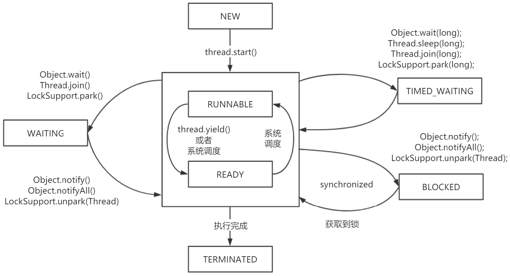
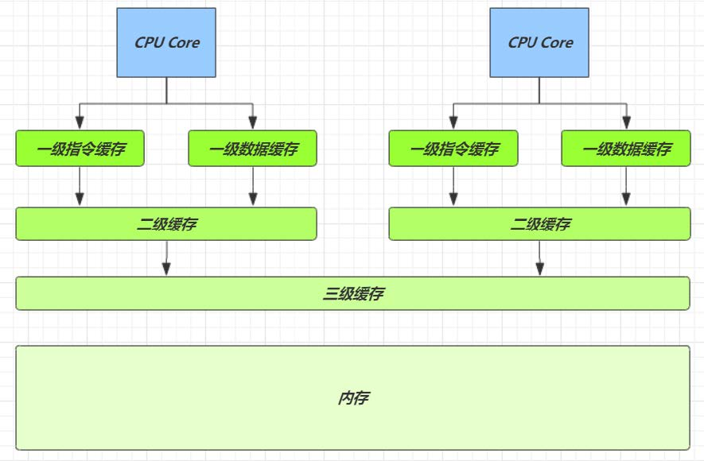
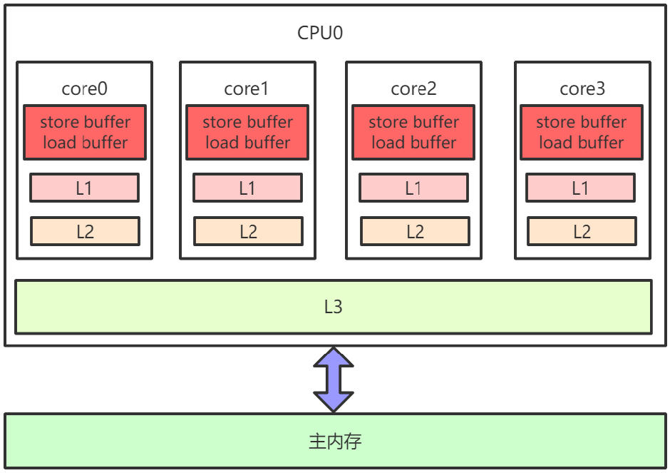
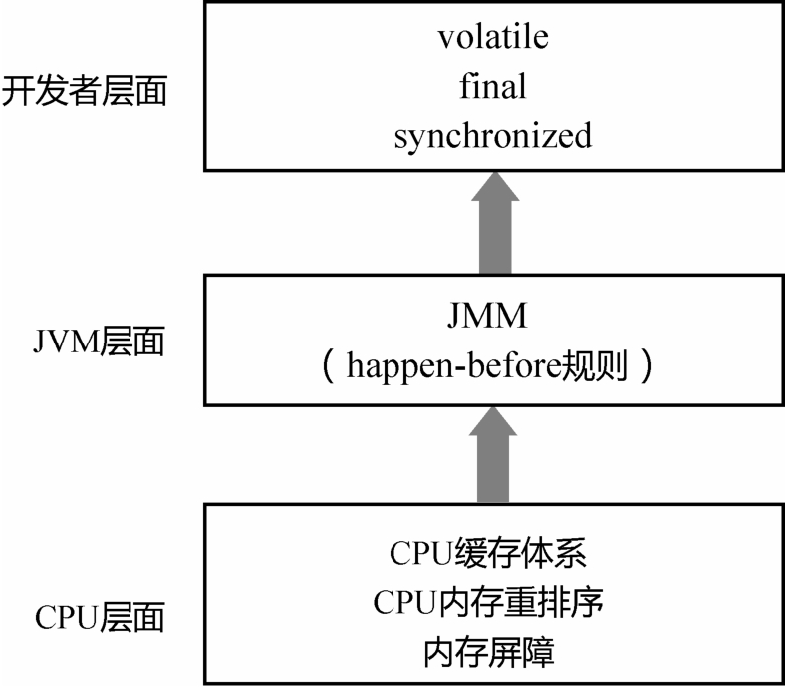
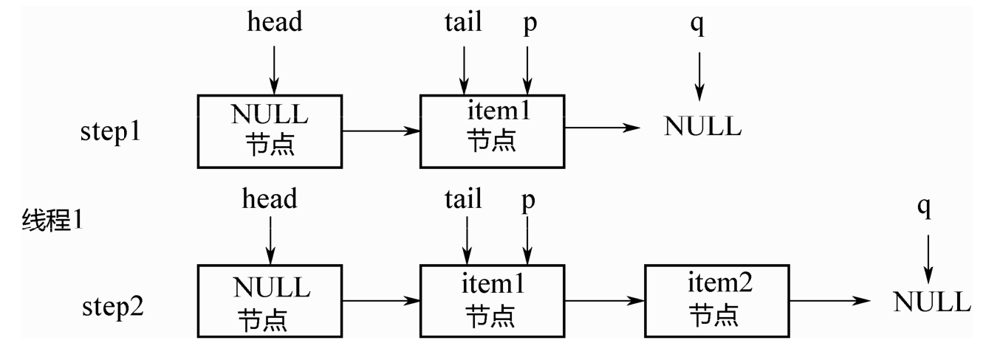

# JUC


# CPU缓存





* 每个CPU内核都有自己的寄存器,寄存器之上值L1(一级缓存),L2,L3以及内存.L3和内存是多核CPU共享
* CPU读数据时先从寄存器读,找不到再到L1,再到L2,依次类推
* CPU从寄存器读数据的时间大概是1cycle(4GHZ的CPU约为0.25ns(纳秒))
* 从L1读数据的时间为3-4cycle,L2为10-20cycle,L3为40-45cycle,内存为120-240cycle
* 因为CPU与内存的速度差异很大,需要靠预读数据至缓存来提升效率.
* 而缓存以缓存行为单位,每个缓存行对应着一块内存,一般是64byte (8个long)
* 缓存的加入会造成数据副本的产生,即同一份数据会缓存在不同核心的缓存行中CPU,要保证数据的一致性,如果某个 CPU 核心更改了数据,其它CPU 核心对应的整个缓存行必须失效


# Striped64


* java.util.concurrent.atomic.Striped64:抽象类


```java
// 累加单元数组,懒加载
transient volatile Cell[] cells;
// 基础值,如果没有竞争,则用cas累加这个域
transient volatile long base;
// 在cells创建或扩容时置为1,表示加锁
transient volatile int cellsBusy;
```


## Cell


* java.util.concurrent.atomic.Striped64.Cell:Striped64内部类,用来分段操作


```java
// Contended:该注解用来防止缓存行的伪共享行为
@sun.misc.Contended static final class Cell {
    volatile long value;
    Cell(long x) { value = x; }
    final boolean cas(long cmp, long val) {
        // 用CAS方式进行累加,cmp表示旧值,val表示新值
        return UNSAFE.compareAndSwapLong(this, valueOffset, cmp, val);
    }

    // Unsafe mechanics
    private static final sun.misc.Unsafe UNSAFE;
    private static final long valueOffset;
    static {
        try {
            UNSAFE = sun.misc.Unsafe.getUnsafe();
            Class<?> ak = Cell.class;
            valueOffset = UNSAFE.objectFieldOffset(ak.getDeclaredField("value"));
        } catch (Exception e) {
            throw new Error(e);
        }
    }
}
```




* 因为Cell是数组,在内存中是连续存储的,一个Cell为24字节(16字节的对象头和 8 字节的 value),因此一个缓存行可以存下 2 个 Cell,这样存的问题是:无论那个CPU缓存中的值修改成功,都会导致另外Core的缓存行失效,降低了效率





* @sun.misc.Contended注解用来解决这个问题,使用此注解的对象或字段会在前后各增加 128 字节大小的padding,从而让 CPU 将对象预读至缓存时占用不同的缓存行,这样,不会造成其他CPU核心缓存行的失效


## LongAdder


* java.util.concurrent.atomic.LongAdder:线程安全类,主要做高并发下的数字运算,效率比AtomicLong高
* `add()`:


```java
public void add(long x) {
    // as 为累加单元数组,b 为基础值, x 为累加值
    Cell[] as; long b, v; int m; Cell a;
    // 1. as 有值, 表示已经发生过竞争, 进入 if
    // 2. cas 给 base 累加时失败了, 表示 base 发生了竞争, 进入 if
    if ((as = cells) != null || !casBase(b = base, b + x)) {
        // uncontended 表示 cell 没有竞争
        boolean uncontended = true;
        if (
            // as 还没有创建
            as == null || (m = as.length - 1) < 0 ||
            // 当前线程对应的 cell 还没有
            (a = as[getProbe() & m]) == null ||
            // cas 给当前线程的 cell 累加失败 uncontended=false ( a 为当前线程的 cell )
            !(uncontended = a.cas(v = a.value, v + x)))
            // 进入 cell 数组创建、cell 创建的流程
            longAccumulate(x, null, uncontended);
    }
}
```


* `longAccumulate()`:








```java
final void longAccumulate(long x, LongBinaryOperator fn,
                          boolean wasUncontended) {
    int h;
    // 当前线程还没有对应的 cell, 需要随机生成一个 h 值用来将当前线程绑定到 cell
    if ((h = getProbe()) == 0) {
        // 初始化 probe
        ThreadLocalRandom.current();
        // h 对应新的 probe 值, 用来对应 cell
        h = getProbe();
        wasUncontended = true;
    }
    // collide 为 true 表示需要扩容
    boolean collide = false;
    for (;;) {
        Cell[] as; Cell a; int n; long v;
        // 已经有了 cells
        if ((as = cells) != null && (n = as.length) > 0) {
            // 还没有 cell
            if ((a = as[(n - 1) & h]) == null) {
                // 为 cellsBusy 加锁, 创建 cell, cell 的初始累加值为 x,成功则 break, 否则继续 continue 循环
                // ......省略代码
            }
            // 有竞争, 改变线程对应的 cell 来重试 cas
            else if (!wasUncontended)
                wasUncontended = true;
            // cas 尝试累加, fn 配合 LongAccumulator 不为 null, 配合 LongAdder 为 null
            else if (a.cas(v = a.value, ((fn == null) ? v + x : fn.applyAsLong(v, x))))
                break;
            // 如果 cells 长度已经超过了最大长度, 或者已经扩容, 改变线程对应的 cell 来重试 cas
            else if (n >= NCPU || cells != as)
                collide = false;
            // 确保 collide 为 false 进入此分支, 就不会进入下面的 else if 进行扩容了
            else if (!collide)
                collide = true;
            // 加锁
            else if (cellsBusy == 0 && casCellsBusy()) {
                // ......省略代码
                // 加锁成功, 扩容
                continue;
            }
            // 改变线程对应的 cell
            h = advanceProbe(h);
        }
        // 还没有 cells, 尝试给 cellsBusy 加锁
        else if (cellsBusy == 0 && cells == as && casCellsBusy()) {
            // 加锁成功, 初始化 cells, 最开始长度为 2, 并填充一个 cell;成功则 break;
            // ......省略代码
        }
        // 上两种情况失败, 尝试给 base 累加
        else if (casBase(v = base, ((fn == null) ? v + x : fn.applyAsLong(v, x))))
            break;
    }
}
```


# Unsafe


* Unsafe 对象提供了非常底层的,操作内存、线程的方法,Unsafe 对象不能直接调用,只能通过反射获得


# defensive copy


* 保护性拷贝,通过创建副本对象来避免共享的手段,如String,底层是创建新的String对象,同时char[]数组也会重新复制一份
* 在JDK8以后,String的底层是byte[],而不是char[]


# Final


* 在编译后的字节码中,final变量的赋值也会通过putfield指令来完成,同样在这条指令之后会加入写屏障,保证其他线程在读到该变量的时候不会出现为0(初始化未赋值)的情况
* 获取final变量的值,是直接复制原值给其他变量或直接输出;若是非final变量,需要从堆中重新获取


# ThreadPoolExecutor


* ThreadPoolExecutor 使用 int 的高 3 位来表示线程池状态,低 29 位表示线程数量

| 状态名     | 高3位 | 接收新任务 | 处理阻塞任务队列 | 说明                                    |
| ---------- | ----- | ---------- | ---------------- | --------------------------------------- |
| RUNNING    | 111   | Y          | Y                |                                         |
| SHUTDOWN   | 000   | N          | Y                | 不会接收新任务,但会处理阻塞队列剩余任务 |
| STOP       | 001   | N          | N                | 会中断正在执行的任务,并抛弃阻塞队列任务 |
| TIDYING    | 010   | -          | -                | 任务全执行完毕,活动线程为 0 即将进入    |
| TERMINATED | 011   | -          | -                | 终结状态                                |

* 从数字上比较,TERMINATED > TIDYING > STOP > SHUTDOWN > RUNNING
* 这些信息存储在一个原子变量 ctl 中,目的是将线程池状态与线程个数合二为一,这样就可以用一次 cas 原子操作进行赋值

```java

private void advanceRunState(int targetState) {
    for (;;) {
        int c = ctl.get();
        if (runStateAtLeast(c, targetState) ||
            // c 为旧值,ctlOf 返回结果为新值
            ctl.compareAndSet(c, ctlOf(targetState, workerCountOf(c))))
            break;
    }
}

// rs 为高 3 位代表线程池状态, wc 为低 29 位代表线程个数,ctl 是合并它们
private static int ctlOf(int rs, int wc) { 
    return rs | wc;
}
```

