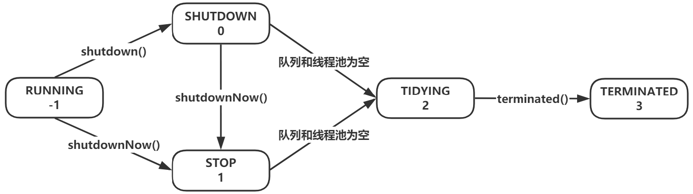
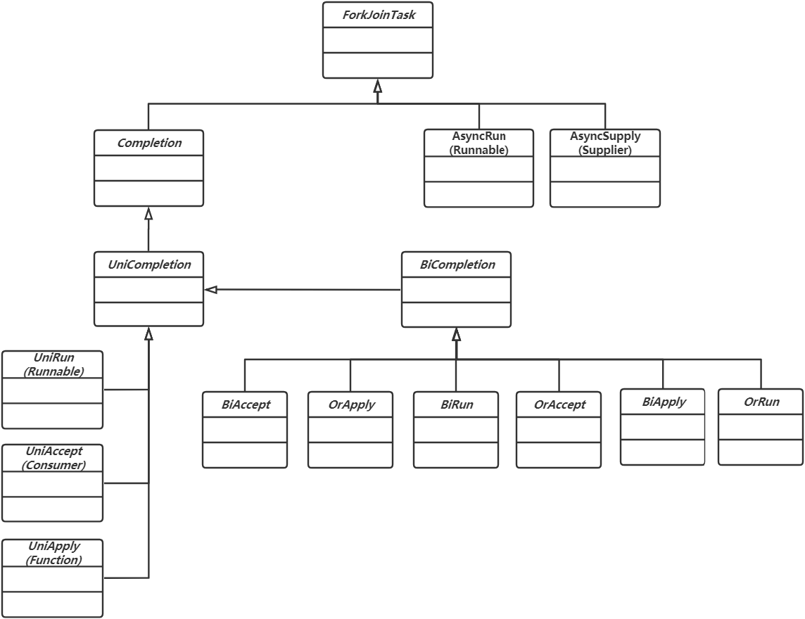
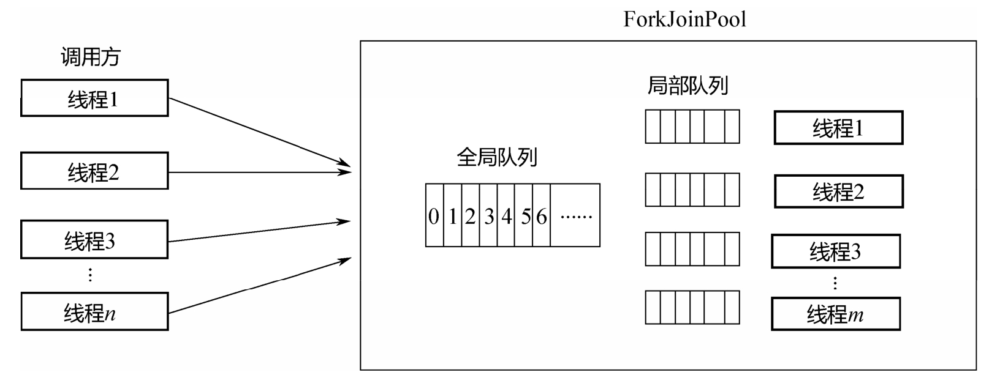
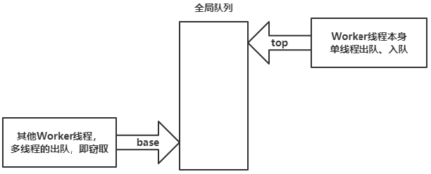
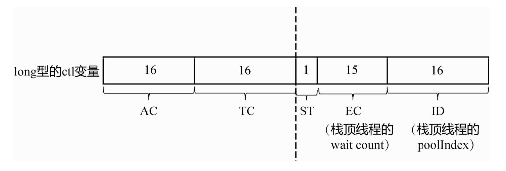

# Thread


# ThreadPoolExecutor


* ThreadPoolExecutor 使用int类型的ctl的高 3 位来表示线程池状态,低 29 位表示线程数量

| 状态名     | 高3位 | 接收新任务 | 处理阻塞任务队列 | 说明                                    |
| ---------- | ----- | ---------- | ---------------- | --------------------------------------- |
| RUNNING    | 111   | Y          | Y                |                                         |
| SHUTDOWN   | 000   | N          | Y                | 不会接收新任务,但会处理阻塞队列剩余任务 |
| STOP       | 001   | N          | N                | 会中断正在执行的任务,并抛弃阻塞队列任务 |
| TIDYING    | 010   | -          | -                | 任务全执行完毕,活动线程为 0 即将进入    |
| TERMINATED | 011   | -          | -                | 终结状态                                |

* 从数字上比较,TERMINATED > TIDYING > STOP > SHUTDOWN > RUNNING
* 这些信息存储在一个原子变量 ctl 中,目的是将线程池状态与线程个数合二为一,这样就可以用一次 cas 操作进行赋值

```java

private void advanceRunState(int targetState) {
    for (;;) {
        int c = ctl.get();
        if (runStateAtLeast(c, targetState) ||
            // c 为旧值,ctlOf 返回结果为新值
            ctl.compareAndSet(c, ctlOf(targetState, workerCountOf(c))))
            break;
    }
}

// rs 为高 3 位代表线程池状态, wc 为低 29 位代表线程个数,ctl 是合并它们
private static int ctlOf(int rs, int wc) { 
    return rs | wc;
}
```


## 线程池状态





## 任务执行过程


```java
private final class Worker extends AbstractQueuedSynchronizer implements
    Runnable {
    final Thread thread;
    // 线程需要运行的第一个任务,可以是null,如果是null,则线程从队列获取任务
    Runnable firstTask;
    // 记录线程执行完成的任务数量,每个线程一个计数器
    volatile long completedTasks;

    Worker(Runnable firstTask) {
        setState(-1); // 线程处于阻塞状态,调用runWorker的时候中断
        // ...
    }
    // ...
}

final void runWorker(Worker w) {
    // ...
    // 中断Worker封装的线程
    w.unlock();
    boolean completedAbruptly = true;
    try {
        // 如果线程初始任务不是null,或者从队列获取的任务不是null,表示该线程应该执行任务
        while (task != null || (task = getTask()) != null) {
            w.lock();
            // 如果线程池停止了,确保线程被中断;如果线程池正在运行,确保线程不被中断
            if ((runStateAtLeast(ctl.get(), STOP) || (Thread.interrupted() && runStateAtLeast(ctl.get(), STOP))) && !wt.isInterrupted())
                // 获取到任务后,再次检查线程池状态,如果发现线程池已经停止,则给自己发中断信号
                wt.interrupt();
            try {
                try {
                    // 执行任务
                    task.run();
                } catch (Throwable ex) {
                    afterExecute(task, ex);
                    throw ex;
                }
            } finally {
                task = null;
                // 线程已完成的任务数加1
                w.completedTasks++;
            }
        }
        // 判断线程是否是正常退出
        completedAbruptly = false;
    } finally {
        // Worker退出
        processWorkerExit(w, completedAbruptly);
    }
}
```


### shutdown()调用情况


* 当调用shutdown()的时候,所有线程都处于空闲状态:这意味着任务队列一定是空的.此时,所有线程都会阻塞在 getTask().然后,所有线程都会收到interruptIdleWorkers()发来的中断信号,getTask()返回null,所有Worker都会退出while循环,之后执行processWorkerExit
* 当调用shutdown()时,所有线程都处于忙碌状态:此时,队列可能是空的,也可能是非空的.interruptIdleWorkers()内部的tryLock调用失败,什么都不会做,所有线程会继续执行自己当前的任务.之后所有线程会执行完队列中的任务,直到队列为空,getTask()才会返回null.之后,就和场景1一样了
* 当调用shutdown()时,部分线程忙碌,部分线程空闲:有部分线程空闲,说明队列一定是空的,这些线程肯定阻塞在 getTask().空闲的这些线程会和场景1一样处理,不空闲的线程会和场景2一样处理


### shutdownNow()调用情况


* 和 shutdown()类似,只是多了清空任务队列步骤.如果一个线程正在执行某个业务代码,即使向它发送中断信号,也没有用,只能等它把代码执行完成.因此,中断空闲线程和中断所有线程的区别并不是很大,除非线程当前刚好阻塞在某个地方
* 当一个Worker最终退出的时候,会执行清理工作


```java
private void processWorkerExit(Worker w, boolean completedAbruptly) {
    // 如果线程正常退出,不会执行if的语句,这里一般是非正常退出,需要将worker数量减一
    // ...
    try {
        completedTaskCount += w.completedTasks;
        // 将自己的worker从集合移除
        workers.remove(w);
    } finally {
        mainLock.unlock();
    }
    // 每个线程在结束的时候都会调用该方法,看是否可以停止线程池
    tryTerminate();
    int c = ctl.get();
    // 如果在线程退出前,发现线程池还没有关闭
    if (runStateLessThan(c, STOP)) {
        if (!completedAbruptly) {
            int min = allowCoreThreadTimeOut ? 0 : corePoolSize;
            // 如果线程池中没有其他线程了,并且任务队列非空
            if (min == 0 && ! workQueue.isEmpty())
                min = 1;
            // 如果工作线程数大于min,表示队列中的任务可以由其他线程执行,退出当前线程
            if (workerCountOf(c) >= min)
                return;
        }
        // 如果当前线程退出前发现线程池没有结束,任务队列不是空的,也没有其他线程来执行就再启动一个线程来处理
        addWorker(null, false);
    }
}
```


# ScheduledThreadPoolExecutor


* withFixedDelay和atFixedRate的区别就体现在setNextRunTime里面:
  * 如果是atFixedRate,period＞0,下一次开始执行时间等于上一次开始执行时间+period
  * 如果是withFixedDelay,period ＜ 0,下一次开始执行时间等于triggerTime(-p),为now+(-period),now即上一次执行的结束时间


# CompletableFuture


## 任务类型的适配





# ForkJoinPool


* 相比于ThreadPoolExecutor,ForkJoinPool可以更好地实现计算的负载均衡,提高资源利用率
* ForkJoinPool可以把大的任务拆分成很多小任务,然后这些小任务被所有的线程执行,从而实现任务计算的负载均衡


## 核心数据结构


* 与ThreadPoolExector不同的是,除一个全局的任务队列之外,每个线程还有一个自己的局部队列





## 工作窃取队列


* 在ForkJoinPool中的全局队列,并非使用BlockingQueue,而是基于一个普通的数组得以实现,这个队列又名工作窃取队列
* 所谓工作窃取算法,是指一个Worker线程在执行完毕自己队列中的任务之后,可以窃取其他线程队列中的任务来执行,从而实现负载均衡,以防有的线程很空闲,有的线程很忙





* Worker线程自己,在队列头部,通过对top指针执行加,减操作,实现入队或出队,这是单线程的
* 其他Worker线程,在队列尾部,通过对base进行累加,实现出队操作,也就是窃取,这是多线程的,需要通过CAS操作
* 这个队列同样被称为`dynamic-cyclic-array`: 
  * 整个队列是环形的,也就是一个数组实现的RingBuffer.并且base会一直累加,不会减小;top会累加,减小.最后,base、top的值都会大于整个数组的长度,只是计算数组下标的时候,会取`top&(queue.length-1)`,`base&(queue.length-1)`.
  * 当top-base==queue.length-1 时,队列为满,此时需要扩容;当top==base时,队列为空,Worker线程即将进入阻塞状态

* 在base一端,是多线程访问的,但它们只会使base变大,也就是使队列中的元素变少,所以队列为满,一定发生在top一端.对top进行累加的时候,这一端却是单线程的,队列的扩容恰好利用了这个单线程的特性,即在扩容过程中,不可能有其他线程对top 进行修改,只有线程对base进行修改,这样就保证了动态扩容的安全性
* 扩容之后,数组长度变成之前的2倍,但top、base的值是不变的,通过top,base对新的数组长度取模,仍然可以定位到元素在新数组中的位置


## 状态控制


### ctl


```java
public class ForkJoinPool extends AbstractExecutorService {
    // 线程池状态变量
    volatile long ctl;
    private static final long SP_MASK    = 0xffffffffL;
    private static final long UC_MASK    = ~SP_MASK;
    private static final int  AC_SHIFT   = 48;
    private static final long AC_UNIT    = 0x0001L << AC_SHIFT;
    private static final long AC_MASK    = 0xffffL << AC_SHIFT;
    private static final int  TC_SHIFT   = 32;
    private static final long TC_UNIT    = 0x0001L << TC_SHIFT;
    private static final long TC_MASK    = 0xffffL << TC_SHIFT;
    private static final long ADD_WORKER = 0x0001L << (TC_SHIFT + 15);

    private static final int  RSLOCK     = 1;
    private static final int  RSIGNAL    = 1 << 1;
    private static final int  STARTED    = 1 << 2;
    private static final int  STOP       = 1 << 29;
    private static final int  TERMINATED = 1 << 30;
    private static final int  SHUTDOWN   = 1 << 31;
    // ...
}
```





* ctl变量的64个比特位被分成五部分: 
  * AC: 最高的16个比特位,表示Active线程数-parallelism,parallelism是上面的构造方法传进去的参数
  * TC: 次高的16个比特位,表示Total线程数-parallelism
  * ST: 1个比特位,如果是1,表示整个ForkJoinPool正在关闭
  * EC: 15个比特位,表示阻塞栈的栈顶线程的wait count
  * ID: 16个比特位,表示阻塞栈的栈顶线程对应的id


### TreiberStack


* 在ForkJoinPool中,没有使用阻塞队列,而是使用了阻塞栈把所有空闲的Worker线程放在一个栈里面,这个栈同样通过链表来实现,名为Treiber Stack
* 下图为所有阻塞的Worker线程组成的Treiber Stack


* 首先,WorkQueue有一个id变量,记录了自己在`WorkQueue[]`的下标,id就相当于每个WorkQueue或ForkJoinWorkerThread对象的地址
* 其次,ForkJoinWorkerThread还有一个stackPred变量,记录了前一个阻塞线程的id,这个stackPred就相当于链表的next指针,把所有的阻塞线程串联在一起,组成一个Treiber Stack
* 最后,ctl变量的最低16位,记录了栈的栈顶线程的id;中间的15位,记录了栈顶线程被阻塞的次数,也称为wait count


### ForkJoinWorkerThread


* ForkJoinPool中的线程状态: 
  * 空闲状态(放在Treiber Stack里面)
  * 活跃状态(正在执行某个ForkJoinTask,未阻塞)
  * 阻塞状态(正在执行某个ForkJoinTask,但阻塞了,于是调用join,等待另外一个任务的结果返回)
* ctl变量很好地反映出了三种状态: 高32位: u=(int) (ctl \>\>\> 32),然后u又拆分成tc、ac 两个16位; 低32位: c=(int) ctl
  * c＞0,说明Treiber Stack不为空,有空闲线程；c=0,说明没有空闲线程
  * ac＞0,说明有活跃线程;ac＜=0,说明没有空闲线程,并且还未超出parallelism
  * tc＞0,说明总线程数 ＞parallelism
* 在通知工作线程的时候,需要判断ctl的状态,如果没有闲置的线程,则开启新线程


## Worker线程的阻塞唤醒


* ForkerJoinPool 没有使用 BlockingQueue,也就不利用其阻塞/唤醒机制,而是利用了park/unpark原语,并自行实现了Treiber Stack


### 阻塞入栈


* 当一个线程窃取不到任何任务,也就是处于空闲状态时就会阻塞入栈


```java
final void runWorker(WorkQueue w) {
    // ...
    for (;;) {
        int phase;
        // 扫描是否有需要执行的一个或多个顶级任务
        // 其中包含了窃取的任务执行,以及线程局部队列中任务的执行
        // 如果发现了就执行,返回true
        // 如果获取不到任务,就需要将该线程入队列,阻塞
        if (scan(w, r)) {
            r ^= r << 13; r ^= r >>> 17; r ^= r << 5;
        }
        // 如果是已经入队列阻塞的,因为phase大于0表示加锁
        else if ((phase = w.phase) >= 0) {
            // ...
        } else {
            // ...
            // 如果ForkJoinPool停止,则break,跳出循环
            if (md < 0){

            }
            // ....
            // phase为1,表示加锁,phase为负数表示入队列
            else if (w.phase < 0)
                // 如果phase小于0,表示阻塞,排队中
                LockSupport.park(this);
            w.source = 0;
        }
    }
}
```


```java
// 从一个队列中扫描一个或多个顶级任务,如果有,就执行;对于非空队列,执行任务,返回true
private boolean scan(WorkQueue w, int r) {
    WorkQueue[] ws; int n;
    // 如果workQueues不是null,并且workQueue的长度大于0,并且w非空,w是线程的workQueue
    if ((ws = workQueues) != null && (n = ws.length) > 0 && w != null) {
        // m是ws长度减一,获取ws顶部workQueue
        for (int m = n - 1, j = r & m;;) {
            WorkQueue q; int b;
            // 随机获取workQueue,如果该workQueue的顶指针和底指针不相等,表示有需要执行的任务
            if ((q = ws[j]) != null && q.top != (b = q.base)) {
                int qid = q.id;
                ForkJoinTask<?>[] a; int cap, k; ForkJoinTask<?> t;
                if ((a = q.array) != null && (cap = a.length) > 0) {
                    // 获取队列顶部任务
                    t = (ForkJoinTask<?>)QA.getAcquire(a, k = (cap - 1) & b);
                    // 如果q的base值没有被别的线程修改过,t不是null,并且将t从数组中移除成功,即可在当前工作线程执行该任务
                    if (q.base == b++ && t != null &&
                        QA.compareAndSet(a, k, t, null)) {
                        // base+1
                        q.base = b;
                        w.source = qid;
                        // 如果还有任务需要执行,通知其他闲置的线程执行
                        if (q.top - b > 0)
                            signalWork();
                        // 让workQueue中的工作线程来执行不管是窃取来的,还是本地的任务,还是从queue中获取的其他任务
                        // 公平起见,添加一个随机的边界;剩下的让别的线程来执行
                        w.topLevelExec(t, q, r & ((n << TOP_BOUND_SHIFT) - 1));
                    }
                }
                return true;
            }
            else if (--n > 0)
                j = (j + 1) & m;
            else
                break;
        }
    }
    return false;
}
```


### 唤醒出栈


* 在新的任务到来之后,空闲的线程被唤醒,其核心逻辑在signalWork()里


### 外部提交任务

 

```java
final void externalPush(ForkJoinTask<?> task) {
    // ...
    for (;;) {
        WorkQueue q;
        int md = mode, n;
        WorkQueue[] ws = workQueues;
        // 如果ForkJoinPool关闭,或者任务队列是null,或者ws的长度小于等于0,拒收任务
        if ((md & SHUTDOWN) != 0 || ws == null || (n = ws.length) <= 0)
            throw new RejectedExecutionException();
        // 如果随机数计算的workQueues索引处的元素为null,则添加队列
        // 即提交任务的时候,是随机向workQueue中添加workQueue,负载均衡的考虑
        else if ((q = ws[(n - 1) & r & SQMASK]) == null) {
            // 计算新workQueue对象的id值
            int qid = (r | QUIET) & ~(FIFO | OWNED);
            Object lock = workerNamePrefix;
            ForkJoinTask<?>[] qa =
                new ForkJoinTask<?>[INITIAL_QUEUE_CAPACITY];
            q = new WorkQueue(this, null);
            // 将任务数组赋值给workQueue
            q.array = qa;
            q.id = qid;
            // 由于是通过客户端线程添加的workQueue,没有前置workQueue;内部提交任务有源workQueue,表示子任务
            q.source = QUIET;
            if (lock != null) {
                synchronized (lock) {
                    WorkQueue[] vs; int i, vn;
                    // 如果workQueues数组不是null,其中有元素,并且qid对应的workQueues中的元素为null,则赋值
                    // 因为有可能其他线程将qid对应的workQueues处的元素设置了,所以需要加锁,并判断元素是否为null
                    if ((vs = workQueues) != null && (vn = vs.length) > 0 &&
                        vs[i = qid & (vn - 1) & SQMASK] == null)
                        vs[i] = q;
                }
            }
        }
        else if (!q.tryLockPhase()) // move if busy
            r = ThreadLocalRandom.advanceProbe(r);
        else {
            // 如果任务添加成功,通知线程池调度,执行
            if (q.lockedPush(task))
                signalWork();
            return;
        }
    }
}
```


* 外部多个线程会调用该方法,所以要加锁,入队列和扩容的逻辑和线程内部的队列基本相同.最后,调用signalWork(),通知一个空闲线程来取


## join


* 线程在执行当前ForkJoinTask的时候,产生了left、right 两个子Task:fork是指把这两个子Task放入队列里面;join则是要等待2个子Task完成.而子Task在执行过程中,会再次产生两个子Task.如此层层嵌套,类似于递归调用,直到最底层的Task计算完成,再一级级返回


### 层层嵌套阻塞


* 线程1在执行 ForkJoinTask1,调用 forkJoinTask2.join(),要等ForkJoinTask2完成,线程1才能返回
* 线程2在执行ForkJoinTask2,调用 forkJoinTask3.join(),要等ForkJoinTask3完成,线程2才能返回
* 线程3在执行ForkJoinTask3
* 线程3首先执行完,然后线程2才能执行完,最后线程1再执行完.如果线程3调用了forkJoinTask1.join(),那么会形成环,造成死锁
* 每个ForkJoinTask都可能有多个线程在等待它完成,有1个线程在执行它,所以每个ForkJoinTask就是一个同步对象,线程在调用join()的时候,阻塞在这个同步对象上面,执行完成之后,再通过这个同步对象通知所有等待的线程
* 利用synchronized和wait()/notify()机制,实现了线程的等待-唤醒机制;调用join()的这些线程,内部其实是调用ForkJoinTask这个对象的wait();执行该任务的Worker线程,在任务执行完毕之后,顺便调用notifyAll()


### 核心实现


```java
public abstract class ForkJoinTask<V> implements Future<V>, Serializable {
    // ...
    private int doJoin() {
        int s; Thread t; ForkJoinWorkerThread wt; ForkJoinPool.WorkQueue w;
        // 如果status < 0表示任务已经完成,不用阻塞,直接返回
        return (s = status) < 0 ? s :
        // 否则判断线程是否是工作线程
        ((t = Thread.currentThread()) instanceof ForkJoinWorkerThread) 
        ?
            // 将任务能够从局部队列弹出,并调用doExec()方法执行成功
            (w = (wt = (ForkJoinWorkerThread)t).workQueue).tryUnpush(this) && (s = doExec()) < 0 
            ?
            s :
        // 否则等待,线程阻塞
        wt.pool.awaitJoin(w, this, 0L) :
        // 如果线程不是工作线程,则外部等待任务完成,线程阻塞
        externalAwaitDone();
    }
    // ...
}
```


# 多线程设计模式


## SingleThreadedExecution


* 指的是以一个线程执行,该模式用于设置限制,以确保同一时间只能让一个线程执行处理
* Single Threaded Execution有时也称为临界区(critical section)或临界域(critical region),Single Threaded Execution侧重于执行处理的线程,临界区或临界域侧重于执行范围
* 比如使用锁或单线程的线程池


### 类图


* 


### 使用场景


* 多线程时:在单线程程序中使用synchronized并不会破坏程序的安全性,但是调用synchronized方法要比调用一般方法花费时间,稍微降低程序性能
* 多个线程访问时:当共享资源有可能被多个线程同时访问时
  * 即便是多线程程序,如果所有线程都是完全独立操作的,也无需使用Single Threaded Execution模式,这种状态称为线程互不干涉
  * 在某些处理多个线程的框架中,有时线程的独立性是由框架控制的.此时,框架的使用者就无需考虑是否使用Single Threaded Execution
* 状态有可能变化时
* 需要确保安全性时


### 死锁


* 使用Single Threaded Execution模式时,存在发生死锁的危险
* 在Single Threaded Execution模式中,满足下列条件时,会发生死锁: 
  * 存在多个共享资源角色
  * 线程在持有某个共享资源角色锁的同时,还想获取其他共享资源角色的锁
  * 获取共享资源角色的锁的顺序不固定(共享资源角色是对称的)


### 临界区的大小和性能


* 一般情况下,Single Threaded Execution模式会降低程序性能: 
  * 获取锁花费时间
  * 线程冲突引起的等待


## Immutable


* Immutable就是不变的,不发生改变.Immutable模式中存在着确保实例状态不发生改变的类,在访问这些实例时不需要执行耗时的互斥处理


### 类图


### 使用场景


* 创建实例后,状态不再发生改变
* 实例是共享的,且被频繁访问时
* 如果需要频繁修改字符串内容,则使用StringBuffer;如果不需要修改字符串内容,只是引用内容,则使用String
* JDK中的不可变模式:`String,BigInteger,Decimal,Pattern,Boolean,Byte,Character,Double,Float,Integer,Long,Short,Void`


## Guarded Suspension


* Guarded表示被守护,被保卫,被保护;Suspension表示暂停.如果执行现在的处理会造成问题,就让执行处理的线程进行等待
* Guarded Suspension模式通过让线程等待来保证实例的安全型,也称为guarded wait,spin lock等


### 时序图


### 角色


* GuardedObject:被保护的对象,是一个持有被保护(guardedMethod)的方法的类.当线程执行guardedMethod方法时,若守护条件成立,立即执行;当守护条件不成立,等待
  * 守护条件随着GuardedObject角色的状态不同而变
  * 除了guardedMethod之外,GuardedObject角色也可以持有其他改变实例状态(stateChangingMethod)的方法
* java中,guardedMethod通过while语句和wait方法来实现,stateChangingMethod通过notify/notifyAll方法实现
* 可以将Guarded Suspension理解为多线程版本的if


## Balking模式


* Balk就是停止并返回的意思.Balking模式与Guarded Suspension模式一样,也存在守护条件.在Balking模式中,如果守护条件不成立,则立即中断处理;而Guarded Suspension模式一直等待直到可以运行


### 角色


* GuardedObject:受保护对象.是一个拥有被保护的方法(guardedMethod)的类.当线程执行guardedMethod时,若保护条件成立,则执行实际的处理,若不成立,则不执行实际的处理,直接返回


### 类图


### 使用场景


* 不需要执行时
* 不需要等待守护条件成立时
* 守护条件仅在第一次成立时


### 结果的表示


* 忽略balk:最简单的方式就是不通知调用端发生了balk
* 通过返回值表示balk:通过boolean或null表示balk
* 通过异常表示balk


### 并发中的超时


* 通过异常通知超时:当发生超时抛出异常时,不适合使用返回值表示超时,需要使用java.util.concurrent.TimeoutException异常
* 通过返回值通知超时:当执行多次try时,则不使用异常,而使用返回值表示超时


## Producer-Consumer


* 生产者-消费者模式


### 时序图


### 角色


* Data:由Producer生成,供Consumer使用
* Producer:生成Data,并将其传递给Channel
* Consumer:从Channel获取Data角色并使用
* Channel:管理从Producer获取的Data,还负责响应Consumer的请求,传递Data.为了安全,Channel会对Producer和Consumer进行互斥处理
* 当Producer将Data传递给Channel时,如果Channel状态不能接收Data,则Producer将一直等待,直到Channel可以接收Data为止
* 当Consumer从Channel获取Data时,如果Channel状态没有可以传递的Data,则Consumer将一直等待,直到Channel状态转变为可以传递Data为止
* 当存在多个Producer和Consumer时,Channel需要对它们做互斥处理


### 类图


## Read-Write Lock


* 在本模式中,读取和写入分开考虑:在执行读取操作之前,线程必须获取用于读取的锁;在执行写入操作之前,线程必须获取用于写入的锁
* 可以多个线程同时读取,读取时不可写入;当线程正在写入时,其他线程不可以读取或写入


### 守护条件


* readLock()和writeLock()都是用了Guarded Suspension模式,Guarded Suspension模式的重点是守护条件


### readLock()


* 读取线程首先调用readLock(),当线程从该方法返回,就可以执行实际的读取操作
* 当线程开始执行实际的读取操作时,只需要判断是否存在正在写入的线程,以及是否存在正在等待写入的线程
* 不考虑读取线程;如果存在正在写入的线程或者存在正在等待的写线程,则等待


### writeLock()


* 在线程开始写入之前,调用writeLock(),当线程从该方法返回后,就可以执行实际的写入操作
* 开始执行写入的条件: 如果有线程正在执行读取操作,出现读写冲突;或者如果有线程正在执行写入的操作,引起写冲突,当前线程等待


### 角色


* Reader:对共享资源执行读取操作
* Writer:对共享资源执行写操作
* SharedResource:共享资源,表示Reader和Writer共享的资源.共享资源提供不修改内部状态的操作(读取)和修改内部状态的操作(写)
* ReadWriteLock:读写锁,提供了共享资源实现读写操作时需要的锁


### 要点


* 利用读读操作的线程之间不会冲突的特性来提高程序性能,因为读操作不会修改共享资源的状态,所以彼此之间无需加锁
* 适合读取操作负载较大的情况
* 适合少写多读.Read-Write Lock模式优点是读读之间不会冲突,如果写入很频繁,写会频繁停止读的处理,影响性能


### 锁的含义


* synchronized可以用于获取实例的锁,Java中同一个对象锁不能由两个以上的线程同时获取
* 用于读的锁和用于写的锁与使用synchronized获取的锁是不一样的,开发人员可以通过修改ReadWriteLock类来改变锁的运行
* ReadWriteLock类提供了用于读取的锁和用于写入的锁两个逻辑锁,但是实现这两个逻辑锁的物理锁只有一个,就是ReadWriteLock实例持有的锁


## Thread-Per-Message


* 该模式可以理解为每个消息一个线程,消息这里可以理解为命令或请求;在该模式中,消息的委托方和执行方是不同的线程


### 角色


* Client(委托方):Client向Host发起请求,而不用关心Host如何实现该请求处理
* Host:Host收到Client请求后,创建并启用一个线程,新建的线程使用Helper角色来处理请求
* Helper:Helper为Host提供请求处理的功能,Host创建的新线程调用Helper角色


### 类图


### 要点


* 提高响应性,缩短延迟时间.能够提高与Client对应的Host的响应性,降低延迟时间,尤其是存在非常耗时操纵时,效果很明显
* 适用于操作顺序没有要求时
* 适用于不需要返回值时,当需要获取操作结果时,可以使用Future模式
* 应用于服务器


## Worker Thread


* 在Worker Thread模式中,工人线程(worker thread)会逐个取回工作并进行处理,当所有工作全部完成后,工人线程会等待新的工作到来
* Worker Thread模式也被称为Background Thread模式,有时也称为Thread Pool模式


### 类图


### 时序图


### 角色


* Client(委托者):创建Request并将其传递给Channel
* Channel:接收来自Client的Request,并将其传递给Worker
* Worker:从Channel中获取Request,并执行其逻辑.当一项工作结束后,继续从Channel获取另外的Request
* Request:表示工作,保存了工作的逻辑


### 要点


* 提高吞吐量
* 容量控制.Worker越多,可以并发处理的逻辑越多,但是会增加消耗的资源
* 调用与执行的分离.这样可以提高响应速度;控制执行顺序,因为执行不受调用顺序的制约;可以取消和反复执行;进行分布式部署,通过网络将Request角色发送到其他Woker计算节点进行处理
* 多态的Request.通过Request的多态,可以增加任务的种类,而无需修改Channel角色和Worker角色


## Future


### 角色


* Client(请求者):向Host发出请求,并立即接收到请求的处理结果—VirtualData,也就是Future.Client不必知道返回值是RealData还是Future,稍后通过VirtualData来操作
* Host:创建新的线程,由新线程创建RealData.同时,Host将Future(当做VirtualData)返回给Client
* VirtualData(虚拟数据):是让Future与RealData具有一致性的角色
* RealData(真实数据):是表示真实数据的角色.创建该对象需要花费很多时间
* Future:是RealData的提货单,由Host传递给Client.对Client而言,Future就是VirtualData.当Client操作Future时线程会wait,直到RealData创建完成.Future将Client的操作委托给RealData


### 要点


* 相比于Thread Per Message模式,Future模式即可以提高程序响应性,还可以获取处理结果
* 可以提高程序吞吐量
* 如果想等待处理完成后获取返回值,还可以考虑采用回调处理方式.即,当处理完成后,由Host启动的线程调用Client的方法,进行结果的处理.此时Client中的方法需要线程安全地传递返回值


### 类图


