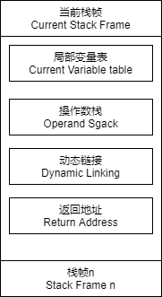

# ClassByteCode


# 概述


* 字节码指令:由一个字节长度的,代表某种特定操作含义的数字,称之为操作码,以及跟随其后的0至多个代表此操作所需参数的操作数而构成
* 在执行每条指令之前,JVM要求该指令的操作数已被压入操作数栈中.在执行指令时,JVM会将该指令所需的操作数弹出,并将指令的结果重新压入栈中
* 操作码的长度为1个字节,因此最大只有256条
* 基于栈的指令集架构
* 在虚拟机的指令集中,大多数的指令都包含了其操作所对应的数据类型信息
* 加载和存储指令用于将数据在栈帧中的局部变量表和操作数栈之间来回传输
* 将局部变量表加载到操作数栈:aload_0
* 将一个数值从操作数栈存储到局部变量表:istore,lfda
* 将一个常量加载到操作数栈:bipush,sipush,ldc,ldc_w,ldc2_w,aconst_null,iconst_m1,iconst
* 扩充局部变量表的访问索引指令:wide
* 

# JVM编译


* 使用javap -vp编译class文件,即可得到JVM指令对应的格式

```java
<index> <opcode> [ <operand1> [ <operand2>... ]] [<comment>]
```

```java
public void spin() {
    int i; 
    for (i = 0; i < 100; i++) {
    }
} 
```

```java
0   iconst_0       // Push int constant 0
1   istore_1       // Store into local variable 1 (i=0)
2   goto 8         // First time through don't increment
5   iinc 1 1       // Increment local variable 1 by 1 (i++)
8   iload_1        // Push local variable 1 (i)
9   bipush 100     // Push int constant 100
11  if_icmplt 5    // Compare and loop if less than (i < 100)
14  return         // Return void when done
```


# 特殊指令


* <clinit>():如果对象中有静态成员变量,静态代码块时才会调用该构造方法
* <init>():调用对象的初始化方法(构造函数)
* i:对int类型的操作
* l:对long类型的操作
* s:对short的操作
* b:对byte类型的操作
* c:对char类型的操作
* f:对float类型的操作
* d:对double类型的操作


# 加载与存储指令


## 常量入栈


* 将一个常量加载到操作数栈顶
* aconst_null:null对象入栈
* iconst_m1:int常量-1入栈,只能让-1入栈,如果是其他负数,需要根据情况使用bipush或sipush
* iconst_n(要入栈的数字):int常量n入栈,n取值范围只能是0-5,超过范围的,根据情况使用bipush或sipush
* lconst_n:long常量n入栈,n取值只能是0,1,超出的用ldc2_w
* fconst_n:float n.0入栈,n只能取值0-2,超出的同iconst
* dconst_n:double n.0 入栈,n取值0-1,超出的用ldc2_w
* bipush:8位带符号整数入栈,取值范围为-128-127,超过的根据情况使用sipush或ldc
* sipush:16位带符号整数入栈,取值范围为-32768-32767,超过的用ldc
* ldc:常量池万能入栈,接收一个8位的参数,该参数指向常量池中int,float或String的索引
* ldc_w:接收两个8位参数,能支持的范围大于ldc
* ldc2_w:压入long或double类型,该参数指向常量池中int,float或String的索引


## 局部变量压栈


* xload_n:将局部变量表中索引为n的局部变量推送至操作数栈的栈顶
  * x: 数据类型,可以是i l f d a,具体表示int,long,float,double,object ref
  * n: 0,1,2,3.表示局部变量表的索引.如果n超过3,则可以使用xload n
* xaload(x为i l f d a b c s)
  * 分别表示int,long,float,double,obj ref ,byte,char,short
  * 从局部变量表数组中取得给定索引的值,将该值压入栈顶
  * iaload
    * 执行前,栈:..., arrayref, index
    * 它取得arrayref所在数组的index的值,并将值压栈
    * 执行后,栈:..., value


## 出栈载入局部变量


* xstore_n:将栈顶数据存储到局部变量表索引n的位置
  * x: 为i l f d a,表示int,long,float,double,object ref
  * n: 0,1,2,3.局部变量表索引为n的位置.如果超过3,使用xstore n
* xastore_n(x为i l f d a b c s)
  * 将值存入数组中
  * iastore
    * 执行前,栈:...,arrayref, index, value
    * 执行后,栈:...
    * 将value存入arrayref[index]


# 运算指令


* 运算指令用于对两个操作数栈上的值进行某种特定的运算,并把结果存储到操作数栈顶
* 加法指令:iadd,ladd,fadd,dadd
* 减法指令:isub,lsub,fsub,dsub
* 乘法指令:imul,lmul,fmul,dmul
* 除法指令:idiv,ldiv,fdiv,ddiv
* 求余指令:irem,lrem,frem,drem
* 取反指令:ineg,lneg,fneg,dneg
* 位移指令:ishl(左移),ishr(右移),iushr(无符号右移),lshl,lshr,lushr
* 按位或指令:ior,lor
* 按位与指令:iand,land
* 按位异或指令:ixor,lxor
* 自增指令:iinc,`i++和++i`在字节码指令上是一样的
* 比较指令:dcmpg,dcmpl,fcmpg,fcmpl,lcmp
  * 对于double和float类型,由于NaN的存在,各有两个版本的比较指令,它们的区别在于在数字比较时,遇到NaN的处理结果不同
  * fcmpg遇到NaN返回1,fcmgl遇到NaN返回-1.指令dcmpl和dcmpg也是类似的
  * `0.0/0.0`会出现NaN
  * 指令lcmp针对long型整数,由于long型整数没有NaN值,故无需准备两套指令


# 类型转换指令


* 类型转换指令可以将两种不同的数值类型进行相互转换,这些转换操作一般用于实现用户代码中的显示类型转换以及处理字节码指令集中数据类型相关指令无法与数据类型一一对应的问题
* 宽化类型处理和窄化类型处理:类似子类转父类和父类转子类,int转long,long转int
* 从int到long,float,double: i2l,i2f,i2d
* 从long到float,double: l2f,l2d
* 从fload到double: f2d
* 从int到byte,short,char: i2b,i2s,i2c
* 从long到int: l2i
* 从long到float,double: l2f,l2d
* 从float到int,long: f2i,f2l
* 从double到int,long,float: d2i,d2l,d2f
* 没有直接转的,可以由多次转达成:如double转byte,先转int,再从int转byte
* 当将一个浮点值窄化转换为整数类型int或long时,将遵循以下转换规则:
  * 如果浮点值是NaN,那转换结果就是int或long类型的0
  * 如果浮点值不是无穷大的话,浮点值使用IEEE 754的向零舍入模式取整,获得整数值V,如果V在目标类型T(int或long)的表示范围之内,那转换结果就是V.否则,将根据V的符号,转换为T所能表示的最大或者最小正数

* 当将一个 double 转换为 float 时,将遵循以下转换规则:通过向最接近数舍入模式舍入一个可以使用float表示的数字,最后结果根据情况判断:
  * 如果转换结果的绝对值太小而无法使用 float来表示,将返回 float类型的正负零
  * 如果转换结果的绝对值太大而无法使用 float来表示,将返回 float类型的正负无穷大
  * 对于double 类型的 NaN值将按规定转换为 float类型的 NaN值


# 对象创建与访问指令


* new:创建普通类实例的指令,接收一个操作数,为指向常量池的索引,表示要创建的类型.执行完后,将对象引入压入栈顶
* newarray:基本类型数组创建
* anewarray:引用类型数组创建
* multianewarray:多维引用数组创建
* getfield:获取字段的值
* putfield:设置字段的值,从操作数栈中弹出
* getstatic:获取静态字段的值
* putstatic:设置静态字段的值
* 把数组元素加载到操作数栈的指令:baload(byte和boolean),caload,saload,iaload,laload,faload,daload,aaload(引用)
  * xaload在执行时,要求操作数栈栈顶元素为数组索引i,栈顶顺位第2个元素为数组引用a,该指令会弹出栈顶这两个元素,并将a[i]重新压入栈

* 将操作数栈的值存储到数组元素(操作堆,而不是局部变量表):bastore,castore,satore,iastore,lastore,fastore,dastore,aastore
  * 在xastore执行前,操作数栈顶需要以此准备3个元素: 值,索引,数组引用,xastore会弹出这3个值,并将值赋给数组中指定索引的位置

* 取数组长度的指令:arraylength,弹出栈顶数组元素,获取数组长度,将长度压入栈顶
* 检查实例类型的指令:
  * instanceof: 同Java关键字instanceof,会将判断结果压入栈顶
  * checkcast: 强转.如果可以强转,不会改变操作数栈,否则抛异常


# 操作数栈管理指令


* 操作数栈指令用于直接操作操作数栈
* pop,pop2:将操作数栈的一个或两个元素出栈,这里的1个或2个是指32位的Slot(槽),Slot是栈帧的基本单位,一个Slot占32字节
* dup,dup2,dup_x1,dup_x2,dup2_x1,dup2_x2:复制栈顶一个或两个数值并将复制或双份值重新压入栈顶
  * 不带_x的指令是复制栈顶数据并压入栈顶.dup2代表要复制的Slot个数
  * 带_x的指令是复制栈顶数据并插入栈顶以下的某个位置.如`dup2_x1`插入到栈顶3个Slot下面

* swap:将栈顶的两个数值交换位置
* nop:什么都不做,主要用来调试,占位


# 控制转移指令


* 控制转移指令可以让JVM有条件或无条件的从指定位置指令执行而不是顺序的从下一条指令继续执行程序,即控制转移指令就是在修改PC寄存器的值
* 条件分支,这些指令接收两个字节的操作数用于计算跳转的位置:
  * ifeq/ifne:如果栈顶元素为0/不为0,则跳转
  * iflt/ifle:小于0/小于等于0,则跳转
  * ifgt/ifge:大于0/大于de等于0,则跳转
  * ifnull/ifnonnull:为null/不为null,则跳转
  * if_icmpeq/if_icmpne:栈顶2个int相同/不同,则跳转
  * if_icmplt/if_icmple:栈顶前1个int小于/小于等于后一个int,则跳转
  * if_icmpgt/if_icmpge:栈顶前1个int大于/大于等于后一个int,则跳转
  * if_acmpeq/if_acmpne:栈顶2个引用类型相同/不同,则跳转
* 复合条件(多条件)分支:tableswitch,lookupswitch.2者的区别在于tableswitch的值连续,效率较高
* 无条件分支:goto,goto_w.goto接收2个字节的的操作数,goto_w接收4个字节的操作数
* 无条件分支:jsr,jsr_w,ret,主要用于try-finally,且已逐渐被废弃
* boolean,byte,char,short的条件分支比较操作都使用int比较指令来完成,而对于long,float,double类型的条件分支比较操作,则会先执行相应类型的比较运算指令,运算指令会返回一个整形值到操作数栈中,随后再执行int类型的条件分支比较操作来完成整个分支跳转
* 所有int类型的条件分支转移指令进行的都是有符号的比较操作


# 方法调用和返回指令


* invokevirtual:用于调用对象的实例方法,根据对象的实际类型进行分派(虚方法分派),这也是Java语言中最常见的方法分派方式
* invokeinterface:用于调用接口方法,它会在运行时搜索一个实现了这个接口方法的对象,找出适合的方法进行调用
* invokespecial:用于调用一些需要特殊处理的实例方法,包括实例初始化方法,私有方法和父类方法.通常根据引用的类型选择方法,而不是对象的类来选择,即它使用静态绑定而不是动态绑定
* invokestatic:用于调用类方法(static方法),这些方法也是静态绑定的
* invokedynamic:调用动态链接方法,用于在运行时动态解析出调用点限定符锁引用的方法并执行
* 方法返回指令是根据返回值的类型区分的,包括有ireturn(当返回值是boolean,byte,char,short,int时使用),lreturn,freturn,dreturn,areturn.return供声明为void的方法,实例初始化方法,类和接口的类初始化方法使用
  * 方法返回时会将栈顶元素弹出并将该元素压入调用者方法的操作数栈中,所有在当前操作数栈中的元素都会被丢弃
  * 如果当前返回的是synchronized方法,还会执行一个隐含的monitorexit执行,退出临界区
  * 最后会丢弃当前方法的整个帧,恢复调用者的帧,并将控制权转交给调用者


# 比较控制指令


# 异常指令


* 在程序中显式抛出异常的操作会由athrow指令实现,除了这种情况,还有别的异常会在Java虚拟机指令检测到异常状况时由虚拟机自动抛出
* 如果程序抛出的异常被主动捕获,会使用异常表处理
* 正常情况下,操作数栈的压入弹出都是一条条指令完成的,唯一的例外情况是在抛异常时,Java 虚拟机会清除操作数栈上的所有内容,而后将异常实例压入调用者操作数栈上
* 当一个异常被抛出时,JVM会在当前的方法里寻找一个匹配的处理,如果没有找到,这个方法会强制结束并弹出当前栈帧,并且异常会重新抛给上层调用的方法(在调用方法栈帧).如果在所有栈帧弹出前仍然没有找到合适的异常处理,这个线程将终止.如果这个异常在最后一个非守护线程里抛出,将会导致JVM自己终止,比如这个线程是个main线程
* 不管什么时候抛出异常,如果异常处理最终匹配了所有异常类型,代码就会继续执行.在这种情况下,如果方法结束后没有抛出异常,仍然执行finally块,在return前,它直接跳到finally块来完成目标


## 异常表


* 如果方法定义了try-catch 或者try-finally的,就会创建一个异常表,它包含了每个异常处理或者finally块的信息.异常表保存了每个异常处理信息:
  * 起始位置
  * 结束位置
  * 程序计数器记录的代码处理的偏移地址
  * 被捕获的异常类在常量池甫的索引
* finally在字节码中会复制2份,如果抛出异常会走异常的一部分;如果有return,则finally中的字节码会复制一份到return之前,见17.案例2


# 同步控制指令


* Java虚拟机可以支持方法级的同步和方法内部一段指令序列的同步,这两种同步结构都是使用管程(Monitor)来支持的
* 方法级的同步是隐式的,无需通过字节码指令来控制的,虚拟机从常量池的方法表结构(method_info)中的ACC_SYNCHRONIZED访问标志区分方法是否同步
  * 当方法调用时,调用指令将会检查方法的ACC_SYNCHRONIZED访问标志是否被设置,如果设置了,执行线程将先持有管程,然后再执行方法,最后方法完成(无论是正常完成还是非正常完成)时释放管程
  * 在方法执行期间,执行线程持有了管程,其他任何线程都无法再获得同一个管程
  * 如果一个同步方法执行期间抛出了异常,并且在方法内部无法处理此异常,那这个同步方法所持有的管程将在异常抛到同步方法之外时自动释放
* monitorenter,monitorexit:JVM指令集使用上述两条指令来支持synchronized标识的同步代码块
  * 当一个线程进入同步代码块时,它使用monitorenter指令请求进入.如果当前对象的监视器计数器为0,则它会被准许进入;若为1,则判断持有当前监视器的线程是否为自己,如果是,则进入,否则进行等待,直到对象的监视器计数器为0,才会被允许进入同步块
  * 当线程退出同步块时,需要使用monitorexit声明退出.在Java虚拟机中,任何对象都有一个监视器与之相关联,用来判对象是否被锁定,当监视器被持有后,对象处于锁定状态
  * monitorenter和monitorexit在执行时,都需要在操作数栈顶压入对象,之后monitorenter和monitorexit的锁定和释放都是针对这个对象的监视器进行的

* 结构化锁定(Structured Locking)是指在方法调用期间每一个管程退出都与前面的管程进入相匹配的情形.因为无法保证所有提交给Java虚拟机执行的代码都满足结构化锁定,所以Java虚拟机允许(但不强制要求)通过以下两条规则来保证结构化锁定成立.假设T代表一条线程,M代表一个管程:
  * T在方法执行时持有管程M的次数必须与T在方法完成(正常和非正常完成)时释放管程M的次数相等
  * 在方法调用过程中,任何时刻都不会出现线程T释放管程M的次数比T持有管程M次数多的情况
  * 在同步方法调用时自动持有和释放管程的过程也被认为是在方法调用期间发生


# 字节码执行引擎


## 运行时栈帧结构





* 栈帧也叫过程活动记录,是编译器用来进行方法调用和方法执行的一种数据结构,他是虚拟机运行时数据区域红的虚拟机栈的栈元素
* 栈帧中包含了局部变量表,操作数栈,动态链接和方法返回地址以及额外的一些附加信息,在编译过程中,局部变量表的大小已经确定,操作数栈深度也已经确定,因此栈帧在运行的过程中需要分配多大的内存是固定的,不受运行时影响
* 对于没有逃逸的对象也会在栈上分配内存,对象的大小其实在云习性时也是确定的,因此即使出现了栈上内存分配,也不会导致栈帧改变大小
* 一个线程中,可能调用链会很长,很多方法都同时处于执行状态
* 对于执行引擎,活动线程中,只有栈顶的栈帧是最有效的,称为当前栈帧,这个栈帧所关联的方法称为当前方法,执行引擎所运行的字节码指令仅对当前栈帧进行操作


## 局部变量表


* 使用Slot(槽)装载基本数据类型,引用,通常为32位,double和long占用2个slot
* 当一个变量的PC寄存器的值大于slot的作用域的时候,slot可以复用


## 操作数栈


* 每一个栈帧内部都包含一个称为操作数栈(Operand Stack)的后进先出栈
* 栈帧中操作数栈的长度由编译期决定,并且存储于类和接口的二进制表示之中,既通过方法的 Code 属性保存及提供给栈帧使用
* 操作数栈不是通过索引来访问,而是通过标准的压栈和出栈访问
* 在上下文明确,不会产生误解的前提下,经常把当前栈帧的操作数栈直接简称为操作数栈
* 操作数栈所属的栈帧在刚刚被创建的时候,操作数栈是空的. Java虚拟机提供一些字节码指令来从局部变量表或者对象实例的字段中复制常量或变量值到操作数栈中,也提供了一些指令用于从操作数栈取走数据,操作数据和把操作结果重新入栈.在方法调用的时候,操作数栈也用来准备调用方法的参数以及接收方法返回结果
* 如iadd字节码指令的作用是将两个 int 类型的数值相加,它要求在执行的之前操作数栈的栈顶已经存在两个由前面其他指令放入的 int 型数值.在 iadd 指令执行时,2个 int 值从操作栈中出栈,相加求和,然后将求和结果重新入栈.在操作数栈中,一项运算常由多个子运算(Subcomputations)嵌套进行,一个子运算过程的结果可以被其他外围运算所使用
* 操作数栈会对压入其中的byte,short,char类型先转换为int,之后再进行操作
* 每一个操作数栈的成员(Entry)可以保存一个Java虚拟机中定义的任意数据类型的值,包括 long 和 double 类型
* 在操作数栈中的数据必须被正确地操作,这里正确操作是指对操作数栈的操作必须与操作数栈栈顶的数据类型相匹配,例如不可以入栈两个 int 类型的数据,然后当作 long 类型去操作他们,或者入栈两个 float 类型的数据,然后使用 iadd 指令去对它们进行求和.有一小部分 Java 虚拟机指令(如dup和swap)可以不关注操作数的具体数据类型,把所有在运行时数据区中的数据当作裸类型(Raw Type)数据来操作,这些指令不可以用来修改数据,也不可以拆散那些原本不可拆分的数据,这些操作的正确性将会通过 Class 文件的校验过程来强制保障
* 在任意时刻,操作数栈都会有一个确定的栈深度,一个 long 或者 double 类型的数据会占用两个单位的栈深度,其他数据类型则会占用一个单位深度


## 动态连接


## 方法返回地址


## 附加信息


* 虚拟机规范中允许具体的虚拟机实现增加一些规范里没有描述的信息到栈帧中,这部分信息完全取决于虚拟机的实现


# 案例1


```java
// 在字节码层面就是先load还是先自增:i++先load,++i先自增
public void test(){
    int i = 10;
    int j = i++;
    
    int m = 20;
    int n = ++m;
}
```


```java
0 bipush 10			 // 从常量池加载常量10,压入栈顶
2 istore_1			// 将10赋值给局部变量表索引为1的变量,即将10赋值给i
3 iload_1			// 从局部变量表中将索引为1的变量压入栈顶,即将10取出压入栈顶
4 iinc 1 by 1		    // 将局部变量表索引为1的变量自增1,即将10自增1,i变为11;栈顶的10不变,弹出
7 istore_2			// 将栈顶弹出的10赋值给局部变量表索引为2的变量,即j赋值为10

8 bipush 20			// 从常量池加载常量20,压入栈顶
10 istore_3			// 将栈顶的20赋值给局部变量表索引为3的变量,即将m赋值为20
11 iinr 3 by 1		    // 将局部变量表中索引为3的变量自增1,即将20自增为21,m变为21
14 iload_3			// 将局部变量表索引为3的值压入栈顶,即将21压入栈顶
15 istore 4			 // 将栈顶的21弹出,赋值给布局变量表索引为4的变量,即n赋值为21
17 return
```


# 案例2


```java
public static String test(){
    String sss = "heiheihei";
    try{
        return sss;
    }finally{
        sss="lalala";
    }
}
```


```java
// 异常表
start pc				end pc					handler pc					catchType
3							5							10								cp_info #0
																							any
```


```java
0 ldc #17 <sss>
2 astore_0
3 aload_0						 // 将sss从局部变量表取出,此时为heiheihei压入栈顶
4 astore_1						// 将heiheihei再存储到局部变量表索引为1的位置
5 ldc #18 <lalala>			  // 从常量池取出lalala压入栈顶
7 astore_0					   // 将lalala存储到局部变量表0的位置,覆盖掉原来的heiheihei
8 aload_1						// 取出局部变量表索引为1的值,此时为heiheihei
9 areturn						// 返回heiheihei
10 astore_2					  // 从异常表中可得:当3到5的程序发生异常,即try中的代码发生异常时,直接跳到10.将异常类型存入局部变量表索引为2的位置
11 ldc #18 <lalala>
13 astore_0
14 aload_2					   // 抛出异常
15 athrow
```

