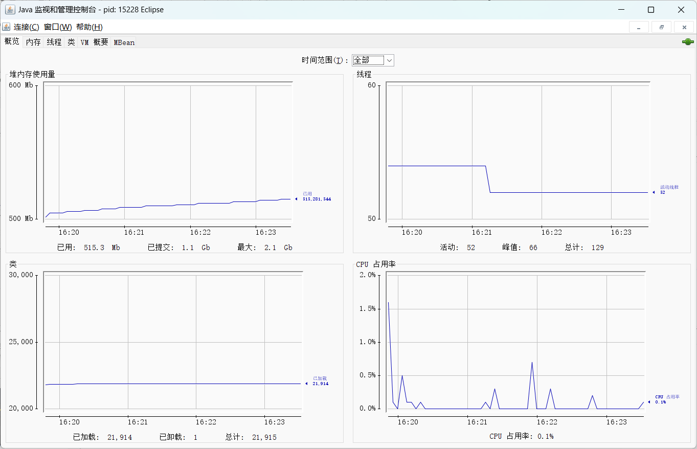
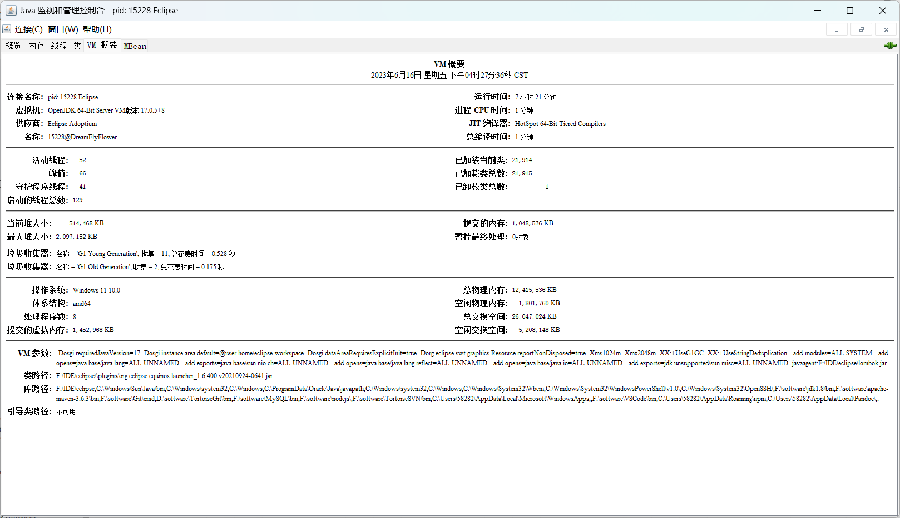
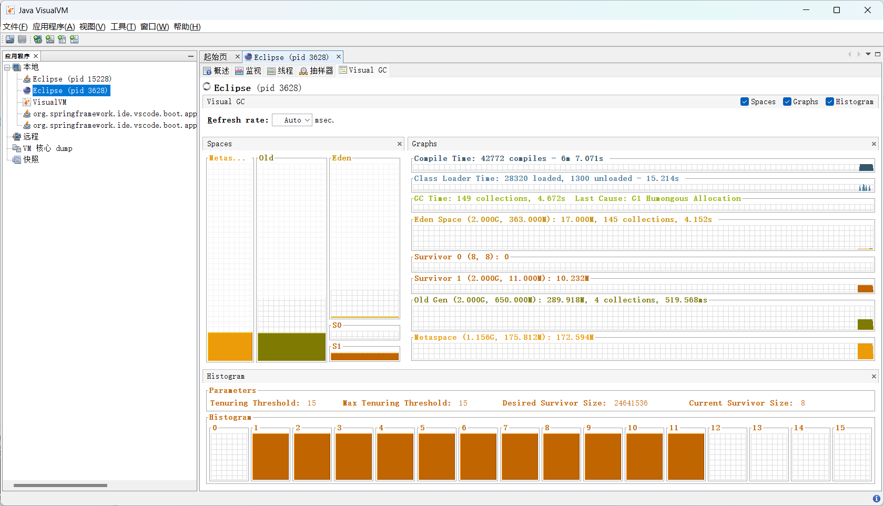
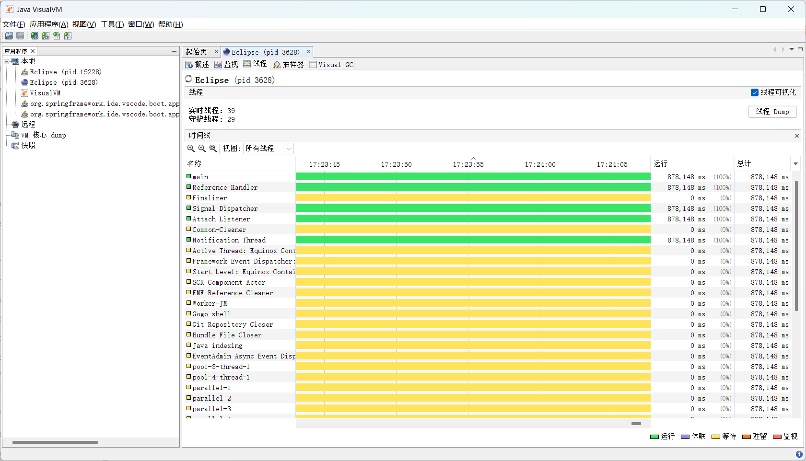
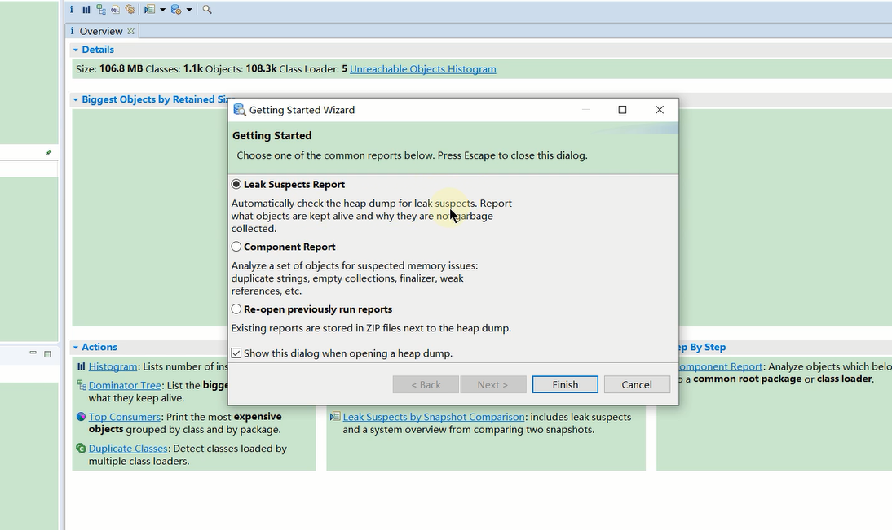
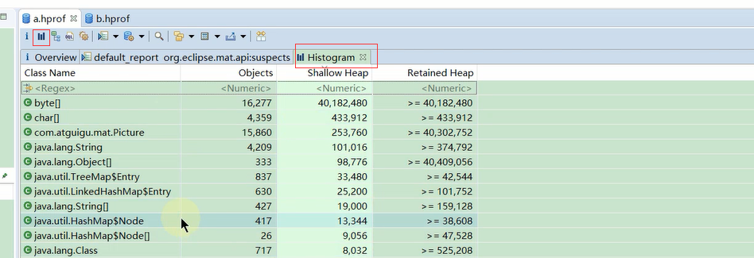
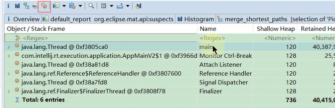

# GC


# GC算法


## 引用计数法


* 比较古老而经典的垃圾收集算法,核心就是在对象被其他对象引用时计数器加1,而当引用失效时则减1


### 优点


* 实时性高,无需等到内存不足时才回收.只要计数为0就可以回收
* 在垃圾回收过程中无需STW.申请内存时不足,直接OOM
* 更新对象的计数器时,只影响该对象区域,不扫描全部对象


### 缺点


* 浪费CPU资源,即使内存够用,仍然在运行计数器的统计
* 最大的缺点是无法处理循环引用的情况,而且每次进行加减操作比较浪费系统性能


## 可达性算法


* 兼具引用计数法的优点,同时解决了循环引用的问题,JVM使用的是该算法
* 可达性分析算法是以根对象集合(GC Roots)为起始点,按照从上至下的方式搜索被根对象集合所连接的目标对象是否可达
* 使用可达性分析算法后,内存中的存活对象都会被根对象集合直接或间接连接着,搜索所走过的路径称为引用链(Reference chain)
* 如果目标对象没有任何引用链相连,则是不可达的,就意味着该对象己经死亡,可以标记为垃圾对象
* 在可达性分析算法中,只有能够被根对象集合直接或者间接连接的对象才是存活对象
* 如果要使用可达性分析算法来判断内存是否可回收,分析工作必须在一个能保障一致性的快照中进行,否则分析结果的准确性就无法保证,这也是导致GC时必须STW的一个重要原因.即使是号称(几乎)不会发生停顿的CMS 收集器中,枚举根节点时也是必须要停顿的


### GC Roots


* 虚拟机栈中引用的对象.比如:各个线程被调用的方法中使用到的参数,局部变量等
* 本地方法栈内JNI(通常说的本地方法)引用的对象
* 方法区中类静态属性引用的对象(JDK8在堆中).比如: Java类的引用类型静态变量
* 方法区中常量引用的对象.比如:字符串常量池 (string Table)里的引用
* 所有被同步锁synchronized持有的对象
* Java虚拟机内部的引用.基本数据类型对应的class对象,一些常驻的异常对象(如:NullPointerException,OutOfMemoryError),系统类加载器
* 反映Java虚拟机内部情况的JMXBean、JVMTI中注册的回调,本地代码缓存等
* 除了这些固定的GC Roots集合以外,根据用户所选用的垃圾收集器以及当前回收的内存区域不同,还可以有其他对象临时性地加入,共同构成完整GC Roots集合.比如: 分代收集和局部回收 (Partial GC)


### 回收判定


* 判定一个对象obj是否可回收,至少要经历两次标记过程:
  * 如果obj到 GC Roots没有引用链,则进行第一次标记
  * 进行筛选,判断obj是否有必要执行finalize()
    * 如果obj没有finalize()或obj重写了finalize()且已经被虚拟机调用过,则obj被判定为不可触及的
    * 如果obj重写了finalize()且还未执行过,那么obj会被插入到F-Queue队列中,由一个虚拟机自动创建的,低优先级的Finalizer线程触发其finalize()并执行
    * finalize()是对象逃脱死亡的最后机会,稍后GC会对F-Queue队列中的对象进行第二次标记.如果obj在finalize()中与引用链上的任何一个对象建立了联系,那么在第二次标记时,obj会被移出即将回收集合.之后,对象再次出现没有引用存在的情况时,finalize()不会被再次调用,对象会直接变成不可触及的状态,也就是说,一个对象的finalize()只会被调用一次


## 标记清除法


* 标记和清除阶段:在标记阶段,首先通过根节点,标记所有可达对象,未被标记的对象就垃圾对象.在清除阶段,线性清除所有未被标记的对象
* 这种方式的缺点就是空间碎片问题,垃圾回收后的空间不是连续的,工作效率要低于连续的内存空间,同时还需要维护一个空闲地址列表
* 清除并不是真的置空,而是把需要清除的对象地址保存在空闲的地址列表里,下次有新对象需要加载时,判断垃圾的位置空间是否足够,够就存放


## 标记压缩法


* 标记压缩法在标记清除法基础上做了优化,把存活的对象压缩到内存一端,而后进行垃圾清理
* Jvm中老年代就是使用的标记压缩法,没有碎片,但是效率偏低


## 复制算法


* 将内存空间分为两块,每次只使用其中一块,在垃圾回收时,将正在使用的内存中的存留对象复制到未被使用的内存块中,之后去清除之前正在使用内存块中所有的对象,反复去交换两个内存的角色,完成垃圾收集
* 适用于新生代垃圾回收,高效,没有碎片,但是浪费空间


## 分代算法


* 根据对象的特点把内存分为N块,而后根据每个内存的特点使用不同的算法:一般分为新生代,老年代,永久代,新生代又分为eden+s0+s1
* 对于新生代和老年代来说,新生代回收的频率更高,每次回收耗时短;老年代回收频率较低,耗时长,所以应该尽量减少老年代的GC
* 一般新生代使用复制算法,老年代使用标记压缩算法


## 分区算法(G1)


* 将整个内存分为N个小的独立空间,每个小空间都可以独立使用,每次GC可以回收多个小空间,而不是对整个空间进行回收
* 分Region回收,优先回收花费时间少,垃圾比例高的Region


## ZGC


* ZGC(Z Garbage Collector)是一款由Oracle公司研发的,以低延迟为首要目标的一款垃圾收集器
* 它是基于动态Region内存布局,不设年龄分代,使用了读屏障,染色指针和内存多重映射等技术来实现可并发的标记-整理算法的收集器
* 在 JDK 11 新加入,回收TB级内存,STW时间不超过10ms
* 优点: 低停顿,高吞吐量, ZGC 收集过程中额外耗费的内存小
* 缺点: 浮动垃圾


## GC停顿(STW)


* Java中一种全局暂停的现象,又称STW(Stop The World),任何一种垃圾回收器都有STW
* 垃圾回收器的任务是标记和回收垃圾对象,为了更高效的执行,大部分情况下,会要求系统进入一个停顿的状态.停顿的目的是终止所有应用线程,只有这样系统才不会有新的垃圾产生,同时保证了系统状态在某一个瞬间的一致性,也有益于更好的标记垃圾对象
* 全局停顿,Java代码停止,native代码可以执行,但不能和JVM交互
* STW多半由于GC引起:Dump线程;死锁检查;堆Dump
* STW长时间服务停顿,没有响应,一旦遇到HA系统,可能引起主备切换


## OopMap和安全点


* 映射表,在HotSpot中的数据结构.一旦类加载动作完成,HotSpot就会把对象内存偏移量上是什么类型的数据计算出来,记录到OopMap
* 在即时编译过程中,也会在特定的位置生成 OopMap,记录栈上和寄存器里哪些位置是引用
* 这些特定的位置主要在以下地方,这些位置就叫作安全点(safepoint):
  * 循环的末尾(非 counted 循环)
  * 方法临返回前 / 调用方法的call指令后
  * 可能抛异常的位置
* 用户程序执行时并非在代码指令流的任意位置都能够在停顿下来开始垃圾收集,而是必须执行到安全点才能够暂停进行GC
* 如何在GC时检查所有线程都跑到附近的安全点停下来:设置一个中断标志,各个线程运行到安全点后主动轮询这个标志,为真就停下来


## 安全区域


* 安全区域是指在一段代码片段中对象的引用关系不会发生变化,在这个区域上的任何位置开始GC都是安全的
* 安全点机制保证了程序执行时,在不太长的时间内就会遇到可进入 GC的 Safepoint,但是,线程处于 sleep 或 Blocked 状态时,线程无法响应 JVM 的中断请求,运行到安全点去中断挂起.对于这种情况,就需要安全区城(Safe Region)来解决
* 当线程运行到Safe Region时,首先标识已经进入了Safe Region,如果这段时间内发生GC,JVM会忽略标识为Safe Region状态的线程
* 当线程即将离开Safe Region时,会检查JVM是否已经完成GC,如果完成了,则继续运行,否则线程必须等待直到收到可以安全离开Safe Region的信号为止


## Remembered Set


* 一个对象可能被其他不同区域引用判断存活,为了保证准确,则需要扫描整个Java堆
* 为解决该问题,无论G1还是其他分代收集器,JVM都是使用Remembered Set来避免全局扫描:
  * 每个Region都有一个对应的Remembered Set,每次Reference类型数据写操作时,都会产生一个write Barrier暂时中断操作
  * 然后检查将要写入的引用指向的对象是否和该Reference类型数据在不同的Region(其他收集器:检查老年代对象是否引用了新生代对象)
  * 如果不同,通过CardTable把相关引用信息记录到引用指向对象的所在Region对应的Remembered Set中.当进行垃圾收集时,在GC根节点的枚举范围加入Remembered Set,就可以保证不进行全局扫描,也不会有遗漏


# 回收器


## 串行回收器


* 使用单线程进行垃圾回收.每次回收时,只有一个工作线程,对于并行能力较弱的计算机来说,串行回收器往往有更好的性能表现
* Serial:新生代回收器;Serial Old(MSC):老年代回收器
* -XX:+UseSerialGC:设置新生代和老年代都使用串行回收器;新生代使用复制算法,老年代使用标记压缩算法


## 并行回收器


### ParNew


* 新生代垃圾回收器,只是简单的将串行回收器多线程化,回收策略,算法和串行回收器一样
* -XX:+UseParNewGC:新生代并行回收器,老年代串行回收器
* -XX:ParallelGCThreads:指定年轻代的回收器线程数,一般最好和CPU核心数相当


### Parallel Scavenge


* Parallel Scavenge,类似ParNew,新生代并行收集器,使用复制算法,老年代标记-压缩算法
* Scavenge和ParNew不同在于根据吞吐量优先原则,自适应调节内存的分配情况
* -XX:+UseParallelGC:新生代使用Parallel Scavenge收集器,老年代默认使用Parallel Old
* -XX:ParallelGCThreads:指定年轻代的回收器线程数,一般最好和CPU核心数相当
  * 当CPU核心数小于8时,该值设置和CPU核心数相同
  * 当CPU核心数大于8时,该值理论上为`3 + (5 * CPU数) / 8`


### ParallelOldGC


* 并行垃圾收集器,适用于老年代
* -XX:+UseParallelOldGC:效果同上,老年代使用Parallel Old,默认会激活年轻代的Parallel Scavenge
* JDK8默认是Parallel Scavenge+Parallel Old


## CMS


* ConcurrentMarkSweep,并发标记清除,使用的是标记清除算法,主要关注STW,针对老年代,默认会在一次FullGC后做整理算法,清理内存碎片
* CMS并不是独占回收器,回收过程中应用程序仍然在工作,会有新的垃圾不断产生,所以在使用CMS的过程中应确保应用程序的内存足够
* CMS不会等到应用程序饱和时才去回收垃圾,而是在某一个阀值的时候开始回收.如果内存使用率增长很快,在CMS执行过程中出现了内存不足的情况,此时回收就会失败,引起`Concurrent Mode Failure`异常,虚拟机将启动Serial Old GC进行垃圾回收,这会导致应用程序中断,直到GC完成后才会正常工作.这个过程GC停顿时间可能较长
* CMS垃圾回收分为4步:
  * 开始标记:仅标记GCRoots能直接关联到的对象,完成后会恢复所有暂停的线程.速度很快,会STW
  * 并发标记:遍历GCRoots,标记所有可达对象.此阶段用户线程仍然在运行,会产生新的垃圾.不会STW,速度慢
  * 重新标记:修正并发标记期间因用户程序继续运作而导致标记产生变动的那一部分对象,会STW,速度快
  * 垃圾回收:并发清理垃圾对象(标记清除算法),不会STW,速度慢

* CMS尽可能降低了STW,但会影响系统整体吞吐量和性能,而且清理不彻底,会产生内存碎片,适用于响应时间要求高的应用
* -XX:+UseConcMarkSweepGC:使用CMS GC,开启后将使用ParNew+CMS+Serial Old收集器组合,Serial Old是为了防止CMS回收失败
* -XX:ConcGCThreads:设置并发垃圾收集的线程数,默认该值是基于ParallelGCThreads计算出来的
* -XX:ParallelCMSThreads:设定CMS的线程数量,默认为`(ParallelThreads + 3)/4`
* -XX:CMSInitiatingOccupancyFraction:指定回收阀值,JDK6以前默认是68,以后是92.即当老年代空间使用率达到92%时,会执行CMS回收
* -XX:+UseCMSCompactAtFullCollection:使用CMS回收器之后,是否进行碎片整理
* -XX:CMSFullGCsBeforeCompaction:设置进行多少次CMS回收之后对内存进行一次压缩
* -XX:+UseCMSInitiatingoccupancyonly:是否动态可调,这个参数可以使CMS一直按CMSInitiatingOccupancyFraction设定的值启动
* -XX:+CMSScavengeBeforeRemark: 强制hotspot虚拟机在cms remark阶段之前做一次minor gc,用于提高remark阶段的速度
* -XX:+CMSClassUnloadingEnable:如果有的话,启用回收Perm 区 (JDK8之前)
* -XX:+CMSParallelInitialEnabled:用于开启CMS initial-mark阶段采用多线程的方式进行标记,用于提高标记速度,在Java8开始已经默认开启
* -XX:+CMSParallelRemarkEnabled:用户开启CMS remark阶段采用多线程的方式进行重新标记,默认开启
* -XX:+ExplicitGCInvokesConcurrent,-XX:+ExplicitGCInvokesConcurrentAndUnloadsClasses:指定hotspot在执行System.gc()时使用CMS周期
* -XX:+CMSPrecleaningEnabled:指定CMS是否需要进行Pre cleaning这个阶段
* CMS在JDK9中已经标记为废除,JDK14直接删除了CMS


## G1


* Garbage First(G1),目标是延迟可控的情况下尽量提高吞吐量.使用分区算法,将堆内存分成了很多不相关的区域(Region)
* Humongous:超大对象.当对象超过Region的一半(1.5倍Region),回收时将直接把该对象分配到老年代中,而不经过S区
* 每个Region只能是一种角色,但是可以相互转换
* 并行性:G1回收期间可多线程同时工作
* 并发性:G1回收时可与应用程序同时执行,在整个GC期间不会完全阻塞应用
* G1是一个分代收集器,区分新生代和老年代,有eden和from/to区,它不要求整个eden或新生代,老年代的空间都连续
* 空间整理:G1在回收过程中,不会像CMS那样在若干次GC后需要进行碎片整理,G1采用了有效复制对象的方式,减少空间碎片
* G1内存的回收是以Region为基本单位的.Region之间是复制算法,但整体上实际可看作是标记-压缩算法,两种算法都可以避免内存碎片.这种特性在分配大对象时不会因为无法找到连续内存空间而提前触发下一次 GC,尤其是当Java堆非常大的时候,G1的优势更加明显
* 可预见性:由于分区的原因,G1可以只选取部分区域进行回收,缩小了回收的范围,提升性能.优先回收花费时间少,垃圾比例高的区域
* G1 跟踪各个 Region里面的垃圾堆积的价值大小(回收所获得的空间大小以及回收所需时间的经验值),在后台维护一个优先列表,每次根据允许的收集时间,优先回收价值最大的Region,即垃圾优先策略-Garbage First
* G1的垃圾回收过程主要包括如下三个环节:
  * 年轻代GC (Young Gc):G1的年轻代收集阶段是一个并行的独占式收集器.在年轻代回收期,G1暂停所有应用程序线程,启动多线程执行年轻代回收.然后从年轻代区间移动存活对象到S区或O区,也有可能是两个区间都会涉及
  * 老年代并发标记过程 (Concurrent Marking):当堆内存使用达到一定值(默认45%)时,开始老年代并发标记过程
  * 混合回收 (Mixed Gc):标记完成后马上开始混合回收.G1从O区移动存活对象到空闲区,这些空闲区间也就成为了老年代的一部分.和年轻代不同,G1的老年代回收器一次只需要扫描/回收一小部分老年代的Region.同时,这个老年代Region是和年轻代一起被回收的
  * Full GC:它针对GC的评估失败提供了一种失败保护机制,即强力回收
* 新生代一般不用手动指定,初始化为整个堆的5%~60%,当达到60%时就会进行垃圾回收
* -XX:+UseG1GC:使用G1回收器,新生代和老年代都是G1.JDK9以后默认使用
* -XX:MaxGCPauseMillis:指定最大停顿时间,默认是200ms.JVM只能尽量保证该时间内完成
* -XX:ParallelGCThreads:设置并行回收的线程数量,最多为8
* -XX:InitiatingHeapOccupancyPercent:触发GC的堆占用率大小,默认45%时触发mixed gc
* -XX:G1HeapRegionSize:1,2,4,8,16,32,只有这几个值,单位是M,分成2048个区域,默认为堆的1/2000
* -XX:ConcGCThreads:设置并发垃圾收集的线程数,默认该值是基于ParallelGCThreads(1/4)计算出来的
* -XX:G1NewSizePercent,-XX:G1MaxNewSizePercent:新生代占用整个堆内存的最小百分比(默认5%) 、最大百分比(默认60%)
* -XX:G1ReservePercent=10:保留内存区域,防止Survivor中的to溢出
* -XX:G1MixedGCLiveThresholdPercent:old区region中存活的对象占用达到了某个百分比时,才会在Mixed GC中被回收.默认85%
* -XX:G1HeapWastePercent:在全局并发标记结束之后,可以知道所有的区有多少空间要被回收,在每次Young GC之后和再次发生Mixed GC之前,会检查垃圾占比是否达到此参数,只有达到了,下次才会发生Mixed GC
* -XX:G1MixedGCCountTarget:一次全局并发标记之后,最多执行Mixed GC的次数,默认是8
* -XX:G1OldCSetRegionThresholdPercent:设置Mixed GC收集周期中要收集的old region数的上限.默认Java堆的10%


## 垃圾回收器组合


* JDK8中废弃了Serial GC+CMS,ParNew GC+Serial Old GC,不建议使用这些组合;在JDK9中彻底移除了这2种组合
* JDK9之后默认使用G1
* JDK14种废弃了Parallel Scavenge GC+Serial Old GC,不建议使用,彻底移除了CMS
* Parallel Scavenge GC和CMS之所以不能组合使用,是因为Parallel Scavenge GC底层框架和CMS不兼容,无法使用
* CMS能和MSC使用是一种备用方案,因为CMS可能回收失败,失败后利用MSC进行垃圾回收


## 查看垃圾回收器


* -XX:+PrintCommandLineFlags:显示当前JVM使用的垃圾回收器以及初始堆配置
* jinfo -flag 相关垃圾回收参数 进程ID:查看相关参数是否使用


## Minor GC


* 也叫Young GC(YGC),主要对年轻代进行垃圾回收,会引起STW
* 对于复制算法来说,当年轻代Eden区域满的时候会触发Minor GC,from/to满不会触发GC
* GC会将Eden和S0的对象复制到S1上,果某个对象存活的时间超过一定Minor gc次数会直接进入老年代,不再分配到S1上
* -XX:+MaxTenuringThreshold:默认15,经过15即从新生代转到老年代


## Major GC


* 老年代GC.老年代空间不足时,会先尝试触发Minor GC,如果之后空间还不足则触发Major GC.只有CMS会单独进行Major GC
* 出现了Major GC,经常会伴随至少一次的Minor GC(并非绝对,Parallel Scavenge GC就有直接进行Major GC的策略)
* Major GC的速度一般会比Minor GC慢10倍以上,STW的时间更长
* 如果Major GC后,内存还不足,就报OOM了


## Full GC


* 用于清理整个堆空间+方法区,它的触发条件主要有以下几种:
  * 显式调用System.gc()(建议JVM触发)
  * 老年代空间不足
  * 方法区空间不足(JDK8及之后不会有这种情况了,详见下文)
* 老年代空间不足引起Full GC的情况比较复杂,有以下几种:
  * 大对象直接进入老年代引起,由-XX:PretenureSizeThreshold参数定义
  * 经历多次Minor GC仍存在的对象进入老年代,由-XX:MaxTenuringThreashold定义
  * Minor GC时,Eden和S0区向S1区复制时,对象大于S1区可用内存,会直接把对象转移到老年代
* JVM的空间分配担保机制可能会触发Full GC:
  * 在进行Minor GC之前,JVM的空间担保分配机制可能会触发上述老年代空间不足引发的Full GC
  * 空间担保分配是指在发生Minor GC之前,虚拟机会检查老年代最大可用的连续空间是否大于新生代所有对象的总空间
    * 如果大于,则此次Minor GC是安全的
    * 如果小于,则虚拟机会查看HandlePromotionFailure设置值是否允许担保失败
    * 如果HandlePromotionFailure=true,那么会继续检查老年代最大可用连续空间是否大于历次晋升到老年代的对象的平均大小,如果大于,则尝试进行一次Minor GC,但这次Minor GC依然是有风险的,失败后会重新发起一次Full GC;如果小于或者HandlePromotionFailure=false,则改为直接进行一次Full GC


# 内存分配策略


* 优先分配到eden
* 大对象直接分配到老年代
* 长期存活的对象分配到老年代
* 空间分配担保:即新生代内存不足时,是否直接MinorGC还是FullGC
  * 在发生Minor GC之前,虚拟机会检查老年代最大可用的连续空间是否大于新生代所有对象的总空间:如果大于,则此次Minor GC是安全的;如果小于,则虚拟机会查看-xx:HandlePromotionFailure设置值是否允许担保失败
    * 如果HandlePromotionFailure=true,则会继续检查老年代最大可用连续空间是否大于历次晋升到老年代的对象的平均大小:如果大于,则尝试进行一次Minor GC,但这次Minor GC依然是有风险的;如果小于,则改为进行一次Full GC
    * 如果HandlePromotionFailure=false,则改为进行一次Full GC

  * 在JDK6之后(JDK7),HandlePromotionFailure参数不会再影响到虚拟机的空间分配担保策略,虽然HandlePromotionFailure参数仍存在,但是在代码中已经不会再使用它.JDK6之后的规则变为只要老年代的连续空间大于新生代对象总大小或者历次晋升的平均大小就会进行Minor GC,否则将进行Full GC

* 动态对象年龄判断:如若S区中相同年龄的所有对象大小总和超过S区的一半,大于等于该年龄的对象直接分配到老年代


# 分代回收流程


* 根据对象大小先分配到适当的分代中
* YGC回收之后,大多数对象会被回收,活着的会进入S0区
* 再次YGC,在Eden区和S0区的进入S1区
* 继续YGC,Eden区+S1区进入S0
* 经过多次YGC(默认15次),在S0或S1区的对象进入老年代
* S0或S1区没有足够大小,也会将对象方法老年代


# 性能指标


* 吞吐量: 运行用户代码的时间占总运行时间的比例(总运行时间:程序的运行时间+内存回收的时间)
* 暂停时间:执行垃圾收集时,程序的工作线程被暂停的时间
* 内存占用: Java 堆区所占的内存大小
* 垃圾收集开销:吞吐量的补数,垃圾收集所用时间与总运行时间的比例
* 收集频率:相对于应用程序的执行,收集操作发生的频率
* 快速:一个对象从诞生到被回收所经历的时间
* 通常前3个是垃圾收集器比较关注的


# 垃圾收集器选择


* 通常选择垃圾收集器标准为吞吐量优先还是响应时间优先
* 如果堆大小不是很大(比如 100M),选择串行收集器一般是效率最高的.参数: `-XX:+UseSerialGC` 
* 如果运行在单核的机器上,选择串行收集器依然是合适的,启用并行收集器没有任何收益.参数: `-XX:+UseSerialGC` 
* 如果应用是吞吐量优先的,并且对较长时间的停顿没有什么特别的要求,选择并行收集器是比较好的.参数: `-XX:+UseParallelGC` 
* 如果应用对响应时间要求较高,想要较少的停顿,甚至1秒的停顿都会引起大量的请求失败,那么选择G1, ZGC, CMS都可以.虽然这些收集器的GC停顿通常都比较短,但它需要一些额外的资源去处理这些工作,通常吞吐量会低一些.参数: `-XX:+UseConcMarkSweepGC` , `-XX:+UseG1GC` , `-XX:+UseZGC` 等
* 从上面这些出发点来看,平常的 Web 服务器,都是对响应性要求非常高的,选择性其实就集中在 CMS、G1、ZGC 上,而对于某些定时任务,使用并行收集器,是一个比较好的选择


# 内存模型


* 每一个线程有一个工作内存和主存独立
* 工作内存存放主存中变量的值的拷贝
* 当数据从主内存复制到工作存储时,必须出现两个动作:
  * 由主内存执行的读(read)操作
  * 由工作内存执行的相应的load操作
* 当数据从工作内存拷贝到主内存时,也出现两个操作:
  * 由工作内存执行的存储(store)操作
  * 由主内存执行的相应的写(write)操作
* 每一个操作都是原子的,即执行期间不会被中断
* 对于普通变量,一个线程中更新的值,不能马上反应在其他变量中.如果需要在其他线程中立即可见,需要使用 volatile 关键字


## Volatile


```java
public class VolatileStopThread extends Thread{
    private volatile boolean stop = false;
    public void stopMe(){
        stop=true;
    }

    public void run(){
        int i=0;
        while(!stop){
            i++;
        }
        System.out.println("Stop thread");
    }

    public static void main(String args[]) throws InterruptedException{
        VolatileStopThread t=new VolatileStopThread();
        t.start();
        Thread.sleep(1000);
        t.stopMe();
        Thread.sleep(1000);
    }
}
```

* 没有volatile,服务运行后无法停止
* 使用volatile之后,一个线程修改了变量,其他线程可以立即知道
* volatile 不能代替锁.一般认为volatile 比锁性能好,但不绝对
* 选择使用volatile的条件是:语义是否满足应用
* 保证可见性的方法
  * volatile
  * synchronized:unlock之前,写变量值回主存
  * final:一旦初始化完成,其他线程就可见


## 有序性


* –在本线程内,操作都是有序的
* 在线程外观察,操作都是无序的。（指令重排 或 主内存同步延时）


## 指令重排


* 指令重排的基本原则:
  * 程序顺序原则: 一个线程内保证语义的串行性
  * volatile规则: volatile变量的写,先发生于读
  * 锁规则: 解锁(unlock)必然发生在随后的加锁(lock)前
  * 传递性: A先于B,B先于C 那么A必然先于C
  * 线程的start方法先于它的每一个动作
  * 线程的所有操作先于线程的终结(Thread.join())
  * 线程的中断(interrupt())于被中断线程的代码
  * 对象的构造函数执行结束先于finalize()方法

```java
class OrderExample {
    int a = 0;
    boolean flag = false;

    public void writer() {
        a = 1;
        flag = true;
    }

    public void reader() {
        if (flag) {
            int i =  a +1;
        }
    }
}
```

* 线程内串行语义
  * 写后读 a = 1;b = a; 写一个变量之后,再读这个位置
  * 写后写 a = 1;a = 2; 写一个变量之后,再写这个变量
  * 读后写 a = b;b = 1; 读一个变量之后,再写这个变量
  * 以上语句不可重排
  * 编译器不考虑多线程间的语义
  * 可重排:a=1;b=2;
* 会破坏线程间的有序性
  * 线程A首先执行writer(),线程B线程接着执行reader()
  * 线程B在int i=a+1 是不一定能看到a已经被赋值为1.因为在writer中,两句话顺序可能打乱
  * 线程A:flag=true;a=1
  * 线程B:flag=true(此时a=0)
* 保证有序性的方法

```java
class OrderExample {
    int a = 0;
    boolean flag = false;
    public synchronized void writer() {
        a = 1;
        flag = true;
    }
    public synchronized void reader() {
        if (flag) {
            int i =  a +1;
        }
    }
}
```

* 同步后,即使做了writer重排,因为互斥的缘故,reader 线程看writer线程也是顺序执行的
* 线程A:flag=true;a=1
* 线程B:flag=true(此时a=1)


## 解释运行


* 解释执行以解释方式运行字节码
* 解释执行的意思是:读一句执行一句


## 编译运行(JIT)


* 将字节码编译成机器码
* 直接执行机器码
* 运行时编译
* 编译后性能有数量级的提升
* 字节码执行性能较差,所以可以对于热点代码编译成机器码再执行,在运行时的编译,叫做JIT Just-In-Time
* JIT的基本思路是将热点代码,就是执行比较频繁的代码,编译成机器码


# Tools


* 在JDK安装目录bin下面有很多工具类,他们依赖lib下的tools.jar


## Jps


* jps []:显示当前服务器上正在运行的Java进程PID和运行的程序名称
* -l:显示程序主函数的完整路径
* -m:显示Java程序启动时的入参,类似main方法运行时输入的args
* -v:显示程序启动时设置的JVM参数
* -q:指定jps只输出进程ID,不输出类的短名称


## Jstat


* `jstat [] [-t] [-hn] pid [interval [count]]`:查看JVM统计信息,如运行状态信息,类装载,内存,垃圾收集,JIT编译的信息,详见Oracle官网[jstat]([jstat (oracle.com)](https://docs.oracle.com/javase/8/docs/technotes/tools/unix/jstat.html))
  * -class:显示ClassLoader的相关信息,类的装载,卸载数量,总空间,类装载所消耗的时间等
  * -gc:显示与GC相关的堆信息.包括Eden区,两个Survivor区,老年代永久代等的容量,已用空间,GC时间合计等信息
  * -gccapacity:显示内容与-gc基本相同,但输出主要关注Java堆各个区域使用到的最大,最小空间
  * -gcutil:显示内容与-gc基本相同,但输出主要关注已使用空间占总空间的百分比
  * -gccause:与-gcutil功能一样,但是会额外输出导致最后一次或当前正在发生的GC产生的原因
  * -gcnew:显示新生代GC状况
  * -gcnewcapacity:显示内容与-gcnew基本相同,输出主要关注使用到的最大,最小空间
  * -geold:显示老年代GC状况
  * -compiler:显示JIT编译器编译过的方法,耗时等信息
  * -printcompilation:输出已经被JIT编译的方法
  * -t:程序从开始运行到执行jstat时总共运行了多少秒
  * -hn:在周期性输出数据时,每隔n次输出一次表头
  * interval:指定输出的时间间隔,单位毫秒
  * count:指定输出的次数


```
S0     S1     E      O      M     CCS    YGC   YGCT    FGC    FGCT     GCT
0.00  98.21   8.39  54.85  93.10  82.54  13    0.261     1    0.145    0.406
```

* jstat -gcutil pid:显示指定程序的gc信息,pid从jps获取
  * S0:新生代的S0使用率
  * S1:新生代S1使用率
  * E:新生代eden使用率
  * O:老年代使用率
  * M:元空间使用率,类似于JDK8以前的永久代
  * CCS:压缩类的空间
  * YGC:新生代垃圾收集的次数
  * YGCT:新生代垃圾收集总共耗费的时间
  * FGC:Full GC次数
  * FGCT:Full GC总共消耗的时间
  * GCT:垃圾回收使用的总时间


## Jinfo


* 实时查看和调整虚拟机的各项参数,详见官网[jinfo]([jinfo (oracle.com)](https://docs.oracle.com/javase/8/docs/technotes/tools/unix/jinfo.html))
* jinfo -flag  虚拟机参数 pid:查看某个进程的虚拟机设置参数
* jinfo -flag [+|-] 虚拟机参数 pid:给指定进程加上(+)或禁用(-)某个虚拟机参数
* jinfo -flag 虚拟机参数key=虚拟机参数value pid:给指定进程的虚拟机参数设置值
* jinfo -flags pid:查看曾经赋值过个一些参数


## Jmap


* `jmap [] pid`:生成Java应用程序的内存快照和对象的统计信息
  * -heap:查看整个堆空间的详细信息,包括GC的使用,堆配置信息,以及内存的使用信息等
  * -permstat:以ClassLoader为统计口径输出永久代的内存状态信息,仅linux系统有效
  * -finalizerinfo:显示在F-Queue中等待Finalize线程执行finalize()的对象,仅linux系统有效
  * -F:当虚拟机进程堆-dump选项没有响应时,可使用此选项强制执行生成dump文件,仅linux系统有效
  * `-histo >f:\his.txt`:查看堆中统计信息,对象数量及大小,并将统计信息输出到指定文件
  * `-histo:live > f:\his.txt`: 只输出存活的对象信息
  * `-dump:format=b,file=f:\heap.hprof`:将内存使用情况输出,使用jhat查看
  * `-dump:live,format=b,file=f:\heap.hprof`:只保存对内存活的对象


## Jhat


* jhat [] dumpfile:查看jmap输出的dump文件,需要单独占用一个端口,可以在页面访问
  * -port 12345:指定Web访问端口,默认7000
  * -stack falseltrue:关闭|打开对象分配调用栈跟踪
  * -refs falseltrue:关闭|打开对象引用跟踪
  * -exclude exclude-file:执行对象查询时需要排除的数据成员
  * -baseline exclude-file:指定一个基准堆转储
  * -debug int:设置debug级别
  * -version:启动后显示版本信息就退出
  * `-J<flag>`:传入启动参数,比如J-Xmx512m


## Jstack


* jstack []:打印线程dump快照,可定位线程停顿过长,死锁,死循环等
  * -l:打印锁信息
  * -m:打印java和native的帧信息
  * -F:强制dump,当jstack没有响应时使用

* 在thread dump中,要留意下面几种状态:
  * 死锁,Deadlock(重点关注)
  * 等待资源,Waiting on condition (重点关注)
  * 等待获取监视器,Waiting on monitor entry (重点关注)
  * 阻塞,Blocked (重点关注)
  * 执行中,Runnable
  * 暂停,Suspended
  * 对象等待中,Object.wait() 或 TIMED_WAITING
  * 停止,Parked


## Jcmd


* jcmd []:实现除了jstat之外的所有命令的功能
* `jcmd [-l]`:列出所有JVM进程
* `jcmd pid -help`:列出指定进程支持的所有命令
* `jcmd pid 具体命令`:执行`jcmd pid -help`得到的其中一个具体命令


## Javap


* 查看class文件的字节码信息
* javap -c test.class:编译test.class文件
* javap -verbose test.class:编译test.class,输出更详细的指令集文件


## Jconsole


* 可视化查看当前虚拟机中基本的信息,例如CPU,堆,栈,类,线程信息
* 在cmd中直接输入该命令会打开一个可视化界面,选择需要监控的程序即可
  * 本地:直接链接本地的Java程序
  * 远程:需要配置远程的用户名和密码

* 在可视化界面中列出了内存,线程(可以检测死锁),类,JVM的相关信息








## JVisualVM


 *          Java虚拟机性能分析工具,jconsole的更强版本,可视化工具,能看到JVM当前几乎所有运行程序的详细信息
 *          需要VisualVM[官网]([VisualVM: Plugins Centers](https://visualvm.github.io/index.html))上下载合适版本
 *          下载完成解压,进入bin,点击visualvm.exe打开,可实时检测Java程序的运行
 *          可以选择安装其他插件,从官网的[插件]([VisualVM: Plugins Centers](https://visualvm.github.io/pluginscenters.html))地址.从VisualVM的工具->插件中安装,Visual GC是必安插件





 *          JDK自带的JVisualVM和下载的独立安装的VisualVM功能是相同的,可以直接控制台打开
 *          可以右键在Java进程上生成堆快照,之后可另存为
 *          在文件->比较快照可以对2个快照进行比较
 *          如果有死锁发生,在线程界面的线程dump可以看到明确的提示,想要查看线程情况,点击线程dump即可





## JProfiler


* GC Roots溯源,类似与VisualVM,收费


## MAT


* Memory Analyzer Tool:基于Eclipse的[软件](http://www.eclipse.org/mat/),可以直接安装在Eclipse(插件Memory Analyzer),也可以单独使用
* 需要先使用JVisualVM或JMap导出内存相关的dump文件,之后导入MAT中进行分析.MAT也可以自己生成dump文件
* MAT自己生成dump文件:File->Acquire Heap Dump





* 导入dump文件之后,会出现上述弹框:
  * Leak Suspects Report:自动检测dump文件中内存泄漏问题
  * Component Report:分析可疑的内存对象,重复字符串,空集合等
  * Re-open previously run reports:打开之前运行的dump文件


### Histogram





* 查看堆中对象总览信息,包括类数量,对象大小,GC Root等.从Overview或上面的小图标可进入直方图
* 点击每个Class Name在左边的Inspector窗口会出现该类的详细信息,包括GC Root
* Shallow Heap:浅堆,指一个对象本身占用的内存,不包括其内部引用的对象大小,但包含指针大小
* Retained Heap:深堆,指只能通过该对象访问到的(直接或间接)所有对象的浅堆之和,即对象被回收后,可以释放的真实空间.等同于保留集中所有浅堆大小之和
* Retained Set:保留集.垃圾回收时只能被对象(包括对象本身)直接或间接访问的所有对象的集合


### Thread Overview





* 线程堆栈信息


## Arthas


* 线上诊断工具,[官网下载](https://github.com/alibaba/arthas/releases)
* 解压后用as.sh启动或用java -jar arthas-boot.jar启动
* 启动后会检测所有Java程序,需要在控制台中根据序号选择,等待启动完成
* 启动完成后是在arthas的终端中,可以输入[命令](https://arthas.aliyun.com/doc/commands.html):
  * dashboard:查看首页
  * thread:查看线程
  * jvm:查看jvm相关信息
  * logger:查看日志
  * memory:查看内存
  * sysprop:系统属性信息
  * heapdump file.hprof:导出堆栈信息
  * jad classname [func]:反编译全类名的字节码.func为方法名,不需要带参数
  * mc classname:将java文件编译成class文件,搭配retransform替换jar包中的class
  * retransform classname:替换jar包中的class文件
  * monitor:方法执行监控
  * watch:方法执行数据观测
  * trace:方法内部调用路径,并输出方法路径上的每个节点上耗时
  * profiler start:启动火焰图
  * profiler getSamples:获得已采样的sample数量
  * profiler stop [filepath]:将火焰图保存到指定目录指定文件,之后可以在Web中访问:`http://localhost:3658/arthas-boot`
* 也可以在Web界面查看信息:`http://localhost:8563`
* 查看arthas的日志:`cat ~/logs/arthas/arthas.log`


## GCViewer


* 免费开源,执行解压目录中的jar包即可启动


## GCEasy


* 在线GC分析工具


# GC输出


```java
public static void main(String[] args) {
    byte[] b = null;
    for (int i = 0; i < 20; i++) {
        b = new byte[1 * 1024 * 1024];
    }
}
```


## Parallel Scavenge


```java
// 设置JVM启动参数:-verbose:gc -XX:+PrintGCDetails -XX:+UseSerialGC -Xmx10m -Xms10m -XX:NewSize=512k
[GC (Allocation Failure) [PSYoungGen: 1976K->496K(2560K)] 8120K->6844K(9728K), 0.0005997 secs] [Times: user=0.00 sys=0.00, real=0.00 secs] 
[GC (Allocation Failure) --[PSYoungGen: 1520K->1520K(2560K)] 7868K->7916K(9728K), 0.0011288 secs] [Times: user=0.00 sys=0.00, real=0.00 secs] 
[Full GC (Ergonomics) [PSYoungGen: 1520K->0K(2560K)] [ParOldGen: 6396K->1644K(7168K)] 7916K->1644K(9728K), [Metaspace: 2657K->2657K(1056768K)], 0.0038580 secs] [Times: user=0.00 sys=0.00, real=0.00 secs] 
[GC (Allocation Failure) [PSYoungGen: 1024K->0K(2560K)] 7788K->6764K(9728K), 0.0002767 secs] [Times: user=0.00 sys=0.00, real=0.00 secs] 
[GC (Allocation Failure) --[PSYoungGen: 1024K->1024K(2560K)] 7788K->7788K(9728K), 0.0002484 secs] [Times: user=0.00 sys=0.00, real=0.00 secs] 
[Full GC (Ergonomics) [PSYoungGen: 1024K->0K(2560K)] [ParOldGen: 6764K->1643K(7168K)] 7788K->1643K(9728K), [Metaspace: 2658K->2658K(1056768K)], 0.0048177 secs] [Times: user=0.00 sys=0.00, real=0.00 secs] 
Heap
 PSYoungGen      total 2560K, used 1044K [0x00000000ffd00000, 0x0000000100000000, 0x0000000100000000)
  eden space 2048K, 51% used [0x00000000ffd00000,0x00000000ffe05370,0x00000000fff00000)
  from space 512K, 0% used [0x00000000fff80000,0x00000000fff80000,0x0000000100000000)
  to   space 512K, 0% used [0x00000000fff00000,0x00000000fff00000,0x00000000fff80000)
 ParOldGen       total 7168K, used 5739K [0x00000000ff600000, 0x00000000ffd00000, 0x00000000ffd00000)
  object space 7168K, 80% used [0x00000000ff600000,0x00000000ffb9aef8,0x00000000ffd00000)
 Metaspace       used 2664K, capacity 4486K, committed 4864K, reserved 1056768K
  class space    used 286K, capacity 386K, committed 512K, reserved 1048576K
```


* JDK8和之前的策略不一样,GC信息也不同
* `GC (Allocation Failure)`:表明进行了一次新生代垃圾回收,且不需要STW
  * 前面没有Full修饰,表明这是一次Minor GC(YGC),有Full表示全收集
  * `Allocation Failure`表明本次引起GC的原因是年轻代中没有足够的空间能够存储新的数据
* `[PSYoungGen: 1976K->496K(2560K)] 8120K->6844K(9728K), 0.0005997 secs]`:
  * `PSYoungGen`:发生垃圾回收的回收器名称简写
    * DefNew:Def New Generation,Serial GC
    * Tenured:Serial Old GC
    * ParNew:ParNew
    * PSYoungGen:Parallel Scavenge
    * ParOldGen:Parallel Old
    * garbage-first heap:G1在新生代的名称
  * `1976K->496K(2560K)`:GC前该区域已使用容量->GC后该区域已使用容量(该内存区域总容量)
  * `8120K->6844K(9728K)`:GC前Java堆已使用容量->GC后Java堆已使用容量(Java堆总容量)
  * `0.0005997 secs`:该内存区域GC所占用的时间
* `[ParOldGen:  6396K->1644K(7168K)] 7916K->1644K(9728K)`:
  * `ParOldGen`:老年代发生垃圾回收
* `[Metaspace: 2657K->2657K(1056768K)], 0.0038580 secs]`:
  * `Metaspace`:元空间发生垃圾回收.JDK1.8之前为compacting perm gen
* `Heap`: 表示堆信息,所有used后面的0x开头一次是内存的起始地址,使用空间结束地址,整体空间结束地址
* `class space`: 元空间中专门给class用来存储的空间
* `[Times: user=0.00 sys=0.00, real=0.00 secs]`:分别表示用户态耗时,内核态耗时和总耗时


## Serial GC


```java
// 设置JVM启动参数:-verbose:gc -XX:+PrintGCDetails -XX:+UseSerialGC -Xmx20m -Xms20m -Xmn1m
[GC (Allocation Failure) [DefNew: 896K->63K(960K), 0.0009520 secs] 896K->628K(20416K), 0.0009838 secs] [Times: user=0.00 sys=0.00, real=0.00 secs] 
[GC (Allocation Failure) [DefNew: 262K->63K(960K), 0.0012891 secs][Tenured: 19079K->1734K(19456K), 0.0012453 secs] 19259K->1734K(20416K), [Metaspace: 2661K->2661K(1056768K)], 0.0025666 secs] [Times: user=0.00 sys=0.00, real=0.00 secs] 
Heap
 def new generation   total 960K, used 18K [0x00000000fec00000, 0x00000000fed00000, 0x00000000fed00000)
  eden space 896K,   2% used [0x00000000fec00000, 0x00000000fec04920, 0x00000000fece0000)
  from space 64K,   0% used [0x00000000fece0000, 0x00000000fece0000, 0x00000000fecf0000)
  to   space 64K,   0% used [0x00000000fecf0000, 0x00000000fecf0000, 0x00000000fed00000)
 tenured generation   total 19456K, used 3782K [0x00000000fed00000, 0x0000000100000000, 0x0000000100000000)
   the space 19456K,  19% used [0x00000000fed00000, 0x00000000ff0b1b90, 0x00000000ff0b1c00, 0x0000000100000000)
 Metaspace       used 2668K, capacity 4486K, committed 4864K, reserved 1056768K
  class space    used 286K, capacity 386K, committed 512K, reserved 1048576K
```
