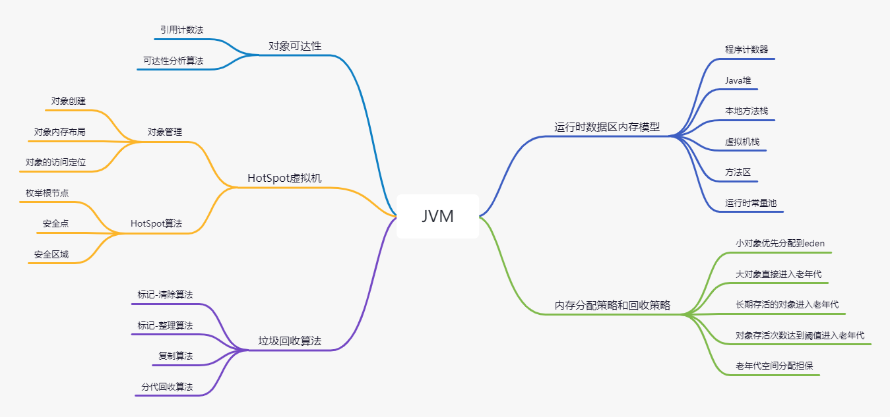
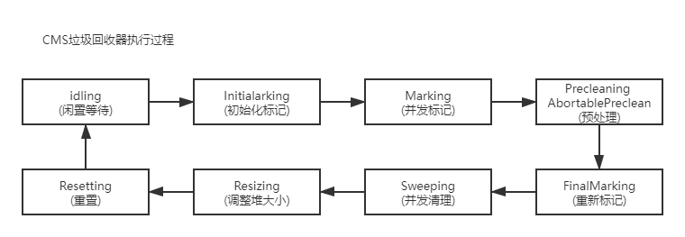
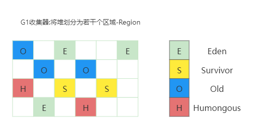

# GC





# GC算法


## 引用计数法

比较古老而经典的垃圾收集算法,核心就是在对象被其他对象引用时计数器加1,而当引用失效时则减1


优点

* 实时性高,无需等到内存不足时才回收.只要计数为0就可以回收
* 在垃圾回收过程中无需STW.申请内存时不足,直接OOM
* 更新对象的计数器时,只影响该对象区域,不扫描全部对象


缺点

* 浪费CPU资源,即使内存够用,仍然在运行计数器的统计
* 最大的缺点是无法处理循环引用的情况,而且每次进行加减操作比较浪费系统性能


## 标记清除法

标记阶段和清除阶段:在标记阶段,首先通过根节点,标记所有从根节点开始的可达对象.因此,未被标记的对象就是未被引用的垃圾对象.在清除阶段,清除所有未被标记的对象

这种方式也有非常大的弊端,就是空间碎片问题,垃圾回收后的空间不是连续的,不连续的内存空间的工作效率要低于连续的内存空间


## 标记压缩法

标记压缩法在标记清除法基础上做了优化,把存活的对象压缩到内存一端,而后进行垃圾清理

Jvm中老年代就是使用的标记压缩法


## 复制算法

核心思想是将内存空间分为两块,每次只使用其中一块,在垃圾回收时,将正在使用的内存中的存留对象复制到未被使用的内存块中,之后去清除之前正在使用内存块中所有的对象,反复去交换两个内存的角色,完成垃圾收集

适用于新生代垃圾回收


## 分代算法

根据对象的特点把内存分为N块,而后根据每个内存的特点使用不同的算法

对于新生代和老年代来说,新生代回收的频率更高,但是每次回收耗时都很短,而老年代回收频率较低,但是耗时比较长,所以应该尽量减少老年代的GC


## 分区算法(G1)

* 将整个内存分为N多个小的独立空间,每个小空间都可以独立使用,这样细粒度的控制一次可以回收多少个小空间,而不是对整个空间进行GC,从而提升性能,并减少Full GC的停顿时间
* 分Region回收,优先回收花费时间少,垃圾比例高的Region
* 每个Region的取值只能是1,2,4,8,16,32,单位M,默认最多有2048块Region
* 新生代一般不用手动指定,初始化为整个堆的5%~60%,当达到60%时就会进行垃圾回收
* -XX:MaxGCPauseMillis=200:设置STW的最大时间
* -XX:G1HeapRegionSize:指定每个Region的大小


## GC停顿(STW)

* Java中一种全局暂停的现象,又称STW(Stop The World)
* 垃圾回收器的任务是识别和回收垃圾对象进行内存清理,为了让垃圾回收器可以高效的执行,大部分情况下,会要求系统进入一个停顿的状态.停顿的目的是终止所有应用线程,只有这样系统才不会有新的垃圾产生,同时停顿保证了系统状态在某一个瞬间的一致性,也有益于更好的标记垃圾对象,因此在垃圾回收时,都会产生应用停顿的现象
* 全局停顿,有Java代码停止,native代码可以执行,但不能和JVM交互
* STW多半由于GC引起:Dump线程;死锁检查;堆Dump
* STW长时间服务停顿,没有响应,一旦遇到HA系统,可能引起主备切换,严重危害生产环境


# 回收器种类


## 串行回收器

* 使用单线程进行垃圾回收.每次回收时,串行回收器只有一个工作线程,对于并行能力较弱的计算机来说,串行回收器的专注性和独占性往往有更好的性能表现.串行回收器可以在新生代和老年代使用.
* -XX:+UseSerialGC:设置新生代和老年代回收器;新生代使用复制算法,老年代使用标记算法


## 并行回收器


### ParNew

* 工作在新生代的垃圾回收器,只是简单的将串行回收器多线程化,回收策略,算法和串行回收器一样
* -XX:+UseParNewGC:新生代并行回收器,老年代串行回收器


### ParallelGC

* 类似ParNew,新生代复制算法,老年代标记-压缩算法
* -XX:+UseParallelGC:使用Parallel收集器,新生代并行.默认会激活老年代的ParallelOldGC
* -XX:+UseParallelOldGC:使用Parallel收集器,并行老年代.默认会激活年轻代的ParallelGC
* -XX:ParallelGCThreads:指定ParNew的回收器线程数,一般最好和CPU核心数相当


## CMS回收器



* ConcurrentMarkSweep,并发标记清除,使用的是标记清除法,主要关注系统停顿时间,针对老年代
* -XX:+UseConcMarkSweepGC:设置是否使用该回收器,开启后将使用ParNew+CMS+Serial Old收集器组合,Serial Old是为了防止CMS在内存使用完之后无法正常垃圾回收的保底策略
* -XX:ConcGCThreads:设置并发线程数
* CMS并不是独占的回收器,即CMS回收过程中,应用程序仍然在不停的工作,又会有新的垃圾不断产生,所以在使用CMS的过程中应该确保应用程序的内存足够
* CMS不会等到应用程序饱和的时候采取回收垃圾,而是在某一个阀值的时候开始回收.如果内存使用率增长的很快,在CMS执行过程中已经出现了内存不足的情况,此时回收就会失败,虚拟机将启动老年代串行回收器进行垃圾回收,这会导致应用程序中断,直到垃圾回收完成后才会正常工作.这个过程GC停顿时间可能较长
* -XX:CMSInitiatingOccupancyFraction:指定回收阀值,默认68,即当老年代空间使用率达到68%时,会执行CMS回收
* -XX:+UseCMSCompactAtFullCollection:使用CMS回收器之后,是否进行碎片整理
* -XX:CMSFullGCsBeforeCompaction:设置进行多少次CMS回收之后对内存进行一次压缩
* 优点是尽可能降低停顿,但会影响系统整体吞吐量和性能,而且清理不彻底.因为在清理阶段,用户线程还在运行,会产生新的垃圾,无法清理干净.因为和用户线程一起运行,不能在空间快满时再清理.如果不幸内存预留空间不够,就会引起concurrent mode failure


## G1回收器



* Humongous:超大对象.当对象超过该区域的一半,回收时将直接把该对象分配到老年代中,而不经过S区
* Garbage First,在jdk1.7中提出的垃圾回收器,从长期来看是为了取代CMS回收器,G1回收器拥有独特的垃圾回收策略,G1属于分代垃圾回收器,区分新生代和老年代,依然有eden和from/to区,它不要求整个eden或新生代,老年代的空间都连续,它使用了分区算法
* 并行性:G1回收期间可多线程同时工作
* 并发性:G1拥有与应用程序交替执行能力,部分工作可与应用程序同时执行,在整个GC期间不会完全阻塞应用
* 分代GC:G1依然是一个分代收集器,但是它是兼顾新生代和老年代一起工作,之前的垃圾收集器在新生代,或老年代工作,这是一个很大的不同
* 空间整理:G1在回收过程中,不会像CMS那样在若干次GC后需要进行碎片整理,G1采用了有效复制对象的方式,减少空间碎片
* 可预见性:由于分区的原因,G1可以只选取部分区域进行回收,缩小了回收的范围,提升性能
* 分区回收,优先回收话费时间少,垃圾比例高的区域
* -XX:+UseG1GC:是否使用G1回收器
* -XX:MaxGCPauseMillis:指定最大停顿时间,默认是200ms
* -XX:ParallelGCThreads:设置并行回收的线程数量
* -XX:InitiatingHeapOccupancyPercent:老年代大小占堆百分比达到45%时触发mixed gc
* -XX:G1HeapRegionSize:1,2,4,8,16,32,只有这几个值,单位是M,分成2048个区域.region有多大,该代码是在headpregion.cpp中


## 次收集(Scavenge)

* 新生代GC(Scavenge GC):指发生在新生代的GC,因为新生代的java对象大多数都是朝生夕死的,所以ScavengeGC比较频繁,一般回收速度也比较快.当eden空间不足时,会触发ScavengeGC
* 一般情况下,当新对象生成,并且在eden申请空间失败时,就会触发ScavengeGC,对eden区域进行GC,清除非存活对象,并且把尚且存活的对象移动到Survivor(新生代的from和to)区.然后整理survivor的两个区.这种方式的GC是对年轻代的eden区进行,不会影响到老年代.


## 全收集

* 老年代(Full GC):发生在老年代的GC,出现了Full GC一般会伴随着至少一次的Scavenge GC
* Full GC的速度一般会比Scavenge GC慢10倍以上
* 当老年代内存不足或显示调用system.gc()时,会触发Full GC


## Minor GC

* 对于复制算法来说,当年轻代Eden区域满的时候会触发一次Minor GC,将Eden和From Survivor的对象复制到另外一块To Survivor上
* 如果某个对象存活的时间超过一定Minor gc次数会直接进入老年代,不再分配到To Survivor上(默认15次,对应虚拟机参数 -XX:+MaxTenuringThreshold)


## Full GC

* 用于清理整个堆空间,它的触发条件主要有以下几种:
  * 显式调用System.gc方法(建议JVM触发)
  * 方法区空间不足(JDK8及之后不会有这种情况了,详见下文)
* 老年代空间不足,引起Full GC.这种情况比较复杂,有以下几种:
  * 大对象直接进入老年代引起,由-XX:PretenureSizeThreshold参数定义
  * 经历多次Minor GC仍存在的对象进入老年代,由-XX:MaxTenuringThreashold定义
  * Minor GC时,动态对象年龄判定机制会将对象提前转移老年代.年龄从小到大进行累加,当加入某个年龄段后,累加和超过survivor区域-XX:TargetSurvivorRatio的时候,从这个年龄段往上的年龄的对象进入老年代
  * Minor GC时,Eden和From Space区向To Space区复制时,大于To Space区可用内存,会直接把对象转移到老年代

* JVM的空间分配担保机制可能会触发Full GC:
  * 在进行Minor GC之前,JVM的空间担保分配机制可能会触发上述老年代空间不足引发的Full GC
  * 空间担保分配是指在发生Minor GC之前,虚拟机会检查老年代最大可用的连续空间是否大于新生代所有对象的总空间
    * 如果大于,则此次Minor GC是安全的
    * 如果小于,则虚拟机会查看HandlePromotionFailure设置值是否允许担保失败
    * 如果HandlePromotionFailure=true,那么会继续检查老年代最大可用连续空间是否大于历次晋升到老年代的对象的平均大小,如果大于,则尝试进行一次Minor GC,但这次Minor GC依然是有风险的,失败后会重新发起一次Full GC;如果小于或者HandlePromotionFailure=false,则改为直接进行一次Full GC


# 内存分配策略

* 优先分配到eden
* 大对象直接分配到老年代
* 长期存活的对象分配到老年代
* 空间分配担保:即新生代内存不足时,可能会向老年代借用内存
* 动态对象年龄判断


# 对象


## 结构


* Header:对象头,存储对象的源数据
  * 自身运行时数据:哈希值,GC分代年龄,锁动态标志,线程持有的锁,偏向线程ID,偏向时间戳
  * 类型指针:对象指向类的源数据指针,虚拟机通过该值确实对象是那个类的实例
* InstanceData:实例数据
* Padding:无实际意义,主要用来填充以达到字节数为8的倍数


## 创建

* new 类名
* 根据new的参数在常量池中定义一个类的符号引用
* 如果没有找到这个符号引用,说明类还没有被加载,则进行类加载,解析和初始化
* 虚拟机在堆中为对象分配内存
* 将分配的内存初始化为零值,不包含对象头
* 调用对象的初始化方法


# 内存模型


* 每一个线程有一个工作内存和主存独立
* 工作内存存放主存中变量的值的拷贝
* 当数据从主内存复制到工作存储时,必须出现两个动作:
  * 由主内存执行的读(read)操作
  * 由工作内存执行的相应的load操作
* 当数据从工作内存拷贝到主内存时,也出现两个操作:
  * 由工作内存执行的存储(store)操作
  * 由主内存执行的相应的写(write)操作
* 每一个操作都是原子的,即执行期间不会被中断
* 对于普通变量,一个线程中更新的值,不能马上反应在其他变量中.如果需要在其他线程中立即可见,需要使用 volatile 关键字


## Volatile


```java
public class VolatileStopThread extends Thread{
    private volatile boolean stop = false;
    public void stopMe(){
        stop=true;
    }

    public void run(){
        int i=0;
        while(!stop){
            i++;
        }
        System.out.println("Stop thread");
    }

    public static void main(String args[]) throws InterruptedException{
        VolatileStopThread t=new VolatileStopThread();
        t.start();
        Thread.sleep(1000);
        t.stopMe();
        Thread.sleep(1000);
    }
}
```

* 没有volatile,服务运行后无法停止
* 使用volatile之后,一个线程修改了变量,其他线程可以立即知道
* volatile 不能代替锁.一般认为volatile 比锁性能好,但不绝对
* 选择使用volatile的条件是:语义是否满足应用
* 保证可见性的方法
  * volatile
  * synchronized:unlock之前,写变量值回主存
  * final:一旦初始化完成,其他线程就可见


## 有序性

* –在本线程内,操作都是有序的
* 在线程外观察,操作都是无序的。（指令重排 或 主内存同步延时）


## 指令重排


* 指令重排的基本原则:
  * 程序顺序原则：一个线程内保证语义的串行性
  * volatile规则：volatile变量的写,先发生于读
  * 锁规则：解锁(unlock)必然发生在随后的加锁(lock)前
  * 传递性：A先于B,B先于C 那么A必然先于C
  * 线程的start方法先于它的每一个动作
  * 线程的所有操作先于线程的终结（Thread.join()）
  * 线程的中断（interrupt()）先于被中断线程的代码
  * 对象的构造函数执行结束先于finalize()方法

```java
class OrderExample {
    int a = 0;
    boolean flag = false;

    public void writer() {
        a = 1;
        flag = true;
    }

    public void reader() {
        if (flag) {
            int i =  a +1;
        }
    }
}
```

* 线程内串行语义
  * 写后读 a = 1;b = a; 写一个变量之后,再读这个位置
  * 写后写 a = 1;a = 2; 写一个变量之后,再写这个变量
  * 读后写 a = b;b = 1; 读一个变量之后,再写这个变量
  * 以上语句不可重排
  * 编译器不考虑多线程间的语义
  * 可重排:a=1;b=2;
* 会破坏线程间的有序性
  * 线程A首先执行writer(),线程B线程接着执行reader()
  * 线程B在int i=a+1 是不一定能看到a已经被赋值为1.因为在writer中,两句话顺序可能打乱
  * 线程A:flag=true;a=1
  * 线程B:flag=true(此时a=0)
* 保证有序性的方法

```java
class OrderExample {
    int a = 0;
    boolean flag = false;
    public synchronized void writer() {
        a = 1;
        flag = true;
    }
    public synchronized void reader() {
        if (flag) {
            int i =  a +1;
        }
    }
}
```

* 同步后,即使做了writer重排,因为互斥的缘故,reader 线程看writer线程也是顺序执行的
* 线程A:flag=true;a=1
* 线程B:flag=true(此时a=1)


## 解释运行

* 解释执行以解释方式运行字节码
* 解释执行的意思是:读一句执行一句


## 编译运行(JIT)

* 将字节码编译成机器码
* 直接执行机器码
* 运行时编译
* 编译后性能有数量级的提升
* 字节码执行性能较差,所以可以对于热点代码编译成机器码再执行,在运行时的编译,叫做JIT Just-In-Time
* JIT的基本思路是将热点代码,就是执行比较频繁的代码,编译成机器码


# Tools


在JDK安装目录bin下面有很多工具类,他们依赖lib下面的tools.jar


## Jps

* 显示当前服务器上的Java进程PID和运行的程序名称
* -l:显示程序主函数的完成路径
* -m:显示Java程序启动时的入参,类似main方法运行时输入的args
* -v:显示程序启动时设置的JVM参数
* -q:指定jps只输出进程ID,不输出类的短名称


## Jstat

* 运行状态信息,如类装载,内存,垃圾收集,jit编译的信息,详见Oracle官网[jstat]([jstat (oracle.com)](https://docs.oracle.com/javase/8/docs/technotes/tools/unix/jstat.html))

```
S0     S1     E      O      M     CCS    YGC   YGCT    FGC    FGCT     GCT
0.00  98.21   8.39  54.85  93.10  82.54  13    0.261     1    0.145    0.406
```

* jstat -gcutil pid:显示指定程序的gc信息,pid从jps获取
  * S0:新生代的S0使用率
  * S1:新生代S1使用率
  * E:新生代eden使用率
  * O:老年代使用率
  * M:元空间使用率,类似于JDK8以前的永久代
  * CCS:压缩类的空间
  * YGC:新生代垃圾收集的次数
  * YGCT:新生代垃圾收集总共耗费的时间
  * FGC:Full GC次数
  * FGCT:Full GC总共消耗的时间
  * GCT:垃圾回收使用的总时间
* jstat -gcutil pid interval count:监控间隔时间指定次数的gc.count为监控次数,interval为间隔时间,单位毫秒


## Jinfo

* 实时查看和调整虚拟机的各项参数,详见官网[jinfo]([jinfo (oracle.com)](https://docs.oracle.com/javase/8/docs/technotes/tools/unix/jinfo.html))
* jinfo -flag  虚拟机参数 pid:查看某个进程的虚拟机设置参数
* jinfo -flag [+|-] 虚拟机参数 pid:给指定进程加上(+)或禁用(-)某个虚拟机参数
* jinfo -flag 虚拟机参数key=虚拟机参数value pid:给指定进程的虚拟机参数设置值


## Jmap

* 生成Java应用程序的堆快照和对象的统计信息
* jmap -heap pid:查看堆信息
* jmap -histo pid >c:\s.txt:查看内存中对象数量及大小,并将统计信息输出到指定目录指定文件
* jmap -dump:format=b,file=c:\heap.hprof pid:将内存使用情况输出,使用jhat查看


## Jhat

* 查看jmap输出的dump文件,需要单独占用一个端口,可以在页面访问
* jhat -port 12345 dump文件:分析dump文件,网页可通过ip:12345访问


## Jstack

* 打印线程dump
* -l:打印锁信息
* -m:打印java和native的帧信息
* -F:强制dump,当jstack没有响应时使用


## Jconsole

* 可视化查看当前虚拟机中基本的信息,例如CPI,堆,栈,类,线程信息
* 在windows上直接输入该命令会打开一个可视化界面,选择需要监控的程序即可
* 在可视化界面中列出了内存,线程(可以检测死锁),类,JVM的相关信息


## Visualvm

 *          Java虚拟机性能分析工具,jconsole的更强版本,可视化工具,能看到JVM当前几乎所有运行程序的详细信息
 *          需要VisualVM[官网]([VisualVM: Plugins Centers](https://visualvm.github.io/index.html))上下载合适版本
 *          下载完成解压,进入bin,点击visualvm.exe打开,可实时检测Java程序的运行
 *          可以选择安装其他插件,从官网的[插件]([VisualVM: Plugins Centers](https://visualvm.github.io/pluginscenters.html))地址.从VisualVM的工具->插件中安装


## Javap

* 查看class文件的字节码信息
* javap -c test.class:编译test.class文件
* javap -verbose test.class:编译test.class,输出更详细的指令集文件


## MAT

* Memory Analyzer Tool:基于Eclipse的[软件](http://www.eclipse.org/mat/),可以直接安装在Eclipse,也可以单独使用
* 需要先导出内存相关的dump文件,之后导入MAT中进行分析


# JVM参数

* 所有参数示例可参见dream-study-java-common项目的com.wy.jvm包

* -Dname=value:设置启动参数,main方法中可读取

* -verbose:gc:可以打印GC的简要信息

  ```java
  [GC 4790K->374K(15872K), 0.0001606 secs]
  [GC 4790K->374K(15872K), 0.0001474 secs]
  [GC 4790K->374K(15872K), 0.0001563 secs]
  [GC 4790K->374K(15872K), 0.0001682 secs]
  ```

* -XX:+PrintGC:当虚拟机启动后,只要遇到GC就会打印日志

* -XX:+PrintGCDetails:可以查看详细信息,包括各个区的情况

  ```java
  // DefNew:新生代默认使用的垃圾收集器
  // Tenured:老年代
  // ParNew:新生代使用的并行垃圾回收器,Parallel New Generation
  // PSYoungGen:新生代使用的并行垃圾回收器,Parallel Scavenge
  // ParOldGen:老年代使用的并行垃圾回收器,Parallel Old Generation
  // eden为新生代伊甸区,from是s0,to是s1,tenured是老年代,compacting是JDK1.8之前的永久代,JDK1.8称为元空间Metaspace
  Heap
   def new generation  total 13824K, used 11223K [0x27e80000,0x28d80000,0x28d80000)
    eden space 12288K, 91% used [0x27e80000, 0x28975f20, 0x28a80000)
    from space 1536K,  0% used [0x28a80000, 0x28a80000, 0x28c00000)
    to   space 1536K,  0% used [0x28c00000, 0x28c00000, 0x28d80000)
   tenured generation  total 5120K, used 0K [0x28d80000, 0x29280000, 0x34680000)
     the space 5120K,  0% used [0x28d80000, 0x28d80000, 0x28d80200, 0x29280000)
   compacting perm gen total 12288K, used 142K [0x34680000, 0x35280000, 0x38680000)
     the space 12288K, 1% used [0x34680000, 0x346a3a90, 0x346a3c00, 0x35280000)
      ro space 10240K, 44% used [0x38680000, 0x38af73f0, 0x38af7400, 0x39080000)
      rw space 12288K, 52% used [0x39080000, 0x396cdd28, 0x396cde00, 0x39c80000)
  ```

* -XX:+PrintGCTimeStamps:打印CG发生的时间戳

* -XX:+PrintHeapAtGC:每次一次GC后,都打印堆信息

* -XX:+TraceClassLoading:监控类的加载

  ```java
  [Loaded java.lang.Object from shared objects file]
  [Loaded java.io.Serializable from shared objects file]
  [Loaded java.lang.Comparable from shared objects file]
  [Loaded java.lang.CharSequence from shared objects file]
  [Loaded java.lang.String from shared objects file]
  [Loaded java.lang.reflect.GenericDeclaration from shared objects file]
  [Loaded java.lang.reflect.Type from shared objects file]
  ```

* -XX:+PrintClassHistogram:按下Ctrl+Break后,打印类的信息

  ```java
   // 分别显示:序号,实例数量,总大小,类型
   num     #instances         #bytes  class name
  ----------------------------------------------
     1:        890617      470266000  [B
     2:        890643       21375432  java.util.HashMap$Node
     3:        890608       14249728  java.lang.Long
     4:            13        8389712  [Ljava.util.HashMap$Node;
     5:          2062         371680  [C
     6:           463          41904  java.lang.Class
  ```

* -Xloggc:filePath:指定GC日志的位置,以文件形式输出

* -XX:+PrintFlagsFinal:运行java命令时打印参数.=表示默认值,:=表示被修改的值

* -XX:+PrintCommandLineFlags:显示当前JVM使用的垃圾回收器以及初始堆配置

  ```shell
  java -XX:+PrintCommandLineFlags -version
  
  -XX:InitialHeapSize=397443008 -XX:MaxHeapSize=6359088128 -XX:+PrintCommandLineFlags -XX:+UseCompressedClassPointers -XX:+UseCompressedOops -XX:-UseLargePagesIndividualAllocation -XX:+UseParallelGC
  java version "1.8.0_144"
  Java(TM) SE Runtime Environment (build 1.8.0_144-b01)
  Java HotSpot(TM) 64-Bit Server VM (build 25.144-b01, mixed mode)
  ```

* -Xms:设置JVM堆的最小值,包括新生和老年代,等价于-XX:InitialHeapSize

* -Xmx:设置JVM堆的最大值,等价于-XX:MaxHeapSize.如-Xmx2048M

* -Xmn:设置新生代大小,一般会设置为整个堆空间的1/3或1/4

* -XX:NewRatio=n:设置新生代和老年代的比值,如为3,表示年轻代:老年代为1:3

* -XX:SurvivorRatio=n:设置新生代中eden和from/to空间比例,如2,表示eden/form=eden/to=2

* -Xss:指定线程的最大栈空间大小,通常只有几百k

* -XX:NewSize=n:设置新生代大小

* -XX:PermSize:设置老年代的初始大小,默认是64M

* -XX:MaxPermSize:设置老年代最大值

* -XX:PretenureSizeThreshold:指定占用内存多少的对象直接进入老年代.由系统计算得出,无默认值

* -XX:MaxTenuringThreshold:默认15,只能设置0-15.指经多少次垃圾回收,对象实例从新生代进入老年代.在JDK8中并不会严格的按照该次数进行回收,又是即使没有达到指定次数仍然会进入老年代

* -XX:+HandlePromotionFailure:空间分配担保.+表示开启,-表示禁用

* -XX:+UseSerialGC:配置年轻代为串行回收器

* -XX:+UseParNewGC:在新生代使用并行收集器

* -XX:+UseParallelGC:设置年轻代为并行收集器

* -XX:+UseParalledlOldGC:设置老年代并行收集器

* -XX:+UseConcMarkSweepGC:新生代使用并行收集器,老年代使用CMS+串行收集器

* -XX:ParallelGCThreads:设置用于垃圾回收的线程数

* -XX:ParallelCMSThreads:设定CMS的线程数量

* -XX:CMSInitiatingOccupancyFraction:CMS收集器在老年代空间被使用多少后触发

* -XX:+UseCMSCompactAtFullCollection:CMS收集器在完成垃圾收集后是否要进行一次内存碎片整理

* -XX:CMSFullGCsBeforeCompaction:设定进行多少次CMS垃圾回收后,进行一次内存压缩

* -XX:+CMSClassUnloadingEnabled:允许对类元数据进行回收

* -XX:CMSInitiatingPermOccupancyFraction:当永久区占用率达到这一百分比时,启动CMS回收

* -XX:UseCMSInitiatingOccupancyOnly:表示只在到达阀值的时候,才进行CMS回收

* -XX:+HeapDumpOnOutOfMemoryError:使用该参数可以在OOM时导出整个堆信息,文件将导出在程序目录下

* -XX:HeapDumpPath=filePath:设置OOM时导出的信息存放地址

* -XX:OnOutOfMemoryError=filePath:在OOM时,执行一个脚本,如发送邮件

* -XX:MaxGCPauseMillis:设置最大垃圾收集停顿时间,可以把虚拟机在GC停顿的时间控制在指定范围内.如果希望减少GC停顿时间,可以将MaxGCPauseMillis设置的很小,但是会导致GC频繁,从而增加了GC的总时间降低了吞吐量,所以需要根据实际情况设置

* -XX:GCTimeRatio:设置吞吐量大小,它是一个0到100之间的整数,默认情况下是99,系统将花费不超过1/(1+n)的时间用于垃圾回收,也就是1/(1+99)=1%的时间.该参数和-XX:MaxGCPauseMillis是矛盾的,因为停顿时间和吞吐量不可能同时调优

* -XX:UseAdaptiveSizePolicy:自适应模式,在这种情况下,新生代的大小,eden,from/to的比例,以及晋升老年代的对象年龄参数会被自动调整,已达到在堆大小,吞吐量和停顿时间之间的平衡

* -Xint:在解释模式下会强制JVM执行所有字节码,会降低运行速度10倍以上

* -Xcomp:和Xint相反,JVM在第一次使用时会把所有字节码编译成本地代码,带来最大程度的优化

* -Xmixed:混合模式,由JVM决定使用解释模式或编译模式,JVM的默认模式


# GC输出

```java
public static void main(String[] args) {
    byte[] b = null;
    for (int i = 0; i < 20; i++) {
        b = new byte[1 * 1024 * 1024];
    }
}
```

```java
// 设置JVM启动参数:-verbose:gc -XX:+PrintGCDetails -XX:+UseSerialGC -Xmx20m -Xms20m -Xmn1m
[GC (Allocation Failure) [DefNew: 896K->63K(960K), 0.0009520 secs] 896K->628K(20416K), 0.0009838 secs] [Times: user=0.00 sys=0.00, real=0.00 secs] 
[GC (Allocation Failure) [DefNew: 262K->63K(960K), 0.0012891 secs][Tenured: 19079K->1734K(19456K), 0.0012453 secs] 19259K->1734K(20416K), [Metaspace: 2661K->2661K(1056768K)], 0.0025666 secs] [Times: user=0.00 sys=0.00, real=0.00 secs] 
Heap
 def new generation   total 960K, used 18K [0x00000000fec00000, 0x00000000fed00000, 0x00000000fed00000)
  eden space 896K,   2% used [0x00000000fec00000, 0x00000000fec04920, 0x00000000fece0000)
  from space 64K,   0% used [0x00000000fece0000, 0x00000000fece0000, 0x00000000fecf0000)
  to   space 64K,   0% used [0x00000000fecf0000, 0x00000000fecf0000, 0x00000000fed00000)
 tenured generation   total 19456K, used 3782K [0x00000000fed00000, 0x0000000100000000, 0x0000000100000000)
   the space 19456K,  19% used [0x00000000fed00000, 0x00000000ff0b1b90, 0x00000000ff0b1c00, 0x0000000100000000)
 Metaspace       used 2668K, capacity 4486K, committed 4864K, reserved 1056768K
  class space    used 286K, capacity 386K, committed 512K, reserved 1048576K
```

* JDK8和之前的策略不一样,GC信息也不同
* `STW`:`Stop The World`,表示垃圾收集时是否需要停顿
* `GC (Allocation Failure)`:表明进行了一次垃圾回收,且不需要STW
  * 前面没有Full修饰,表明这是一次Minor GC
  * 它不表示只GC新生代,并且JDK8垃圾回收不管是新生代还是老年代都会STW
  * `Allocation Failure`表明本次引起GC的原因是年轻代中没有足够的空间能够存储新的数据
* `[DefNew:896K->63K(960K),0.0009520 secs] 896K->628K(20416K),0.0009838 secs]`:
  * `DefNew`:表示是新生代发生垃圾回收,这个名称和所使用的收集器密切相关.可以有Tenured,Perm,ParNew,PSYoungGen等等.其中hotspot虚拟机使用的是PSYoungGen代表新生代
  * `896K->63K(960K)`:GC前该区域已使用容量->GC后该区域已使用容量(该内存区域总容量)
  * `0.0009520 secs`:该内存区域GC所占用的时间
  * `896K->628K(20416K)`:GC前Java堆已使用容量->GC后Java堆已使用容量(Java堆总容量)
* `[Tenured: 19079K->1734K(19456K), 0.0012453 secs] 19259K->1734K(20416K)`:
  * `Tenured`:老年代发生垃圾回收
* `[Metaspace: 2661K->2661K(1056768K)], 0.0025666 secs]`:
  * `Metaspace`:元空间发生垃圾回收.JDK1.8之前为compacting perm gen
* `[Times: user=0.00 sys=0.00, real=0.00 secs]`:分别表示用户态耗时,内核态耗时和总耗时


# JVM调优


## OOM原因

* 创建了大量对象实例,导致堆内存溢出.可适当适当堆内存
* 加载了大量类,创建了大量类,导致元空间溢出.可适当增大服务器内存,增大Perm区内存
* 直接内存溢出:ByteBuffer.allocateDirect()无法从操作系统获得足够的空间,直接操作内存相关方法会导致直接内存溢出.减少堆内存,增大服务器内存


## 案例

* Full GC过长,20-30S
  * 减小堆内存大小,但是可以部署多个程序,避免内存浪费
* 不定期内存溢出,把堆内存加大,会加剧溢出.导出堆转储快照信息,没有任何信息.内存监控也正常
  * 该情况可能是NIO使用直接内存时,直接内存过小,而GC又不能控制直接内存,导致内存被撑爆
  * 可以修改JVM的DirectMemory相关参数解决或换更大内存的服务器
* 大量消息从A服务发送到B服务的时候,B服务无法及时处理导致B服务崩溃
  * 在A和B服务之间添加消息队列