# JVM


# 基本结构


## 类加载子系统


* 负责从文件系统或网络中加载class信息,加载的信息存放在方法区的内存空间中


## 方法区


* 和堆一样,是所有线程共享的内存区域,它用于存储已被虚拟机加载的类信息、常量、静态变量、即时编译后的代码等数据
* 永久代和元空间都是方法区的实现,只不过不同的虚拟机实现不一样


### 永久代


* JDK7之前称为永久代,存储了类,方法编译后的信息,class的字节码信息,静态变量
* 存放运行时常量池信息,包括字符串字面量和数组常量
* 永久代必须指定大小,容器内存溢出


### 元空间


* Metaspace:存放类元数据,和永久代类似,是JDK8以后的方法区实现
* 存储的信息和永久代类似,但是字符串常量被移出,存放到了堆中
* 元空间不属于JVM,是直接使用本地内存,所有元空间大小只受本地内存大小限制
* 使用元空间的好处:
  * 字符串存在永久代中,容易出现性能问题和内存溢出
  * 类及方法的信息等比较难确定其大小,因此对于永久代的大小指定比较困难,太小容易出现永久代溢出,太大则容易导致老年代溢出
  * 永久代会为 GC 带来不必要的复杂度,并且回收效率偏低
  * Oracle可能会将HotSpot与JRockit合二为一


### 元空间替换永久代


* 永久代的方法区,和堆使用的物理内存是连续的,永久代是通过以下这两个参数配置大小的
  * `-XX:PremSize`: 设置永久代的初始大小
  * `-XX:MaxPermSize`: 设置永久代的最大值,默认是64M


- 对于永久代,如果动态生成很多class,就很可能出现**java.lang.OutOfMemoryError:PermGen space错误** ,因为永久代空间配置有限.最典型的场景是,在web开发比较多jsp页面的时候
- JDK8之后,方法区存在于元空间,物理内存不再与堆连续,而是直接存在于本地内存中,理论上机器内存有多大,元空间就有多大


* 可以通过以下的参数来设置元空间的大小:
  * `-XX:MetaspaceSize`,初始空间大小,达到该值就会触发垃圾收集进行类型卸载,同时GC会对该值进行调整: 如果释放了大量的空间,就适当降低该值:如果释放了很少的空间,那么在不超过MaxMetaspaceSize时,适当提高该值
  * `-XX:MaxMetaspaceSize`,最大空间,默认是没有限制的
  * `-XX:MinMetaspaceFreeRatio`,在GC之后,最小的Metaspace剩余空间容量的百分比,减少为分配空间所导致的垃圾收集
  * `-XX:MaxMetaspaceFreeRatio`,在GC之后,最大的Metaspace剩余空间容量的百分比,减少为释放空间所导致的垃圾收集
* 使用元空间替换永久代可以尽量避免OOM异常,且使用PermSize和MaxPermSize设置永久代的大小就决定了永久代的上限,但是不是总能知道应该设置为多大合适, 如果使用默认值很容易遇到OOM错误.当使用元空间时,可以加载多少类的元数据就不再由MaxPermSize控制, 而由系统的实际可用空间来控制啦


## 直接内存


* Java的NIO库允许使用直接内存来提高性能,直接内存优于堆,读写频繁场合可能会使用
* 直接内存不属于java堆空间,大小不受Xmx控制,理论可无限大,但仍然受系统内存限制


## Java堆


* 虚拟机启动的时候建立,存放几乎所有的对象实例,并且所有线程共享堆空间,GC主要回收的空间
  * JDK8前,堆中有新生代,老年代和永久代,永久代主要存放常量池等不变的信息
  * JDK8后,还将存储常量,常量池信息,包括字符串字面量和数字常量
* 是和Java应用程序关系最密切的内存空间,几乎所有的对象都存放在其中,并且Java堆完全是自动化管理,通过垃圾回收机制,垃圾对象会自动清理,不需要显示释放
* 根据垃圾回收机制不同,Java堆有可能拥有不同的结构,最为常见的就是将整个Java堆分为新生代和老年代,其中新生代存放新生的对象或者年龄不大的对象,老年代则存放老年对象
* 新生代分为eden区,s0区,s1区,s0和s1也被称为from和to区域,他们是两块大小相等并且可以互换角色的空间
* 绝大多数情况下,对象首先分配在eden区,在一次新生代回收后,如果对象还存活,则会进入s0或s1区,之后每经过一次新生代回收,如果对象存活则它的年龄就加1,当对象达到一定的年龄后,则进入老年代
* 一般在初始化时将堆内存的最大和最小内存设置相同,可以减少GC回收次数


## Java栈


* 每个虚拟机线程都有一个栈,在线程被创建的时候创建,是线程独占,不存在线程安全问题
* 栈中保存帧信息,局部变量,方法参数,Java方法调用,返回值等
* 栈不存在垃圾回收问题,只要线程结束,资源就释放
* 每次方法调用创建一个帧,并压栈


### 局部变量表


* 用于保存方法的参数,局部变量,基本数据类型,引用类型,返回类型
* 局部变量表的内存空间是在编译期完成分配,在方法运行时不会改变局部变量表的大小
* 静态方法中,局部变量表的参数压栈指令索引从0开始;而非静态方法从则是从1开始,因为非静态方法会默认压入this引用,但是字节码指令文件中并不会显示的压入this引用.**详见实例3**


### 操作数栈


* 主要保存计算过程的中间结果,同时作为计算过程中变量临时的存储空间
* Java没有寄存器,所有参数传递使用操作数栈

```java
public static int add(int a,int b){
	int c =0;
	c=a+b;
	return c;
}
```

* 使用javap -c test.class或javap -verbose test.class获取字节码指令

```java
0: iconst_0			// 0压栈,即c压栈
1: istore_2			// 弹出int,存放于局部变量2
2: iload_0			// 把局部变量0压栈,即a压栈
3: iload_1			// 把局部变量1压栈,即b压栈
4: iadd				// 弹出2个变量,求和,结果压栈
5: istore_2			// 弹出结果,放于局部变量2
6: iload_2			// 局部变量2压栈
7: ireturn			// 返回
```


### 帧数据区


* 除了局部变量表和操作数栈以外,栈还需要一些数据来支持常量池的解析
* 帧数据区保存着访问常量池的指针,方便程序访问常量池
* 当方法返回或者出现异常时,虚拟机必须有一个异常处理表,方便发送异常的时候找到异常的代码,因此异常处理表也是帧数据区的一部分


### 本地变量


* 输入和输出参数以及方法内变量


### 栈操作


* 记录入栈,出栈的操作


### 栈帧数据


* 包括类文件,方法等

* 栈中的数据都是以栈帧(Stack Frame)的格式存在,栈帧是一个内存区块,是一个数据集,是一个有关方法和运行期数据的数据集,当一个方法A被调用时就产生了一个栈帧F1,并被压入栈中,A调用B,也是产生了F2,也被压入栈,执行完毕后,先弹出F2,再弹出F1,遵循先进后出的原则


### 栈上分配


* 小对象(一般几十bytes),在没有逃逸的情况下,可以直接分配在栈上
* 直接分配在栈上,可以自动回收,减轻GC压力
* 大对象或者逃逸对象无法栈上分配


### 逃逸


* 如果某个变量在当前线程中使用,同时又被其他线程所使用,就不能栈上分配,此时就属于逃逸现象


## 本地方法栈


* 和Java栈类似,但虚拟机允许Java直接调用native本地方法(通常用C编写)


## 垃圾回收


* 回收方法区,堆,直接内存的空间,其中Java堆是垃圾回收的重点区域


## PC寄存器


* 每个线程私有,并且每个线程都会创建,并且在线程被创建时创建
* 任意时刻,Java线程总是在执行一个方法,该方法称为当前方法
* 若当前方法不是native方法,则pc寄存器会执行当前方法的指令
* 若是native方法,pc寄存器值为undefined
* 寄存器存放当前执行环境指针,程序计算器,操作栈指针,计算的变量指针等
* PC寄存器存放着指向下一条指令的地址


## 程序计数器


* 每个线程都有,就是一个指针,指向方法区中的下一个要执行的代码指令,由执行引擎读取,占用非常小,几乎可以忽略不记


## 执行引擎


* 执行虚拟机的字节码


## 本地接口库


* JDK中以native修饰的方法或类,主要是用来调用C语言或本地的系统方法,逐渐在减少使用


## 堆,栈,方法区交互


```java
public class AppMain {
    //运行时,jvm把appmain的信息都放入方法区
    public static void  main(String[] args){
        //main方法本身放入方法区
        Sample test1 = new  Sample( "测试1" );  
        //test1是引用,所以放到栈区里,Sample是自定义对象应该放到堆里面
        Sample test2 = new  Sample( "测试2");
        test1.printName();
        test2.printName();
    }
}

public class Sample{
 	private String  name;     
	//new Sample实例后,name引用放入栈区里,name对象放入堆里
    public Sample(String name){
        this .name = name;
    }
    //print方法本身放入方法区里
    public void printName(){
        System.out.println(name);
    }
}
```

* 堆解决的是数据存储问题,即数据怎么放,放在哪
* 栈解决程序的运行问题,即程序如何执行,或者说如何处理数据
* 方法区则是辅助堆栈的一块永久区(Perm),解决堆栈信息的产生,是先决条件
  * 如:创建一个User对象,那么User类的一些信息(类信息,静态信息都存在于方法区中)
  * User被实例化之后,被存储到Java堆中,一块内存空间
  * 使用实例的是时候,都是使用User对象的引用,如User user = new User(),user则放在栈中


# 启动流程


# 类加载机制


* 虚拟机把描述类的数据从Class文件加载到内存,并对数据进行校验,解析和初始化,最终形成可以被虚拟机直接使用的Java类型
* Java虚拟机动态地加载,链接与初始化类和接口
* 类或接口的初始化是指执行类或接口的初始化方法<clinit>,<cinit>


## 加载


* 通过一个类的全限定名来获取定义此类的二进制流
* 将这个字节流所代表的静态存储结构转化为方法区的运行时数据结构
* 在内存中生成一个代表这个类的Class对象,作为这个类的各种数据的访问入口


## 链接


* 链接类或接口包括验证和准备类或接口,它的直接父类和直接父接口,它的元素类型(如果是一个数组类型)及其它必要的动作,而解析这个类或接口中的符号引用是链接过程中可选的部分
* Java虚拟机规范允许灵活地选择链接(并且会有递归加载)发生的时机,但必须保证下列几点成立:
  * 在类或接口被链接之前,它必须是被成功地加载过
  * 在类或接口初始化之前,它必须是被成功地验证及准备过
  * 程序的直接或间接行为可能会导致链接发生,链接过程中的错误应该在请求链接的程序处被抛出
* 例如,Java 虚拟机实现可以选择只有在使用类或接口中符号引用时才去逐一解析它(延迟解析),或是当类在验证时就解析每个引用(预先解析).这意味着在一些虚拟机实现中,在类或接口被初始化动作开始后,解析动作可能还正在进行
* 不管使用哪种策略,解析过程中的任何错误都必须被抛出,抛出的位置是在通过直接或间接调用而导致解析过程发生的程序处
* 由于链接过程会涉及到新数据结构的内存分配,它也可能因为发生OutOfMemoryError异常而导致失败


### 验证


* 验证阶段用于确保类或接口的二进制表示结构上是正确的,验证过程可能会导致某些额外的类和接口被加载,但不应该会导致它们也需要验证或准备
* 如果类或接口的二进制表示不能满足Java虚拟机代码限制中描述的静态或结构上的约束,那就必须在导致验证发生的程序调用处被抛出VerityError异常
* 如果Java虚拟机尝试验证类或接口,却因为LinkageError或其子类的实例而导致验证失败,那么随后对于此类或接口的验证尝试总是会因为第一次尝试失败的同样原因而失败
* 验证包含文件格式验证,元数据验证,字节码验证,符号引用验证:
* 文件格式的验证:
  * 是否以0xCAFEBABE开头
  * 版本号是否合理
* 元数据验证:
  * 是否有父类
  * 继承了final类
  * 非抽象类实现了所有的抽象方法
* 字节码验证:
  * 运行检查
  * 栈数据类型和操作码数据参数吻合
  * 跳转指令指定到合理的位置
* 符号引用验证:
  * 常量池中描述类是否存在
  * 访问的方法或字段是否存在且有足够的权限


### 准备


* 准备阶段的任务是为类或接口的静态字段分配空间,并用默认值初始化这些字段,这些变量使用的内存都在方法区中进行分配.这个阶段不会执行任何的虚拟机字节码指令,在初始化阶段会有显式的初始化器来初始化这些静态字段,所以准备阶段不做这些事情.如`public static int v=1;`
  * 在准备阶段中,正式为类变量(static)分配内存并将静态变量设置为初始值,这些内存都将在方法区中进行分配
  * 在初始化的<clinit>中才会被设置为1
  * 对于static final类型,在准备阶段就会被赋上正确的值
* 在某个类或接口C的准备阶段,Java虚拟机也会强制进行加载约束
* 假定L1是C的定义加载器,对于每个声明在C中的方法m,它重写声明在C的类或父接口<D,L2>中的某个方法,Java虚拟机强制执行下面的加载约束:
  * 给定m的返回值类型是Tr,并且给定m的形参类型从Tf1~Tfn
  * 如果Tr不是数组类型,那么T0代替 Tr;否则,T0就可以表示Tr的元素类型
  * 由i表示1到n,如果Tfi不是数组类型,Ti就表示Tfi;否则,Ti 就是Tfi的元素类型,那么对于i= ~n,Ti(L1) = Ti(L2) 就应该成成立
* 此外,如果C实现了它的父接口<I, L3>中的方法m,但C自己是没有这个方法m声明的,如果C有父类<D,L2>,它声明实现了由C继承的那个方法m,Java虚拟机强制执行下面的约束:
  * 给定m的返回值类型是Tr,并且给定m的形参类型从Tf1~Tfn,如果Tr不是数组类型,那么T0代替Tr;否则,T0就可以表示Tr的元素类型
  * 由i表示1到n,如果Tfi不是数组类型,Ti就表示Tfi;不然,Ti就是Tfi的元素类型.那么对于i=0~n,Ti(L2) = Ti(L3)就应该成立
* 在类的对象创建之后的任何时间,都可以进行准备阶段,但它得确保一定要在初始化阶段开始前完成


### 解析


* 解析阶段是虚拟机将常量池中的符号引用替换为直接引用的过程.包括类或接口,字段,方法解析
* Java虚拟机指令anewarray,checkcast,getfield,getstatic,instanceof,nvokedynamic,new,putfield, invokeinterface,invokespecial,invokestatic,invokevirtual,ldc,ldc_w,multianewarray,putstatic 将符号引用指向运行时常量池,执行上述任何一条指令都需要对它的符号引用的进行解析
* 解析是根据运行时常量池的符号引用来动态决定具体的值的过程
* 当碰到已经因某个invokedynamic指令而解析过的符号引用时,并不意味着对于其它invokedynamic指令,相同的符号引用也被解析过
* 如果一个符号引用进行多次解析请求,虚拟机中除了invokedynamic指令外,虚拟机可以对第一次解析的结果进行缓存,这样就避免了一个符号引用的多次解析
* 但是对于上述的其它指令,当碰到某个因被其他指令引用而解析的符号引用时,就表示对于其它所有非invokedynamic的指令来说,相同的符号引用已经被解析过了.(上面的内容暗示着,对于特定的某一条 invokedynamic指令,它的解析过程会返回一个特定的值,这个值是一个与此invokedynamic指令相关联的调用点对象)
* 虚拟机在解析过程中也可以尝试去重新解析之前已经成功解析过的符号引用.如果有这样的尝试动作,那么它总是会像之前一样解析成功,且总是返回此与引用初次解析时的结果相同的实体
* 如果在某个符号引用解析过程中有错误发生,那么就应该在使用(直接或间接)这个符号引用的代码处抛出 IncompatibleClassChangeError或它的子类异常
* 如果在虚拟机解析符号引用时,因为LinkageError或它的子类实例而导致失败,那么随后的每次试图对此引用的解析也总会抛出与第一次解析时相同的错误
* 通过invokedynamic指令指定的调用点限定符的符号引用,在执行这条 invokedynamic指令被实际执行之前不能被提早解析
* 如果解析某个invokedynamic指令的时候出错,引导方法在随后的尝试解析时就不会再被重新执行
* 上述的某些指令在解析符号引用时,需要有额外的链接检查.如getfield指令为了成功解析所指的字段的符号引用,不仅得完成字段解析步骤,还得检查这个字符是不是static的.如果这个字段是static的,就必须抛出链接时异常
* 为了让invokedynamic指令成功解析一个指向调用点限定符的符号引用,指定的引导方法就必须正常执行完成并返回一个合适的调用点对象.如果引导方法执行被中断或返回一个不合法的调用点对象, 那也必须抛出链接时异常
* 链接时异常的产生是由于Java虚拟机指令被检查出未按照指令定义中所描述的语义来执行,或没有通过指令的解析过程.对于这些异常,尽管有可能是因为 Java 虚拟机指令执行的问题而导致的,但这类问题依然会被当作是解析失败的问题


#### 类与接口解析


* Java虚拟机为了解析D中对标记为N的类或接口C的未解析符号引用,就会执行下列步骤:
  * D的定义类加载器被用来创建标记为N的类或接口,这个类或接口就是C.在创建类或接口的过程中,如果有任何异常发生,可以被认为是类和接口解析失败而抛出
  * 如果C是数组类并且它的元素类型是引用类型,那么表示元素类型的类或接口全限定名将会被虚拟机传递给类加载器去加载
  * 检查C的访问权限:如果C对D是不可见的,类或接口解析抛出IllegalAccessError异常.这种情况有可能发生,如C是一个原来被声明为public的类,但它在D编译后被改成非public
  * 如果第1步和第2步成功但是第3步失败,C仍然是有效,可用的.当然,整个解析过程将被认为是失败的,并且C将会拒绝D访问请求
* 另外一种解释,大同小异:
  * 如果该符号引用不是以数组类型,那么虚拟机将会把该符号代表的全限定名传递给类加载器去加载这个类.这个过程由于涉及验证过程,所以可能会触发其他相关类的加载
  * 如果该符号引用是一个数组类型,并且该数组的元素类型是对象.符号引用是存在方法区的常量池中的,该符号引用的描述符会类似[java/lang/Integer形式,将会按照上面的规则进行加载数组元素类型;如果描述符如前面假设的形式,需要加载的元素类型就是java.lang.Integer,接着由虚拟机将会生成一个代表此数组对象的直接引用
  * 如果上面的步骤都没有出现异常,那么该符号引用已经在虚拟机中产生了一个直接引用,但是在解析完成之前需要对符号引用进行验证,主要是确认当前调用这个符号引用的类是否具有访问权限,如果没有访问权限将抛出java.lang.IllegalAccess异常


#### 字段解析


* 为了解析D中一个未被解析的类或接口C的字段的符号引用,字段描述符中提供的对C的符号引用应该首先被解析(类或接口解析).因此,在解析类或接口引用时发生的任何异常都可以当作是解析字段引用的异常一样被抛出.如果到C的引用可以被成功地解析,解析字段引用时发生的异常就可以被抛出
* 当解析一个字段引用时,字段解析会在C和它的父类中先尝试查找这个字段:
  * 如果C中声明的字段与字段引用有相同的名称及描述符,那么此次查找成功.字段查找的结果是C中那个声明的字段
  * 不然的话,字段查找就会被递归应用到类或接口C的直接父接口上
  * 否则,如果C有一个父类S,字段查找也会递归应用到S上
  * 如果还不行,那么字段查找失败
* 如果字段查找失败,字段解析会抛出NoSuchFieldError异常.如果字段查找成功,但是引用的那个字段对D是不可见的,字段解析会抛出 IllgalAccessError 异常
* 另外,假设<E, L1>是真正声明所引用字段的类或接口,L2是D的定义加载器.给定引用字段的类型是 Tf,设定 Tf 是非数组类型时 T=Tf,或 Tf 是数组时, T 是它的元素类型.Java 虚拟机必须强制执行这个的加载约束:T (L1) = T (L2)
* 另外一种解释,大同小异:
  * 如果该字段符号引用就包含了简单名称字段描述符都与目标相匹配的字段,则返回这个字段的直接引用,解析结束
  * 否则,如果在该符号的类实现了接口,将会按照继承关系从下往上递归搜索各个接口和它的父接口,如果在接口中包含了简单名称和字段描述符都与目标相匹配的字段,那么就直接返回这个字段的直接引用,解析结束
  * 否则,如果该符号所在的类不是Object类的话,将会按照继承关系从下往上递归搜索其父类,如果在父类中包含了简单名称和字段描述符都相匹配的字段,那么直接返回这个字段的直接引用,解析结束
  * 否则,解析失败,抛出java.lang.NoSuchFieldError


#### 普通方法解析


* 为了解析D中一个对类或接口C中某个方法的未解析符号引用,方法引用中包含的对C的符号引用应该首先被解析.因此,在解析类的符号引用时出现的任何异常都可以看作解析方法引用的异常而被抛出.如果对C的引用成功地被解析,方法引用解析相关的异常就可以被抛出
* 当解析一个方法引用时:
  * 先检查方法引用中的C是类或接口.如果C是接口,那么方法引用就会抛出IncompatibleClassChangeError异常
  * 方法引用解析过程会检查 C 和它的父类中是否包含此方法:
    * 如果C中确有一个方法与方法引用的指定名称相同,并且声明是签名多态方法(Signature Polymorphic Method),那么方法的查找过程就被认为是成功的.所有方法描述符中所提到的类也需要解析.这次解析的方法是签名多态方法,对于C来说,没有必要使用方法引用指定的描述符来声明方法
    * 否则,如果C声明的方法与方法引用拥有同样的名称与描述符,那么方法查找也是成功
    * 如果C有父类的话,那么如第2步所述的查找方式递归查找C的直接父类
  * 另外,方法查找过程也会试图从 C 的父接口中去定位所引用的方法.
    * 如果C的某个父接口中确实声明了与方法引用相同的名称与描述符的方法,那么方法查找成功
    * 否则,方法查找失败
* 如果方法查找失败,方法的解析过程就会抛出NoSuchMethodError异常.如果方法查找成功且方法是abstract的,但C类不是 abstract的,那么此次方法解析就会抛出AbstractMethodError异常.如果引用的方法对D是不可见的,方法解析就会抛出IllegalAccessError异常
* 如果<E, L1>是所引用方法 m 所在的类或接口,L2是D的定义加载器.假定 m 的返回值类型是Tr,并且假定 m 的形参类型从 Tf1~Tfn. 如果 Tr 不是数组类型,那么 T0 代替 Tr;不然的话, T0 就可以表示 Tr 的元素类型.由 i 表示 1 到 n 的整数,如果 Tfi 不是数组类型, Ti 就表示 Tfi;否则, Ti 就是 Tfi 的元素类型.Java 虚拟机必须保证对于 i =0~n,加载约束Ti(L1) = Ti(L2)能够成立
* 另外一种解释,大同小异:
  * 类方法和接口方法的符号引用是分开的,所以如果在类方法中表现class_index的索引是一个接口,那么会抛出java.lang.IncompatibleClassChangeError
  * 如果class_index是索引确实是一个类,那么在该类中查找是否有简单名称和描述符都与目标匹配的方法,如果有就返回这个方法的直接引用,解析结束
  * 否则,在该类的父类中递归查找是否具有简单名称和描述符都与目标匹配的字段,有就返回直接引用
  * 否则,在该类的接口以及它的父接口中递归查找,如果找到的话就说明该方法是一个抽象类,查找结束,抛出java.lang.AbstractMethodError
  * 否则,查找失败,抛出NoSuchMethodError


#### 接口方法解析


* 为了解析D一个对C中接口方法的未解析符号引用,接口方法引用中到接口 C 的符号引用应该最先被解析.因此,在解析接口引用时出现的任何异常都可以当作接口方法引用解析的异常而被抛出.如果对接口引用被成功地解析,接口方法引用解析相关的异常就可以被抛出
* 当解析接口方法引用时:
  * 如果C不是一个接口,那么接口方法解析就会抛出IncompatibleClassChangeError异常
  * 否则,如果在C与它的父接口(或Object类)中也不存在与接口方法描述符相同的方法的话,接口方法解析会抛出NoSuchMethodError 异常
* 如果<E, L1>是所引用的接口方法所在的类或接口,且L2是D的定义加载器.假定 m 的返回值类型是 Tr,并且假定 m 的形参类型从 Tf1~Tfn.如果 Tr 不是数组类型,那么 T0 代替Tr;不然的话, T0 就可以表示 Tr 的元素类型.由 i 表示 1 到 n,如果 Tfi 不是数组类型, Ti 就表示 Tfi;不然, Ti 就是 Tfi 的元素类型.那么对于 i = 0 ~n, Java 虚拟机就要强制执行这样的约束:Ti(L1) = Ti(L2)
* 另外一种解释,大同小异:
  * 类方法和接口方法的符号引用是分开的,所以如果在接口方法表中发现class_index的索引是一个类,那么会抛出java.lang.IncompatibleClassChangeError
  * 否则,在该接口方法所属的接口中查找是否具有简单名称和描述符都与目标匹配的方法,若有直接返回
  * 否则,在该接口父接口中递归查找是否具有简单名称和描述符都与目标匹配的字段,直到Object,有就返回直接引用
  * 否则,查找失败,抛出NoSuchMethodError
  * 接口的方法都是public,所以不存在访问权限问题


#### 方法类型与方法句柄解析


* 为了解析方法类型(Method Type)的未解析符号引用,此方法类型所封装的方法描述符中所有的类型符号引用(Symbolic References To Classes)都必须先被解析.因此,在解析这些类型符号引用的过程中如果有任何异常发生,也会当作解析方法类型的异常而被抛出
* 解析方法类型的结果是得到一个对 java.lang.invoke.MethodType 实例的引用,它可用来表示一个方法的描述符
* 解析方法句柄的符号引用的过程会更为复杂.每个被 Java 虚拟机解析的方法句柄都有一个被称为字节码行为(Bytecode Behavior)的等效指令序列(Equivalent Instruction Sequence),它由方法句柄的类型(Kind)值来标识
* 九种方法句柄的类型值和描述见下表所示.指令序列到字段或方法的符号引用被标记为C.x:T.这里的x和T分别表示字段和方法的名称和描述符,C表示字段或方法所属的类或接口

| 类型 | 描述                 | 字节码行为                                   |
| ---- | -------------------- | -------------------------------------------- |
| 1    | REF_getField         | getfield C.f:T                               |
| 2    | REF_getStatic        | getstatic C.f:T                              |
| 3    | REF_putField         | putfield C.f:T                               |
| 4    | REF_putStatic        | putstatic C.f:T                              |
| 5    | REF_invokeVirtual    | invokevirtual C.m:(A*) T                     |
| 6    | REF_invokeStatic     | invokestatic C.m:(A*) T                      |
| 7    | REF_invokeSpecial    | invokespeical C.m:(A*) T                     |
| 8    | REF_newInvokeSpecial | new C; dup; invokespecial C.<init>:(A*) void |
| 9    | REF_invokeInterface  | invokeinterface C.m:(A*) T                   |
|      |                      |                                              |

* 假设MH表示正在被解析的方法句柄的符号引用,那么:
  * 设R是MH中字段或方法的符号引用(MH是从CONSTANT_MethodHandle结构中得来,它的reference_index项的索引所指向的CONSTANT_Fieldref,CONSTANT_Methodref 或CONSTANT_InterfaceMethodref结构可以得到 R).
  * 设C是R所引用的类型的符号引用(C是由表示R的CONSTANT_Fieldref,CONSTANT_Methodref和CONSTANT_InterfaceMethodref处class_index项引用的CONSTANT_Class结构所得到).
  * 设f或m是R所引用的字段或方法的名称(f或m是由R的CONSTANT_Fieldref,CONSTANT_Methodref和CONSTANT_InterfaceMethodref结构处 name_and_type_index 项所引用的CONSTANT_NameAndType结构得到).
  * 设T和(如果是方法的话)A\*是R所引用的字段或方法的返回值和参数类型序列(T和A\*是由得到R的CONSTANT_Fieldref,CONSTANT_Methodref和CONSTANT_InterfaceMethodref结构处name_and_type_index 项所引用的CONSTANT_NameAndType 结构得到).
  * 为了解析MH,所有MH的字节码行为中对类,字段或方法的符号引用都必须进行解析.那就是说,C,f,m,T和A\*都需要解析.在解析这些与类,字段或方法相关的符号引用过程中所抛出的异常,都可以看作是解析方法句柄的异常而抛出(通常来说,成功解析一个方法句柄需要Java虚拟机事先成功解析字节码行为中的所有符号引用.特别的是,到 private 和 protected 成员的方法句柄可以被正常地创建使得相应地正常方法请求成为合法的请求).
  * 如果所有这些符号引用被解析后就会获得一个对java.lang.invoke.MethodType实例的引用,就像下表中所述的给定 MH 的类型而去解析方法描述符的行为一样

| 类型 | 描述                 | 方法描述符 |
| ---- | -------------------- | ---------- |
| 1    | REF_getField         | (C) T      |
| 2    | REF_getStatic        | () T       |
| 3    | REF_putField         | (C, T) V   |
| 4    | REF_putStatic        | (T) V      |
| 5    | REF_invokeVirtual    | (C, A*) T  |
| 6    | REF_invokeStatic     | (A*) T     |
| 7    | REF_invokeSpecial    | (C, A*) T  |
| 8    | REF_newInvokeSpecial | (A*) C     |
| 9    | REF_invokeInterface  | (C, A*) T  |
|      |                      |            |

* 方法句柄解析的结果是一个指向 java.lang.invoke.MethodHandle实例的引用o,它表示着方法句柄 MH.如果方法m有 ACC_VARARGS 标志,那么 o 是一个可变元方法句柄;否则,o是固定元方法句柄(可变元方法句柄在调用 invoke 方法时它的参数列表就会有装箱动作(JLS),考虑 invokeExact的调用行为就像ACC_VARAGS 标志没有被设置一样)
* 当方法m有ACC_VARARGS标志且要么m的参数类型序列为空,要么m参数类型的最后一个参数不是数组,那么方法句柄解析就会抛出IncompatibleClassChangeError异常(这表示创建可变元方法句柄失败).
* o所引用的java.lang.invoke.MethodHandle 实例的类型描述符是一个java.lang.invoke.MethodType 的实例,它是之前由方法类型解析时产生的
* 在方法句柄的类型描述符上调用Java.lang.invoke.MethodHandle.invokeExact方法会与字符码行一样,对栈造成相同的影响.当方法句柄带有有效的参数集合时,它会与相应的字节码行为有相同的影响及返回值
* Java 虚拟机的实现完全可以不需要内部的方法类型与方法句柄.那就是说,纵使拥有同样结构的对方法类型或方法句柄的两个不同符号引用都可能会获得不同的java.lang.invoke.MethodType 或 java.lang.invoide.MethodHandle 实例.
* 在Java SE的API中,允许在没有字节码行为的时候通过java.lang.invoke.MethodHandles 类创建方法句柄.具体的行为是由创建java.lang.invoke.MethodHandles 的方法来决定.例如,当调用一个方法句柄时,就对传入它的参数,并通过传入的值去调用另外一个方法句柄,接着将调用的返回值传回来,并返回传回的值作为它的最终结果.


#### 调用点限定符解析


* 解析一个未被解析过的调用点限定符(Call Site Specifier)需要下列三个步骤:
  * 调用点限定符提供对方法句柄的符号引用,它作为引导方法(Bootstrap Method)向动态调用点提供服务.解析这个方法句柄是为了获取一个对java.lang.invoke.MethodHandle 实例的引用
  * 调用点限定符提供了一个方法描述符,记作 TD.它是一个java.lang.invoke.MethodType 实例的引用,可以通过解析与 TD 有相同的参数及返回值的方法类型的符号引用而获得
  * 调用点限定符提供零至多个静态参数(Static Arguments),用于传递与特定应用相关的元数据给引导方法.静态参数只要是对类,方法句柄或方法类型的符号引用,都需要被解析,例如调用 ldc 指令,可以分别获取到对 Class 对象,java.lang.invoke.MethodHandle 对象和 java.lang.invoke.MethodType 对象等.如果静态参数都是字面常量,它就是为了获取对 String 对象的引用
  * 调用点限定符的解析结果是一个数组,它包含:
    * 到 java.lang.invoke.MethodHandle 实例的引用
    * 到 java.lang..invoke.MethodType 实例的引用
    * 到Class,java.lang.invoke.MethodHandle,java.lang.invoke.MethodType和String实例的引用
* 在解析调用点限定符的方法句柄符号引用,或解析调用点限定符中方法类型的描述符的符号引用时,或是解析任何的静态参数的符号引用时,任何与方法类型或方法句柄解析有关的异常都可以被抛出


## 初始化


* 初始化对于类或接口来说,就是执行它的初始化方法,在发生下列行为时,类或接口将会被初始化
  * 在执行下列需要引用类或接口的Java虚拟机指令时初始化
    * new:在类或接口没有被初始化过时就初始化它.那些被final修饰,已经在编译器把结果放入常量池的静态字段除外
    * getstatic,putstatic,invokestatic:那些解析好的字段或方法中的类或接口如果还没有被初始化那就初始化它
  * 在初次调用java.lang.invoke.MethodHandle实例时,它的执行结果为通过Java虚拟机解析出类型是2(REF_getStatic),4(REF_putStatic)或者6(REF_invokeStatic)的方法句柄
  * 在调用JDK核心类库中的反射方法时,例如Class类或java.lang.reflect包
  * 在对于类的某个子类的初始化时,需要先初始化父类(如果父类没有被初始化).如果子类引用父类的静态字段,子类不会被初始化
  * 在它被选定为Java虚拟机启动时的初始类时
  * 通过数组定义引用类型时,不会初始化类
  * 调用类的常量时不会初始化类
* 在类或接口被初始化之前,它必须被链接过,也就是经过验证,准备阶段,且有可能已经被解析完成了
* 因为Java虚拟机是支持多线程的,所以在初始化类或接口的时候要特别注意线程同步问题,可能其它一些线程也想要初始化相同名称的类或接口.也有可能在初始化一些类或接口时,初始的请求被递归要求初始化它自己.Java虚拟机实现需要负责处理好线程同步和递归初始化,具体可以使用下面的步骤来处理,这些处理步骤假定Class对象已经被验证和准备过,并且处于下面所述的四种状态之一:
  * Class 对象已经被验证和准备过,但还没有被初始化
  * Class 对象正在被其它特定线程初始化
  * Class 对象已经成功被初始化且可以使用
  * Class 对象处于错误的状态,可能因为尝试初始化时失败过
* 每个类或接口C,都有一个唯一的初始化锁LC.如何实现从C到LC的映射可由Java虚拟机实现自行决定.例如LC可以是C的Class对象,或者是与Class对象相关的管程(Monitor).初始化C的过程如下:
  * 同步C的初始化锁LC,这个操作会导致当前线程一直等待直到可以获得LC锁
  * 如果C的Class对象显示当前C的初始化是由其它线程正在进行,那么当前线程释放LC并进入阻塞状态,直到它知道初始化工作已经由其它线程完成,那么当前线程在此重试此步骤
  * 如果C的Class对象显示C的初始化正由当前线程在做,这就是对初始化的递归请求,释放LC并正常返回
  * 如果C的Class对象显示Class已经被初始化完成,那么什么也不做,释放LC并正常返回
  * 如果C的Class对象显示它处于一个错误的状态,就不再初始化了,释放LC并抛出NoClassDefFoundError异常
  * 否则,记录下当前线程正在初始化C的Class对象,随后释放LC.根据属性出现在ClassFile的顺序,利用常量池中的ConstantValue属性来初始化C中的各个final static字段
  * 接下来,如果C是类而不是接口,而且它的父类SC还没有被初始化过,那就对于SC也进行完整的初始化过程.如果必要的话,需要先验证和准备SC.如果在初始化SC的时候因为抛出异常而中断,那么就获取LC后将C的Class对象标识为错误状态,并通知所有正在等待的线程,最后释放LC并异常退出,抛出与SC初始化遇到的异常相同的异常
  * 之后,通过查询C的定义加载器来决定是否为C开启断言机制
  * 执行C的类或接口初始化方法
  * 如果正常地执行了类或接口的初始化方法,之后就请求获取LC,标记C的Class对象已经被完全初始化,通知所有正在等待的线程,接着释放LC,正常地退出整个过程
  * 否则,类或接口的初始化方法就必须抛出一个异常E并中断退出.如果E不是Error或它的某个子类,那就创建一个新的ExceptionInInitializerError实例,然后将此实例作为E的参数,之后的步骤就使用E这个对象.如果因为OutOfMemoryError问题而不能创建ExceptionInInitializerError实例,那在之后就使用OutOfMemoryError异常对象作为E的参数
  * 获取LC,标记下C的Class对象有错误发生,通知所有的等待线程,释放LC,将E或上述的具体错误对象作为此次意外中断的原因
* 虚拟机在具体实现时可以通过省略第1步在检查类初始化是否完成时的锁获取过程(在第4,5步时释放)而获得更好的性能.允许这样做,是因为在Java内存模型中的happens-before规则在锁释放后依然存在,因此可以进行相应的优化


### Clinit


* 类或接口的初始化其实就是执行字节码中的`<clinit>()`构造器,该构造器是由编译期自动手机类中所有类变量的赋值动作和静态代码块中的语句合并产生的.该构造器并非类中的构造器,而是JVM中构造类信息的
* `<clinit>()`是由编译器自动收集类中所有类变量的赋值动作和静态语句块中的语句合并产生的,并在类加载的初始化时调用
* 编译器收集变量的顺序是由语句在源文件中出现的顺序决定的,**静态语句块中只能访问定义在静态语句块之前的变量,定义在它之后的变量,在前面的语句中可以赋值,但是不能访问**
* 子类的`<clinit>()`在执行之前,虚拟机保证父类的先执行完毕
* 接口中也有变量要赋值,也会生成`<clinit>()`,但不需要先执行父类的`<clinit>()`,只有父接口中定义的变量使用时才会初始化
* 如果多个线程同时初始化一个类,只有一个线程会执行这个类的`<clinit>()`,其他线程等待执行完毕.如果方法执行时间过长,就会造成线程阻塞.即`<clinit>()`是线程安全的


# ClassLoader


* 虚拟机通过一个类的全限定名来获取描述此类的二进制字节流放到外部去实现,以便让程序自己决定如何去获取所需的类,实现这个动作的代码模块成为类加载器
* 只有被同一个类加载加载的类才可能会相等,相同的字节码被不同的类加载器加载的类不相等
* ClassLoader是一个抽象类
* ClassLoader的实例将读入Java字节码将类装载到JVM中
* ClassLoader可以定制,满足不同的字节码流获取方式
* ClassLoader负责类装载过程中的加载阶段


## 分类


### 启动类加载器


* BootStrap ClassLoader:启动类加载器或引导类加载器,由C++实现,是虚拟机的一部分,用于加载JAVA_HOME/lib下的类


### 扩展类加载器


* Extension ClassLoader:扩展类加载器,加载JAVA_HOME/lib/ext目录中的类


### 应用程序类加载器


* App ClassLoader:应用程序类加载器,加载用户类路径上(Classpath)的所指定的类库


### 自定义类加载器


* 由用户自定义实现的类加载器,需要继承ClassLoader方法,重写loadClass(),实例化Class对象


## 双亲委派模型


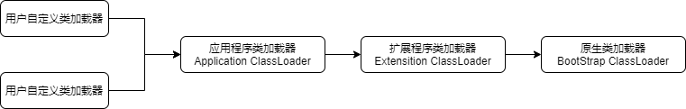


* 如果一个类加载器收到了类加载请求,它首先不会自己取尝试加载这个类,而是把这个类加载请求委派给父类加载器取完成
* 每一层的类加载器都把类加载请求委派给父类加载器,直到所有的类加载请求都应该传递给顶层的启动类加载器
* 如果顶层的启动类加载器无法完成加载请求,子类加载器尝试取加载,如果连最初发起类加载请求的类加载器也无法完成加载请求时,将会抛出ClassNotFoundException,而不再调用其子类加载器
* 双亲委派模式的类加载机制优点是Java类它的类加载器一起具备了一种带优先级的层次关系,越是基础的类,越是被上层的类加载器进行加载,保证了Java程序的稳定运行


## 上下文加载器


* Thread. setContextClassLoader():上下文加载器,是一个角色,用以解决顶层ClassLoader无法访问底层ClassLoader的类的问题
* 基本思想是在顶层ClassLoader中,传入底层ClassLoader的实例
* 上下文ClassLoader可以突破双亲委派模型的局限性


## Tomcat模型


* Tomcat的WebappClassLoader会先加载自己的Class,找不到再委托parent


## OSGI模型


* OSGi的ClassLoader形成网状结构,根据需要自由加载Class


## 热替换


* 当一个class被替换后,系统无需重启,替换的类立即生效


# Class文件结构


| 类型           | 名称                | 数量                  | 描述                                             |
| -------------- | ------------------- | --------------------- | ------------------------------------------------ |
| u4             | magic               | 1                     | 魔数                                             |
| u2             | minor_version       | 1                     | minor版本                                        |
| u2             | major_version       | 1                     | major版本                                        |
| u2             | constant_pool_count | 1                     | 2字节,常量池中常量数量                           |
| cp_info        | constant_pool       | constant_pool_count-1 | 常量数,字节长度不定,由常量池决定                 |
| u2             | access_flags        | 1                     | 2字节,访问控制符                                 |
| u2             | this_class          | 1                     | 2字节,类,指向常量池的Class                       |
| u2             | super_class         | 1                     | 2字节,超类,指向常量池的Class                     |
| u2             | interfaces_count    | 1                     | 2字节,接口数量                                   |
| u2             | interfaces          | interfaces_count      | 接口数量,每个interface是指向CONSTANT_Class的索引 |
| u2             | fields_count        | 1                     | 2字节,字段数量                                   |
| field_info     | fields              | fields_count          | 字段数,字节长度不定,由字段数量决定               |
| u2             | methods_count       | 1                     | 2字节,方法数量                                   |
| method_info    | methods             | methods_count         | 字节长度不定,由方法数量决定                      |
| u2             | attributes_count    | 1                     | 2字节,属性数量                                   |
| attribute_info | attributes          | attributes_count      | 字节长度不定,由属性数量决定                      |
|                |                     |                       |                                                  |

## magic


* 0xCAFEBABE


| JDK版本       | target参数                 | 十六进制minor.major | 十进制minor.major |
| ------------- | -------------------------- | ------------------- | ----------------- |
| jdk1.1.8      | 不能带  target  参数       | 00  03 \|00 2D      | 3\|45             |
| jdk1.2.2      | 不带(默认为  -target  1.1) | 00  03 \|00 2D      | 3\|45             |
| jdk1.2.2      | -target  1.2               | 00  00 \|00 2E      | 0\|46             |
| jdk1.3.1_19   | 不带(默认为  -target  1.1) | 00  03 \|00 2D      | 3\|45             |
| jdk1.3.1_19   | -target  1.3               | 00  00 \|00 2F      | 0\|47             |
| j2sdk1.4.2_10 | 不带(默认为  -target  1.2) | 00  00 \|00 2E      | 0\|46             |
| j2sdk1.4.2_10 | -target  1.4               | 00  00 \|00 30      | 0\|48             |
| jdk1.5.0_11   | 不带(默认为  -target  1.5) | 00  00 \|00 31      | 0\|49             |
| jdk1.5.0_11   | -target  1.4 -source 1.4   | 00  00 \|00 30      | 0\|48             |
| jdk1.6.0_01   | 不带(默认为  -target  1.6) | 00  00 \|00 32      | 0\|50             |
| jdk1.6.0_01   | -target  1.5               | 00  00 \|00 31      | 0\|49             |
| jdk1.6.0_01   | -target  1.4 -source 1.4   | 00  00 \|00 30      | 0\|48             |
| jdk1.7.0      | 不带(默认为  -target  1.6) | 00  00 \|00 32      | 0\|50             |
| jdk1.7.0      | -target  1.7               | 00  00 \|00 33      | 0\|51             |
| jdk1.7.0      | -target  1.4 -source 1.4   | 00  00 \|00 30      | 0\|48             |


## constant_pool


* CONSTANT_Utf8:1,UTF-8编码的Unicode字符串
  * tag 1
  * length u2
  * bytes[length]
* CONSTANT_Integer:3,int类型的字面值
  * tag 3
  * byte u4
* CONSTANT_Float:4,float类型的字面值
* CONSTANT_Long:5,long类型的字面值
* CONSTANT_Double:6,double类型的字面值
* CONSTANT_Class:7,对一个类或接口的符号引用
  * tag 7
  * name_index:u2,名字,指向utf8
* CONSTANT_String:8,String类型字面值的引用
  * tag 8
  * string_index:u2,指向utf8的索引
* CONSTANT_Fieldref:9,对一个字段的符号引用
  * tag 9
  * class_index :u2,指向CONSTANT_Class
  * name_and_type_index:u2,指向CONSTANT_NameAndType
* CONSTANT_Methodref:10,对一个类中方法的符号引用
  * tag 10
  * class_index :u2,指向CONSTANT_Class
  * name_and_type_index:u2,指向CONSTANT_NameAndType
* CONSTANT_InterfaceMethodref:11,对一个接口中方法的符号引用
  * tag 11
  * class_index :u2,指向CONSTANT_Class
  * name_and_type_index:u2,指向CONSTANT_NameAndType
* CONSTANT_NameAndType:12,对一个字段或方法的部分符号引用
  * tag 12
  * name_index:u2,名字,指向utf8
  * descriptor_index:u2,描述符类型,指向utf8


## access_flag


| Flag  Name     | Value  | Interpretation                                    |
| -------------- | ------ | ------------------------------------------------- |
| ACC_PUBLIC     | 0x0001 | public                                            |
| ACC_PRIVATE    | 0x0002 | private                                           |
| ACC_PROTECTED  | 0x0004 | protected                                         |
| ACC_STATIC     | 0x0008 | static                                            |
| ACC_FINAL      | 0x0010 | final,不能被继承                                  |
| ACC_SUPER      | 0x0020 | 是否允许使用invokespecial指令,JDK1.2后,该值为true |
| ACC_VOLATILE   | 0x0040 | volatile                                          |
| ACC_TRANSIENT  | 0x0080 | transient                                         |
| ACC_INTERFACE  | 0x0200 | 是否是接口                                        |
| ACC_ABSTRACT   | 0x0400 | 抽象类                                            |
| ACC_SYNTHETIC  | 0x1000 | 该类不是由用户代码生成,运行时生成的,没有源码      |
| ACC_ANNOTATION | 0x2000 | 是否为注解                                        |
| ACC_ENUM       | 0x4000 | 是否是枚举                                        |


## field_info


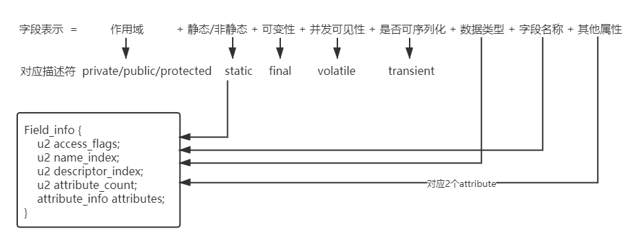


* 字段表用于描述接口或类中声明的变量
* 获取某个字段有那些标志符,需要用访问标示(access_flag)值分别与标志符的特征值取与(&),如果结果为1,则表示该字段拥有相应的标志符
* access_flags:字段访问标志,将class文件以16进制方式打开,占2个字节
* name_index:常量池引用,表示字段的名字
* descriptor_index:表示字段的类型
  * B byte
  * C char
  * D double
  * F float
  * I int
  * J long
  * S short
  * Z boolean
  * V void
  * L 引用对象,如Ljava/lang/Object
  * [ 数组,如 [[Ljava/lang/String; = String\[][]


## method_info


* 方法表用于描述接口或类中声明的方法
* 方法表的表示和描述和字段表中类似,method_info也和field_info相同
* 方法描述符
  * void inc()  **()V**
  * void setId(int) **(I)V**
  * int indexOf(char[],int ) **([CI)I**

| Flag  Name       | Value  | Interpretation          |
| ---------------- | ------ | ----------------------- |
| ACC_PUBLIC       | 0x0001 | public                  |
| ACC_PRIVATE      | 0x0002 | private                 |
| ACC_PROTECTED    | 0x0004 | protected               |
| ACC_STATIC       | 0x0008 | static                  |
| ACC_FINAL        | 0x0010 | final                   |
| ACC_SYNCHRONIZED | 0x0020 | synchronized            |
| ACC_BRIDGE       | 0x0040 | 编译器产生,桥接方法     |
| ACC_VARARGS      | 0x0080 | 可变参数                |
| ACC_NATIVE       | 0x0100 | native                  |
| ACC_ABSTRACT     | 0x0400 | abstract                |
| ACC_STRICT       | 0x0800 | strictfp                |
| ACC_SYNTHETIC    | 0x1000 | 不在源码中,由编译器产生 |


## attribute_info


```properties
attribute_info {
	u2 attribute_name_index;
	u4 attribute_length;
	u1 info[attribute_length];
}
```

* attribute_name_index:对于任意属性,必须是对当前Class文件的常量池的有效16位无符号索引.常量池在该索引处的项必须是CONSTANT_Utf8_info(结构),表示当前属性的名字
* attribute_length:该值给出了跟随其后的字节的长度,这个长度不包括attribute_name_index和attribute_name_index项的6的字节

| **名称**          | **使用者**     | **描述**               |
| ----------------- | -------------- | ---------------------- |
| Deprecated        | field method   | 字段,方法,类被废弃     |
| ConstantValue     | field          | final常量              |
| Code              | method         | 方法的字节码和其他数据 |
| Exceptions        | method         | 方法的异常             |
| LineNumberTable   | Code_Attribute | 方法行号和字节码映射   |
| LocalVaribleTable | Code_Attribute | 方法局部变量表描述     |
| SourceFile        | Class  file    | 源文件名               |
| Synthetic         | field method   | 编译器产生的方法或字段 |
|                   |                |                        |

* Deprecated:attribute_name_index u2;attribute_length u4
* attribute_name_index:指向包含Deprecated的UTF-8常量
* attribute_length:为0
* ConstantValue:attribute_name_index u2;attribute_length u4;constantvalue_index u2
* attribute_name_index:包含ConstantantValue字面量的UTF-8索引
* attribute_length:为2
* constantvalue_index:常量值,指向常量池,可以是UTF-8,Float,Double等


### code_attribute


```java
Code_attribute {
    u2 attribute_name_index;
    u4 attribute_length;
    u2 max_stack;
    u2 max_locals;
    u4 code_length;  // 字节码长度
    u1 code[code_length]; // 字节码
    u2 exception_table_length; // 异常表长度
    {   u2 start_pc; // 异常处理的开始位置
        u2 end_pc;
        u2 handler_pc; // 处理这个异常的字节码位置
        u2 catch_type; // 处理的异常类型,指向Constant_Class的指针
    } exception_table[exception_table_length];// exception_table在start_pc和end_pc之间,如果遇到catch_type异常或者它的子异常,则转到handler_pc处理
    u2 attributes_count; // 属性数量
    attribute_info attributes[attributes_count];
}
```


#### LineNumberTable


* Code属性的属性

```java
LineNumberTable_attribute {
    u2 attribute_name_index; // UTF-8常量池，字面量LineNumberTable
    u4 attribute_length;
    u2 line_number_table_length; // 表项
    {   u2 start_pc; // 字节码偏移量和对应的行号
        u2 line_number;	
    } line_number_table[line_number_table_length];
}
```


#### LocalVariableTable


* Code属性的属性

```java
LocalVariableTable_attribute {
    u2 attribute_name_index; // UTF-8常量池，字面量LocalVariableTable
    u4 attribute_length;
    u2 local_variable_table_length;
    {   u2 start_pc; // 局部变量作用域
        u2 length;
        u2 name_index; // 局部变量名称和类型
        u2 descriptor_index;
        u2 index; // 局部变量的Slot位置
    } local_variable_table[local_variable_table_length];
}
```


### Exceptions


* 和Code属性平级,表示方法抛出的异常(不是try catch部分,而是 throws部分)

```java
attribute_name_index u2 
attribute_length u4 
number_of_exceptions u2 
exception_index_table[number_of_exceptions] u2:指向Constant_Class的索引
```


### SourceFile


* 描述生成Class文件的源码文件名称

```java
attribute_name_index u2
attribute_length u4:固定为2
soucefile_index u2:UTF-8常量索引
```


## 实例


```java
public class User {
    private int id;
    private String name;
    private int age;
    public int getId() {
        return id;
    }
    public void setId(int id) {
        this.id = id;
    }
    public String getName() {
        return name;
    }
    public void setName(String name) {
        this.name = name;
    }
    public int getAge() {
        return age;
    }
    public void setAge(int age) {
        this.age = age;
    }
}
```

16进制文件

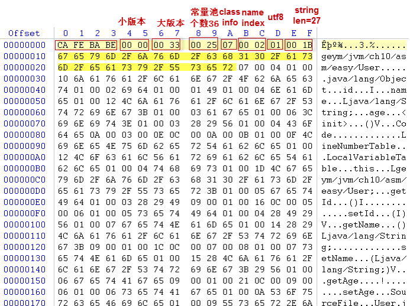


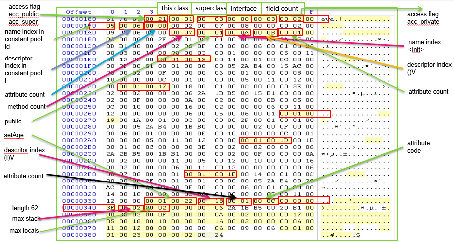


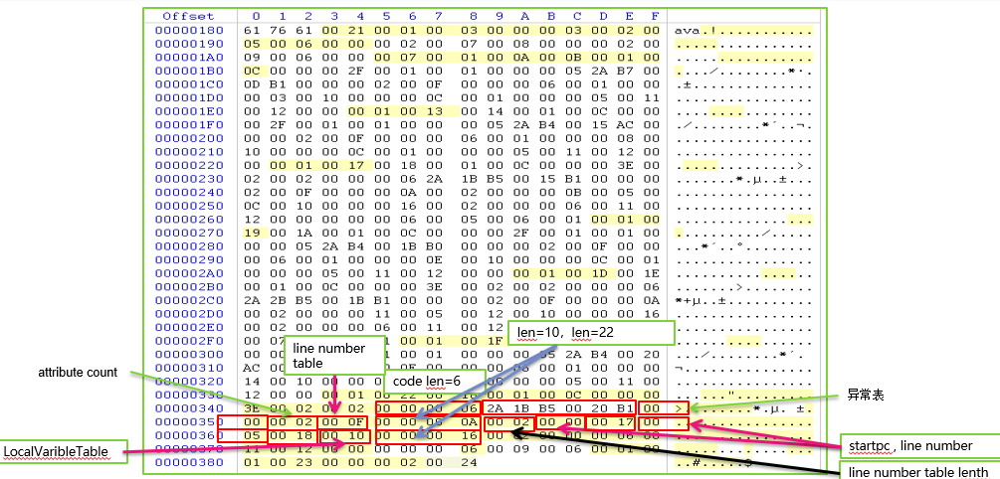


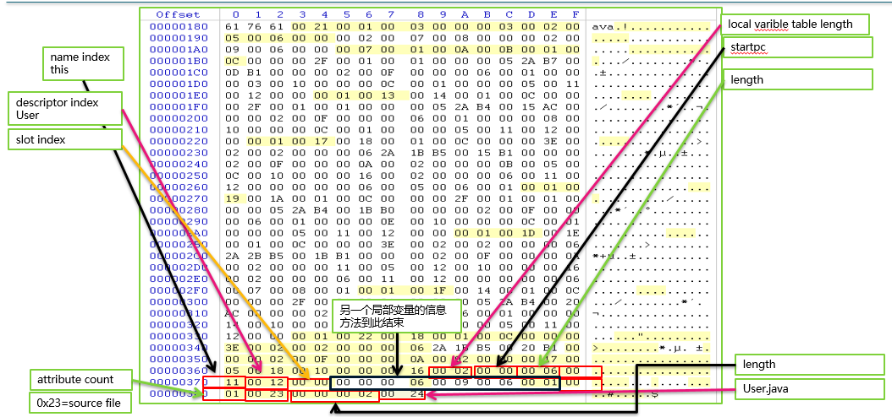


# Class文件校验


* Java语言编译器需要遵循许多规则和约束来生成代码,以保证所生成的Class文件符合静态和结构化约束,但是Java虚拟机无法保证所有它将要加载的Class文件都来自于正确实现的编译器或者有正确的格式
* 某些应用程序,譬如网络浏览器可能会下载程序的源码,然后将它们编译为Class文件,也有某些应用程序可能会直接下载已被编译过的Class文件.这些应用程序需要确定Class文件是否是来自于一个错误实现的编译器,甚至是否是来自于想恶意破坏虚拟机的人
* 如果仅做编译时检查的话还存在另外一个问题:版本偏差(Version Skew)
  * 假设有一个用户成功编译了一个名为PurchaseStockOptions的类,它是TradingClass的子类.但是
    TradingClass的内容很可能在上次编译之后又发生了变化,从而导致无法与以前存在的二进制内容相兼容.如原来存在的方法可能被删除,返回类型可能被修改,字段类型被改变,字段从实例变量修改为类变量,方法的访问修饰符可能从public修改为private等等
  * 对于两个类型是否能兼容,详见《Java 语言规范》第13章二进制兼容性
* 鉴于上述潜在问题,Java虚拟机需要自己能够独立校验它准备载入的Class文件是否能满足规定的约束条件.Java 虚拟机实现会在文件的链接阶段对Class文件进行必要的校验
* 链接期校验还有助于增强解释器的执行性能,因为解释器在运行期无需再对每个执行指令进行检查.Java虚拟机在运行期可以假设所有必要的校验都已经执行过.例如,Java虚拟机可以确保以下内容
  * 操作数栈不会发生上限或下线溢出
  * 所有局部变量的使用和存储都是有效的
  * 所有 Java 虚拟机指令都拥有正确的参数类型
* 校验器也会对那些不是用Code属性中code[]数组的内容进行校验,这些检验包括如下内容
  * 确保final类不会有子类,以及final方法不会被覆盖
  * 确保除了 Object 之外的每一个类都有直接父类
  * 确保常量池满足文档静态约束:例如常量池中所有CONSTANT_Class_info结构所包含的name_index项都是一个指向CONSTANT_Utf8_info项的有效常量池索引
  * 确保常量池之中所有字段引用和方法引用都有有效的名称,类型和方法描述符
* 上述检查不能保证给定的字段或者方法在给定的类中实际存在,也不能保证类型描述符中引用的是一定是一个真实存在的类,而只能保证这些项在形式上是正确的
* 更多相关的检查会在字节码本身已被验证过之后的解析阶段进行
* Java虚拟机可以使用两种不同的检查策略:类型检查验证和类型推导验证.对于版本号大于或等于50.0的 Class文件,规定必须使用类型检查验证;由于验证版本号小于50.0的Class文件的需要,类型推导验证必须被除使用于Java ME CLDC 和Java Card平台的虚拟机外的所有虚拟机实现所支持.使用于 Java ME CLDC和 Java Card平台的虚拟机要遵循它们自身的规范


## 类型检查验证


* 查看英文原版实例


## 类型推导验证


* 对于不包含StackMapTable属性的Class文件(这样的Class文件其版本号必须小于或等于49.0)需要使用类型推断的方式来验证


### 类型推断的验证过程


* 在链接过程中,验证器通过数据流分析的方式检查每个方法Code属性中的code[].验证器必须确保程序中无论在任何执行时间,无论是选择哪条执行路径,都必须遵循以下规则:
  * 操作数栈的深度及所包含的值的类型总是相同
  * 在明确确定要局部变量的数据类型之前, 不能访问该局部变量
  * 方法调用必须携带适当的参数
  * 对字段所赋的值一定会与对象的类型相符
  * 所有的操作码在操作数栈和局部变量表中都有适当类型的参数
  * 对于由异常处理器所保护的代码,局部变量中不允许出现未初始化的类实例.然而,未初始化的类实例可以出现在由异常处理器保护的代码的操作数栈中, 因为当异常被抛出时,操作数栈的内容就会被丢弃
* 有时候考虑到效率,验证器中一些关键测试会被延迟至方法的代码第一次被真正调用时才执行.正因如此,验证器除非确实有必要的情况,否则都会尽量避免触发其他Class文件的加载
  * 例如,某个方法调用另一个方法,且被调用的方法返回了一个类A的实例,这个实例会赋值给与它相同类型的一个字段,这时验证器不会耗费时间去检查A类是否真实存在.然而,如果这个实例被赋值给B类型的字段,那么验证器必须确保A和B类都已经加载过且A是B的某个子类


### 字节码验证器


* Class文件中每个方法的代码都要被单独地验证
* 首先,组成代码的字节序列被会分隔成一系列指令,每条指令在 code[]中的起始位置索引将被记录在另外的数组中
* 然后,验证器再次遍历代码并分析每条指令,经过这次遍历之后,会生成一个数组结构用于存储方法中每个 Java虚拟机指令的相关信息.如果有必要的话,验证器会检查每条指令的操作数,以确保它们是合法的
* 例如将会检查以下内容:
  * 方法分支跳转一定不能超过code[]的范围
  * 所有控制流指令的目标都应该是某条指令的起始处.以wide指令为例,wide操作码可以看作是指令的起始处,但被wide指令所修饰的操作码不能再被看作是指令的起始处.方法中如果某个分支指向了一条指令中间,那这种行为是非法的
  * 方法会显式声明自己局部变量表的大小,指令所访问或修改的局部变量索引绝不能大于这个限制值
  * 对常量池项的引用必须要求该项符合预期的类型.譬如,getfield指令只能引用字段项
  * 代码执行不能终止于指令的中部
  * 代码执行不能超出code[]的尾部
  * 对于所有的异常处理器,由处理器所保护的代码起点应该是指令的起始处,终点应在代码的尾部,起点必须在终点之前.异常处理器保护的代码必须起始于一个有效的指令,且不能是被wide指令修饰的操作码
* 对于方法中的每条指令来说,在指令执行之前,验证器会记录下此时操作数栈和局部变量表中的内容.对于操作数栈, 验证器需要知道栈的深度及里面每个值的类型.对于每个局部变量,它需要知道当前局部变量的值的类型,如果当前值还没有被初始化,那么它需要知道这是一个未使用或未知的值.在确定操作数栈上值的类型时,字节码验证器不需要区分到底是哪种整型(例如byte,short和char)
* 接下来真正的数据流分析器(Data-Flow Analyzer)被初始化了.在方法的第一条指令执行之前,局部变量表中存放方法参数的局部变量就已根据方法描述符中描述的参数数据类型初始化好,此时操作数栈为空,其它的局部变量包含非法(不可使用)的值.对于那些还没有被检查的指令,分析器不保存与它们有关的操作数栈或局部变量表信息
* 接着,数据流分析器为每条指令都设置一个"变更位"(Changed Bit),用来表示指令是否需要被检测.最开始时只有方法的第一条指令设置了变更位
* 数据流分析器执行流程如下面的循环:
  * 选取一个变更位被设置过的指令,如果不能选取到变更位被设置过的指令,那么表示方法被成功地验证过;否则,关闭选取的指令的变更位
  * 通过下述的方式来模拟操作数栈和局部变量表中指令的行为:
    * 如果指令使用操作数栈中的值,就得确保操作数栈中有足量的数据且栈顶值的类型是合适的,否则验证失败
    * 如果指令使用局部变量中的值,就得确保那个特定变量的值符合预期的类型,否则验证失败
    * 如果指令需要往操作数栈存储数据,就得确保操作数栈中有充足的空间来容纳新值,并在模拟的操作数栈的栈顶增加新值的类型
    * 如果指令试图修改局部变量中的值,记录下当前局部变量包含的新值的类型
  * 检查当前指令的后续指令.后续指令可以是下述的某一种:
    * 如果当前指令不是非条件的控制转移指令(如goto,return或athrow),那么后续指令就是下一条指令.如果此时超出方法的最后一条指令,那么验证失败
    * 条件或非条件的分支或转换指令的目标指令
    * 当前指令的任何异常处理器
  * 在继续执行下一条指令之前,需要将当前指令执行结束后操作数栈和局部变量表的状态合并起来.在处理控制转移到异常处理器的情况时,操作数栈上只包含异常处理器的那个异常类型对象.为此操作数栈上必须有充足的空间来容纳这个值,就如同有指令将值压到栈中一样
    * 如果这是后续指令是第一次被访问到,在指令执行之前,将采用第2和第3步中描述的规则,把操作数栈和局部变量表的操作记录为分析器模拟的操作数栈和局部变量表的初始值,为后续指令设置变更位
    * 如果后续指令之前执行过,只要将操作数栈和局部变量表中按照第2和3步的规则计算出值合并入模拟的操作数栈和局部变量表中即可.如果之前对这些值有更改过,那么也得设置变更位
  * 继续第1步
* 合并两个操作数栈之前,每个栈上的值的数量必须是相同的.栈上每个元素的类型也必须是相同的,除非两个栈上相应位置有不同类型的reference值.在这种情况下,合并后的操作数栈也包含一个reference指向两种类型的最小公共父类(类继承体系中,两个类型父类中最底层的那个父类).这种最小公共父类应该总是有的,因为Object类型是所有类或接口的父类.如果两个操作数栈不能合并,那么验证失败
* 合并两个局部变量表状态之前,局部变量对的数量应该是相同的.如果两个类型不相同,除非它们两个都包含着reference值,不然验证器就记录下当前局部变量包含着一个未使用的值.如果两个局部变量对都包含reference值,最终合并后的状态是reference且指向两种类型的最小公共父类的实例
* 如果数据流分析器在检测某个方法时没有发现错误,那就表示此方法被Class文件验证器成功地验证了
* 某些指令和数据类型会使数据流分析器的行为变得更为复杂,接下来我们详细介绍这方面的内容


### long和double的值


* long 和 double 类型的数值在验证过程中要被特殊处理
* 当一个 long 或 double 型的数值被存放到局部变量表的索引n处时,索引n+1也会被显式声明由索引n持有,且不能再被用作其它局部变量的索引.先前索引 n+1 处的值也会变为不可用
* 当一个值想要存放到局部变量表的索引 n 处时,就必须检查索引 n-1 处是否为long和double型数值的索引.如果是的话,在索引 n-1 处的局部变量就应该显式声明:它包含一个未使用的值.如果在索引 n 处的局部变量已经被 long 和 double 型覆盖,在索引 n-1 处的局部变量就不能再表示一个 long 和 double 型的数值了
* 在操作数栈上处理 long 和 double 型的数值很简单:验证器把它们当作栈上的单个数值.例如,验证 dadd 操作码(对两个double值加和)的代码时就需要检查栈顶的两个元素是否为double类型.在计算操作数栈的深度时, long 和 double 型的数值都占有两个位置
* 类型无关的指令(一般都是操作数栈指令,如pop,dup)在使用操作数栈时必须将 long 和 double 型数值整体对待.例如,如果使用pop或dup指令且栈顶的元素是double时,验证器就会提示错误.此时必须使用pop2或dup2指令来处理


### 实例初始化方法与创建对象


* 创建一个新的类实例需要多个步骤的处理过程

```java
new myClass(i, j, k);
// 实际的字节码文件
new #1 // Allocate uninitialized space for myClass
dup // Duplicate object on the operand stack
iload_1 // Push i
iload_2 // Push j
iload_3 // Push k
invokespecial #5 // Invoke myClass.<init>
```

* 上述指令序列在操作数栈栈顶上保留着最新创建和初始化过的对象引用(代码编译成Java虚拟机指令集的其它例子请参考第3章为Java 虚拟机编译
* 类myClass的实例初始化方法(§ 2.9)可以看到新建但未初始化的对象,并且这个对象以this 参数的方式存放在局部变量索引0处.在初始化方法通过 this 调用 myClass 或其父类的其它初始化方法之前,这个初始化方法唯一能做的事情就是在 this 对象上为 myClass 类声明的字段赋值
* 在为实例方法做数据流分析时,验证器初始化局部变量索引0处为当前类的一个对象.在分析实例初始化方法时,局部变量 0 处包含一个特殊类型用来显示此未初始化对象.在调用这个对象的恰当的实例初始化方法(由当前的类或它的父类)后,由当前的类类型在验证器的操作数栈和局部变量表模型中都放置此特殊类型.验证器会拒绝那些对象初始化之前使用对象及初始化多个对象的代码.除此之外,它还要确保在调用正常的方法之前都得事先调用方法所在类或它的直接父类的实例初始化方法
* 与此类似的是,一个特殊类型会被创建并入栈到验证器的操作数栈模型中用来表示 Java 虚拟机 new 指令的结果.这个特殊的类型将被用来区分一个已被完整创建的实例和一个被 new 指令创建,但是还未执行过初始化方法的实例.当一个未初始化类实例的实例初始化方法被调用之后,所有使用这个特殊类型的地方都被替换成为真实的类实例的类型.这种类型的改变可能影响到数据流分析器对后续指令的分析过程
* 在存储这个特殊类型的时候,指令序号必须一起存储起来.因为操作数栈中有可能会同时出现多于1个实例已被创建,但未被初始化的情况,如new InputStream(new Foo(),new InputStream("foo"));若使用Java虚拟机指令集序列来实现这个代码,那在执行时,操作数栈中就会同时存在2个未初始化的InputStream实例.当某个类实例的实例初始化方法被调用,那在操作数栈或局部变量表中的代表那个被初始化类实例的对象将会被替换掉
* 一个有效地指令集序列里,在回向分支(Backwards Branch)的操作数栈或局部变量表中,以及被finally语句块或异常处理器所保护的代码的局部变量表中都不允许出现未被初始化的对象.否则,验证器将可能会被一些有歧义的代码片段所干扰,误以为某些类实例在它需要被初始化的时候已经被初始化过,而实际上, 这个被初始化的实例已经通过前面某个循环被创建了


### 异常和 finally


* 为了实现 try-finally 结构,在版本号小于或等于50.0的Java语言编译器中,可以使用将两种特殊指令: jsr(跳转到程序子片段)和ret(程序子片段返回)组合的方式来生成try-finally 结构的 Java 虚拟机代码.这样的 finally 语句以程序子片段的方式嵌入到 Java虚拟机方法代码中,有点像异常处理器的代码那样.当使用 jsr 指令来调用程序子片段时, 该指令会把程序子片段结束后应返回的地址值压入操作数栈中, 以便在 jsr 之后的指令能被正确执行.这个地址值会作为 returnAddress 类型数据存放于操作数栈上,程序子片段的代码中会把返回地址存放在局部变量中,在程序子片段执行结束时,ret指令从局部变量中取回返回地址并将执行的控制权交给返回地址处的指令
* 程序有多种不同的执行路径会执行到 finally 语句(即代表finally语句的程序子片段被调用).如果 try 中全部语句正常地完成的话,那在执行下一条指令之前,会通过 jsr 指令来调用 finally 的程序子片段.如果在 try 语句中遇到 break 或 continue 关键字把程序执行权转移到 try 语句之外的话,也会保证在跳转出 try 之前使用 jsr 指令来调用 finally 的程序子片段.如果 try 语句中遇到了 return,代码的行为如下:
  * 如果有返回值的话,将返回值保存在局部变量中
  * 执行 jsr 指令将控制权转到给 finally 语句中
  * 在 finally 执行完成后,返回事先保存在局部变量中的值
* 编译器会构造特殊的异常处理器,来保证当 try 语句中有异常发生时,它会拦截住任何类型的异常.如果在 try 语句中有异常抛出,异常处理器的行为是:
  * 将异常保存在局部变量中
  * 执行 jsr 指令将控制权转到给 finally 语句中
  * 在执行完 finally 语句后,重新抛出这个事先保存好的异常
* finally 语句中的代码也给验证器带来了一些特殊的问题.通常情况下,如果可以通过多条路径抵达一个特殊的指令或是由这些路径找到的某个特殊包含一些不兼容的值的局部变量,那么这个局部变量是不可用的.然而,由于 finally 语句可以在不同的地方被调用,也会导致一些不同的情况:
  * 如果从异常处理器处调用,就会带着一个包含异常实例的局部变量
  * 如果从 return 处调用,那么某个局部变量中应该包含着方法返回值
  * 如果从 try 语句的结尾处调用,那么某些局部变量的值可能是不明确的
* 验证 finally 语句,不仅要保证 finally 语句本身的代码通过验证, 而且在更新完所有 ret指令的后续指令状态后,验证器还得注意到:异常处理器的局部变量中应该有一个异常实例,return 代码期望的局部变量是返回值而不是未确定的值
* 验证 finally 语句中的代码是很复杂的,但几个基本的思路如下:
  * 每个保持追踪 jsr 目标的指令都需要能到达那个目标指令.对于大部分代码来说,这个列表是空的.对于 finally 语句中的代码来说,列表的长度应该是 1.对于多级嵌入finally 代码来说,列表的长度应该大于1
  * 对于每条指令及每条 jsr 指令将要转向到那条指令,在 jsr 指令执行后, 就有一个位向量(Bit Vector)记录着所有对局部变量的访问及修改
  * 执行 ret 指令就意味着从程序子片段中返回,这应该是唯一的一条从程序子片段中返回的路径.两个不同的程序子片段是不同将 ret 指令的执行结果归并到一起
  * 为了对 ret 指令实施数据流分析, 需要进行一些特殊处理.因为验证器知道程序子片段中将从哪些指令中返回,所以它可以找出调用程序子片段的所有的 jsr 指令, 并将它们对应的 ret 指令的操作数栈和局部变量表状态合并.对于合并局部变量表时使用的特殊值定义如下:
    * 如果位向量(前面定义过)表明局部变量在程序子片段中被访问或修改过,那么就使用执行 ret 时局部变量的值的类型
    * 对于其它局部变量,使用执行 jsr 指令之前的局部变量的类型


# 对象


## 结构


* 在JVM中,对象在内存中的布局分为三块区域:对象头、实例数据和对齐填充
* Header:对象头,存储对象的源数据,通常Hotspot虚拟机的对象头主要包括`Mark Word`(标记字段)和`Class Pointer`(类型指针)
  * `Mark Word`:存储对象自身的运行时数据,哈希值,GC分代年龄,锁动态标志,线程持有的锁,偏向线程ID,偏向时间戳,它是实现轻量级锁和偏向锁的关键
  * `Class Pointer`:是对象指向它的类元数据的指针,虚拟机通过这个指针来确定这个对象是哪个类的实例
  * 一般占有2个机器码(在32位虚拟机中,1个机器码等于4字节,也就是32bit;在64位虚拟机中,1个机器码是8个字节,也就是64bit),但是如果对象是数组类型,则需要3个机器码,因为JVM虚拟机可以通过Java对象的元数据信息确定Java对象的大小,但是无法从数组的元数据来确认数组的大小,所以用一块来记录数组长度
* InstanceData:实例数据,存放类的属性数据信息,包括父类的属性信息
* Padding:无实际意义,主要用来填充以达到字节数为8的倍数,仅仅是为了字节对齐,因为虚拟机要求对象起始地址必须是8字节的整数倍


### 监视器Monitor


* 任何一个对象都有一个Monitor与之关联,当且只有一个Monitor被持有后,它将处于锁定状态
* Monitor可以理解为一个同步工具,也可以描述为一种同步机制,它通常被描述为一个对象
* `synchronized`在JVM里的实现都是基于进入和退出Monitor对象来实现方法同步和代码块同步,虽然具体实现细节不一样,但是都可以通过成对的`MonitorEnter`和`MonitorExit`指令来实现
  * MonitorEnter: 插入在同步代码块的开始位置,当代码执行到该指令时,将会尝试获取该对象Monitor的所有权,即尝试获得锁
  * MonitorExit: 插入在方法结束处和异常处,JVM保证每个`MonitorEnter`必须有对应的`MonitorExit`
* `Synchronized`对象锁一般就是指Monitor,MarkWord锁标识位为10,其中指针指向的是Monitor对象的起始地址.在Java虚拟机(HotSpot)中,Monitor是由`ObjectMonitor`实现的


## 创建


* new 类名
* 根据new的参数在常量池中定义一个类的符号引用
* 如果没有找到这个符号引用,说明类还没有被加载,则进行类加载,解析和初始化
* 虚拟机在堆中为对象分配内存
* 将分配的内存初始化为零值,不包含对象头
* 调用对象的初始化方法


# 字节码指令


## 概述

* Java虚拟机的指令是由一个字节长度的,代表某种特定操作含义的数字,称之为操作码,以及跟随其后的0至多个代表此操作所需参数的操作数而构成
* 操作码的长度为1个字节,因此最大只有256条
* 基于栈的指令集架构
* 在虚拟机的指令集中,大多数的指令都包含了其操作所对应的数据类型信息
* 加载和存储指令用于将数据在栈帧中的局部变量表和操作数栈之间来回传输
* 将局部变量表加载到操作数栈:aload_0
* 将一个数值从操作数栈存储到局部变量表:istore,lfda
* 将一个常量加载到操作数栈:bipush,sipush,ldc,ldc_w,ldc2_w,aconst_null,iconst_m1,iconst
* 扩充局部变量表的访问索引指令:wide


## JVM编译


* 使用javap -verbose或javap -p编译class文件,即可得到JVM指令对应的格式

```java
<index> <opcode> [ <operand1> [ <operand2>... ]] [<comment>]
```

```java
public void spin() {
    int i; 
    for (i = 0; i < 100; i++) {
	}
} 
```

```java
// 使用javap编译
0   iconst_0       // Push int constant 0
1   istore_1       // Store into local variable 1 (i=0)
2   goto 8         // First time through don't increment
5   iinc 1 1       // Increment local variable 1 by 1 (i++)
8   iload_1        // Push local variable 1 (i)
9   bipush 100     // Push int constant 100
11  if_icmplt 5    // Compare and loop if less than (i < 100)
14  return         // Return void when done
```


## 特殊指令


* <clinit>():
* <init>():
* nop:什么都不做
* dup:复制栈顶数值并将复制值压入栈顶
* new:创建一个对象,并将其引用值压入栈顶


## 运算指令


* 运算指令用于对两个操作数栈上的值进行某种特定的运算,并把结果存储到操作数栈顶
* 加法指令:iadd,ladd,fadd,dadd
* 减法指令:isub,lsub,fsub,dsub
* 乘法指令:imul,lmul,fmul,dmul
* 除法指令:idiv,ldiv,fdiv,ddiv
* 求余指令:irem,lrem,frem,drem
* 取反指令:ineg,lneg,fneg,dneg
* 位移指令:ishl,ishr,iushr,lshl,lshr,lushr
* 按位或指令:ior,lor
* 按位与指令:iand,land
* 按位异或指令:ixor,lxor
* 局部变量自增指令:iinc
* 比较指令:dcmpg,dcmpl,fcmpg,fcmpl,lcmp


## 类型转换指令


* 类型转换指令可以将两种不同的数值类型进行相互转换,这些转换操作一般用于实现用户代码中的显示类型转换操作以及用来处理字节码指令集中数据类型相关指令无法与数据类型一一对应的问题
* 宽化类型处理和窄化类型处理:类似子类转父类和父类转子类,int转long,long转int
* i2l,l2i,i2f,l2f,l2d,f2i,f2d,d2i,d2l,d2f,i2b,i2c,i2s
* i2l:将int转为long
  * 执行前,栈:..., value
  * 执行后,栈:...,result.word1,result.word2
  * 弹出int,扩展为long,并入栈


## 对象创建与访问指令


* new:创建普通类实例的指令
* newarray:基本类型数组创建
* anewarray:引用类型数组创建
* multianewarray:多维引用数组创建
* getfield:获取字段的值
* putfield:设置字段的值
* getstatic:获取静态字段的值
* putstatic:设置静态字段的值
* 把数组元素加载到操作数栈的指令:baload,caload,iaload,laload,saload,faload,faload,aaload(引用)
* 将操作数栈的值存储到数组元素:astore
* 取数组长度的指令:arraylength
* 检查实例类型的指令:instanceof,checkcast


## 操作数栈管理指令


* 操作数栈指令用于直接操作操作数栈
* 将操作数栈的一个或两个元素出栈:pop,pop2
* 复制栈顶一个或两个数值并将复制或双份渎职值重新压入栈顶:dup,dup2,dup_x1,dup_x2
* 将栈顶的两个数值替换:swap


### 常量入栈


* aconst_null:null对象入栈
* iconst_m1:int常量-1入栈
* iconst_0(要入栈的数字):int常量0入栈
* lconst_1:long常量1入栈
* fconst_1:float 1.0入栈
* dconst_1:double 1.0 入栈
* bipush:8位带符号整数入栈
* sipush:16位带符号整数入栈
* ldc:常量池中的常量压入栈顶


### 局部变量压栈


* xload(x为i l f d a):分别表示int,long,float,double,object ref,将指定类型的局部变量推送至栈顶
* xload_n(n为0 1 2 3)
* xaload(x为i l f d a b c s)
  * 分别表示int,long,float,double,obj ref ,byte,char,short
  * 从数组中取得给定索引的值,将该值压栈
  * iaload
    * 执行前,栈:..., arrayref, index
    * 它取得arrayref所在数组的index的值,并将值压栈
    * 执行后,栈:..., value


### 出栈装载入局部变量


* xstore(x为i l f d a):出栈,存入局部变量,将栈顶指定类型数值存入指定局部变量
* xstore_n(n 0 1 2 3):出栈,将值存入第n个局部变量
* xastore(x为i l f d a b c s)
  * 将值存入数组中
  * iastore
    * 执行前,栈:...,arrayref, index, value
    * 执行后,栈:...
    * 将value存入arrayref[index]


## 控制转移指令


* 控制转移指令可以让Java虚拟机有条件或无条件的从指定位置指令执行而不是控制转移指令的下一条指令继续执行程序,即控制转移指令就是在修改PC寄存器的值
* 条件分支:
  * ifeq/ifne:如果为0/不为0,则跳转
    * 参数:byte1,byte2
    * value出栈,如果栈顶value为0则跳转到(byte1<<8)|byte2
    * 执行前,栈:...,value
    * 执行后,栈:...
  * iflt/ifle:如果小于0/小于等于0,则跳转
  * ifgt/ifge:如果大于0/大于de等于0,则跳转
  * ifnull/ifnonnull:如果为null/不为null,则跳转
  * if_icmpeq/if_icmpne:如果两个int相同/不同,则跳转
  * if_icmplt/if_icmple:如果int小于/小于等于,则跳转
  * if_icmpgt/if_icmpge:如果int大于/大于等于,则跳转
  * if_acmpeq/if_acmpne:如果2个引用类型相同/不同,则跳转
* 复合条件分支:tableswitch,lookupswitch
* 无条件分支:goto,goto_w,jsr,jsr_w,ret
* 在Java虚拟机中有专门的指令集用来处理int和引用类型的条件分支比较操作,为了可以无需明显标识一个实体值是否null,也有专门的指令用来检测 null 值
* boolean,byte,char,short的条件分支比较操作都使用int比较指令来完成,而对于long,float,double类型的条件分支比较操作,则会先执行相应类型的比较运算指令,运算指令会返回一个整形值到操作数栈中,随后再执行int类型的条件分支比较操作来完成整个分支跳转
* 由于各种类型的比较最终都会转化为int类型的比较操作,基于int类型比较的这种重要性,Java虚拟机提供了非常丰富的int类型的条件分支指令
* 所有int类型的条件分支转移指令进行的都是有符号的比较操作


## 方法调用和返回指令


* invokevirtual:用于调用对象的实例方法,根据对象的实际类型进行分派(虚方法分派),这也是Java语言中最常见的方法分派方式
* invokeinterface:用于调用接口方法,它会在运行时搜索一个实现了这个接口方法的对象,找出适合的方法进行调用
* invokespecial:用于调用一些需要特殊处理的实例方法,包括实例初始化方法,私有方法和父类方法.通常根据引用的类型选择方法,而不是对象的类来选择,即它使用静态绑定而不是动态绑定
* invokestatic:用于调用类方法(static方法)
* 方法返回指令是根据返回值的类型区分的,包括有ireturn(当返回值是boolean,byte,char,short和int 类型时使用),lreturn,freturn,dreturn和areturn.return指令供声明为void的方法,实例初始化方法,类和接口的类初始化方法使用
* invokedynamic:调用动态链接方法


## 抛出异常


* 在程序中显式抛出异常的操作会由athrow指令实现,除了这种情况,还有别的异常会在其他Java虚拟机指令检测到异常状况时由虚拟机自动抛出


## 同步


* Java虚拟机可以支持方法级的同步和方法内部一段指令序列的同步,这两种同步结构都是使用管程(Monitor)来支持的
* 方法级的同步是隐式,即无需通过字节码指令来控制的,它实现在方法调用和返回操作之中
* 虚拟机可以从方法常量池中的方法表结构(method_info)中的ACC_SYNCHRONIZED访问标志区分一个方法是否同步方法
  * 当方法调用时,调用指令将会检查方法的ACC_SYNCHRONIZED访问标志是否被设置,如果设置了,执行线程将先持有管程,然后再执行方法,最后再方法完成(无论是正常完成还是非正常完成)时释放管程
  * 在方法执行期间,执行线程持有了管程,其他任何线程都无法再获得同一个管程
  * 如果一个同步方法执行期间抛出了异常,并且在方法内部无法处理此异常,那这个同步方法所持有的管程将在异常抛到同步方法之外时自动释放
* 同步一段指令集序列是由Java中的synchronized块来表示的,Java虚拟机的指令集中有monitorenter和monitorexit两条指令来支持synchronized关键字的语义,正确实现synchronized关键字需要编译器与Java虚拟机两者协作支持
* 结构化锁定(Structured Locking)是指在方法调用期间每一个管程退出都与前面的管程进入相匹配的情形.因为无法保证所有提交给Java虚拟机执行的代码都满足结构化锁定,所以Java虚拟机允许(但不强制要求)通过以下两条规则来保证结构化锁定成立.假设T代表一条线程,M代表一个管程:
  * T在方法执行时持有管程M的次数必须与T在方法完成(正常和非正常完成)时释放管程M的次数相等
  * 在方法调用过程中,任何时刻都不会出现线程T释放管程M的次数比T持有管程M次数多的情况
  * 在同步方法调用时自动持有和释放管程的过程也被认为是在方法调用期间发生


## 字节码执行引擎


### 运行时栈帧结构


* 栈帧也叫过程活动记录,是编译器用来进行方法调用和方法执行的一种数据结构,他是虚拟机运行时数据区域红的虚拟机栈的栈元素
* 栈帧中包含了局部变量表,操作数栈,动态链接和方法返回地址以及额外的一些附加信息,在编译过程中,局部变量表的大小已经确定,操作数栈深度也已经确定,因此栈帧在运行的过程中需要分配多大的内存是固定的,不受运行时影响
* 对于没有逃逸的对象也会在栈上分配内存,对象的大小其实在云习性时也是确定的,因此即使出现了栈上内存分配,也不会导致栈帧改变大小
* 一个线程中,可能调用链会很长,很多方法都同时处于执行状态
* 对于执行引擎,活动线程中,只有栈顶的栈帧是最有效的,称为当前栈帧,这个栈帧所关联的方法称为当前方法,执行引擎所运行的字节码指令仅对当前栈帧进行操作


### 局部变量表


* 使用Slot(槽)装载基本数据类型,引用,通常为32位,double和long占用2个slot
* 当一个变量的PC寄存器的值大于slot的作用域的时候,slot可以复用


### 操作数栈


* 每一个栈帧内部都包含一个称为操作数栈(Operand Stack)的后进先出栈
* 栈帧中操作数栈的长度由编译期决定,并且存储于类和接口的二进制表示之中,既通过方法的 Code 属性保存及提供给栈帧使用
* 操作数栈不是通过索引来访问,而是通过标准的压栈和出栈访问
* 在上下文明确,不会产生误解的前提下,经常把当前栈帧的操作数栈直接简称为操作数栈
* 操作数栈所属的栈帧在刚刚被创建的时候,操作数栈是空的. Java虚拟机提供一些字节码指令来从局部变量表或者对象实例的字段中复制常量或变量值到操作数栈中,也提供了一些指令用于从操作数栈取走数据,操作数据和把操作结果重新入栈.在方法调用的时候,操作数栈也用来准备调用方法的参数以及接收方法返回结果
* 如iadd字节码指令的作用是将两个 int 类型的数值相加,它要求在执行的之前操作数栈的栈顶已经存在两个由前面其他指令放入的 int 型数值.在 iadd 指令执行时,2个 int 值从操作栈中出栈,相加求和,然后将求和结果重新入栈.在操作数栈中,一项运算常由多个子运算(Subcomputations)嵌套进行,一个子运算过程的结果可以被其他外围运算所使用
* 操作数栈会对压入其中的byte,short,char类型先转换为int,之后再进行操作
* 每一个操作数栈的成员(Entry)可以保存一个Java虚拟机中定义的任意数据类型的值,包括 long 和 double 类型
* 在操作数栈中的数据必须被正确地操作,这里正确操作是指对操作数栈的操作必须与操作数栈栈顶的数据类型相匹配,例如不可以入栈两个 int 类型的数据,然后当作 long 类型去操作他们,或者入栈两个 float 类型的数据,然后使用 iadd 指令去对它们进行求和.有一小部分 Java 虚拟机指令(如dup和swap)可以不关注操作数的具体数据类型,把所有在运行时数据区中的数据当作裸类型(Raw Type)数据来操作,这些指令不可以用来修改数据,也不可以拆散那些原本不可拆分的数据,这些操作的正确性将会通过 Class 文件的校验过程来强制保障
* 在任意时刻,操作数栈都会有一个确定的栈深度,一个 long 或者 double 类型的数据会占用两个单位的栈深度,其他数据类型则会占用一个单位深度


### 动态连接


### 方法返回地址


### 附加信息

* 虚拟机规范中允许具体的虚拟机实现增加一些规范里没有描述的信息到栈帧中,这部分信息完全取决于虚拟机的实现


# ASM


* Java字节码操作框架,可以用于修改现有类或者动态产生新类.如AspectJ,Clojure,spring,cglib

```java
ClassWriter cw = new ClassWriter(ClassWriter.COMPUTE_MAXS|ClassWriter.COMPUTE_FRAMES);  
cw.visit(V1_7, ACC_PUBLIC, "Example", null, "java/lang/Object", null);  
MethodVisitor mw = cw.visitMethod(ACC_PUBLIC, "<init>", "()V", null,  null);  
mw.visitVarInsn(ALOAD, 0);  //this 入栈
mw.visitMethodInsn(INVOKESPECIAL, "java/lang/Object", "<init>", "()V");  
mw.visitInsn(RETURN);  
mw.visitMaxs(0, 0);  
mw.visitEnd();  
mw = cw.visitMethod(ACC_PUBLIC + ACC_STATIC, "main",  "([Ljava/lang/String;)V", null, null);  
mw.visitFieldInsn(GETSTATIC, "java/lang/System", "out",  "Ljava/io/PrintStream;");  
mw.visitLdcInsn("Hello world!");  
mw.visitMethodInsn(INVOKEVIRTUAL, "java/io/PrintStream", "println",  "(Ljava/lang/String;)V");  
mw.visitInsn(RETURN);  
mw.visitMaxs(0,0);  
mw.visitEnd();  
byte[] code = cw.toByteArray();  
AsmHelloWorld loader = new AsmHelloWorld();  
Class exampleClass = loader  
    .defineClass("Example", code, 0, code.length);  
exampleClass.getMethods()[0].invoke(null, new Object[] { null }); 
```


## 模型AOP


在函数开始部分或者结束部分嵌入字节码,可用于进行鉴权、日志等

```java
// 在操作前加上鉴权或日志
public class Account { 
    public void operation() { 
        System.out.println("operation...."); 
    } 
}
// 需要加入的内容
public class SecurityChecker { 
    public static boolean checkSecurity() { 
        System.out.println("SecurityChecker.checkSecurity ...");
        return true;
    } 
}
```

```java
class AddSecurityCheckClassAdapter extends ClassVisitor {
    public AddSecurityCheckClassAdapter( ClassVisitor cv) {
        super(Opcodes.ASM5, cv);
    }
    // 重写 visitMethod,访问到operation方法时,给出自定义MethodVisitor,实际改写方法内容
    public MethodVisitor visitMethod(final int access, final String name, 
                                     final String desc, final String signature, final String[] exceptions) { 
        MethodVisitor mv = cv.visitMethod(access, name, desc, signature,exceptions);
        MethodVisitor wrappedMv = mv; 
        if (mv != null) { 
            // 对于operation方法
            if (name.equals("operation")) { 
                // 使用自定义 MethodVisitor,实际改写方法内容
                wrappedMv = new AddSecurityCheckMethodAdapter(mv); 
            } 
        } 
        return wrappedMv; 
    } 
}
class AddSecurityCheckMethodAdapter extends MethodVisitor { 
    public AddSecurityCheckMethodAdapter(MethodVisitor mv) { 
        super(Opcodes.ASM5,mv); 
    } 
    public void visitCode() { 
        visitMethodInsn(Opcodes.INVOKESTATIC, "geym/jvm/ch10/asm/SecurityChecker", 
                        "checkSecurity", "()Z"); 
        super.visitCode();
    } 
}
public class Generator{ 
    public static void main(String args[]) throws Exception { 
        ClassReader cr = new ClassReader("geym.jvm.ch10.asm.Account"); 
        ClassWriter cw = new ClassWriter(ClassWriter.COMPUTE_MAXS|ClassWriter.COMPUTE_FRAMES); 
        AddSecurityCheckClassAdapter classAdapter = new AddSecurityCheckClassAdapter(cw); 
        cr.accept(classAdapter, ClassReader.SKIP_DEBUG); 
        byte[] data = cw.toByteArray(); 
        File file = new File("bin/geym/jvm/ch10/asm/Account.class"); 
        FileOutputStream fout = new FileOutputStream(file); 
        fout.write(data); 
        fout.close(); 
    } 
}
```


# 实例1


```java
public class MyClass {

	private int a = 5;

	private int ttt;

	private String b = "test";

	private float c = 5.5f;

	private double d = 55.6;

	private int[] aa = new int[7];

	private String[] bb = new String[5];

	private Object obj = new Object();

	private Object[] objs = new Object[5];
    
    public int add(int a, int b) {
        int c = a + b;
        return 1 + 1;
	}
}
```

使用javap -c 编译该类的class文件,如下

```java
Compiled from "MyClass.java"
public class com.wy.jvm.MyClass {
  public com.wy.jvm.MyClass();
    Code:
       0: aload_0
       1: invokespecial #25                 // Method java/lang/Object."<init>":()V
       4: aload_0
       5: iconst_5
       6: putfield      #27                 // Field a:I
       9: aload_0
      10: ldc           #29                 // String test
      12: putfield      #31                 // Field b:Ljava/lang/String;
      15: aload_0
      16: ldc           #33                 // float 5.5f
      18: putfield      #34                 // Field c:F
      21: aload_0
      22: ldc2_w        #36                 // double 55.6d
      25: putfield      #38                 // Field d:D
      28: aload_0
      29: bipush        7
      31: newarray       int
      33: putfield      #40                 // Field aa:[I
      36: aload_0
      37: iconst_5
      38: anewarray     #42                 // class java/lang/String
      41: putfield      #44                 // Field bb:[Ljava/lang/String;
      44: aload_0
      45: new           #3                  // class java/lang/Object
      48: dup
      49: invokespecial #25                 // Method java/lang/Object."<init>":()V
      52: putfield      #46                 // Field obj:Ljava/lang/Object;
      55: aload_0
      56: iconst_5
      57: anewarray     #3                  // class java/lang/Object
      60: putfield      #48                 // Field objs:[Ljava/lang/Object;
      63: return

  public int add(int, int);
    Code:
       0: iload_1
       1: iload_2
       2: iadd
       3: istore_3
       4: iconst_2
       5: ireturn
}
```

使用javap -verbose编译该类的class文件如下

```java
Classfile MyClass.class
  Last modified 2021-9-11; size 853 bytes
  MD5 checksum e4223d95d677282f40148c88c42eb20e
  Compiled from "MyClass.java"
public class com.wy.jvm.MyClass
  minor version: 0
  major version: 52
  flags: ACC_PUBLIC, ACC_SUPER
Constant pool:
   #1 = Class              #2             // com/wy/jvm/MyClass
   #2 = Utf8               com/wy/jvm/MyClass
   #3 = Class              #4             // java/lang/Object
   #4 = Utf8               java/lang/Object
   #5 = Utf8               a
   #6 = Utf8               I
   #7 = Utf8               ttt
   #8 = Utf8               b
   #9 = Utf8               Ljava/lang/String;
  #10 = Utf8               c
  #11 = Utf8               F
  #12 = Utf8               d
  #13 = Utf8               D
  #14 = Utf8               aa
  #15 = Utf8               [I
  #16 = Utf8               bb
  #17 = Utf8               [Ljava/lang/String;
  #18 = Utf8               obj
  #19 = Utf8               Ljava/lang/Object;
  #20 = Utf8               objs
  #21 = Utf8               [Ljava/lang/Object;
  #22 = Utf8               <init>
  #23 = Utf8               ()V
  #24 = Utf8               Code
  #25 = Methodref          #3.#26         // java/lang/Object."<init>":()V
  #26 = NameAndType        #22:#23        // "<init>":()V
  #27 = Fieldref           #1.#28         // com/wy/jvm/MyClass.a:I
  #28 = NameAndType        #5:#6          // a:I
  #29 = String             #30            // test
  #30 = Utf8               test
  #31 = Fieldref           #1.#32         // com/wy/jvm/MyClass.b:Ljava/lang/String;
  #32 = NameAndType        #8:#9          // b:Ljava/lang/String;
  #33 = Float              5.5f
  #34 = Fieldref           #1.#35         // com/wy/jvm/MyClass.c:F
  #35 = NameAndType        #10:#11        // c:F
  #36 = Double             55.6d
  #38 = Fieldref           #1.#39         // com/wy/jvm/MyClass.d:D
  #39 = NameAndType        #12:#13        // d:D
  #40 = Fieldref           #1.#41         // com/wy/jvm/MyClass.aa:[I
  #41 = NameAndType        #14:#15        // aa:[I
  #42 = Class              #43            // java/lang/String
  #43 = Utf8               java/lang/String
  #44 = Fieldref           #1.#45         // com/wy/jvm/MyClass.bb:[Ljava/lang/String;
  #45 = NameAndType        #16:#17        // bb:[Ljava/lang/String;
  #46 = Fieldref           #1.#47         // com/wy/jvm/MyClass.obj:Ljava/lang/Object;
  #47 = NameAndType        #18:#19        // obj:Ljava/lang/Object;
  #48 = Fieldref           #1.#49         // com/wy/jvm/MyClass.objs:[Ljava/lang/Object;
  #49 = NameAndType        #20:#21        // objs:[Ljava/lang/Object;
  #50 = Utf8               LineNumberTable
  #51 = Utf8               LocalVariableTable
  #52 = Utf8               this
  #53 = Utf8               Lcom/wy/jvm/MyClass;
  #54 = Utf8               add
  #55 = Utf8               (II)I
  #56 = Utf8               MethodParameters
  #57 = Utf8               SourceFile
  #58 = Utf8               MyClass.java
{
  public com.wy.jvm.MyClass();
    descriptor: ()V
    flags: ACC_PUBLIC
    Code:
      stack=3, locals=1, args_size=1
         0: aload_0
         1: invokespecial #25                 // Method java/lang/Object."<init>":()V
         4: aload_0
         5: iconst_5
         6: putfield      #27                 // Field a:I
         9: aload_0
        10: ldc           #29                 // String test
        12: putfield      #31                 // Field b:Ljava/lang/String;
        15: aload_0
        16: ldc           #33                 // float 5.5f
        18: putfield      #34                 // Field c:F
        21: aload_0
        22: ldc2_w        #36                 // double 55.6d
        25: putfield      #38                 // Field d:D
        28: aload_0
        29: bipush        7
        31: newarray       int
        33: putfield      #40                 // Field aa:[I
        36: aload_0
        37: iconst_5
        38: anewarray     #42                 // class java/lang/String
        41: putfield      #44                 // Field bb:[Ljava/lang/String;
        44: aload_0
        45: new           #3                  // class java/lang/Object
        48: dup
        49: invokespecial #25                 // Method java/lang/Object."<init>":()V
        52: putfield      #46                 // Field obj:Ljava/lang/Object;
        55: aload_0
        56: iconst_5
        57: anewarray     #3                  // class java/lang/Object
        60: putfield      #48                 // Field objs:[Ljava/lang/Object;
        63: return
      LineNumberTable:
        line 10: 0
        line 12: 4
        line 16: 9
        line 18: 15
        line 20: 21
        line 22: 28
        line 24: 36
        line 26: 44
        line 28: 55
        line 10: 63
      LocalVariableTable:
        Start  Length  Slot  Name   Signature
            0      64     0  this   Lcom/wy/jvm/MyClass;

  public int add(int, int);
    descriptor: (II)I
    flags: ACC_PUBLIC
    Code:
      stack=2, locals=4, args_size=3
         0: iload_1
         1: iload_2
         2: iadd
         3: istore_3
         4: iconst_2
         5: ireturn
      LineNumberTable:
        line 31: 0
        line 32: 4
      LocalVariableTable:
        Start  Length  Slot  Name   Signature
            0       6     0  this   Lcom/wy/jvm/MyClass;
            0       6     1     a   I
            0       6     2     b   I
            4       2     3     c   I
    MethodParameters:
      Name                           Flags
      a
      b
}
SourceFile: "MyClass.java"
```

* 0: aload_0,加载默认构造函数
* 1: invokespecial,执行特殊方法,次数表示执行构造函数.()表示空构造,V表示Void,无返回值
* 4: aload_0:表示加载a字段
* 5: iconst_5,i表示上一步加载的字段类型为int,初始化为5.如果没有初始化,则没有该行,如ttt字段
* 6: putfield,将字段加入到字节码中,最后的注释表明了该字段的类型
  * Field表示是字段,a表示变量名,I表示int类型
* add方法
  * 0: iload_1:从局部变量表中加载第一个int类型的参数到操作数栈中.该方法的args_size=3,但实际参数个数要比该值少1,其实是默认加载了this,所有的非静态方法都是如此,构造方法也一样
  * 1: iload_2:同iload_1,只不过加载的是第2个参数,以此类推
  * 2: iadd:进行int类型的加法运算
  * 3: istore_3:将操作数栈中的值存储到局部变量表
  * 4: iconst_2:由编译器进行优化,直接在编译时期就返回常量


# 实例2


```java
public class MyClass {

	public static int add(int a, int b) {
		int hour = 24;
		long m1 = hour * 60 * 60 * 1000;
		long m2 = hour * 60 * 60 * 1000 * 1000;
		// 结果是500654080
		// 在内存中计算时由于都是int类型,计算的结果也是int类型,但超出了int类型的最大值
		// 根据2进制int类型的长度,只会获得最终bit位的后32位,前面超出的舍弃,最后获得是500654080,得出的结果才会转换为long
		// 可以使用javap -verbose 该类的字节码文件,查看运行指令
		System.out.println((int) m2);
		// 5
		System.out.println(m2 / m1);
		return 1 + 1;
	}

	public static void main(String[] args) {
		add(1, 2);
	}
}
```

java -verbose MyClass.class

```java
Classfile MyClass.class
  Last modified 2021-9-11; size 800 bytes
  MD5 checksum 6caf640ba85fb6b564360472712d45c0
  Compiled from "MyClass.java"
public class com.wy.jvm.MyClass
  minor version: 0
  major version: 52
  flags: ACC_PUBLIC, ACC_SUPER
Constant pool:
   #1 = Class              #2             // com/wy/jvm/MyClass
   #2 = Utf8               com/wy/jvm/MyClass
   #3 = Class              #4             // java/lang/Object
   #4 = Utf8               java/lang/Object
   #5 = Utf8               <init>
   #6 = Utf8               ()V
   #7 = Utf8               Code
   #8 = Methodref          #3.#9          // java/lang/Object."<init>":()V
   #9 = NameAndType        #5:#6          // "<init>":()V
  #10 = Utf8               LineNumberTable
  #11 = Utf8               LocalVariableTable
  #12 = Utf8               this
  #13 = Utf8               Lcom/wy/jvm/MyClass;
  #14 = Utf8               add
  #15 = Utf8               (II)I
  #16 = Fieldref           #17.#19        // java/lang/System.out:Ljava/io/PrintStream;
  #17 = Class              #18            // java/lang/System
  #18 = Utf8               java/lang/System
  #19 = NameAndType        #20:#21        // out:Ljava/io/PrintStream;
  #20 = Utf8               out
  #21 = Utf8               Ljava/io/PrintStream;
  #22 = Methodref          #23.#25        // java/io/PrintStream.println:(I)V
  #23 = Class              #24            // java/io/PrintStream
  #24 = Utf8               java/io/PrintStream
  #25 = NameAndType        #26:#27        // println:(I)V
  #26 = Utf8               println
  #27 = Utf8               (I)V
  #28 = Methodref          #23.#29        // java/io/PrintStream.println:(J)V
  #29 = NameAndType        #26:#30        // println:(J)V
  #30 = Utf8               (J)V
  #31 = Utf8               a
  #32 = Utf8               I
  #33 = Utf8               b
  #34 = Utf8               hour
  #35 = Utf8               m1
  #36 = Utf8               J
  #37 = Utf8               m2
  #38 = Utf8               MethodParameters
  #39 = Utf8               main
  #40 = Utf8               ([Ljava/lang/String;)V
  #41 = Methodref          #1.#42         // com/wy/jvm/MyClass.add:(II)I
  #42 = NameAndType        #14:#15        // add:(II)I
  #43 = Utf8               args
  #44 = Utf8               [Ljava/lang/String;
  #45 = Utf8               SourceFile
  #46 = Utf8               MyClass.java
{
  public com.wy.jvm.MyClass();
    descriptor: ()V
    flags: ACC_PUBLIC
    Code:
      stack=1, locals=1, args_size=1
         0: aload_0
         1: invokespecial #8                  // Method java/lang/Object."<init>":()V
         4: return
      LineNumberTable:
        line 10: 0
      LocalVariableTable:
        Start  Length  Slot  Name   Signature
            0       5     0  this   Lcom/wy/jvm/MyClass;

  public static int add(int, int);
    descriptor: (II)I
    flags: ACC_PUBLIC, ACC_STATIC
    Code:
      stack=5, locals=7, args_size=2
         0: bipush        24
         2: istore_2
         3: iload_2
         4: bipush        60
         6: imul
         7: bipush        60
         9: imul
        10: sipush        1000
        13: imul
        14: i2l
        15: lstore_3
        16: iload_2
        17: bipush        60
        19: imul
        20: bipush        60
        22: imul
        23: sipush        1000
        26: imul
        27: sipush        1000
        30: imul
        31: i2l
        32: lstore        5
        34: getstatic     #16                 // Field java/lang/System.out:Ljava/io/PrintStream;
        37: lload         5
        39: l2i
        40: invokevirtual #22                 // Method java/io/PrintStream.println:(I)V
        43: getstatic     #16                 // Field java/lang/System.out:Ljava/io/PrintStream;
        46: lload         5
        48: lload_3
        49: ldiv
        50: invokevirtual #28                 // Method java/io/PrintStream.println:(J)V
        53: iconst_2
        54: ireturn
      LineNumberTable:
        line 13: 0
        line 14: 3
        line 15: 16
        line 20: 34
        line 22: 43
        line 23: 53
      LocalVariableTable:
        Start  Length  Slot  Name   Signature
            0      55     0     a   I
            0      55     1     b   I
            3      52     2  hour   I
           16      39     3    m1   J
           34      21     5    m2   J
    MethodParameters:
      Name                           Flags
      a
      b

  public static void main(java.lang.String[]);
    descriptor: ([Ljava/lang/String;)V
    flags: ACC_PUBLIC, ACC_STATIC
    Code:
      stack=2, locals=1, args_size=1
         0: iconst_1
         1: iconst_2
         2: invokestatic  #41                 // Method add:(II)I
         5: pop
         6: return
      LineNumberTable:
        line 27: 0
        line 28: 6
      LocalVariableTable:
        Start  Length  Slot  Name   Signature
            0       7     0  args   [Ljava/lang/String;
    MethodParameters:
      Name                           Flags
      args
}
SourceFile: "MyClass.java"
```

* 从字节码指令集中可以看出,运行时一直都是int类型,到最后得到结果才从int转换为long,这导致最终的结果与预期的不符


# 实例3


```java
public class Demo01{
	static{
		i = 0; // 编译通过
		System.out.println(i); // 编译不通过
	}
	staitc int i = 1;
}
```

* 该代码变量的赋值语句可以通过编译,而下面的输出却不能
* <clinit>()方法是由编译器自动收集类中所有类变量的赋值动作和静态语句块中的语句合并产生的,并在类加载的初始化时调用
* 编译器收集变量的顺序是由语句在源文件中出现的顺序决定的,**静态语句块中只能访问定义在静态语句块之前的变量,定义在它之后的变量,在前面的语句中可以赋值,但是不能访问**


# 实例4


```java
public class Calc {
    public int calc() {
        int a = 500;
        int b = 200;
        int c = 50;
        return (a + b) / c;
    }
}
```

```java
public int calc();
  Code:
   Stack=2, Locals=4, Args_size=1
   0:   sipush  500
   3:   istore_1
   4:   sipush  200
   7:   istore_2
   8:   bipush  50
   10:  istore_3
   11:  iload_1
   12:  iload_2
   13:  iadd
   14:  iload_3
   15:  idiv
   16:  ireturn
}
```

简单的执行过程

* sipush:500入栈

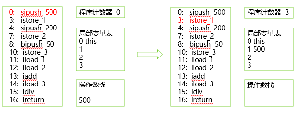


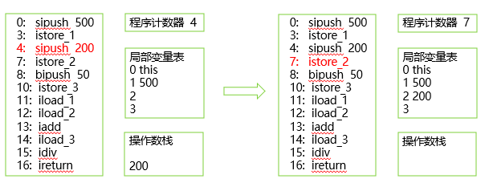


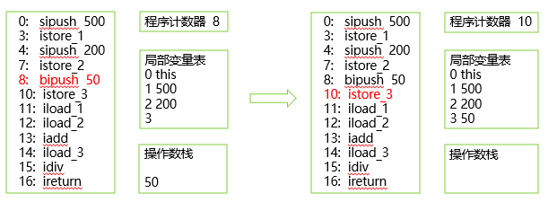


* iload_1:第一个局部变量压栈


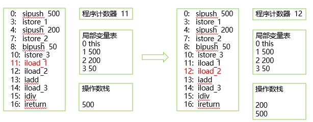


* iadd:2个数出栈,相加,和入栈


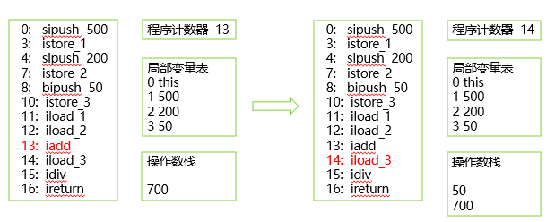


* idiv:2元素出栈,结果入栈;ireturn:将栈顶的整数结果返回


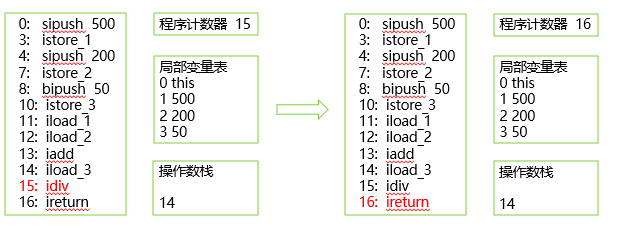


* 简单的字节码执行过程


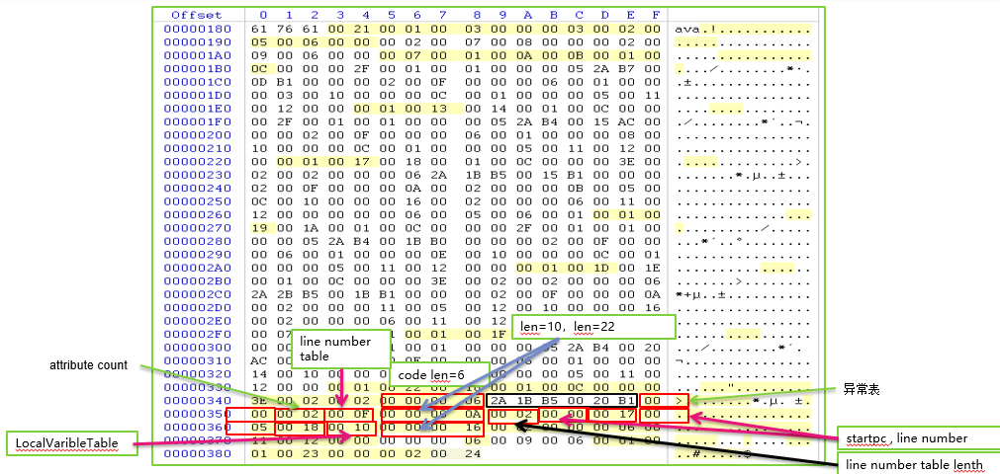


* 字节码指令为一个byte整数

```java
_nop                  =   0, // 0x00
_aconst_null          =   1, // 0x01
_iconst_0             =   3, // 0x03
_iconst_1             =   4, // 0x04
_dconst_1             =  15, // 0x0f
_bipush               =  16, // 0x10
_iload_0              =  26, // 0x1a
_iload_1              =  27, // 0x1b
_aload_0              =  42, // 0x2a
_istore               =  54, // 0x36
_pop                  =  87, // 0x57
_imul                 = 104, // 0x68
_idiv                 = 108, // 0x6c
```

* `void setAge(int)`的字节码
  * 2A 1B B5 00 20 B1
  * 2A _aload_0
    * 无参
    * 将局部变量slot0 作为引用 压入操作数栈
  * 1B _iload_1
    * 无参
    * 将局部变量slot1 作为整数 压入操作数栈
  * B5 _putfield
    * 设置对象中字段的值
    * 参数为2bytes (00 20) (指明了字段)
      * 指向常量池的引用
      * Constant_Fieldref
      * 此处为User.age
    * 弹出栈中2个对象:objectref, value
    * 将栈中的value赋给objectref的给定字段
  * B1 _return


# 特殊点


* Class类中的getDeclaredField()只能拿到当前类中的字段,不能拿到父类中的字段,需要递归
* Class类中的`getField()/getDeclaredField()`拿到的字段顺序是不固定的,但是长度和每个字段内容都仍然是相同的
* 类中的修饰符在编译器就已经在字节码文件中确定了,不需要等到运行期
