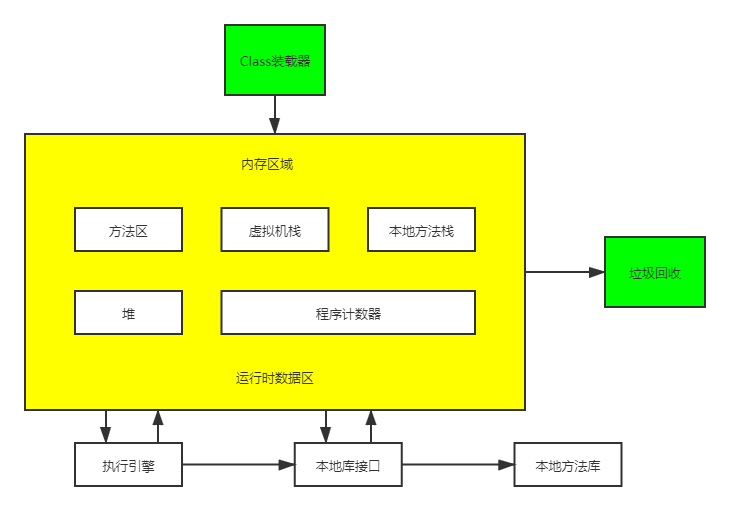
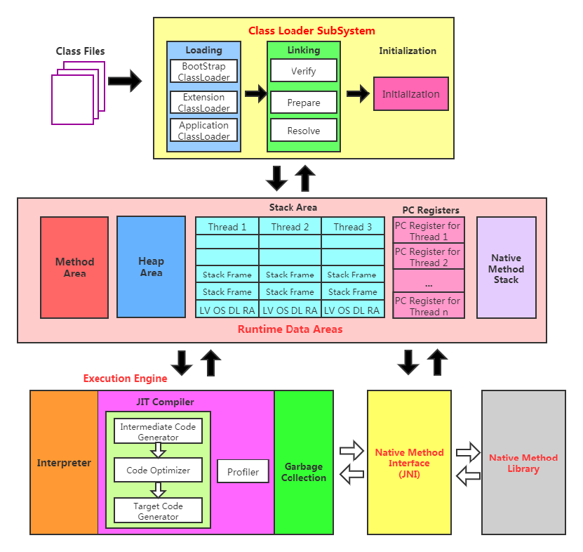
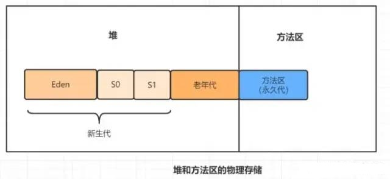
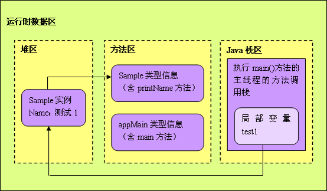
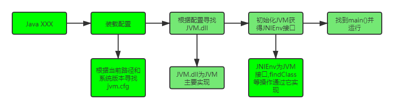

# JVM


# 架构模型


* Java编译器输入的指令流基本上是一种基于栈的指令集架构,另外一种指令集架构则是基于寄存器的指令集架构
* 基于栈式架构:
  * 设计和实现更简单,适用于资源受限的系统
  * 避开了寄存器的分配难题:使用零地址指令方式分配
  * 指令流中的指令大部分是零地址指令,其执行过程依赖于操作栈.指令集更小,编译器容易实现
  * 不需要硬件支持,可移植性更好,更好实现跨平台
* 基于寄存器架构:
  * 典型的应用是x86的二进制指令集:比如传统的PC以及Android的Davlik虚拟机
  * 指令集架构则完全依赖硬件,可移植性差
  * 性能优秀和执行更高效
  * 花费更少的指令去完成一项操作
  * 大部分情况下,基于寄存器架构的指令集往往都以一地址指令,二地址指令和三地址指令为主,而基于栈式架构的指令集却是以零地址指令为主
* 地址指令:通常机器做运算需要一个地址和一个操作数,这叫做一地址.有2个地址的叫二地址指令.零地址指令就是为没有地址,只有操作数


# 基本结构








# 类加载子系统


* 负责从文件系统或网络中加载class信息,加载的信息存放在方法区的内存空间中
* Java编译器将Java源码编译成字节码时过程:词法分析->语法分析->语法/抽象语法树->语义分析->注解抽象语法树->字节码生成器->字节码


# 方法区


* 所有线程共享的内存区域,它用于存储已被虚拟机加载的类信息、常量、静态变量、即时编译后的代码,类,字段,方法引用等数据
* 永久代和元空间都是方法区的实现,只不过不同的虚拟机实现不一样


## 永久代


* JDK7之前称为永久代,存储了类,方法编译后的信息,静态变量,运行时常量池,JIT代码缓存
* 运行时常量池信息包括字符串字面量和数组常量
* 永久代必须指定大小,容器内存溢出


## 元空间


* Metaspace:存放类元数据,和永久代类似,是JDK8以后的方法区实现
* 存储的信息和永久代类似,但是字符串常量被移出,存放到了堆中
* 元空间不属于JVM,是直接使用本地内存,所有元空间大小只受本地内存大小限制
* 使用元空间的好处:
  * 字符串存在永久代中,容易出现性能问题和内存溢出
  * 类及方法的信息等比较难确定其大小,因此对于永久代的大小指定比较困难,太小容易出现永久代溢出,太大则容易导致老年代溢出
  * 永久代会为 GC 带来不必要的复杂度,并且回收效率偏低
  * Oracle可能会将HotSpot与JRockit合二为一


## 元空间替换永久代


* 永久代的方法区,和堆使用的物理内存是连续的,永久代是通过以下这两个参数配置大小的
  * `-XX:PremSize`: 设置永久代的初始大小
  * `-XX:MaxPermSize`: 设置永久代的最大值,默认是64M



- 对于永久代,如果动态生成很多class,就很可能出现**java.lang.OutOfMemoryError:PermGen space错误** ,因为永久代空间配置有限.最典型的场景是,在web开发比较多jsp页面的时候
- JDK8之后,方法区存在于元空间,物理内存不再与堆连续,而是直接存在于本地内存中,理论上机器内存有多大,元空间就有多大


* 可以通过以下的参数来设置元空间的大小:
  * `-XX:MetaspaceSize`,初始空间大小,达到该值就会触发垃圾收集进行类型卸载,同时GC会对该值进行调整: 如果释放了大量的空间,就适当降低该值:如果释放了很少的空间,那么在不超过MaxMetaspaceSize时,适当提高该值
  * `-XX:MaxMetaspaceSize`,最大空间,默认是没有限制的
  * `-XX:MinMetaspaceFreeRatio`,在GC之后,最小的Metaspace剩余空间容量的百分比,减少为分配空间所导致的垃圾收集
  * `-XX:MaxMetaspaceFreeRatio`,在GC之后,最大的Metaspace剩余空间容量的百分比,减少为释放空间所导致的垃圾收集
* 使用元空间替换永久代可以尽量避免OOM异常,且使用PermSize和MaxPermSize设置永久代的大小就决定了永久代的上限,但是不是总能知道应该设置为多大合适, 如果使用默认值很容易遇到OOM错误.当使用元空间时,可以加载多少类的元数据就不再由MaxPermSize控制, 而由系统的实际可用空间来控制啦


## 运行时常量池


* 常量池表 (Constant Pool Table)是class文件的一部分,用于存放编译期生成的各种字面量与符号引用,这部分内容将在类加载后存放到方法区的运行时常量池中
* 运行时常量池,在加载类和接口到虚拟机后,就会创建对应的运行时常量池
* JVM为每个已加载的类型(类或接口)都维护一个常量池,池中的数据项像数组项一样是通过索引访问的
* 运行时常量池中包含多种不同的常量,包括编译期就已经明确的数值字面量,也包括到运行期解析后才能够获得的方法或者字段引用.此时不再是常量池中的符号地址了,这里换为真实地址:运行时常量池,相对于class文件常量池的另一重要特征是:具备动态性
* 运行时常量池类似于传统编程语言中的符号表 (symbol table),但是它所包含的数据却比符号表要更加丰富一些
* 当创建类或接口的运行时常量池时,如果构造运行时常量池所需的内存空间超过了方法区所能提供的最大值,则JVM会抛OOM异常


# 直接内存


* Java的NIO库允许使用直接内存来提高性能,直接内存优于堆,读写频繁场合可能会使用
* 直接内存不属于java堆空间,大小不受Xmx控制,理论可无限大,但仍然受系统内存限制


# Java堆


* 虚拟机启动的时候建立,存放几乎所有的对象实例,并且所有线程共享堆空间,GC主要回收的空间
  * JDK8前,堆中有新生代,老年代,永久代在方法区中,永久代主要存放字符串常量池,静态变量,类信息等不变的信息
  * JDK8后,永久代被元空间取代,而静态变量,字符串字面量被移到堆中
* 是和Java应用程序关系最密切的内存空间,几乎所有的对象都存放在其中,并且Java堆完全是自动化管理,通过垃圾回收机制,垃圾对象会自动清理,不需要显示释放
* 根据垃圾回收机制不同,Java堆有可能拥有不同的结构,最为常见的就是将整个Java堆分为新生代和老年代,其中新生代存放新生的对象或者年龄不大的对象,老年代则存放老年对象
* 新生代分为eden区,s0区,s1区,s0和s1也被称为from和to区域,他们是两块大小相等并且可以互换角色的空间
* 绝大多数情况下,对象首先分配在eden区,在一次新生代回收后,如果对象还存活,则会进入s0或s1区,之后每经过一次新生代回收,如果对象存活则它的年龄就加1,当对象达到一定的年龄后,则进入老年代
* 一般在初始化时将堆内存的最大和最小内存设置相同,可以减少GC回收次数


# Java栈


* 每个虚拟机线程都有一个栈,在线程被创建的时候创建,线程独占,不存在线程安全问题
* 栈不存在垃圾回收问题,只要线程结束,资源就释放,但是可能会OOM
* 当一个Java线程准备好执行以后,此时一个操作系统的本地线程也将同时创建.Java线程执行终止后,本地线程也会回收


## 栈帧


* 栈中的数据都是以栈帧 (Stack Frame) 的格式存在,在这个线程上正在执行的每个方法都各自对应一个栈帧
* 栈帧是一个内存区块,是一个数据集,维系着方法执行过程中的各种数据信息
* 栈帧包含局部变量表,操作数栈,动态链接,方法返回地址和一些其他附加信息
* JVM直接对Java栈的操作只有两个:方法调用创建一个栈帧,并压栈;方法调用完就出栈.遵循先进后出/后进先出原则
* 在一条活动线程中,同一时间只会有一个活动的栈帧,即只有当前正在执行的方法的栈帧(栈顶栈帧)是有效的,这个栈帧被称为当前栈帧(Current Erame),与当前栈相对应的方法就是当前方法 (CurrentMethod),定义这个方法的就是当前类 (Current class)
* 执行引擎运行的所有字节码指令只针对当前栈帧进行操作.如果在该方法中调用了其他方法,对应的新的栈帧会被创建出来,放在栈的顶端,成为新的当前帧
* 不同线程中所包含的栈帧是不允许存在相互引用的,即不可能在一个栈帧之中引用另外一个线程的栈帧
* 如果当前方法调用了其他方法,方法返回之际,当前栈帧会传回方法的执行结果给前一个栈帧,之后虚拟机会丢弃当前栈帧,使得前一个栈帧重新成为当前栈帧
* Java方法有两种返回函数的方式:一种是正常的函数返回,使用return指令;另外一种是抛出异常.不管使用哪种方式,都会导致栈帧被弹出


### 局部变量表


* Local Variables,又称为本地变量表.是一个数字数组,用于保存方法的参数,局部变量,基本数据类型,引用类型,返回类型
* 局部变量表的内存空间是在编译期完成分配,并保存在方法的Code属性的`maximum local variables或locals`数据项中,在方法运行时不会改变局部变量表的大小
* 静态方法中,局部变量表的参数压栈指令索引从0开始;而非静态方法从则是从1开始,因为非静态方法会默认压入this引用,但是字节码指令文件中并不会显示的压入this引用
* 局部变量表最基本的存储单元是slot (变量槽),slot可以重复利用,如调用了静态代码块之后,变量的作用域已经没有了,此时可重复利用slot
* 局部变量表中存放编译期可知的各种基本数据类型(8种),引用类型(reference),returnAddress类型的变量
* 在局部变量表中,32位以内的类型只占用一个slot (包括reference,returnAddress类型),64位的类型 (long和double) 占用两个slot
  * byte,short,char在存储前被转换为int,boolean也被转换为int,0表示false,非0表示true.lonq 和double 则占据两个slot

* JVM会为局部变量表中的每一个slot都分配一个访问索引,通过这个索引即可成功访问到局部变量表中指定的局部变量值
* 当一个实例方法被调用时,它的方法参数和方法体内部定义的局部变量将会按照顺序被复制到局部变量表中的每一个slot上
* 如果要访问一个64bit的变量时,只需要访问该变量的起始索引即可
* 如果当前帧是由构造方法或者实例方法创建的,那么该对象引用this将会存放在index为0的slot处,其余的参数按照参数表顺序继续排列


### 操作数栈


* Operand Stack,主要保存计算过程的中间结果,同时作为计算过程中变量临时的存储空间
* 每一个操作数栈都会拥有一个明确的栈深度用于存储数值,其所需的最大深度在编译期就定义好了,保存在方法的Code属性中的stack中
* 栈中的任何一个元素都是可以任意的Java数据类型:32bit的类型占用一个栈单位深度,64bit的类型占用两个栈单位深度
* 操作数栈并非采用访问索引的方式来进行数据访问的,而是只能通过标准的入栈(push)和出栈 (pop)操作来完成一次数据访问
* Java没有寄存器,所有参数传递使用操作数栈

```java
public static int add(int a,int b){
	int c =0;
	c=a+b;
	return c;
}
```

* 使用javap -c test.class或javap -verbose test.class获取字节码指令

```java
0: iconst_0			// 0压栈,即c压栈
2: istore_2			// 弹出int,存放于局部变量2
3: iload_0			// 把局部变量0压栈,即a压栈
4: iload_1			// 把局部变量1压栈,即b压栈
5: iadd				// 弹出2个变量,求和,结果压栈
6: istore_2			// 弹出结果,放于局部变量2
7: iload_2			// 局部变量2压栈
8: ireturn			// 返回
```


### 动态链接


* Dynamic Linking,指向运行时常量池的方法引用,保存着访问常量池的指针,方便程序访问常量池
* 每个栈帧内都包含一个指向运行时常量池中该栈帧所属方法的引用,其目的就是为了支持当前方法的代码能够实现动态链接.比如invokedynamic指令
* 在Java源文件被编译到字节码文件中时,所有的变量和方法引用都作为符号引用(Symbolic Reference)保存在class文件的常量池里.比如:描述一个方法调用了另外的其他方法时,就是通过常量池中指向方法的符号引用来表示的,而动态链接的作用就是为了将这些符号引用转换为调用方法的直接引用


### 方法返回地址


* Return Address,方法正常退出或异常退出的定义,存放调用该方法的pc寄存器的值
* 无论哪种方式退出,在方法退出后都返回到该方法被调用的位置
  * 正常退出时,调用者的pc寄存器的值作为返回地址,即调用该方法的指令的下一条指令的地址
  * 异常退出时,返问地址是要通过异常表来确定,栈帧中一般不会保存这部分信息
* 当方法返回或者出现异常时,虚拟机必须有一个异常处理表,方便发送异常的时候找到异常的代码,因此异常处理表也是帧数据区的一部分
* 方法的退出就是当前栈帧出栈的过程.此时,需要恢复上层方法的局部变量表,操作数栈,将返回值压入调用者栈帧的操作数栈,设置PC寄存器值等,让调用者方法继续执行下去
* 正常完成出口和异常完成出口的区别在于:通过异常完成出口退出的不会给他的上层调用者产生任何的返回值


### 帧数据区


* 动态链接+方法返回地址+其他附加信息在有些地方统称为帧数据区


## 本地变量


* 输入和输出参数以及方法内变量


## 栈帧数据


* 包括类文件,方法等

* 栈中的数据都是以栈帧(Stack Frame)的格式存在,栈帧是一个内存区块,是一个数据集,是一个有关方法和运行期数据的数据集,当一个方法A被调用时就产生了一个栈帧F1,并被压入栈中,A调用B,也是产生了F2,也被压入栈,执行完毕后,先弹出F2,再弹出F1,遵循先进后出的原则


## 逃逸


* 如果某个变量在当前线程中使用,同时又被其他线程所使用,就不能栈上分配,此时就属于逃逸现象
* 如果对象被创建之后只在方法内使用,则认为没有逃逸,可以栈上分配
* -XX:+DoEscapeAnslysis:启用逃逸分析


## 栈上分配


* 小对象(一般几十bytes),在没有逃逸的情况下,可以直接分配在栈上
* 直接分配在栈上,可以自动回收,减轻GC压力
* 大对象或者逃逸对象无法栈上分配


## 标量替换


* 标量:一个无法再分解成更小的数据的数据,Java中的基本类型就是标量.可以分解的数据叫做聚合量
* 有的对象可能不需要作为一个连续的内存结构存在也可以被访问到,那么对象的部分或全部可以不存储在内存,而是存储在寄存器中
* 在JIT阶段,如果经过逃逸分析,发现一个对象不会被外界访问,那么经过JIT优化,就会把这个对象拆成若干个其中包含的若干个成员变量来代替.这个过程就是标量替换
* -XX:+EliminateAllocations:开启标量替换,默认开启


## 方法的调用


* 在JVM中,将符号引用转换为调用方法的直接引用与方法的绑定机制相关,分为静态链接和动态链接:
  * 静态链接:当一个字节码文件被装载进JVM内部时,如果被调用的目标方法在编译期可知且运行期保持不变时,这种情况下将调用方法的符号引用转换为直接引用的过程称之为静态链接
  * 动态链接:被调用的方法在编译期无法被确定,只能够在程序运行期将调用方法的符号引用转换为直接引用
* 非虚方法:如果方法在编译期就确定了具体的调用版本,这个版本在运行时是不可变的,则称为非虚方法.其他方法都被称为虚方法
  * 静态方法,私有方法,final方法,实例构造器,父类方法都是非虚方法
* 非虚方法对应静态链接,虚方法对应动态链接
* 普通调用指令:
  * invokestatic: 调用静态方法,解析阶段确定唯一方法版本
  * invokespecial: 调用<init>方法,私有及父类方法,解析阶段确定唯一方法版本
  * invokevirtual: 调用所有虚方法
  * invokeinterface: 调用接口方法
* 动态调用指令:
  * invokedynamic: 动态解析出需要调用的方法,然后执行.Java中的Lambda表达式编译后为该指令调用
* 普通指令固化在虚拟机内部,方法的调用执行不可人为干预,而invokedynamic指令则支持由用户确定方法版本
* invokestatic指令和invokespecial指令调用的方法称为非虚方法,其余的 (final修饰的除外) 称为虚方法


## 方法重写


* 找到操作数栈顶的第一个元素所执行的对象的实际类型,记作 C
* 如果在类型 C 中找到与常量中描述符合的方法,则进行访问权限校验,如果通过则返回这个方法的直接引用,查找结束;如果不通过,则返回java.lanq.IllegalAccessError
* 否则,按照继承关系从下往上依次对 C 的各个父类进行第 2 步的搜索和验证过程.如果始终没有找到,则抛出 java.lang.AbstractMethodError


## 虚方法表


* 在面向对象的编程中,会很频繁的使用到动态分派,如果在每次动态分派的过程中都要重新在类的方法元数据中搜索合适的目标的话就可能影响到执行效率.因此,为了提高性能,JVM采用在类的方法区建立一个虚方法表(virtual method table) (非虚方法不会出现在表中)来实现.使用索引表来代替查找
* 每个类中都有一个虚方法表,表中存放着各个方法的实际入口
* 虚方法表会在类加载的链接阶段被创建并开始初始化,类的变量初始值准备完成之后,JVM会把该类的方法表也初始化完毕


# 本地方法栈


* 和Java栈类似,但虚拟机允许Java直接调用native本地方法(通常用C编写)


# 垃圾回收


* 回收方法区,堆,直接内存的空间,其中Java堆是垃圾回收的重点区域


# PC寄存器


* 又名程序计数器.就是一个指针,指向方法区中的下一个要执行的代码指令,由执行引擎读取,占用非常小,几乎可以忽略不记
* 每个线程私有,并且在线程被创建时创建
* 任意时刻,Java线程总是在执行一个方法,该方法称为当前方法
* 若当前方法不是native方法,则pc寄存器会执行当前方法的指令;若是native方法,pc寄存器值为undefined
* 寄存器存放当前执行环境指针,程序计算器,操作栈指针,计算的变量指针等
* 因为CPU需要不停的切换线程,如果不记住每条线程的执行地址,JVM字节码解释器就不能通过改变PC寄存器的值来执行下一条字节码指令
* 它是程序控制流的指示器,分支,循环,跳转,异常处理,线程恢复等基础功能都需要依赖这个计数器来完成
* 字节码解释器工作时就是通过改变这个计数器的值来选取下一条需要执行的字节码指令
* 它是唯一一个在Java 虚拟机规范中没有规定任何OOM情况的区域,其他区域都有可能溢出


# 执行引擎


* ExecutionEngine,执行虚拟机的字节码,将字节码指令解释/编译为对应平台上的本地机器指令


## 热点代码


* 一个被多次调用的方法,或者是一个方法体内部循环次数较多的循环体都可以被称之为热点代码,因此都可以通过JIT编译器编译为本地机器指令.由于这种编译方式发生在方法的执行过程中,因此也被称之为栈上替换,或简称为OSR (On StackReplacement)编译
* JIT编译器将热点代码编译为本地机器指令,主要依靠热点探测功能.目前HotSpot VM所采用的热点探测方式是基于计数器的热点探测
* HotSpot VM将会为每个方法都建立2个不同类型的计数器:方法调用计数器 (Invocation Counter)和回边计数器 (BackEdge Counter).方法调用计数器用于统计方法的调用次数;回边计数器则用于统计循环体执行的循环次数


## 热度衰减


* 如果不做任何设置,方法调用计数器统计的并不是方法被调用的绝对次数,而是一个相对的执行频率,即一段时间之内方法被调用的次数.当超过一定的时间限度,如果方法的调用次数仍然不足以让它提交给即时编译器编译,那这个方法的调用计数器就会被减少一半,这个过程称为方法调用计数器热度的衰减(Counter Decay),而这段时间就称为此方法统计的半衰周期 (Counter Half Life Time)
* 进行热度衰减的动作是在虚拟机进行垃圾收集时顺便进行的,可以使用虚拟机参数-xx:-UseCounterDecay 来关闭热度衰减,让方法计数器统计方法调用的绝对次数,这样,只要系统运行时间足够长,绝大部分方法都会被编译成本地代码
* 可以使用 -xx:CouterEalfLifeTime 参数设置半衰周期的时间,单位是秒


# 本地接口库


* JDK中以native修饰的方法或类,主要是用来调用C语言或本地的系统方法,逐渐在减少使用


# 堆,栈,方法区交互





```java
public class AppMain {
    //运行时,jvm把appmain的信息都放入方法区
    public static void  main(String[] args){
        //main方法本身放入方法区
        Sample test1 = new  Sample( "测试1" );  
        //test1是引用,所以放到栈区里,Sample是自定义对象应该放到堆里面
        Sample test2 = new  Sample( "测试2");
        test1.printName();
        test2.printName();
    }
}

public class Sample{
 	private String  name;     
	//new Sample实例后,name引用放入栈区里,name对象放入堆里
    public Sample(String name){
        this .name = name;
    }
    //print方法本身放入方法区里
    public void printName(){
        System.out.println(name);
    }
}
```

* 堆解决的是数据存储问题,即数据怎么放,放在哪
* 栈解决程序的运行问题,即程序如何执行,或者说如何处理数据
* 方法区则是辅助堆栈的一块永久区(Perm),解决堆栈信息的产生,是先决条件
  * 如:创建一个User对象,那么User类的一些信息(类信息,静态信息都存在于方法区中)
  * User被实例化之后,被存储到Java堆中,一块内存空间
  * 使用实例的是时候,都是使用User对象的引用,如User user = new User(),user则放在栈中


# JVM的生命周期


## 虚拟机的启动


* Java虚拟机的启动是通过引导类加载器(bootstrap class loader)创建一个初始类(initial class)来完成的,这个类是由虚拟机的具体实现指定的


## 虚拟机的执行


* 执行一个Java程序的时候,真真正正在执行的是一个叫做Java虚拟机的进程


## 虚拟机的退出


* 程序正常执行结束
* 异常或错误导致的程序终止
* 由于操作系统错误而导致的虚拟机进程终止
* 某线程调用Runtime类或System类的exit方法,或Runtime类的halt(),并且Java安全管理器也允许这次exit或halt操作
* 除此之外,JNI(Java Native Interface)规范描述了用JNI Invocation API来加载或卸载Java虚拟机时,Java虚拟机的退出情况


# 启动流程





# 字节码执行引擎


## 运行时栈帧结构


* 栈帧也叫过程活动记录,是编译器用来进行方法调用和方法执行的一种数据结构,他是虚拟机运行时数据区域红的虚拟机栈的栈元素
* 栈帧中包含了局部变量表,操作数栈,动态链接和方法返回地址以及额外的一些附加信息,在编译过程中,局部变量表的大小已经确定,操作数栈深度也已经确定,因此栈帧在运行的过程中需要分配多大的内存是固定的,不受运行时影响
* 对于没有逃逸的对象也会在栈上分配内存,对象的大小其实在云习性时也是确定的,因此即使出现了栈上内存分配,也不会导致栈帧改变大小
* 一个线程中,可能调用链会很长,很多方法都同时处于执行状态
* 对于执行引擎,活动线程中,只有栈顶的栈帧是最有效的,称为当前栈帧,这个栈帧所关联的方法称为当前方法,执行引擎所运行的字节码指令仅对当前栈帧进行操作


## 局部变量表


* 使用Slot(槽)装载基本数据类型,引用,通常为32位,double和long占用2个slot
* 当一个变量的PC寄存器的值大于slot的作用域的时候,slot可以复用


## 操作数栈


* 每一个栈帧内部都包含一个称为操作数栈(Operand Stack)的后进先出栈
* 栈帧中操作数栈的长度由编译期决定,并且存储于类和接口的二进制表示之中,既通过方法的 Code 属性保存及提供给栈帧使用
* 操作数栈不是通过索引来访问,而是通过标准的压栈和出栈访问
* 在上下文明确,不会产生误解的前提下,经常把当前栈帧的操作数栈直接简称为操作数栈
* 操作数栈所属的栈帧在刚刚被创建的时候,操作数栈是空的. Java虚拟机提供一些字节码指令来从局部变量表或者对象实例的字段中复制常量或变量值到操作数栈中,也提供了一些指令用于从操作数栈取走数据,操作数据和把操作结果重新入栈.在方法调用的时候,操作数栈也用来准备调用方法的参数以及接收方法返回结果
* 如iadd字节码指令的作用是将两个 int 类型的数值相加,它要求在执行的之前操作数栈的栈顶已经存在两个由前面其他指令放入的 int 型数值.在 iadd 指令执行时,2个 int 值从操作栈中出栈,相加求和,然后将求和结果重新入栈.在操作数栈中,一项运算常由多个子运算(Subcomputations)嵌套进行,一个子运算过程的结果可以被其他外围运算所使用
* 操作数栈会对压入其中的byte,short,char类型先转换为int,之后再进行操作
* 每一个操作数栈的成员(Entry)可以保存一个Java虚拟机中定义的任意数据类型的值,包括 long 和 double 类型
* 在操作数栈中的数据必须被正确地操作,这里正确操作是指对操作数栈的操作必须与操作数栈栈顶的数据类型相匹配,例如不可以入栈两个 int 类型的数据,然后当作 long 类型去操作他们,或者入栈两个 float 类型的数据,然后使用 iadd 指令去对它们进行求和.有一小部分 Java 虚拟机指令(如dup和swap)可以不关注操作数的具体数据类型,把所有在运行时数据区中的数据当作裸类型(Raw Type)数据来操作,这些指令不可以用来修改数据,也不可以拆散那些原本不可拆分的数据,这些操作的正确性将会通过 Class 文件的校验过程来强制保障
* 在任意时刻,操作数栈都会有一个确定的栈深度,一个 long 或者 double 类型的数据会占用两个单位的栈深度,其他数据类型则会占用一个单位深度


## 动态连接


## 方法返回地址


## 附加信息


* 虚拟机规范中允许具体的虚拟机实现增加一些规范里没有描述的信息到栈帧中,这部分信息完全取决于虚拟机的实现


