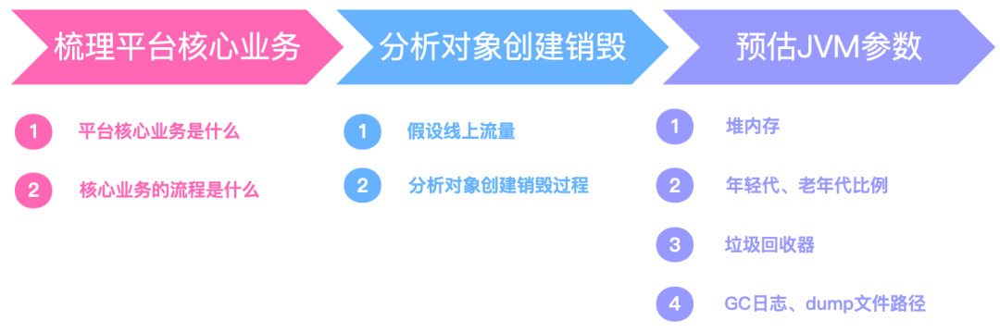

# Jvm调优


# 调优方式





* 业务预估: 根据预期的并发量、平均每个任务的内存需求大小,然后评估需要几台机器来承载,每台机器需要什么样的配置
* 容量预估: 根据系统的任务处理速度,然后合理分配Eden、Surivior区大小,老年代的内存大小
* 回收器选型: 响应优先的系统,建议采用ParNew+CMS回收器;吞吐优先、多核大内存(heap size≥8G)服务,建议采用G1回收器
* 优化思路: 让短命对象在MinorGC阶段就被回收(同时回收后的存活对象<Survivor区域50%,可控制保留在新生代),长命对象尽早进入老年代,不要在新生代来回复制;尽量减少Full GC的频率,避免FGC系统的影响
* 尽量在上线之前,就将机器的JVM参数设置到最优
* 并不一定所有问题都可以通过JVM进行调优解决,大多数的Java应用不需要进行JVM优化,可以遵循以下的一些原则: 
  * 上线之前,应先考虑将机器的JVM参数设置到最优
  * 减少创建对象的数量(代码层面)
  * 减少使用全局变量和大对象(代码层面)
  * 优先架构调优和代码调优,JVM优化是不得已的手段(代码、架构层面)
  * 分析GC情况优化代码比优化JVM参数更好(代码层面)
* 其实最有效的优化手段是架构和代码层面的优化,而JVM优化则是最后不得已的手段


# OOM


## 分析


- 要解决OOM异常或heap space的异常,一般的手段是首先通过内存映像分析工具(如Eciipse Memory Analyzer)对dump 出来的堆转储快照进行分析,确认内存中的对象是否是必要的,也就是要先分清楚到底是出现了内存泄漏 (MemoryLeak)还是内存溢出 (Memory Overflow)
- 如果是内存泄漏,可进一步通过工具查看泄漏对象到GC Roots 的引用链,找到泄漏对象是通过怎样的路径与GC Roots 相关联并导致垃圾收集器无法自动回收它们的.掌握了泄漏对象的类型信息,以及GC Roots 引用链的信息,就可以比较准确地定位出泄漏代码的位置
- 如果不存在内存泄漏,即内存中的对象确实都还必须存活着,那就应当检查虚拟机的堆参数 (-Xmx 与-Xms),与机器物理内存对比看是否还可以调大,从代码上检查是否存在某些对象生命周期过长、持有状态时间过长的情况,尝试减少程序运行期的内存消耗


## 原因


- 创建了大量对象实例,导致堆内存溢出.可适当适当堆内存
- 创建加载了大量类,导致元空间溢出.可适当增大服务器内存,增大元空间内存
- 直接内存溢出:ByteBuffer.allocateDirect()等方法直接操作内存相关方法,导致系统内存不足,最终导致内存溢出.减少堆内存,增大服务器内存


# 案例1


- Full GC过长,20-30S
  - 减小堆内存大小,但是可以部署多个程序,避免内存浪费
- 不定期内存溢出,把堆内存加大,会加剧溢出.导出堆转储快照信息,没有任何信息.内存监控也正常
  - 该情况可能是NIO使用直接内存时,直接内存过小,而GC又不能控制直接内存,导致内存被撑爆
  - 可以修改JVM的DirectMemory相关参数解决或换更大内存的服务器
- 大量消息从A服务发送到B服务的时候,B服务无法及时处理导致B服务崩溃
  - 在A和B服务之间添加消息队列


# 案例2


- 垂直电商,最高每天百万订单,JVM内存应该设置多大才能使响应时间不超过100ms
- 需要根据业务估算最高峰时期的QPS,TPS,如果QPS是1000/S,则1个小时就是36W,一次类推计算
- 进行压测,同时记录GC日志,根据GC日志中回收的频率以及回收时每个区的大小计算内存大小(估值)
- 解决办法: 加CPU,加内存,上云,加缓存


# 案例3


- CPU经常跑满
- 找到CPU占用最高的Java进程,导出该线程的堆栈(jstack),查找那个方法(栈帧)消耗时间高(jstack)


# 案例4


- CPU内存飚高
- 导出堆内存(jmap),分析(jhat,jvisualvm,mat,jprofiler)


# 案例5(用户登录)


* 每天100w次登陆请求, 8G 内存该如何设置JVM参数


## 系统上线容量规划


### 一般步骤


* 计算业务系统每秒钟创建的对象会佔用多大的内存空间,然后计算集群下的每个系统每秒的内存占用空间(对象创建速度)
* 设置一个机器配置,估算新生代的空间,比较不同新生代大小之下,多久触发一次MinorGC
* 为了避免频繁GC,就可以重新估算需要多少机器配置,部署多少台机器,给JVM多大内存空间,新生代多大空间
* 根据这套配置,基本可以推算出整个系统的运行模型,每秒创建多少对象,几秒以后成为垃圾,系统运行多久新生代会触发一次GC,频率多高


### 以登录为例


* 假设每天100w次登录请求,登陆峰值在早上,预计持续2小时左右,预估峰值时期每秒100次登录请求
* 假设部署3台服务器,每台机器每秒处理30次登录请求,假设一个登陆请求需要处理1s,JVM新生代里每秒就要生成30个登录对象,1s之后请求完毕这些对象成为了垃圾
* 一个登陆请求对象假设20个字段,一个对象估算500byte,30个登录占用大约15k,考虑到RPC和DB操作,网络通信,写库,写缓存一顿操作下来,可以扩大到20-50倍,大约1s产生几百k-1M数据
* 假设2C4G机器部署,分配2G堆内存,新生代则只有几百M,按照1s1M的垃圾产生速度,几百秒就会触发一次MinorGC
* 假设4C8G机器部署,分配4G堆内存,新生代分配2G,如此需要几个小时才会触发一次MinorGC

* 可以粗略的推断出每天100w次请求的登录系统,按照4C8G的3实例集群配置,分配4G堆内存,2G新生代的JVM,可以保障系统的一个正常负载
* 搭建新系统要每个实例需要多少容量多少配置,集群配置多少个实例等等这些都计算出来,最后进行压测再进行调整


## 垃圾回收器的选择


- JVM在GC时不允许一边垃圾回收,一边还创建新对象
- JVM需要一段STW的暂停时间,而STW会造成系统短暂停顿不能处理任何请求
- 新生代收集频率高,性能优先,常用复制算法;老年代频次低,空间敏感,避免复制方式
- 所有垃圾回收器的涉及目标都是要让GC频率更少,时间更短,减少GC对系统影响


### 吞吐量VS响应时间


* 吞吐量 = `CPU在用户应用程序运行的时间 / (CPU在用户应用程序运行的时间 + CPU垃圾回收的时间)`
* 响应时间 = 平均每次GC的耗时
* 堆内存增大,gc一次能处理的数量变大,吞吐量大;但是gc一次的时间会变长,导致后面排队的线程等待时间变长;相反,如果堆内存小,gc一次时间短,排队等待的线程等待时间变短,延迟减少,但一次请求的数量变小(并不绝对符合)
* 无法同时兼顾,是吞吐优先还是响应优先,需要权衡


### CMS和G1


* 目前主流的垃圾回收器配置是新生代采用ParNew,老年代采用CMS组合的方式,或者是完全采用G1
* 响应优先:ParNew+CMS->`-XX:+UseParNewGC -XX:+UseConcMarkSweepGC`
* 吞吐优先:G1->`-XX:+UseG1GC`
* 业务系统:
  - 延迟敏感的推荐CMS
  - 大内存服务,要求高吞吐的,采用G1回收器


## 分区的比例,大小规划


* 首先,JVM最重要最核心的参数是去评估内存和分配,需要指定堆内存的大小,`-Xms和-Xmx`一般都指定为系统内存的一半,过大会占用服务器的系统资源,过小则无法发挥JVM的最佳性能

* 其次,需要指定`-Xmn`新生代的大小,这个参数非常关键,虽然sun官方推荐为3/8大小,但是要根据业务场景来定,针对于无状态或者轻状态服务(如Web应用)来说,一般新生代甚至可以给到堆内存的3/4大小;而对于有状态服务(如IM服务,网关接入层等)新生代可以按照默认比例1/3来设置.服务有状态,则意味著会有更多的本地缓存和会话状态信息常驻内存,应为要给老年代设置更大的空间来存放这些对象

* 最后,是`-Xss`栈内存大小,默认值和JDK版本,系统有关,一般默认512~1024kb,不需要设置

* 引入性能压测环节,测试对登录接口压至1s内60M的对象生成速度,采用ParNew+CMS的组合回收器,正常的JVM参数配置如下: 

  ```java
  -Xms3072M -Xmx3072M -Xss1M -XX:MetaspaceSize=256M -XX:MaxMetaspaceSize=256M -XX:SurvivorRatio=8
  ```

* 这样设置可能会由于动态对象年龄判断原则导致频繁full gc

  * 压测过程中,短时间(比如20S后)Eden区就满了,此时再运行的时候对象已经无法分配,会触发MinorGC
  * 假设在这次GC后S1装入100M,马上过20S又会触发一次MinorGC,多出来的100M存活对象+S1区的100M已经无法顺利放入到S2区,此时就会触发JVM的动态年龄机制,将一批100M左右的对象推到老年代保存,持续运行一段时间,系统可能一个小时候内就会触发一次FullGC
  * 按照默认8:1:1的比例来分配时, survivor区只有 1G的 10%左右,也就是几十到100M,如果每次minor GC垃圾回收过后进入survivor对象很多,并且survivor对象大小很快超过 Survivor 的 50% ,那么会触发动态年龄判定规则,让部分对象进入老年代
  * 而一个GC过程中,可能部分WEB请求未处理完毕,几十兆对象,进入survivor的概率,是非常大的,甚至是一定会发生的

* 解决问题:为了让对象尽可能的在新生代的eden区和survivor区,尽可能的让survivor区内存多一点,达到200M左右: 

  ```java
  -Xms3072M -Xmx3072M -Xmn2048M -Xss1M -XX:MetaspaceSize=256M -XX:MaxMetaspaceSize=256M  -XX:SurvivorRatio=8  
  ```

* survivor达到200m,如果几十兆对象到达survivor, survivor 也不一定超过 50%.这样可以防止每次垃圾回收过后,survivor对象太早超过 50% ,这样就降低了因为对象动态年龄判断原则导致的对象频繁进入老年代的问题


### 动态年龄判断规则


* 对象进入老年代的动态晋升年龄计算阈值: Minor GC 时,Survivor 中年龄 1 到 N 的对象大小超过 Survivor 的 50% 时,则将大于等于年龄 N 的对象放入老年代
* 核心的优化策略: 让短期存活的对象尽量都留在survivor里,不要进入老年代,这样在minor gc时这些对象都会被回收,不会进到老年代从而导致full gc


## 评估对象从新生代到老年代


* 假设一次minor gc要间隔二三十秒,并且,大多数对象一般在几秒内就会变为垃圾,如果对象这么长时间都没被回收,可以认为这些对象是会存活的比较长的对象,从而移动到老年代
* 可以将默认的15改小一点,比如10,那么对象要经过10次minor gc才会进入老年代,整个时间也有5-6分钟了(10*30s= 300s),和几秒的时间相比,对象已经存活了足够长时间了
* 所以,可以适当调整JVM参数如下: 

```java
‐Xms3072M ‐Xmx3072M ‐Xmn2048M ‐Xss1M ‐XX:MetaspaceSize=256M ‐XX:MaxMetaspaceSize=256M ‐XX:SurvivorRatio=8 ‐XX:MaxTenuringThreshold=5 
```


## 评估对象直接到老年代


* 对于多大的对象直接进入老年代(参数-XX:PretenureSizeThreshold),可以结合实际业务看下有没有什么大对象生成,预估大对象的大小,一般来说设置为1M就差不多了,很少有超过1M的大对象,所以: 可以适当调整JVM参数如下: 

```java
‐Xms3072M ‐Xmx3072M ‐Xmn2048M ‐Xss1M ‐XX:MetaspaceSize=256M ‐XX:MaxMetaspaceSize=256M ‐XX:SurvivorRatio=8 ‐XX:MaxTenuringThreshold=5 ‐XX:PretenureSizeThreshold=1M
```


## CMS老年代参数优化


* JDK8默认的垃圾回收器是-XX:+UseParallelGC(年轻代)和-XX:+UseParallelOldGC(老年代),如果内存较大(超过4G,只是经验值),还是建议使用G1
* 这里是4G以内,又是主打低延时的业务系统,可以使用下面的组合: 

```java
ParNew+CMS(-XX:+UseParNewGC -XX:+UseConcMarkSweepGC)
```

* 新生代的采用ParNew,工作流程就是经典复制算法,在三块区中进行流转回收,只不过采用多线程并行的方式加快了MinorGC速度
* 老年代的采用CMS,优化老年代参数: 比如老年代默认在标记清除以后会做整理,还可以在CMS增加GC频次还是增加GC时长上做些取舍,如下是响应优先的参数调优: 

```java
XX:CMSInitiatingOccupancyFraction=70
```

* 设定CMS在对内存占用率达到70%的时候开始GC(因为CMS会有浮动垃圾,所以一般都较早启动GC)

```java
XX:+UseCMSInitiatinpOccupancyOnly
```

* 和上面搭配使用,否则只生效一次

```java
-XX:+AlwaysPreTouch
```

* 强制操作系统把内存真正分配给JVM,而不是用时才分配
* 只要年轻代参数设置合理,老年代CMS的参数设置基本都可以用默认值,如下所示: 

```java
‐Xms3072M ‐Xmx3072M ‐Xmn2048M ‐Xss1M ‐XX:MetaspaceSize=256M ‐XX:MaxMetaspaceSize=256M ‐XX:SurvivorRatio=8  ‐XX:MaxTenuringThreshold=5 ‐XX:PretenureSizeThreshold=1M ‐XX:+UseParNewGC ‐XX:+UseConcMarkSweepGC ‐XX:CMSInitiatingOccupancyFraction=70 ‐XX:+UseCMSInitiatingOccupancyOnly ‐XX:+AlwaysPreTouch
```


## 配置dump文件和GC日志


* 额外增加了GC日志打印、OOM自动dump等配置内容,帮助进行问题排查

```java
-XX:+HeapDumpOnOutOfMemoryError
```

* 在OOM,JVM快死掉的时候,输出Heap Dump到指定文件
* 路径只指向目录,JVM会保持文件名的唯一性,叫java_pid${pid}.hprof

```java
-XX:+HeapDumpOnOutOfMemoryError
-XX:HeapDumpPath=${LOGDIR}/
```

* 输出4G的HeapDump,会导致IO性能问题,在普通硬盘上,会造成20秒以上的硬盘IO跑满,在容器环境下,这个也会影响同一宿主机上的其他容器
* GC的日志的输出也很重要: 

```java
-Xloggc:/dev/xxx/gc.log 
-XX:+PrintGCDateStamps 
-XX:+PrintGCDetails
```

* GC的日志实际上对系统性能影响不大,打日志对排查GC问题很重要


## 通用JVM参数模板


* 基于4C8G系统的ParNew+CMS回收器模板(响应优先),新生代大小根据业务灵活调整

```java
-Xms4g
-Xmx4g
-Xmn2g
-Xss1m
-XX:SurvivorRatio=8
-XX:MaxTenuringThreshold=10
-XX:+UseConcMarkSweepGC
-XX:CMSInitiatingOccupancyFraction=70
-XX:+UseCMSInitiatingOccupancyOnly
-XX:+AlwaysPreTouch
-XX:+HeapDumpOnOutOfMemoryError
-verbose:gc
-XX:+PrintGCDetails
-XX:+PrintGCDateStamps
-XX:+PrintGCTimeStamps
-Xloggc:gc.log
```

* 如果是GC的吞吐优先,推荐使用G1,基于8C16G系统的G1回收器模板: 

```java
-Xms8g
-Xmx8g
-Xss1m
-XX:+UseG1GC
-XX:MaxGCPauseMillis=150
-XX:InitiatingHeapOccupancyPercent=40
-XX:+HeapDumpOnOutOfMemoryError
-verbose:gc
-XX:+PrintGCDetails
-XX:+PrintGCDateStamps
-XX:+PrintGCTimeStamps
-Xloggc:gc.log
```

* `XX:MaxGCPauseMillis=N`: 最大GC停顿时间.柔性目标,JVM满足90%,不保证100%,默认200
  * 调低:延迟更低,但MinorGC频繁,MixGC回收老年代区减少,增大Full GC的风险
  * 调高:单次回收更多的对象,但系统整体响应时间也会被拉长
* `-XX:InitiatingHeapOccupancyPercent=n`: 当整个堆的空间使用百分比超过这个值时,就会融发MixGC,默认45
  * 调低: 更早触发MixGC,浪费cpu
  * 调高: 堆积过多代回收region,增大FullGC的风险


# 案例6(电商下单)


## 以电商为例


* 以电商平台的用户下单购物这个业务流程来看看如何进行估算JVM参数
* 假设平台有1个亿的注册用户,日活用户1000万,这些用户会在电商平台进行浏览商品、下单购买以及收货评价等操作,但是实际上真正下单购买的用户并没有那么多,如果有10%的转化率,那么就相当于每天电商平台有100w个订单.另外一般情况下这些订单主要分布在一天当中的高峰时间,比如中午或者晚上.如果把用户购买的高峰时间定为3小时,也就是说极端情况下将所有的订单的生成都分布在这三个小时中完成,也就是每小时产生33万个订单,每秒产生100个订单左右
* 在估算订单对象大小之前,先要了解对象的组成:一个JVM对象的大小主要由对象头、数据以及数据补齐.对象头以及对象补齐基本变化不大,因此对象的大小实际和对象中的属性有直接关系,对象中的属性越多,对象占用的空间大小也就越大
* 根据实际案例情况来具体估算一个订单对象大概占多少内存空间
  * 订单对象主要包括了如下属性: 订单编号,商品编号,商品价格,付款时间,发货时间等,此处只说明估算的方法,需根据实际自行估算
  * 总共估算下来应该不到1k,但实际中还有其他各种占用以及其他对象,因此可以考虑将对象的总和扩大30-50倍进行估算,即平台中产生的各种对象的总和为`30 * 1kb`即为30kb
  * 如果每秒产生100个对象,那么就相当于每秒产生3000kb的对象,大概3M
  * 另外由于电商平台中布置下单这一个操作,还会包含订单查询,商品查询等其他业务,综合起来再放大10倍,也就是说每秒JVM中新增30M左右的对象
  * 对于一台4核8G的服务器来说,可以为服务分配3G左右的堆内存,512M左右的元空间
* 考虑到电商平台存在大促场景,这个时候的流量可能是平时的好几倍,因此实际需要将堆内存中的年轻代放大,Eden区可以到1.6G,Survivor区可以各自200M,这样可以避免由于年轻代空间不足导致对象提前进入老年代而造成fullGC的频率变高,从而影响服务的稳定性


## 调优思路


* 客户端和服务端建立了websocket连接,如果连接未正常建立,又重新建立连接,且服务端未将连接关闭,就会导致重新使用新的请求对象,随着程序运行,JVM中出现大量对象来不及回收,最终导致JVM内存溢出
* 查询时没有控制好查询的条件或者查询的数据量就很大,这些数据如果全部load到内存中就很容易导致内存溢出.所以一般涉及到数据查询的代码要做好相应的处理,分页,限制查询数据量或者流式查询
* 在for循环或者while循环中大量创建对象,最终导致对象在对堆内存中堆积
* JVM启动时会为每个线程的虚拟机栈分配固定大小的内存,因此虚拟机栈的深度是确定的,如果代码中出现不合理的递归代码,就会造成虚拟机栈只入栈不出栈,最终导致虚拟机栈内存空间被耗尽,从而产生StackOverFlowError
* 配置-XX:HeapDumpPath,当JVM发生OOM的时候就可以到对应的目录去找到hprof文件,利用MAT工具进行分析
* 如果还没有发生内存溢出,可以通过命令`jmap -dump:format=b,file=/tmp/文件名.hprof PID`来手动导出内存快照进行分析
* 新产生的对象都会被分配在年轻代对应的堆内存中,如果设置的年轻代过小,对象进入到老年代堆空间的概率就会增大,引起full GC的可能性也会大大增加.因此JVM参数如果设置的不合理一般是堆内存大小、元数据区大小以及垃圾回收器
