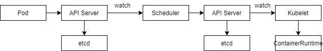
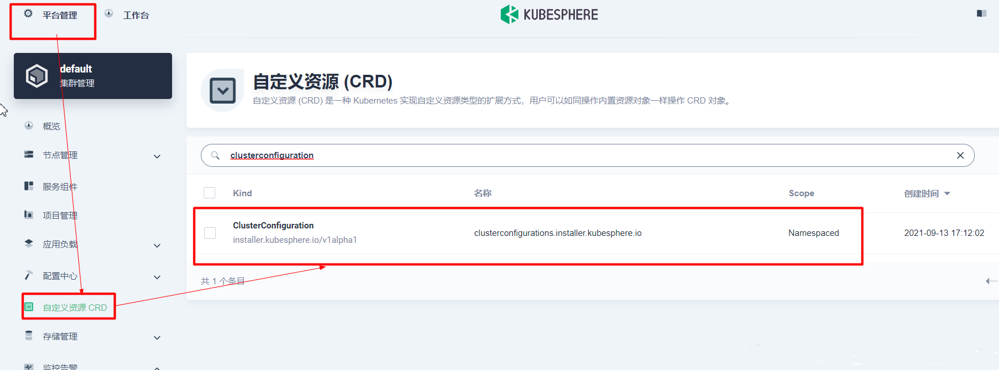

# K8S

https://www.yuque.com/leifengyang/oncloud

# 概述


* Kubernetes 提供了一个可弹性运行分布式系统的框架,满足用户的扩展要求、故障转移、部署模式等
* 服务发现和负载均衡:Kubernetes 可以负载均衡并分配网络流量,从而使部署稳定
* 存储编排:Kubernetes 允许自动挂载自定义存储系统,例如本地存储、公共云提供商等
* 自动部署和回滚:可以使用 Kubernetes 描述已部署容器的所需状态,它可以以受控的速率将实际状态更改为期望状态.例如,可以自动化 Kubernetes 来为你的部署创建新容器, 删除现有容器并将它们的所有资源用于新容器
* 自动完成装箱计算:Kubernetes 允许指定每个容器所需 CPU 和内存,当容器指定了资源请求时,Kubernetes 可以做出更好的决策来管理容器的资源
* 自我修复:Kubernetes 重新启动失败的容器,替换容器,杀死不响应用户定义的运行状况检查的容器,并且在准备好服务之前不将其通告给客户端
* 密钥与配置管理:Kubernetes 允许存储和管理敏感信息,例如密码,OAuth 令牌和 ssh 密钥.用户可以在不重建容器镜像的情况下部署和更新密钥和应用程序配置,也无需在堆栈配置中暴露密钥
* K8S里的所有资源对象都可以使用yaml或json格式的文件定义或描述


# 核心组件


## 控制平面组件


* 控制平面组件(Control Plane Components)对集群做出全局决策(比如调度),以及检测和响应集群事件(例如,当不满足部署的 `replicas` 字段时,启动新的 [pod](https://kubernetes.io/docs/concepts/workloads/pods/pod-overview/))
* 控制平面组件可以在集群中的任何节点上运行, 然而,为了简单起见,设置脚本通常会在同一个计算机上启动所有控制平面组件, 并且不会在此计算机上运行用户容器.请参阅[使用 kubeadm 构建高可用性集群](https://kubernetes.io/zh/docs/setup/production-environment/tools/kubeadm/high-availability/) 中关于多 VM 控制平面设置的示例


## ApiServer


* API 服务器是 Kubernetes [控制面](https://kubernetes.io/zh/docs/reference/glossary/?all=true#term-control-plane)的组件, 该组件公开了 Kubernetes API, API 服务器是 Kubernetes 控制面的前端
* Kubernetes API 服务器的主要实现是 [kube-apiserver](https://kubernetes.io/zh/docs/reference/command-line-tools-reference/kube-apiserver/), kube-apiserver 可以通过部署多个实例进行水平伸缩,可以运行 kube-apiserver 的多个实例,并在这些实例之间平衡流量


## Etcd


* etcd 是兼具一致性和高可用性的键值数据库,可以作为保存 Kubernetes 所有集群数据的后台数据库,请参考 [etcd 文档](https://etcd.io/docs/)


## Scheduler


* 控制平面组件,负责监视新创建的、未指定运行[节点(node)](https://kubernetes.io/zh/docs/concepts/architecture/nodes/)的 [Pods](https://kubernetes.io/docs/concepts/workloads/pods/pod-overview/),选择节点让 Pod 在上面运行
* 调度决策考虑的因素包括单个 Pod 和 Pod 集合的资源需求,软硬件/策略约束,亲和性和反亲和性规范,数据位置,工作负载间的干扰和最后时限


## ControllerManager(CM)


* 在主节点上运行 [控制器](https://kubernetes.io/zh/docs/concepts/architecture/controller/) 的组件,每个[控制器](https://kubernetes.io/zh/docs/concepts/architecture/controller/)都是一个单独的进程, 但是为了降低复杂性,它们都被编译到同一个可执行文件,并在一个进程中运行
* 控制器包括:
  * 节点控制器(Node Controller): 负责在节点出现故障时进行通知和响应
  * 任务控制器(Job controller): 监测代表一次性任务的 Job 对象,然后创建 Pods 来运行这些任务直至完成
  * 端点控制器(Endpoints Controller): 填充端点(Endpoints)对象(即加入 Service 与 Pod)
  * 服务帐户和令牌控制器(Service Account & Token Controllers): 为新的命名空间创建默认帐户和 API 访问令牌


## CloudControllerManager


* 云控制器管理器是指嵌入特定云的控制逻辑的 [控制平面](https://kubernetes.io/zh/docs/reference/glossary/?all=true#term-control-plane)组件,云控制器管理器允许链接集群到云提供商的应用编程接口中, 并把和该云平台交互的组件与只和您的集群交互的组件分离开
* `cloud-controller-manager` 仅运行特定于云平台的控制回路.如果在自己的环境中运行 Kubernetes,或者在本地计算机中运行学习环境, 所部署的环境中不需要云控制器管理器
* 与 `kube-controller-manager` 类似,`cloud-controller-manager` 将若干逻辑上独立的控制回路组合到同一个可执行文件中,供用户以同一进程的方式运行,用户可以对其执行水平扩容以提升性能或者增强容错能力
* 下面的控制器都包含对云平台驱动的依赖:
  * 节点控制器(Node Controller): 用于在节点终止响应后检查云提供商以确定节点是否已被删除
  * 路由控制器(Route Controller): 用于在底层云基础架构中设置路由
  * 服务控制器(Service Controller): 用于创建、更新和删除云提供商负载均衡器


## Node


* 节点组件在每个节点上运行,维护运行的 Pod 并提供 Kubernetes 运行环境


## Kubelet


* 一个在集群中每个[节点(node)](https://kubernetes.io/zh/docs/concepts/architecture/nodes/)上运行的代理,它保证[容器(containers)](https://kubernetes.io/zh/docs/concepts/overview/what-is-kubernetes/#why-containers)都 运行在 [Pod](https://kubernetes.io/docs/concepts/workloads/pods/pod-overview/) 中
* kubelet 接收一组通过各类机制提供给它的 PodSpecs,确保这些 PodSpecs 中描述的容器处于运行状态且健康,kubelet 不会管理不是由 Kubernetes 创建的容器


## Kube-proxy


* [kube-proxy](https://kubernetes.io/zh/docs/reference/command-line-tools-reference/kube-proxy/) 是集群中每个节点上运行的网络代理, 实现 Kubernetes [服务(Service)](https://kubernetes.io/zh/docs/concepts/services-networking/service/) 概念的一部分
* kube-proxy 维护节点上的网络规则,这些网络规则允许从集群内部或外部的网络会话与 Pod 进行网络通信
* 如果操作系统提供了数据包过滤层并可用的话,kube-proxy 会通过它来实现网络规则,否则, kube-proxy 仅转发流量本身


## POD


* 副本.包含多个镜像的容器,类似于一个微型服务器,是k8s中应用的最小单元
* 包含一个Pause镜像,该镜像将其他镜像容器关联起来集中管理,类似于Docker Compose


## ReplicaSet


* 副本集,管理一个或多个POD


## Deployment


* 管理RS,自动部署
* 当POD中某个镜像需要升级时,会重新创建一个RS,新的RS中运行新的镜像
* 当新的RS中的镜像都运行成功后,将旧的RS删除


## Replication Controller(RC)

## Kubeadm


## Namespace


* 命名空间,隔离资源
* `kubectl create ns hello`: 创建命令空间
* `kubectl delete ns hello`: 删除命名空间


## Kubectl


* k8s的命令函数

* kubectl get namespaces:查看所有的命令空间

* kubectl create -f namespace-dev.yaml:根据namespace-dev.yaml创建一个命名空间

  ```yaml
  apiVersion: v1
  # 命令类型
  kind: NameSpace
  metadata: 
  	# 命名空间的名称为dev
  	name: dev
  ```


## Resource


* CPU
* GPU
* 内存
* 持久化存储


## Label


# 核心流程


* 通过Kubectl提交一个创建RC的请求,该请求通过APIServer被写入etcd中
* 此时CM通过APIServer的监听资源变化的接口监听到此RC事件
* 分析之后,发现当前集群中还没有对应的Pod实例,于是根据RC里的Pod模板定义生成一个Pod对象,通过APIServer写入etcd
* 该事件被Scheduler发现,它立即执行一个复杂的调度流程,为这个新Pod选定一个落户的Node,然后通过APIServer将这个结果写入到etcd中
* 目标Node上运行的Kubelet进程通过APISever监测到这个新的Pod,并按照它的定义,启动该Pod并负责监听它,直到该Pod结束
* 新建完成之后通过Kubectl提交一个新的映射到该Pod的Service的创建请求
* CM通过Label标签查询到关联的Pod实例,然后生成Service的Endpoints信息,并通过APIServer写入到etcd中
* 所有Node上运行的Proxy进程通过APIServer查询并监听Service对象与其对应的Endpoinsts信息,建立一个软件方式的负载均衡器来实现Service访问到后端Pod的流量转发功能





# 安装


* 所有节点需要先安装docker,参照Docker文档


## 设置基础环境


* 集群中的所有机器的网络彼此均能相互连接(公网和内网都可以)
* 节点之中不可以有重复的主机名、MAC 地址或 product_uuid,[文档](https://kubernetes.io/zh/docs/setup/production-environment/tools/kubeadm/install-kubeadm/#verify-mac-address),要设置不同的hostname
* 开启机器上的某些端口,[文档](https://kubernetes.io/zh/docs/setup/production-environment/tools/kubeadm/install-kubeadm/#check-required-ports)
* 禁用交换分区,为了保证 kubelet 正常工作,必须禁用交换分区

```shell
# 各个机器设置自己的域名
hostnamectl set-hostname xxxx

# 将 SELinux 设置为 permissive 模式,相当于将其禁用
setenforce 0
sed -i 's/^SELINUX=enforcing$/SELINUX=permissive/' /etc/selinux/config

# 关闭swap
swapoff -a 
sed -ri 's/.*swap.*/#&/' /etc/fstab

# 允许 防火墙 检查桥接流量
cat <<EOF | sudo tee /etc/modules-load.d/k8s.conf
br_netfilter
EOF

cat <<EOF | sudo tee /etc/sysctl.d/k8s.conf
net.bridge.bridge-nf-call-ip6tables = 1
net.bridge.bridge-nf-call-iptables = 1
EOF
sudo sysctl --system
```


## 安装kubelet、kubeadm、kubectl


```shell
cat <<EOF | sudo tee /etc/yum.repos.d/kubernetes.repo
[kubernetes]
name=Kubernetes
# k8s镜像地址,可自定义
baseurl=http://mirrors.aliyun.com/kubernetes/yum/repos/kubernetes-el7-x86_64
enabled=1
gpgcheck=0
repo_gpgcheck=0
gpgkey=http://mirrors.aliyun.com/kubernetes/yum/doc/yum-key.gpg
   http://mirrors.aliyun.com/kubernetes/yum/doc/rpm-package-key.gpg
exclude=kubelet kubeadm kubectl
EOF

# 安装kubelet、kubeadm、kubectl,根据情况安装指定版本
sudo yum install -y kubelet-1.20.9 kubeadm-1.20.9 kubectl-1.20.9 --disableexcludes=kubernetes

sudo systemctl enable --now kubelet

# 安装完成后,kubelet每隔几秒就会重启,因为它陷入了一个等待 kubeadm 指令的死循环
```


## 下载服务器镜像


```shell
# 在每一台机器上都执行如下脚本
sudo tee ./images.sh <<-'EOF'
#!/bin/bash
images=(
kube-apiserver:v1.20.9
kube-proxy:v1.20.9
kube-controller-manager:v1.20.9
kube-scheduler:v1.20.9
coredns:1.7.0
etcd:3.4.13-0
pause:3.2
)
for imageName in ${images[@]} ; do
# docket镜像仓库地址,可自定义
docker pull registry.cn-hangzhou.aliyuncs.com/lfy_k8s_images/$imageName
done
EOF

# 执行上述脚本
chmod +x ./images.sh && ./images.sh
```


## 初始化主节点


```shell
# 所有机器(包括master本身)添加master域名映射,以下需要修改为自己的master节点ip以及hostname
echo "192.168.0.150  cluster-endpoint" >> /etc/hosts

# master主节点初始化,只在主节点操作
kubeadm init \
# master节点IP地址
--apiserver-advertise-address=192.168.0.150 \
# master节点hostname
--control-plane-endpoint=cluster-endpoint \
# docket镜像仓库地址,可自定义
--image-repository registry.cn-hangzhou.aliyuncs.com/lfy_k8s_images \
# k8s
--kubernetes-version v1.20.9 \
# k8s内部通讯网络范围,需根据实际情况修改
--service-cidr=10.96.0.0/16 \
--pod-network-cidr=192.168.1.0/16

# 所有网络范围不重叠,包括节点,--service-cidr,--pod-network-cidr
```


```shell
# 安装成功
Your Kubernetes control-plane has initialized successfully!

To start using your cluster, you need to run the following as a regular user:
# 开始使用集群,直接复制运行即可
  mkdir -p $HOME/.kube
  sudo cp -i /etc/kubernetes/admin.conf $HOME/.kube/config
  sudo chown $(id -u):$(id -g) $HOME/.kube/config

Alternatively, if you are the root user, you can run:

# root用户操作
  export KUBECONFIG=/etc/kubernetes/admin.conf

You should now deploy a pod network to the cluster.
# 一个网络插件
Run "kubectl apply -f [podnetwork].yaml" with one of the options listed at:
  https://kubernetes.io/docs/concepts/cluster-administration/addons/

You can now join any number of control-plane nodes by copying certificate authorities
and service account keys on each node and then running the following as root:
# 添加主节点(master)节点命令
  kubeadm join cluster-endpoint:6443 --token hums8f.vyx71prsg74ofce7 \
    --discovery-token-ca-cert-hash sha256:a394d059dd51d68bb007a532a037d0a477131480ae95f75840c461e85e2c6ae3 \
    --control-plane 

Then you can join any number of worker nodes by running the following on each as root:
# 添加工作节点命令
kubeadm join cluster-endpoint:6443 --token hums8f.vyx71prsg74ofce7 \
    --discovery-token-ca-cert-hash sha256:a394d059dd51d68bb007a532a037d0a477131480ae95f75840c461e85e2c6ae3
```


## 设置config目录


* 根据上文中的提示,设置config目录,只需要在master节点设置

```shell
  mkdir -p $HOME/.kube
  sudo cp -i /etc/kubernetes/admin.conf $HOME/.kube/config
  sudo chown $(id -u):$(id -g) $HOME/.kube/config
```


## 安装网络插件


```shell
# 根据上述安装成功提示,选择任意一个网络插件进行安装,只需要在master节点运行
curl https://docs.projectcalico.org/manifests/calico.yaml -O
# 应用配置文件,该配置文件设置了安装k8s时的--pod-network-cidr地址
kubectl apply -f calico.yaml
```


## 添加work节点


```shell
# 在每个work节点运行k8s安装成功时的命令
kubeadm join cluster-endpoint:6443 --token hums8f.vyx71prsg74ofce7  --discovery-token-ca-cert-hash sha256:a394d059dd51d68bb007a532a037d0a477131480ae95f75840c461e85e2c6ae3
# 如果令牌过期,则可以使用如下命令重新生成令牌
kubeadm token create --print-join-command
```


## 安装Dashboard


* [kubernetes官方提供的可视化界面](https://github.com/kubernetes/dashboard)

```shell
# 主节点下载运行dashboard配置文件,修改type: ClusterIP 改为 type: NodePort
kubectl apply -f https://raw.githubusercontent.com/kubernetes/dashboard/v2.3.1/aio/deploy/recommended.yaml
# 设置访问端口
kubectl edit svc kubernetes-dashboard -n kubernetes-dashboard
# 找到端口,在安全组放行
kubectl get svc -A |grep kubernetes-dashboard
```

* 创建访问账号

```yaml
# 创建访问账号,准备一个yaml文件: vi dash.yaml
apiVersion: v1
kind: ServiceAccount
metadata:
  name: admin-user
  namespace: kubernetes-dashboard
---
apiVersion: rbac.authorization.k8s.io/v1
kind: ClusterRoleBinding
metadata:
  name: admin-user
roleRef:
  apiGroup: rbac.authorization.k8s.io
  kind: ClusterRole
  name: cluster-admin
subjects:
- kind: ServiceAccount
  name: admin-user
  namespace: kubernetes-dashboard
```

* 运行配置文件并获取令牌

```shell
# 运行配置文件
kubectl apply -f dash.yaml
# 获取令牌
kubectl -n kubernetes-dashboard get secret $(kubectl -n kubernetes-dashboard get sa/admin-user -o jsonpath="{.secrets[0].name}") -o go-template="{{.data.token | base64decode}}"
```

* 在Web访问`https://集群任意IP:端口`


# 运行


## 创建NameSpace


```yaml
# kubectl create ns hello:创建命名空间,下方为创建ns的配置文件,必须有
apiVersion: v1
kind: Namespace
metadata:
  name: hello
```


## 创建Pod


* 命名空间配置文件

```yaml
apiVersion: v1
kind: Pod
metadata:
  labels:
    run: mynginx
  name: mynginx
spec:
  containers:
  - image: nginx
    name: mynginx
```

* shell脚本,执行完之后应用还不能外部访问

```shell
#创建一个的nginx的pod
kubectl run mynginx --image=nginx
# 查看default名称空间的Pod
kubectl get pod 
# 描述
kubectl describe pod 你自己的Pod名字
# 删除
kubectl delete pod Pod名字
# 查看Pod的运行日志
kubectl logs Pod名字
# 每个Pod - k8s都会分配一个ip
kubectl get pod -owide
# 使用Pod的ip+pod里面运行容器的端口,集群中的任意一个机器以及任意的应用都能通过Pod分配的ip来访问这个Pod
curl 192.168.169.136
```

* 创建一个拥有自愈能力且带副本的pod: `kubectl create deployment mynginx --image=nginx --replicas=3`

```yaml
# 配置文件
apiVersion: apps/v1
kind: Deployment
metadata:
  labels:
    app: mynginx
  name: mynginx
spec:
  replicas: 3
  selector:
    matchLabels:
      app: mynginx
  template:
    metadata:
      labels:
        app: mynginx
    spec:
      containers:
      - image: nginx
        name: nginx
```

* 滚动更新

```shell
kubectl set image deployment/mynginx nginx=nginx:1.16.1 --record
kubectl rollout status deployment/mynginx
```

* 版本回退

```shell
# 历史记录
kubectl rollout history deployment/mynginx
# 查看某个历史详情
kubectl rollout history deployment/mynginx --revision=2
# 回滚(回到上次)
kubectl rollout undo deployment/mynginx
# 回滚(回到指定版本)
kubectl rollout undo deployment/mynginx --to-revision=2
```


# Shell


* `kubectl get nodes`: 查看集群所有节点,只能在主节点运行

* `kubectl apply -f xxxx.yaml`: 根据配置文件,给集群创建资源

* `kubectl get pods -A`: 查看集群部署了哪些应用

* `kubectl get pods -A`: 运行中的应用在docker里面叫容器,在k8s里面叫Pod

* `kubeadm token create --print-join-command`: 主节点运行,创建新令牌

* `kubectl create deployment mynginx --image=nginx`: 创建一个拥有自愈能力nginx的pod

* `kubectl create deployment mynginx --image=nginx --replicas=3`: 创建带副本的pod

* `kubectl run mynginx --image=nginx`: 创建一个nginx的pod

* `kubectl scale --replicas=5 deployment/mynginx`: 扩缩容

* `kubectl edit deployment mynginx`: 修改 replicas

* `kubectl get pod `: 查看default名称空间的Pod

* `kubectl describe pod 自定义的Pod名字`: 描述Pod

* `kubectl delete pod Pod名字`: 删除Pod

* `kubectl logs Pod名字`: 查看Pod的运行日志

* `kubectl get pod -owide`: 每个Pod - k8s都会分配一个ip

* `kubectl rollout history deployment/mynginx`: 历史记录

* `kubectl rollout history deployment/mynginx --revision=2`: 查看某个历史详情

* `kubectl rollout undo deployment/mynginx`: 回滚(回到上次)

* `kubectl rollout undo deployment/mynginx --to-revision=2`: 回滚(回到指定版本)

  


# KubeSphere


## 概述


* 有相当多的可插拔组件,如KubeSphere DevOps,Metrcis-server等


## Linux单节点安装


* 最新安装的要求可在kubersphere[官网](https://kubesphere.com.cn/docs/installing-on-kubernetes/on-prem-kubernetes/install-ks-on-linux-airgapped/)查看

* 指定hostname: `hostnamectl set-hostname node1`

* 准备KubeKey

  ```bash
  export KKZONE=cn
  curl -sfL https://get-kk.kubesphere.io | VERSION=v1.1.1 sh -
  chmod +x kk
  ```

* 使用KubeKey引导安装集群

  ```shell
  # 可能需要下面命令
  yum install -y conntrack
  ./kk create cluster --with-kubernetes v1.20.4 --with-kubesphere v3.1.1
  ```

* 安装后开启功能

  


## Linux多节点安装


* 准备多台服务器,内网互通,每个机器有自己域名,开发防火墙

* 使用KubeKey创建集群

* 下载KubeKey

  ```shell
  export KKZONE=cn
  curl -sfL https://get-kk.kubesphere.io | VERSION=v1.1.1 sh -
  chmod +x kk
  ```

* 创建集群配置文件: `./kk create config --with-kubernetes v1.20.4 --with-kubesphere v3.1.1`

* 创建集群: `./kk create cluster -f config-sample.yaml`

* 查看进度: `kubectl logs -n kubesphere-system $(kubectl get pod -n kubesphere-system -l app=ks-install -o jsonpath='{.items[0].metadata.name}') -f`


## K8S安装


# KubeSphere DevOps


## 概述


* [官网](https://kubesphere.com.cn/docs/pluggable-components/devops/)
* 基于[Jenkins](https://jenkins.io/)的KubeSphere DevOps系统是专为Kubernetes中的 CI/CD 工作流设计的,它提供了一站式的解决方案,帮助开发和运维团队用非常简单的方式构建,测试和发布应用到Kubernetes
* 它具有插件管理,[Binary-to-Image (B2I)](https://kubesphere.com.cn/docs/project-user-guide/image-builder/binary-to-image/),[Source-to-Image (S2I)](https://kubesphere.com.cn/docs/project-user-guide/image-builder/source-to-image/),代码依赖缓存,代码质量分析,流水线日志等功能
* DevOps系统为用户提供了一个自动化的环境,应用可以自动发布到同一个平台
* 它还兼容第三方私有镜像仓库(如Harbor)和代码库(如GitLab/GitHub/SVN/BitBucket)
* 它为用户提供了全面的,可视化的CI/CD流水线,打造了极佳的用户体验,而且这种兼容性强的流水线能力在离线环境中非常有用


# Istio


## 概述


* ServiceMesh代表作


## 整合Kubernetes


* 集群中的Pod和服务必须满足必要的要求
* 需要给端口正确命名:服务端口必须进行命名.端口名称只允许是<协议>[-<后缀>-]模式,其中协议部分可选范围包括grpc,http,http2,https,mongo,redis,tcp,tls以及udp
* POD端口:POD必须包含每个容器将监听的明确端口列表.在每个端口的容器规范中使用containerPort,任何未列出的端口都将绕过Istio proxy
* 关联服务:Pod不论是否公开端口,都必须关联到至少一个Kubernetes服务上,如果一个Pod属于多个服务,这些服务不能在同一端口上使用不同协议,例如HTTP和TCP
* Deployment应带有app以及version标签
* Applicatin UID:不要使用ID(UID)值为1337的用户来运行应用
* NET_ADMIN:如果集群中实施了POD安全策略,除非使用Istio CNI插件,POD必须有NET_ADMIN功能