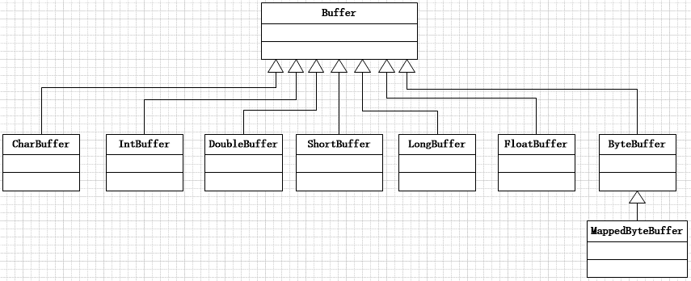
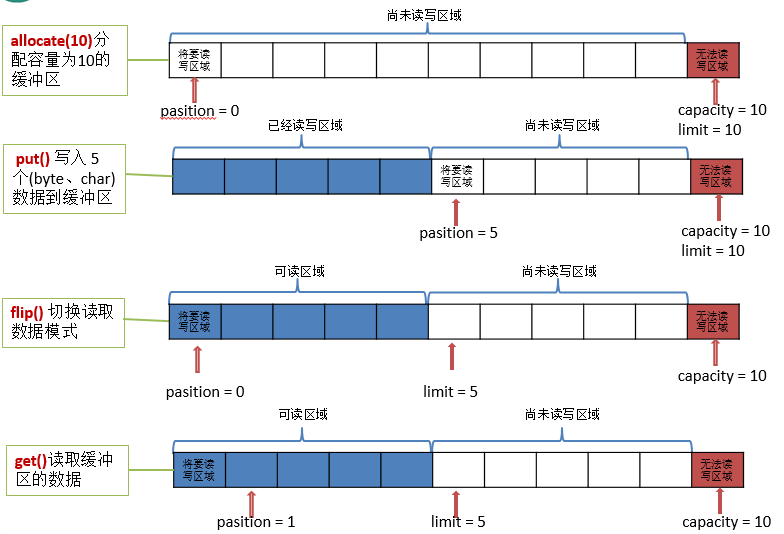
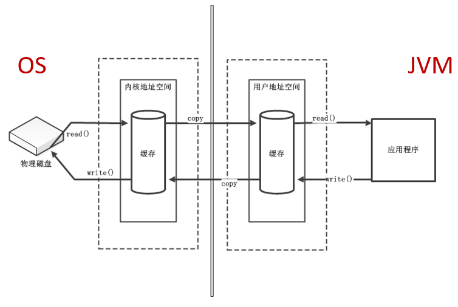
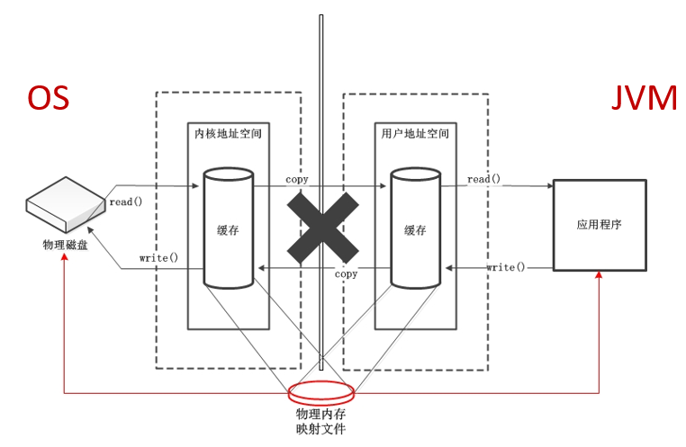
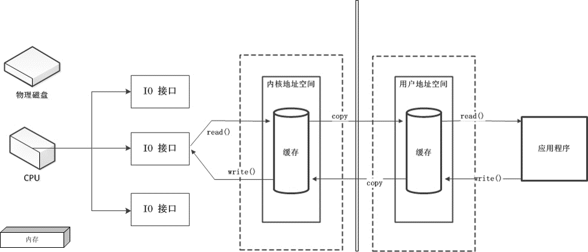
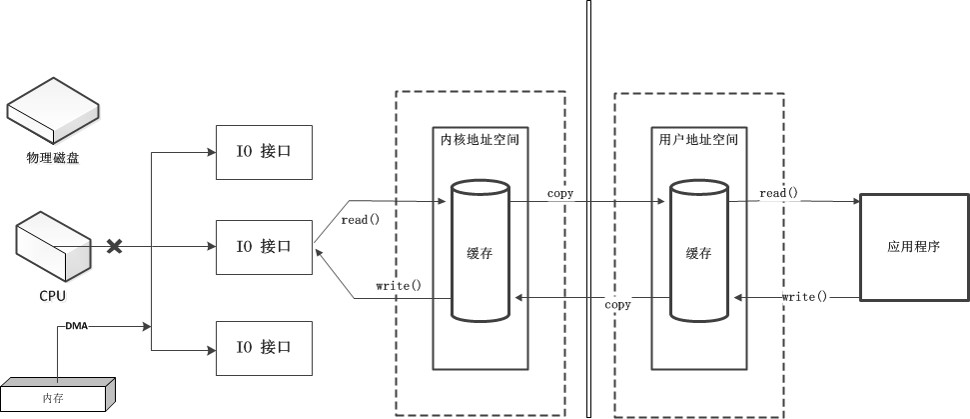
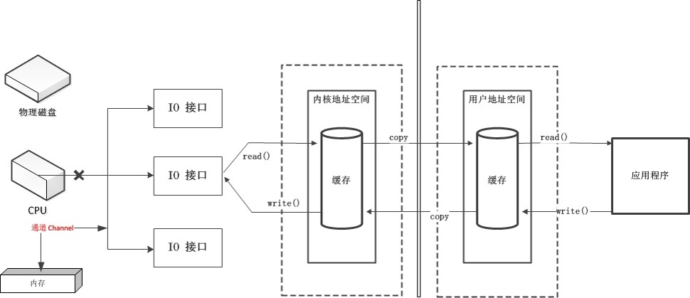
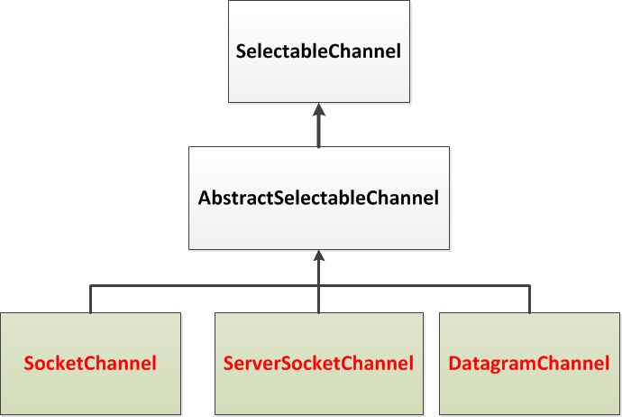
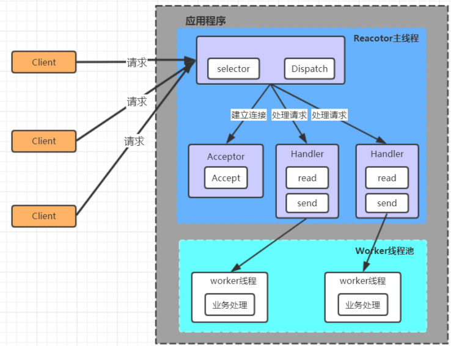
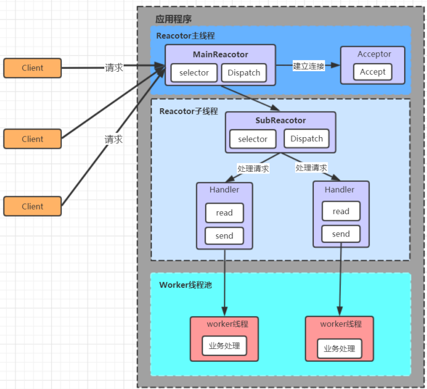

# NIO


# 概述


* Java NIO(Non-Blocking IO)可以替代标准的Java IO API,NIO与原来的IO有同样的作用和目的,但是使用的方式完全不同,NIO支持面向缓冲区的,基于通道的IO操作
* NIO将以更加高效的方式进行文件的读写操作


# URI,URL,URN


* `URI`:`uniform resource identifier`,统一资源标识符,用来唯一的标识一个资源
* `URL`:`uniform resource locator`,统一资源定位符,它是一种具体的URI,即URL可以用来标识一个资源,而且还指明了如何locate这个资源
* `URN`:`uniform resource name`,统一资源命名,是通过名字来标识资源,比如mailto:java-net@java.sun.com
* URI是以一种抽象的,高层次概念定义统一资源标识,而URL和URN则是具体的资源标识的方式.URL和URN都是一种URI
* 在Java的URI中,一个URI实例可以代表绝对的,也可以是相对的,只要符合URI的语法.而URL类则不仅符合语义,还包含了定位该资源的信息,因此不能是相对的


# Path


* 早期Java只有File类来访问文件系统,但File类的功能比较有限,所提供的方法性能也不高.而且,大多数方法在出错时仅返回失败,并不会提供异常信息
* NIO为了弥补这种不足,引入了Path接口,代表一个平台无关的平台路径,描述了目录结构中文件的位置
* Path可以看成是File类的升级版本,实际引用的资源也可以不存在
* NIO还提供了Files,Paths工具类,Files包含了大量静态的工具方法来操作文件;Paths则包含了两个返回Path的静态工厂方法
* Paths类提供的静态get()用来获取Path对象:

```java
// 用于将多个字符串串连成路径
static Path get(String first, String … more);
// 返回指定uri对应的Path路径
static Path get(URI uri);
```


## 常用方法


* `toString()`:返回调用 Path 对象的字符串表示形式
* `startsWith(String path)`:判断是否以 path 路径开始
* `endsWith(String path)`:判断是否以 path 路径结束
* `isAbsolute()`:判断是否是绝对路径
* `getParent()`:返回Path对象包含整个路径,不包含 Path 对象指定的文件路径
* `getRoot()`:返回调用 Path 对象的根路径
* `getFileName()`:返回与调用 Path 对象关联的文件名
* `getName(int idx)`:返回指定索引位置 idx 的路径名称
* `getNameCount()`:返回Path 根目录后面元素的数量
* `toAbsolutePath()`:作为绝对路径返回调用 Path 对象
* `resolve(Path p)`:合并两个路径,返回合并后的路径对应的Path对象
* `toFile()`:将Path转化为File类的对象


# Files


* Files用于操作文件或目录的工具类


## 常用方法


* `copy(Path src, Path dest, CopyOption … how)`:文件的复制
* `createDirectory(Path path, FileAttribute<?> … attr)`:创建一个目录
* `createFile(Path path, FileAttribute<?> … arr)`:创建一个文件
* `delete(Path path)`:删除一个文件,如果不存在,执行报错
* `deleteIfExists(Path path)`:Path对应的文件如果存在,执行删除
* `move(Path src, Path dest, CopyOption…how)`:将 src 移动到 dest 位置
* `size(Path path)`:返回 path 指定文件的大小
* `exists(Path path, LinkOption … opts)`:判断文件是否存在
* `isDirectory(Path path, LinkOption … opts)`:判断是否是目录
* `isRegularFile(Path path, LinkOption … opts)`:判断是否是文件
* `isHidden(Path path)`:判断是否是隐藏文件
* `isReadable(Path path)`:判断文件是否可读
* `isWritable(Path path)`:判断文件是否可写
* `notExists(Path path, LinkOption … opts)`:判断文件是否不存在
* `newByteChannel(Path path, OpenOption…how)`:获取与指定文件的连接,how 指定打开方式
* `newDirectoryStream(Path path)`:打开 path 指定的目录
* `newInputStream(Path path, OpenOption…how)`:获取 InputStream 对象
* `newOutputStream(Path path, OpenOption…how)`:获取 OutputStream 对象


# 缓冲区(Buffer)


* BIO:面向流(Stream  Oriented),单向的阻塞IO
* NIO:面向缓冲区(Buffer  Oriented),通道是单向的,也可以是双向的,非阻塞IO,使用选择器(Selectors)
* 一个Channel可能实现定义read()的ReadableByteChannel接口,而另一个Channel类也许实现WritableByteChannel接口以提供write().实现这两种接口其中之一的类都是单向的,只能在一个方向上传输数据.如果一个类同时实现这两个接口,那么它是双向的,可以双向传输数据,比如:ByteChannel
* NIO系统的核心在于:通道(Channel)和缓冲区(Buffer)
* 通道表示IO源打开到 IO 设备(例如:文件、套接字)的连接.若需要使用 NIO 系统,需要获取用于连接 IO 设备的通道以及用于容纳数据的缓冲区.然后操作缓冲区,对数据进行处理
* Channel负责传输,Buffer负责存储数据
* Buffer 就像一个数组,可以保存多个相同类型的数据.根据数据类型不同(boolean除外),有以下 Buffer 常用子类:




* 上述 Buffer 类都采用相似的方法进行管理数据,只是各自管理的数据类型不同而已.都是通过各自类的如下方法获取一个 Buffer 对象:`static XxxBuffer allocate(int capacity)`创建一个容量为 capacity 的 XxxBuffer 对象


## 基本属性


* 容量(capacity):表示 Buffer 最大数据容量,一旦声明后,不能更改.通过Buffer中的capacity()获取.缓冲区capacity不能为负
* 限制(limit):第一个不应该读取或写入的数据的索引,即位于 limit 后的数据不可读写.通过Buffer中的limit()获取.缓冲区的limit不能为负,并且不能大于其capacity
* 位置(position):当前要读取或写入数据的索引.通过Buffer中的position()获取.缓冲区的position不能为负,并且不能大于其limit
* 标记(mark):标记是一个索引,通过 Buffer 中的 mark() 方法将mark标记为当前position位置. 之后可以通过调用 reset() 方法将 position恢复到标记的mark处
* 标记、位置、限制、容量遵守以下不变式:0 <= mark <= position <= limit <= capacity


## 基本操作


* Buffer 所有子类提供了两个用于数据操作的方法:put() 与 get()
* 以ByteBuffer类为例,放入数据到Buffer中:
  * put(byte b):将给定单个字节写入缓冲区的当前位置
  * put(byte[] src):将 src 中的字节写入缓冲区的当前位置
  * put(int index, byte b):将指定字节写入缓冲区的索引位置(不会移动 position)
* 获取Buffer中的数据
  * get():读取单个字节
  * get(byte[] dst):批量读取多个字节到 dst 中
  * get(int index):读取指定索引位置的字节(不会移动 position)




## 常用方法


* flip():将limit设置为当前position,将position设置为0,mark设置为-1
* rewind():将position设为为0,mark设为-1.可重复读
* lear():将limit设为capacity,将position设为0,并将mark设为-1.数据没有清空
* mark():对缓冲区设置mark
* reset():将位置position转到以前设置的mark所在的位置
* hasRemaining():判断缓冲区中是否还有元素
* remaining():返回position和limit之间的元素个数
* array():返回XxxBuffer底层的Xxx数组
* capacity():返回Buffer 的capacity大小
* limit():返回Buffer的界限(limit)的位置
* limit(int n):将设置缓冲区界限为n,并返回一个具有新 limit 的缓冲区对象
* position():返回缓冲区的当前位置position
* position(int n):将设置缓冲区的当前位置为n,并返回修改后的 Buffer  对象


## 直接和非直接缓冲区


* 字节缓冲区要么是直接的,要么是非直接的
* 如果为直接字节缓冲区,则Java虚拟机会尽最大努力直接在此缓冲区上执行本机I/O操作.也就是说,在每次调用基础操作系统的一个本机I/O操作之前或之后,虚拟机都会尽量避免将缓冲区的内容复制到中间缓冲区中(或从中间缓冲区中复制内容)
* 直接字节缓冲区可以通过调用ByteBuffer的allocateDirect()工厂方法来创建.此方法返回的缓冲区进行分配和取消分配所需成本通常高于非直接缓冲区.直接缓冲区的内容可以驻留在常规的垃圾回收堆之外,因此,它们对应用程序的内存需求量造成的影响可能并不明显.所以,建议将直接缓冲区主要分配给那些易受基础系统的本机I/O操作影响的大型、持久的缓冲区.一般情况下,最好仅在直接缓冲区能在程序性能方面带来明显好处时分配它们
* 直接字节缓冲区还可以通过FileChannel的map()将文件区域直接映射到内存中来创建.该方法返回ByteBuffer的子类:MappedByteBuffer.Java平台的实现有助于通过JNI从本机代码创建直接字节缓冲区.如果以上这些缓冲区中的某个缓冲区实例指的是不可访问的内存区域,则试图访问该区域不会更改该缓冲区的内容,并且将会在访问期间或稍后的某个时间导致抛出不确定的异常
* 字节缓冲区是直接缓冲区还是非直接缓冲区可通过调用其isDirect()来确定.提供此方法是为了能够在性能关键型代码中执行显式缓冲区管理


### 非直接缓冲区





### 直接缓冲区





# 通道(Channel)


* Channel表示IO源与目标节点打开的连接,类似于传统的流,只不过Channel本身不能直接存储数据,只能与Buffer进行交互


## 传统IO




## DMA


* Direct Memory Access,直接内存存取器




## Channel





## 主要实现类


* FileChannel:用于读取,写入,映射和操作文件的通道
* SocketChannel:通过 TCP 读写网络中的数据
* ServerSocketChannel:可以监听新进来的 TCP 连接,对每一个新进来的连接都会创建一个SocketChannel
* DatagramChannel:通过 UDP 读写网络中的数据通道


## 获取通道


* 常见方式:对支持通道的对象调用getChannel().支持通道的类如下:
  * FileInputStream->FileChannel
  * FileOutputStream->FileChannel
  * RandomAccessFile->FileChannel
  * Socket->SocketChannel
  * ServerSocket->ServerSocketChannel
  * DatagramSocket->DatagramChannel
  * 虽然FileChannel既可读可写,但FileInputStream获取的只能读,FileOutputStream获取的只能写,RandomAccessFile获取的取决于其打开文件的模式
* 其他方式:
  * 通过XxxChannel的静态方法 open() 打开并返回指定的XxxChannel
  * 使用 Files 工具类的静态方法 newByteChannel() 获取字节通道


# 分散读取和聚集写入


* 分散读取:Scattering Reads,是指从Channel中读取的数据分散到多个Buffer中.按照缓冲区的顺序,从 Channel中读取的数据依次将Buffer填满
* 聚集写入:Gathering Writes,是指将多个Buffer中的数据聚集到Channel.按照缓冲区的顺序,写入position和limit之间的数据到Channel


# 阻塞与非阻塞


* 传统的IO(BIO)流都是阻塞式的.也就是说,当一个线程调用read()或write()时,该线程被阻塞,直到有一些数据被读取或写入.该线程在此期间不能执行其他任务.因此,在完成网络通信进行IO操作时,由于线程会阻塞,所以服务器端必须为每个客户端都提供一个独立的线程进行处理,当服务器端需要处理大量客户端时,性能急剧下降
* NIO是非阻塞模式的.当线程从某通道进行读写数据时,若没有数据可用时,该线程可以进行其他任务.线程通常将非阻塞 IO 的空闲时间用于在其他通道上执行 IO 操作,所以单独的线程可以管理多个输入和输出通道.因此,NIO 可以让服务器端使用一个或有限几个线程来同时处理连接到服务器端的所有客户端


# 选择器(Selector)


* 选择器(Selector)是SelectableChannel对象的多路复用器,是非阻塞 IO 的核心.Selector 可以同时监控多个SelectableChannel的 IO状况,也就是说,利用Selector可使一个单独的线程管理多个Channel
* SelectableChannel 的结构如下图




## Selector的使用


* 创建Selector:调用Selector.open()创建一个 Selector
* 向选择器注册通道:SelectableChannel.register(Selector sel, int ops)

```java
Selector.open()= Selector.open();
ServerSocketChannel serverChannel = ServerSocketChannel.open();
serverChannel.register(selector, SelectionKey.OP_ACCEPT);
```


## 常用方法


* `select()`:监控所有注册的Channel,当它们中间有需要处理的 IO 操作时,该方法返回,并将对应得的 SelectionKey加入被选择的 SelectionKey 集合中,该方法返回这些 Channel 的数量
* `selectedKeys()`:被选择的 SelectionKey 集合.返回此Selector的已选择键集
* `keys()`:所有的 SelectionKey 集合.代表注册在该Selector上的Channel
* `select(long timeout)`:可以设置超时时长的  select() 操作
* `selectNow()`:执行一个立即返回的  select() 操作,该方法不会阻塞线程
* `wakeup():`使一个还未返回的  select() 方法立即返回
* `close():`关闭该选择器


# 选择键(SelectionKey)


* 当调用register(Selector sel,int ops)将通道注册选择器时,选择器对通道的监听事件,需要通过第二个参数 ops 指定
* 可以监听的事件类型(可使用SelectionKey的四个常量表示):
  * 读:SelectionKey.OP_READ->1
  * 写:SelectionKey.OP_WRITE->4
  * 连接:SelectionKey.OP_CONNECT->8
  * 接收:SelectionKey.OP_ACCEPT->16
* 若注册时不止监听一个事件,则可以使用位或(|)操作符连接
* SelectionKey:表示 SelectableChannel 和 Selector 之间的注册关系.每次向Selector注册Channel时就会选择一个事件(选择键).选择键包含两个表示为整数值的操作集.操作集的每一位都表示该键的通道所支持的一类可选择操作


## 常用方法


* `isAcceptable():`检测Channel中接收是否就绪
* `isReadable():`检测Channal中读事件是否就绪
* `isWritable():`检测Channal中写事件是否就绪
* `channel():`获取注册通道
* `interestOps():`获取感兴趣事件集合
* `readyOps():`获取通道已经准备就绪的操作的集合
* `selector():`返回选择器
* `isConnectable():`检测Channel中连接是否就绪


# FileChannel


## 常用方法


* `read(ByteBuffer dst):`从Channel中读取数据到 ByteBuffer
* `read(ByteBuffer[] dsts):`将Channel中的数据分散到ByteBuffer[]
* `write(ByteBuffer src):`将ByteBuffer中的数据写入到Channel
* `write(ByteBuffer[] srcs):`将ByteBuffer[]中的数据聚集到Channel
* `map(MapMode mode,long position,long size):`将Channel对应的部分或全部数据映射到ByteBuffer
* `position():`返回此通道的文件位置
* `position(long p):`设置此通道的文件位置
* `size():`返回此通道的文件的当前大小
* `truncate(long s):`将此通道的文件截取为给定大小
* `force(boolean metaData):`强制将所有对此通道的文件更新写入到存储设备中
* 从 Channel 读取数据到 Buffer,将Buffer中数据写入Channel

```java
// 从Channel读取数据到Buffer中
int bytes = channel.read(buf);
// 将Buffer中数据写入Channel中
int bytes = channel.write(buf);
```


# SocketChannel


* NIO中的SocketChannel是一个连接到TCP网络套接字的通道,操作步骤:
  * 打开 SocketChannel
  * 读写数据
  * 关闭 SocketChannel

```java
SocketChannel socketChannel = SocketChannel.open(
new InetSocketAddress(InetAddress.getByName("127.0.0.1"), 9090));
// 切换非阻塞模式
socketChannel.configureBlocking(false);
// 向Selector注册Channel
socketChannel.register(selector, SelectionKey.OP_READ);
```

* NIO中的ServerSocketChannel是一个可以监听新进来的TCP连接的通道,就像标准IO中的ServerSocket一样

```java
ServerSocketChannel serverSocketChannel = ServerSocketChannel.open();
serverSocketChannel.bind(new InetSocketAddress(9090));
SocketChannel socketChannel = serverSocketChannel.accept();
// 切换非阻塞模式
serverSocketChannel.configureBlocking(false);
serverSocketChannel.bind(new InetSocketAddress(9898));
serverSocketChannel.register(selector, SelectionKey.OP_ACCEPT);
socketChannel.configureBlocking(false);
```


# DatagramChannel


* NIO中的DatagramChannel是一个能收发UDP包的通道,操作步骤:
  * 打开 DatagramChannel
  * 接收/发送数据


# 管道(Pipe)


* NIO管道是2个线程之间的单向数据连接.Pipe有一个source通道和一个sink通道.数据会被写到sink通道,从source通道读取
* **代码见dream-study-java-io/com/wy/nio/S_Pipe.java**


# Reactor


* 通过一个或多个输入同时传递给服务处理器的模式,服务器端程序处理传入的多个 请求,并将它们同步分派到相应的处理线程,因此 Reactor 模式也叫 Dispatcher模式.
* Reactor 模式使用 IO 复用监听事件, 收到事件后,分发给某个线程(进程), 这点就是网络服务器高并发处理关键


## 单Reactor模式


* Selector是可以实现应用程序通过一个阻塞对象监听多路连接请求
* Reactor 对象通过 Selector监控客户端请求事件,收到事件后通过 Dispatch 进行分发
* 建立连接请求事件由 Acceptor 通过 Accept 处理连接请求,然后创建一个 Handler 对象处理连接完成后的后续业务处理
* Handler 会完成 Read→业务处理→Send 的完整业务流程


### 优点


* 模型简单,没有多线程,进程通信,竞争的问题,全部都在一个线程中完成


### 缺点


* 性能问题:只有一个线程,无法完全发挥多核 CPU 的性能.Handler 在处理某个连接上的业务时,整个进程无法处理其他连接事件,很容易导致性能瓶颈
* 可靠性问题: 线程意外终止或者进入死循环,会导致整个系统通信模块不可用,不能接收和处 理外部消息,造成节点故障


## 单Reactor多线程





* Reactor 对象通过 selector 监控客户端请求事件, 收到事件后,通过 dispatch 进行分发
* 如果建立连接请求,则由 Acceptor 通过accept 处理连接请求
* 如果不是连接请求,则由 reactor 分发调用连接对应的 handler 来处理
* handler 只负责响应事件,不做具体的业务处理,通过 read 读取数据后,会分发给后面的 worker 线程池的某个线程处理业务
* worker 线程池会分配独立线程完成真正的业务,并将结果返回给 handler
* handler 收到响应后,通过 send 将结果返回给 client


### 优点


* 可以充分的利用多核 cpu 的处理能力


### 缺点


* 多线程数据共享和访问比较复杂,reactor处理所有的事件的监听和响应,在单线程运行,在高并发场景容易出现性能瓶颈


## 主从Reactor多线程





* Reactor 主线程 MainReactor 对象通过 select 监听客户端连接事件，收到事件后，通过 Acceptor 处理客户端连接事件
* 当 Acceptor 处理完客户端连接事件之后（与客户端建立好 Socket 连接），MainReactor 将 连接分配给 SubReactor。（即：MainReactor 只负责监听客户端连接请求，和客户端建立连 接之后将连接交由 SubReactor 监听后面的 IO 事件。)
* SubReactor 将连接加入到自己的连接队列进行监听，并创建 Handler 对各种事件进行处理
* 当连接上有新事件发生的时候，SubReactor 就会调用对应的 Handler 处理
* Handler 通过 read 从连接上读取请求数据，将请求数据分发给 Worker 线程池进行业务处理
* Worker 线程池会分配独立线程来完成真正的业务处理，并将处理结果返回给 Handler。 Handler 通过 send 向客户端发送响应数据
* 一个 MainReactor 可以对应多个 SubReactor，即一个 MainReactor 线程可以对应多个 SubReactor 线程


优点: 

1. MainReactor 线程与 SubReactor 线程的数据交互简单职责明确，MainReactor 线程只需要 接收新连接，SubReactor 线程完成后续的业务处理
2. MainReactor 线程与 SubReactor 线程的数据交互简单， MainReactor 线程只需要把新连接 传给 SubReactor 线程，SubReactor 线程无需返回数据
3. 多个 SubReactor 线程能够应对更高的并发请求


缺点

这种模式的缺点是编程复杂度较高。但是由于其优点明显，在许多项目中被广泛使用，包括 Nginx、Memcached、Netty 等。这种模式也被叫做服务器的 1+M+N 线程模式，即使用该模式开 发的服务器包含一个（或多个，1 只是表示相对较少）连接建立线程+M 个 IO 线程+N 个业务处理 线程。这是业界成熟的服务器程序设计模式。