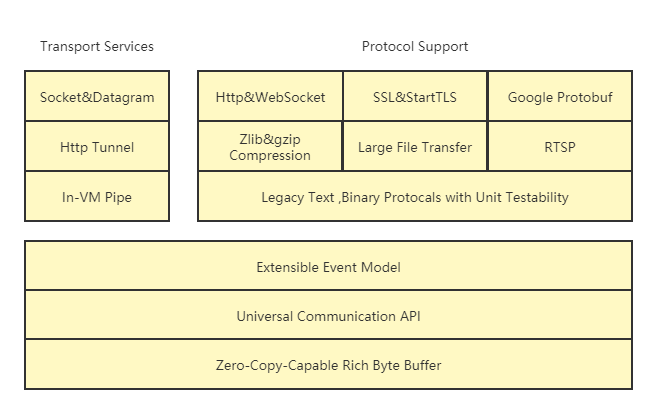
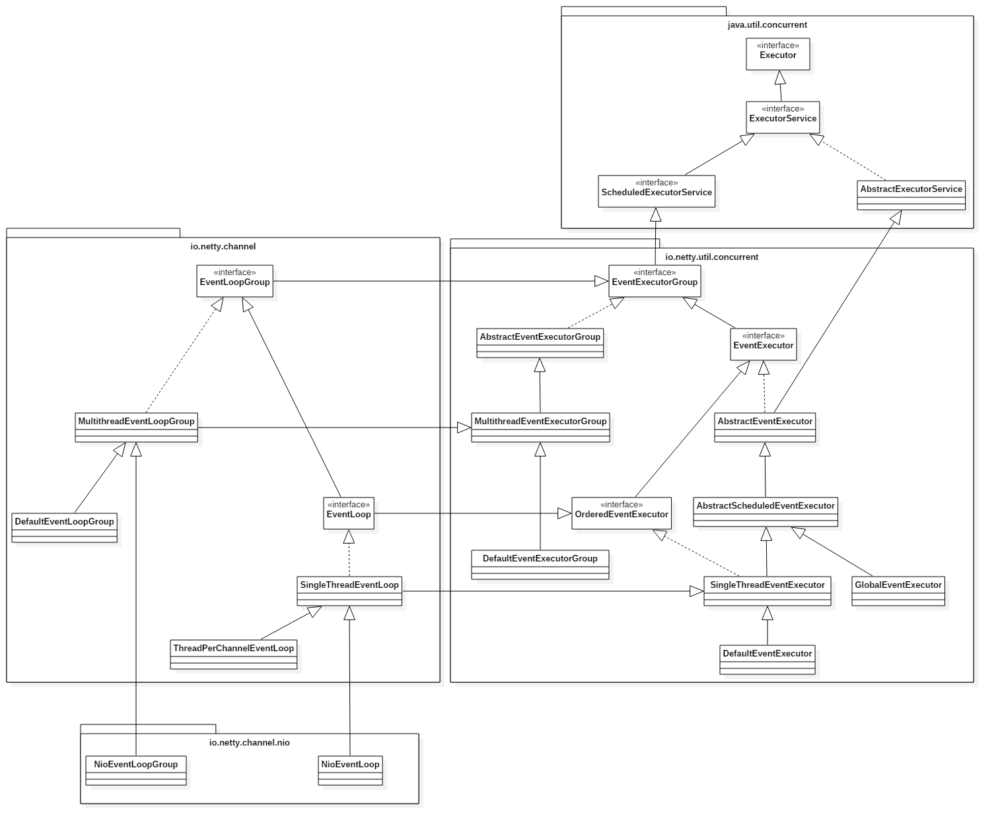

# Netty

# 概述

# 线程模型

## 单线程模型

在ServerBootstrap调用方法group的时候,传递的参数是同一个线程组,且在构造线程组的时候,构造参数为 1,这种开发方式,就是一个单线程模型.
个人机开发测试使用. 不推荐.

## 多线程模型

在ServerBootstrap调用方法group的时候,传递的参数是两个不同的线程组.负责监听的acceptor线程组,线程数为 1,也就是构造参数为 1.负责处理客户端任务的线程组,线程数大于 1,也就是构造参数大于 1.这种开发方式,就是多线程模型.
长连接,且客户端数量较少,连接持续时间较长情况下使用.如:企业内部交流应用.

## 主从多线程模型

在ServerBootstrap调用方法group的时候,传递的参数是两个不同的线程组.负责监听的 acceptor 线程组,线程数大于 1,也就是构造参数大于 1.负责处理客户端任务的线程组,线程数大于 1,也就是构造参数大于 1.这种开发方式,就是主从多线程模型.
长连接,客户端数量相对较多,连接持续时间比较长的情况下使用.如:对外提供服务的相册服务器.  

# 拆包粘包

Netty使用 tcp/ip 协议传输数据,而 tcp/ip 协议是类似水流一样的数据传输方式.多次访问的时候有可能出现数据粘包的问题.

## 定长数据流

客户端和服务器,提前协调好,每个消息长度固定,如长度 10.如果客户端或服务器写出的数据不足10,则使用空白字符补足,如使用空格.

## 特殊结束符

客户端和服务器,协商定义一个特殊的分隔符号,分隔符号长度自定义.如:#,$_$,AA@.在通讯的时候,只要没有发送分隔符号,则代表一条数据没有结束.

## 协议

相对最成熟的数据传递方式. 有服务器的开发者提供一个固定格式的协议标准.客户端和服务器发送数据和接受数据的时候,都依据协议制定和解析消息.

# 序列化对象

JBoss Marshalling 序列化

# 定时断线重连

客户端数量多,且需要传递的数据量级较大,可以周期性的发送数据的时候,使用. 要求对数据的即时性不高的时候,才可使用.
优点:可以使用数据缓存.不是每条数据进行一次数据交互. 可以定时回收资源,对资源利用率高. 相对来说,即时性可以通过其他方式保证.如:120 秒自动断线. 数据变化 1000 次请求服务器一次. 300 秒中自动发送不足 1000 次的变化数据.

# 心跳监测

使用定时发送消息的方式,实现硬件检测,达到心态检测的目的.
心跳监测主要用来检测电脑硬件和软件信息,如:CPU 使用率,磁盘使用率,内存使用率,进程情况,线程情况等.

## sigar

需要下载一个zip 压缩包,内部包含若干 sigar 需要的操作系统文件.

sigar 插件是通过JVM 访问操作系统,读取计算机硬件的一个插件库. 读取计算机硬件过程中,必须由操作系统提供硬件信息. 硬件信息是通过操作系统提供的.

zip压缩包中是sigar编写的操作系统文件,如:windows 中的动态链接库文件.
解压需要的操作系统文件,将操作系统文件赋值到${Java_home}/bin 目录中.

# HTTP 协议处理

使用 Netty 服务开发.实现 HTTP 协议处理逻辑.  

# 流数据的传输处理

在基于流的传输里比如 TCP/IP,接收到的数据会先被存储到一个 socket 接收缓冲里.不幸的是,基于流的传输并不是一个数据包队列,而是一个字节队列.即使你发送了 2 个独立的数据包,操作系统也不会作为 2 个消息处理而仅仅是作为一连串的字节而言.因此这是不能保证你远程写入的数据就会准确地读取. 所以一个接收方不管他是客户端还是服务端,都应该把接收到的数据整理成一个或者多个更有意思并且能够让程序的业务逻辑更好理解的
数据.
在处理流数据粘包拆包时,可以使用下述处理方式:

* 使用定长数据处理,如:每个完整请求数据长度为 8 字节等.(FixedLengthFrameDecoder)
* 使用特殊分隔符的方式处理,如:每个完整请求数据末尾使用\0作为数据结束标记.(DelimiterBasedFrameDecoder)
* 使用自定义协议方式处理,如:http 协议格式等.
* 使用 POJO 来替代传递的流数据,如:每个完整的请求数据都是一个 RequestMessage对象,在 Java 语言中,使用 POJO 更符合语种特性,推荐使用

