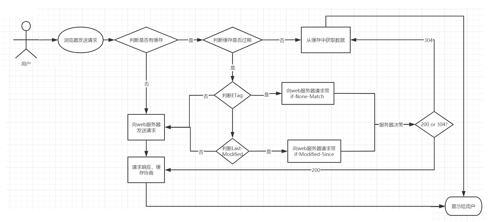

# Nginx


# 概述


* 正向代理:用户访问服务器,中间有个代理服务,代理服务器代理的是用户
  * 用户无法直接访问真正的服务器,需要通过代理服务器进行转发才能访问真正的服务器
  * 服务器不能判断用户的真实地址以及其他信息,保护用户
  * 正向代理多用来访问无法直接访问的服务器资源,用作缓存,加速访问速度.对客户端访问授权,认证
  * 代理可以记录用户访问记录,对外隐藏用户信息
* 反向代理:用户访问服务器,中间有个代理服务,代理服务器代理的是服务器
* 用户请求通过代理服务器转发给多个服务中的一个,用户并不知道自己访问的真正服务器是那一个
  * 用户无法获得服务的真实信息,保护服务器
* 反向代理多用来保护内网安全,进行负载均衡,缓存,减少服务器压力
* Nginx后台进程中包含一个master进程和多个worker进程
  * master进程主要用来管理worker进程,包含接收外界的信息,并将接收到的信号发送给各个worker进程,监控worker进程状态,当worker进程出现异常退出后,会自动重新启动新的worker进程
  * worker进程则是专门用来处理用户请求的,各个worker进程之间是平等的并且相互独立,处理请求的机会也是一样的


# 安装


## yum安装


* yum install nginx:在centos仓库中没有nginx的安装软件,需如下安装

  ```shell
  rpm -Uvh http://nginx.org/packages/centos/7/noarch/RPMS/nginx-xx版本.noarch.rpm
  ```

* service nginx start:nginx启动

* service nginx reload:nginx重启

* service nginx stop:nginx停止

* nginx -s reload:nginx重启

* nginx -c /usr/local/nginx/conf/nginx.conf:启动时加载指定位置的配置文件

* nginx -s stop:停止nginx

* kill -QUIT ngxinpid: 优雅停止nginx


## 安装包安装


* 解压到指定目录/app/software/nginx

* 安装依赖:yum install -y readline-devel pcre-devel openssl-devel gcc-c++ gcc

* 进入解压后的目录,执行命令:./configure --help,查看该命令的参数,根据需要进行修改

  * --prefix=PATH:安装根目录.默认为/usr/local/nginx
  * --sbin-path=PATH:命令执行路径.默认为/usr/local/nginx/sbin/nginx
  * --modules-path=PATH:动态模块安装路径.默认为/usr/local/nginx/modules
  * --conf-path=PATH:nginx.conf配置文件路径.默认为/usr/local/nginx/conf/nginx.conf
  * --error-log-path=PATH:错误日志路径.默认为/usr/local/nginx/logs/error.log
  * --http-log-path=PATH:访问日志,默认为/var/log/nginx/access.log
  * --pid-path=PATH:运行时的pid文件路径.默认为/usr/local/nginx/logs/nginx.pid
  * --with:可以加上该参数,安装该模块
  * --without:已经安装了的模块,卸载该模块
  * --add-module=PATH:添加指定的模块,必须是已经下载到本地目录中
  * --add-dynamic-module=PATH:动态添加模块
  * --lock-path=PATH:锁定文件,默认为/var/lock/nginx.lock
  * --http-client-body-temp-path=/var/temp/nginx/client:客户端定义
  * --http-proxy-temp-path=/var/temp/nginx/proxy:代理临时目录位置
  * --http-fastcgi-temp-path=/var/temp/nginx/fastcgi:快速访问临时目录
  * --http-uwsgi-temp-path=/var/temp/nginx/uwsgi:sgi 访问目录
  * --http-scgi-temp-path=/var/temp/nginx/scgi:scgi访问临时目录  

  ```shell
  ./configure --prifix=/app/software/nginx \ # 根目录
  --with-http_ssl_module # 安装指定模块,可根据情况自定义安装
  ```

* make && make install

* nginx -V:查看nginx版本等相关信息


## 配置到环境变量


```nginx
vim /etc/profile
# 在最后一行添加nginx安装目录到sbin的路径
export PATH=$PATH:/usr/local/nginx/sbin
source /etc/profile
```


# 目录


* 如果是简单安装,默认根目录在/usr/local/nginx中,若是自定义安装,需要自己记住

* auto:存放 Nginx 编译的相关文件
* conf:存放 Nginx 服务器配置文件
  * CGI(Common Gateway Interface)通用网关接口,主要解决的问题是从客户端发送一个请求和数据,服务端获取到请求和数据后可以调用调用CGI程序处理及相应结果给客户端的一种标准规范
  * fastcgi.conf:fastcgi相关配置文件
  * fastcgi.conf.default:fastcgi.conf的备份文件
  * fastcgi_params:fastcgi的参数文件
  * fastcgi_params.default:fastcgi的参数备份文件
  * scgi_params:scgi的参数文件
  * scgi_params.default:scgi的参数备份文件
  * uwsgi_params:uwsgi的参数文件
  * uwsgi_params.default:uwsgi的参数备份文件
  * mime.types:记录的是HTTP协议中的Content-Type的值和文件后缀名的对应关系
  * mime.types.default:mime.types的备份文件
  * nginx.conf:这个是Nginx的核心配置文件,这个文件非常重要,也是我们即将要学习的重点
  * nginx.conf.default:nginx.conf的备份文件
  * koi-utf、koi-win、win-utf这三个文件都是与编码转换映射相关的配置文件,用来将一种编码转换成另一种编码

* configure:命令,用于对即将安装的软件的配置,完成 makefile 编译文件的生成
* contrib:存放由其他机构贡献的文档材料
* html:存放 Nginx 欢迎页面
* man:manual,手册,存放 Nginx 帮助文档
* src:存放 Nginx 源码
* logs:记录入门的文件,当nginx服务器启动后,这里面会有 access.log error.log 和nginx.pid三个文件出现
* sbin:是存放执行程序文件,用来控制Nginx的启动和停止等相关的命令


# 配置文件


* 每一行配置后都需要有分号

* nginx.conf包括全局块,events块,http块

* 全局块:配置影响nginx全局的指令,如用户组,日志,配置文件引入等

* user:代表访问权限是什么,就是通过 nginx 访问 linux 服务器中文件时,使用的用户权限

* events:核心配置,与内核相关.配置影响nginx服务器或与用户的网络连接,如每个进程的最大连接数等

  * worker_connection:每个工作进程的最大连接数,跟系统的最大开启文件描述符相关,可使用ulimit相关命令查看和修改
  * use epoll:使用epoll事件驱动,因为epoll的性能相比其他事件驱动要好很多,默认使用epoll

* work_processes:工作进程数,默认为1,最好设置成和服务器核心数相同,也可设置成auto

* include:可以包含其他路径中的nginx配置文件,通常多个服务都是每个服务一个配置文件.包含在include中的配置文件中server就是最上层,其中root,index等参数可以直接写在最外层,不需要写在location中

* http:包含http全局快和server块.可以嵌套多个server,配置代理,缓存,日志定义等绝大多数功能和第三方模块的配置,如文件引入,mime-type定义,日志自定义,连接超时等

* http全局块:配置upstream,错误页面,连接超时等

* server:包含location,配置虚拟主机的相关参数,一个http中可以包含多个server

* location:配置请求的路由以及各种页面的处理情况

* proxy_pass:存在于location中,表示nginx代理的请求发送到另外的地址中.若有网关,最好是转发到网关中

* nginx在代理请求的时候会丢失请求的host信息,需要在location中添加真正的host信息

  ```nginx
  server{
  	location / {
  		// 设置请求头信息,$host表示当前请求的host
  		proxy_set_header Host $host
      	proxy_pass http://192.168.1.199:8080;
  	}
  }
  ```


## 内置变量


- `$args`:这个变量等于请求行中的参数,即请求中`?`后的部分,如arg1=value1&arg2=value2,同`$query_string`
- `$content_length`:请求头中的Content-length字段
- `$content_type`:请求头中的Content-Type字段
- `$uri`:不带请求参数的当前URI,`$uri`不包含主机名,如`/foo/bar.html`
- `$document_uri`:与`$uri`相同
- `$document_root`:变量存储的是当前请求对应location的root值,如果未设置,默认指向Nginx自带html目录所在位置
- `$host`:请求访问服务器的server_name值,否则为服务器名称
- `$http_user_agent`:客户端agent信息
- `$http_cookie`:客户端cookie信息,可以通过add_header Set-Cookie 'cookieName=cookieValue'来添加cookie数据
- `$limit_rate`:这个变量可以限制连接速率,也就是Nginx配置中对limit_rate指令设置的值,默认是0,不限制
- `$remote_addr`:客户端的IP地址
- `$remote_port`:客户端的端口
- `$remote_user`:经过Auth Basic Module验证的用户名,需要有认证模块才能获取
- `$request_method`:客户端请求方式,通常为GET或POST
- `$request_body_file`: 变量中存储了发给后端服务器的本地文件资源的名称
- `$request_filename`:当前请求的资源文件路径,由root或alias指令与URI请求生成
- `$request_uri`:存储了当前请求的URI,并且携带请求参数,比如ip:port/server?id=10&name=zhangsan中的/server?id=10&name=zhangsan
- `$scheme`:HTTP协议,如http,https
- `$server_protocol`:请求使用的协议,通常是HTTP/1.0或HTTP/1.1
- `$server_addr`:服务器地址,在完成一次系统调用后可以确定这个值
- `$server_name`:服务器名称
- `$server_port`:请求到达服务器的端口号


## 全局块


### user


* 用于配置运行Nginx服务器的worker进程的用户和用户组,语法:`user user[group];`,默认为`user nobody;`
* 该属性也可以在编译的时候指定:`./configure --user=user --group=group`,如果两个地方都进行了设置,配置文件优先级更高
* 使用user指令可以指定启动运行工作进程的用户及用户组,这样对于系统的权限访问控制的更加精细,也更加安全


### work process


```nginx
master_process on|off;
worker_process num/auto;
```

* master_process:用来指定是否开启工作进程
* worker_processes:用于配置Nginx生成工作进程的数量,建议将该值和服务器CPU的内核数保存一致


### 其他指令


```nginx
daemon on|off;
pid /usr/local/nginx/logs/nginx.pid;
# 日志路径 级别
error_log logs/error.log error;
```

* daemon: 设定Nginx是否以守护进程的方式启动.守护式进程是linux后台执行的一种服务进程,独立于控制终端,不会随着终端关闭而停止
* pid: 用来配置Nginx当前master进程的进程号ID存储的文件路径.可以通过`./configure --pid-path=PATH`来指定
* error_log: 用来配置Nginx的错误日志存放路径以及级别,该属性可以在全局块,http,server,location中出现.可以通过`./configure --error-log-path=PATH`来指定.日志级别的值:debug|info|notice|warn|error|crit|alert|emerg->调试|信息|通知|警告|错误|临界|警报|紧急
* include:用来引入其他配置文件,使Nginx的配置更加灵活,该属性可以在任意块中出现


## events


```nginx
events {
    accept_mutex on|off;
    multi_accept on|off;
    worker_connections 1024;
    # 默认值根据系统而定
    use epoll;
}
```

* accept_mutex:设置Nginx网络连接序列化.这个配置主要可以用来解决惊群问题.大致意思是在某个时刻,客户端发来一个请求连接,Nginx后台会有多个worker进程会被同时唤醒,但是最终只会有一个进程可以获取到连接,如果每次唤醒的进程数太多,就会影响Nginx的整体性能.将上述值设置为on,将会对多个Nginx进程接收连接进行序列号,一个个唤醒接收,防止多个进程对连接的争抢
* multi_accept: 设置是否允许同时接收多个网络连接.如果multi_accept被禁止了,nginx一个工作进程只能同时接受一个新的连接,否则一个工作进程可以同时接受所有的新连接
* worker_connections: 配置单个worker进程最大的连接数.这里的连接数不仅仅包括和前端用户建立的连接数,而是包括所有可能的连接数.连接数不能大于操作系统支持打开的最大文件句柄数量
* use: 设置Nginx服务器选择哪种事件驱动来处理网络消息.此处所选择事件处理模型是Nginx优化部分的一个重要内容,method的可选值有select/poll/epoll/kqueue等,在linux上最好使用epoll模式.这些值的选择也可以在编译的时候使用:`--with-select_module`,`--without-select_module`,` --with-poll_module`,` --without-poll_module`


## http


* 定义http服务器内容

* include: 加载响应类型.默认会将mime.types文件中MIME类型与相关类型文件的文件后缀名的对应关系加入到当前的配置文件

* default_type: 配置Nginx响应前端请求默认的MIME类型,默认使用 IO 流实现请求/应答,出现在http,server,location

* log_format main:在ngxin.conf.default中可以看到该参数,表示日志的输出格式,可以根据默认配置文件中的说明进行配置.main是一个标识,在access_log中要用到.更多参数参考nginx官网

* access_log foldername main:将nginx的日志以main格式输入到指定目录的文件中

* sendfile on|off:是否支持文件传输,该属性可以大大提高Nginx处理静态资源的性能

* tcp_nopush on\|off;: 该指令必须在sendfile打开的状态下才会生效,主要是用来提升网络包的传输效率

* tcp_nodelay on\|off;: 该指令必须在keep-alive连接开启的情况下才生效,来提高网络包传输的实时性

* keepalive_timeout:保持连接的最大时间

* server_tokens off:隐藏nginx版本号

* limit_req_zone:限流,定义在http块中
  * zone:定义IP状态及URL访问频率的共享内存区域.zone=keyword标识区域的名字,以及冒号后面跟区域大小.16000个IP地址的状态信息约1MB,所以示例中区域可以存储160000个IP地址
  * rate:定义最大请求速率.示例中速率不能超过每秒100个请求
  ```nginx
  # 定义限流.:$binary_remote_addr表示保存客户端IP地址的二进制形式
  limit_req_zone $binary_remote_addr zone=mylimit:10m rate=100r/s
  
  # 在location中设置限流.burst排队大小,nodelay不限制单个请求间的时间
  localtion / {
  	limit_req zone=mylit burst=20 nodelay;
  }
  ```


## gzip


* gzip on\|off:是否开启数据压缩,可以在http,server,location设置,以下参数只在gzip开启时有效
* gzip_types: 可以根据响应页的MIME类型选择性地开启Gzip压缩功能
* gzip_comp_level: 设置Gzip压缩程度,级别从1-9,1表示压缩程度最低,但效率最高,9刚好相反,压缩程度最高,但是效率最低
* gzip_vary on\|off: 设置使用Gzip进行压缩发送是否携带Vary:Accept-Encoding头域的响应头部.主要是告诉接收方发送的数据经过了Gzip压缩处理
* gzip_buffers number size: 用于处理请求压缩的缓冲区数量和大小.其中number指定Nginx服务器向系统申请缓存空间个数,size指的是每个缓存空间的大小.主要实现的是申请number个每个大小为size的内存空间,这个值的设定一般会和服务器的操作系统有关,所以建议此项不设置,使用默认值即可
* gzip_disable regex: 针对不同种类客户端发起的请求,可以选择性地开启和关闭Gzip功能.regex可以根据客户端的浏览器标志(user-agent)来设置,支持使用正则表达式,指定的浏览器标志不使用Gzip.该指令一般是用来排除一些明显不支持Gzip的浏览器
* gzip_http_version 1.0\|1.1: 针对不同的HTTP协议版本,可以选择性地开启和关闭Gzip功能,使用默认即可
* gzip_min_length length: 该指令针对传输数据的大小,可以选择性地开启和关闭Gzip功能.Gzip压缩功能对大数据的压缩效果明显,但是如果要压缩的数据比较小,可能出现越压缩数据量越大的情况,因此需要根据响应内容的大小来决定是否使用Gzip功能,响应页面的大小可以通过头信息中的`Content-Length`来获取,但是如果使用了Chunk编码动态压缩,该指令将被忽略,建议设置为1K或以上
* gzip_proxied: 设置是否对服务端返回的结果进行Gzip压缩
  * off: 关闭Nginx服务器对后台服务器返回结果的Gzip压缩
  * expired: 启用压缩,如果header头中包含 Expires 头信息
  * no-cache: 启用压缩,如果header头中包含 Cache-Control:no-cache 头信息
  * no-store: 启用压缩,如果header头中包含Cache-Control:no-store 头信息
  * private: 启用压缩,如果header头中包含 Cache-Control:private 头信息
  * no_last_modified: 启用压缩,如果header头中不包含 Last-Modified 头信息
  * no_etag: 启用压缩,如果header头中不包含 ETag 头信息
  * auth: 启用压缩,如果header头中包含 Authorization 头信息
  * any: 无条件启用压缩
* gzip_static on \| off \| always: 检查与访问资源同名的.gz文件时,response中以gzip相关的header返回.gz文件的内容.添加上述命令后如果报错`unknown directive "gzip_static"`,主要是Nginx默认是没有添加ngx_http_gzip_static_module模块,需要自行添加`./configure --with-http_gzip_static_module`

```nginx
# 开启gzip功能
gzip on;
# 压缩源文件类型,根据具体的访问资源类型设定
gzip_types *;
# gzip压缩级别
gzip_comp_level 6;
# 进行压缩响应页面的最小长度,content-length
gzip_min_length 1024;
# 缓存空间大小
gzip_buffers 4 16K;
# 指定压缩响应所需要的最低HTTP请求版本
gzip_http_version 1.1;
# 往头信息中添加压缩标识
gzip_vary  on;
# 对IE6以下的版本都不进行压缩
gzip_disable "MSIE [1-6]\.";
# nginx作为反向代理压缩服务端返回数据的条件
gzip_proxied  off;
```

* 以上配置可以在各地使用,只需要使用include引入即可


## Cache


* HTTP协议中和页面缓存相关的字段,都在请求头中:
  * Expires: 缓存过期的日期和时间
  * Cache-Control: 设置和缓存相关的配置信息
  * Last-Modified: 请求资源最后修改时间
  * ETag: 请求变量的实体标签的当前值,比如文件的MD5值



1. 用户首次通过浏览器发送请求到服务端获取数据,客户端是没有对应的缓存,所以需要发送request请求来获取数据
2. 服务端接收到请求后,获取服务端的数据及服务端缓存的允许后,返回200的成功状态码并且在响应头上附上对应资源以及缓存信息
3. 当用户再次访问相同资源的时候,客户端会在浏览器的缓存目录中查找是否存在响应的缓存文件
4. 如果没有找到对应的缓存文件,则走第2步
5. 如果有缓存文件,接下来对缓存文件是否过期进行判断,过期的判断标准是(Expires)
6. 如果没有过期,则直接从本地缓存中返回数据进行展示
7. 如果Expires过期,接下来需要判断缓存文件是否发生过变化
8. 判断的标准有两个,一个是ETag(Entity Tag),一个是Last-Modified
9. 判断结果是未发生变化,则服务端返回304,直接从缓存文件中获取数据
10. 如果判断是发生了变化,重新从服务端获取数据,并根据缓存协商(服务端所设置的是否需要进行缓存数据的设置)来进行数据缓存


### expires


* 用来控制页面缓存的作用,可以通过该指令控制HTTP应答中的Expires和Cache-Control
* expires [modified] time|expires epoch\|max\|off: 
  * time: 可以整数也可以是负数,指定过期时间,如果是负数,Cache-Control则为no-cache,如果为整数或0,则Cache-Control的值为max-age=time
  * epoch: 指定Expires的值为'1 January,1970,00:00:01 GMT'(1970-01-01 00:00:00),Cache-Control的值no-cache
  * max: 指定Expires的值为'31 December2037 23:59:59GMT' (2037-12-31 23:59:59),Cache-Control的值为10年
  * off: 默认不缓存


## add_header


* add_header name value [always]: 添加指定的响应头和响应值,可以在http、server、location使用


### Cache相关


* Cache-Control作为缓存的响应头信息,可以设置如下值:
  * must-revalidate: 可缓存但必须再向源服务器进行确认
  * no-cache: 缓存前必须确认其有效性
  * no-store: 不缓存请求或响应的任何内容
  * no-transform: 代理不可更改媒体类型
  * public: 可向任意方提供响应的缓存
  * private: 仅向特定用户返回响应
  * proxy-revalidate: 要求中间缓存服务器对缓存的响应有效性再进行确认
  * max-age=<秒>: 响应最大Age值
  * s-maxage=<秒>: 公共缓存服务器响应的最大Age值


### 跨域相关


```nginx
location /html{
    add_header Access-Control-Allow-Origin *;
    add_header Access-Control-Allow-Methods GET,POST,PUT,DELETE;
    default_type application/json;
    return 200 '{"id":1,"name":"TOM","age":18}';
}
```

* Access-Control-Allow-Origin: 允许跨域访问的源地址信息,可以配置多个(用逗号分隔),也可以使用`*`代表所有源
* Access-Control-Allow-Methods: 允许跨域访问的请求方式,值可以为 GET POST PUT DELETE...,根据需要设置,多个用逗号分隔


## server


* 若配置文件中有多个server,则相应的配置可以写在location中
* 若使用include包含了多个其他配置文件,每一个文件就是个server,则不需要location

```nginx
server{
    listen 12345;
    server_name localhost;
    auth_basic "Protection";
    auth_basic_user_file nginx/password/passwords;
    # 配置错误页面,对404.html做了定向配置
    error_page 404 /404.html;
    # 处理ip:port/a的请求
    location /a{
        autoindex on;
        root /a;
        # add_header Content-Type "text/plain;charset=utf8;"; # 设置请求头的某些属性
        index index.html index.htm;
        rewrite ^(.*)\.vue$ /index.html; # 任何以vue结尾的都跳到index
        proxy_set_header Host; # 域名
        proxy_pass http://ip:port/; # 或者可以写成proxy_pass name
    }
    # 处理ip:port/b的请求
    location /b{
        autoindex on;
        root /b;
        index index.html index.htm;
        rewrite ^(.*)\.vue$ /index.html; # 任何以vue结尾的都跳到index
        proxy_set_header Host; # 域名
        proxy_pass http://ip:port/; # 或者可以写成proxy_pass name
        # 允许跨域访问
        if($request_method = 'OPTIONS'){
            add_header 'Access-Control-Allow-Origin' '*';
            add_header 'Access-Control-Allow-Methods' 'GET,POST,PUT,OPTIONS';
            add_header 'Access-Control-Allow-Headers' 'Accept, Authorization, Cache-Control, Content-Disposition, Content-Range, Content-Type, DNT, Expires, If-Modified-Since, Keep-Alive, Last-Modified, No-Cache, Origin, Pragma, Range, X-CustomHeader, X-E4M-With, X-Requested-With, User-Agent, userId, token';
            add_header 'Access-Control-Max-Age' 1728000;
            return 204;
        }
    }
    #配置错误页面转向
    location = /404.html {
        root /html/error;
        index 404.html;
    }
}
```

* listen:监听IP,端口,一个server中可以有多个listen,但是端口不能重复.多个server中的listen可以相同

  * default_server: 标识符,用来将此虚拟主机设置成默认主机.即如果没有匹配到对应的address:port,则会默认当前server.如果不指定默认使用的是第一个server


  ```nginx
  listen 11111;
  listen 22222;
  listen 127.0.0.1:8888;
  # 监听所有端口
  listen 127.0.0.1;
  listen 8000 default_server;
  ```

* server_name:监听的域名,ip地址.若有域名,可写域名.多个域名,ip中间用空格隔开.域名可精准匹配,也可以通配符匹配,正则匹配

  * 通配符匹配: 支持通配符`*`,但通配符不能出现在域名的中间,只能出现在首段或尾段,如` *.idream.com`

  * 正则匹配: 可以使用`~`作为正则表达式字符串的开始标记,后面不能加空格,如`server_name ~^www\.(\w+)\.com$;`

* access_log: 错误日志文件地址,若不配置则使用全局配置

* location:根据请求地址访问本地不同的资源或转发请求

* autoindex:自动索引,即自动搜索目录中的文件和目录并且展现在页面上

  ```nginx
  location /media {
      # 访问ip:port/media会访问/usr/local/nginx/html/media下的文件
      root /usr/local/nginx/html;
      # 访问ip:port/media会访问/usr/local/nginx/html/下的文件,要访问到media,则需要改成ailas /usr/local/nginx/html/media;
      ailas /usr/local/nginx/html;
  }
  ```

* root:当前服务对应本地目录地址.相对地址从 nginx 安装目录开始寻址,绝对地址从根开始寻址

* alias:目录别名,当项目根目录不在nginx中时指定,绝对路径.root和alias的区别在于root的路径要拼接上location后的路径,alias直接就是完整路径,不需要加上location后的路径

  * root的处理结果是: root路径+location路径
  * alias的处理结果是:使用alias路径替换location路径
  * alias是一个目录别名的定义,root则是最上层目录的含义
  * 如果location路径是以/结尾,则alias也必须是以/结尾,root没有要求

* index:启动项目时打开的首页,多个用空格隔开

* proxy_pass:代理IP地址,可以是upstream的名称,也可以写多个IP.注意,IP结尾带不带/可能造成无法访问的问题

* error_page 500 502 503 504 /50x.html:错误页面,也可指定跳转的页面,可选项`=[response]`的作用是用来将相应代码更改为另外一个

  ```nginx
  server {
      # 指定具体跳转的地址
      error_page 404 http://www.dream.com;
      # 指定重定向地址
      error_page 404 /50x.html;
      error_page 500 502 503 504 /50x.html;
      location =/50x.html{
          root html;
      }
      # 使用location的@符合完成错误信息展示
      error_page 404 @jump_to_error;
      location @jump_to_error {
          default_type text/plain;
          return 404 'Not Found Page...';
      }
      # 使用response,当返回404找不到对应的资源的时候,最终返回的状态码是200.注意error_page后面的内容,404后面需要加空格,200前面不能加空格
      error_page 404 =200 /50x.html;
      location =/50x.html{
          root html;
      }
  }
  ```

* if:同Java中的if,只能在server和location中用,配合内置函数使用,详细语法见Nginx官方文档

* auth_basic: 指定经过nginx的请求需要用户名密码验证.在网页中访问该地址时,若不加用户名密码参数,则会提示需要输入用户名密码

  ```shell
  # 生成用户名密码
  printf "username:$(openssl passwd -crypt password)\n" > nginx/password/passwords
  # 在网页中访问直接拼接用户名密码
  ip:port/a?auth_user=username&auth_password=password
  ```

* auth_basic_user_file: 当开启auth_basic验证时,用户名和密码存储的文件地址.


## location


* location存在于server中,一个server中可以有多个location

```nginx
location /{ # 请求URI
    root /app;	# 本请求对应的根目录
    index index.html;	# 本请求对应的首页
    rewrite ^(.*)\.vue$ /index.html; # 任何以vue结尾的都跳到index
    proxy_pass http://192.168.1.80:12345; # 单独代理一个ip地址
}
```

* location URI {}:对当前路径以及子路径生效,可匹配正则

* location = URI {}:完全匹配才生效,不匹配正则

* location ~/~* URI {}:模式匹配URI,此处的URI可使用正则表达式,~区分字符大小写,~*不区分

* location ^~URI {}:不使用正则表达式,功能和精准匹配一样,但是如果有多个匹配,改模式将不会继续搜索其他URI

* 多location匹配规则:先普通,再正则,匹配顺序: `= > ^~ > ~|~* > /|/dir/`
  * 普通:除了2个正则,其他的都是普通匹配.匹配的顺序和location在文件中的顺序无关
  * 普通匹配使用最大前缀匹配,即匹配最多的才是最后使用规则
  * 有2种情况在普通匹配之后不匹配正则:使用^~或者完全匹配
  * 正则:不完全匹配普通模式时才匹配正则
  * 若同时匹配多个正则,则按照匹配规则在文件中的顺序来,先匹配,先应用
  
* rewrite src des [flag]:重定向,可以使用正则表达式对需要重定向的页面执行规则
  
  * src:符合正则的请求地址
  * des:匹配后的重定向地址
  * flag:rewrite支持的flag标记
    * last:本条规则匹配完成后,继续向下匹配新的location URI规则
    * break:本条规则匹配完成即终止,不再匹配后面的任何规则
    * redirect:返回302临时重定向,浏览器地址会显示跳转后的URL地址
    * permanent:返回301永久重定向,浏览器地址栏会显示跳转后的URL地址
  
* proxy_pass:反向代理地址,格式为http://ip:port[uri].当匹配的为正则时,不需要写uri,会被匹配掉.若是匹配普通的uri,可根据情况编写.默认情况下,页面上地址栏会跳转到被代理的地址,此时ip被改变了.若不想ip改变,可以使用https,注意该https不是https协议,只是一种特殊写法.例如反向代理到百度,此时可能会因为服务器没有路由而导致跳转失败,所以要注意跳转

* 代理访问:proxy_set_header Host $host:Nginx在进行网关转发时会丢失请求中的域名信息,需要设置请求头信息,$host表示当前请求的host

  ```nginx
  location /{
      # 写上域名是防止某些服务器禁止ip访问.若不禁止ip访问,也可以写ip
  	proxy_set_header Host 域名 
      # name为upstream定义的标识
      proxy_pass http://name
  }
  ```

* return:返回http状态码和可选的第二个参数可以是重定向的URL

  ```nginx
  location /test/url {
      return 301 http://www.example.com/moved/here;
  }
  ```

* deny:禁止访问某个目录

  ```nginx
  location ~* \.(txt|doc)${
    root /app/doc
    deny all;
  }
  ```
  
* allow:允许某个IP访问.如果是网段,用/隔开.如127.0.0.1/64

* expires:缓存

  ```nginx
  # 浏览器缓存,静态资源存用expires
  location ~ .*\.(?:jpg|jpeg|png|gif|ico|cur|gz|svg|svgz|mp4|ogg|ogv|webm)${
      expires 7d;
  }
  location ~ .*\.(?:js|css)${
      expires 7d;
  }
  # 代理层缓存
  proxy_cache_path /data/cache/nginx/ levels=1:2 keys_zone=cache:512m inactive=1d max_size=8g;
  location / {
      location ~ \.(htm|html)?$ {
          proxy_cache cache;
          // 以此变量值为HASH作为KEY
          proxy_cache_key $uri$is_args$args;
          add_header X-Cache $upstream_cache_status;
          proxy_cache_valid 200 10m;
          proxy_cache_valid any 1m;
          proxy_pass http://ip:port;
          proxy_redirect off;
      }
      location ~ .*\.(jpg|jpeg|png|gif|ico|txt|js|css)${
          root /data/html;
          expires 3d;
          add_header Static Nginx-Proxy;
      }
  }
  ```

  


## upstream

* 主要用于反向代理的负载均衡,写在http内,server外

* 需要现在文件定义一个需要进行反向代理的服务器地址

  ```nginx
  # 定义需要进行反向代理的服务器地址,server可以写多个.name可自定义,会在location中使用
  # 当写多个server时表示会用到负载均衡功能,若不显示指定weight,则权重相同,即轮询访问
  upstream name{
      # ip_hash;
      # hash $request_uri;
      # hash_method crc32;
  	server ip1:port1 weight=2; # 真实服务器的ip和端口,若是有负载均衡,可以写多个
      server ip2:port2 weight=1; # 该权重表示访问2次ip1之后再访问1次ip2
      server ip3:port3 backup;   # 只有上面的宕机之后才走,相当于热备服务器
  }
  ```

  * 轮询:默认不指定任何方式时,即为轮询
  * 权重:根据weight指定,数值越大,权重越大,访问次数越高
  * backup:热备,其他的服务器宕机之后才走
  * ip_hash:根据请求的ip进行hash之后转发到其他服务器
  * fair:按后端服务器的响应时间来分配请求,响应时间短的优先分配
  * hash:按访问url的hash结果来分配请求,使每个url定向到同一个后端服务器,后端服务器为缓存时比较有效.在upstream中加入hash语句,server语句中不能写入weight等其他的参数,hash_method是使用的hash算法


## 白名单


### 不限流白名单


```nginx
geo $limit {
    # IP网段
    122.16.11.0/24 0;
}

map $limit $imit_key {
    1 $binary_remote_addr;
    0 "";
}
limit_reg_zone $limit_key zone=mylimit:10m rate=1r/s;

location / {
    limit_req zone=mylimit burst=1 nodelay;
    proxy_pass http://service3Custer
}
```


### 黑名单


```nginx
location / {
	deny 10.52.119.21;
	deny 122.12.1.0/24;
	allow 10.1.1.0/16;
	aLlow 1001:0db8::/32;
	deny all
}
```


# Shell


* -?/-h:显示帮助信息
* -v:打印版本号信息并退出
* -V:打印版本号信息和配置信息并退出
* -t:测试nginx的配置文件语法是否正确并退出
* -T:测试nginx的配置文件语法是否正确并列出用到的配置文件信息然后退出
* -q:在配置测试期间禁止显示非错误消息
* -s []:signal信号,后面可以跟
  * stop:快速关闭,类似于TERM/INT信号的作用
  * quit:优雅的关闭,类似于QUIT信号的作用
  * reopen:重新打开日志文件类似于USR1信号的作用
  * reload: 类似于HUP信号的作用
* -p:prefix,指定Nginx的prefix路径
* -c:filename,指定Nginx的配置文件路径
* -g:用来补充Nginx配置文件,向Nginx服务指定启动时应用全局的配置


# 更新升级


## 环境准备


* 先准备两个版本的Nginx分别是 1.14.2和1.16.1
* 使用Nginx源码安装的方式将1.14.2版本安装成功并正确访问

```
进入安装目录
./configure
make && make install
```

* 将Nginx1.16.1进行参数配置和编译,不需要进行安装

```
进入安装目录
./configure
make 
```


## 方案一


* 使用Nginx服务信号进行升级
* 将1.14.2版本的sbin目录下的nginx进行备份

```shell
cd /usr/local/nginx/sbin
mv nginx nginxold
```

* 将Nginx1.16.1安装目录编译后的objs目录下的nginx文件,拷贝到原来`/usr/local/nginx/sbin`目录下

```
cd ~/nginx/core/nginx-1.16.1/objs
cp nginx /usr/local/nginx/sbin
```

* 发送信号USR2给Nginx的1.14.2版本对应的master进程
* 发送信号QUIT给Nginx的1.14.2版本对应的master进程

```
kill -QUIT `more /usr/local/logs/nginx.pid.oldbin`
```


## 方案二


* 使用Nginx安装目录的make命令完成升级
* 将1.14.2版本的sbin目录下的nginx进行备份

```
cd /usr/local/nginx/sbin
mv nginx nginxold
```

* 将Nginx1.16.1安装目录编译后的objs目录下的nginx文件,拷贝到原来`/usr/local/nginx/sbin`目录下

```
cd ~/nginx/core/nginx-1.16.1/objs
cp nginx /usr/local/nginx/sbin
```

* 进入到安装目录,执行`make upgrade`
* 查看是否更新成功: `./nginx -v`


# 防盗链


* 当浏览器向web服务器发送请求的时候,一般都会带上Referer来告诉浏览器该网页是从哪个页面链接过来的,后台服务器可以根据获取到的这个Referer信息来判断是否为自己信任的网站地址,如果是则放行继续访问,如果不是则可以返回403(服务端拒绝访问)的状态信息
* `valid_referers`:nginx会通就过查看referer自动和valid_referers后面的内容进行匹配,如果匹配到了就将$invalid_referer变量置0,如果没有匹配到,则将\$invalid_referer变量置为1,匹配的过程中不区分大小写,可以写在server、location中
  * none: 如果Header中的Referer为空,允许访问
  * blocked: 在Header中的Referer不为空,但是该值被防火墙或代理进行伪装过,如不带"http://" ,"https://"等协议头的资源允许访问
  * server_names: 指定具体的域名或者IP
  * string: 可以支持正则表达式和`*`的字符串,如果是正则表达式,需要以`~`开头表示

```nginx
location ~*\.(png|jpg|gif){
    valid_referers none blocked www.baidu.com 192.168.1.150 *.example.com example.*  www.example.org  ~\.google\.;
    if ($invalid_referer){
        return 403;
    }
    root /usr/local/nginx/html;
}
```

* 该方式限制粒度比较粗,比如随意加一个Referer,上面的方式是无法进行限制的.要解决该问题需要用到第三方模块`ngx_http_accesskey_module`


## 针对目录进行防盗链


```nginx
location /images {
    valid_referers none blocked www.baidu.com 192.168.1.150 *.example.com example.*  www.example.org  ~\.google\.;
    if ($invalid_referer){
        return 403;
    }
    root /usr/local/nginx/html;
}
```


# Rewrite


* Rewrite是Nginx服务器提供的一个重要基本功能,是Web服务器产品中几乎必备的功能,主要的作用是用来实现URL的重写
* 地址重写和转发的区别:
  * 地址重写浏览器地址会发生变化而地址转发则不变
  * 一次地址重写会产生两次请求而一次地址转发只会产生一次请求
  * 地址重写到的页面必须是一个完整的路径而地址转发则不需要
  * 地址重写因为是两次请求所以request范围内属性不能传递给新页面而地址转发因为是一次请求所以可以传递值
  * 地址转发速度快于地址重写


## Rewrite规则


### set


* `set $variable value`: 设置一个新的变量,可在server、location、if中使用
  * variable: 变量的名称,该变量名称要用"$"作为变量的第一个字符,且不能与Nginx服务器预设的全局变量同名
  * value: 变量的值,可以是字符串,其他变量或者变量的组合等


# Keepalived


* 在Linux上配合keepalived,利用Linux的LVS功能实现高可用


## 安装


* 上传或下载 keepalived.tar.gz到 /app/software/目录

* 解压安装,之后编译

  ```shell
  ./configure --prefix=/app/software/keepalived
  make && make install
  ```

* 将 keepalived 安装成 Linux 系统服务

  ```shell
  # 拷贝执行文件
  cp /usr/software/keepalived/sbin/keepalived /usr/sbin/
  
  # 将init.d文件拷贝到etc下,加入开机启动项
  cp /usr/software/keepalived/etc/rc.d/init.d/keepalived /etc/init.d/keepalived
  
  # 将keepalived文件拷贝到etc下,加入网卡配置
  cp /usr/software/keepalived/etc/sysconfig/keepalived /etc/sysconfig/ 
  
  # 创建keepalived文件夹
  mkdir -p /etc/keepalived
  
  # 将keepalived配置文件拷贝到etc下
  cp /usr/software/keepalived/etc/keepalived/keepalived.conf /etc/keepalived/keepalived.conf
  
  # 添加可执行权限
  chmod +x /etc/init.d/keepalived
  ```

* 加入开机启动

  ```shell
  # 必须保证/etc/init.d/keepalived存在
  chkconfig --add keepalived	
  chkconfig keepalived on
  
  # 添加完可查询系统服务是否存在
  chkconfig --list
  ```

* 服务启动/停止/重启

  ```shell
  service keepalived start/stop/restart
  ```

  


## 配置文件


```shell
# 执行的脚本
vrrp_script chk_nginx {
	# 运行脚本,检测nginx宕机以后,重启Nginx服务
    script "/etc/keepalived/nginx_check.sh"
    # 检测时间间隔,单位秒
    interval 2
    # 如果条件成立的话,则权重 -20
    weight -20 
}
# 定义虚拟路由,VI_1为虚拟路由的标示符,可自定义
vrrp_instance VI_1 {
	# 决定主从,MASTER主,BACKUP从.会根据网络动态变化
    state MASTER 
    # 绑定虚拟IP的网络接口,根据实际情况填写,同时外网要打开防火墙
    interface ens33
    # 虚拟路由的ID号,主从节点设置必须一样
    virtual_router_id 121
    # 本机真实IP
    #mcast_src_ip 192.168.212.140
    # 节点优先级,主节点比从节点优先级高,若相同会造成IP抢占,网络不稳,范围为0-254,master要比backup高
    priority 100
    # 优先级高的设置 nopreempt 解决异常恢复后再次抢占的问题
    nopreempt
    # 组播信息发送间隔,主从节点设置必须一样,默认1s
    advert_int 1
    # 主从节点验证信息,必须设置相同
    authentication {
        auth_type PASS
        auth_pass 1111
    }
    # 将 track_script 块加入 instance 配置块
    track_script {
    	# 执行 Nginx 监控的服务
        chk_nginx
    }
    # 虚拟ip,也就是解决写死程序的ip怎么能切换的ip,可配置多个
    virtual_ipaddress {
        192.168.1.110
        192.168.1.111
    }
}
```


```shell
#!/bin/bash
# chk_nginx.sh
A=`ps -C nginx -no-header |wc -l`
if [ $A -eq 0 ];then
	# nginx启动地址,根据实际情况修改
    /usr/local/nginx/sbin/nginx
    sleep 2
    if [ `ps -C nginx --no-header |wc -l` -eq 0 ];then
        killall keepalived
    fi
fi
```


## 发邮件


```perl
#!/usr/bin/perl -w
use Net::SMTP_auth;
use strict;
my $mailhost = 'smtp.qq.com';
my $mailfrom = 'xxx@qq.com';
my @mailto   = ('xxx@qq.com');
my $subject  = 'keepalived up on backup';
my $text = "Keepalived 1";  
my $user   = 'xxx@qq.com';
my $passwd = 'XXX';
&SendMail();

sub SendMail() {
    my $smtp = Net::SMTP_auth->new( $mailhost, Timeout => 120, Debug => 1 )
      or die "Error.\n";
    $smtp->auth( 'LOGIN', $user, $passwd );
    foreach my $mailto (@mailto) {
        $smtp->mail($mailfrom);
        $smtp->to($mailto);
        $smtp->data();
        $smtp->datasend("To: $mailto\n");
        $smtp->datasend("From:$mailfrom\n");
        $smtp->datasend("Subject: $subject\n");
        $smtp->datasend("\n");
        $smtp->datasend("$text\n\n"); 
        $smtp->dataend();
    }
    $smtp->quit;
}
```


# Docker中使用

* 启动一个nginx实例:docker run -p 8010:8010 --name nginx -d nginx:1.10

* 若docker中没有nginx镜像,docker run会自动拉取相应版本的docker镜像

* 将容器内的配置文件复制到指定目录:docker container cp nginx:/etc/nginx /app/nginx.其中nginx是容器名,冒号后是需要容器内需要复制到外部的文件地址

* 上一步主要是为了映射nginx的配置文件,删除刚才创建的容器,重新创建一个同样端口的容器

  ```shell
  docker run -p 8010:8010 --name nginx -v /app/nginx/html:/user/share/nginx/html -v /app/nginx/logs:/var/log/nginx -v /app/nginx/conf:/etc/nginx -d nginx:1.10
  ```

  