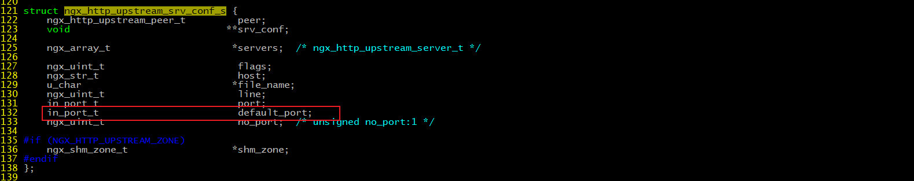

# NginxAdvanced


# 负载均衡


## 用户手动选择


* 实现的方式就是在网站主页上面提供不同线路、不同服务器链接方式,让用户来选择自己访问的具体服务器,来实现负载均衡


## DNS轮询方式


* 使用DNS来实现轮询,不需要投入过多的成本,虽然DNS轮询成本低廉,但是DNS负载均衡存在明显的缺点
* 可靠性低.假设一个域名DNS轮询多台服务器,如果其中的一台服务器发生故障,那么所有的访问该服务器的请求将不会有所回应,即使将该服务器的IP从DNS中去掉,但是由于各大宽带接入商将众多的DNS存放在缓存中,以节省访问时间,导致DNS不会实时更新,所以DNS轮流上一定程度上解决了负载均衡问题,但是却存在可靠性不高的缺点
* 负载均衡不均衡.DNS负载均衡采用的是简单的轮询负载算法,不能区分服务器的差异,不能反映服务器的当前运行状态,不能做到为性能好的服务器多分配请求,另外本地计算机也会缓存已经解析的域名到IP地址的映射,这也会导致使用该DNS服务器的用户在一定时间内访问的是同一台Web服务器,从而引发Web服务器减的负载不均衡
* 负载不均衡则会导致某几台服务器负荷很低,而另外几台服务器负荷确很高,处理请求的速度慢,配置高的服务器分配到的请求少,而配置低的服务器分配到的请求多


## 四/七层负载均衡


* OSI(open system interconnection),开放式系统互联模型,网络体系结构,该模型将网络通信的工作分为七层

* 应用层: 为应用程序提供网络服务
* 表示层: 对数据进行格式化,编码,加密,压缩等操作
* 会话层: 建立,维护,管理会话连接
* 传输层: 建立,维护,管理端到端的连接,常见的有TCP/UDP
* 网络层: IP寻址和路由选择
* 数据链路层: 控制网络层与物理层之间的通信
* 物理层: 比特流传输
* 四层负载均衡指的是OSI七层模型中的传输层,主要是基于IP+PORT的负载均衡
* 七层负载均衡指的是在应用层,主要是基于虚拟的URL或主机IP的负载均衡
* 四层和七层负载均衡的区别
  * 四层负载均衡数据包是在底层就进行了分发,而七层负载均衡数据包则在最顶端进行分发,所以四层负载均衡的效率比七层负载均衡的要高
  * 四层负载均衡不识别域名,而七层负载均衡识别域名
* 处理四层和七层负载以为其实还有二层、三层负载均衡,二层是在数据链路层,基于mac地址来实现负载均衡,三层是在网络层,一般采用虚拟IP地址的方式实现负载均衡


# 负载均衡状态


## down


* 将该服务器标记为永久不可用,那么该代理服务器将不参与负载均衡


## backup


* 将该服务器标记为备份服务器,当主服务器不可用时,将用来传递请求

```nginx
upstream backend{
    server 192.168.1.146:9001 down;
    server 192.168.1.146:9002 backup;
    server 192.168.1.146:9003;
}
server {
    listen 8083;
    server_name localhost;
    location /{
        proxy_pass http://backend;
    }
}
```


## max_conns


* max_conns=number:设置代理服务器同时指定活动链接的最大数量,默认为0,表示不限制,使用该配置可以根据后端服务器处理请求的并发量来进行设置,防止后端服务器被压垮


## max_fails和fail_timeout


* max_fails=number:设置允许请求代理服务器失败的次数,默认为1
* fail_timeout=time:设置经过max_fails失败后,服务暂停的时间,默认是10秒

```nginx
upstream backend{
    server 192.168.1.133:9001 down;
    server 192.168.1.133:9002 backup;
    server 192.168.1.133:9003 max_fails=3 fail_timeout=15;
}
server {
    listen 8083;
    server_name localhost;
    location /{
        proxy_pass http://backend;
    }
}
```


# 负载均衡策略


* Nginx的upstream支持如下六种方式的分配算法


## 轮询


* upstream模块负载均衡默认的策略,每个请求会按时间顺序逐个分配到不同的后端服务器.轮询不需要额外的配置

```nginx
upstream backend{
    server 192.168.1.146:9001 weight=1;
    server 192.168.1.146:9002;
    server 192.168.1.146:9003;
}
server {
    listen 8083;
    server_name localhost;
    location /{
        proxy_pass http://backend;
    }
}
```


## weight


* weight=number:加权[加权轮询],设置服务器的权重,默认为1,权重数据越大,被分配到请求的几率越大;该权重值,主要是针对实际工作环境中不同的后端服务器硬件配置进行调整的,此策略比较适合服务器的硬件配置差别比较大的情况

```nginx
upstream backend{
    server 192.168.1.146:9001 weight=10;
    server 192.168.1.146:9002 weight=5;
    server 192.168.1.146:9003 weight=3;
}
server {
    listen 8083;
    server_name localhost;
    location /{
        proxy_pass http://backend;
    }
}
```


## ip_hash


* 依据ip分配方式.当对后端的多台动态应用服务器做负载均衡时,ip_hash指令能够将某个客户端IP的请求通过哈希算法定位到同一台后端服务器上,这样,当来自某一个IP的用户在后端Web服务器A上登录后,在访问该站点的其他URL,能保证其访问的还是后端web服务器A
* 使用ip_hash无法保证后端服务器的负载均衡,可能导致有些后端服务器接收到的请求多,有些后端服务器接收的请求少,而且设置后端服务器权重等方法将不起作用

```nginx
upstream backend{
    ip_hash;
    server 192.168.1.146:9001;
    server 192.168.1.146:9002;
    server 192.168.1.146:9003;
}
server {
    listen 8083;
    server_name localhost;
    location /{
        proxy_pass http://backend;
    }
}
```


## least_conn


* 依据最少连接方式.最少连接,把请求转发给连接数较少的后端服务器.轮询算法是把请求平均的转发给各个后端,使它们的负载大致相同;但是,有些请求占用的时间很长,会导致其所在的后端负载较高,这种情况下,least_conn这种方式就可以达到更好的负载均衡效果

```nginx
upstream backend{
    least_conn;
    server 192.168.1.146:9001;
    server 192.168.1.146:9002;
    server 192.168.1.146:9003;
}
server {
    listen 8083;
    server_name localhost;
    location /{
        proxy_pass http://backend;
    }
}
```


## url_hash


* 按访问url的hash结果来分配请求,使每个url定向到同一个后端服务器,要配合缓存命中来使用.同一个资源多次请求,可能会到达不同的服务器上,导致不必要的多次下载,缓存命中率不高,以及一些资源时间的浪费.而使用url_hash,可以使得同一个url(也就是同一个资源请求)会到达同一台服务器,一旦缓存住了资源,再此收到请求,就可以从缓存中读取

```nginx
upstream backend{
    hash &request_uri;
    server 192.168.1.146:9001;
    server 192.168.1.146:9002;
    server 192.168.1.146:9003;
}
server {
    listen 8083;
    server_name localhost;
    location /{
        proxy_pass http://backend;
    }
}
```


## fair


* 依据响应时间方式.fair采用的不是内建负载均衡使用的轮换的均衡算法,而是可以根据页面大小,加载时间长短智能的进行负载均衡

```nginx
upstream backend{
    fair;
    server 192.168.1.146:9001;
    server 192.168.1.146:9002;
    server 192.168.1.146:9003;
}
server {
    listen 8083;
    server_name localhost;
    location /{
        proxy_pass http://backend;
    }
}
```

* fair属于第三方模块实现的负载均衡,需要添加`nginx-upstream-fair`
* 下载nginx-upstream-fair模块: `wget https://github.com/gnosek/nginx-upstream-fair`
* 将下载的文件上传到服务器并进行解压缩: `unzip nginx-upstream-fair-master.zip`
* 重命名资源: `mv nginx-upstream-fair-master fair`
* 使用./configure命令将资源添加到Nginx模块中: `./configure --add-module=/root/fair`
* 编译: `make`
* 编译可能会出现如下错误,ngx_http_upstream_srv_conf_t结构中缺少default_port


* 解决方案:在Nginx的源码中 src/http/ngx_http_upstream.h,找到`ngx_http_upstream_srv_conf_s`,在模块中添加添加default_port属性

```
in_port_t	   default_port
```



* 再次进行make
* 将sbin目录下的nginx进行备份: `mv /usr/local/nginx/sbin/nginx /usr/local/nginx/sbin/nginxold`
* 将安装目录下的objs中的nginx拷贝到sbin目录: `cp nginx /usr/local/nginx/sbin`
* 更新Nginx: `make upgrade`


## 案例


* 对所有请求实现一般轮询规则的负载均衡

```nginx
upstream backend{
    server 192.168.1.146:9001;
    server 192.168.1.146:9002;
    server 192.168.1.146:9003;
}
server {
    listen 8083;
    server_name localhost;
    location /{
        proxy_pass http://backend;
    }
}
```

* 对所有请求实现加权轮询规则的负载均衡

```nginx
upstream backend{
    server 192.168.1.146:9001 weight=7;
    server 192.168.1.146:9002 weight=5;
    server 192.168.1.146:9003 weight=3;
}
server {
    listen 8083;
    server_name localhost;
    location /{
        proxy_pass http://backend;
    }
}
```

* 对特定资源实现负载均衡

```nginx
upstream videobackend{
    server 192.168.1.146:9001;
    server 192.168.1.146:9002;
}
upstream filebackend{
    server 192.168.1.146:9003;
    server 192.168.1.146:9004;
}
server {
    listen 8084;
    server_name localhost;
    location /video/ {
        proxy_pass http://videobackend;
    }
    location /file/ {
        proxy_pass http://filebackend;
    }
}
```

* 对不同域名实现负载均衡

```nginx
upstream itcastbackend{
    server 192.168.1.146:9001;
    server 192.168.1.146:9002;
}
upstream itheimabackend{
    server 192.168.1.146:9003;
    server 192.168.1.146:9004;
}
server {
    listen	8085;
    server_name www.itcast.cn;
    location / {
        proxy_pass http://itcastbackend;
    }
}
server {
    listen	8086;
    server_name www.itheima.cn;
    location / {
        proxy_pass http://itheimabackend;
    }
}
```

* 实现带有URL重写的负载均衡

```nginx
upstream backend{
    server 192.168.1.146:9001;
    server 192.168.1.146:9002;
    server 192.168.1.146:9003;
}
server {
    listen	80;
    server_name localhost;
    location /file/ {
        rewrite ^(/file/.*) /server/$1 last;
    }
    location / {
        proxy_pass http://backend;
    }
}
```


# Nginx七层负载均衡


* Nginx要实现七层负载均衡需要用到proxy_pass代理模块配置,Nginx的负载均衡是在Nginx的反向代理基础上把用户的请求根据指定的算法分发到一组upstream虚拟服务池


### upstream


* `upstream name {...}`: 定义一组服务器,它们可以是监听不同端口的服务器,并且也可以是同时监听TCP和Unix socket的服务器.服务器可以指定不同的权重,默认为1


### server


* `server name [paramerters]`: 指定后端服务器的名称和一些参数,可以使用域名、IP、端口或者unix socket


### 使用案例


* 服务器配置

```nginx
server {
    listen   9001;
    server_name localhost;
    default_type text/html;
    location /{
        return 200 '<h1>192.168.200.146:9001</h1>';
    }
}
server {
    listen   9002;
    server_name localhost;
    default_type text/html;
    location /{
        return 200 '<h1>192.168.200.146:9002</h1>';
    }
}
server {
    listen   9003;
    server_name localhost;
    default_type text/html;
    location /{
        return 200 '<h1>192.168.200.146:9003</h1>';
    }
}
```

* 负载均衡器设置

```nginx
upstream backend{
    server 192.168.1.146:9091;
    server 192.168.1.146:9092;
    server 192.168.1.146:9093;
}
server {
    listen 8083;
    server_name localhost;
    location /{
        proxy_pass http://backend;
    }
}
```


# Nginx四层负载均衡


* Nginx在1.9之后,增加了一个stream模块,用来实现四层协议的转发、代理、负载均衡等
* stream模块的用法跟http的用法类似,允许配置一组TCP或者UDP等协议的监听,然后通过proxy_pass来转发请求,通过upstream添加多个后端服务,实现负载均衡
* 四层协议负载均衡的实现,一般都会用到LVS、HAProxy、F5等,要么很贵要么配置很麻烦,而Nginx的配置相对来说更简单,更能快速完成工作


## 添加stream模块的支持


* Nginx默认是没有编译这个模块的,需要使用到stream模块,那么需要在编译的时候加上`--with-stream`


## stream


* `stream { ... }`: 提供在其中指定流服务器指令的配置文件上下文,和http指令同级


## upstream


* 和http的upstream指令类似


## 案例


```nginx
stream {
    upstream redisbackend {
        server 192.168.1.146:6379;
        server 192.168.1.146:6378;
    }
    upstream tomcatbackend {
        server 192.168.1.146:8080;
    }
    server {
        listen  81;
        proxy_pass redisbackend;
    }
    server {
        listen	82;
        proxy_pass tomcatbackend;
    }
}
```


# 缓存集成


## Web缓存


* Nginx的web缓存服务主要是使用`ngx_http_proxy_module`模块相关指令集来完成


### proxy_cache_path


* `proxy_cache_path path [levels=number] keys_zone=zone_name:zone_size [inactive=time] [max_size=size];`:指定用于设置缓存文件的存放路径
  * path: 缓存路径地址
  * levels: 指定该缓存空间对应的目录,最多可以设置3层,每层取值为1|2
    * levels=1:2: 缓存空间有两层目录,第一次是1个字母,第二次是2个字母
    * dream[key]通过MD5加密以后的值为 43c8233266edce38c2c9af0694e2107d
    * levels=1:2: 最终的存储路径为/usr/local/proxy_cache/d/07
    * levels=2:1:2: 最终的存储路径为/usr/local/proxy_cache/7d/0/21
    * levels=2:2:2: 最终的存储路径为??/usr/local/proxy_cache/7d/10/e2
  * keys_zone: 为这个缓存区设置名称和指定大小,如`keys_zone=dream:200m`: 缓存区的名称是dream,大小为200M,1M大概能存储8000个keys
  * inactive: 指定缓存的数据多次时间未被访问就将被删除,如`inactive=1d`: 缓存数据在1天内没有被访问就会被删除
  * max_size: 设置最大缓存空间,如果缓存空间存满,默认会覆盖缓存时间最长的资源,如`max_size=20g`

```nginx
http{
	proxy_cache_path /usr/local/proxy_cache keys_zone=dream:200m  levels=1:2:1 inactive=1d max_size=20g;
}
```


### proxy_cache


* `proxy_cache zone_name|off;`: 开启或关闭代理缓存,如果是开启则自定使用哪个缓存区来进行缓存
  * zone_name: 指定使用缓存区的名称


### proxy_cache_key


* `proxy_cache_key key;`: 设置web缓存的key值,Nginx会根据key值MD5哈希存缓存.默认`proxy_cache_key $scheme$proxy_host$request_uri;`


### proxy_cache_valid


* `proxy_cache_valid [code ...] time;`: 对不同返回状态码的URL设置不同的缓存时间

```nginx
# 为200和302的响应URL设置10分钟缓存,为404的响应URL设置1分钟缓存
proxy_cache_valid 200 302 10m;
proxy_cache_valid 404 1m;
# 对所有响应状态码的URL都设置1分钟缓存
proxy_cache_valid any 1m;
```


### proxy_cache_min_uses


* `proxy_cache_min_uses number;`: 设置资源被访问多少次后被缓存


### proxy_cache_methods


* `proxy_cache_methods GET|HEAD|POST;`: 设置缓存哪些HTTP方法,默认缓存HTTP的GET和HEAD方法,不缓存POST方法


### 案例


```nginx
http{
    proxy_cache_path /usr/local/proxy_cache levels=2:1 keys_zone=dream:200m inactive=1d max_size=20g;
    upstream backend{
        server 192.168.1.146:8080;
    }
    server {
        listen       8080;
        server_name  localhost;
        location / {
            proxy_cache itcast;
            proxy_cache_key itheima;
            proxy_cache_min_uses 5;
            proxy_cache_valid 200 5d;
            proxy_cache_valid 404 30s;
            proxy_cache_valid any 1m;
            add_header nginx-cache "$upstream_cache_status";
            proxy_pass http://backend/js/;
        }
    }
}
```


## 缓存清除


* 方式一: 删除对应的缓存目录
* 方式二: 使用第三方扩展模块


### 使用第三方扩展


#### ngx_cache_purge


* 下载ngx_cache_purge模块对应的资源包,并上传到服务器上,解压,修改文件名为purge(可做可不做)
* 进入Nginx的安装目录,使用./configure进行参数配置: `./configure --add-module=/root/nginx/module/purge`
* 使用make进行编译
* 将nginx安装目录的nginx二级制可执行文件备份: `mv /usr/local/nginx/sbin/nginx /usr/local/nginx/sbin/nginxold`
* 将编译后的objs中的nginx拷贝到nginx的sbin目录下: `cp objs/nginx /usr/local/nginx/sbin`
* 使用make进行升级: `make upgrade`
* 在nginx配置文件中进行如下配置

```nginx
server{
    location ~/purge(/.*) {
        proxy_cache_purge dream flying;
    }
}
```


## 设置资源不缓存


* 下面两个指令都有一个指定的条件,这个条件可以是多个,并且多个条件中至少有一个不为空且不等于"0",则条件满足成立
* $cookie_nocache: 当前请求的cookie中键的名称为nocache对应的值
* $arg_nocache和$arg_comment: 当前请求的参数中属性名为nocache和comment对应的属性值


### proxy_no_cache


* `proxy_no_cache string ...;`: 定义不将数据进行缓存的条件.如`proxy_no_cache $cookie_nocache $arg_nocache $arg_comment;`


### proxy_cache_bypass


* `proxy_cache_bypass string ...;`: 设置不从缓存中获取数据的条件.如`proxy_cache_bypass $cookie_nocache $arg_nocache $arg_comment;`


### 案例


```nginx
server{
    listen	8080;
    server_name localhost;
    location / {
        if ($request_uri ~ /.*\.js$){
            set $nocache 1;
        }
        proxy_no_cache $nocache $cookie_nocache $arg_nocache $arg_comment;
        proxy_cache_bypass $nocache $cookie_nocache $arg_nocache $arg_comment;
    }
}
```


# 制作下载站点


* 需要使用模块ngx_http_autoindex_module,该模块处理以斜杠("/")结尾的请求,并生成目录列表
* nginx编译的时候会自动加载该模块,但是该模块默认是关闭的,需要使用命令来完成对应的配置
* `autoindex on|off`: 启用或禁用目录列表输出
* `autoindex_exact_size on|off`: 对应HTLM格式,指定是否在目录列表展示文件的详细大小.默认为on,显示出文件的确切大小,单位是bytes;改为off后,显示出文件的大概大小,单位是kB或者MB或者GB
* `autoindex_format html|xml|json|jsonp;`: 设置目录列表的格式
* `autoindex_localtime on|off`: 对应HTML格式,是否在目录列表上显示时间.默认为off,显示的文件时间为GMT时间;改为on后,显示的文件时间为文件的服务器时间

```nginx
location /download{
    root /usr/local;
    autoindex on;
    autoindex_exact_size on;
    autoindex_format html;
    autoindex_localtime on;
}
```


# 用户认证模块


* 需要使用ngx_http_auth_basic_module模块,默认已经安装该模块,它允许通过使用"HTTP基本身份验证"协议验证用户名和密码来限制对资源的访问

* `auth_basic string|off`: 使用 HTTP基本认证 协议启用用户名和密码的验证.开启后,服务端会返回401,指定的字符串会返回到客户端,给用户以提示信息,但是不同的浏览器对内容的展示不一致
* `auth_basic_user_file filePath`: 指定用户名和密码所在文件.该文件中的用户名和密码的设置,密码需要进行加密,可以采用工具自动生成

```nginx
location /download{
    root /usr/local;
    autoindex on;
    autoindex_exact_size on;
    autoindex_format html;
    autoindex_localtime on;
    auth_basic 'please input your auth';
    auth_basic_user_file htpasswd;
}
```

* 需要使用`htpasswd`工具生成密码: `yum install -y httpd-tools`

```shell
htpasswd -c /usr/local/nginx/conf/htpasswd username # 创建一个新文件记录用户名和密码
htpasswd -b /usr/local/nginx/conf/htpasswd username password # 在指定文件新增一个用户名和密码
htpasswd -D /usr/local/nginx/conf/htpasswd username # 从指定文件删除一个用户信息
htpasswd -v /usr/local/nginx/conf/htpasswd username # 验证用户名和密码是否正确
```


# ngx_lua模块


* 淘宝开发的ngx_lua模块通过将lua解释器集成进Nginx,可以采用lua脚本实现业务逻辑,由于lua的紧凑、快速以及内建协程,所以在保证高并发服务能力的同时极大地降低了业务逻辑实现成本


## 环境准备


### 方式一:lua-nginx-module


* 安装luajit,[官网](http://luajit.org/)
* 在官网上下载压缩包或用wget下载到服务器,解压,进入目录,编译安装: `make && make install`
* 下载[lua-nginx-module](https://github.com/openresty/lua-nginx-module/archive/v0.10.16rc4.tar.gz),解压
* 导入环境变量,告诉Nginx去哪里找luajit

```
export LUAJIT_LIB=/usr/local/lib
export LUAJIT_INC=/usr/local/include/luajit-2.0
```

* 进入Nginx的目录执行如下命令:

```
./configure --prefix=/usr/local/nginx --add-module=../lua-nginx-module
make && make install
```

* 如果启动Nginx出现如下错误:


* 需要设置软链接,使用如下命令: ` ln -s /usr/local/lib/libluajit-5.1.so.2 /lib64/libluajit-5.1.so.2`

* 如果启动Nginx出现以下错误信息


* 解决方案有两个:一种是下载对应的模块,另一种则是禁用掉restry模块,禁用的方式为:

```
http{
	lua_load_resty_core off;
}
```


### 方式二:OpenRestry


* OpenResty是一个基于Nginx与 Lua 的高性能 Web 平台,其内部集成了大量精良的 Lua 库、第三方模块以及大多数的依赖项,用于方便地搭建能够处理超高并发、扩展性极高的动态 Web 应用、Web 服务和动态网关
* [下载OpenResty](https://openresty.org/download/openresty-1.15.8.2.tar.gz)或使用wget下载,解压,进入目录
* 执行命令:./configure
* 执行命令:make && make install
* 进入OpenResty的目录,找到nginx：cd /usr/local/openresty/nginx/,在conf目录下的nginx.conf添加如下内容

```nginx
location /lua{
    default_type 'text/html';
    content_by_lua 'ngx.say("<h1>HELLO,OpenRestry</h1>")';
}
```

* 在sbin目录下启动nginx


## ngx_lua的使用


* 使用Lua编写Nginx脚本的基本构建块是指令,指令用于指定何时运行用户Lua代码以及如何使用结果,下图显示了执行指令的顺序


* *的作用

```
*:无 , 即 xxx_by_lua ,指令后面跟的是 lua指令
*:_file,即 xxx_by_lua_file 指令后面跟的是 lua文件
*:_block,即 xxx_by_lua_block 在0.9.17版后替换init_by_lua_file
```

* `init_by_lua*`: 在每次Nginx重新加载配置时执行,可以用来完成一些耗时模块的加载,或者初始化一些全局配置
* `init_worker_by_lua*`: 用于启动一些定时任务,如心跳检查、定时拉取服务器配置等
* `set_by_lua*`: 变量赋值,这个指令一次只能返回一个值,并将结果赋值给Nginx中指定的变量
* `rewrite_by_lua*`: 执行内部URL重写或者外部重定向,典型的如伪静态化URL重写,本阶段在rewrite处理阶段的最后默认执行
* `access_by_lua*`: 访问控制.例如,如果只允许内网IP访问
* `content_by_lua*`: 该指令是应用最多的指令,大部分任务是在这个阶段完成的,其他的过程往往为这个阶段准备数据,正式处理基本都在本阶段
* `header_filter_by_lua*`: 设置应答消息的头部信息
* `body_filter_by_lua*`: 对响应数据进行过滤,如截断、替换
* `log_by_lua*`: 用于在log请求处理阶段,用Lua代码处理日志,但并不替换原有log处理
* `balancer_by_lua*`: 用来实现上游服务器的负载均衡器算法
* `ssl_certificate_by_*`: 在Nginx和下游服务开始一个SSL握手操作时将允许本配置项的Lua代码


### 案例

```
http://192.168.1.133?name=张三&gender=1
Nginx接收到请求后,根据gender传入的值,如果gender传入1,则在页面上展示张三先生,如果gender传入0,则在页面上展示张三女士,如果未传或传入其他值则在页面上展示张三
```


```nginx
location /getByGender {
    default_type 'text/html';
    set_by_lua $name "
        local uri_args = ngx.req.get_uri_args()
        gender = uri_args['gender']
        name = uri_args['name']
        if gender=='1' then
        return name..'先生'
        elseif gender=='0' then
        return name..'女士'
        else
        return name
        end
        ";
        header_filter_by_lua "
        ngx.header.aaa='bbb'
        ";
        return 200 $name;
}
```


## ngx_lua操作Redis


### lua-resty-redis


* lua-resty-redis提供了访问Redis的详细API,包括创建对接、连接、操作、数据处理等,这些API基本上与Redis的操作一一对应
* redis = require "resty.redis"
* new: redis,err = redis:new(),创建一个Redis对象
* connect: ok,err=redis:connect(host,port[,options_table]),设置连接Redis的连接信息
  * ok:连接成功返回 1,连接失败返回nil
  * err:返回对应的错误信息
* set_timeout: redis:set_timeout(time) ,设置请求操作Redis的超时时间
* close: ok,err = redis:close(),关闭当前连接,成功返回1,失败返回nil和错误信息
* redis命令对应的方法: 在lua-resty-redis中,所有的Redis命令都有自己的方法,方法名字和命令名字相同,只是全部为小写

```nginx
location / {
    default_type "text/html";
    content_by_lua_block{
        local redis = require "resty.redis" -- 引入Redis
            local redisObj = redis:new()  --创建Redis对象
            redisObj:set_timeout(1000) --设置超时数据为1s
            local ok,err = redisObj:connect("192.168.1.150",6379) --设置redis连接信息
            if not ok then --判断是否连接成功
            ngx.say("failed to connection redis",err)
            return
            end
            ok,err = redisObj:set("username","TOM")--存入数据
            if not ok then --判断是否存入成功
            ngx.say("failed to set username",err)
            return
            end
            local res,err = redisObj:get("username") --从redis中获取数据
            ngx.say(res)	--将数据写会消息体中
            redisObj:close()
    }
}
```


## ngx_lua操作Mysql


### lua-resty-mysql


* lua-resty-mysql是OpenResty开发的模块,使用灵活、功能强大,适合复杂的业务场景,同时支持存储过程的访问
* 准备MYSQL

```
host: 192.168.200.111
port: 3306
username:root
password:123456
```

* 创建一个数据库表及表中的数据

```
create database nginx_db;

use nginx_db;

create table users(
   id int primary key auto_increment,
   username varchar(30),
   birthday date,
   salary double
);

insert into users(id,username,birthday,salary) values(null,"TOM","1988-11-11",10000.0);
insert into users(id,username,birthday,salary) values(null,"JERRY","1989-11-11",20000.0);
insert into users(id,username,birthday,salary) values(null,"ROWS","1990-11-11",30000.0);
insert into users(id,username,birthday,salary) values(null,"LUCY","1991-11-11",40000.0);
insert into users(id,username,birthday,salary) values(null,"JACK","1992-11-11",50000.0);
```

* 数据库连接四要素:

```
driverClass=com.mysql.jdbc.Driver
url=jdbc:mysql://192.168.1.150:3306/nginx_db
username=root
password=123456
```

* API使用

  * 引入resty.mysql模块: `local mysql = require "resty.mysql"`

  * new: `db,err = mysql:new()`.创建一个MySQL连接对象,遇到错误时,db为nil,err为错误描述信息

  * connect: `ok,err=db:connect(options)`.options是一个参数的Lua表结构,里面包含数据库连接的相关信息.尝试连接到一个MySQL服务器

  * set_timeout: `db:set_timeout(time)`.设置子请求的超时时间(ms),包括connect方法

  * close: `db:close()`.关闭当前MySQL连接并返回状态.如果成功,则返回1;如果出现任何错误,则将返回nil和错误描述

  * send_query: `bytes,err=db:send_query(sql)`.异步向远程MySQL发送一个查询.如果成功则返回成功发送的字节数;如果错误,则返回nil和错误描述

  * read_result: `res, err, errcode, sqlstate = db:read_result()| res, err, errcode, sqlstate = db:read_result(rows)`.从MySQL服务器返回结果中读取一行数据.res返回一个描述OK包或结果集包的Lua表

    * rows: 指定返回结果集的最大值,默认为4

    * res:操作的结果集

    * err:错误信息

    * errcode:MySQL的错误码,比如1064

    * sqlstate:返回由5个字符组成的标准SQL错误码,比如42000

    * 如果是查询,则返回一个容纳多行的数组,每行是一个数据列的key-value对

    * 如果是增删改,则返回类上如下数据,如

      ```json
      {
          insert_id = 0,
          server_status=2,
          warning_count=1,
          affected_rows=2,
          message=nil
      }
      ```

* 案例

```nginx
location /{
    content_by_lua_block{
        local mysql = require "resty.mysql"
            local db = mysql:new()
            local ok,err = db:connect{
            host="192.168.1.150",
                port=3306,
                user="root",
                password="123456",
                database="nginx_db"
        }
        db:set_timeout(1000)
            db:send_query("select * from users where id =1")
            local res,err,errcode,sqlstate = db:read_result()
            ngx.say(res[1].id..","..res[1].username..","..res[1].birthday..","..res[1].salary)
            db:close()
    }
}
```


### lua-cjson


* read_result()得到的结果res都是table类型,要想在页面上展示,就必须知道table的具体数据结构才能进行遍历获取,处理起来比较麻烦
* cjson可以将table类型的数据转换成json字符串,把json字符串展示在页面上即可
* 引入cjson: `local cjson = require "cjson"`
* 调用cjson的encode方法进行类型转换: `cjson.encode(res) `
* 使用:

```nginx
location /{
    content_by_lua_block{
        local mysql = require "resty.mysql"
            local cjson = require "cjson"
            local db = mysql:new()
            local ok,err = db:connect{
            host="192.168.1.150",
                port=3306,
                user="root",
                password="123456",
                database="nginx_db"
        }
        db:set_timeout(1000)
            --db:send_query("select * from users where id = 2")
            db:send_query("select * from users")
            local res,err,errcode,sqlstate = db:read_result()
            ngx.say(cjson.encode(res))
            for i,v in ipairs(res) do
            ngx.say(v.id..","..v.username..","..v.birthday..","..v.salary)
            end
            db:close()
    }
}
```


### 增删改


* `res, err, errcode, sqlstate = db:query(sql[,rows])`: 优化send_query和read_result,本方法是send_query和read_result组合的快捷方法
* 有了该API,上面的代码我们就可以进行对应的优化:

```nginx
location /{
    content_by_lua_block{
        local mysql = require "resty.mysql"
            local db = mysql:new()
            local ok,err = db:connect{
            host="192.168.1.150",
                port=3306,
                user="root",
                password="123456",
                database="nginx_db",
                max_packet_size=1024,
                compact_arrays=false
        }
        db:set_timeout(1000)
            local res,err,errcode,sqlstate = db:query("select * from users")
            --local res,err,errcode,sqlstate = db:query("insert into users(id,username,birthday,salary) values(null,'zhangsan','2020-11-11',32222.0)")
            --local res,err,errcode,sqlstate = db:query("update users set username='lisi' where id = 6")
            --local res,err,errcode,sqlstate = db:query("delete from users where id = 6")
            db:close()
    }
}
```


## 综合案例


* 使用ngx_lua模块完成Redis缓存预热
* 先得有一张表(users),从表中查询出符合条件的记录,此时获取的结果为table类型
* 使用cjson将table数据转换成json字符串,将查询的结果数据存入Redis中

```nginx
init_by_lua_block{
    redis = require "resty.redis"
        mysql = require "resty.mysql"
        cjson = require "cjson"
}

location /{
    default_type "text/html";
    content_by_lua_block{

        --获取请求的参数username
            local param = ngx.req.get_uri_args()["username"]
            --建立mysql数据库的连接
            local db = mysql:new()
            local ok,err = db:connect{
            host="192.168.1.150",
                port=3306,
                user="root",
                password="123456",
                database="nginx_db"
        }
        if not ok then
            ngx.say("failed connect to mysql:",err)
            return
            end
            --设置连接超时时间
            db:set_timeout(1000)
            --查询数据
            local sql = "";
        if not param then
            sql="select * from users"
            else
            sql="select * from users where username=".."'"..param.."'"
            end
            local res,err,errcode,sqlstate=db:query(sql)
            if not res then
            ngx.say("failed to query from mysql:",err)
            return
            end
            --连接redis
            local rd = redis:new()
            ok,err = rd:connect("192.168.1.150",6379)
            if not ok then
            ngx.say("failed to connect to redis:",err)
            return
            end
            rd:set_timeout(1000)
            --循环遍历数据
            for i,v in ipairs(res) do
            rd:set("user_"..v.username,cjson.encode(v))
            end
            ngx.say("success")
            rd:close()
            db:close()
    }
}
```

