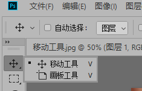
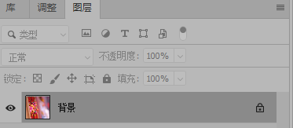
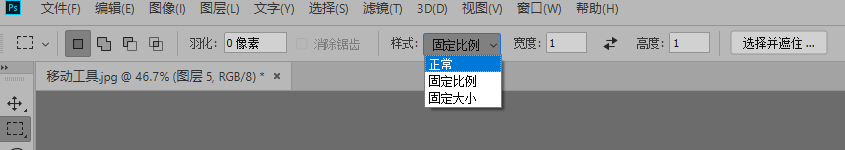
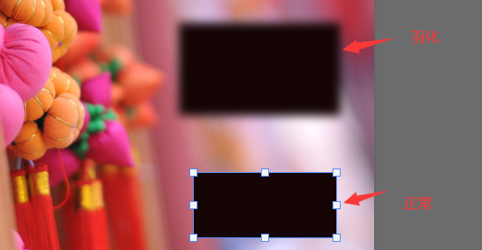
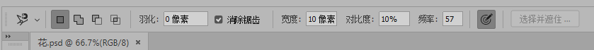
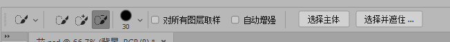
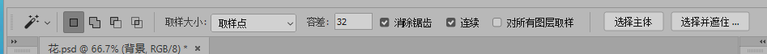
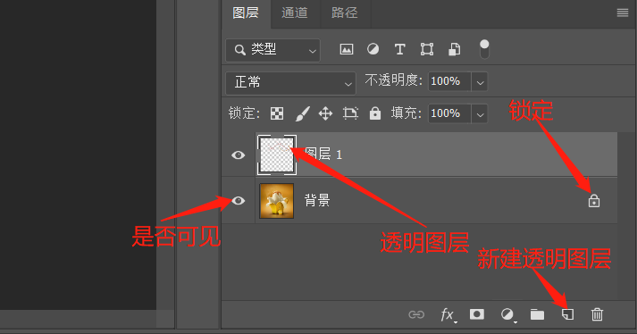
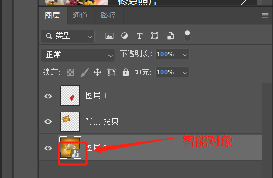
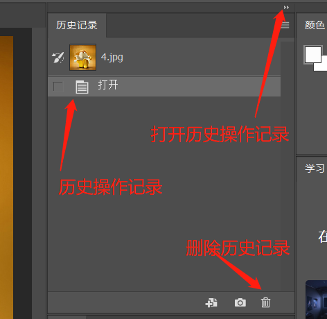

# PS2019

# 快捷键

* ALT+F:打开文件选项栏
* CTRL+O:打开文件选项,选择要处理的图片或PSD文件
* CTRL+D:取消选择
* CTRL+N:新建图层,可选多种像素,根据需求而定
* CTRL++,-/Z+鼠标左键:放大或缩小图层,效果同工具栏放大镜.按住空格键或使用H抓手工具左右移动
* Z:切换为工具栏放大镜模式
* H:切换为工具栏抓手默认
* SHIFT+当前工具快捷键:当左工具栏每个工具中有多种工具时,可使用此快捷键进行切换,也可以右键进行切换
* SHIFT+O:当选择截图工具时,可切换网格,黄金分割的方向
* CTRL+K:修改配置
  * 暂存盘:ps运行时的文件存放地点,不要放在系统盘,影响系统性能
* 画图像时可以使用翻转,翻转没有快捷键,需要设置:编辑->快捷键设置->图像->图像旋转->水平翻转画布->设置合适的快捷键
* 对于用套索选中的地方可以按ctrl+T对选中的区域进行规则的大小调整
* CTRL+J
  * 将被矩形选框工具,套索工具等类似类型的工具选中的选区复制到一个新的图层中
  * 将被选中的图层使用CTRL+C,CTRL+V也可以将图层复制
  * 选中当前图层,直接复制当前图层到一个新的图层中
  
* CTRL+SHIFT+N:打开新建图层窗口
* `CTRL+E`:合并选中的图层,不管图层是否可见
* `CTRL+SHIFT+E`:合并所有可见的图层,即图层工具栏中的眼不选.合并完之后原图层消失
* `CTRL+SHIFT+ALT+E`:合并所有图层,并将合并后的图层重新生成为一个新的图层
* ALT:
  * 当前若是选中背景中的某个图层时,可以移动并复制该图层.注意只能复制图层
* CTRL+Z:撤销,但并不是对所有的操作都可以撤销
* DELETE:删除上一步的操作,通常CTRL+Z不行就用DELETE试试
* R:选中图片,进行旋转
* []:缩小或放大所有画笔像素大小
* `ALT+DELETE`:将当前图层整个都填充为前景色

# 菜单栏

* 窗口:可以打开右选项卡,如图层,铅笔等

# 左工具栏

* 右键点击任意工具栏,可以出现其他类型操作.若没有,表示只有该工具一种操作

  

* 所有的菜单可以右键点击出现其他同类型菜单
* b:画笔
* e:橡皮檫
* L:套索,选定区域
* 选中画笔的时候按F5,可出现画笔选项
* R:旋转图层

## 移动工具

### 移动工具

* 右键点击移动可切换移动工具和画板工具

* 打开一张图片,可以看到右边选项卡的图层界面中已经横向显示了该图片,默认为背景,同时图片后有一个锁,表示该图片不能被移动.没有锁的可以直接移动,若有锁,可以如下操作

  

  * 直接移动该背景图片,会提示是否将该图片转换成正常图层,点击转换到正常图层,则该图片就可以移动
  * 点击选项卡中图层的图片后面的锁,此时该图片也将转换为正常图片
  * 点击选项卡中图层中的锁定,可以锁住该图

* 当同时打开多个图片时,可以使用移动工具选择一张图片,拖动到另外一张图片上,相当于添加图层

* 自动选择:当有多个图层时,移动指定图层时,右下角的图层工具栏会选中指定的图层

* 显示变换控件:一般不勾,主要是显示多个图层的边界,可对图层大小,角度进行修改

* 当有多个图层时,同时选中多个图层,可对选中图层进行对齐和分布操作

  

### 画板工具

* 主要对画布进行操作,大部分和移动工具功能差不多

## 矩形选框

* 有多种规则图形的选框可用,包括矩形,椭圆等,以矩形为例

* 在图层上用左键画出矩形选框,边框为虚线.放开左键即选中相应区域

* 左键选中该区域,按住不动可移动选中区域

* 左键点击选中区域外其他区域,可取消选中区域选框

* 按住SHIFT+左键可以建立正方形的选择区

  * 当椭圆选框工具时,建立一个圆形选择区

* 按住ALT+左键可以建立朝上方辐射的矩形选择区

* 同时按SHIFT+ALT+左键可以建立朝上方辐射的正方形选择区

* ALT+DELETE:为选中区域填充颜色,要在选了区域之后选颜色

* CTRL+DELETE:填充背景色

* 单行和单列选框工具看起来是一条直线,其实是选择了一条像素点

* 上方菜单栏中可以选择样式,正常情况下是以固定比例选择区,固定大小则是固定像素

  

* 羽化左边的4个可以对多个选区进行交集,并集等操作

* 消除锯齿一般是选择椭圆选择区时才会用,会使弯曲处更加平滑

* 羽化:相当于让选择区的边缘软化,模糊.需要先设置羽化的像素

  

## 套索

* 该组可以称为不规则选框

  

### 套索工具

* 用鼠标难度比较大,只能选择不需要太精细的图的边缘

### 多边形套索工具

* 可以对精细度较高的边缘进行选择,选取的点越多越精细,结合放大镜可以选择最精细的图

### 磁性套索工具

* 可以根据鼠标移动轨迹自动进行描点,还可以根据宽度等条件进行调节,适用于不规则的图形

  

  * 宽度:决定鼠标滑动多大的距离就进行一次描点,边缘比较清晰的图可以设置的高一些
  * 对比度:图形边缘模糊或者清晰,更清晰的可以设置的高些,模糊的可以设置低些
  * 频率:图层边缘上插入的点的多少

## 快速选择

### 快速选择工具

* 类似于套索工具,对相似的颜色点击之后进行区域选择,而不是根据点来圈图

* 自动增强是当选择区域时,自动选择边缘并进行优化,减少色斑和不平滑

  

* 默认是添加到选区,若是有添加多的部分,可以选择从选区减去,同时配合套索工具多选区进行适当的修剪

* 对所有图层取样是指当有多个图层时,快速选取是否对其他图层有效.若选中则会对其他图层有效,不选中则无效

* ALT:减选,默认是点那选那.SHIFT:加选

### 魔棒工具

* 和快速选取类似,但没有快速选取精确

  

* 容差:该值越小表示越类似的图片才会被选择,色差越小被选中的颜色越少,色差越大被选中的颜色越多

* 消除锯齿是为了让边缘更加平滑

* 连续是指只要颜色类似的都选中,只适用于色差比较大图层,否则容易选中不必要的区域

* CTRL+SHIFT+I:将选区反过来,是大写的i,不是L

## 图框

## 吸管

### 吸管工具

* 主要就是吸取颜色在其他地方使用

## 缩放

* 对图层进行缩放,快捷键Z
* 选中缩放之后,默认是放大模式,鼠标左键点击即可放大
* 按住ALT不放,同时点击鼠标左键即可缩小

# 顶部工具栏

## 编辑

### 自由变换

* 选中一个图层或一块区域进行自由变换,可以调整该区域的高宽,倾斜角度,扭曲等
* 快捷键:CTRL+T
* 右键还可以进行缩放,斜切,变形等操作.斜切,透视,扭曲等是透视的

#### 无限重复操作

* 先使用CTRL+J或CTRL+C,CTRL+V复制图层
* CTRL+T,选择最新的一层图层,进行旋转(也可以是其他操作),只需要旋转一点点,回车退出CTRL+T
* 一定要退出CTRL+T,在最新的图层上连续按CTRL+SHIFT+ALT+T,可以重复以上操作

#### 背景填充

* 随意打开一张图片,使用裁剪工具拉伸后,图片四周会出现透明空白区域
* 使用矩形选框工具选择图片的左右(或上下边缘),选中后CTRL+T
* 按住SHIFT,同时拉动选中区域的左边移动,这样就能将左边的背景填充到空白区域.其他方向一样操作

### 首选项

#### 性能

* 内存使用情况:修改PS可使用内存数

* 历史状态记录:修改每个文件操作的历史记录,默认记录50次,最大1000次

#### 暂存盘

* 修改临时文件地址,默认为C盘

## 滤镜

### 自适应广角

* 会新弹出一个窗口
* 约束工具:可以选择多个点,连成一块区域进行修正,最终连成的是直线,双击左键完成
* 多边形约束工具:可以选择多个点,从起点回到终点形成闭合.一般是一整个物体进行角度修正
* 修正完之后图层周边会出现空白,可以使用滤镜里的液化,将空白区域覆盖

## 窗口

### 排列

* 多个文件同时打开时,可选择排列方式,多以堆积,平铺方式打开
* 匹配缩放:根据所选图片的缩放程度对窗口内所有图片进行缩放
* 为XX新建窗口:为当前选中文件重新打开一个窗口,对任意一个文件的操作都会在另外一个文件上显示,主要是为了对修改进行更直观的比对

# 视图

## 显示

### 切片

* 当使用切片时,是否显示切片的边缘线

### 像素网格

* 显示图片的网格(像素点)

## 清除切片

* 清除切片工具时使用造成的切片效果

## 图层

* 打开一张图片时,默认就是底层图层,锁定状态,不可删除

* CTRL+J直接以当前图层为蓝本新建一个相同图层

* 右下角的图层工具栏点击新建图层可以新建一个透明图层

  

* 拖动上面的图层上下位置可以指定图层的上下层关系,下面的图层被上面的图层遮盖

* CTRL+SHIFT+N:打开新建图层窗口,默认新建的透明图层

* CTRL+E:合并选中的图层,不管是否可见

* CTRL+SHIFT+E:合并可见的图层,即将图层设置为不可见,合并其他可见的图层

* 锁定

  * 锁定透明图层:若当前图层有空白时,使用该项,做其他如填充颜色操作时,将不会对空白处进行操作,只会对有像素的区域操作
  * 锁定图像像素:选中此项,不能对图层进行任何画笔的操作,只能移动图层
  * 锁定位置:不能拖动图层
  * 锁定全部:以上3项全部锁定

### 链接图层

* 当选择多个图层时,可点击该项,效果与分组类似

### 添加图层样式

* 对图层添加样式

#### 斜面和浮雕

* 样式:主要是给图层添加立体效果
* 深度:可以让立体效果更清晰
* 大小:立体效果出现更清晰的轮廓
* 软化:将立体出现的轮廓模糊化
* 角度:设置光线照射到图层上的角度

### 创建新组

* 若有多个图层时,想对多个图层进行相同操作,可以新建一个组,将需要进行相同操作的图层放入其中
* 组可以嵌套
* 快捷键:CTRL+G

### 智能对象

#### 转换为智能对象

* 主要是为了保护图层的像素不受破坏.也可以在右下角的图层上右键点击修改
* 缩放不会修改该图层的像素大小
* 双击智能对象图层可以对图层进行修改,此时会复制当前图层,并转到新的操作窗口中.在新窗口中对图层操作也会反应到原窗口的图层中
* 选中多个图层,右键可以将其合并转换为智能图层(多个图层变成一个图层).转换后在当前操作窗口不能将其拆分,只能双击智能图层编辑,同样会弹出另外一个操作窗口,在新窗口可以对所有图层进行操作,保存之后的操作也会反应到原窗口图层

### 合并图层

* 将右下角图层工具栏中选中的图层进行合并,不管图层是否可见

### 合并可见图层

* 将右下角图层工具栏中选中的可见图层进行合并

### 拼合图层

* 将当前操作的文件中所有图层进行合并,不管是否选中,是否可见

# 历史记录

# 矩形选择框

## 选择并遮住

* 低版本又叫调整边缘,可以以矩形选择框的中心向外辐射半径选择,可选择不规则的图形
* 在用矩形选择指定区域后,按住快捷键`CTRL+ALT+R`或直接点击选择并遮住打开调整边缘,修改边缘检测的半径来选择比较精细的部分

# 裁剪工具

* 按住ALT键建立一个单锚点,之后旋转裁剪框,该裁剪框会以刚才ALT键单击的点为中心旋转

## 裁剪工具

* 对图片进行裁剪
* 选中图片拖动图片外层的框可以自定义裁剪图片大小,旋转图片
* 拉直:类似于旋转图片
* 网格:选择图片裁剪时显示的样式,默认是三等分,可以选择黄金比例等
* 删除裁剪的像素:当裁剪或旋转有多余的部分时,保存后会将多余的部分裁剪掉
* 内容识别:当将图片拉伸时,超出的地方默认填充背景色.若选中了内容识别,则会根据最近距离的色彩填充

## 透视裁剪工具

* 工具栏和裁剪相同
* 可以将图片中指定位置的图片校正.歪的变成正的,远看变近看
* 可以全选图片,选中上方工具栏中的显示网格,只有图层上会显示多个网格,移动不同的网格边缘点,可以选择裁剪的范围
* 如果不全选图片,也可以左键单击多个点,多个点连成需要的图形

### 工具栏

* 前面的图像:新打开一张图片或选择一张图片,点击前面的图形,则将会将当前图片的宽高,像素填充到工具栏中,以供其他图片使用

## 切片工具

* 将一张图片切成多个部分,可根据固定长宽比,固定大小切
* 如果切片的时候没有出现分割线,可以在视图->显示->勾选切片,默认情况下,即使关掉了切片,在重新切片的时候仍然会显示

### 工具栏

* 样式:
  * 正常:正常切分,划线是那部分就是那部分
  * 固定长宽比:按设置的宽高比进行切片
  * 固定大小:按照指定大小像素的比例切分
* 基于参考线的切片:拖动多条参考线(CTRL+R),根据最终参考线的位置进行切分.可使用放大镜精准拖动参考线

## 切片选择工具

* 对已经形成切片的图片进行出来了,可以拖动,再切片等
* 单击某个切片,点击上方工具栏的划分,可以根据不同选项进行等分切片

### 工具栏

* 置为顶层:若多个切片有重叠部分,可将指定层置为顶层,便于操作
* 置为底层:效果同置为顶层
* 前移一层:当有多个切片重叠时,可以指定某层上移一层
* 后移一层:效果同前移一层
* 提升:通常情况下,切片剩余的部分会由系统自动分配切片标识,该功能就是将系统分配的切片提升为用户切片
* 划分:将指定切片按水平,垂直,像素进行再切片
* 左对齐等:各种对齐方式
* 隐藏自动切片:隐藏由系统分配的切片标识
* 为当前切片设置选项:
  * 文本:直接就是一个文本,可以输入文字,在鼠标划过的时候显示
  * 图像:相当于给该图片外层添加一个a标签,其中的选项就是a标签的选项

# 吸管工具

## 吸管工具

* 点击图片上的颜色吸取颜色值

### 工具栏

* 取样大小:若是取样点,则点到什么像素点就取什么像素点的颜色,选择范围,则取范围内所有像素点颜色的平局值
* 样本:选择取样图层
  * 当前图层:只在当前图层取色
  * 当前和下方图层:在当前和下方图层取色,取到颜色为止
  * 所有图层:在所有图层取色,直到取到色为止
  * 所有无调整图层:在右下方创建新的填充或调整图层,给图层加上色相和饱和度,此时取色会是原图的颜色,而不是调整后的颜色
  * 当前和下一个无调整图层:同无调整图层
* 显示取样环:取色时会出现一个圆环,圆环上半部分为当前取色,下半部分为上次取色

## 3D材质吸管工具

* 同吸管工具

## 颜色取样器工具

* 主要是用来在对图层调整时进行颜色的比对
* 在图片上点击取多个颜色,颜色要差别打,否则不能对图层进行调整
* 选择上方工具栏->图层->调整->色相/饱和度,可以在取色点信息上查看详细的调整信息

## 标尺工具

* 测量所选2点所建立标尺与当前图层的关系,以图层左上角为原点

### 工具栏

* X:第一个点离原点X轴的距离,默认是cm.要改变该值可在编辑->首选项->单位与标尺中修改
* Y:第一个点离原点Y轴的距离
* W:标尺的宽度
* H:标尺的高度
* A:标尺与整个画面的角色
* L1:标尺的长度
* L2:第2条标尺的长度
* 使用测量比例:勾选后将以像素测试比例
* 拉直图层:利用标尺拉取一条直线,点击拉直图层,则当前图层会以标尺为水平线,旋转图层
* 清除:清除所有标尺

### 快捷键

* ALT:默认同时只能有一条标尺,按住ALT可以存在第2条标尺,第2条标尺的起点必须是第一条标尺的终点.此时可以测量2条标尺的角度

## 注释工具

* 顾名思义,在图层上添加注释

## 计数工具

* 对图层上颜色相差比较大的区域进行计数

### 工具栏

* 创建新的计数组:当有多种类型需要计数时,可以新建多个计数组

# 污点修复画笔工具

## 污点修复画笔工具

* 快捷键J,可以将被选中区域去除,覆盖上附近区域的颜色,通常用来去除不需要的部分,通常可用于去除水印

### 工具栏

* 模式
* 类型:
  * 近似匹配:使用画笔周围的颜色对画笔部分的颜色进行覆盖
  * 创建纹理:使用画笔内部的纹理对画笔内的纹理进行修复
  * 内容识别:寻找与画笔内部相似的颜色进行覆盖修复,与周围进行融合
* 对所有图层取样:有多个图层时,合并所有图层进行取样修复
* 手绘板:有手绘板时可根据手绘板中笔的力度选择取样范围大小

## 修复画笔工具

* 类似于污点修复画笔工具,需要先使用ALT+左键选中需要取色的地方,松开之后再覆盖需要被第一步取色的区域即可

### 工具栏

* 仿制源:对取样点进行大小,方向等调整,之后进行修复时会以调整后的样式进行修复

* 模式
* 源:
  * 取样:按住ALT,左键点击图片上的某个点,以该点为基础进行取样,松开之后点击其他地方,会将取样点颜色覆盖到其他地方
  * 图案:不需要进行取样,直接选择图片在源图片上进行修复
* 对齐:默认修复时不管在那个地方,取样点的位置都是不变的.若勾选对齐,则除了第一次修复时取样点为原取样点之外,其他时候为取样点和第一次的取样点相对平行
* 样本:在那个图层进行取样
* 打开以在修复时忽略调整图层:打开时,取样会忽略调整图层;关闭时取样的为调整图层

## 修补工具

* 类似于套索,先选中需要修补的区域,松开之后再次点击被选中的区域进行拖动,被选中的区域会被拖动目的地所在区域的颜色覆盖

### 工具栏

* 新选区:

* 添加到选区:
* 从选区减去:
* 与选区交叉:
* 修补
  * 正常:
  * 内容识别:比较新的算法,效果比较好
* 源:该模式下,可直接选中需要修复的区域,之后将该区域拖动到目的颜色区,用目的颜色区修复框选区
* 目标:将选区的图层复制到其他地方
* 透明:将选区和原图层进行透明的融合
* 使用图案:选择图案将选区进行修复
* 适应:修补->内容识别模式才有,从非常松散到非常严格,非常松散更加智能,会从其他地方选择颜色进行选区融合

## 内容感知移动工具

### 工具栏

* 新选区:

* 添加到选区:
* 从选区减去:
* 与选区交叉:
* 模式
  * 移动:先选择需要移动的区域,然后移动到图片其他地方,原选区会自动和周围融合,相当于剪切
  * 扩展:先选择需要移动的区域,然后移动到图片其他地方,原选区不变,相当于复制
* 适应:修补->内容识别模式才有,从非常松散到非常严格,非常松散更加智能,会从其他地方选择颜色进行选区融合

## 红眼工具

* 去除拍照时因为闪光而造成的红色眼睛

### 工具栏

* 瞳孔大小:值越大,瞳孔改变的黑色区域越大,值越小,瞳孔中间的越黑,周围的变淡
* 变暗量:调整眼睛的明暗色彩,值越大颜色越黑

# 画笔工具

* 选中画笔时,按F5,可出现更丰富的画笔选项,即画笔设置面板

* 按住SHIFT,可以画出一条直线

* 先点一个点,按住SHIFT,再点另外一个点,可以直接画出一条直线

* 在画笔状态下,按住ALT,可以直接吸取颜色,以便下次使用

* 画笔状态下右键有更丰富的选择

* 扁平度选择

  

## 画笔工具

### 画笔设置

* 可调整笔尖,纹理等

#### 画笔笔尖形状

* 选择需要使用的画笔笔尖,可以对笔尖进行角度,圆度等调整,可以调整画笔之间的距离

#### 形状动态

* 大小抖动:画笔大小随机改变,当调整画笔笔尖的距离越大时效果越明显
* 控制:
  * 无:不做任何控制,画笔大小不变
  * 渐隐:画笔所画图形随着长度越来越细,数值越大,可绘画长度越长
  * 钢笔压力:主要是对绘画笔以压力来调整画笔大小的选项,鼠标可以直接选择无
  * 钢笔斜度:对绘画笔有效
  * 光笔轮:对喷枪笔有效
* 最小直径:画笔在大小抖动时的最小直径
* 倾斜缩放比例:当控制选择钢笔倾斜时有效
* 角度抖动:当画笔笔尖形状的角度和圆度不是0时,画笔的角度会随机抖动
* 圆度抖动:画笔的圆度会随机抖动

#### 散布

* 散布:画笔笔尖在绘画时向周围进行分散的强度
  * 两轴:勾选后散布的更密集
* 数量:值越大散布的点越多,图像越密集
* 数量抖动:散布的点数量随机在周围出现

#### 纹理

* 可选择不同的纹理在画笔下绘画
* 缩放:可以缩小和放大纹理
* 亮度:纹理的亮度
* 对比度:画笔纹理的对比度
* 为每个笔尖设置纹理:画笔在绘画时实际上是多个点进行叠加的效果,若勾选此项,则会为每个点设置纹理,叠加部分颜色变深
* 深度:会根据模式的不同调节纹理的明暗度
* 深度抖动:勾选为每个笔尖设置纹理时有效.随机改变深度的值

#### 双重画笔

* 需要现在图层上用画笔绘制出一个图形,之后选中双重画笔,双重画笔绘制的图形和第一条图形相交得到的图形就是最终图形

#### 颜色动态

* 应用每笔尖:每个笔尖只有一种颜色

* 前景/背景抖动:打开之后会随机画出从前景色到背景色中间的颜色图形
* 色相抖动:更加丰富的颜色
* 饱和度抖动:更加鲜亮/暗淡的颜色
* 亮度抖动:随机的明暗颜色抖动
* 纯度:画出色彩相对于清淡的线条

#### 传递

* 不透明抖动:线条的不透明度随机出现
* 流量:线条的颜色深浅随机出现
* 湿度抖动:混合器画笔工具才有效
* 混合抖动:混合器画笔工具才有效

#### 画笔画势

* 倾斜X,倾斜Y:调整画笔的X,Y轴倾斜度,模拟绘画笔的倾斜
* 旋转:旋转笔头方向
* 压力:根据压力大小绘制
* 覆盖XXX:勾选时会覆盖绘画笔的效果

#### 杂色

* 对软笔尖效果比较好,会出现类似毛边的效果

#### 湿边

* 将画笔的边缘进行强调,类似于用水打湿的效果

#### 建立

* 效果等同于喷枪,勾选喷枪的时候也会勾选建立

#### 平滑

* 将线条比较生涩的处理成平滑线条

#### 保护纹理

* 当选择画笔带有纹理时,不同的纹理参数不同,勾选保护纹理会让纹理切换时参数不变

### 画笔

* 各种成品画笔

### 工具栏

* 切换画笔面板:对画笔进行功能预设

* 模式:
* 不透明度:画出的线条透明度.绘画笔时,压力越大透明度越低
* 始终对不透明度使用压力,在关闭时,画笔预设控制压力:对绘画笔使用.打开该选项,不管画笔预设中对压力的设置如何,绘画笔都可以根据力度来控制透明度;当关闭时,不透明度由切换画笔面板中进行控制:传递->不透明度抖动:选择关或钢笔压力
* 流量:指颜料流出的速率
* 喷枪:关闭时,画笔在不同地方的颜色相同;打开时,在同一个地方停留的越久,流出的颜料越大,颜色越深
* 始终对大小使用压力,在关闭时,画笔预设控制压力:对绘画笔使用.当关闭时,不透明度由切换画笔面板中进行控制:形状动态->大小抖动:选择关或钢笔压力

## 铅笔工具

* 同画笔工具,只是显示的效果不同,铅笔的线条更加生硬,画笔工具的更加柔和,平滑

### 工具栏

* 基本和画笔工具相同
* 自动抹除:当图层上有前景色的图形时,再次用铅笔工具就会使用背景色

## 颜色替代工具

* 使用ALT+左键取色,将选定颜色绘制在现有颜色之上

## 混合器画笔工具

* 相当于在已经有颜色的图层上再添加另外一种颜色进行混合绘画

### 工具栏

* 当前画笔载入:需要对画布上已经有的颜色再次进行混合的颜色
* 潮湿:值越大,表示画布上的颜色越湿,越能拖出线条长度
* 载入:值越大,载入颜色能使用的时间越长;值越小,使用时间越短,越快变透明
* 混合:当设置为0时,使用载入的颜色进行绘画;当选择100时,使用画布原有的颜色进行绘画
* 流量:画笔笔头颜料流出的速度

# 仿制图章工具

## 仿制图章工具

* 处理比较工整的纹理之类的图形,比如在图片上添加样式,之后栅格化图层样式,按住ALT选择基点,之后左键复制
* 仿制图章工具和污点修复工具区别:仿制图章是原样复制,不会和周围融合;污点修复工具会将从目标点的取色和当前背景相融合,更智能

## 图案图章工具

* 选择后可在上方工具栏的图案拾色器(对齐左边)选择自定义图案进行绘制,可点击设置选择不同的拾色方案
* 仿制图章只能根据图片上已有的图案进行绘制

# 历史记录画笔工具

## 历史记录画笔工具

* 需要先找到历史记录面板:上方工具栏->窗口->历史记录,记录对图层做的每一步操作
* 默认在源图层前方有一个画笔标记,做了任何改变之后再在图层上进行涂抹时,会恢复到源图层原本的颜色样式

## 历史记录艺术画笔工具

* 类似于将图层转换为油画

# 橡皮擦工具

## 橡皮擦工具

* 擦除背景色之上的颜色

### 工具栏

* 模式:画笔,铅笔,快,不同的画笔在不同流量情况下擦除效果不同
* 不透明度:被消除部分的透明程度

* 流量:适当的留出一些边缘地带,根据画笔的不同而效果不同.
  * 画笔:流量越小,可出现羽化
  * 铅笔:不会出现羽化
* 平滑:是否会出现边边角角

## 背景橡皮擦工具

* 擦除背景色

### 工具栏工具

* 取样:
  * 连续:连续取样,同时会把前景色也给擦除
  * 一次:只取一次
  * 背景色板:取背景色
* 限制:
  * 连续:
  * 不连续:
  * 查找边缘:
* 保护前景色:擦除的时候补擦除前景色

## 魔术橡皮擦工具

* 相当于魔术棒+橡皮工具

### 工具栏

* 容差:擦除颜色相差比较大的区域
* 消除锯齿:可以得到比较平滑的区域
* 连续:会将框住的内部进行保护,不然内部相同颜色也会被擦除
* 不透明度:减少透明度可以擦除出透明效果;值越大相似的颜色擦除的越彻底

# 渐变工具

## 渐变工具

* 在图层上画线来指定渐变色开始和结束的方向.按住shift可以是垂直或水平的

### 工具栏

* 点按可编辑渐变色:
  * 渐变类型:实底,可修改渐变色的透明度和颜色变化,平滑度
  * 渐变类型:杂色
    * 粗糙度:值越大,颜色的对比就越强烈,颜色变化越明显
    * 限制颜色:避免所有颜色都是高亮或暗淡
    * 增加透明度:随机增加透明颜色
    * 随机化:随机改变颜色的排列

* 线性渐变:一条直线的渐变.第一个是渐变色的开始色彩,第二个点是渐变色的结束色彩
* 径向渐变:从内到外的渐变,类似于一个圆形
* 角度渐变:以2个点画线开始,顺时针进行颜色渐变
* 对称渐变:以2个点画线为界,向两边进行颜色渐变
* 菱形渐变:和角度渐变类似,只不过是平分为4个角进行渐变
* 反向:将渐变色的开始和结束调换位置
* 仿色:加入杂色防止打印时条带的产生
* 透明区域:当渐变编辑时设置了透明度时,如果勾选此项,会显示透明区域;如不勾选此项,则透明区域仍然会有渐变色

## 油漆桶工具

* 相当于魔棒+渐变.对选中的区域填充颜色,若不选区域,则会将整个背景填充颜色

### 工具栏

* 前景:填充前景色
* 图案:用图案填充前景色

## 3D材质拖放工具

# 模糊工具

## 模糊工具

* 将色彩之间的融合更模糊

### 工具栏

* 强度:值越大修改力度越大

## 锐化工具

* 将色彩之间的融合更加清晰,加强对比度

### 工具栏

* 强度:值越大修改力度越大

* 保护细节:勾选之后锐化效果更好,减少噪点

## 涂抹工具

* 主要是衔接色彩,让不同色彩之间模糊,类似于混合器画笔工具(在干燥的地方用水画一笔)

### 工具栏

* 强度:越小,颜色之间融合的更好
* 手指绘画:可使用前景色在图层上绘制线条.强度越大,前景色颜料越多,颜色越明显

# 减淡工具

## 减淡工具

* 将色彩减弱,效果比较小

### 工具栏

* 范围:
  * 阴影:对阴影进行减淡或加深才有效果,在其他颜色比较鲜明的地方效果不明显
  * 中间调:中间敏感色彩明显的效果更好
  * 高光:高光色彩效果更好
* 曝光度:值越大,效果越好
* 保护色调:保护涂抹的地方色调不改变

## 加深工具

* 将色彩加深,效果比较小

## 海绵工具

* 类似与减淡和加深的合集,为图像上的颜色增加/减少饱和度,使颜色更鲜艳或暗淡

### 工具栏

* 模式:
  * 去色:类似于减淡,降低色彩的明暗度和纯度,但是极限只能到灰色
  * 加色:类似于加深,增加色彩的明暗度和纯度,让色彩更亮
* 流量:改变对图像影响范围的大小
* 自然饱和度:减少过度去色或加色,让色彩过度更自然

# 钢笔工具

* 使用钢笔工具可以对其中的路径做更进一步的操作:窗口->路径
* 配置路径选择工具,直接选择工具可以对锚点进行更细粒度的控制
* 锚点:钢笔工具左键点击一下就是一个锚点
* 片段:2个锚点之间连线就是一个片段
* 当一个图层上有多个路径时,可以按住CTRL切换路径,也可以直接对路径中的锚点进行操作

## 钢笔工具

### 工具栏

* 路径/形状/像素:默认路径,多个锚点的位置可以通过直接选择工具来改变
  * 路径:选多个锚点时连成一个不规则的形状之后,右键建立选区,类似于矩形选框工具.按住ALT可以调节锚点2边的形状
  * 形状:选多个锚点,连成一个规则的形状
  * 像素:只有在矩形工具中起作用
* 建立:直接建立选区
  * 选区:直接建立选区
  * 形状:直接将路径的闭合部分填充颜色

* 合并形状:
  * 合并形状:多个钢笔图层合并
  * 排除重叠形状:
  * 合并形状组件:将多个图形合并和一个图形,去除重叠部分,如将2个半圆合在一起
* 自动添加/删除:当鼠标放在锚点处时会显示删除锚点,放在片段上时显示添加锚点,按住ALT可以对锚点进行转换

### 路径面板

* 用前景色填充路径:使用前景色对闭合的区域填充颜色
* 用画笔描边路径:可以对路径边缘添加颜色
* 将路径作为选区载入:将闭合区域转换为选择区,对于不规则的图形,使用该功能可以选择出更加平滑的选区
* 从选区生成工作路径:

## 自由钢笔工具

* 可以自由的绘制任意的路径

## 弯度钢笔工具

* 片段会自动弯曲形成弧度,相比于钢笔工具片段更加柔和

## 添加锚点工具

* 在片段上添加锚点

## 删除锚点工具

* 删除锚点

## 转换点工具

* 将某个锚点转换为定点,不再和初始点连接

# 横排文字工具

## 横排文字工具

* 添加横排文字

### 工具栏

* 字体,大小
* 切换字符和段落面板:字符的详细信息

## 竖排文字工具

* 添加竖排文字

## 横排文字蒙版工具

* 对有背景色的文字使用,可让文字更突出
* 当文字图层在背景图层下面时,按住ALT键可以让文字的颜色根

## 竖排文字蒙版工具

* 对有背景色的文字使用,可让文字更突出

# 路径选择工具

## 路径选择工具

* 直接移动整个由锚点构成的图形

## 直接选择工具

* 移动图形中的某个锚点,如钢笔工具中的多个点

### 工具栏

* 约束路径拖动:不勾选该选项时,拖动锚点会影响两边的片段,勾选此项就不会影响两边的片段

# 矩形工具

## 矩形工具

* 建立矩形路径
* ALT:以左键开始点击的地方为中心建立矩形路径
* SHIFT:建立正方形路径

## 圆角矩形工具

* 效果同矩形工具,只是在4个角会有不同程度的弧度

### 工具栏

* 半径:设置圆角的半径,半径越大,形成的弧度越大

## 椭圆工具

* 可以建立椭圆路径,按住SHIFT可以建立原型路径

## 多边形工具

* 建立多边形路径

### 工具栏

* 设置
  * 平滑拐角:尖锐的路径更加平滑
  * 星形:建立星形路径
  * 缩进边依据:凹处的大小,值越大越往里面凹
  * 平滑缩进:凹处更加平滑

* 边:设置多边形的边的数量

## 直线工具

* 画出直线,按SHIFT画出水平的直线或垂线

### 工具栏

* 形状/像素/路径:
  * 在像素模式下,可勾选消除锯齿,使直线更加平滑

## 自定形状工具

* 根据工具栏上方的形状画线,可以和钢笔工具或其他工具定义新的自定义形状

### 工具栏

* 形状/路径/像素:
  * 形状:可直接对形状进行修改
  * 路径:类似于钢笔工具
  * 像素:直接画出形状

* 填充:形状内部填充的颜色,默认为前景色;也可以使用渐变,图案等
* 描边:图形边缘颜色,宽度,边缘线条样式
* 形状:绘制的形状

# 抓手工具

## 抓手工具

* 当图片太大超出PS窗口时使用,可拖拽图片位置
* 可以在窗口->导航器中拖动

### 工具栏

* 滚动所有窗口:当同时打开多张图片时,勾选此项可以移动所有有缩放的图片

## 旋转视图工具

* 旋转图片角度

### 工具栏

* 旋转所有窗口:效果同旋转抓手的滚动所有窗口

# 缩放工具

* 缩小和方法图片

### 工具栏

* 调整串口大小以满屏显示:窗口根据图片大小进行调整
* 缩放所有窗口:多个窗口同时缩放
* 细微缩放:可用鼠标左键拖动进行缩放

# 应用

## 选择图层

* 裁剪工具:选择上方工具栏拉直,在图层拉取一条直线,完成后将根据该直线选择图层,将图层置为水平
* 标尺工具:在图层上拉取一条直线,点击拉直图层即可
* 标尺工具:在图层上拉取一条直线,上方工具栏->图像->图像旋转->任意角色

## 去除水印

* 污点修复画笔工具:直接选择需要去除的地方,松开鼠标后自动去除
* 修复画笔工具:先用ALT+左键取色,松开快捷键之后,左键点击覆盖需要被覆盖颜色的区域即可
* 修补工具:先选中需要去除水印的区域,松开之后再次点击被选中的区域进行拖动,被选中的区域会被拖动目的地所在区域的颜色覆盖
