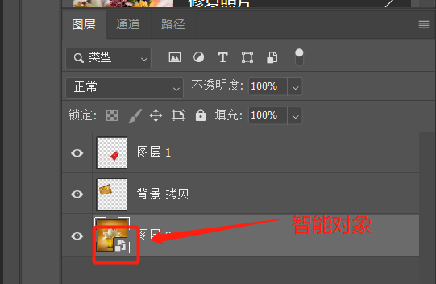

# PS2019

# 快捷键

* ALT+F:打开文件选项栏
* CTRL+O:打开文件选项,选择要处理的图片或PSD文件
* CTRL+D:取消选择
* CTRL+N:新建图层,可选多种像素,根据需求而定
* CTRL++,-/Z+鼠标左键:放大或缩小图层,效果同工具栏放大镜.按住空格键或使用H抓手工具左右移动
* Z:切换为工具栏放大镜模式
* H:切换为工具栏抓手默认
* SHIFT+当前工具快捷键:当左工具栏每个工具中有多种工具时,可使用此快捷键进行切换,也可以右键进行切换
* SHIFT+O:当选择截图工具时,可切换网格,黄金分割的方向
* CTRL+K:修改配置
  * 暂存盘:ps运行时的文件存放地点,不要放在系统盘,影响系统性能
* 画图像时可以使用翻转,翻转没有快捷键,需要设置:编辑->快捷键设置->图像->图像旋转->水平翻转画布->设置合适的快捷键
* 对于用套索选中的地方可以按ctrl+T对选中的区域进行规则的大小调整
* CTRL+J:将被矩形选框工具,套索工具等类似类型的工具选中的图块复制到一个新的图层中
  * 将被选中的图层使用CTRL+C,CTRL+V也可以将图层复制
  * 选中当前文件,直接在当前文件上新建一个同样的图层
* CTRL+SHIFT+N:打开新建图层窗口
* CTRL+E:合并选中的图层,不管图层是否可见
* CTRL+SHIFT+E:合并可见的图层,即图层工具栏中的眼不选
* ALT:
  * 当前若是选中背景中的某个图层时,可以移动并复制该图层.注意只能复制图层
* CTRL+Z:撤销,但并不是对所有的操作都可以撤销
* DELETE:删除上一步的操作,通常CTRL+Z不行就用DELETE试试
* R:选中图片,进行旋转
* []:缩小或放大所有画笔像素大小

# 菜单栏

* 窗口:可以打开右选项卡,如图层,铅笔等

# 左工具栏

* 右键点击任意工具栏,可以出现其他类型操作.若没有,表示只有该工具一种操作

  

## 右边的菜单栏快捷键

* 所有的菜单可以右键点击出现其他同类型菜单
* b:画笔
* e:橡皮檫
* L:套索,选定区域
* 选中画笔的时候按F5,可出现画笔选项
* R:旋转图层

# 左工具栏

## 移动工具

### 移动工具

* 右键点击移动可切换移动工具和画板工具

* 打开一张图片,可以看到右边选项卡的图层界面中已经横向显示了该图片,默认为背景,同时图片后有一个锁,表示该图片不能被移动.没有锁的可以直接移动,若有锁,可以如下操作

  

  * 直接移动该背景图片,会提示是否将该图片转换成正常图层,点击转换到正常图层,则该图片就可以移动
  * 点击选项卡中图层的图片后面的锁,此时该图片也将转换为正常图片
  * 点击选项卡中图层中的锁定,可以锁住该图

* 当同时打开多个图片时,可以使用移动工具选择一张图片,拖动到另外一张图片上,相当于添加图层

* 自动选择:当有多个图层时,移动指定图层时,右下角的图层工具栏会选中指定的图层

* 显示变换控件:一般不勾,主要是显示多个图层的边界,可对图层大小,角度进行修改

* 当有多个图层时,同时选中多个图层,可对选中图层进行对齐和分布操作

  

### 画板工具

* 主要对画布进行操作,大部分和移动工具功能差不多

## 矩形选框

* 有多种规则图形的选框可用,包括矩形,椭圆等,以矩形为例

* 在图层上用左键画出矩形选框,边框为虚线.放开左键即选中相应区域

* 左键选中该区域,按住不动可移动选中区域

* 左键点击选中区域外其他区域,可取消选中区域选框

* 按住SHIFT+左键可以建立正方形的选择区

  * 当椭圆选框工具时,建立一个圆形选择区

* 按住ALT+左键可以建立朝上方辐射的矩形选择区

* 同时按SHIFT+ALT+左键可以建立朝上方辐射的正方形选择区

* ALT+DELETE:为选中区域填充颜色,要在选了区域之后选颜色

* CTRL+DELETE:填充背景色

* 单行和单列选框工具看起来是一条直线,其实是选择了一条像素点

* 上方菜单栏中可以选择样式,正常情况下是以固定比例选择区,固定大小则是固定像素

  

* 羽化左边的4个可以对多个选区进行交集,并集等操作

* 消除锯齿一般是选择椭圆选择区时才会用,会使弯曲处更加平滑

* 羽化:相当于让选择区的边缘软化,模糊.需要先设置羽化的像素

  

## 套索

* 该组可以称为不规则选框

  

### 套索工具

* 用鼠标难度比较大,只能选择不需要太精细的图的边缘

### 多边形套索工具

* 可以对精细度较高的边缘进行选择,选取的点越多越精细,结合放大镜可以选择最精细的图

### 磁性套索工具

* 可以根据鼠标移动轨迹自动进行描点,还可以根据宽度等条件进行调节,适用于不规则的图形

  

  * 宽度:决定鼠标滑动多大的距离就进行一次描点,边缘比较清晰的图可以设置的高一些
  * 对比度:图形边缘模糊或者清晰,更清晰的可以设置的高些,模糊的可以设置低些
  * 频率:图层边缘上插入的点的多少

## 快速选择

### 快速选择工具

* 类似于套索工具,对相似的颜色点击之后进行区域选择,而不是根据点来圈图

* 自动增强是当选择区域时,自动选择边缘并进行优化,减少色斑和不平滑

  

* 默认是添加到选区,若是有添加多的部分,可以选择从选区减去,同时配合套索工具多选区进行适当的修剪

* 对所有图层取样是指当有多个图层时,快速选取是否对其他图层有效.若选中则会对其他图层有效,不选中则无效

* ALT:减选,默认是点那选那.SHIFT:加选

### 魔棒工具

* 和快速选取类似,但没有快速选取精确

  

* 容差:该值越小表示越类似的图片才会被选择,色差越小被选中的颜色越少,色差越大被选中的颜色越多

* 消除锯齿是为了让边缘更加平滑

* 连续是指只要颜色类似的都选中,只适用于色差比较大图层,否则容易选中不必要的区域

* CTRL+SHIFT+I:将选区反过来,是大写的i,不是L

## 裁剪

### 裁剪工具

* 对图片进行裁剪
* 选中图片拖动图片外层的框可以自定义裁剪图片大小,旋转图片
* 拉直:类似于旋转图片
* 网格:选择图片裁剪时显示的样式,默认是三等分,可以选择黄金比例等
* 内容识别:当将图片拉伸时,超出的地方默认填充背景色.若选中了内容识别,则会根据最近距离的色彩填充

### 透视裁剪工具

* 工具栏和裁剪相同
* 可以将图片中指定位置的图片校正.歪的变成正的,远看变近看

### 切片工具

### 切片选择工具

## 图框

## 吸管

### 吸管工具

* 主要就是吸取颜色在其他地方使用

## 污点修复画笔

## 画笔

* 选中画笔时,按F5,可出现更丰富的画笔选项,即画笔设置面板

* 按住SHIFT,可以画出一条直线

* 先点一个点,按住SHIFT,再点另外一个点,可以直接画出一条直线

* 在画笔状态下,按住ALT,可以直接吸取颜色,以便下次使用

* 画笔状态下右键有更丰富的选择

* 扁平度选择

  

### 画笔工具

### 铅笔工具

* 同画笔工具,只是显示的效果不同

### 颜色替代工具

* 将选定颜色绘制在现有颜色之上

### 混合器画笔工具

## 仿制图章

## 历史记录画笔

## 橡皮檫

## 渐变

### 渐变工具

* 主要是颜色渐变
* 可以应用到暗角,就是在图片四角使用黑色渐变色.使用菱形渐变或径向渐变,不透明度0,颜色为黑色

### 油漆桶工具

* 主要是颜色填充

### 3D材质拖放工具

## 模糊

## 减淡

## 钢笔

## 横排文字

## 路径选择

## 矩形

## 抓手

## 缩放

* 对图层进行缩放,快捷键Z
* 选中缩放之后,默认是放大模式,鼠标左键点击即可放大
* 按住ALT不放,同时点击鼠标左键即可缩小

# 顶部工具栏

## 编辑选项栏

### 自由变换

* 选中一个图层或一块区域进行自由变换,可以调整该区域的高宽,倾斜角度,扭曲等
* 快捷键:CTRL+T
* 右键还可以进行缩放,斜切,变形等操作.斜切,透视,扭曲等是透视的

#### 无限重复操作

* 先使用CTRL+J或CTRL+C,CTRL+V复制图层
* CTRL+T,选择最新的一层图层,进行旋转(也可以是其他操作),只需要旋转一点点,回车退出CTRL+T
* 一定要退出CTRL+T,在最新的图层上连续按CTRL+SHIFT+ALT+T,可以重复以上操作

#### 背景填充

* 随意打开一张图片,使用裁剪工具拉伸后,图片四周会出现透明空白区域
* 使用矩形选框工具选择图片的左右(或上下边缘),选中后CTRL+T
* 按住SHIFT,同时拉动选中区域的左边移动,这样就能将左边的背景填充到空白区域.其他方向一样操作

### 首选项

#### 性能

* 内存使用情况:修改PS可使用内存数

* 历史状态记录:修改每个文件操作的历史记录,默认记录50次,最大1000次

#### 暂存盘

* 修改临时文件地址,默认为C盘

## 图层选项栏

### 新建

#### 组

* 若有多个图层时,想对多个图层进行相同操作,可以新建一个组,将需要进行相同操作的图层放入其中
* 组可以嵌套
* 快捷键:CTRL+G

### 智能对象

#### 转换为智能对象

* 主要是为了保护图层的像素不受破坏.也可以在右下角的图层上右键点击修改
* 缩放不会修改该图层的像素大小
* 双击智能对象图层可以对图层进行修改,此时会复制当前图层,并转到新的操作窗口中.在新窗口中对图层操作也会反应到原窗口的图层中
* 选中多个图层,右键可以将其合并转换为智能图层(多个图层变成一个图层).转换后在当前操作窗口不能将其拆分,只能双击智能图层编辑,同样会弹出另外一个操作窗口,在新窗口可以对所有图层进行操作,保存之后的操作也会反应到原窗口图层

### 合并图层

* 将右下角图层工具栏中选中的图层进行合并,不管图层是否可见

### 合并可见图层

* 将右下角图层工具栏中选中的可见图层进行合并

### 拼合图层

* 将当前操作的文件中所有图层进行合并,不管是否选中,是否可见

## 滤镜

### 自适应广角

* 会新弹出一个窗口
* 约束工具:可以选择多个点,连成一块区域进行修正,最终连成的是直线,双击左键完成
* 多边形约束工具:可以选择多个点,从起点回到终点形成闭合.一般是一整个物体进行角度修正
* 修正完之后图层周边会出现空白,可以使用滤镜里的液化,将空白区域覆盖

## 窗口选项栏

### 排列

* 多个文件同时打开时,可选择排列方式,多以堆积,平铺方式打开
* 匹配缩放:根据所选图片的缩放程度对窗口内所有图片进行缩放
* 为XX新建窗口:为当前选中文件重新打开一个窗口,对任意一个文件的操作都会在另外一个文件上显示,主要是为了对修改进行更直观的比对

# 图层

* 打开一张图片时,默认就是底层图层,锁定状态,不可删除

* CTRL+J直接以当前图层为蓝本新建一个相同图层

* 右下角的图层工具栏点击新建图层可以新建一个透明图层

  

* 拖动上面的图层上下位置可以指定图层的上下层关系,下面的图层被上面的图层遮盖

* CTRL+SHIFT+N:打开新建图层窗口,默认新建的透明图层

* CTRL+E:合并选中的图层,不管是否可见

* CTRL+SHIFT+E:合并可见的图层,即将图层设置为不可见,合并其他可见的图层

* 拼合图层:将当前操作文件所有图层进行合并,不管图层是否可见,是否选中

# 历史记录

# 矩形选择框

## 选择并遮住

* 低版本又叫调整边缘,可以以矩形选择框的中心向外辐射半径选择,可选择不规则的图形
* 在用矩形选择指定区域后,按住快捷键`CTRL+ALT+R`或直接点击选择并遮住打开调整边缘,修改边缘检测的半径来选择比较精细的部分

# 污点修复画笔工具

## 污点修复画笔工具

* 快捷键J,可以将被选中区域去除,覆盖上附近区域的颜色,通常用来去除不需要的部分,通常可用于去除水印

## 修复画笔工具

* 类似于污点修复画笔工具,需要先使用ALT+左键选中需要取色的地方,松开之后再覆盖需要被第一步取色的区域即可

## 修补工具

* 类似于套索,先选中需要修补的区域,松开之后再次点击被选中的区域进行拖动,被选中的区域会被拖动目的地所在区域的颜色覆盖

# 去除水印

* 污点修复画笔工具:直接选择需要去除的地方,松开鼠标后自动去除
* 修复画笔工具:先用ALT+左键取色,松开快捷键之后,左键点击覆盖需要被覆盖颜色的区域即可
* 修补工具:先选中需要去除水印的区域,松开之后再次点击被选中的区域进行拖动,被选中的区域会被拖动目的地所在区域的颜色覆盖
