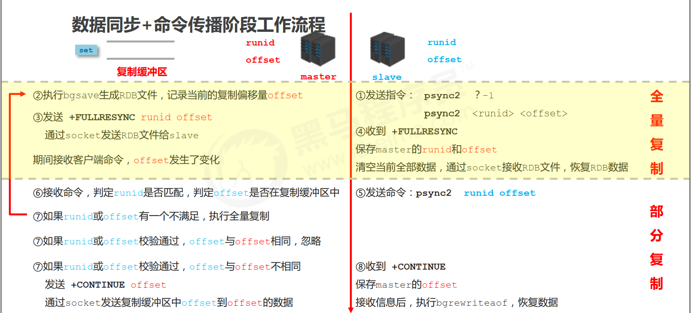

# RedisOps


# 安装


* 安装相关依赖:`yum install -y gcc-c++`
* 下载或上传redis压缩包到linux服务上,解压:`tar zxvf redis-5.0.14.tar.gz`
* 编译,设置安装路径为/app/software/redis下:`make install PREFIX=/app/software/redis`
* 修改配置文件:vi redis.conf,将daemonize修改成yes,守护进程启动
* 启动:`./redis-server redis.conf`
* `./redis-cli`:进入Redis自带客户端中


# 备份还原


## 备份


1. 写crontab定时调度脚本去做数据备份

2. 每小时都copy一份rdb的备份到一个目录中,仅仅保留3天的备份

   ```shell
   crontab -e
   0 * * * * sh /usr/local/redis/copy/redis_rdb_copy_hourly.sh
   vi redis_rdb_copy_hourly.sh
   #!/bin/sh 
   cur_date=`date +%Y%m%d%k`
   rm -rf /usr/local/redis/snapshotting/$cur_date
   mkdir /usr/local/redis/snapshotting/$cur_date
   cp /var/redis/6379/dump.rdb /usr/local/redis/snapshotting/$cur_date
   del_date=`date -d -48hour +%Y%m%d%k`
   rm -rf /usr/local/redis/snapshotting/$del_date
   ```

3. 每天都保留一份当天的rdb备份到一个目录中,保留1个月的备份

   ```shell
   crontab -e
   0 0 * * * sh /usr/local/redis/copy/redis_rdb_copy_daily.sh
   vi redis_rdb_copy_daily.sh
   #!/bin/sh 
   cur_date=`date +%Y%m%d`
   rm -rf /usr/local/redis/snapshotting/$cur_date
   mkdir /usr/local/redis/snapshotting/$cur_date
   cp /var/redis/6379/dump.rdb /usr/local/redis/snapshotting/$cur_date
   del_date=`date -d -1month +%Y%m%d`
   rm -rf /usr/local/redis/snapshotting/$del_date
   ```

5. 每天晚上定时将当前服务器上所有数据备份,发送一份到远程服务器上


## 还原


1. 若redis进程挂掉,那么重启redis进程即可,直接基于RDB或AOF日志文件恢复数据
2. 若redis进程所在机器挂掉,那么重启机器后,尝试重启redis,尝试基于AOF日志文件进行恢复,若AOF文件破损,那么用redis-check-aof fix
3. 若redis最新的AOF和RDB文件出现了丢失/损坏,可以尝试基于该机器上当前的某个最新的RDB数据副本进行数据恢复
   1. 当前最新的AOF和RDB文件都出现了丢失/损坏到无法恢复,找到RDB最新的一份备份,小时级的备份可以了,小时级的肯定是最新的,copy到redis里面去,就可以恢复到某一个小时的数据
   2. 由于appendonly已损坏,若复制了RDB文件之后就启动redis,会发现自动生成的appendonly是没有数据的,因为redis优先使用appendonly的数据,发现没有,会直接新建一个appendonly文件,同时rdb会基于内存生成一份新的快照,导致2个文件中都没有数据,所以**不可以直接启动redis**
   3. 先停止redis,删除appendonly.aof,暂时在配置中关闭aof,然后拷贝一份rdb过来,再重启redis,此时数据可恢复
   4. 确认数据恢复后,直接在redis的命令模式中热修改redis配置,开启aof:**config set appendonly yes**,此时redis就会将内存中的数据对应的日志,写入aof文件中
   5. 热修改配置参数时,配置文件中的实际参数并没有被修改,停止redis后修改配置文件,打开aof,重启redis
4. 如果当前机器上的所有RDB文件全部损坏,那么从远程的云服务上拉取最新的RDB快照回来恢复数据
5. 如果是发现有重大的数据错误,比如某个小时上线的程序一下子将数据全部污染了,数据全错了,那么可以选择某个更早的时间点,对数据进行恢复


## 瓶颈


1. redis不能支撑高并发的瓶颈是单机,一般单机的redis集合不太可能QPS超过10W
2. 读写分离,因为写比较少,但是消耗时间.读很多,也比较快


# 主从


> redis replication -> 主从架构 -> 读写分离 -> 水平扩容支撑读高并发





## 复制流程


* 开启主从复制,只需要在当作slave的redis配置文件中添加配置即可
  * replicaof:打开注释,只需要将master的ip和port填进去即可.5.0以前是slaveof
  * masterauth:若master开启了密码验证,此处需要填写master的登录密码
  * requirepass:连接当前redis需要的密码
  * auth pwd:当用redis-cli连接redis时,若开启了密码验证,则需要使用该命令,接上密码才能登录
  * replica-read-only:yes,默认开启了只读,该配置只有在打开了主从模式时才有效
  * 在同一台机器上开多个redis实例时,还需要修改以下配置
    * port
    * pidfile
    * logfile
    * dir
* 当启动一个slave的时候,它会发送一个PSYNC命令给master
  * 如果是slave第一次连接master,那么会触发一次全量复制(full resynchronization)
  * 如果是slave重新连接master,那么master仅仅会复制给slave部分缺少的数据

* 开始全量复制时,master会启动一个后台进程生成一份RDB快照,同时还会将从客户端收到的所有写命令缓存在内存中
* master如果发现有多个slave都来重连,仅仅会启动一个rdb bgsave操作,用一份数据服务所有slave
* RDB文件生成完之后,master会将这个RDB发送给slave,slave会先写入本地磁盘,然后再从本地磁盘加载到内存中,然后master会将内存中缓存的写命令发送给slave,slave也会同步这些数据
* slave在复制的时候,不会打断master的正常工作,也不会打断对自己的查询,它会用旧数据集来提供服务.但是复制完之后,需要删除旧数据集,加载新数据集,这个时候就会暂停对外服务
* 如果主从复制过程中,网络断开,会自动重连,slave可以接着上次复制的地方继续复制,而不是从头开始复制
  * redis会在内存中创建一个backlog,master和slave都会保存一个replica offset和master id,offset在backlog中
  * 如果master和slave连接断开,slave会让master从上次的replica offset开始继续复制,如果没有找到对应的offset,就会执行一次full resynchronization
* 采用异步方式复制数据到slave节点,同时slave会周期性地确认自己每次复制的数据量
* 无磁盘化复制:master在内存中直接创建rdb,通过内部的socket方式发送给slave,不会在本地磁盘落地
  * repl-diskless-sync:是否开启无磁盘化,默认是no,不开启
  * repl-diskless-sync-delay:等待一定时长再开始复制,因为要等更多slave重新连接过来
* 一个master可以配置多个slave,slave也可以连接其他slave
* slave主要用来进行横向扩容,做读写分离,扩容的slave可以提高读的吞吐量
* slave不会过期key,只会等待master过期key.如果master过期了一个key,或通过LRU淘汰了一个key,就会模拟一条del命令发送给slave
* master必须开启持久化,否则一旦发生故障,可能造成所有数据丢失


## 核心流程


* slave启动,只保存master的信息,包括host和ip,在slave的redis.conf里的replicaof配置,但是复制流程没开始
* slave内部有个定时任务,每秒检查是否有新的master要连接和复制,如果发现,就跟master建立socket连接
* slave发送ping命令给master
* 口令认证,如果master设置了requirepass,那么salve必须发送masterauth的口令过去进行认证
* master第一次执行全量复制,将所有数据发给slave
* master后续持续将写命令,异步复制增量数据给slave


## 数据同步


* 指第一次slave连接msater的时候,执行的全量复制
* offset:一个数字,描述复制缓冲区中的指令字节位置  
  * slave每秒都会上报自己的offset给master,同时master也会保存每个slave的offset
  * offset不仅用于全量复制,主要是master和slave都要知道各自的offset,才能知道主从数据是否一致
  * master offset:记录发送给所有slave的指令字节对应的位置,有多个
  * slave offset:记录slave接收master发送过来的指令字节对应的位置,只有一个
* backlog:主要是用来做全量复制中断时的增量复制
  * master有一个backlog,默认是1MB大小
  * master给slave复制数据时,也会将数据在backlog中同步写一份
* master run id
  * info server,可以看到master run id
  * 根据host+ip定位master是不靠谱的,如果master重启或者数据出现了变化,那么slave应该根据不同的run id区分,run id不同就做全量复制
  * 如果需要不更改run id重启redis,可以使用redis-cli debug reload命令
* psync
  * 从节点使用psync从master进行复制,psync runid offset
  * master会根据自身的情况返回响应信息,可能是FULLRESYNC runid offset触发全量复制,可能是CONTINUE触发增量复制


## 全量复制


* master执行bgsave,在本地生成一份rdb快照文件
* master将rdb快照文件发送给salve,如果rdb复制时间超过60秒(repl-timeout),那么slave就会认为复制失败,可以适当调节大这个参数
* 对于千兆网卡的机器,一般每秒传输100MB,6G文件,很可能超过60s
* master在生成rdb时,会将所有新的写命令缓存在内存中,在salve保存了rdb之后,再将新的写命令复制给salve
* `client-output-buffer-limit slave 256MB 64MB 60`,如果在复制期间,内存缓冲区持续消耗超过64M,或者一次性超过256M,那么停止复制,复制失败
* slave接收到rdb之后,清空自己的旧数据,然后重新加载rdb到自己的内存中,同时基于旧的数据版本对外提供服务,替换旧数据时暂停查询服务
* 如果slave开启了AOF,那么会立即执行BGREWRITEAOF,重写AOF
* rdb生成,rdb通过网络拷贝,slave旧数据的清理,slave aof rewrite,很耗费时间
* 如果复制的数据量在4G~6G之间,那么很可能全量复制时间消耗到1分半到2分钟


## 增量复制


* 如果全量复制过程中,master-slave网络连接断掉,那么salve重新连接master时,会触发增量复制
* master直接从自己的backlog中获取部分丢失的数据,发送给slave,默认backlog就是1MB
* msater就是根据slave发送的psync中的offset来从backlog中获取数据的


## 复制缓冲区


* 又名复制积压缓冲区,是一个先进先出(FIFO)的队列,用于存储服务器执行过的命令, 每次传播命令, master都会将传播的命令记录下来, 并存储在复制缓冲区
* 复制缓冲区默认数据存储空间大小是1M,由于存储空间大小是固定的,当入队元素的数量大于队列长度时,最先入队的元素会被弹出,而新元素会被放入队列
* 由来:每台服务器启动时,如果开启有AOF或被连接成为master节点, 即创建复制缓冲区
* 作用:用于保存master收到的所有指令(仅影响数据变更的指令,例如set)
* 数据来源:当master接收到主客户端的指令时,除了将指令执行,会将该指令存储到缓冲区中


## heartbeat


* 主从节点互相都会发送heartbeat信息
* master默认每隔10秒发送一次heartbeat,salve每隔1秒发送一个heartbeat


## 异步复制


* master每次接收到写命令之后,现在内部写入数据,然后异步发送给slave


## 相关命令


* info replication:查看复制节点的相关信息
* slaveof ip:port:将当前从Redis的主Redis地址切换成另外一个Redis地址,重新同步数据
* slaveof on one:使当前Redis停止和其他Redis的同步,同时将当前Redis转为master


## 复制问题


### 频繁的全量复制


* 伴随着系统的运行, master的数据量会越来越大,一旦master重启,runid将发生变化,会导致全部slave的全量复制操作
* 优化调整方案:
  * master内部创建master_replid变量,使用runid相同的策略生成,长度41位,并发送给所有slave
  * 在master关闭时执行命令 shutdown save,进行RDB持久化,将runid与offset保存到RDB文件中
    * repl-id repl-offset
    * 通过redis-check-rdb命令可以查看该信息
  * master重启后加载RDB文件,将RDB文件中保存的repl-id与repl-offset加载到内存中
    * master_repl_id = repl master_repl_offset = repl-offset
    * 通过info命令可以查看该信息
*  复制缓冲区过小,断网后slave的offset越界,触发全量复制
  * 修改复制缓冲区大小:repl-backlog-size
  * 建议设置如下:
    * 测算从master到slave的重连平均时长second
    * 获取master平均每秒产生写命令数据总量write_size_per_second
    * 最优复制缓冲区空间 = 2 * second * write_size_per_second


### 频繁的网络中断


* master的CPU占用过高或slave频繁断开连接
* 问题原因:
  * slave每1秒发送REPLCONF ACK命令到master
  * 当slave接到了慢查询时( keys * , hgetall等),会大量占用CPU性能
  * master每1秒调用复制定时函数replicationCron(),比对slave发现长时间没有进行响应
  * master发送ping指令频度较低
  * master设定超时时间较短
  * ping指令在网络中存在丢包
* 解决方案:
  * 通过设置理的超时时间,确认是否释放slave:repl-timeout.该参数定义了超时时间的阈值(默认60秒),超过该值,释放slave  
  * 提高ping指令发送的频度:repl-ping-slave-period.超时时间repl-time的时间至少是ping指令频度的5到10倍,否则slave很容易判定超时


### 数据不一致


* 优化主从间的网络环境,通常放置在同一个机房部署,如使用阿里云等云服务器时要注意此现象
* 监控主从节点延迟(通过offset)判断,如果slave延迟过大,暂时屏蔽程序对该slave的数据访问
* slave-serve-stale-data yes|no:开启后仅响应info, slaveof等少数命令.慎用,除非对数据一致性要求很高


# 集群(Cluster)


* 多个master节点,每个master节点又带多个slave节点.master节点根据算法来分担所有的数据
* 集群模式下不要做物理的读写分离


## 安装部署


* 安装依赖:`yum install -y gcc-c++ redis-3.3.5.gem ruby  rubygems`
* 下载解压Redis到/app/redis
* 进入Redis目录中进行编译:`make distclean && make`
* 安装redis集群:gem install redis
* 每个master节点应该部署至少2个slave节点,且2个slave节点不能部署在同一台机器上
* 修改配置文件redis.conf
  * 去掉密码
  * cluster-enabled:yes,开启集群模式,打开该配置的注释
  * cluster-config-file:设置当前redis集群的配置文件地址,默认是redis.conf同层的nodes-6379.conf,该文件由redis节点自动生成,非手动修改,只修改地址即可
  * cluster-node-timeout:集群通讯超时时间,默认是15000毫秒,单位是毫秒
  * cluster-migration-barrier <count>:master连接的slave最小数量
  * daemonize:yes,守护进程运行
  * pidfile:pid文件地址,默认为/var/run/redis_6379.pid,该文件是redis集群节点标志,自动生成
  * dir:数据目录,必须是一个目录,默认redis.conf同级目录
  * logfile:日志文件,非目录
  * bind:默认绑定127.0.0.1,根据需求可写多个访问地址,中间用空格隔开
  * appendonly:改为yes,开启AOF持久化功能
* 版本6以前需要安装redis-trib.rb,该脚本为启动redis集群的脚本
  * `redis-trib.rb add-node redisip1:port1  redisip2:port2`:添加集群的master节点
  * `redis-trib.rb check redisip1:port1`:检查集群状态,可以查看master,slave等节点的id
  * `redis-trib.rb reshard redisip1:port`:将redis集群的slot部分迁移到redisip1上,redis总共有16384个slot,可以平均分布到每个master上
  * `redis-trib.rb add-node --slave --master-id master的id  slaveip1:port1 slaveip2:port2`:添加slave节点
  * 节点删除
    * `redis-trib.rb reshard 需要删除的节点ip:port --> 其他master节点`:清空节点上的slot
    * `redis-trib.rb del-node 需要删除的节点ip:port 需要删除的节点id`:删除节点
    * 当清空了某个master上的slot时,cluster会自动将该master的slave挂载到其他master上
* 启动集群:`redis-trib.rb create --replicas 1 ip1:port1 ip2:port2.....`
  * `--replicas num`:每个master有num个slave
* 版本6以后,直接使用redis-cli即可安装集群
  * `redis-cli --cluster create --cluster-replicas 1 ip1:port1 ip2:port2...`:创建并启动集群,ip需要真实ip,不能使用127和localhost,且单个redis已经启动
    * `--cluster-replicas num`:每个master有num个slave

* 集群启动之后在,若是在某个master上做写入操作时,根据CRC16算法,若是得到的slot值在当前master,就会直接写入,若是在其他master上,则会报错moved error,使用JAVA API操作不会有这个问题
* 在cluster上读取数据时,需要先readonly,否则报错,每次读取都要readonly,最好是redis-cli -c启动
* cluster模式下,不要手动做读写分离,cluster默认的读写都是在master上
* cluster扩容:先用redis-trib.rb的add-node命令添加新的redis节点,之后用reshard命令将部分slot迁移到新的节点上,添加slave节点同样,但是不需要reshard slot
* 查看`redis:./redis01/redis-cli -h 127.0.0.1 -p 6381 -c`,c必须要加.若是在其中增加了key,会随机存到redis中,而不是一定会存到当前测试的redis中
* 关闭redis,./redis-cli shutdown
* 若是修改了配置文件中的端口,则需要先删除各个集群中的.rdb,nodes.conf,.aof文件,否则启动集群报错
* `cluster-require-full-coverage`:如果某段slot的主从都挂了,如果该值为yes,整个集群挂掉;如果为false,只有该段slot不可用,集群仍可用


## 相关命令


* cluster info:获取集群的信息
* cluster slots:查看集群信息
* cluster nodes:获取集群当前已知的所有节点,以及这些节点的相关信息
* cluster meet ip port:将ip和port所指定的节点添加到集群中
* cluster forget <node_id>:将指定node_id的节点从集群中移除
* cluster replicate <node_id>:将当前节点设置为node_id节点的从节点
* cluster saveconfig:将节点的配置文件保存到硬盘中
* cluster addslots <slot>...:将一个或多个槽分配给当前节点
* cluster delslots <slot>...:从当前节点移除一个或多个槽
* cluster flushslots:移除分配给当前节点的所有槽
* cluster setslot <slot> node <node_id>:将slot槽分配给node_id指定的节点,如果槽已经分配给另外一个节点,那么先让另外一个节点删除该槽,然后再进行安装
* cluster setslot <slot> migrating <node_id>:将本节点的槽迁移到指定节点中
* cluster setslot <slot> importing <node_id>:从指定节点导入槽到本节点
* cluster setslot <slot> stable:取消对槽的导入或迁移
* cluster keyslot key:计算键key应该被放置在那个槽
* cluster countkeysinslot <slot>:返回槽目前包含的键值对数量
* cluster getkeysinslot <slot> count:返回count个槽中的键


## 核心原理


1. redis cluster之间采用gossip协议进行通信,即不是将所有的集群元数据(故障,节点信息等)存储在某一个单独的节点上,而是每个master上都会存在.当某个master上的数据发生变更时,会和其他master进行通讯,相互之间传递最新的元数据,保持整个集群所有节点的数据完整性

2. goosip协议包含多种信息:ping,pong,meet,fail等
   1. meet:某个节点发送meet给新加入节点,让新节点加入到集群中,然后新节点就开始和其他节点进行通讯

   2. ping:每个节点都会频繁的给其他节点发送ping信息,其中包括自己的状态和其他需要维护的信息,和其他节点互相交换信息

   3. pong:当接收到其他节点的ping信息时,返回自己的ping和meet信息

   4. fail:某个节点判断另外一个节点fail之后,就会通知其他节点

3. 10000以上的端口进行相互通讯,通常是16379,每隔一段时间发送ping消息,保证节点的正常运行

4. 如果一个节点认为另外一个节点宕机,那么就是pfail,主观宕机

5. 若超过半数节点认为另外一个节点宕机,那么就是fail,客观宕机,跟哨兵的原理一样,sdown,odown

6. 在cluster-node-timeout内,某个节点没有返回pong,就认为是pfail.之后会在goosip的ping消息中,ping给其他节点,其他节点超半数认为该节点宕机,就会编程fail

7. slave节点根据从master复制数据的offset来设置选举权重,offset越大,权重越大,超过半数的节点投票给某节点时,该节点就自动成为master

8. cluster和sentinel非常类似,若对缓存的要求更高,数据量更大,则用cluster更好

9. cluster会自动将数据进行分片,每个master上放一部分数据

10. cluster会自动进行读写分离,自动进行主备切换,支持多个master的slot分布式存储


## hash slot


* cluster有固定的16384个hash slot,对每个key计算CRC16值,然后对16384取模,可以获取key对应的hash slot
* cluster中每个master都会持有部分slot,比如有3个master,那么可能每个master持有5000多个slot
* slot让node的增加和移除很简单,增加一个master,就将其他master的slot移动部分过去,减少一个master,就将它的slot移动到其他master上去
* 移动slot的成本是非常低的
* 客户端的api,可以对指定的数据,让他们走同一个slot,通过hash tag来实现
* 如果键名中包含{},则用来进行分片计算的有效值是{}中的值.若果没有,则取整个键名


## 移动已分配的Slot


* 假设要迁移123号Slot,从A到B
* 在B上执行`cluster setslot 123 importing A`
* 在A上执行`cluster setslot 123 migrating B`
* 在A上执行`cluster getkeysinslog 123`,获得要返回的数量
* 对上一步获取的每个键执行migrate命令,将其从A迁移到B
* 在集群中每个服务器上执行`cluster setslot 123 node B`


## 集群缺点


* 不支持批量操作的命令,如mget等.因为数据可能在不同的分片节点上,批量操作只能对单个分片有效
* 分片的粒度是键,所以键对应的值不要太大
* 数据备份比较麻烦,节点越大越麻烦.同时恢复起来也很麻烦
* 扩容的处理比较麻烦
* 数据不保证强一致性


# 哨兵(Sentinel)


## 主要功能


1. 集群监控,负责监控master和slave进程是否正常工作
2. 消息通知,如果某个redis实例有故障,那么哨兵负责发送消息作为报警通知给管理员
3. 故障转移,如果master挂掉了,会自动转移到slave上
4. 配置中心,如果故障转移发生了,通知client客户端新的master地址
5. 哨兵本身也是分布式的,作为一个哨兵集群去运行,互相协同工作
6. 故障转移时,判断一个master是否宕机,需要超过半数的哨兵都同意才行,涉及到了分布式选举的问题
7. 即使部分哨兵节点挂掉了,哨兵集群还是能正常工作


## 核心原理


1. 哨兵至少需要3个实例,来保证自己的健壮性,以便进行master故障时的选举.如果仅仅部署了2个哨兵实例,quorum=1,当master宕机时,哨兵(S1)哨兵(S2)只要有1个哨兵认为master宕机就可以切换,同时S1和S2中会选举一个哨兵进行故障转移,而选举需要哨兵中过半数的实例(majority)运行.如果是部署2个哨兵,一台哨兵刚好在master那台机器上,而master那台机器整体瘫痪了,那么就没有足够的实例来同意选举进行故障转移.所以至少要3个哨兵,而且不能部署在同一台机器
2. 哨兵+redis主从的部署架构,是不会保证数据零丢失的,只能保证redis集群的高可用性
3. 哨兵+redis主从这种复杂的部署架构,需要在测试环境和生产环境,都进行充足的测试和演练
4. master故障的时候,因为选举的问题,可能会在极短时间内redis集群无法提供缓存服务
5. sentinel之间是通过redis的pub/sub系统实现的,每个sentinel会往__sentinel\_\_:hello这个channel里发送一个消息,其他sentinel都可以消费这个消息,并感知其他sentinel的存在
6. 每隔两秒钟,每个sentinel都会往自己监控的某个master+slaves对应的\_\_sentinel\_\_:hello channel里发送一个消息,内容是自己的host,ip和runid还有对这个master的监控配置
7. 每个sentinel也会去监听自己监控的每个master+slaves对应的\_\_sentinel\_\_:hello channel,然后去感知到同样在监听这个master+slaves的其他哨兵的存在
8. 每个哨兵还会跟其他哨兵交换对master的监控配置,互相进行监控配置的同步
9. 哨兵会负责自动纠正slave的一些配置,比如slave如果要成为潜在的master候选人,哨兵会确保slave在复制现有master的数据;如果slave连接到了一个错误的master上,比如故障转移之后,那么哨兵会确保它们连接到正确的master上


### 监控阶段


* 用于同步各个节点的状态信息,获取各个sentinel的状态(是否在线)
* 获取master的状态,master属性.如runid,role
* 获取各个slave的详细信息
* 获取所有slave的状态,slave属性.如runid,role,master_host,master_port,offset


### 通知阶段


* 哨兵向其他哨兵,master,slave发送消息,确认各个redis的状态


### 故障转移


* 服务器列表中挑选备选master
  * 在线的
  * 响应慢的
  * 与原master断开时间久的
  * 优先原则
    * 优先级
    * offset
    * runid
* 发送指令(sentinel)
  * 向新的master发送slaveof no one
  * 向其他slave发送slaveof 新masterIP端口


## 选举


* 跟master断开连接的时长:如果一个slave跟master断开连接已经超过了down-after-milliseconds的10倍,外加master宕机的时长,那么slave就被认为不适合选举为master:`(down-after-milliseconds*10)+milliseconds_since_master_is_in_SDOWN_state`

* slave优先级:按照slave优先级进行排序,slave priority越小,优先级就越高

* 复制offset:如果slave priority相同,那么看replica offset,哪个slave复制了越多的数据,offset越靠后,优先级就越高

* runid:如果上面两个条件都相同,那么选择一个run id比较小的那个slave


## sdown,odown


1. sdown和odown是2种状态,sdown是主观宕机,即一个sentinel认为master宕机了,就是主观宕机
2. odown是客观宕机,当sentinel中超过半数上认为某个master宕机了,就是客观宕机
3. 当一个哨兵ping另外一个master,超过 了is-master-down-after-milliseconds的值,就认为master主观宕机
4. 当一个sentinel判断了一个master主观宕机后,会通知其他sentinel判断该master是否宕机,若超过半数认为该master宕机,那么sdown就转换为odown


## quorum和majority


1. quorum:至少多少哨兵同意时,才能确认master,或者slave进程挂掉了,或者要启动一个故障转移操作

2. quorum是用来识别故障的,真正执行故障转移的时候,还是要在哨兵集群执行选举

   1. 若有5个哨兵,quorum设置了2,那么5个哨兵中的2个都认为master挂掉了,那master就是odown了

3. 每次一个哨兵要做主备切换,首先需要quorum数量的哨兵认为odown,然后选举出一个哨兵来做切换,这个哨兵还得得到majority哨兵的授权,才能正式执行切换

4. 如果quorum < majority,比如5个哨兵,majority就是3,quorum设置为2,那么就3个哨兵授权就可以执行切换

   但是如果quorum >= majority,那么必须quorum数量的哨兵都授权,比如5个哨兵,quorum是5,那么必须5个哨兵都同意授权,才能执行切换


## 数据丢失


* 主备切换的时候,可能会导致数据丢失,因为主从的数据复制是异步的,部分master的数据还没复制到slave
* 脑裂导致的数据丢失:当master因为网络问题,无法和slave正常通讯,但是和client仍然可以正常通讯,此时sentinel会重新选举一个slave作为master,但是client仍然往旧的master中写数据,此时集群里就会有2个master.当旧的master和其他slave之间的通讯恢复时,旧的master会被作为slave挂载到新的master上,而旧master上的数据会被清空,重新从新的master上复制数据
* 解决脑裂和数据丢失问题:
  * min-slaves-to-write 1:最少要一个slave
  * min-slaves-max-lag 10:数据和同步的延迟不能超过10s,即master和slave之间的数据差异不能超过10s
* 一旦slave复制数据和ack延迟太大,就认为可能master宕机后损失的数据太多,那么就拒绝写请求,此时即使出现了脑裂问题,但是由于拒绝了客户端的些请求,旧master和新master的数据仍然是同步的


## 配置sentinel


* 配置文件在redis安装目录下的sentinel.conf,端口默认是26379,只能本地访问
* `sentinel monitor mymaster 127.0.0.1 6379 2`:mymaster自定义,指定监听的master-slave的名称,后面紧接的是master的ip和端口,最后一个参数是quorum,自定义
* `sentinel down-after-milliseconds mymaster 60000`:超过多少毫秒跟一个redis实例断了连接,哨兵就可能认为这个redis实例挂了
* `sentinel failover-timeout mymaster 180000`:执行故障转移的timeout超时时长
* `sentinel parallel-syncs mymaster 1`:新的master切换之后,同时有多少个slave被切换到去连接新master,重新做同步,数字越低,花费的时间越多.挂载完一批之后再挂载余下的,直到挂载完
* 启动哨兵:
* sentinel相关操作
  * ./src/redis-sentinel:启动sentinel
  * sentinel master mymaster:检查master状态
  * sentinel slaves mymaster:检查slave状态
  * sentinel sentinels mymaster:检查sentinel状态
  * sentinel get-master-addr-by-name mymaster:获得master信息
  * 增加sentinel,会自动发现,只要配置好配置文件,启动sentinel即可
  * 删除哨兵:
    * 停止sentinal进程
    * SENTINEL RESET *,在所有sentinal上执行,清理所有的master状态
    * SENTINEL MASTER mastername,在所有sentinal上执行,查看所有sentinal对数量是否达成了一致


## 相关命令


1. redis-sentinel sentinel.conf:启动哨兵
2. sentinel auth-pass <服务器名称> <password>:连接服务器口令
3. sentinel monitor <自定义服务名称> <主机地址> <端口> <主从服务器总量>:设置哨兵监听的主服务器信息,最后的参数决定了最终参与选举的服务器 数量(-1).如`sentinel monitor mymaster 192.168.194.131 6381 1`
4. sentinel down-after-milliseconds <服务名称> <毫秒数>:指定哨兵在监控Redis服务时,判定服务器挂掉的时间周期,默认30秒(30000),也是主从切换的启动条件之一.如`sentinel down-after milliseconds mymaster 3000`
5. sentinel parallel-syncs <服务名称> <服务器数>:指定同时进行主从的slave数量,数值越大,要求网络资源越高,要求约 小,同步时间约长.如`sentinel parallel-syncs mymaster 1`
6. sentinel failover-timeout <服务名称><毫秒数（整数） >:指定出现故障后,故障切换的最大超时时间,超过该值,认定切换失败,默认3分钟.如`sentinel failover-timeout mymaster 9000`
7. sentinel notification-script <服务名称> <脚本路径>:服务器无法正常联通时,设定的执行脚本,通常调试使用


# 压测


* redis自己提供的redis-benchmark压测工具,在redis/src下
* ./redis-benchmark -h localhost -c 10000  -n 10000000  -d 50
  * -h:服务器ip或hostname
  * -p:服务器端口
  * -c:连接数,默认50
  * -n: 请求数,默认100000
  * -d:set/get时的key/value字节数,默认2个字节
  * --csv:以csv格式输出
* 影响QPS的因素:复杂操作,lrange,value很大


# 性能监控


## 监控指标


* 性能指标:Performance
  * latency:redis响应一个请求的时间
  * instantaneous_ops_per_sec:平均每秒处理请求总数
  * hit rate(calculated):缓存命中率
* 内存指标: Memory
  * used_memory:已使用内存
  * mem_fragmentation_ratio:内存碎片率
  * evicted_keys:由于最大内存限制被移除的key的数量
  * blocked_clients:由于BLPOP,BRPOP,BRPOPLPPUSH而被阻塞的客户端
* 基本活动指标: Basic activity
  * connected_cliens:客户端连接数
  * connected_slaves:Slave数量
  * master_last_io_seconds_ago:最近一次主从交互之后的秒数
  * keyspace:数据库中的key值总数
* 持久性指标: Persistence
  * rdb_last_save_time:最后一次持久化保存到磁盘的时间戳
  * rdb_changes_since_last_save:自最后一次持久化以来数据库的更改数

* 错误指标: Error
  * rejected_connections:由于达到maxclient限制而被拒绝的连接数
  * keyspace_misses:key值查找失败次数
  * mater_link_down_since_seconds:主从断开的持续时间,以秒为单位


## 监控方式


### 工具


* Cloud Insigh Redis
* Prometheus
* Redis-stat
* Redis-faina
* RedisLive
* zabbix


### 命令


* info []:查看 Redis 服务器的各种信息和统计数值
  * all:所有服务器信息
  * default:默认值,最常见也最重要的一些服务器信息
  * server:服务器本身的信息.比如版本号, 监听端口号,服务器 ID 等等
  * clients:已连接客户端的信息.比如已连接客户端的数量,正在被阻塞的客 户端数量等等
  * memoery:内存信息.比如内存占用数量,使用的内存分配器等等
  * persistence:和RDB以及AOF持久化有关的信息.比如RDB是否正在进行,AOF重写是否正在进行等
  * stats:服务器的统计信息.比如已处理的命令请求数量,每秒钟处理的命令请求数量等等
  * replication:和主从复制有关的信息.比如服务器的角色,主从服务器的连接状态是否正常等等
  * cpu:服务器的系统 CPU 占用量和用户 CPU 占用量
  * commandstats:命令执行的统计信息.比如命令执行的次数,命令耗费的 CPU 时间,执行每个命令耗费的平均 CPU 时间等等
  * cluster:集群功能的相关信息
  * keyspace:和数据库键空间有关的信息.比如数据库的键数量,数据库已经被删除的过期键数量等等
* slowlog get:获取慢日志,可以通过配置文件的slowlog-log-slower-than来设置时间限制,默认是10000微秒,slowlog-max-len来限制记录条数.返回的记录包含四个部分
  * 日志的id
  * 该命令执行的unix时间
  * 该命令消耗的时间,单位微秒
  * 命令和参数
* slowlog len:查看目前已有的慢查询日志数量
* slowlog reset:删除所有慢查询日志
* monitor:监控Redis执行的所有命令,这个命令比较耗性能,仅用在开发调试阶段.格式为`时间戳 [数据库号码 IP地址和端口号] 被执行的命令`
* redis-benchmark []:默认情况检测50个连接,10000次请求对应的性能
  * -h:指定服务器主机名,默认127.0.0.1
  * -p:指定服务器端口,默认6379
  * -s:指定服务器socket
  * -c:指定并发连接数,默认50
  * -n:指定请求数,默认10000
  * -d:以字节的形式指定set/get值的数据大小
  * -k:1=keep alive,0=reconnet
  * -r:set/get/incr使用随机key,sadd使用随机值
  * -P:通过管道传输指定数量的请求
  * -q:强制退出reids,仅显示query/sec值
  * --csv:以csv格式输出
  * -l:生成循环,永久执行测试
  * -t:仅运行以逗号分隔的测试命令列表
  * -I:Idle模式,仅打开N个idle连接并等待
* monitor:打印服务器调试信息


# Docker中使用


* -p localport:dockerport:将docker中的端口映射到本地端口
* --restart=always:总是随着docker的启动而启动
* --requirepass:使用密码进入redis-cli
* -v /localdir:/dockerdir:将docker中的目录映射到本地的目录中
* --name:容器的名称,自定义
* `redis[:6.2.5]`:镜像的名称:镜像版本,若不是最新版本的redis,需要加上版本号,如redis:6.2.5
* redis-server:启动命令
* --appendonly:开启AOF

```shell
#docker启动redis
docker run -d -p 6379:6379 --restart=always \
--requirepass '123456' \
-v /app/redis/conf/redis.conf:/etc/redis/redis.conf \
-v  /app/redis/data:/data \
 --name redis-01 redis:6.2.5 \
 redis-server /etc/redis/redis.conf --appendonly yes
```


# 自启动


* 在redis目录里的utils目录下有个redis_init_script脚本,将该脚本拷贝到/etc/init.d中,并改名,将后缀改为redis的端口号:cp redis_init_script /etc/init.d/redis_6379
* REDISPORT:redis_6379中的变量指定redis运行时的端口号,默认为6379
* EXEC:redis-server的地址,需要指向redis-server所在的目录
* CLIEXEC:redis-cli的地址,需要指向redis-cli所在目录
* PIDFILE:pidfile地址,需要和redis安装目录中的redis.conf中的pidfile地址相同,可不修改,默认都为/var/run/redis_${REDISPORT}.pid
* CONF:redis安装目录中的redis.conf的地址,实际上是redis运行时的具体配置文件地址
* 在redis_6379最上面添加# chkconfig:2345 90 10,另起一行chkconfig  redis_6379 on


# 内置管理工具


## redis-benchmark


* 性能测试工具,测试Redis在系统及配置下的读写性能
* Redis5之后该命令支持集群模式,通过多线程的方式对多个分片进行压测


## redis-check-aof


* 用于修复出问题的AOF文件


## redis-check-dump


* 用于修复出问题的dump.rdb文件


## redis-cli


* 在redis安装目录的src下,执行./redis-cli,可进入redis控制台
* redis-cli -h ip -p port:连接指定ip地址的redis控制台


## redis-sentinel


* Redis集群的管理工具


# 第三方管理工具


## CacheCloud


* 一个管理Redis主从,哨兵,集群的平台
