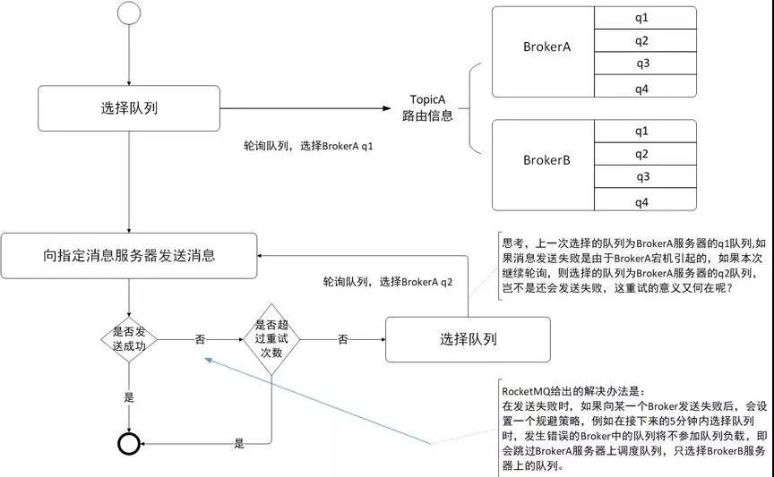
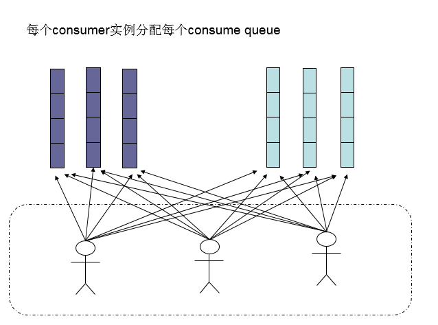
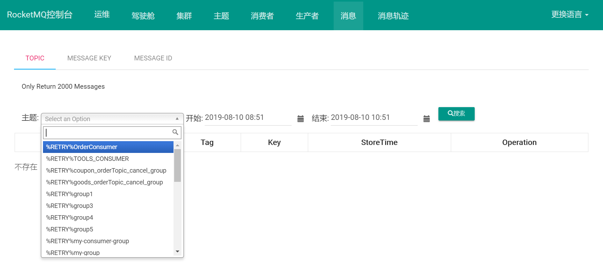

# RocketMQ


# 概述


## Producer


* 生产者.会和NameServer集群中的随机一台建立长连接,获取当前要发送的Topic存在哪台Broker Master上,然后再与其建立长连接,支持多种负载均衡


## Producer Group


* 生产者组,是一类Producer的集合,这类Producer通常发送一类消息,且发送逻辑一致

  

## Consumer


* 消费者.同Producer,只不过会同时获取Slave的地址


## Consumer Group


* 同Producer Group,只能消费相同的Topic,且同时只能消费一个Topic


## Broker


* 类似于服务器,队列存储在Broker中,负责消息的存储,查询消费
* 一个Master可对应多个Slave,Master支持读写,Slave只负责读
* Broker会向集群中的每一台NameServer注册自己的路由信息
* Broker Server的功能模块如上图:
  * Remoting Module:整个Broker的实体,负责处理来自clients端的请求.而这个Broker实体则由以下模 块构成
  * Client Manager:客户端管理器.负责接收,解析客户端(Producer/Consumer)请求,管理客户端.例如,维护Consumer的Topic订阅信息
  * Store Service:存储服务.提供方便简单的API接口,处理消息存储到物理硬盘和消息查询功能
  * HA Service:高可用服务,提供Master Broker 和 Slave Broker之间的数据同步功能
  * Index Service:索引服务,根据特定的Message key,对投递到Broker的消息进行索引服务,同时也提 供根据Message Key对消息进行快速查询的功能


## NameServer


* 一个很简单的Topic路由注册中心,支持Broker的动态注册和发现,保存Topic和Broker之间的关系
* 集群中的NameServer不会进行相互通讯,各NameServer都有完整的路由信息
* 客户端连接NameServer时,会先产生一个随机数,然后再与NameServer节点数量取模,进行连接.如果失败,再使用轮询算法


## Topic


* 主题.不同类型的消息以不同的Topic区分,相当于消息的一级分类类
* 一个发送者可以发送消息给一个或多个Topic,一个消费者可以接收一个或多个Topic
* 手动创建Topic时,有2种模式:
  * 集群模式:该模式下的Topic在集群中,所有Broker中的Queue数量是相同的
  * Broker模式:该模式下的每个Broker中的Queue数量可以不同
  * 自动创建时,默认是Broker模式,会为每个Broker默认创建4个Queue


## Message Queue


* 相当于Topic的分区,用于并行发送和接收消息


# 核心流程


* 先启动NameServer集群,各NameServer之间无任何数据交互,等待Broker,Producer,Consumer连接
* Broker启动后会向所有NameServer定期(30s)发送心跳包,包括IP,Port,TopicInfo.NameServer会定期(10S)扫描Broker存活列表,如果超过120S没有心跳则移除此Broker
* Producer上线和NameServer中某一台建立长连接,并从中获取要发送的消息在那个Topic的Queue上以及Broker地址.之后根据算法选择一个Queue,与Queue所在的Broker建立长连接并向该Broker发消息.在获取到路信息后,Producer会首先将路由信息缓存到本地,再每30S从NameServer更新一次路由信息
* Consumer上线同Producer,但是会定时向Broker发心跳,确保Broker存活


# 消息的存储和发送


## 消息存储


* RocketMQ消息存储是由ConsumeQueue和CommitLog共同完成,CommitLog是真正存储数据的文件,ConsumeQueue是索引文件
* Broker根据queueId,获取到该消息对应索引条目要在consumequeue目录中的写入偏移量,即 QueueOffset
* 将queueId、queueOffset等数据,与消息一起封装为消息单元
* 将消息单元写入到commitlog,同时,形成消息索引条目
* 将消息索引条目分发到相应的consumequeue


## 消息发送


* Linux操作系统分为用户态和内核态,文件操作、网络操作需要涉及这两种形态的切换,免不了进行数据复制
* 一台服务器 把本机磁盘文件的内容发送到客户端,一般分为两个步骤:
* read: 读取本地文件内容
* write: 将读取的内容通过网络发送出去
* 这两个看似简单的操作,实际进行了4次数据复制,分别是:
  * 从磁盘复制数据到内核态内存
  * 从内核态内存复制到用户态内存
  * 然后从用户态内存复制到网络驱动的内核态内存
  * 最后是从网络驱动的内核态内存复制到网卡中进行传输


* 通过使用mmap的方式,可以省去向用户态的内存复制,提高速度.这种机制在Java中是通过MappedByteBuffer实现.但是采用MappedByteBuffer这种内存映射的方式有几个限制,其中之一是一次只能映射1.5~2G 的文件至用户态的虚拟内存,这也是为何RocketMQ默认设置单个CommitLog日志数据文件为1G的原因
* RocketMQ充分利用了上述特性,也就是所谓的零拷贝技术,提高消息存盘和网络发送的速度
* RocketMQ中每个消息拥有唯一的MessageId,且可以携带具有业务标识的Key,以方便对消息的查询.不过MessageId有两个:在生产者send()消息时会自动生成一个MessageId(msgId),当消息到达Broker后,Broker也会自动生成一个MessageId(offsetMsgId).msgId,offsetMsgId与key都称为消息标识
  * msgId:由producer端生成,其生成规则为:producerIp + 进程pid + MessageClientIDSetter类的ClassLoader的hashCode + 当前时间 + AutomicInteger自增计数器
  * offsetMsgId:由broker端生成,其生成规则为:brokerIp+物理分区的offset(Queue中的偏移量)
  * key:由用户指定的业务相关的唯一标识
* consumequeue中的数据是顺序存放的,还引入了PageCache的预读取机制,使得对consumequeue文件的读取几乎接近于内存读取
* PageCache机制,页缓存机制,是OS对文件的缓存机制,用于加速对文件的读写操作.一般来 说,程序对文件进行顺序读写的速度几乎接近于内存读写速度,主要原因是由于OS使用 PageCache机制对读写访问操作进行性能优化,将一部分的内存用作PageCache
  * 写操作:OS会先将数据写入到PageCache中,随后会以异步方式由pdflush(page dirty flush)内核线程将Cache中的数据刷盘到物理磁盘
  * 读操作:若用户要读取数据,其首先会从PageCache中读取,若没有命中,则OS在从物理磁盘上加载该数据到PageCache的同时,也会顺序对其相邻数据块中的数据进行预读取


* RocketMQ中可能会影响性能的是对commitlog文件的读取.因为对commitlog文件来说,读取消息时会产生大量的随机访问,而随机访问会严重影响性能.不过,如果选择合适的系统IO调度算法,比如设置调度算法为Deadline(采用SSD固态硬盘的话),随机读的性能也会有所提升


## 消息拉取


* Push模式:Broker向消费者主动推送消息.实际上底层仍然是pull模式.Consumer把轮询过程封装并注册到MessageListener监听器,取到消息后,唤醒MessageListener的`consumeMessage()`来消费
* Pull模式:消费者向Broker定时拉取消息.取消息的过程需要用户实现.先通过打算消费的Topic拿到MessageQueue的集合,遍历该集合,然后针对每个MessageQueue批量取消息,一次取完后,记录该队列下一次要取的开始offset,直到取完,再换另一个MessageQueue
* 长轮询:为保持消息的实时性,Consumer和Broker之间建立了长轮询.如果Broker没有消息更新,则将连接挂起,直到Broker推送新的数据.客户端像传统轮询一样从Broker请求数据,Broker会阻塞请求不会立刻返回,直到有数据或超时才返回给Consumer,然后关闭连接,Consumer处理完响应信息后再想Broker发送新的请求
* 消费者组默认使用pull模式消费消息,可在程序中改变模式

* Consumer获取到其要消费消息所在Queue的消费偏移量offset,计算出其要消费消息的offset
  * Consumer对某个Queue的消费offset,即消费到了该Queue的第几条消息
* Consumer向Broker发送拉取请求,其中会包含其要拉取消息的Queue、消息offset及消息Tag
* Broker计算在该consumequeue中的queueOffset
* 从该queueOffset处开始向后查找第一个指定Tag的索引条目
* 解析该索引条目的前8个字节,即可定位到该消息在commitlog中的commitlog offset
* 从对应commitlog offset中读取消息单元,并发送给Consumer


## 消息存储结构


* RocketMQ消息的存储是由ConsumeQueue和CommitLog配合完成的
* CommitLog: 存储消息的元数据,消息真正的物理存储文件
* ConsumerQueue: 消息的逻辑队列,类似数据库的索引文件,存储的是指向物理存储的地址.每 个Topic下的每个Message Queue都有一个对应的ConsumeQueue文件
* IndexFile: 为了消息查询提供了一种通过key或时间区间来查询消息的方法,这种通过IndexFile来查找消息的方法不影响发送与消费消息的主流程


## commitlog


* 在很多资料中commitlog目录中的文件简单就称为commitlog文件,但在源码中,该文件被命名为mappedFile
* commitlog目录中存放着很多的mappedFile文件,当前Broker中的所有消息都是落盘到这些 mappedFile文件中
* mappedFile文件大小不超过1G,文件名由20位十进制数构成,表示当前文件的第一条消息的起始位移偏移量,第一个文件名一定是20位0构成的
* 当前一个文件放满时,则会自动生成下一个文件继续存放消息.第n个文件名应该是前n-1个文件大小之和
* 一个Broker中所有mappedFile文件的commitlog offset是连续的,一个Broker中仅包含一个commitlog目录,所有的mappedFile文件都是存放在该目录中 的
* 无论当前Broker中存放着多少Topic的消息,这些消息都是被顺序写入到了mappedFile文件中的.即这些消息在Broker中存放时并没有被按照Topic进行分类存放
* mappedFile文件内容由一个个的消息单元构成,每个消息单元中包含:消息总长度MsgLen,消息的物理位置physicalOffset,消息体内容Body,消息体长度BodyLength,消息主题Topic,Topic长度TopicLength,消息生产者BornHost,消息发送时间戳BornTimestamp,消息所在的队列QueueId,消息在Queue中存储的偏移量QueueOffset等近20余项消息相关属性


## consumequeue


* 为了提高效率,会为每个Topic在~/store/consumequeue中创建一个目录,目录名为Topic名称
* 在该Topic目录下,会再为每个该Topic的Queue建立一个目录,目录名为queueId,每个目录中存放着若干consumequeue文件
* consumequeue文件是commitlog的索引文件,可以根据consumequeue定位到具体的消息
* consumequeue文件名由20位数字构成,表示当前文件的第一个索引条目的起始位移偏移量.与mappedFile文件名不同的是,其后续文件名是固定的,因为consumequeue文件大小是固定不变的
* 每个consumequeue文件可以包含30w个索引条目,每个索引条目包含了三个消息重要属性:消息在 mappedFile文件中的偏移量CommitLog Offset、消息长度、消息Tag的hashcode值.这三个属性占20 个字节,所以每个文件的大小是固定的30w * 20字节.一个consumequeue文件中所有消息的Topic一定是相同的,但每条消息的Tag可能是不同的


## indexFile


* 除了通过指定Topic进行消费外,RocketMQ还提供了根据key进行消息查询的功能,该查询是通过store目录中的index子目录中的indexFile进行索引实现的快速查询
* 这个indexFile中的索引数据是在包含了key的消息被发送到Broker时写入的,如果消息中没有包含key,则不会写入
* 每个Broker中会包含一组indexFile,每个indexFile都是以文件创建时的时间戳命名,每个indexFile文件由三部分构成:indexHeader,slots,indexes索引数据

* 每个indexFile文件中包含500w个slot槽,而每个slot槽又可能会挂载很多的index索引单元


* indexHeader固定40个字节,其中存放着如下数据:

  * beginTimestamp:该indexFile中第一条消息的存储时间
  * endTimestamp:该indexFile中最后一条消息存储时间
  * beginPhyoffset:该indexFile中第一条消息在commitlog中的偏移量commitlog offset
  * endPhyoffset:该indexFile中最后一条消息在commitlog中的偏移量commitlog offset
  * hashSlotCount:已经填充有index的slot数量(并不是每个slot槽下都挂载有index索引单元,这里统计的是所有挂载了index索引单元的slot槽的数量)
  * indexCount:该indexFile中包含的索引单元个数(统计出当前indexFile中所有slot槽下挂载的所 有index索引单元的数量之和)

* indexFile中最复杂的是Slots与Indexes间的关系,在实际存储时,Indexes是在Slots后面的,但为了便于理解,将它们的关系展示为如下形式

  

* key的hash值 % 500w的结果即为slot槽位,然后将该slot值修改为该index索引单元的indexNo,根 据这个indexNo可以计算出该index单元在indexFile中的位置.但是该取模结果的重复率很高,为了解决该问题,在每个index索引单元中增加了preIndexNo,用于指定该slot中当前index索引单元的前一个index索引单元.而slot中始终存放的是其下最新的index索引单元的indexNo,这样只要找到了slot就可以找到其最新的index索引单元,而通过这个index索引单元就可以找到其之前的所有index索引

* indexNo是一个在indexFile中的流水号,从0开始依次递增.indexNo在index索引单元中是没有体现的,是通过indexes中依次数出来的

* index索引单元默写20个字节,其中存放着以下四个属性:

  * keyHash:消息中指定的业务key的hash值
  * phyOffset:当前key对应的消息在commitlog中的偏移量commitlog offset
  * timeDiff:当前key对应消息的存储时间与当前indexFile创建时间的时间差
  * preIndexNo:当前slot下当前index索引单元的前一个index索引单元的indexNo

* 当消费者通过业务key来查询相应的消息时,要清楚几个定位计算式子:

  * 计算指定消息key的slot槽位序号:`slot槽位序号 = key的hash % 500w`
  * 计算槽位序号为n的slot在indexFile中的起始位置:`slot(n)位置 = 40 + (n - 1) * 4`
  * 计算indexNo为m的index在indexFile中的位置:`index(m)位置 = 40 + 500w * 4 + (m - 1) * 20`
    * 40为indexFile中indexHeader的字节数;500w * 4是所有slots所占的字节数

* 具体查询如下图

  


# 刷盘机制


* RocketMQ的消息是存储到磁盘上的,有两种写磁盘方式:同步刷盘和异步刷盘
* 同步刷盘:在Broker返回写成功状态时,消息已经被写入磁盘.消息写入内存的PAGECACHE后,立刻通知刷盘线程刷盘,然后等待刷盘完成,刷盘线程执行完成后唤醒等待线程,返回消息写成功的状态
* 异步刷盘:在返回写成功状态时,消息可能只是被写入了内存的PAGECACHE,当内存里的消息量积累到一定程度时,统一触发写磁盘动作
* 配置:同步还是异步刷盘,都是通过Broker配置文件里的flushDiskType 设置,该参数可配置为SYNC_FLUSH/ASYNC_FLUSH


# 消息发送读取高可用





- 在Consumer的配置文件中,并不需要设置是从Master还是从Slave 读,当Master不可用时,Consumer会被自动切换到Slave 读
- 在创建Topic的时候,把Topic的多个Queue创建在多个Broker组上(相同Broker名称,不同 brokerId的机器组成一个Broker组),这样当一个Broker组的Master不可用后,其他组的Master仍然可用,Producer仍然可以发送消息.
- RocketMQ目前还不支持把Slave自动转成Master,如果需要把Slave转成Master,则要手动停止Slave角色的Broker,更改配置文件,用新的配置文件启动Broker


# 消息的消费


* 消费者从Broker中获取消息的方式有两种:pull拉取方式和push推动方式;消费者组对于消息消费的模式又分为两种:集群消费Clustering和广播消费Broadcasting


## 消费类型


### 拉取


* Consumer主动从Broker中拉取消息,该方式的实时性较弱
* 由于拉取时间间隔是由用户指定的,所以在设置该间隔时需要注意平稳:间隔太短,空请求比例会增加;间隔太长,消息的实时性太差


### 推送


* Broker收到数据后会主动推送给Consumer,该获取方式实时性较高
* 典型的发布-订阅模式,即Consumer向其关联的Queue注册监听器,一旦有新消息就会触发回调,Consumer就去Queue中拉取消息.这些都是基于Consumer与Broker间的长连接,长连接的维护需要消耗系统资源


### 对比


* pull:需要应用去实现对关联Queue的遍历,实时性差,但便于应用控制消息的拉取
* push:封装了对关联Queue的遍历,实时性强,但会占用较多的系统资源


## 消费模式


### 广播消费


* 相同Consumer Group的每个Consumer都接收同一个Topic的全量消息,即每条消息都会被发送到Consumer Group中的每个Consumer取消费


### 集群消费


* 相同Consumer Group的所有Consumer实例只会有一个取消费Topic的消息


### 消息进度保存


* 广播模式:消费进度保存在Consumer端.因为consumer group中每个consumer都会消费所有消息,但它们的消费进度不同
* 集群模式:消费进度保存在Broker中.consumer group中的所有consumer共同消费同一个Topic中的消息,同一条消息只会被消费一次.消费进度会参与到消费的负载均衡中,故消费进度是需要共享的
* Broker中存放的各个Topic的各个Queue的消费进度在config/consumerOffset.json中


## Rebalance


* Rebalance机制讨论的前提是:集群消费
* Rebalance即再均衡,将一个Topic下的多个Queue在一个Consumer Group中的多个Consumer间进行重新分配的过程
* Rebalance的本意是为了提升消息的并行消费能力.例如,一个Topic下5个队列,在只有1个消费者的情况下,这个消费者将负责消费这5个队列的消息.如果此时增加一个消费者,那么就可以给其中一个消费者分配2个队列,给另一个分配3个队列,从而提升消息的并行消费能力


### 限制


* 由于一个队列最多分配给一个消费者,因此当某个消费者组下的消费者实例数量大于队列的数量时,多余的消费者实例将分配不到任何队列


### 危害


* 消费暂停:在只有一个Consumer时,其负责消费所有队列,在新增了一个Consumer后会触发Rebalance的发生.此时原Consumer就需要暂停部分队列的消费,等到这些队列分配给新的Consumer 后,这些暂停消费的队列才能继续被消费
* 消费重复:Consumer在消费新分配给自己的队列时,必须接着之前Consumer提交的消费进度的offset 继续消费.然而默认情况下,offset是异步提交的,这个异步导致提交到Broker的offset与Consumer实际消费的消息并不一致,这个不一致的差值就是可能会重复消费的消息
  * 同步提交:Consumer提交了消费完毕的一批offset给broker后,需要等待broker的成功ACK,才会继续消费下一批消息.在等待ACK期间,Consumer是阻塞的
  * 异步提交:Consumer提交了消费完毕的一批offset给broker后,无需等待broker的成功ACK,可以直接获取并消费下一批消息.因为数量过大,系统性能提升了,但产生重复消费的消息数量可能会增加;数量过小,系统性能会下降,但被重复消费的消息数量可能会减少
* 消费突刺:由于Rebalance可能导致重复消费,如果需要重复消费的消息过多,或者因为Rebalance暂停时间过长而导致积压了部分消息,有可能会导致在Rebalance结束之后瞬间需要消费很多消息


### 产生的原因


* 消费者所订阅Topic的Queue数量发生变化,或消费者组中消费者的数量发生变化
* Queue数量发生变化的场景:
  * Broker扩容或缩容
  * Broker升级运维
  * Broker与NameServer间的网络异常
  * Queue扩容或缩容
* 消费者数量发生变化的场景:
  * Consumer Group扩容或缩容
  * Consumer升级运维
  * Consumer与NameServer间网络异常


### Rebalance过程


* 在Broker中维护着多个Map集合,这些集合中动态存放着当前Topic中Queue的信息、Consumer Group中Consumer实例的信息,一旦发现消费者所订阅的Queue数量发生变化,或消费者组中消费者的数量发生变化,立即向Consumer Group中的每个实例发出Rebalance通知
  * TopicConfigManager:key是topic名称,value是TopicConfig.TopicConfig中维护着该Topic中所有Queue的数据
  * ConsumerManager:key是Consumser Group Id,value是ConsumerGroupInfo.ConsumerGroupInfo中维护着该Group中所有Consumer实例数据
  * ConsumerOffsetManager:key为Topic与订阅该Topic的Group的组合,即topic@group,value是一个内层Map:key为QueueId,value为该Queue的消费进度offset
* Consumer实例在接收到通知后会采用Queue分配算法自己获取到相应的Queue,即由Consumer实例自主进行Rebalance


### 与Kafka对比


* 在Kafka中,一旦发现出现了Rebalance条件,Broker会调用Group Coordinator来完成Rebalance.Coordinator是Broker中的一个进程
* Coordinator会在Consumer Group中选出一个Group Leader,由这个Leader根据自己本身组情况完成Partition分区的再分配,这个再分配结果会上报给Coordinator, 并由Coordinator同步给Group中的所有Consumer实例
* Kafka中的Rebalance是由Consumer Leader完成的,而RocketMQ中的Rebalance是由每个Consumer自身完成的,Group中不存在Leader


## Queue分配算法


* 常见的有四种策略,这些策略是通过在创建Consumer时的构造器传进去的


### 平均分配策略


* 该算法是要根据`avg = QueueCount / ConsumerCount`的计算结果进行分配的
* 如果能够整除,则按顺序将avg个Queue逐个分配Consumer;如果不能整除,则将多余出的Queue按照Consumer顺序逐个分配
* 该算法先计算好每个Consumer应该分得几个Queue,然后再依次将这些数量的Queue逐个分配个Consumer


### 环形平均策略


* 根据消费者的顺序,依次在由queue队列组成的环形图中逐个分配
* 该算法不用事先计算每个Consumer需要分配几个Queue,直接一个一个分即可


### 一致性hash策略


* 该算法会将consumer和queue的hash值作为节点存放到环上,通过顺时针方向,距离queue最近的那个consumer就是该queue要分配的consumer
* 该算法存在的问题:分配不均


### 同机房策略


* 该算法会根据queue的部署机房位置和consumer的位置,过滤出当前consumer相同机房的queue,然后按照平均分配策略或环形平均策略对同机房queue进行分配
* 如果没有同机房queue,则按照平均分配策略或环形平均策略对所有queue进行分配


### 对比


* 一致性hash算法存在的问题:两种平均分配策略的分配效率较高,一致性hash策略的较低.因为一致性hash算法较复杂
* 一 致性hash策略分配的结果也很大可能上存在不平均的情况.一致性hash算法存在的意义:其可以有效减少由于消费者组扩容或缩容所带来的大量的Rebalance
* 一致性hash算法的应用场景:Consumer数量变化较频繁的场景


## 至少一次原则


* RocketMQ有一个原则:每条消息必须要被成功消费一次
* Consumer在消费完消息后会向其消费进度记录器提交其消费消息的offset,offset被成功记录到记录器中,那么这条消费就被成功消费了

* 对于广播消费模式来说,Consumer本身就是消费进度记录器;对于集群消费模式来说,Broker是消费进度记录器


# 负载均衡


## Producer负载均衡


* Producer端,每个实例在发消息的时候,默认会轮询所有的message queue发送,以达到让消息平均落在不同的queue上.而由于queue可以散落在不同的broker,所以消息就发送到不同的broker下


## Consumer负载均衡


### 集群模式


* 在集群消费模式下,每条消息只需要投递到订阅这个topic的Consumer Group下的一个实例即可
* RocketMQ采用主动拉取的方式拉取并消费消息,在拉取的时候需要明确指定拉取哪一条message queue
* 每当实例的数量有变更,都会触发一次所有实例的负载均衡,这时候会按照queue的数量和实例的数量平均分配queue给每个实例
* 默认的分配算法是AllocateMessageQueueAveragely


* 另外一种平均的算法是AllocateMessageQueueAveragelyByCircle,也是平均分摊每一条queue,只是以环状轮流分queue的形式


* 集群模式下,queue都是只允许分配一个实例,如果多个实例同时消费一个queue的消息,那样会导致同一个消息在不同的实例下被消费多次,所以算法上都是一个queue只分给一个consumer实例,一个consumer实例可以允许同时分到不同的queue
* 通过增加consumer实例去分摊queue的消费,可以起到水平扩展的消费能力的作用.而有实例下线的时候,会重新触发负载均衡,这时候原来分配到的queue将分配到其他实例上继续消费
* 如果consumer实例的数量比message queue的总数量还多的话,多出来的consumer实例将无法分到queue,也就无法消费到消息,也就无法起到分摊负载的作用了,所以需要控制让queue的总数量大于等于consumer的数量


### 广播模式


* 广播模式下要求一条消息需要投递到一个消费组下面所有的消费者实例,所以也就没有消息被分摊消费的说法
* consumer分配queue的时候,所有consumer都分到所有的queue,即一条消息可以被消费多次





# 订阅关系的一致性


* 指同一个消费者组下所有Consumer实例所订阅的Topic与Tag及对消息的处理逻辑必须完全一致;否则,消息消费的逻辑就会混乱,甚至导致消息丢失
* 正确订阅关系:多个消费者组订阅了多个Topic,并且每个消费者组里的多个消费者实例的订阅关系保持了一致
* 错误订阅关系:一个消费者组订阅了多个Topic,但是该消费者组里的多个Consumer实例的订阅关系并没有保持一致


## 订阅了不同Topic


* 同一个消费者组中的两个Consumer实例订阅了不同的Topic

```java
// 订阅了topic为test_A,tag为所有的消息
Properties properties = new Properties();
properties.put(PropertyKeyConst.GROUP_ID, "test_1");
Consumer consumer = ONSFactory.createConsumer(properties);
consumer.subscribe("test_A", "*", new MessageListener() {
    public Action consume(Message message, ConsumeContext context) {
        System.out.println(message.getMsgID());
        return Action.CommitMessage;
    }
});
```

```java
// 订阅了topic为test_B,tag为所有的消息
Properties properties = new Properties();
properties.put(PropertyKeyConst.GROUP_ID, "test_1");
Consumer consumer = ONSFactory.createConsumer(properties);
consumer.subscribe("test_B", "*", new MessageListener() {
    public Action consume(Message message, ConsumeContext context) {
        System.out.println(message.getMsgID());
        return Action.CommitMessage;
    }
});
```


## 订阅了不同Tag


* 同一个消费者组中的两个Consumer订阅了相同Topic的不同Tag

```java
// 订阅了topic为test_A,tag为TagA的消息
Properties properties = new Properties();
properties.put(PropertyKeyConst.GROUP_ID, "test_2");
Consumer consumer = ONSFactory.createConsumer(properties);
consumer.subscribe("test_A", "TagA", new MessageListener() {
    public Action consume(Message message, ConsumeContext context) {
        System.out.println(message.getMsgID());
        return Action.CommitMessage;
    }
});
```

```java
// 订阅了topic为test_A,tag为所有的消息
Properties properties = new Properties();
properties.put(PropertyKeyConst.GROUP_ID, "test_2");
Consumer consumer = ONSFactory.createConsumer(properties);
consumer.subscribe("test_A", "*", new MessageListener() {
    public Action consume(Message message, ConsumeContext context) {
        System.out.println(message.getMsgID());
        return Action.CommitMessage;
    }
});
```


## 订阅了不同数量的Topic


* 同一个消费者组中的两个Consumer订阅了不同数量的Topic

```java
// 该Consumer订阅了两个Topic
Properties properties = new Properties();
properties.put(PropertyKeyConst.GROUP_ID, "test_3");
Consumer consumer = ONSFactory.createConsumer(properties);
consumer.subscribe("test_A", "TagA", new MessageListener() {
    public Action consume(Message message, ConsumeContext context) {
        System.out.println(message.getMsgID());
        return Action.CommitMessage;
    }
});
consumer.subscribe("test_B", "TagB", new MessageListener() {
    public Action consume(Message message, ConsumeContext context) {
        System.out.println(message.getMsgID());
        return Action.CommitMessage;
    }
});
```

```java
// 该Consumer订阅了一个Topic
Properties properties = new Properties();
properties.put(PropertyKeyConst.GROUP_ID, "test_3");
Consumer consumer = ONSFactory.createConsumer(properties);
consumer.subscribe("test_A", "TagB", new MessageListener() {
    public Action consume(Message message, ConsumeContext context) {
        System.out.println(message.getMsgID());
        return Action.CommitMessage;
    }
});
```


# offset管理


* 这里的offset指的是Consumer的消费进度offset,是用来记录每个Queue的不同消费组的消费进度的,根据消费进度记录器的不同,可以本地模式和远程模式


## 本地管理


* 当消费模式为广播时,offset使用本地模式存储,因为每条消息会被所有的消费者消费,每个消费者管理自己的消费进度,各个消费者之间不存在消费进度的交集
* 广播模式下Consumer的offset数据以json的形式持久化到Consumer本地文件,默认文件路径为当前用户目录下的`.rocketmq_offsets/${clientId}/${group}/Offsets.json`
  * ${clientId}为当前消费者id,默认为`ip@DEFAULT`
  * ${group}为消费者组名称


## 远程管理


* 当消费模式为集群时,offset使用远程模式管理,因为所有Cosnumer实例对消息采用的是均衡消费,所有Consumer共享Queue的消费进度
* 集群模式下Consumer的offset数据以json的形式持久化到Broker磁盘文件中,文件路径为当前用户目录下的`store/config/consumerOffset.json`
* Broker启动时会加载这个文件,并写入到一个双层Map(ConsumerOffsetManager):外层map的key为topic@group,value为内层map;内层map的key为queueId,value为offset.当发生Rebalance时,新的Consumer会从该Map中获取到相应的数据来继续消费


## offset用途


* 消费者要消费的第一条消息的起始位置是用户自己通过 consumer.setConsumeFromWhere()方法指定的.在Consumer启动后,其要消费的第一条消息的起始位置常用的有三种,这三种位置可以通过枚举类型常量设置,这个枚举类型为ConsumeFromWhere:
  * CONSUME_FROM_LAST_OFFSET:从queue的当前最后一条消息开始消费
  * CONSUME_FROM_FIRST_OFFSET:从queue的第一条消息开始消费
  * CONSUME_FROM_TIMESTAMP:从指定的具体时间戳位置的消息开始消费,这个具体时间戳是通过`consumer.setConsumeTimestamp("20210701080000") `指定
* 当消费完一批消息后,Consumer会提交其offset给Broker,Broker在收到消费进度后会将其更新到那个双层ConsumerOffsetManager及consumerOffset.json文件中,然后向该Consumer进行ACK,而ACK内容中包含三项数据:
  * 当前消费队列的最小offset(minOffset)
  * 最大offset(maxOffset)
  * 下次消费的起始offset(nextBeginOffset)


## 重试队列


* 当RocketMQ对消息的消费出现异常时,会将发生异常的消息的offset提交到Broker中的重试队列.系统在发生消息消费异常时会为当前的topic@group创建一个重试队列,该队列以%RETRY%开头,到达重试时间后进行消费重试


## 同步与异步提交


* 集群消费模式下,Consumer消费完消息后会向Broker提交消费进度offset
* 同步提交:消费者在消费完一批消息后会向broker提交这些消息的offset,然后等待broker的成功响应.若在等待超时之前收到了成功响应,则继续读取下一批消息进行消费(从ACK中获取 nextBeginOffset);若没有收到响应,则会重新提交,直到获取到响应.在这个等待过程中,消费者是阻塞的.其严重影响了消费者的吞吐量
* 异步提交:消费者在消费完一批消息后向broker提交offset,但无需等待Broker的成功响应,可以继续读取并消费下一批消息.这种方式增加了消费者的吞吐量,且broker在收到提交的offset后,还是会向消费者进行响应.可能还没有收到ACK,此时Consumer会从Broker中直接获取 nextBeginOffset


# 顺序消息


* 消息有序指的是可以按照消息的发送顺序来消费(FIFO),RocketMQ可以严格的保证消息有序,可以分为分区有序或者全局有序
* 在默认的情况下消息发送会采取Round Robin轮询方式把消息发送到不同的queue(分区队列);而消费消息的时候从多个queue上拉取消息,这种情况发送和消费是不能保证顺序.但是如果控制发送的顺序消息只依次发送到同一个queue中,消费的时候只从这个queue上依次拉取,则就保证了顺序
* 当发送和消费参与的queue只有一个,则是全局有序;如果多个queue参与,则为分区有序,即相对每个queue,消息都是有序的


# 消息重试


* 生产者在发送消息时,若采用同步或异步发送方式,发送失败会重试,但oneway方式没有重试
* 消息重投可以保证消息尽可能发送成功,不丢失,但可能会造成消息重复
* 消息重复在一般情况下不会发生,当出现消息量大,网络抖动,消息重复就会成为大概率事件
* producer主动重发,consumer负载变化会导致重复消息
* 消息重复无法避免,但要避免消息的重复消费
* 避免消息重复消费的解决方案是,为消息添加唯一标识,使消费者对消息进行消费判断来避免重复消费
* 消息发送重试有三种策略可以选择:同步发送失败策略、异步发送失败策略、消息刷盘失败策略


## 顺序消息的重试


* 对于顺序消息,当消费者消费消息失败后,消息队列 RocketMQ 会自动不断进行消息重试(每次间隔为 1 秒),这时,应用会出现消息消费被阻塞的情况.因此,在使用顺序消息时,务必保证应用能够及时监控并处理消费失败的情况,避免阻塞现象的发生


## 无序消息的重试


* 对于无序消息(普通、定时、延时、事务消息),当消费者消费消息失败时,可以通过设置返回状态达到消息重试的结果
* 无序消息的重试只针对集群消费方式生效,广播方式不提供失败重试特性,即消费失败后,失败消息不再重试,继续消费新的消息


## 重试次数


* 消息队列 RocketMQ 默认允许每条消息最多重试 16 次,每次重试的间隔时间如下:

| 第几次重试 | 与上次重试的间隔时间 | 第几次重试 | 与上次重试的间隔时间 |
| :--------: | :------------------: | :--------: | :------------------: |
|     1      |        10 秒         |     9      |        7 分钟        |
|     2      |        30 秒         |     10     |        8 分钟        |
|     3      |        1 分钟        |     11     |        9 分钟        |
|     4      |        2 分钟        |     12     |       10 分钟        |
|     5      |        3 分钟        |     13     |       20 分钟        |
|     6      |        4 分钟        |     14     |       30 分钟        |
|     7      |        5 分钟        |     15     |        1 小时        |
|     8      |        6 分钟        |     16     |        2 小时        |

* 如果消息重试 16 次后仍然失败,消息将不再投递.如果严格按照上述重试时间间隔计算,某条消息在一直消费失败的前提下,将会在接下来的 4 小时 46 分钟之内进行 16 次重试,超过这个时间范围消息将不再重试投递
* 一条消息无论重试多少次,这些重试消息的 Message ID 不会改变


## 配置


* 集群消费方式下,消息消费失败后期望消息重试,需要在消息监听器接口的实现中明确进行配置,三种方式任选一种
  * 返回 Action.ReconsumeLater ,推荐
  * 返回 Null
  * 抛出异常

```java
public class MessageListenerImpl implements MessageListener {
    @Override
    public Action consume(Message message, ConsumeContext context) {
        //处理消息
        doConsumeMessage(message);
        //方式1:返回 Action.ReconsumeLater,消息将重试
        return Action.ReconsumeLater;
        //方式2:返回 null,消息将重试
        return null;
        //方式3:直接抛出异常, 消息将重试
        throw new RuntimeException("Consumer Message exceotion");
    }
}
```

* 集群消费方式下,消息失败后期望消息不重试,需要捕获消费逻辑中可能抛出的异常,最终返回 Action.CommitMessage,此后这条消息将不会再重试

```java
public class MessageListenerImpl implements MessageListener {
    @Override
    public Action consume(Message message, ConsumeContext context) {
        try {
            doConsumeMessage(message);
        } catch (Throwable e) {
            //捕获消费逻辑中的所有异常,并返回 Action.CommitMessage;
            return Action.CommitMessage;
        }
        //消息处理正常,直接返回 Action.CommitMessage;
        return Action.CommitMessage;
    }
}
```

* RocketMQ 允许 Consumer 启动的时候设置最大重试次数,重试时间间隔将按照如下策略:
  * 最大重试次数小于等于 16 次,则重试时间间隔同上表描述
  * 最大重试次数大于 16 次,超过 16 次的重试时间间隔均为每次 2 小时

```java
Properties properties = new Properties();
//配置对应 Group ID 的最大消息重试次数为 20 次
properties.put(PropertyKeyConst.MaxReconsumeTimes,"20");
Consumer consumer =ONSFactory.createConsumer(properties);
```

- 消息最大重试次数的设置对相同 Group ID 下的所有 Consumer 实例有效
- 如果只对相同 Group ID 下两个 Consumer 实例中的其中一个设置了 MaxReconsumeTimes,那么该配置对两个 Consumer 实例均生效
- 配置采用覆盖的方式生效,即最后启动的 Consumer 实例会覆盖之前的启动实例的配置
- 消费者收到消息后,可按照如下方式获取消息的重试次数

```java
public class MessageListenerImpl implements MessageListener {
    @Override
    public Action consume(Message message, ConsumeContext context) {
        //获取消息的重试次数
        System.out.println(message.getReconsumeTimes());
        return Action.CommitMessage;
    }
}
```


## 重试队列


* 对于需要重试消费的消息,是将这些需要重试消费的消息放入到了一个特殊Topic的队列中,而后进行再次消费,这个特殊的队列就是重试队列
* 当出现需要进行重试消费的消息时,Broker会为每个消费组都设置一个Topic名称为`%RETRY%consumerGroup@consumerGroup`的重试队列:
  * 这个重试队列是针对消息组的,而不是针对每个Topic设置的(一个Topic的消息可以让多个消费者组进行消费,所以会为这些消费者组各创建一个重试队列)
  * 只有当出现需要进行重试消费的消息时,才会为该消费者组创建重试队列
* Broker对于重试消息是先将消息保存到SCHEDULE_TOPIC_XXXX延迟队列中,延迟时间到后,会将消息投递到`%RETRY%consumerGroup@consumerGroup`重试队列中


# 死信队列


* 当一条消息初次消费失败,消息队列会自动进行消息重试;达到最大重试次数后,若依然失败,则将其发送到该消费者对应的特殊队列中
* 这种正常情况下无法被消费的消息称为死信消息(Dead-Letter Message),存储死信消息的特殊队列称为死信队列Dead-Letter Queue


## 死信特性


- 不会再被消费者正常消费
- 有效期与正常消息相同,均为 3 天,3 天后会被自动删除
- 死信队列就是一个特殊的Topic,名称为`%DLQ%consumerGroup@consumerGroup`,即每个消费者组都有一个死信队列
- 如果一个消费者组未产生死信消息,消息队列不会为其创建相应的死信队列
- 一个死信队列包含了对应消费者组Group ID 产生的所有死信消息,不论该消息属于哪个 Topic


## 查看死信信息


* 在控制台查询出现死信队列的主题信息


* 在消息界面根据主题查询死信消息





* 选择重新发送消息:可以在消息队列 RocketMQ 控制台重新发送该消息,让消费者重新消费一次


# 延迟消息


* Producer将消息发送到Broker后,Broker会首先将消息写入到commitlog,然后需要将其分发到相应的consumequeue.在分发之前,系统会先判断消息中是否带有延时等级:若没有,则直接正常分发;若有则需要经历一个复杂的过程:
  * 修改消息的Topic为SCHEDULE_TOPIC_XXXX
  * 根据延时等级,在consumequeue目录中SCHEDULE_TOPIC_XXXX下创建出相应的queueId目录与consumequeue文件(如果没有这些目录与文件)
    * 延迟等级delayLevel与queueId的对应关系为`queueId = delayLevel -1`
  * 在创建queueId目录时,并不是一次性地将所有等级目录全部创建,而是用到哪个创建哪个
  * 修改消息索引单元内容.索引单元中的Message Tag HashCode部分原本存放的是消息的Tag的Hash值,现修改为消息的投递时间
    * 投递时间是指该消息被重新修改为原Topic后再次被写入到commitlog中的时间:`投递时间 = 消息存储时间 + 延时等级时间`
    * 消息存储时间指的是消息被发送到Broker时的时间戳
  * 将消息索引写入到SCHEDULE_TOPIC_XXXX主题下相应的consumequeue中
    * SCHEDULE_TOPIC_XXXX目录中各个延时等级Queue中的消息是按照消息投递时间排序的
    * 一个Broker中同一等级的所有延时消息会被写入到consumequeue的SCHEDULE_TOPIC_XXXX下相同的Queue中,那投递时间就取决于于消息存储时间,即按照消息被发送到Broker的时间进行排序
* 投递延时消息:Broker有一个ScheuleMessageService,其会消费SCHEDULE_TOPIC_XXXX中的消息.在消费之前会从commitlog中将原来写入的消息再次读出,再次发送给commitlog,形成新的消息索引条目,并将其原来的延时等级设置为0,即原消息变为了一条不延迟的普通消息,然后再次将消息投递到目标Topic中
* ScheuleMessageService在Broker启动时,会创建启动一个定时器Timer,用于执行定时任务.系统会根据延时等级的个数,定义相应数量的TimerTask,每个TimerTask负责一个延迟等级消息的消费与投递.每个TimerTask会检测相应Queue的第一条消息是否到期:若未到期,则后面的更不会到期;若到期,则将该消息进行消费


# 消费幂等


* 消息队列RocketMQ消费者在接收到消息以后,有必要根据业务上的唯一 Key 对消息做幂等处理的必要性


## 产生原因


* 在网络不稳定的情况下,消息队列 RocketMQ 的消息有可能会出现重复,这个重复可能为以下情况:

- 发送时消息重复.当一条消息已被成功发送到服务端并完成持久化,此时出现了网络闪断或者客户端宕机,导致服务端对客户端应答失败.此时生产者意识到消息发送失败并尝试再次发送消息,消费者后续会收到两条内容相同并且 Message ID 也相同的消息

- 投递时消息重复.消息已投递到消费者并完成业务处理,当Consumer给Broker反馈时网络闪断.为了保证消息至少被消费一次,Broker将在网络恢复后再次尝试投递之前已被处理过的消息,Consumer会收到两条内容相同并且 Message ID 也相同的消息

- 负载均衡时消息重复(包括网络抖动,Broker 重启以及订阅方应用重启登).当Broker或客户端重启,扩容或缩容时,会触发Rebalance,此时消费者可能会收到重复消息


## 处理方式


* 因为Message ID有可能出现冲突(重复)的情况,所以最好的方式是以业务唯一标识作为幂等处理的关键依据,而业务的唯一标识可以通过消息 Key 进行设置

```java
Message message = new Message();
message.setKey("ORDERID_100");
SendResult sendResult = producer.send(message);
```

* 订阅方收到消息时可以根据消息的 Key 进行幂等处理

```java
consumer.subscribe("test", "*", new MessageListener() {
    public Action consume(Message message, ConsumeContext context) {
        String key = message.getKey();
        // 根据业务唯一标识的 key 做幂等处理
    }
});
```


# 过滤消息


## ||过滤


* 生产者发送消息时除了传递Topic之外还是TAG
* 消费者消费消息时TAG参数可以传*,表示消费TOPIC下所有类型的消息
* ||:表示或,如TAG1 || TAG2表示消费TAG1和TAG2类型的消息


## SQL过滤


* RocketMQ只定义了一些基本语法来支持这个特性
  * 数值比较:`>,>=,<,<=,BETWEEN,=`
  * 字符比较:`=,<>,IN`
  * IS NULL 或 IS NOT NULL
  * 逻辑符号:`AND,OR,NOT`
* 常量支持类型为:
  * 数值:比如:123,3.1415
  * 字符符:比如:'abc',必须用单引号包裹起来
  * NULL:特殊的常量
  * 布尔值:TRUE / FALSE
* 只有使用push模式的消费者才能用使用SQL92标准的sql语句,接口如下

```java
public void subscribe(finalString topic, final MessageSelector messageSelector)
```


# 消息堆积与消费延迟


* 消息处理流程中,如果Consumer的消费速度跟不上Producer的发送速度,MQ中未处理的消息会越来越多,这部分消息就被称为堆积消息,进而会造成消息的消费延迟
* 以下场景需要重点关注消息堆积和消费延迟问题:
  * 业务系统上下游能力不匹配造成的持续堆积,且无法自行恢复
  * 业务系统对消息的消费实时性要求较高,即使是短暂的堆积造成的消费延迟也无法接受


## 产生原因


* Consumer使用长轮询Pull模式消费消息时,分为消息拉取和消息消费两个阶段


### 消息拉取


* Consumer通过长轮询Pull模式批量拉取的方式从服务端获取消息,将拉取到的消息缓存到本地缓冲队列中,在内网下会有很高的吞吐量,所以这一阶段一般不会成为消息堆积的瓶颈
* 一个单线程单分区的低规格主机(Consumer,4C8G),其可达到几万的TPS.如果是多个分区多个线程,则可以轻松达到几十万的TPS


### 消息消费


* Consumer将本地缓存的消息提交到消费线程中,处理完业务逻辑后获取到一个结果.此时Consumer的消费能力完全依赖于消息的消费耗时和并发
* 如果由于业务逻辑等原因导致处理单条消息的耗时较长,此时就会导致Consumer本地缓冲队列达到上限,停止从服务端拉取消息
* 消息堆积的主要瓶颈在于客户端的消费耗时和消费并发度.消费耗时的优先级要高于消费并发度,即在保证了消费耗时的前提下,再考虑消费并发


## 消费耗时


* 影响消息处理时长的主要因素是代码逻辑中的CPU内部计算型代码和外部I/O操作型代码
* 代码中如果没有复杂的递归和循环,则内部计算耗时相对外部I/O操作几乎可以忽 略,所以外部IO型代码是影响消息处理时长的主要原因:
  * 读写外部数据库,例如对远程MySQL的访问
  * 读写外部缓存系统,例如对远程Redis的访问
  * 下游系统调用,例如Dubbo的RPC远程调用,Spring Cloud对下游系统的Http接口调用


## 消费并发


* 消费者端的消费并发度由单节点线程数和节点数量共同决定,其值为`单节点线程数*节点数量`,通常需要优先调整单节点的线程数
  * 单节点线程数:即单个Consumer所包含的线程数量
  * 节点数量:即Consumer Group所包含的Consumer数量
* 对于普通消息,延时消息及事务消息,并发度计算是`单节点线程数*节点数量`
* 对于顺序消息并发度等于Topic的Queue分区数量
  * 全局顺序消息:该类型消息的Topic只有一个Queue分区,其可以保证该Topic的所有消息被顺序消费.为了保证全局顺序性,Consumer Group中在同一时刻只能有一个Consumer的一个线程进行消费,所以其并发度为1
  * 分区顺序消息:该类型消息的Topic有多个Queue分区,其仅可以保证该Topic的每个Queue 分区中的消息被顺序消费,不能保证整个Topic中消息的顺序消费.为了保证这个分区顺序性,每个Queue分区中的消息在Consumer Group中的同一时刻只能有一个Consumer的一个线程消费.即在同一时刻最多会出现多个Queue分区有多个Consumer的多个线程并行消费,所以其并发度为Topic的分区数量


## 单机线程数计算


* 理想环境下单节点的最优线程数计算模型为: `C *（T1 + T2）/ T1`:
  * C:CPU内核数
  * T1:CPU内部逻辑计算耗时
  * T2:外部IO操作耗时
  * 最优线程数 = `C *（T1 + T2）/ T1 = C * T1/T1 + C * T2/T1 = C + C * T2/T1`
  * 该算式计算出的数值是理想数据,在生产环境中,不建议直接使用,而是根据当前环境,先设置一个比该值小的数值然后观察其压测效果,然后找到最佳值


## 如何避免


* 梳理消息的消费耗时通过压测获取消息的消费耗时,并对耗时较高的操作的代码逻辑进行分析.梳理消息的消费耗时需要关注以下信息:
  * 消息消费逻辑的计算复杂度是否过高,代码是否存在无限循环和递归等缺陷
  * 消息消费逻辑中的I/O操作是否必须,能否用本地缓存等方案规避
  * 消费逻辑中的复杂耗时的操作是否可以做异步处理
* 设置消费并发度对于消息消费并发度的计算,可以通过以下两步实施:
  * 逐步调大单个Consumer节点的线程数,并观测节点的系统指标,得到单个节点最优的消费线程数和消息吞吐量
  * 根据上下游链路的流量峰值计算出需要设置的节点数:`节点数 = 流量峰值 / 单个节点消息吞吐量`


# 消息的清理


* 消息被消费过后不会被清理掉
* 消息是被顺序存储在commitlog中的,且消息大小不定长,所以消息的清理是不可能以消息为单位进行清理的,而是以commitlog文件为单位进行清理的,否则会急剧下降清理效率,并实现逻辑复杂
* commitlog存在一个过期时间,默认为72小时.除了用户手动清理外,在以下情况下也会被自动清理,无论文件中的消息是否被消费过:
  * 文件过期,且到达清理时间点(默认为凌晨4点)后,自动清理过期文件
  * 文件过期,且磁盘空间占用率已达过期清理警戒线(默认75%)后,无论是否达到清理时间点,都会自动清理过期文件
  * 磁盘占用率达到清理警戒线(默认85%)后,开始按照设定好的规则清理文件,无论是否过期.默认会从最老的文件开始清理
  * 磁盘占用率达到系统危险警戒线(默认90%)后,Broker将拒绝消息写入
* 对于RocketMQ来说,删除一个1G的文件,是消耗巨大的IO操作.在删除过程中,系统性能会骤然下降.其默认清理时间点为凌晨4点,访问量较小.要保障磁盘空间的空闲率,不要使系统出现在其它时间点删除commitlog文件的情况
* 官方建议RocketMQ服务的Linux文件系统采用ext4.因为对于文件删除操作,ext4要比ext3性能更好


# 事务消息


* RocketMQ提供了事务消息,通过事务消息就能达到分布式事务的最终一致
* 半事务消息:暂不能投递的消息,发送方已经成功地将消息发送到了RocketMQ服务端,但是服务端未收到生产者对该消息的二次确认,此时该消息被标记成`暂不能投递`状态,处于该种状态下的消息即半事务消息
* 消息回查:由于网络闪断,生产者应用重启等原因,导致某条事务消息的二次确认丢失,RocketMQ服务端通过扫描发现某条消息长期处于`半事务消息`时,需主动向生产者询问该消息的最终状态(Commit是Rollback),该询问过程即消息回查
* 事务消息发送:

  * 发送方将半事务消息发送至RocketMQ服务端
  * RocketMQ服务端将消息持久化之后,向发送方返回Ack确认消息发送成功,此时消息为半事务消息
  * 发送方开始执行本地事务逻辑
  * 发送方根据本地事务执行结果向服务端提交二次确认(Commit或Rollback),服务端收到Commit 状态则将半事务消息标记为可投递,订阅方最终将收到该消息;服务端收到 Rollback 状态则删除半事务消息,订阅方将不会接受该消息
* 事务消息回查:

  * 在断网或者是应用重启的特殊情况下,上述步骤4提交的二次确认最终未到达服务端,经过固定时间后服务端将对该消息发起消息回查
  * 发送方收到消息回查后,需要检查对应消息的本地事务执行的最终结果
  * 发送方根据检查得到的本地事务的最终状态再次提交二次确认,服务端仍按照步骤4对半事务消息进行操作
* 事务消息共有三种状态:提交,回滚,中间状态:
  * TransactionStatus.CommitTransaction:提交事务,它允许消费者消费此消息
  * TransactionStatus.RollbackTransaction:回滚事务,它代表该消息将被删除,不允许被消费
  * TransactionStatus.Unknown:中间状态,它代表需要检查消息队列来确定状态


## 使用限制


* 事务消息不支持延时消息和批量消息
* 事务性消息可能不止一次被检查或消费
  * 为了避免单个消息被检查太多次而导致半队列消息累积,默认将单个消息的检查次数限制为 15 次
  * 通过 Broker 配置文件的 `transactionCheckMax` 修改此限制
  * 如果已经检查某条消息超过 N 次(N = `transactionCheckMax` ),则 Broker 将丢弃此消息,并在默认情况下同时打印错误日志,可以通过重写 `AbstractTransactionCheckListener` 修改这个行为
* 事务消息将在 Broker 配置文件中的参数 transactionMsgTimeout 这样的特定时间长度之后被检查.当发送事务消息时,用户还可以通过设置 CHECK_IMMUNITY_TIME_IN_SECONDS 来改变这个限制,该参数优先于 `transactionMsgTimeout`
* 提交给用户的目标主题消息可能会失败,目前这依日志的记录而定.它的高可用性通过 RocketMQ 本身的高可用性机制来保证,如果希望确保事务消息不丢失,并且事务完整性得到保证,建议使用同步的双重写入机制
* 事务消息的生产者 ID 不能与其他类型消息的生产者 ID 共享.与其他类型的消息不同,事务消息允许反向查询、MQ服务器能通过它们的生产者 ID 查询到消费者


# 重复消费


* 消息发送异常时重复发送
* 消费消息抛出异常
* 消费者提交offset失败
* 服务端持久化offset失败
* 主从同步offset失败
* 重平衡
* 清理长时间消费的消息

