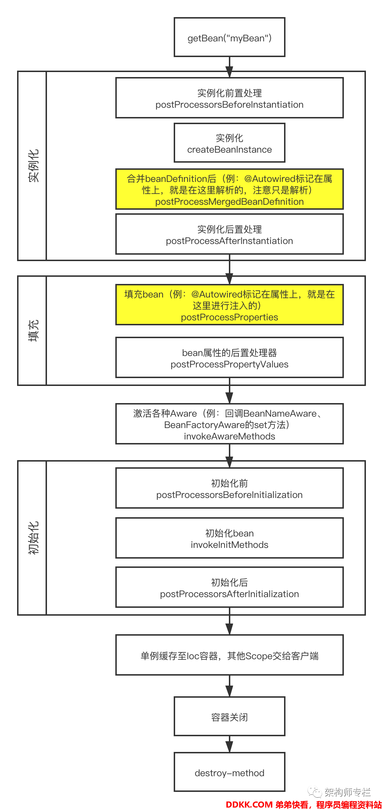

# SourceCode


# Autowired





## AutowiredAnnotationBeanPostProcessor


```java
public class AutowiredAnnotationBeanPostProcessor extends InstantiationAwareBeanPostProcessorAdapter
    implements MergedBeanDefinitionPostProcessor, PriorityOrdered, BeanFactoryAware {


    @Override
    public void postProcessMergedBeanDefinition(RootBeanDefinition beanDefinition, Class<?> beanType, String beanName) {
        // 寻找bean中所有被@Autowired注释的属性,并将属性封装成InjectedElement类型
        InjectionMetadata metadata = findAutowiringMetadata(beanName, beanType, null);
        metadata.checkConfigMembers(beanDefinition);
    }

    // 该方法在postProcessMergedBeanDefinition()之后调用
    @Override
    public PropertyValues postProcessProperties(PropertyValues pvs, Object bean, String beanName) {
        // 寻找通过@Autowired注解的属性或者方法
        InjectionMetadata metadata = findAutowiringMetadata(beanName, bean.getClass(), pvs);
        try {
            // 注入,调用InjectionMetadata#inject
            metadata.inject(bean, beanName, pvs);
        }
        catch (BeanCreationException ex) {
            throw ex;
        }
        catch (Throwable ex) {
            throw new BeanCreationException(beanName, "Injection of autowired dependencies failed", ex);
        }
        return pvs;
    }

    // 寻找bean中所有被@Autowired注释的属性,并将属性封装成InjectedElement类型
    private InjectionMetadata findAutowiringMetadata(String beanName, Class<?> clazz, @Nullable PropertyValues pvs) {
        // Fall back to class name as cache key, for backwards compatibility with custom callers.
        // 获取缓存的key值,一般以beanName做key
        String cacheKey = (StringUtils.hasLength(beanName) ? beanName : clazz.getName());
        // Quick check on the concurrent map first, with minimal locking.
        // 从缓存中获取metadata
        InjectionMetadata metadata = this.injectionMetadataCache.get(cacheKey);
        // 检测metadata是否需要更新
        if (InjectionMetadata.needsRefresh(metadata, clazz)) {
            synchronized (this.injectionMetadataCache) {
                metadata = this.injectionMetadataCache.get(cacheKey);
                if (InjectionMetadata.needsRefresh(metadata, clazz)) {
                    if (metadata != null) {
                        metadata.clear(pvs);
                    }
                    // 通过clazz类,查找所有@Autowired的属性或者方法,并封装成InjectionMetadata类型
                    metadata = buildAutowiringMetadata(clazz);
                    // 将metadata加入缓存
                    this.injectionMetadataCache.put(cacheKey, metadata);
                }
            }
        }
        return metadata;
    }

    /**
     * 核心代码
     *
     * 1.外层 do … while …的循环被用于递归的查找父类的@Autowired属性或方法
     * 2.通过反射的方式获取到所有属性并循环验证每一个属性是否被@Autowired注解
     * 3.将查找到包含@Autowired注解的filed封装成AutowiredFieldElement,加入到列表中
     * 4.循环查找在方法上的注解
     * 5.将找到的方法封装成AutowiredMethodElement,并加入列表
     */
    private InjectionMetadata buildAutowiringMetadata(final Class<?> clazz) {
        // 查看clazz是否有Autowired注解
        if (!AnnotationUtils.isCandidateClass(clazz, this.autowiredAnnotationTypes)) {
            return InjectionMetadata.EMPTY;
        }
        // AutowiredFieldElement,AutowiredMethodElement均继承了InjectionMetadata.InjectedElement
        // 因此这个列表可以保存注解的属性和被注解的方法
        List<InjectionMetadata.InjectedElement> elements = new ArrayList<>();
        Class<?> targetClass = clazz;

        // 1. 通过do while循环,递归的往直接继承的父类寻找@Autowired
        do {
            final List<InjectionMetadata.InjectedElement> currElements = new ArrayList<>();

            // 2. 通过反射,获取所有属性,doWithLocalFields则是循环的对每个属性应用以下匿名方法
            ReflectionUtils.doWithLocalFields(targetClass, field -> {
                // 判断当前field属性是否含有@Autowired的注解
                MergedAnnotation<?> ann = findAutowiredAnnotation(field);
                if (ann != null) {
                    // 返回该属性在类中的修饰符,如果等于static常量,则抛出异常,@Autowired不允许注解在静态属性上
                    if (Modifier.isStatic(field.getModifiers())) {
                        if (logger.isInfoEnabled()) {
                            logger.info("Autowired annotation is not supported on static fields: " + field);
                        }
                        return;
                    }
                    // @Autowired有required属性,获取required的值,默认为true
                    boolean required = determineRequiredStatus(ann);
                    // 3. 将field封装成InjectedElement,并添加到集合中,这里用的是AutowiredFieldElement
                    currElements.add(new AutowiredFieldElement(field, required));
                }
            });

            // 4. @Autowired可以注解在方法上
            ReflectionUtils.doWithLocalMethods(targetClass, method -> {
                Method bridgedMethod = BridgeMethodResolver.findBridgedMethod(method);
                if (!BridgeMethodResolver.isVisibilityBridgeMethodPair(method, bridgedMethod)) {
                    return;
                }
                MergedAnnotation<?> ann = findAutowiredAnnotation(bridgedMethod);
                if (ann != null && method.equals(ClassUtils.getMostSpecificMethod(method, clazz))) {
                    if (Modifier.isStatic(method.getModifiers())) {
                        if (logger.isInfoEnabled()) {
                            logger.info("Autowired annotation is not supported on static methods: " + method);
                        }
                        return;
                    }
                    if (method.getParameterCount() == 0) {
                        if (logger.isInfoEnabled()) {
                            logger.info("Autowired annotation should only be used on methods with parameters: " +
                                        method);
                        }
                    }
                    boolean required = determineRequiredStatus(ann);
                    PropertyDescriptor pd = BeanUtils.findPropertyForMethod(bridgedMethod, clazz);
                    // 5. 将方法封装成InjectedElement,并添加到集合中,这里用的是AutowiredMethodElement
                    currElements.add(new AutowiredMethodElement(method, required, pd));
                }
            });

            elements.addAll(0, currElements);
            // 返回直接继承的父类
            targetClass = targetClass.getSuperclass();
        }
        // 如果父类不为空则需要把父类的@Autowired属性或方法也找出
        while (targetClass != null && targetClass != Object.class);
        // 6. new InjectionMetadata(clazz, elements),将找到的所有的待注入属性或方法生成metadata返回
        return InjectionMetadata.forElements(elements, clazz);
    }

}
```


## InjectionMetadata


```java
package org.springframework.beans.factory.annotation;


/**
 * Internal class for managing injection metadata.
 * Not intended for direct use in applications.
 *
 * <p>Used by {@link AutowiredAnnotationBeanPostProcessor},
 * {@link org.springframework.context.annotation.CommonAnnotationBeanPostProcessor} and
 * {@link org.springframework.orm.jpa.support.PersistenceAnnotationBeanPostProcessor}.
 */
public class InjectionMetadata {

    /**
	 * An empty {@code InjectionMetadata} instance with no-op callbacks.
	 * @since 5.2
	 */
    public static final InjectionMetadata EMPTY = new InjectionMetadata(Object.class, Collections.emptyList()) {
        @Override
        protected boolean needsRefresh(Class<?> clazz) {
            return false;
        }
        @Override
        public void checkConfigMembers(RootBeanDefinition beanDefinition) {
        }
        @Override
        public void inject(Object target, @Nullable String beanName, @Nullable PropertyValues pvs) {
        }
        @Override
        public void clear(@Nullable PropertyValues pvs) {
        }
    };

    private final Class<?> targetClass;

    private final Collection<InjectedElement> injectedElements;

    @Nullable
    private volatile Set<InjectedElement> checkedElements;

    /**
	 * Create a new {@code InjectionMetadata instance}.
	 * <p>Preferably use {@link #forElements} for reusing the {@link #EMPTY}
	 * instance in case of no elements.
	 * @param targetClass the target class
	 * @param elements the associated elements to inject
	 * @see #forElements
	 */
    public InjectionMetadata(Class<?> targetClass, Collection<InjectedElement> elements) {
        this.targetClass = targetClass;
        this.injectedElements = elements;
    }


    /**
	 * Determine whether this metadata instance needs to be refreshed.
	 * @param clazz the current target class
	 * @return {@code true} indicating a refresh, {@code false} otherwise
	 * @since 5.2.4
	 */
    protected boolean needsRefresh(Class<?> clazz) {
        return this.targetClass != clazz;
    }

    public void checkConfigMembers(RootBeanDefinition beanDefinition) {
        Set<InjectedElement> checkedElements = new LinkedHashSet<>(this.injectedElements.size());
        for (InjectedElement element : this.injectedElements) {
            Member member = element.getMember();
            if (!beanDefinition.isExternallyManagedConfigMember(member)) {
                beanDefinition.registerExternallyManagedConfigMember(member);
                checkedElements.add(element);
            }
        }
        this.checkedElements = checkedElements;
    }

    /**
     * 注入
     * 利用for循环,遍历刚刚查到的elements列表,进行注入
     * 这里的element有可能是AutowiredFieldElement或AutowiredMethodElement,各自代表@Autowired注解在属性上、以及注解在方法上的2种不同元素.因此他们调用的element.inject(target, beanName, pvs)也是不一样的
     */
    public void inject(Object target, @Nullable String beanName, @Nullable PropertyValues pvs) throws Throwable {
        // 获取所有需要被注入的元素
        Collection<InjectedElement> checkedElements = this.checkedElements;
        Collection<InjectedElement> elementsToIterate =
            (checkedElements != null ? checkedElements : this.injectedElements);
        if (!elementsToIterate.isEmpty()) {
            for (InjectedElement element : elementsToIterate) {
                // 循环注入,这里有可能是AutowiredFieldElement也可能AutowiredMethodElement,因此调用的inject是2个不同的方法
                element.inject(target, beanName, pvs);
            }
        }
    }

    /**
	 * Clear property skipping for the contained elements.
	 * @since 3.2.13
	 */
    public void clear(@Nullable PropertyValues pvs) {
        Collection<InjectedElement> checkedElements = this.checkedElements;
        Collection<InjectedElement> elementsToIterate =
            (checkedElements != null ? checkedElements : this.injectedElements);
        if (!elementsToIterate.isEmpty()) {
            for (InjectedElement element : elementsToIterate) {
                element.clearPropertySkipping(pvs);
            }
        }
    }


    /**
	 * Return an {@code InjectionMetadata} instance, possibly for empty elements.
	 * @param elements the elements to inject (possibly empty)
	 * @param clazz the target class
	 * @return a new {@link #InjectionMetadata(Class, Collection)} instance,
	 * or {@link #EMPTY} in case of no elements
	 * @since 5.2
	 */
    public static InjectionMetadata forElements(Collection<InjectedElement> elements, Class<?> clazz) {
        return (elements.isEmpty() ? new InjectionMetadata(clazz, Collections.emptyList()) :
                new InjectionMetadata(clazz, elements));
    }

    /**
	 * Check whether the given injection metadata needs to be refreshed.
	 * @param metadata the existing metadata instance
	 * @param clazz the current target class
	 * @return {@code true} indicating a refresh, {@code false} otherwise
	 * @see #needsRefresh(Class)
	 */
    public static boolean needsRefresh(@Nullable InjectionMetadata metadata, Class<?> clazz) {
        return (metadata == null || metadata.needsRefresh(clazz));
    }


    /**
	 * A single injected element.
	 */
    public abstract static class InjectedElement {

        protected final Member member;

        protected final boolean isField;

        @Nullable
        protected final PropertyDescriptor pd;

        @Nullable
        protected volatile Boolean skip;

        protected InjectedElement(Member member, @Nullable PropertyDescriptor pd) {
            this.member = member;
            this.isField = (member instanceof Field);
            this.pd = pd;
        }

        public final Member getMember() {
            return this.member;
        }

        protected final Class<?> getResourceType() {
            if (this.isField) {
                return ((Field) this.member).getType();
            }
            else if (this.pd != null) {
                return this.pd.getPropertyType();
            }
            else {
                return ((Method) this.member).getParameterTypes()[0];
            }
        }

        protected final void checkResourceType(Class<?> resourceType) {
            if (this.isField) {
                Class<?> fieldType = ((Field) this.member).getType();
                if (!(resourceType.isAssignableFrom(fieldType) || fieldType.isAssignableFrom(resourceType))) {
                    throw new IllegalStateException("Specified field type [" + fieldType +
                                                    "] is incompatible with resource type [" + resourceType.getName() + "]");
                }
            }
            else {
                Class<?> paramType =
                    (this.pd != null ? this.pd.getPropertyType() : ((Method) this.member).getParameterTypes()[0]);
                if (!(resourceType.isAssignableFrom(paramType) || paramType.isAssignableFrom(resourceType))) {
                    throw new IllegalStateException("Specified parameter type [" + paramType +
                                                    "] is incompatible with resource type [" + resourceType.getName() + "]");
                }
            }
        }

        /**
		 * Either this or {@link #getResourceToInject} needs to be overridden.
		 */
        protected void inject(Object target, @Nullable String requestingBeanName, @Nullable PropertyValues pvs)
            throws Throwable {

            if (this.isField) {
                Field field = (Field) this.member;
                ReflectionUtils.makeAccessible(field);
                field.set(target, getResourceToInject(target, requestingBeanName));
            }
            else {
                if (checkPropertySkipping(pvs)) {
                    return;
                }
                try {
                    Method method = (Method) this.member;
                    ReflectionUtils.makeAccessible(method);
                    method.invoke(target, getResourceToInject(target, requestingBeanName));
                }
                catch (InvocationTargetException ex) {
                    throw ex.getTargetException();
                }
            }
        }

        /**
		 * Check whether this injector's property needs to be skipped due to
		 * an explicit property value having been specified. Also marks the
		 * affected property as processed for other processors to ignore it.
		 */
        protected boolean checkPropertySkipping(@Nullable PropertyValues pvs) {
            Boolean skip = this.skip;
            if (skip != null) {
                return skip;
            }
            if (pvs == null) {
                this.skip = false;
                return false;
            }
            synchronized (pvs) {
                skip = this.skip;
                if (skip != null) {
                    return skip;
                }
                if (this.pd != null) {
                    if (pvs.contains(this.pd.getName())) {
                        // Explicit value provided as part of the bean definition.
                        this.skip = true;
                        return true;
                    }
                    else if (pvs instanceof MutablePropertyValues) {
                        ((MutablePropertyValues) pvs).registerProcessedProperty(this.pd.getName());
                    }
                }
                this.skip = false;
                return false;
            }
        }

        /**
		 * Clear property skipping for this element.
		 * @since 3.2.13
		 */
        protected void clearPropertySkipping(@Nullable PropertyValues pvs) {
            if (pvs == null) {
                return;
            }
            synchronized (pvs) {
                if (Boolean.FALSE.equals(this.skip) && this.pd != null && pvs instanceof MutablePropertyValues) {
                    ((MutablePropertyValues) pvs).clearProcessedProperty(this.pd.getName());
                }
            }
        }

        /**
		 * Either this or {@link #inject} needs to be overridden.
		 */
        @Nullable
        protected Object getResourceToInject(Object target, @Nullable String requestingBeanName) {
            return null;
        }

        @Override
        public boolean equals(@Nullable Object other) {
            if (this == other) {
                return true;
            }
            if (!(other instanceof InjectedElement)) {
                return false;
            }
            InjectedElement otherElement = (InjectedElement) other;
            return this.member.equals(otherElement.member);
        }

        @Override
        public int hashCode() {
            return this.member.getClass().hashCode() * 29 + this.member.getName().hashCode();
        }

        @Override
        public String toString() {
            return getClass().getSimpleName() + " for " + this.member;
        }
    }

}
```


## AutowiredFieldElement


```java
// 字段注入 
private class AutowiredFieldElement extends InjectionMetadata.InjectedElement {
    @Override
    protected void inject(Object bean, @Nullable String beanName, @Nullable PropertyValues pvs) throws Throwable {
        Field field = (Field) this.member;
        Object value;
        if (this.cached) {
            value = resolvedCachedArgument(beanName, this.cachedFieldValue);
        }
        else {
            // 专门用于注入的包装类，包装构造函数参数，方法参数或字段
            DependencyDescriptor desc = new DependencyDescriptor(field, this.required);
            // 设置class
            desc.setContainingClass(bean.getClass());
            // 需要被自动注入的beanNames，这里只有可能 = 1，方法注入时才有可能为多个
            Set<String> autowiredBeanNames = new LinkedHashSet<>(1);
            Assert.state(beanFactory != null, "No BeanFactory available");
            TypeConverter typeConverter = beanFactory.getTypeConverter();// 获取类型转换器
            try {
                // 通过beanFactory获取属性对应的值，比如需要调用getBean("b")获取依赖的属性单例，并且通过自动转型转为需要的类型
                value = beanFactory.resolveDependency(desc, beanName, autowiredBeanNames, typeConverter);
            }
            catch (BeansException ex) {
                throw new UnsatisfiedDependencyException(null, beanName, new InjectionPoint(field), ex);
            }
            synchronized (this) {
                if (!this.cached) {
                    if (value != null || this.required) {
                        this.cachedFieldValue = desc;
                        // 注册依赖，
                        registerDependentBeans(beanName, autowiredBeanNames);
                        // 因为是属性注入，因此这里只有可能等于1
                        if (autowiredBeanNames.size() == 1) {
                            String autowiredBeanName = autowiredBeanNames.iterator().next();
                            if (beanFactory.containsBean(autowiredBeanName) &&
                                beanFactory.isTypeMatch(autowiredBeanName, field.getType())) {
                                // 缓存当前value
                                this.cachedFieldValue = new ShortcutDependencyDescriptor(
                                    desc, autowiredBeanName, field.getType());
                            }
                        }
                    }
                    else {
                        this.cachedFieldValue = null;
                    }
                    this.cached = true;
                }
            }
        }
        if (value != null) {
            // 通过反射，将value值设置到bean中
            ReflectionUtils.makeAccessible(field);
            field.set(bean, value);
        }
    }
}
```


## AutowiredMethodElement


```java
// 方法注入
private class AutowiredMethodElement extends InjectionMetadata.InjectedElement {


    @Override
    protected void inject(Object bean, @Nullable String beanName, @Nullable PropertyValues pvs) throws Throwable {
        if (checkPropertySkipping(pvs)) {
            return;
        }
        // @Autowired标注在方法上
        Method method = (Method) this.member;
        Object[] arguments;
        if (this.cached) {
            // Shortcut for avoiding synchronization...
            // 有缓存
            arguments = resolveCachedArguments(beanName);
        }
        else {
            // 没缓存，直接获取方法上所有的参数
            int argumentCount = method.getParameterCount();
            arguments = new Object[argumentCount];
            DependencyDescriptor[] descriptors = new DependencyDescriptor[argumentCount];
            Set<String> autowiredBeans = new LinkedHashSet<>(argumentCount);
            Assert.state(beanFactory != null, "No BeanFactory available");
            TypeConverter typeConverter = beanFactory.getTypeConverter();
            // 循环所有参数
            for (int i = 0; i < arguments.length; i++) {
                MethodParameter methodParam = new MethodParameter(method, i);
                DependencyDescriptor currDesc = new DependencyDescriptor(methodParam, this.required);
                currDesc.setContainingClass(bean.getClass());
                descriptors[i] = currDesc;
                try {
                    // 通过beanFactory，获取代注入的bean，并进行类型转换
                    Object arg = beanFactory.resolveDependency(currDesc, beanName, autowiredBeans, typeConverter);
                    if (arg == null && !this.required) {
                        arguments = null;
                        break;
                    }
                    arguments[i] = arg;
                }
                catch (BeansException ex) {
                    throw new UnsatisfiedDependencyException(null, beanName, new InjectionPoint(methodParam), ex);
                }
            }
            synchronized (this) {
                if (!this.cached) {
                    if (arguments != null) {
                        DependencyDescriptor[] cachedMethodArguments = Arrays.copyOf(descriptors, arguments.length);
                        // 注册依赖
                        registerDependentBeans(beanName, autowiredBeans);
                        // 如果自动注入的个数 = 参数个数，则缓存
                        if (autowiredBeans.size() == argumentCount) {
                            Iterator<String> it = autowiredBeans.iterator();
                            Class<?>[] paramTypes = method.getParameterTypes();
                            for (int i = 0; i < paramTypes.length; i++) {
                                String autowiredBeanName = it.next();
                                if (beanFactory.containsBean(autowiredBeanName) &&
                                    beanFactory.isTypeMatch(autowiredBeanName, paramTypes[i])) {
                                    // 缓存
                                    cachedMethodArguments[i] = new ShortcutDependencyDescriptor(
                                        descriptors[i], autowiredBeanName, paramTypes[i]);
                                }
                            }
                        }
                        // 缓存方法
                        this.cachedMethodArguments = cachedMethodArguments;
                    }
                    else {
                        this.cachedMethodArguments = null;
                    }
                    this.cached = true;
                }
            }
        }
        if (arguments != null) {
            try {
                // 反射调用注入方法，将获取到的所有bean作为参数
                ReflectionUtils.makeAccessible(method);
                method.invoke(bean, arguments);
            }
            catch (InvocationTargetException ex) {
                throw ex.getTargetException();
            }
        }
    }
}
```


