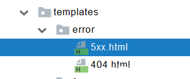
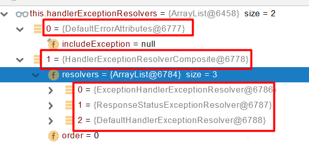

# SpringWeb

# 异常处理

## 默认规则

- 默认情况下,Spring Boot提供`/error`处理所有错误的映射
- 对于机器客户端,它将生成JSON响应,其中包含错误,HTTP状态和异常消息的详细信息;对于浏览器客户端,响应一个whitelabel错误视图,以HTML格式呈现相同的数据
- 如果需要后端显示自定义错误页面,需要添加View解析为error
- 要完全替换默认行为,可以实现 `ErrorController `并注册该类型的Bean定义,或添加`ErrorAttributes类型的组件`以使用现有机制但替换其内容
- 如果引入了thymeleaf,则定义在error/下的4xx,5xx页面会被自动解析

## 自定义异常

- 自定义错误页:`error/404.html,error/5xx.html`;有精确的错误状态码就精确匹配;没有就找 5xx.html;如果都没有就触发白页
- `@ControllerAdvice+@ExceptionHandler`: 处理全局异常,底层是`ExceptionHandlerExceptionResolver`
- `@ResponseStatus+自定义异常(继承Exception或其他Exception)`:在自定义异常类上添加`@ResponseStatus`,发生异常时由 `ResponseStatusExceptionResolver`对注解进行解析后调用
- Spring底层的异常,如 参数类型转换异常: `DefaultHandlerExceptionResolver` 处理框架底层的异常
  - `response.sendError(HttpServletResponse.SC_BAD_REQUEST, ex.getMessage());`
- 自定义实现 HandlerExceptionResolver 处理异常,可以作为默认的全局异常处理规则
- ErrorViewResolver: 实现自定义处理异常:
  - response.sendError:error请求就会转给controller
  - 你的异常没有任何人能处理,tomcat底层 response.sendError,error请求就会转给controller
  - basicErrorController 要去的页面地址是ErrorViewResolver

## 自动配置

- ErrorMvcAutoConfiguration:自动配置异常处理规则
    - `BasicErrorController`: basicErrorController(json+白页 适配响应),处理默认`/error`路径的请求,页面响应`new ModelAndView("error", model)
        - 容器中有组件 View**->**id是error,响应默认错误页
        - 容器中放组件 BeanNameViewResolver(视图解析器),按照返回的视图名作为组件的id去容器中找View对象
    - `DefaultErrorViewResolver`: 如果发生错误,会以HTTP的状态码作为视图页地址(viewName),找到真正的页面
    - 如果想要返回页面,就会找error视图StaticView,默认是一个白页
    

## 流程

- 执行目标方法,目标方法运行期间有任何异常都会被catch,而且标志当前请求结束,并且用 dispatchException
- 进入视图解析流程进行页面渲染:`processDispatchResult(processedRequest, response, mappedHandler, mv, dispatchException);`
- `mv = processHandlerException`: 处理handler发生的异常,处理完成返回ModelAndView
  - 遍历所有的handlerExceptionResolvers,看谁能处理当前异常
  - 系统默认的异常解析器

- DefaultErrorAttributes先来处理异常,把异常信息保存到rrequest域,并且返回null
- 默认没有任何人能处理异常,所以异常会被抛出
  - 如果没有任何人能处理最终底层就会发送 /error 请求,会被底层的BasicErrorController处理
  - 解析错误视图:遍历所有的ErrorViewResolver  看谁能解析
  - 默认的DefaultErrorViewResolver ,作用是把响应状态码作为错误页的地址,error/500.html
  - 模板引擎最终响应这个页面error/500.html